# MCU ROM Cold Boot Process Sequence Diagram

This diagram shows the sequence of operations in the `ColdBoot::run()` function, which implements the initial boot flow when the MCU powers on.

## Cold Boot Process Flow

```mermaid
sequenceDiagram
    participant ROM as MCU ROM
    participant MCI as MCI Controller
    participant LC as Lifecycle Controller
    participant OTP as OTP Controller
    participant I3C as I3C Peripheral / Recover IF
    participant SOC as SoC Manager / Caliptra Core
    participant Flash as Flash Driver

    Note over ROM, Flash: Cold Boot Flow Entry Point
    ROM->>MCI: Set ColdBootFlowStarted checkpoint
    ROM->>MCI: caliptra_boot_go()
    ROM->>MCI: Set CaliptraBootGoAsserted checkpoint & milestone

    alt Core Test Mode
        ROM->>ROM: Wait for test signal (wire[1] bit 30)
    end

    ROM->>LC: init()
    LC-->>ROM: Lifecycle controller ready
    ROM->>MCI: Set LifecycleControllerInitialized checkpoint

    alt Lifecycle Transition Required
        ROM->>MCI: Set LifecycleTransitionStarted checkpoint
        ROM->>LC: transition(state, token)
        LC-->>ROM: Transition complete
        ROM->>MCI: Set LifecycleTransitionComplete checkpoint
        ROM->>ROM: Halt (lifecycle transition mode)
    end

    ROM->>OTP: init()
    OTP-->>ROM: OTP controller ready
    ROM->>MCI: Set OtpControllerInitialized checkpoint

    alt Lifecycle Token Burning Required
        ROM->>MCI: Set LifecycleTokenBurningStarted checkpoint
        ROM->>OTP: check_error()
        OTP-->>ROM: Error status
        ROM->>OTP: burn_lifecycle_tokens(tokens)
        OTP-->>ROM: Tokens burned
        ROM->>MCI: Set LifecycleTokenBurningComplete checkpoint
        ROM->>ROM: Halt (token burning mode)
    end

    ROM->>OTP: read_fuses()
    OTP-->>ROM: Fuse data
    ROM->>MCI: Set FusesReadFromOtp checkpoint

    alt Flash Partition Driver Not Available
        ROM->>SOC: set_cptra_wdt_cfg(0, cfg0)
        ROM->>SOC: set_cptra_wdt_cfg(1, cfg1)
        ROM->>MCI: set_nmi_vector(rom_offset)
        ROM->>MCI: configure_wdt(cfg0, cfg1)
        ROM->>MCI: Set WatchdogConfigured checkpoint
    end

    ROM->>I3C: configure(static_addr, true)
    I3C-->>ROM: I3C configured
    ROM->>MCI: Set I3cInitialized checkpoint

    ROM->>SOC: ready_for_fuses()
    loop Wait for Caliptra
        SOC-->>ROM: Not ready
    end
    SOC-->>ROM: Ready for fuses
    ROM->>MCI: Set CaliptraReadyForFuses checkpoint

    ROM->>SOC: set_axi_users(straps)
    ROM->>MCI: Set AxiUsersConfigured checkpoint

    ROM->>SOC: populate_fuses(fuses, mci)
    SOC-->>ROM: Fuses populated
    ROM->>MCI: Set FusesPopulatedToCaliptra checkpoint

    ROM->>SOC: fuse_write_done()
    loop Wait for Fuse Write Complete
        ROM->>SOC: ready_for_fuses()
        SOC-->>ROM: Still ready (writing)
    end
    SOC-->>ROM: Not ready (write complete)
    ROM->>MCI: Set FuseWriteComplete checkpoint & milestone

    alt Core Test Mode
        ROM->>ROM: Wait for test signal (wire[1] bit 31)
    end

    loop Wait for Mailbox Ready
        ROM->>SOC: ready_for_mbox()
        alt Caliptra Fatal Error
            ROM->>SOC: cptra_fw_fatal_error()
            SOC-->>ROM: Fatal error detected
            ROM->>ROM: Fatal error exit
        else
            SOC-->>ROM: Not ready
        end
    end
    SOC-->>ROM: Ready for mailbox
    ROM->>MCI: Set CaliptraReadyForMailbox checkpoint

    alt DOT (Device Ownership Transfer) Required
        ROM->>Flash: read(dot_blob, 0)
        Flash-->>ROM: DOT blob data
        ROM->>MCI: Set DeviceOwnershipTransferFlashRead checkpoint
        alt DOT blob not empty
            ROM->>ROM: device_ownership_transfer::dot_flow()
        else
            Note over ROM: Skip DOT flow (empty blob)
        end
    end

    ROM->>SOC: start_mailbox_req(RI_DOWNLOAD_FIRMWARE)
    SOC-->>ROM: Mailbox request sent
    ROM->>MCI: Set RiDownloadFirmwareCommandSent checkpoint

    ROM->>SOC: finish_mailbox_resp()
    SOC-->>ROM: Response complete
    ROM->>MCI: Set RiDownloadFirmwareComplete checkpoint & milestone

    alt Hardware 2.1+ and Flash Driver Available
        ROM->>MCI: Set FlashRecoveryFlowStarted checkpoint
        ROM->>ROM: recovery::load_flash_image_to_recovery()
        Note over ROM, Flash: Execute recovery state machine (see RECOVERY_SEQUENCE_DIAGRAM.md)
        ROM->>MCI: Set FlashRecoveryFlowComplete checkpoint & milestone
    end

    ROM->>SOC: wait_for_firmware_ready(mci)
    loop Wait for Firmware
        SOC-->>ROM: Firmware not ready
    end
    SOC-->>ROM: Firmware ready
    ROM->>MCI: Set FirmwareReadyDetected checkpoint

    alt MCU Image Verifier Available
        ROM->>ROM: Read firmware header from SRAM
        ROM->>ROM: image_verifier.verify_header()
        alt Verification Failed
            ROM->>ROM: Fatal error exit
        end
    end

    ROM->>ROM: Check firmware at SRAM offset
    alt Invalid Firmware (zero)
        ROM->>ROM: Fatal error exit
    else
        ROM->>MCI: Set FirmwareValidationComplete checkpoint
    end

    loop Wait for Caliptra RT Ready
        ROM->>SOC: ready_for_runtime()
        SOC-->>ROM: Not ready
    end
    SOC-->>ROM: Runtime ready
    ROM->>MCI: Set CaliptraRuntimeReady checkpoint

    alt Field Entropy Programming Required
        ROM->>MCI: Set FieldEntropyProgrammingStarted checkpoint
        loop For Each Partition (0-3)
            alt Partition Enabled
                ROM->>SOC: start_mailbox_req(FE_PROG, partition)
                SOC-->>ROM: FE_PROG request sent
                ROM->>SOC: finish_mailbox_resp()
                SOC-->>ROM: FE_PROG complete
                ROM->>MCI: Set FieldEntropyPartitionNComplete checkpoint
            end
        end
        ROM->>MCI: Set FieldEntropyProgrammingComplete checkpoint
    end

    ROM->>I3C: disable_recovery()
    I3C-->>ROM: Recovery disabled

    ROM->>MCI: Set ColdBootFlowComplete checkpoint & milestone
    ROM->>MCI: trigger_warm_reset()
    Note over ROM, Flash: System Reset → Firmware Boot Flow
```

## Cold Boot Checkpoints Summary

| Checkpoint | Description | Action |
|------------|-------------|--------|
| **ColdBootFlowStarted** | Entry point | Initialize cold boot process |
| **CaliptraBootGoAsserted** | Boot signal sent | Signal Caliptra to start |
| **LifecycleControllerInitialized** | LC ready | Lifecycle controller operational |
| **LifecycleTransitionStarted** | LC transition | Optional lifecycle state change |
| **LifecycleTransitionComplete** | LC done | Halt after transition |
| **OtpControllerInitialized** | OTP ready | OTP controller operational |
| **LifecycleTokenBurningStarted** | Token burn | Optional token burning |
| **LifecycleTokenBurningComplete** | Burn done | Halt after burning |
| **FusesReadFromOtp** | Fuses loaded | Fuse data retrieved |
| **WatchdogConfigured** | WDT setup | Watchdog timers configured |
| **I3cInitialized** | I3C ready | I3C peripheral configured |
| **CaliptraReadyForFuses** | Caliptra ready | Ready to receive fuses |
| **AxiUsersConfigured** | AXI setup | AXI user configuration |
| **FusesPopulatedToCaliptra** | Fuses sent | Fuses written to Caliptra |
| **FuseWriteComplete** | Write done | Fuse programming complete |
| **CaliptraReadyForMailbox** | Mbox ready | Ready for mailbox commands |
| **DeviceOwnershipTransferFlashRead** | DOT read | DOT blob loaded |
| **RiDownloadFirmwareCommandSent** | RI_DL sent | Recovery interface download |
| **RiDownloadFirmwareComplete** | RI_DL done | Firmware download complete |
| **FlashRecoveryFlowStarted** | Recovery start | Flash recovery initiated |
| **FlashRecoveryFlowComplete** | Recovery done | Flash recovery complete |
| **FirmwareReadyDetected** | FW ready | Firmware loaded and ready |
| **FirmwareValidationComplete** | FW valid | Firmware verification passed |
| **CaliptraRuntimeReady** | RT ready | Caliptra runtime operational |
| **FieldEntropyProgrammingStarted** | FE start | Field entropy programming |
| **FieldEntropyPartitionNComplete** | FE part done | Per-partition completion |
| **FieldEntropyProgrammingComplete** | FE done | All partitions programmed |
| **ColdBootFlowComplete** | Boot done | Cold boot process complete |

## Boot Milestones

| Milestone | Description | Significance |
|-----------|-------------|--------------|
| **CPTRA_BOOT_GO_ASSERTED** | Caliptra boot initiated | Critical startup signal |
| **CPTRA_FUSES_WRITTEN** | Fuse programming complete | Hardware configuration done |
| **RI_DOWNLOAD_COMPLETED** | Recovery interface done | Firmware download path ready |
| **FLASH_RECOVERY_FLOW_COMPLETED** | Flash recovery done | Recovery images loaded |
| **COLD_BOOT_FLOW_COMPLETE** | Cold boot complete | Ready for warm reset |

## Key Components

- **MCI Controller**: Hardware abstraction and flow control
- **Lifecycle Controller**: Security state management  
- **OTP Controller**: One-Time Programmable memory access
- **I3C Peripheral**: Recovery interface communication
- **SoC Manager / Caliptra Core**: Mailbox communication and cryptographic processing
- **Flash Driver**: Non-volatile storage access

## Error Handling

The cold boot flow uses several error handling strategies:
- **Fatal Errors**: Immediate halt on critical failures
- **Conditional Flows**: Optional operations based on parameters
- **Polling Loops**: Wait for hardware readiness with timeout protection
- **Verification**: Firmware and configuration validation

## Recovery Integration

In hardware version 2.1+, the cold boot flow integrates with the recovery system:
1. After Caliptra firmware download via recovery interface
2. Flash recovery flow loads additional images if flash driver available
3. Recovery state machine handles multi-image loading (see RECOVERY_SEQUENCE_DIAGRAM.md)
4. Recovery interface disabled after completion

## Boot Modes

The cold boot flow supports several specialized modes:
- **Normal Boot**: Standard initialization and firmware load
- **Lifecycle Transition**: Change security lifecycle state and halt
- **Token Burning**: Program lifecycle tokens and halt  
- **Core Test**: Special test mode with external synchronization
- **Field Entropy**: Optional entropy programming for security