# MCU ROM AXI Recovery Process Sequence Diagram

This diagram shows the sequence of operations in the `load_flash_image_to_recovery()` function, which implements a state machine-based recovery process for loading firmware images.

## AXI Recovery Process Flow

```mermaid
sequenceDiagram
    participant ROM as MCU ROM
    participant SM as State Machine
    participant I3C as I3C Peripheral / Recover IF
    participant Flash as Flash Driver

    Note over ROM, Flash: Recovery Process Entry Point
    ROM->>SM: Initialize Context & State Machine
    ROM->>I3C: Set recovery interface to AXI_DIRECT mode

    loop State Machine Loop (until Done)
        
        alt State: ReadProtCap
            SM->>I3C: Read PROT_CAP_2 register
            I3C-->>SM: Return protocol capabilities
            SM->>SM: Check device_status_support
            alt Device supports status
                SM->>SM: Transition to ReadDeviceStatus
            else Device doesn't support
                SM->>SM: Stay in ReadProtCap
            end
        end

        alt State: ReadDeviceStatus
            SM->>I3C: Read DEVICE_STATUS_0 register
            I3C-->>SM: Return device status
            alt Device is healthy (status=0x1)
                SM->>SM: Transition to Done
            else Device needs recovery (status=0x3)
                SM->>SM: Transition to WaitForRecoveryStatus
            end
        end

        alt State: WaitForRecoveryStatus
            SM->>I3C: Read RECOVERY_STATUS register
            I3C-->>SM: Return recovery status
            alt Status is AWAITING_IMAGE (0x1)
                SM->>SM: Extract recovery_image_index
                SM->>Flash: get_flash_image_info(image_id)
                Flash-->>SM: Return (offset, size)
                SM->>SM: Set flash_offset, image_size, transfer_offset=0
                SM->>I3C: Set indirect_fifo_ctrl_1 = image_size/4
                SM->>SM: Transition to TransferringImage
            end
        end

        alt State: TransferringImage
            loop Transfer Loop
                alt Transfer not complete
                    SM->>Flash: Read 4 bytes from flash_offset + transfer_offset
                    Flash-->>SM: Return 4 bytes of data
                    SM->>I3C: Write data to tti_tx_data_port
                    SM->>SM: Increment transfer_offset by 4
                    Note over SM: Print progress every 10%
                else Transfer complete
                    SM->>SM: Process TransferComplete event
                    SM->>SM: Transition to WaitForRecoveryPending
                end
            end
        end

        alt State: WaitForRecoveryPending
            SM->>I3C: Read DEVICE_STATUS_0 register
            I3C-->>SM: Return device status
            alt Status is RECOVERY_PENDING (0x4)
                SM->>SM: Transition to Activate
            end
        end

        alt State: Activate
            SM->>I3C: Write ACTIVATE_RECOVERY_IMAGE_CMD (0xF) to recovery_ctrl
            SM->>SM: Process CheckFwActivation event
            SM->>SM: Transition to CheckFwActivation
        end

        alt State: CheckFwActivation
            SM->>I3C: Read RECOVERY_STATUS register
            I3C-->>SM: Return recovery status
            alt Status is BOOTING_IMAGE (0x2)
                SM->>SM: Transition to ActivateCheckRecoveryStatus
            end
        end

        alt State: ActivateCheckRecoveryStatus
            SM->>I3C: Read RECOVERY_STATUS register
            I3C-->>SM: Return recovery status
            alt Status is AWAITING_IMAGE (0x1)
                Note over SM: Need another recovery image
                SM->>SM: Transition back to ReadDeviceStatus
            else Status is RECOVERY_SUCCESS (0x3)
                SM->>SM: Transition to Done
            end
        end

    end

    Note over ROM, Flash: Recovery Complete
    ROM->>I3C: Restore recovery interface to I3C mode
    ROM-->>ROM: Return Ok(())
```

## State Transitions Summary

| Current State | Event/Condition | Next State | Action |
|---------------|----------------|------------|--------|
| **ReadProtCap** | ProtCap supports device status | ReadDeviceStatus | Check protocol capabilities |
| **ReadDeviceStatus** | Device healthy (0x1) | Done | Recovery not needed |
| **ReadDeviceStatus** | Device needs recovery (0x3) | WaitForRecoveryStatus | Start recovery process |
| **WaitForRecoveryStatus** | Status awaiting image (0x1) | TransferringImage | Setup image transfer |
| **TransferringImage** | Transfer complete | WaitForRecoveryPending | Wait for processing |
| **WaitForRecoveryPending** | Status recovery pending (0x4) | Activate | Ready to activate |
| **Activate** | - | CheckFwActivation | Send activate command |
| **CheckFwActivation** | Status booting image (0x2) | ActivateCheckRecoveryStatus | Monitor activation |
| **ActivateCheckRecoveryStatus** | Status awaiting image (0x1) | ReadDeviceStatus | Need more images |
| **ActivateCheckRecoveryStatus** | Status recovery success (0x3) | Done | Recovery complete |

## Recovery Image Types

The system supports three types of recovery images based on the recovery image index:

- **Index 0**: Caliptra FMC/RT Image (`CALIPTRA_FMC_RT_IDENTIFIER`)
- **Index 1**: SoC Manifest (`SOC_MANIFEST_IDENTIFIER`) 
- **Index 2**: MCU Runtime (`MCU_RT_IDENTIFIER`)

## Key Components

- **State Machine**: Implements recovery flow logic with guard conditions
- **Context**: Maintains recovery state (image index, size, offsets)
- **Flash Driver**: Provides access to recovery images in flash memory
- **I3C Peripheral**: Hardware interface for recovery communication
- **Recovery Device**: External device being recovered

## Error Handling

The function uses `Result<(), ()>` return types throughout, with errors propagated up the call stack. Critical failure points include:
- Flash read operations
- Image header parsing
- Invalid recovery image indices
- Hardware register access failures