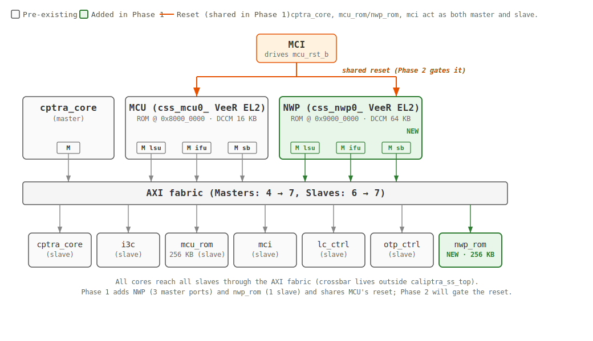
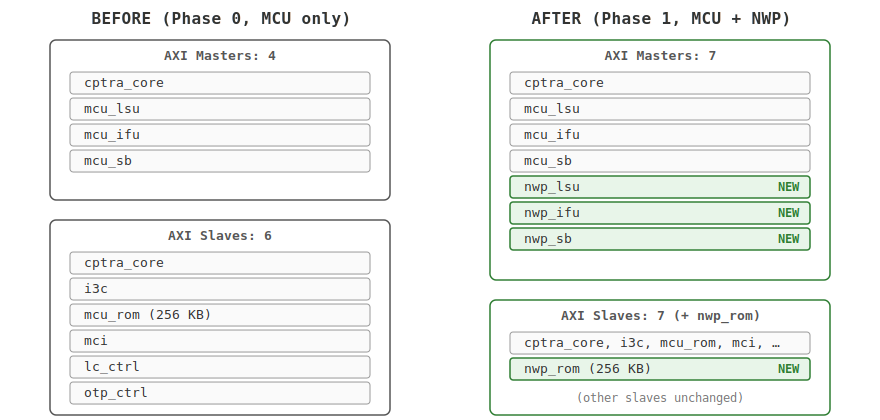
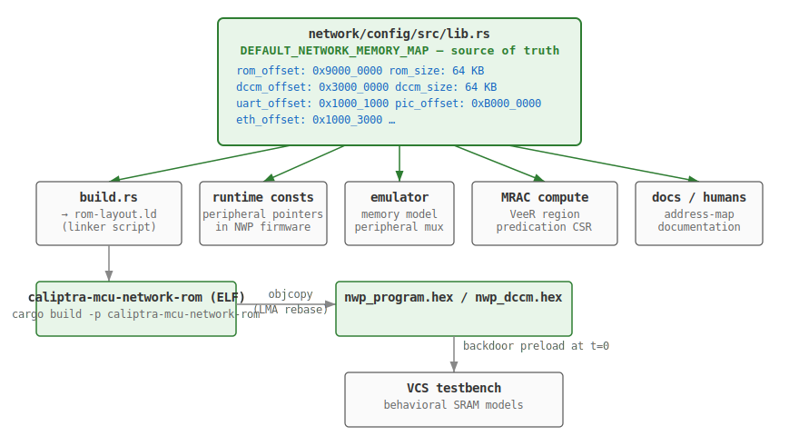
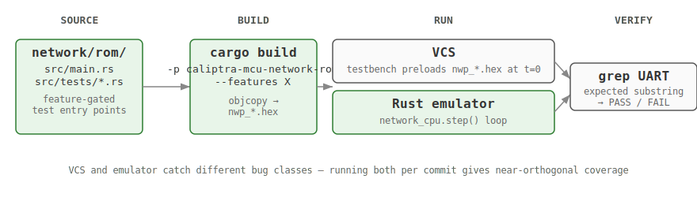
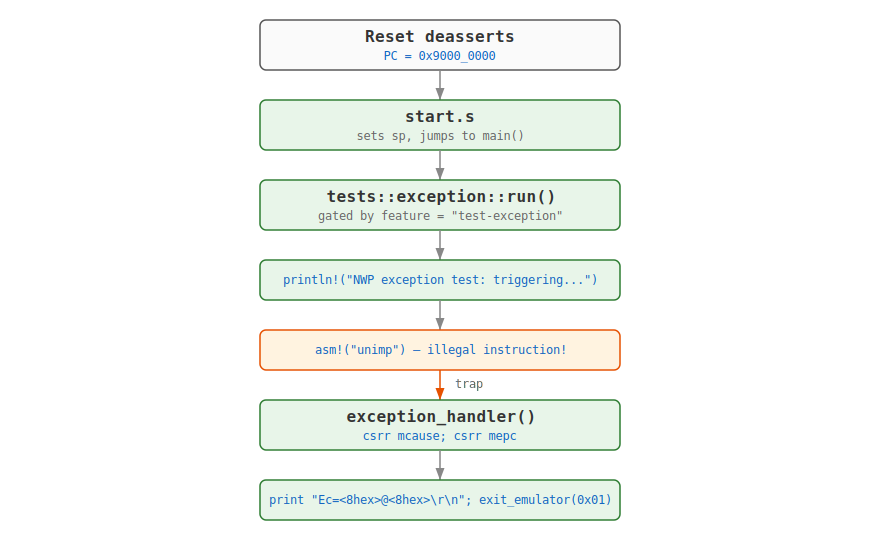

# NWP Phase 1 — Full Report

**Branch**: `dev/zahralak/nwp_phase1_rebased` (parent and `hw/caliptra-ss` submodule)
**Base**: rebased on `origin/main-2.1` (parent) + `origin/main` (submodule)
**Date**: 2026-06-02
**Companion docs**: `nwp_phase1_brief.md` (one-page summary), `nwp_uarch_spec.md` (full µarch spec; see §12.4 for the MCU→NWP test-parity matrix and §11 for the `ENABLE_NWP` OFF/ON coverage matrix).

---

## TL;DR

Phase 1 stands up a second VeeR EL2 RISC-V core — the **Network coProcessor** ("NWP") — alongside the existing MCU on the Caliptra Subsystem AXI fabric. The NWP has its own ROM (`0x9000_0000`), its own DCCM (`0x3000_0000`, 64 KB), its own PIC (`0xB000_0000`), and three new AXI master ports plus one new AXI slave port. The whole block is gated at compile time by an opt-in `ENABLE_NWP` macro on the RTL side; on the SW side the emulator runtime-gates NWP via `--network-rom <path>`, so CPU-only SKUs elaborate and run without NWP. Runtime reset gating (so MCU can hold/release NWP at runtime) is still Phase 2/3 — today, when `ENABLE_NWP` is on, NWP runs unconditionally with MCU. We exercised it in both VCS and the Rust emulator with three Rust self-tests (hello-world, DCCM integrity, exception trap) plus a C-language hello-world; all 4 pass live VCS sim (2026-06-01) and the 3 Rust tests pass on the emulator.

---

## How to read this document

Work split roughly 50/50 between **RTL** (in the `hw/caliptra-ss` submodule) and **firmware/emulator** (parent `caliptra-mcu-sw`). The 8 steps below are tagged **[RTL]**, **[FW]**, **[Emulator]**, or combinations like **[RTL+FW+Emulator]**, each with **What / How / Why / MCU baseline → NWP delta**. Diagrams in Steps 3, 5, 7.

---

## Phase 1 Big Picture



---

## Step 1 — Define the NWP's core configuration  *[RTL]*

### What
Generate a second VeeR EL2 core configuration tree, prefixed `css_nwp0_`, with the right memory layout and feature set for the network coprocessor.

### How
The NWP uses the same VeeR EL2 generator that produced `css_mcu0_`, invoked with a different parameter set:

```
veer -target=default -set=dccm_enable=1 -set=dccm_size=64 -set=dccm_region=0x3 \
     -set=iccm_enable=0 -set=pic_region=0xB -set=pmp_entries=64 \
     -set=user_mode=1 -set=reset_vec=0x90000000 ...
```

The generator emits an `css_nwp0_*`-prefixed source tree into `hw/caliptra-ss/src/riscv_core/veer_el2_nwp/` (vs MCU's `css_mcu0_*` tree).

### Why
A VeeR EL2 core's address regions and module/macro identifiers are baked into compile-time `` `define ``s at generator time, so two cores in the same elaboration unit need **non-overlapping regions** and **non-colliding prefixes**. MCU already owns `0x5/0x6` and `css_mcu0_*`, so NWP gets `0x3/0xB` and `css_nwp0_*`. NWP's DCCM also goes from MCU's 16 KB → 64 KB to hold network-protocol parsing buffers.

### MCU baseline → NWP delta

| Knob | MCU | NWP |
|---|---|---|
| Source tree / macro prefix | `riscv_core/veer_el2/`, `css_mcu0_*` | `riscv_core/veer_el2_nwp/`, `css_nwp0_*` |
| `dccm_size` | 16 KB | **64 KB** (network-protocol buffers) |
| `dccm_region` | `0x5` (`0x5000_0000`) | `0x3` (`0x3000_0000`) — non-overlapping |
| `pic_region` | `0x6` (`0x6000_0000`) | `0xB` (`0xB000_0000`) — non-overlapping |
| `reset_vec` | `0x8000_0000` | `0x9000_0000` — each core boots its own ROM |
| Other knobs (`iccm_enable=0`, `pmp_entries=64`, `user_mode=1`, AXI4) | — | identical to MCU |

**Sources**: `css_mcu0_common_defines.vh`, `css_nwp0_common_defines.vh`, `css_*_el2_param.vh`. The full generator command lives at the top of `css_*_common_defines.vh`.

---

## Step 2 — Wrap the core in a SoC-friendly module  *[RTL]*

### What
Put the bare VeeR `el2_veer_wrapper` inside a top-level module that exposes the VeeR memory interface as standard AXI4 ports plus debug/reset signals — the form the SoC integrator wants.

### How
Created `hw/caliptra-ss/src/nwp/rtl/nwp_top.sv` by mirroring `hw/caliptra-ss/src/mcu/rtl/mcu_top.sv` line-for-line:
- Same module skeleton
- Same boundary signal set (clk, rst_l, dbg_rst_l, NMI, JTAG, DMI, AXI ports)
- Instantiates `css_nwp0_el2_veer_wrapper` (vs MCU's `css_mcu0_el2_veer_wrapper`)
- Three AXI master interfaces (LSU, IFU, SB)

### Why
A SystemVerilog module can only resolve one macro prefix at a time, so cloning the MCU wrapper is faster than building macro-switching infrastructure. The wrapper also bridges VeeR's internal LSU/IFU/DMA interface to AXI4, giving NWP the same boundary as MCU — so the existing crossbar and address decoders route NWP transactions identically with no fabric changes.

### MCU baseline → NWP delta

| | MCU | NWP |
|---|---|---|
| Wrapper file | `mcu/rtl/mcu_top.sv` | `nwp/rtl/nwp_top.sv` |
| Inner core | `css_mcu0_el2_veer_wrapper` | `css_nwp0_el2_veer_wrapper` |
| Boundary signals | clk, rst_l, dbg_rst_l, NMI, JTAG, DMI, 3× AXI master | identical set |

---

## Step 3 — Plug the NWP into the SoC top  *[RTL]*

### What
Add NWP to the top-level integration module so the SoC fabric (AXI crossbar, reset distribution, clock) sees and routes it.

### How
Added a single `nwp_top nwp_top_i(...)` instantiation in `hw/caliptra-ss/src/integration/rtl/caliptra_ss_top.sv`, mirroring the existing `mcu_top rvtop_wrapper` instance:
- Three new AXI master ports (`nwp_lsu_m_axi_if`, `nwp_ifu_m_axi_if`, `nwp_sb_m_axi_if`) declared at the module boundary
- One new AXI slave port (`nwp_rom`, 256 KB) declared at the module boundary
- The external interconnect (one level up) routes them automatically once they're declared

### Why
A standalone CPU module is a black box until something hands it clock, reset, and AXI ports — so NWP has to be instantiated inside `caliptra_ss_top.sv` to appear in elaboration. Declaring its three master ports and one slave port at the boundary pushes routing one level up to the **external interconnect** (the SoC integrator's responsibility), keeping `caliptra_ss_top.sv` agnostic to crossbar topology. This mirrors MCU's pattern: master count goes 4 → 7, slave count 6 → 7, no fabric-side change.

### Diagram — AXI port topology before/after



### MCU baseline → NWP delta

| | MCU | NWP |
|---|---|---|
| Instance line | `mcu_top rvtop_wrapper` | `nwp_top nwp_top_i` |
| Reset signal | `cptra_ss_mcu_rst_b_i` | `cptra_ss_mcu_rst_b_i` ⚠️ shared in Phase 1 |
| Clock | `cptra_ss_mcu_clk_cg_o` | `cptra_ss_mcu_clk_cg_o` (shared) |
| ROM size | 256 KB | 256 KB |
| AXI master count | 3 (LSU, IFU, SB) | 3 (LSU, IFU, SB) |

**⚠️ Phase 1 limitation**: NWP's `rst_l` is wired directly to `cptra_ss_mcu_rst_b_i` in `caliptra_ss_top.sv`. Phase 2 will gate this single connection — once it changes to `cptra_ss_nwp_rst_b_i` (driven by a new `NWP_RESET_CONTROL` register, see u-arch §6.10), the MCU controls when NWP runs.

---

## Step 4 — Mirror the testbench memory models  *[RTL]*

### What
Provide behavioral SRAM models for NWP's DCCM and ICache so the VCS testbench can backdoor-load (preload) program/data hex files at simulation start `t=0`.

### How
Created `hw/caliptra-ss/src/integration/testbench/caliptra_ss_nwp_veer_sram_export.sv` by cloning `caliptra_ss_veer_sram_export.sv` and re-prefixing for NWP. Hooked into `caliptra_ss_top_tb_services.sv` so the same preload pattern (read `nwp_program.hex`, `nwp_dccm.hex` at `t=0`) works.

### Why
VCS sees ICache and DCCM as opaque tag/data SRAM macros with no backdoor write port, so a synthesizable build can't pre-populate them at `t=0` — every test would have to wait for a software boot routine to copy code into instruction memory before fetching its first instruction (minutes per test). The behavioral SRAM model exposes a backdoor write API for `initial`-block preload. MCU's existing `caliptra_ss_veer_sram_export.sv` is locked to the `css_mcu0_*` prefix and can't be shared, so NWP needs an analogous file in the `css_nwp0_*` prefix.

### MCU baseline → NWP delta

| | MCU | NWP |
|---|---|---|
| SRAM export file | `caliptra_ss_veer_sram_export.sv` | `caliptra_ss_nwp_veer_sram_export.sv` |
| Hex preload pair | `mcu_program.hex`, `mcu_dccm.hex` | `nwp_program.hex`, `nwp_dccm.hex` |
| Preload check | conditional on file existence | conditional on file existence |

---

## Step 5 — Build the NWP firmware pipeline  *[FW]*

### What
Set up the build pipeline that turns NWP firmware source (Rust + assembly) into hex images suitable for VCS preload and emulator execution.

### How
A small set of new firmware/runtime crates under `network/` in the parent repo:

- **`network/config/`** — defines `NetworkMemoryMap` and `DEFAULT_NETWORK_MEMORY_MAP`. **Single source of truth** for NWP's address layout, used by linker, runtime, emulator, and MRAC computation.
- **`network/rom/`** — the actual ROM firmware. A `build.rs` generates the linker script at build time by interpolating values from `DEFAULT_NETWORK_MEMORY_MAP`, so changing one address propagates everywhere.
- **`network/drivers/`** — `print_str`, `println!`, `exit_emulator`, `EthernetDriver` (TAP-based, carried from `main-2.1`).
- **`network/app/test/`** — host-side test harness used by the DHCP integration test.

Pre-existing `network/hil/`, `network/net/lwip-rs/`, and `network/app/example/` (carried from `main-2.1`) supply the lwIP stack for future networking work and were left untouched.

Build command: `cargo build -p caliptra-mcu-network-rom --features <test-feature>`. The VCS Makefile then runs `objcopy` with an LMA rebase to produce `nwp_program.hex` and `nwp_dccm.hex`.

### Why
A memory-map change has to land **identically** in four places — linker script (LMAs), runtime constants (peripheral pointers), emulator memory model (peripheral addresses), and MRAC CSR (VeeR region predication). Drift in any one produces a silent class of bug (data abort, fetch from unmapped, peripheral writes silently dropped). One struct that all four consumers derive from eliminates that class. MCU's map evolved organically with humans keeping the four sites in sync; NWP gets to do it right from day one.

### Diagram — build pipeline



### MCU baseline → NWP delta

| | MCU | NWP |
|---|---|---|
| ROM crate | `rom/` (`caliptra-mcu-rom-common`) | `network/rom/` (`caliptra-mcu-network-rom`) |
| Build cmd | `cargo build -p caliptra-mcu-rom-common` | `cargo build -p caliptra-mcu-network-rom --features ...` |
| Linker | in-tree linker script | **generated** by `build.rs` from `network/config/` |
| Memory-map source-of-truth | scattered consts | centralized in `network/config/src/lib.rs` |
| Driver crate | built into runtime | separate `network/drivers/` |
| Test selection | per-test binary | **Cargo features** (`test-hello-world`, `test-dccm`, `test-exception`, `test-network-rom-dhcp-discover`) — one ROM binary per feature |

---

## Step 6 — Step the NWP CPU in the emulator  *[Emulator]*

### What
Make the Rust-based emulator construct an NWP CPU instance and step it once per emulator tick (alongside the MCU CPU).

### How
- `network_cpu` constructed in `hw/model/src/model_emulated.rs`
- Stepped in `emulator/app/src/emulator.rs` with the same `step(Some(trace))` / `step(None)` interface MCU uses
- Memory-mapped peripherals (UART at `0x1000_1000`, Ethernet TAP at `0x1000_3000`, control register at `0x1000_2000`) wired so NWP sees them at the addresses defined in `NetworkMemoryMap`

### Why
The emulator advances time by stepping each CPU once per tick — skip `network_cpu.step()` and NWP's PC freezes at the reset vector while MCU runs fine. So the emulator integration is just "make NWP a peer of MCU in the per-tick step loop." The payoff is fast pre-VCS sanity (Rust unit tests in seconds vs minutes for VCS) and host-network testing (TAP + `dnsmasq`, impossible inside VCS). MCU is already stepped in the per-tick loop; NWP slots in alongside it using the identical `step` interface — no new infrastructure.

### MCU baseline → NWP delta

| | MCU | NWP |
|---|---|---|
| CPU instance var | `mcu_cpu` | `network_cpu` |
| Construction site | `model_emulated.rs` | `hw/model/src/model_emulated.rs` |
| Step site | `emulator.rs` per-tick loop | same loop, slotted next to MCU |
| Step interface | `step(Some(trace)) / step(None)` | identical |
| Priority | one step per tick | one step per tick — neither prioritized |
| Reset gating | none | none today; **Phase 2** will gate on `NWP_RESET_CONTROL.hold_core` (skip `step()` when held) |

---

## Step 7 — Tests and what they prove  *[RTL+FW+Emulator]*

### What
Validate the integration end-to-end with two **independent** test surfaces — VCS (real RTL) and the Rust emulator (behavioral) — running the same firmware images.

### How
Each core test has paired VCS suites under `hw/caliptra-ss/src/integration/test_suites/` and emulator integration tests under `tests/integration/src/network/`. A Cargo feature (`test-hello-world`, `test-dccm`, `test-exception`) selects which test entry point the ROM runs.

### Why
VCS and the emulator catch **non-overlapping** classes of bugs: VCS exercises real RTL (AXI handshakes, reset sequencing, ECC, timing); the emulator runs the actual ISA (firmware logic, register state, peripheral state). A bug in either is often invisible to the other — a missing `awvalid` deassert is invisible to the emulator; a wrong peripheral offset is invisible to VCS until firmware happens to touch it. NWP starts with **both** oracles for every core test; mature MCU suites still have only the VCS surface in many cases.

### Test catalogue & flow

| VCS suite | Emulator test | Cargo feature | Flow | Pass criteria |
|---|---|---|---|---|
| `nwp_hello_world` | `test_nwp_hello_world` | `test-hello-world` | Boot → `main()` → print `"NWP Hello World OK"` → exit | UART contains `"NWP Hello World OK"` |
| `nwp_hello_world_c` | (none) | (C source) | Same as above, firmware in C | UART contains `"NWP Hello World OK"` |
| `nwp_dccm` | `test_nwp_dccm` | `test-dccm` | Boot → write 16 words at `0x3000_1000` cycling 4 patterns (`0xDEADBEEF, 0xCAFEBABE, 0x12345678, 0xA5A5A5A5`) → read back → compare → print PASS/FAIL | UART contains `"NWP DCCM test PASS"` |
| `nwp_exception` | `test_nwp_exception` | `test-exception` | Boot → execute `unimp` → trap fires → handler reads `mcause`/`mepc` → prints `Ec=<8 hex cause>@<8 hex pc>` (e.g. `Ec=00000002@90000358`) → exit | UART contains `"Ec="` |

Two extra emulator-only tests:
- **`test_network_cpu_rom_start`** — smoke check that NWP exists and produces UART output (no content assertion).
- **`test_network_rom_dhcp_with_server`** — wires emulator NWP to a host TAP interface running `dnsmasq`; confirms a full DHCP discover/offer exchange.

### Diagram — test execution flow



### Diagram — exception-test flow (concrete example)



### MCU baseline → NWP delta

| | MCU | NWP |
|---|---|---|
| VCS test naming | functional units (`mcu_lmem_exe`, `smoke_test_jtag_mcu_sram`, `smoke_test_mcu_mbox_zeroize`) | CPU bring-up (`nwp_hello_world`, `nwp_dccm`, `nwp_exception`, `nwp_hello_world_c`) |
| Test focus | mature: memory ECC, mailbox, JTAG | new core: boot, DCCM, exceptions |
| Two-oracle CI | only VCS surface for some tests | **both** VCS and emulator for all three core tests |

NWP test depth will grow in Phase 2+ (mailbox tests, network-protocol tests).

---

## Step 8 — `ENABLE_NWP` compile-time gate  *[RTL+FW+Emulator]*

### What
Make the entire NWP block (RTL instantiation + SW crates + emulator wiring + integration tests) opt-in at compile time, so a CPU-only SKU build elaborates and links without any NWP footprint.

### How
Two layers, landing together:

- **RTL gate** — `` `ifdef ENABLE_NWP `` wraps the NWP port declarations, `nwp_top nwp_top_i` instance, and `nwp_rom_i` instance in `hw/caliptra-ss/src/integration/rtl/caliptra_ss_top.sv`. The macro is **opt-in** (not defined in `caliptra_ss_includes.svh`) — ON builds pass `+define+ENABLE_NWP` to the tool. A companion `` `ifndef ENABLE_NWP `` tie-off block in `caliptra_ss_top_tb.sv` parks the NWP master/slave slots (`mintf_arr[NWP_LSU/IFU/SB_IDX]`, `sintf_arr[NWP_ROM_IDX]`, `sintf_arr[NC0_IDX]`) with safe defaults so AXI4 protocol checkers don't fire on undriven monitors. Macro form (not `parameter`) is required because SystemVerilog `parameter` cannot gate port declarations.
- **SW gate** — runtime-gated by the emulator's `--network-rom <path>` CLI flag. When the flag is omitted, `network_cpu: Option<Cpu<NetworkRootBus>>` is `None`, the per-tick step-loop and `has_network_cpu()` short-circuit, and no NWP work runs. The `network_root_bus` module and `NetworkRootBus` type compile unconditionally but are unreachable when the flag is absent.

### Why
A SW-only feature gate is dishonest if the HW gate is missing — the "off" build would still ship a netlist with NWP burning area. Both halves must agree, so they land together. Macro is opt-in (not default-on) because a `` `define ENABLE_NWP `` inside the includes file would re-define the macro at include-time after `+undefine+`, defeating the opt-out path; opt-in keeps the off-build trivially provable. Phase 3 should also shrink `CSS_INTC_M_COUNT`/`S_COUNT` and remove the NWP slot indices for a cleaner long-term gate. USB and I3C are currently unconditional in `caliptra_ss_top.sv`; this is the **first block-level conditional** in the subsystem.

### OFF/ON coverage (today)

The `ifdef` gates instances and ports, not file membership — OFF builds still parse the NWP source files but elaborate zero NWP instances.

| Layer | OFF coverage | ON coverage |
| --- | --- | --- |
| **HW (RTL elaboration)** | ✓ clean (0 errors/0 warnings); 0 occurrences of `nwp_top_i` / `nwp_rom_i` in `vcs_elab.log`; verified at `sim_run/nwp_off/` | ✓ clean; 924/924 parsed sources identical to OFF (pure compile-time gate); verified at `sim_run/nwp_on/` |
| **HW (live VCS sim, NWP C-tests)** | n/a (no NWP to test) | ✓ 4/4 pass: `nwp_hello_world`, `nwp_dccm`, `nwp_exception`, `nwp_hello_world_c` (2026-06-01) |
| **HW (live VCS sim, MCU regression)** | ✓ baseline: `mcu_hello_world`, `smoke_test_mcu_hitless` clean | ✓ same — confirms NWP overlay does not regress MCU builds |
| **SW (workspace cargo / clippy / nextest)** | ✓ via current `xtask precheckin` (NWP off by default) | ⚠ end-to-end OFF/ON parity in `precheckin` parked under u-arch §12.2.2 |
| **Integration tests (NWP)** | n/a (require `--network-rom`; absent in CPU-only baseline) | ✓ 3/3 pass on emulator: `nwp_hello_world`, `nwp_dccm`, `nwp_exception` |

### MCU baseline → NWP delta

| | MCU | NWP |
| --- | --- | --- |
| RTL gate | none — unconditional | `` `ifdef ENABLE_NWP `` (opt-in via `+define+ENABLE_NWP`) |
| SW gate | none — unconditional | runtime — `--network-rom <path>` (omit to elaborate CPU-only path) |
| Off-build provability | n/a | 0 occurrences of `nwp_*` in `vcs_elab.log` for OFF build |

---

## Address Map at a Glance

| Region | MCU | Size | NWP | Size | Same? |
|---|---|---|---|---|---|
| ROM base / reset vector | `0x8000_0000` | 64 KB FW (256 KB HW) | `0x9000_0000` | 64 KB FW (256 KB HW) | different base |
| DCCM | `0x5000_0000` | 16 KB | `0x3000_0000` | 64 KB | different base + size |
| ICCM (declared, disabled) | `0x4000_0000` | size 0 | `0xC000_0000` | size 0 | both disabled |
| PIC | `0x6000_0000` | 32 KB | `0xB000_0000` | 32 KB HW / 21 KB firmware (`0x5400`) | different base |
| ICache | (per-core) | 16 KB | (per-core) | 16 KB | identical |
| PMP entries | — | 64 | — | 64 | identical |
| User mode | — | enabled | — | enabled | identical |
| Bus protocol | — | AXI4 | — | AXI4 | identical |
| MCU mailbox (NWP-reachable) | `0x2140_0000` | shared | `0x2140_0000` | shared | **shared — Phase 2 dependency** |
| UART (NWP-only) | n/a | n/a | `0x1000_1000` | 256 B | NWP only (`0x1000_1041` = data reg) |
| Ethernet TAP (NWP-only) | n/a | n/a | `0x1000_3000` | 4 KB | NWP only |

---

## What Phase 1 deliberately did NOT do

- **No runtime reset gating** — when `ENABLE_NWP` is on, NWP runs whenever MCU runs (compile-time gating is in place; runtime hold/release via MCI register is Phase 2/3).
- **No NWP↔MCU communication** — they coexist on the fabric but don't talk to each other yet.
- **No NWP role in MCU boot** — MCU ignores NWP's existence.
- **No FPGA bring-up** — VCS + emulator only.
- **No Ethernet PHY mapping on real silicon** — emulator uses a host TAP interface; FPGA wiring deferred (per meeting decision, blocked on Bharat/Marco investigation).
- **No interconnect parameterization** — the AXI master/slave count stays at the NWP-included totals even when `ENABLE_NWP` is off (Phase 1 tie-off block in TB parks the unused slots; proper `CSS_INTC_M_COUNT`/`S_COUNT` shrink is Phase 3 cleanup).

These are the explicit Phase 2 / Phase 3 targets.

---

## Effort Breakdown

| Area | Net new |
| --- | --- |
| RTL submodule | NWP VeeR core, SoC wrapper, testbench SRAM model, VCS suites, top-level integration, `ENABLE_NWP` ifdef gate |
| Parent firmware | NWP config / ROM / drivers crates |
| Parent emulator | NWP CPU + per-tick step, dedicated `NetworkRootBus`; runtime-gated by `--network-rom <path>` |
| Tests | NWP integration tests under `tests/integration/src/network/` |

---

## Forward Pointer to Phase 2

The `nwp_top_i.rst_l(cptra_ss_mcu_rst_b_i)` hookup in `caliptra_ss_top.sv` (under the `ENABLE_NWP` ifdef block) is the entry point for Phase 2 Section 1: replace it with a gated `cptra_ss_nwp_rst_b_i` driven by the new `NWP_RESET_CONTROL` MCI register (`hold_core` + `hold_rom` + `lock`, u-arch §6.10/§9). Once that lands, NWP only runs when MCU explicitly releases it — the prerequisite for the mailbox-based MCU↔NWP protocol in Phase 2 Section 2.
