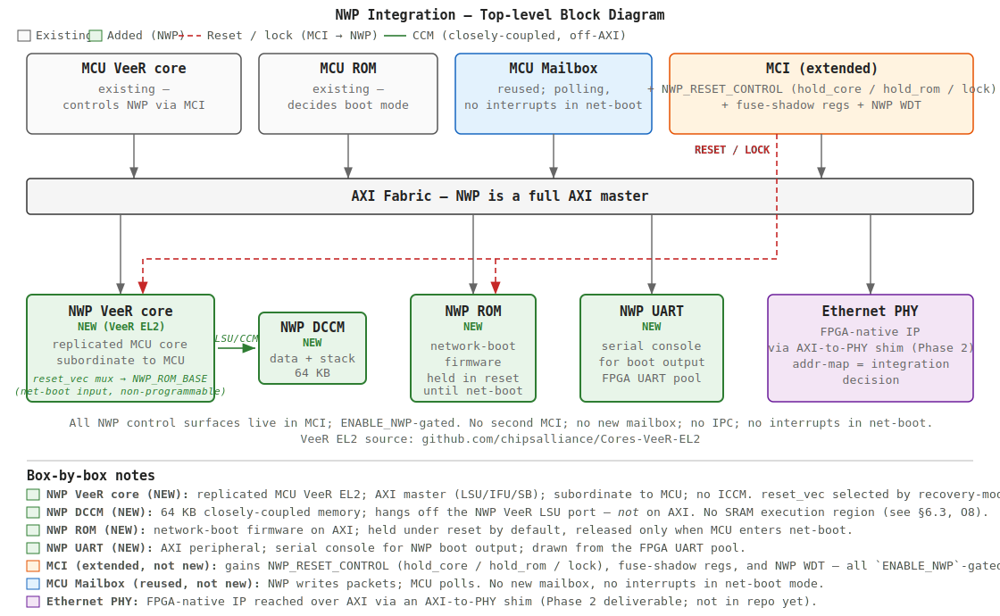
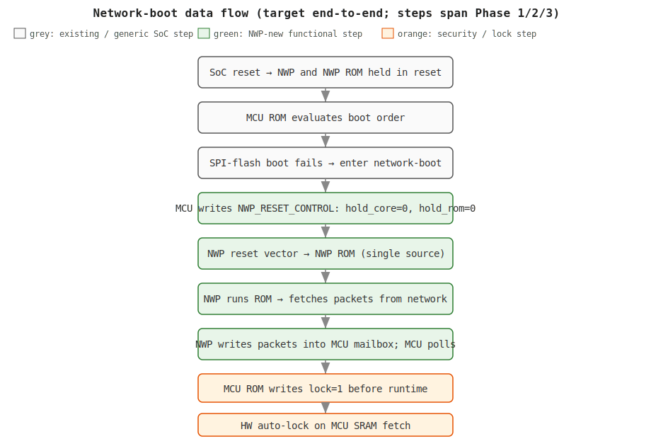
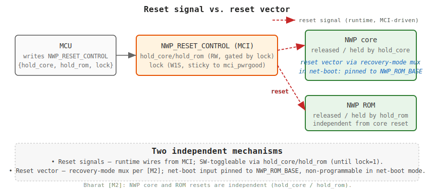
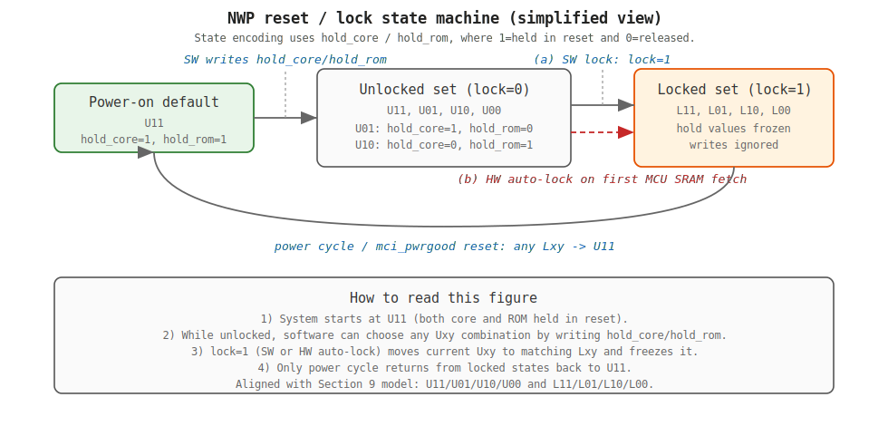
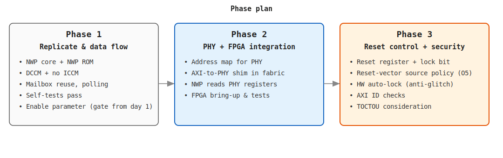

# NWP Microarchitecture Specification

> **Status:** Draft v0.2 — transcript-derived from `[M1]` + `[M2]` meeting notes, with any editorial grouping/interpretation explicitly called out and unresolved points tagged `[OPEN]`.

## Document Control

| Field            | Value                                                      |
| ---------------- | ---------------------------------------------------------- |
| Title            | Network Coprocessor (NWP) Microarchitecture Specification  |
| Revision         | 0.2 (Draft)                                                |
| Date             | 2026-06-02                                                 |
| Author           | Z. Lak (compiled from `[M1]`, `[M2]`)                      |
| Source documents | `[M1]`, `[M2]`, Caliptra SS Integration Spec v2.1 (see §2) |

## Revision History

| Rev | Date       | Author | Notes                                         |
| --- | ---------- | ------ | --------------------------------------------- |
| 0.1 | 2026-04-13 | Z. Lak | Initial extraction from Meeting 1 transcripts |
| 0.2 | 2026-05-06 | Z. Lak | Initial extraction from Meeting 2 transcripts |
| 0.3 | 2026-06-01 | Z. Lak | Added NWP tests to mirror MCU according to phase 1 features, recorded live-sim pass of 4 NWP testcases in §12.2 |

---

## 1. Purpose & Scope

### 1.1 Purpose

Add a **second VeeR core** to the Caliptra Subsystem (alongside the existing MCU VeeR core) to serve as the **Network Coprocessor (NWP)**, providing a network-boot recovery path. `[M1]`

### 1.2 In Scope

- Replicating the existing MCU VeeR core and MCU ROM as NWP core and NWP ROM, attached to the AXI fabric. `[M1]`
- Reusing the existing MCU mailbox for MCU↔NWP signaling. `[M1]`
- MCU-controlled NWP reset, register-driven, with a lock bit. `[M1]` `[M2]`
- Reset-vector source: recovery-mode-selected mux pinned to NWP ROM in network-boot mode (non-programmable). No ICCM. `[M2]`
- DCCM (no ICCM). `[M1]` `[M2]`
- A UART for NWP. `[M1]`
- Fuses (timeouts/delays) loaded by MCU into MCI registers, read by NWP. `[M1]`
- MCI extensions for NWP (registers, watchdog timers), all parameter-gated. `[M1]` `[M2]`
- Parameterized inclusion or exclusion of NWP. `[M2]`
- Security hardening: AXI-ID checks, non-programmable reset vector in network boot, glitch-attack auto-lock, TOCTOU consideration. `[M2]`
- Ethernet PHY address mapping in the FPGA fabric (AXI-to-PHY shim). `[M1]`

### 1.3 Out of Scope (per the meetings)

- IPC mechanism — IPC was never enabled. `[M1]`
- Interrupts in the network-boot mode — mode is polling-only. `[M1]`
- A second full MCI for NWP — only widgets are added to MCI. `[M2]`
- Specific addresses, register field layouts — companion register spec. `[M1]` → `[OPEN]`

---

## 2. References

- **M1:** `meetings/Meeting 1 - Addition of another Veer Processor - Caliptra Integration.txt` (2026-04-10; Vishal Soni, Bharat Pillilli, Marco Visaya, Zahra Lak)
- **M2:** `meetings/Meeting 2 - NWP Phase 1 Review; Phase 2 Plan.txt` (2026-05-05; Bharat Pillilli, Zahra Lak, Marco Visaya, Caleb Whitehead)
- **Caliptra SS Integration Spec v2.1:** <https://chipsalliance.github.io/caliptra-web/docs/2.1/subsystem/ss_integration_spec.html#caliptra-subsystem-high-level-diagram> (normative baseline for subsystem composition and terminology; use for cross-checking architecture claims)
- Caliptra Subsystem GitHub repository (referenced as the canonical source for code, tests, docs). `[M1]`

---

## 3. Glossary

| Term              | Definition (per meetings)                                                                                                                                 | Source |
| ----------------- | --------------------------------------------------------------------------------------------------------------------------------------------------------- | ------ |
| NWP               | **Network Processor** (also described as "network coprocessor"); the second VeeR core in this integration (MCU is first VeeR; Caliptra Core is not VeeR). | `[M1]` |
| MCU               | **Microcontroller Unit**; the existing microcontroller core in the Caliptra Subsystem.                                                                    | `[M1]` |
| MCI               | **Manufacturer Control Interface**; subsystem control block ("spaghetti code") hosting subsystem registers/controls.                                      | `[M2]` |
| ROM               | NWP ROM contains the network-boot firmware.                                                                                                               | `[M2]` |
| DCCM              | **Data Closely-Coupled Memory**; data side of Harvard architecture.                                                                                       | `[M1]` |
| ICCM              | **Instruction Closely-Coupled Memory**; **not enabled** in MCU or NWP.                                                                                    | `[M2]` |
| Mailbox           | Message-passing buffer between blocks; reused MCU mailbox where NWP writes data and MCU polls.                                                            | `[M1]` |
| Network boot mode | Recovery mode entered when SPI flash boot fails.                                                                                                          | `[M2]` |
| BMC               | **Baseboard Management Controller**; NWP is BMC-centric.                                                                                                  | `[M2]` |
| AXI-to-PHY shim   | Bridge in FPGA fabric that maps NWP transactions onto the Ethernet PHY address space. **(Phase 2; not yet implemented in repo.)**                                                | `[M1]` |
| WDT               | **Watchdog Timer**; replicated MCI widget for NWP per REQ-20.                                                                                                                   | `[M1]`  |
| TOCTOU            | **Time-Of-Check / Time-Of-Use**; class of races on AXI shared state addressed by REQ-17.                                                                                        | `[M2]`  |
| SoC / SKU         | **System-on-Chip** / **Stock-Keeping Unit**; SKU = product variant (e.g. BMC vs CPU SKU per `[M2]`).                                                                            | `[M2]`  |
| RAZ/WI, W1S       | Register access policies: **Read-As-Zero / Writes-Ignored** (locked fields); **Write-1-to-Set** (sticky `lock` bit).                                                            | context |


---

## 4. Architectural Overview

The NWP is added as a peer of the MCU on the existing AXI fabric. It owns its own ROM, DCCM, UART, and AXI ID, and is controlled via MCI extensions; the MCU mailbox is shared (no second mailbox). `[M1]` `[M2]`

### 4.1 Block Diagram



### 4.2 Replication Principle

The implementation strategy: _"literally a replication of the existing blocks"_ — take MCU ROM and MCU VeeR core, instantiate them as Network Boot ROM and Network Microcontroller, connect to AXI fabric. `[M1]` Confirmed in repo: NWP RTL at `hw/caliptra-ss/src/riscv_core/veer_el2_nwp/` (`css_nwp0_*` prefix) mirrors the MCU instance at `hw/caliptra-ss/src/riscv_core/veer_el2/` (`css_mcu0_*` prefix).

---

## 5. Functional Requirements

<!-- markdownlint-disable MD060 -->
| ID                   | Requirement                                                                                                                       | Source        |
| -------------------- | --------------------------------------------------------------------------------------------------------------------------------- | ------------- |
| **REQ-1 (Phase1)**   | **(implemented)** Add a second VeeR core (NWP) by replicating the MCU VeeR core.                                                  | `[M1]`        |
| **REQ-2 (Phase1)**   | **(implemented)** Add an NWP ROM by replicating MCU ROM.                                                                          | `[M1]` `[M2]` |
| **REQ-3 (Phase1)**   | **(implemented)** Include DCCM in NWP.                                                                                            | `[M1]`        |
| **REQ-4 (Phase1)**   | **(implemented)** Do not include ICCM in NWP (matching MCU).                                                                      | `[M2]`        |
| **REQ-5 (Phase1)**   | **(implemented)** Provide a UART for NWP.                                                                                         | `[M1]`        |
| **REQ-6 (Phase1)**   | **(implemented)** NWP shall operate as a full AXI master.                                                                         | `[M1]`        |
| **REQ-7 (Phase1)**   | **(implemented)** Assign a separate address map to NWP.                                                                           | `[M1]`        |
| **REQ-8 (Phase1)**   | Reuse the existing MCU mailbox for MCU↔NWP signaling; no new mailbox, no interrupts in network-boot mode (polling only).         | `[M1]`        |
| **REQ-9 (Phase3)**   | MCU shall independently control NWP core reset and NWP ROM reset through registers.                                               | `[M1]` `[M2]` |
| **REQ-10 (Phase3)**  | `NWP_RESET_CONTROL.lock` shall be settable by software and clearable only by power cycle.                                        | `[M1]` `[M2]` |
| **REQ-11 (Phase3)**  | NWP ROM shall default to held-in-reset and be released only in network-boot mode.                                                | `[M2]`        |
| **REQ-12 (Phase3)**  | The NWP reset-vector shall be selected by a recovery-mode-controlled mux whose network-boot-mode input is pinned to NWP ROM; in network-boot mode the selection is non-programmable (see REQ-15). The alternate-mode input is reserved for non-net-boot usage and is out of scope for Phase 3. | `[M2]`        |
| **REQ-13 (Phase3)**  | MCU ROM shall write `lock=1` before runtime hand-off.                                                                             | `[M2]`        |
| **REQ-14 (Phase3)**  | Hardware shall auto-assert `lock=1` on first MCU SRAM instruction fetch (MCU ROM exit).                                          | `[M2]`        |
| **REQ-15 (Phase3)**  | In network-boot mode, no software-visible control (register/fuse/CSR) shall re-vector reset away from NWP ROM.                  | `[M2]`        |
| **REQ-16 (Phase3)**  | Hardware shall enforce AXI-ID checks so NWP cannot execute from another ROM on the bus. **(Spec-author note: `[M2]` raised this as a security-analysis hint, not a fully-specified mechanism. Implementation should follow the existing MCI `*_VALID_AXI_USER[]` / `*_AXI_USER_LOCK[]` pattern in `mci_reg.rdl`; specific AXI ID values are deferred to the companion register spec.)** | `[M2]`        |
| **REQ-17 (Phase3)**  | The design shall mitigate TOCTOU attacks on AXI.                                                                                  | `[M2]`        |
| **REQ-18 (Phase3)**  | MCU ROM shall decide network-boot entry using user-defined boot order, with SPI-flash boot failure as the primary trigger.       | `[M2]`        |
| **REQ-19 (Phase3)**  | MCU shall load fuse-derived timeout/delay values into MCI; NWP shall read them from MCI.                                         | `[M1]`        |
| **REQ-20 (Phase3)**  | NWP watchdog timers shall be implemented as configuration-gated logic in MCI.                                                     | `[M1]`        |
| **REQ-21 (Phase3)**  | Place all NWP control surfaces in the existing MCI; do not add a second MCI. (Constraint on Phase 3 register work — only bites when REQ-9/19/20 registers are added.) | `[M2]`        |
| **REQ-22 (Phase1)**  | **(implemented)** Gate NWP integration via an opt-in `ENABLE_NWP` switch with three coordinated layers:<br>**(a) RTL gate (Phase 1):** `` `ifdef ENABLE_NWP `` wraps NWP ports, `nwp_top`, and `nwp_rom_i` in `caliptra_ss_top.sv`. Macro is **opt-in** (default undefined). See §6.9 for placement rationale.<br>**(b) SW gate (Phase 1):** runtime — emulator `--network-rom <path>` flag controls NWP elaboration. Omitted ⇒ `network_cpu = None`, no NWP step.<br>**(c) Register gate (Phase 3):** the same `` `ifdef ENABLE_NWP `` gates Phase 3 NWP MCI registers added per REQ-9/19/20.<br>**Status:** both Phase 1 gates implemented and verified (see §12.2.1). Phase 1 placement (vs Phase 3 per `[M2]`) is a spec-author choice — gating from day one is cheaper than retrofitting. | `[M2]` |
| **REQ-23 (Phase2)**  | NWP shall fetch network packets, write them to the MCU mailbox, and MCU shall poll then inject via existing subsystem mechanisms. | `[M1]`        |
| **REQ-24 (Phase2)**  | NWP shall reach the Ethernet PHY over AXI via an FPGA AXI-to-PHY shim.                                                           | `[M1]`        |
| **REQ-25 (Phase1)**  | **(implemented)** NWP ROM shall emit identifiable UART boot output and provide feature-gated self-tests:<br>**(a) Boot banner:** UART string (e.g. `Network Coprocessor ROM Started!`) acts as the "I'm alive" handshake.<br>**(b) Self-tests:** `test-hello-world`, `test-dccm`, `test-exception`, `test-network-rom-dhcp-discover` (Cargo features in `network/rom/Cargo.toml`; entry points in `network/rom/src/main.rs`). | `[M1]` |
| **REQ-26 (Phase1)**  | **(implemented)** Development process shall require direct-branch PR flow with ADO promote-pipeline validation and review for each PR.             | `[M2]`        |
<!-- markdownlint-enable MD060 -->

Note: Phase labels in this table align with the 3-phase plan in Section 13.

---

## 6. Microarchitecture

### 6.1 NWP Core

- Replicated instance of the existing MCU VeeR EL2 core (<https://github.com/chipsalliance/Cores-VeeR-EL2>). RTL at `hw/caliptra-ss/src/riscv_core/veer_el2_nwp/` (NWP, `css_nwp0_*` prefix); MCU counterpart at `hw/caliptra-ss/src/riscv_core/veer_el2/` (`css_mcu0_*` prefix). `[M1]`
- Harvard architecture; separate instruction & data paths so there is no self-modifying instruction path. `[M1]`
- AXI master interface (3 ports: LSU, IFU, SB) — see `hw/caliptra-ss/src/riscv_core/veer_el2_nwp/rtl/design/lib/css_nwp0_ahb_to_axi4.sv`. `[M1]`
- Subordinate to MCU; MCU controls reset and configuration. `[M1]`

### 6.2 NWP ROM (Network Boot ROM)

- Replicated from MCU ROM. `[M1]`
- Lives on the AXI fabric. `[M2]`
- Held under reset by default; released by MCU only in network-boot mode. `[M2]`
- Threat-model rationale: NWP core being out of reset is innocuous as long as ROM stays under reset. `[M2]`

### 6.3 NWP DCCM

- Required for data and stack. `[M1]`
- Size: currently tracked as **64 KB** (out-of-transcript contextual guidance from Marco's Teams chat 2026-05-06; not transcript-derived normative evidence).
- Data path of the Harvard split. `[M1]`
- **No separate SRAM execution region** (REQ-4 + REQ-15): `network/config/src/lib.rs` defines no SRAM; DCCM covers data/stack/packet-staging. **Pending Bharat confirmation this is intentional.**

### 6.4 Reset Subsystem & Reset Vector

Consolidated in **§9**. Reset is documented as a single subject there: mechanisms (signal vs. vector), `NWP_RESET_CONTROL` register, pseudo-code, state machine, threat-model rationale.

### 6.5 NWP UART

- One UART for NWP, drawn from the FPGA UART pool. `[M1]`
- **Implemented (Phase 1):** driver at `network/drivers/src/uart.rs`; TX register at `DEFAULT_NETWORK_MEMORY_MAP.uart_offset + 0x41`. Integration test asserts UART output in `tests/integration/src/network/test_nwp_hello_world.rs`.
- M1's reference to the Google UART contribution as a dependency is **resolved** for Phase 1 (current driver suffices for net-boot bring-up). If a future production UART widget supersedes the current one, scope explicitly under a Phase ≥ 2 ticket. `[OPEN]`

### 6.6 MCI Extensions (parameter-gated)

All NWP control surfaces live in MCI; no second MCI. `[M2]` When the NWP enable parameter is set, MCI gains the reset-control register (`hold_core`/`hold_rom`/`lock`, REQ-9/10), fuse-shadow registers (REQ-19), and NWP watchdog widget (REQ-20). When `0`, none of these registers or HW exist. `[M2]`

### 6.7 MCU Mailbox (reused, not extended)

- Existing MCU mailbox is shared. `[M1]`
- NWP writes packets/data; MCU polls. `[M1]`
- No interrupts in network-boot mode — polling only. `[M1]`
- NWP can buffer arbitrary amounts before signaling MCU. `[M1]`

### 6.8 Ethernet PHY Path

Phase 2 deliverable (REQ-24); see §13. Not implemented in Phase 1.

- PHY is an FPGA-native IP. `[M1]`
- An AXI-to-PHY shim routes NWP AXI transactions to the PHY's address space. `[M1]`
- Validation test: NWP reads PHY registers successfully. `[M1]`

### 6.9 NWP Enable Macro (RTL)

The NWP block instantiation in `hw/caliptra-ss/src/integration/rtl/caliptra_ss_top.sv` is gated by `` `ifdef ENABLE_NWP `` (REQ-22, implemented Phase 1). Wraps cover NWP port declarations, `caliptra_ss_top_sva` hookup, AXI4 protocol-monitor instances, and `nwp_top nwp_top_i` + `nwp_rom_i`. When the macro is undefined, none survive elaboration.

- **Opt-in**: macro is **not** defined inside `caliptra_ss_includes.svh`. ON builds pass `+define+ENABLE_NWP`; the default leaves it undefined. (A file-level `` `define `` would defeat `+undefine+`, so opt-in keeps the off-build trivially provable.)
- Macro (not `parameter`) is required because SystemVerilog `parameter` cannot gate port declarations — needed so the disabled SKU has no dangling NWP IF in the top-level signature.

**Phase 3 follow-on:** same `` `ifdef ENABLE_NWP `` gates the Phase 3 NWP MCI registers (REQ-9, REQ-19, REQ-20) added to `mci_reg.rdl`.

### 6.10 NWP MCI Register Map (sketch)

The MCU's MCI register map lives in `hw/caliptra-ss/src/mci/rtl/mci_reg.rdl` (SystemRDL). The NWP additions follow the same SystemRDL file, gated by the NWP enable parameter per REQ-22.

Specific offsets, widths, and field layouts are deferred to the companion register spec — the table below names the register _roles_ by analogy with existing MCU MCI registers and binds each to a transcript-cited requirement.

| Proposed register (role)                                 | Modeled on existing MCU MCI reg                | Purpose                                                                                                                                                                                       | Source REQ            |
| -------------------------------------------------------- | ---------------------------------------------- | --------------------------------------------------------------------------------------------------------------------------------------------------------------------------------------------- | --------------------- |
| `NWP_RESET_CONTROL`                                      | `RESET_REQUEST @0x100`                         | `hold_core` (RW, gated by `lock`) + `hold_rom` (RW, gated by `lock`) + `lock` (W1S, sticky to `mci_pwrgood`); MCU-only write surface to independently release/freeze NWP core and ROM resets. | REQ-9, REQ-10, REQ-13 |
| `NWP_FUSE_*` (shadow)                                    | (new fuse-shadow regs)                         | MCU writes timeout/delay fuse values; NWP reads them through MCI.                                                                                                                             | REQ-19                |
| `NWP_WDT_TIMER_EN` / `NWP_WDT_TIMER_*`                   | `WDT_TIMER1_EN @0xB0` and surrounding WDT regs | NWP watchdog logic replicated as MCI widget, gated by enable parameter.                                                                                                                       | REQ-20                |
| `NWP_TIMER_CONFIG`                                       | `MCU_TIMER_CONFIG @0xE0`                       | Clock-period config for NWP timer (mirrors MCU pattern).                                                                                                                                      | REQ-20                |
| `NWP_MBOX_VALID_AXI_USER[]` / `NWP_MBOX_AXI_USER_LOCK[]` | `MBOX0_VALID_AXI_USER[5] @0x180` etc.          | AXI-ID gating for mailbox transactions originating from NWP, supporting the AXI-ID source check.                                                                                              | REQ-16                |

Notes:

- Conditionally included with the NWP enable parameter (REQ-22). `[M2]`
- No second MCI created — these extend the existing single MCI. `[M2]`
- Specific offsets/widths/access policies: `[OPEN]` (companion register spec).
- "Modeled on" column is informational — points at the closest MCU pattern in `mci_reg.rdl`, not a copy/rename mandate.

---

## 7. Boot Flow



---

## 8. Address Map

- NWP requires its own, separate address map (REQ-7). `[M1]`
- All NWP-specific control registers live in MCI (REQ-21). `[M2]`
- Specific MCI register offsets, widths, and field layouts: `[OPEN]` — deferred to the companion register spec.

### 8.1 At a Glance

The table below is the Phase 1 implementation truth, sourced from `network/config/src/lib.rs` (single source of truth consumed by linker, runtime, emulator, and MRAC config).

| Region | MCU | Size | NWP | Size | Same? |
| --- | --- | --- | --- | --- | --- |
| ROM base / reset vector | `0x8000_0000` | 64 KB FW (256 KB HW) | `0x9000_0000` | 64 KB FW (256 KB HW) | different base |
| DCCM | `0x5000_0000` | 16 KB | `0x3000_0000` | 64 KB | different base + size |
| ICCM (declared, disabled) | `0x4000_0000` | size 0 | `0xC000_0000` | size 0 | both disabled (REQ-4) |
| PIC | `0x6000_0000` | 32 KB | `0xB000_0000` | 32 KB HW / 21 KB firmware (`0x5400`) | different base |
| ICache | (per-core) | 16 KB | (per-core) | 16 KB | identical |
| PMP entries | — | 64 | — | 64 | identical |
| User mode | — | enabled | — | enabled | identical |
| Bus protocol | — | AXI4 | — | AXI4 | identical |
| MCU mailbox (NWP-reachable) | `0x2140_0000` | shared | `0x2140_0000` | shared | **shared — Phase 2 dependency (REQ-23)** |
| UART (NWP-only) | n/a | n/a | `0x1000_1000` | 256 B | NWP only (`0x1000_1041` = data reg) |
| Ethernet TAP (NWP-only) | n/a | n/a | `0x1000_3000` | 4 KB | NWP only |

---

## 9. Reset Subsystem

This section is the single source of truth for NWP reset behavior — mechanisms, register, pseudo-code, state machine, and threat model.

### 9.1 Two Independent Mechanisms

"Reset signal" and "reset vector" live at different layers:

- **Reset signals** — runtime control wires from MCI (`hold_core`, `hold_rom`) that independently hold or release the NWP core and NWP ROM. SW-toggleable until `lock=1`.
- **Reset vector** — selected by a recovery-mode-controlled mux per `[M2]`. The net-boot input is pinned to `NWP_ROM_BASE` and, in net-boot mode, the selection is non-programmable and SW-invisible (REQ-12, REQ-15). The alternate input is reserved for non-net-boot usage and is out of scope for Phase 3. `[M2]`



### 9.2 NWP_RESET_CONTROL Register

MCU writes `NWP_RESET_CONTROL` to manage NWP resets. `[M1]` It contains three bit-fields:

- `hold_core`, `hold_rom` — RW, each gated by `lock`. Writing `0` releases the corresponding reset; writing `1` asserts it. Writes are silently ignored (RAZ/WI) once `lock=1`. `[M1]`
- `lock` — W1S (write-1-to-set), sticky to `mci_pwrgood`[^pwrgood]. Once `1`, SW cannot clear it; `hold_core` / `hold_rom` are frozen at their current values until the next power cycle. `[M1]` `[M2]`

[^pwrgood]: Signal name borrowed from existing MCI RTL convention (`mci_pwrgood` in `hw/caliptra-ss/src/mci/rtl/mci_top.sv`, `mci_reg.rdl`); transcripts say "clear only by power cycle" without naming a specific reset domain.

**Reset scope.** Only NWP core and NWP ROM are held/released by this control — no ICCM (ICCM not enabled, REQ-4). `[M2]`

### 9.3 Boot-Time Sequence & HW Auto-Lock

**Boot-time sequence.** On entry to network-boot, MCU writes `hold_rom=0` and `hold_core=0` to release the ROM/core path. MCU ROM then writes `lock=1` before runtime hand-off to freeze the configuration. `[M2]`

**HW auto-lock backstop.** Independent of any SW write, hardware monitors MCU's instruction-fetch source; the first fetch from MCU SRAM (= MCU has left ROM and entered runtime) auto-asserts `lock=1`, defeating glitch attacks that skip the SW lock write. `[M2]`

### 9.4 Pseudo-Code (write / reset semantics)

```text
on_register_write(NWP_RESET_CONTROL, wdata):
    if wdata.lock == 1:        reg.lock <= 1            // W1S; SW cannot clear
    if reg.lock == 0:                                    // gated writes
        reg.hold_core <= wdata.hold_core
        reg.hold_rom  <= wdata.hold_rom
    // else: hold_* writes ignored (RAZ/WI)

on_mci_pwrgood_reset:                                    // only path that clears lock
    reg.lock      <= 0
    reg.hold_core <= 1                                   // power-on default: held
    reg.hold_rom  <= 1

on_clock_edge:                                           // HW auto-lock backstop
    if mcu_ifetch_from_sram and not reg.lock:
        reg.lock <= 1                                    // first MCU SRAM fetch auto-locks

nwp_core_reset_n = ~reg.hold_core
nwp_rom_reset_n  = ~reg.hold_rom
```
### 9.5 State Machine



State encoding `hold_core` / `hold_rom` (`1`=held, `0`=released).

- **U11/U01/U10/U00 (`lock=0`)**: SW may write `hold_*` to move freely between these. `U11` is power-on default; `U00` is the network-boot release path. `[M1]`
- **L11/L01/L10/L00 (`lock=1`)**: `hold_*` frozen, writes RAZ/WI. Exit only via `mci_pwrgood`. `[M1]` `[M2]`
- **Lock transitions**: SW write `lock=1` (MCU ROM, REQ-13) **or** HW auto-lock on first MCU SRAM ifetch (REQ-14) → Uxy → Lxy. `mci_pwrgood` → any state → U11. `[M2]`

### 9.6 Threat-Model Note

As long as NWP ROM is held in reset, the NWP core has no instructions to fetch from it — a released core is harmless on its own, and ROM reset remains the security-critical gate. Reinforced by REQ-11 (ROM default-held) and REQ-16 (AXI-ID checks prevent execution from other ROM locations). See §10 (S1, S5, S7, S8) for the full security matrix. `[M2]`

---

## 10. Security Architecture

| #   | Concern                            | Requirement                                                                 | Source        |
| --- | ---------------------------------- | --------------------------------------------------------------------------- | ------------- |
| S1  | Glitch attacks on lock bit         | HW detects MCU-ROM-exit (instruction fetch from MCU SRAM) and auto-locks    | `[M2]`        |
| S2  | NWP executing from a different ROM | AXI ID checks confirm execution source. **`[M2]` hint, not fully specified — follow MCI `*_VALID_AXI_USER[]` pattern; values `[OPEN]`** | `[M2]`        |
| S3  | Reset vector tampering             | Reset vector is unique & non-programmable in network-boot mode              | `[M2]`        |
| S4  | TOCTOU on AXI                      | Microarchitectural design must consider time-of-check / time-of-use attacks | `[M2]`        |
| S5  | ROM access outside fallback mode   | ROM held under reset / not readable when not in network-boot mode           | `[M1]` `[M2]` |
| S6  | Self-modifying instructions        | Harvard architecture (separate I and D) prohibits instruction = data        | `[M1]`        |
| S7  | Lock-bit override at runtime       | Register non-overridable at runtime; clear only by power cycle              | `[M1]` `[M2]` |
| S8  | Trust boundary on MCU ROM          | Don't rely solely on MCU ROM lock; HW enforces auto-lock                    | `[M2]`        |

(per `[M2]`): _security analysis is a per-feature exercise; the spec must capture both functional and security aspects so the feature cannot be re-armed at runtime by any means._

---

## 11. Configuration & Parameterization

- NWP integration is gated by an `ENABLE_NWP` switch on the RTL side; the SW emulator is runtime-gated by the presence of `--network-rom <path>`. `[M2]`
- **Two Phase-1 layers must agree** (RTL-only would still ship NWP netlist area):
  - **RTL gate (Phase 1):** `` `ifdef ENABLE_NWP `` wraps NWP ports and instances in `caliptra_ss_top.sv` (see §6.9). Opt-in via `+define+ENABLE_NWP` on the tool CLI; macro form (not `parameter`) so port declarations can be gated.
  - **SW gate (Phase 1):** runtime — `network_rom: Option<PathBuf>` on the emulator CLI. When `--network-rom` is omitted, `network_cpu` is `None`, the per-tick step-loop short-circuits, and `has_network_cpu()` returns false. The `network_root_bus` module compiles unconditionally but is unreachable without the flag. CPU-only SKUs invoke the emulator without the flag.
- **Register-surface gate (Phase 3):** same `` `ifdef ENABLE_NWP `` gates Phase 3 NWP MCI registers (REQ-9/19/20). REQ-21's "single MCI" constraint applies inside the gate.
- Targeted at BMC SKUs; not relevant for CPU SKUs (no network). `[M2]`
- **Implementation status (2026-06-02):** RTL gate (opt-in via `+define+ENABLE_NWP`) and SW runtime gate (omit/pass `--network-rom`) both wired up. End-to-end OFF/ON coverage matrix below.

| Layer | Test invocation | OFF coverage | ON coverage |
| --- | --- | --- | --- |
| **HW (RTL elaboration)** | `vcs-build` ± `+define+ENABLE_NWP` | ✓ clean (0 errors/0 warnings); 0 occurrences of `nwp_top_i` / `nwp_rom_i` in `vcs_elab.log`; verified at `sim_run/nwp_off/` | ✓ clean; 924/924 parsed sources identical to OFF (pure compile-time gate); verified at `sim_run/nwp_on/` |
| **HW (live VCS sim, NWP C-tests)** | `ss_build -tc <name>` via ADO playbook | n/a (no NWP to test) | ✓ 4/4 pass: `nwp_hello_world`, `nwp_dccm`, `nwp_exception`, `nwp_hello_world_c` (2026-06-01) |
| **HW (live VCS sim, MCU regression)** | `ss_build -tc <name>` via ADO playbook | ✓ baseline: `mcu_hello_world`, `smoke_test_mcu_hitless` clean | ✓ same — confirms NWP overlay does not regress MCU builds |
| **SW (workspace cargo / clippy / nextest, emulator smokes, C-emulator)** | `xtask precheckin` | ✓ implicit (NWP unreachable without `--network-rom`) | ⚠ parked end-to-end via `precheckin` (§12.2.2) |
| **Integration tests (NWP)** | `cargo nextest run -p tests-integration` (NWP tests build their own ROM internally) | n/a (NWP tests provide their own `--network-rom` via `start_runtime_hw_model`) | ✓ 3/3 pass on emulator: `nwp_hello_world`, `nwp_dccm`, `nwp_exception` |
| **REQ-4 ICCM-disable enforcement** | unit test in `emulator/periph/src/network_root_bus.rs` | n/a | ✓ panics on ICCM load when size = 0 (commit `eb6a719f`) |

**Legend:** ✓ = covered today. ⚠ = SW-side OFF/ON parity is parked under §12.2.2 (blocked on §12.4 test-matrix sign-off). n/a = not applicable to that state.

---

## 12. Verification & Tests

### 12.1 Self-Tests

NWP ROM provides identifiable UART boot output and feature-gated self-tests per REQ-25. The hello-world test is the "I'm alive" handshake — no separate test is needed. `[M1]`

### 12.2 Phase 1 Status (per `[M2]` + repo as of 2026-06-01)

- **Self-tests passing:** hello-world, DCCM, exception. Plus `test-network-rom-dhcp-discover` Cargo feature in `network/rom/Cargo.toml`.
- **REQ-4 ICCM-disable enforcement:** emulator panics on ICCM load when size = 0 (`emulator/periph/src/network_root_bus.rs`; commit `eb6a719f`).
- **REQ-5 / REQ-7:** UART working end-to-end (§6.5); separate address map in `network/config/src/lib.rs`.
- **Phase 1 gap:** MCU↔NWP mailbox exercise (REQ-23, deferred to Phase 2).
- **Live VCS pass 2026-06-01 (ADO playbook flow):** 4/4 NWP testcases via `ss_build -tc <name>`: `nwp_hello_world`, `nwp_dccm`, `nwp_exception`, `nwp_hello_world_c`. MCU regression baseline (`mcu_hello_world`, `smoke_test_mcu_hitless`) clean — confirms the NWP overlay (Makefile recipe-time `NWP_ELF` guard + 4 NWP YMLs) does not regress MCU builds.

### 12.2.1 REQ-22 ENABLE_NWP Gate Verification (2026-05-19)

- **OFF (`+undefine+ENABLE_NWP`, default):** `vcs-build` clean (0 errors / 0 warnings); `vcs_elab.log` has 0 occurrences of `nwp_top_i` / `nwp_rom_i`. NWP RTL files still parsed (filelist-driven) but no instance survives elaboration. Verified at `sim_run/nwp_off/`.
- **ON (`+define+ENABLE_NWP`):** `vcs-build` clean; parsed-source list identical to OFF (924/924 files), confirming pure compile-time gate. Verified at `sim_run/nwp_on/`. Plumbed via `VCS_COMP_OPTS+="+define+ENABLE_NWP"` (Makefile `vcs-build` consumes `VCS_COMP_OPTS`, not `TB_DEFS`).

### 12.2.2 SW-side OFF/ON gate verification — *parked, scoped*

**Status:** scoped, not implemented. **Blocked on §12.4 test-matrix sign-off (Bharat).**

**Goal.** Mirror §12.2.1's RTL OFF/ON verification at the SW layer so PRs prove both states end-to-end (vs. the implicit OFF-only path `xtask precheckin` runs today).

**Shape.** `xtask precheckin --nwp=<off|on|both>`, default `off` (preserves CI cycle-time); CI / PR-prep invoke `--nwp=both`. ON adds the 3 NWP integration tests (which build their own ROM internally and pass `--network-rom` to the emulator); OFF skips them.

**Touchpoints (5 files):** `xtask/src/{main,precheckin,clippy,test}.rs` + the existing `tests/integration/src/network/` tests.

**Effort:** ~½ day code + ~30 min docs + 1–2 h validation. CI integration is a separate follow-on ticket.

### 12.4 MCU Test Parity Matrix (recommended — pending Bharat sign-off)

Bharat's `[M1]` direction was that NWP integration is *"literally a replication of the existing blocks"*. Applying that principle to the test surface — not just the RTL — produces the matrix below. The three NWP self-tests already in tree (`nwp_hello_world`, `nwp_dccm`, `nwp_exception`) are *not* ports of MCU tests; they are Phase-1 bring-up smokes for newly-instantiated hardware that MCU never needed as separate tests. Anything labeled **(recommend)** below is a spec-author extrapolation from MCU parity and **requires Bharat sign-off** before scheduling.

N/A entries reflect hardware NWP doesn't have (no SRAM, no I3C) or paths NWP doesn't participate in (hitless, UDS/zeroization).

#### Phase 1 (core / ROM / DCCM / UART / AXI master / separate address map)

| MCU test                                                                                                  | NWP counterpart                | Status                  |
| --------------------------------------------------------------------------------------------------------- | ------------------------------ | ----------------------- |
| `mcu_hello_world`                                                                                         | `nwp_hello_world`              | ✓ in tree               |
| (no MCU equivalent — fresh-memory smoke for newly-added DCCM)                                             | `nwp_dccm`                     | ✓ in tree               |
| `mcu_intr_handler` (closest; NWP is polling-only in netboot per REQ-8, so trap surface differs)           | `nwp_exception`                | ✓ in tree               |
| `smoke_test_mcu_trace_buffer`                                                                             | `nwp_trace_buffer`             | **(recommend)** — sign-off |
| `mcu_lmem_exe`                                                                                            | **N/A**                        | NWP has no SRAM execution region (see §6.3). |
| `smoke_test_mcu_sram_*` (byte_write, ecc_sb, ecc_db, debug_stress, execution_region, protected_region)    | **N/A**                        | No SRAM (see §6.3). |
| `caliptra_ss_mcu_sram_to_sha`                                                                             | **N/A**                        | No SRAM. |
| `mcu_i3c_*`, `mcu_mctp_smoke_test`                                                                        | **N/A in Phase 1**             | NWP has no I3C; MCTP is mailbox-mediated (Phase 2) |

#### Phase 2 (PHY path + MCU↔NWP mailbox packet flow — REQ-23, REQ-24)

| MCU test                                       | NWP counterpart                              | Status                  |
| ---------------------------------------------- | -------------------------------------------- | ----------------------- |
| `mcu_axi_streaming_boot_test_rom`              | `nwp_axi_streaming_boot`                     | **(recommend)** — sign-off |
| `mcu_mbox_rand_rdwr`                           | `nwp_mbox_rand_rdwr`                         | **(recommend)** — sign-off |
| `smoke_test_mcu_mbox_pass_data`                | `nwp_mbox_pass_data`                         | **(recommend)** — sign-off |
| `smoke_test_mcu_mbox_burst`                    | `nwp_mbox_burst`                             | **(recommend)** — sign-off; matches `[M1]` *"NWP can buffer arbitrary amounts before signaling MCU"* |
| `smoke_test_mcu_mbox_ecc`                      | `nwp_mbox_ecc`                               | **(recommend)** — sign-off |
| `mcu_mbox_lock_return_one_during_zeroize`      | `nwp_mbox_lock_during_zeroize`               | **(recommend)** — sign-off |
| `mcu_mctp_smoke_test`                          | `nwp_mctp_smoke`                             | **(recommend)** — sign-off; only if MCTP-over-network is in scope (transcripts silent) |

#### Phase 3 (reset + lock + AXI-ID + watchdog + fuses — REQ-9..21)

| MCU test                                                  | NWP counterpart                          | Status                  |
| --------------------------------------------------------- | ---------------------------------------- | ----------------------- |
| `smoke_test_mcu_no_rom_config`                            | `nwp_rom_held_in_reset`                  | **(recommend)** — direct mapping to REQ-11 |
| (new — security)                                          | `nwp_reset_lock_sticky`                  | **(recommend)** — REQ-10/13/14 (SW `lock=1` + HW auto-lock) |
| `smoke_test_mcu_mbox_valid_user` / `_axi_param`           | `nwp_mbox_valid_user`                    | **(recommend)** — REQ-16 AXI-ID enforcement |
| `smoke_test_mcu_mbox_invalid_axi`                         | `nwp_mbox_invalid_axi`                   | **(recommend)** — negative case for REQ-16/REQ-17 |
| `smoke_test_mcu_mbox_target_user`                         | `nwp_mbox_target_user`                   | **(recommend)** — AXI-user routing in NWP context |
| `smoke_test_jtag_mcu_*` (sram, bp, unlock, intent)        | `nwp_jtag_*`                             | `[OPEN]` — only if NWP exposes JTAG debug; transcripts don't say |
| `smoke_test_mcu_hitless`                                  | **N/A**                                  | NWP runs only during netboot recovery |
| `smoke_test_fc_mcu_uds_fe_zeroization`                    | **N/A**                                  | UDS/zeroization is MCU/Caliptra-Core territory |
| (new — WDT)                                               | `nwp_wdt_basic`                          | **(recommend)** — REQ-20 watchdog widget in MCI |
| (new — fuses)                                             | `nwp_fuse_shadow`                        | **(recommend)** — REQ-19 fuse-shadow read path |

**Summary**: Phase 1 = 3 in tree + 1 **(recommend)**; Phase 2 = 5–6 **(recommend)**; Phase 3 = ~7 **(recommend)** + 1 `[OPEN]`. Skipped permanently (NWP-absent hardware / paths): SRAM-related, hitless, UDS/zeroization, I3C.

**Open item:** Bharat sign-off on every **(recommend)** row; confirm whether NWP exposes JTAG debug.

---

## 13. Phase Plan



Phase ordering per `[M1]`: "first is get the network processor built, network processor running. Once this is done, … figure out where this PHY in the FPGA is … And the last phase would be all these reset controls." `[M1]`

Within Phase 3 (per `[M2]`): reset behavior → security hardening. (The enable-parameter item was originally placed in Phase 3 by `[M2]`, but is moved to Phase 1 in this spec so the gating is in place from day-one integration commits — spec-author decision, not a transcript directive.)
<!--
**Phase 3 follow-up — interconnect parameterization (REQ-22 cleanup).** Phase 1's `` `ifndef ENABLE_NWP `` tie-off block in `hw/caliptra-ss/src/integration/testbench/caliptra_ss_top_tb.sv` parks the NWP master/slave slots (`mintf_arr[NWP_LSU/IFU/SB_IDX]`, `sintf_arr[NWP_ROM_IDX]`, `sintf_arr[NC0_IDX]`) with safe defaults so AXI4 protocol checkers don't fire on undriven monitors. This is a topology-preserving workaround — the interconnect still allocates the NWP slots. Phase 3 should replace the tie-off with a proper parameterization of the AXI interconnect's master/slave count on `ENABLE_NWP`: shrink `CSS_INTC_M_COUNT`/`S_COUNT`, renumber/remove `NWP_LSU/IFU/SB_IDX` and `NWP_ROM_IDX`/`NC0_IDX`, and update every slot consumer. This is the cleaner long-term fix but touches the interconnect package, so it is deferred out of REQ-22 Phase 1 scope.


-->
---
## 14. Integration Notes for SoC Integrators

- SoC must build a fabric path / address map for the Ethernet PHY. `[M1]`
- SoC must drive the network-boot-mode signal (the boot-order trigger that causes MCU ROM to release the NWP). `[M2]`
- An integration spec must capture HW prerequisites SoC integrators must satisfy. `[M2]`

---
<!--
## 15. Appendix A — Source Files

The following files realize this spec (all present in repo as of 2026-06-01):

- `docs/nwp_uarch_spec.md` — this document
- `docs/nwp_spec_block.svg` — §4.1 block diagram
- `docs/nwp_spec_reset_mux.svg` — §9.1 mux diagram
- `docs/nwp_spec_boot_flow.svg` — §7 boot flow
- `docs/nwp_spec_state_machine.svg` — §9.5 state machine
- `docs/nwp_spec_phase_plan.svg` — §13 phase plan

## Appendix B — Rubber-Duck Audit (Spec ↔ Transcripts)

Every claim above carries an `[Mx]` citation. The audit pass below confirms there are no uncited claims and that each citation actually says what's claimed. (Per the user instruction: _"nothing inferred or made up."_)

**Method:** for each requirement, statement, or diagram label, citations were checked against the source transcripts. Normative requirements are transcript-derived; any editorial grouping or interpretation is explicitly labeled or moved to `[OPEN]`.

**Spec-side checks performed:**

- §1.2 In-Scope: every bullet has a citation. ✓
- §1.3 Out-of-Scope: each item traces to an explicit "no" in the transcripts. ✓
- §3 Glossary: every term is defined as stated by a participant. ✓
- §4 Block diagram: every box and edge labelled with a citation; existing vs. new clearly delineated. ✓
- §5 Requirements (REQ-1 .. REQ-26): all 26 carry citations. ✓
- §6 µarch sub-sections: all bullets cited. ✓
- §7 Boot flow: rendered as SVG only; no markdown step list to audit. Visual content cross-checked against §9.3 boot-time sequence. ✓
- §9 Reset Subsystem: complete 8-state model (U11/U01/U10/U00 and L11/L01/L10/L00) with transitions cited in §9.5. ✓
- §10 Security: 8 concerns, all cited. ✓
- §13 Phase plan: 3 phases, all cited. ✓
- §12.4 Test parity matrix: explicitly labeled spec-author extrapolation from `[M1]` "literally a replication" principle; every **(recommend)** row gated on Bharat sign-off. Not transcript-directed. ✓

**SVG-side checks performed:**

- Block diagram (§4.1): content matches §4/§6 requirements and terminology (no contradictory claims found). ✓
- Reset-vector mux (§9.1): content matches §9.1 reset-signal vs reset-vector separation and lock semantics. ✓
- Boot flow (§7): visual content matches §9.3 boot-time sequence and §9.2 reset-control register semantics. ✓
- State machine (§9.5): visual is consistent with the complete Uxy/Lxy model in §9.5 text. ✓
- Phase plan (§13): phase grouping is consistent with §13 ordering quote. ✓

**Items deliberately NOT in the spec (because they are not in the transcripts):**

- Transcript-derived normative requirement for a specific NWP DCCM size (the document tracks 64 KB only as out-of-transcript contextual guidance in §6.3).
- Specific addresses or register field widths.
- Specific AXI ID values to enforce in REQ-16.
- Specific reset-vector value(s).
- Internals of "promote pipeline" and ADO setup.
- Internals of the FPGA AXI-to-PHY shim.
- Anything from the existing Phase-1 implementation that wasn't discussed in either meeting.

**Result:** all normative requirements are traceable to `[M1]`/`[M2]`; any remaining interpretation is explicitly identified (for example, in `[OPEN]` items) rather than silently inferred.
-->