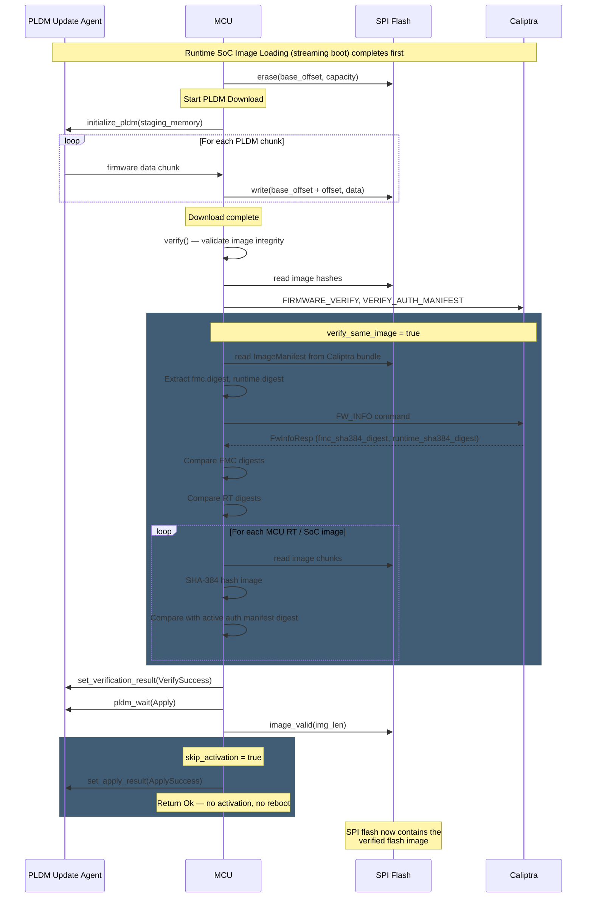

# Proposal: Full Flash Image Loading to SPI Flash via PLDM

## Problem

When the system boots via streaming boot (PLDM), images are downloaded
and loaded directly into memory at their target AXI addresses. However,
the SPI flash is not updated with the streamed content. This means:

1. If the system resets, it falls back to whatever was previously on
   flash, which may be stale or empty.
2. Flash and the running firmware are out of sync.

The customer requirement is: **when doing streaming
boot, the image should also be written back to SPI flash so flash stays
consistent with the streamed image.** Flash should act as a "follower"
copy of the booted image.

Importantly, the unit of transfer is the **full flash image** — the
complete binary blob containing the `FlashHeader`, all `ImageHeader`
entries (TOC), and every image payload (Caliptra FMC/RT, SoC manifest,
MCU RT, SoC images). This is the same layout that `FlashImageLoader`
expects when booting from flash. Writing individual images is not
sufficient; the entire flash image must be stored so that a subsequent
flash boot produces the same result as the streaming boot that preceded
it.

## Goals

1. Provide a mechanism to download the **complete flash image** (headers
   + TOC + all image payloads) via PLDM and write it to SPI flash as a
   single contiguous blob.
2. Ensure that the image written to flash is the same as the current tunning one

## Proposed Design

### Approach: Use `FirmwareUpdater` and skip activation

The existing `FirmwareUpdater` already handles downloading a complete
flash image blob via PLDM into a `StagingMemory` backend, followed by
verification and activation. The key insight is that `StagingMemory` is
a trait — by providing an implementation backed by SPI flash, the
`FirmwareUpdater` can write the full image directly to flash.

For the streaming boot + flash persistence use case, the system has
already booted from memory and does not want to activate (reboot) after
writing to flash. A new `skip_activation` option on `FirmwareUpdater`
controls whether the activation step (update Caliptra, update MCU,
reboot) is executed or skipped.

Additionally, a `verify_same_image` option enables the updater to
confirm that the downloaded image matches the currently running
firmware before writing to flash. This is useful for the streaming
boot + flash persistence flow where the intent is to persist the
*same* image that was just streamed, not to update to a different one.

### Changes to `FirmwareUpdater`

Add `skip_activation` and `verify_same_image` fields that control
the post-download behavior:

```rust
pub struct FirmwareUpdater<'a, D: DMAMapping> {
    staging_memory: &'static dyn StagingMemory,
    mailbox: Mailbox,
    params: &'a PldmFirmwareDeviceParams,
    dma_mapping: &'a D,
    spawner: Spawner,
    skip_activation: bool,    // NEW
    verify_same_image: bool,  // NEW
}

```

#### Sequence Diagram



### Running Image Verification (`verify_same_image`)

When `verify_same_image` is `true`, the updater compares the downloaded
images against the currently running firmware to ensure they are
identical. This check runs after the standard `verify()` step (which
already validates image integrity) and before the apply step.

#### How digests are obtained for each image type

**Caliptra FMC+RT Bundle:**

The Caliptra FMC+RT bundle contains an `ImageManifest` header (from
the `caliptra-image-types` crate) which includes `ImageTocEntry`
fields for both FMC and Runtime, each containing a SHA-384 `digest`
field:

```rust
// From caliptra-image-types (already available in the workspace)
pub struct ImageManifest {
    pub marker: u32,
    pub preamble: ImagePreamble,
    pub header: ImageHeader,
    pub fmc: ImageTocEntry,     // contains .digest: [u32; 12]
    pub runtime: ImageTocEntry, // contains .digest: [u32; 12]
}
```

The `FW_INFO` mailbox command returns `FwInfoResp` which contains the
currently running firmware's digests:

```rust
pub struct FwInfoResp {
    // ...
    pub fmc_sha384_digest: [u32; 12],      // running FMC digest
    pub runtime_sha384_digest: [u32; 12],  // running RT digest
    // ...
}
```

The comparison logic:

1. Read the `ImageManifest` from the downloaded Caliptra FMC+RT bundle
   in staging memory (the first `IMAGE_MANIFEST_BYTE_SIZE` bytes at
   the bundle's offset in the flash image).
2. Extract `manifest.fmc.digest` and `manifest.runtime.digest`.
3. Call `DeviceState::fw_info()` (which sends the `FW_INFO` mailbox
   command) to get `fmc_sha384_digest` and `runtime_sha384_digest`
   from the running Caliptra.
4. Compare: downloaded FMC digest == running FMC digest, and
   downloaded RT digest == running RT digest.

**MCU RT and SoC Images:**

The existing `verify()` step already computes SHA-384 hashes of the
downloaded MCU RT and SoC images (via `verify_mcu_or_soc_image`) and
compares them against digests in the authorization manifest. For the
running image comparison, the same computed hashes are compared against
the digests stored in the currently active authorization manifest on
Caliptra. The active auth manifest reflects the streaming-boot images,
so this comparison confirms the downloaded images are identical to what
was streamed.


### New `StagingMemory` implementation: `SpiFlashStagingMemory`

```rust
// runtime/userspace/api/caliptra-api/src/firmware_update/flash_staging.rs

use caliptra_mcu_libsyscall_caliptra::flash::SpiFlash as FlashSyscall;
use caliptra_mcu_libtock_platform::ErrorCode;
use super::StagingMemory;

/// A `StagingMemory` implementation backed by SPI flash.
///
/// PLDM firmware data is written directly to flash. This allows the
/// `FirmwareUpdater` to program a full flash image via the standard
/// PLDM firmware update flow.
#[derive(Debug)]
pub struct SpiFlashStagingMemory {
    flash: FlashSyscall,
    base_offset: usize,
    capacity: usize,
}

impl SpiFlashStagingMemory {
    pub fn new(flash: FlashSyscall, base_offset: usize, capacity: usize) -> Self {
        Self {
            flash,
            base_offset,
            capacity,
        }
    }

    /// Erase the flash region before starting the download.
    /// Must be called before `FirmwareUpdater::start()`.
    pub async fn erase(&self) -> Result<(), ErrorCode> {
        self.flash.erase(self.base_offset, self.capacity).await
    }
}

#[async_trait]
impl StagingMemory for SpiFlashStagingMemory {
    async fn write(&self, offset: usize, data: &[u8]) -> Result<(), ErrorCode> {
        let flash_addr = self.base_offset + offset;
        self.flash.write(flash_addr, data.len(), data).await
    }

    async fn read(&self, offset: usize, data: &mut [u8]) -> Result<(), ErrorCode> {
        let flash_addr = self.base_offset + offset;
        self.flash.read(flash_addr, data.len(), data).await
    }

    async fn image_valid(&self, _img_sz: usize) -> Result<(), ErrorCode> {
        // No-op for flash — validity is confirmed by the
        // FirmwareUpdater's verification step.
        Ok(())
    }

    fn size(&self) -> usize {
        self.capacity
    }
}
```

### Recommended Flow: Streaming Boot, Then Full Flash Image Download

```rust
// Phase 1: Streaming boot (existing flow, unchanged)
let pldm_loader = PldmImageLoader::new(&pldm_params, spawner, &dma_mapping);
for image_id in image_ids {
    pldm_loader.load_and_authorize(image_id).await?;
}
pldm_loader.finalize()?;
// System is now booted from streamed images

// Phase 2: Persist the full flash image to SPI flash
let flash = SpiFlash::new(FLASH_DRIVER_NUM);
let flash_capacity = flash.get_capacity()?.0 as usize;
let staging = SpiFlashStagingMemory::new(flash, 0, flash_capacity);
staging.erase().await?;

let mut updater = FirmwareUpdater::new(
    &staging,
    &pldm_params,
    &dma_mapping,
    spawner,
);
updater.set_skip_activation(true);
updater.set_verify_same_image(true);
updater.start().await?;
// SPI flash now has the same image that was streamed
```
