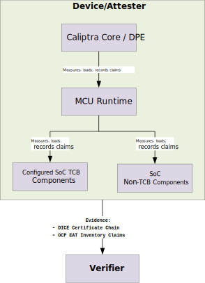

# Attestation Architecture

This document describes the attestation architecture for devices that integrate the Caliptra Subsystem, including Caliptra Core and MCU Runtime, to provide attesting environments for platform and SoC inventory attestation.

The architecture shows how Caliptra Core and MCU Runtime build and maintain the DICE/DPE trust chain, how downstream SoC measurements are collected, and how the DICE/DPE certificate chain and OCP EAT claims together describe comprehensive device state.

## Scope

This document addresses:

1. DPE context tree topology and attestation key target selection.
2. TCB and non-TCB claim classification.
3. How the DICE/DPE certificate chain and OCP EAT claims together let a Verifier appraise device identity and inventory claims.
4. How MCU Runtime assembles inventory Evidence for platform and SoC components.
5. Confidential-compute branch topology, where applicable.

Detailed DPE command semantics, handle lifecycle mechanics, Caliptra ROM boot internals, and SPDM transport binding are covered by their corresponding design documents and specifications.

## Terminology

| Term | Definition |
| --- | --- |
| TCB Component | Firmware or hardware whose integrity directly affects the device security posture. In this architecture, configured SoC TCB components are represented as DPE contexts. Only TCB components on the path from root to the selected attestation key target contribute to that key. TCB components outside that path are reported as OCP EAT inventory claims. |
| Non-TCB Component | Firmware or hardware whose claims are collected by MCU Runtime but do not participate in CDI or attestation key derivation. These claims are managed in Software PCR Storage backed by access-protected MCU SRAM and included directly as OCP EAT inventory claims. |
| DPE Context Tree | Directed tree of DPE contexts maintained by the Caliptra DPE instance. The tree mirrors the layered DICE trust chain. |
| AK | Attestation key derived by DPE through `CertifyKey` at a selected DPE context. |
| AK Target Node | Configured DPE context used for `CertifyKey`. It determines which DPE ancestry contributes to the attestation key. |
| CC Branch | Confidential-compute branch forked from the main DPE context tree at an integrator-configured fork point. |
| Evidence | RATS conceptual message created by an Attester and conveyed to a Verifier. In this architecture, Evidence includes the DICE/DPE certificate chain and OCP EAT claims that describe device identity and inventory claims. |
| OCP EAT Claims | OCP EAT profile-compliant claims assembled by MCU Runtime. MCU Runtime owns the OCP EAT and COSE formatting and asks Caliptra Core to sign the result using the configured AK. |
| Backdoor Update | DPE context update performed by Caliptra RT through internal state update mechanisms, without externally visible DPE handles. Used for Caliptra-managed contexts such as Root, CCIV, and MCU Runtime. |

## Device composition model

A device built on the Caliptra Subsystem contains:

1. **Caliptra Core**: Hardware root of trust containing ROM, FMC, and Runtime firmware. Caliptra Runtime hosts the DPE engine, services DPE requests from MCU Runtime, protects DPE state and attestation key material, and signs data provided by MCU Runtime using the configured AK.
2. **MCU Runtime**: Privileged DPE client, acting as a PL0 user, that Caliptra Core measures and authorizes before MCU Runtime is trusted to attest downstream SoC components. MCU Runtime holds its own DPE context handle and DPE context handles for configured SoC TCB components. It measures and authorizes SoC components, manages protected measurement state, assembles OCP EAT claims, and owns the evidence format signed by the configured AK.

Downstream SoC components are classified as TCB or non-TCB by the integrator static attestation configuration described later in this document.

## Layered attestation model

This architecture follows the layered attestation model described in RATS architecture: a measured layer can become the attesting environment for a later layer.

Caliptra Core is the attesting environment for the MCU Runtime layer: it measures and authorizes MCU Runtime, and MCU Runtime identity is represented in the Caliptra DICE/DPE chain as the MCU Runtime DPE context.

After MCU Runtime is trusted and running, MCU Runtime becomes the attesting environment for downstream SoC components.

After MCU Runtime starts, it measures and authorizes SoC components using image metadata available through Caliptra Core. An integrator static attestation configuration in the MCU Runtime user app classifies each `fw_id` as SoC TCB or SoC non-TCB, selects the AK target, and identifies the confidential-compute fork point when applicable.

SoC TCB components are represented as DPE contexts created or updated by MCU Runtime. SoC non-TCB component claims are stored in MCU-managed Software PCR Storage backed by access-protected MCU SRAM. The SPDM responder in MCU Runtime reads both sources to assemble OCP EAT claims and the `COSE_Sign1` envelope, then asks Caliptra Core to sign it using the configured AK.



## DPE context tree pattern

All device integrations share a common root chain managed by Caliptra:

```text
Root("RTMR")
 └─ CCIV("CCIV")
    └─ ROM_Stash_1..N
       └─ SoC_Manifest_Vendor("SOMV")
          └─ SoC_Manifest_Owner("SOMO")
             └─ MCU_RT("MCFW")
                └─ <configured SoC TCB context tree>
```

The chain above `MCU_RT` is common across integrations. Device-specific variation occurs below `MCU_RT`, where TCB components are arranged according to integrator static attestation configuration and the platform's attestation scenario.

| Level | DPE context | Description | Update and handle model |
| --- | --- | --- | --- |
| 0 | `Root("RTMR")` | DPE root context | Retired; backdoor-updated by Caliptra RT; internal handle. |
| 1 | `CCIV("CCIV")` | Caliptra Runtime context | Retired; backdoor-updated by Caliptra RT; internal handle. |
| 2 | `ROM_Stash_1..N` | ROM-stashed measurements | Retired; immutable; internal handle. |
| 3 | `SoC_Manifest_Vendor("SOMV")` | Vendor SoC manifest preamble | Retired; replayed from vendor SoC manifest; internal handle. |
| 4 | `SoC_Manifest_Owner("SOMO")` | Owner SoC manifest preamble | Retired; replayed from owner SoC manifest; internal handle. |
| 5 | `MCU_RT("MCFW")` | MCU Runtime context | Active; backdoor-updated by Caliptra RT; MCU holds non-default handle after `RotateContext`. |
| 6 | `<configured SoC TCB contexts>` | Downstream SoC TCB contexts configured by the vendor | Active; created or updated by MCU Runtime through DPE commands; MCU holds non-default handles. |

## AK derivation principle

DPE derives attestation keys with `CertifyKey(handle)`. The CDI chain walks from the DPE root to the selected handle, incorporating each ancestor's TCI measurement. The SoC integration defines the AK target node as part of integrator static attestation configuration. The AK target is not selected dynamically at runtime.

| AK target | Derivation behavior |
| --- | --- |
| Platform / inventory AK target | If the configured AK target is `MCU_RT`, the AK is derived from the platform boot chain only: Root -> CCIV -> ROM-stashed measurements -> SoC Manifest -> MCU_RT. Downstream SoC TCB contexts can still be reported as OCP EAT claims, but they do not contribute to this AK. |
| Configured SoC AK target | If the configured AK target is a downstream SoC TCB node, the AK is derived from the path from root through MCU_RT to that node. |
| CC branch AK target | For confidential computing, the CC branch fork point is an integrator static configuration choice. The CC AK is derived at the leaf of the CC branch. |

Choosing the AK node controls which DPE ancestry contributes to AK derivation. DPE walks from the selected node upward to root. It does not include descendant contexts below the selected node. Descendant SoC component contexts can still be reported as OCP EAT claims.

| Evidence class | Conveying mechanism |
| --- | --- |
| TCB components on the AK lineage | DICE/DPE certificate chain |
| Configured TCB contexts outside the AK lineage | OCP EAT claims assembled by MCU Runtime |
| Non-TCB components | OCP EAT claims assembled by MCU Runtime from Software PCR Storage |

`CertifyKey` establishes the AK identity. MCU Runtime assembles OCP EAT claims and the COSE signing structure, then asks Caliptra Core to sign the corresponding bytes using the configured AK. Caliptra Core does not need to interpret the OCP EAT or COSE format.

## Integrator static attestation configuration

MCU Runtime uses integrator-provided static configuration to identify:

1. Whether each `fw_id` is SoC TCB or SoC non-TCB.
2. Whether a SoC TCB component is the configured AK target.
3. The confidential-compute fork point, if the platform enables a confidential-compute branch.

This configuration affects which measurements enter DPE, which measurements are reported as OCP EAT inventory evidence, and which DPE context is used as the AK target. It is platform policy provided by the integrator in the MCU Runtime user app and is protected as part of the MCU Runtime image authorization flow.

`GET_IMAGE_INFO(fw_id)` remains the source for image metadata used by authorization and loading. The integrator static attestation configuration is the source for attestation routing policy.

## Attestation scenarios

This architecture has two top-level attestation scenarios:

1. **Inventory attestation**: Platform identity, SoC firmware measurements, configuration claims, and inventory claims for device owner or fleet-management verifiers.
2. **Confidential-compute attestation**: Confidential runtime or workload claims for tenant or workload verifiers.

Specific products such as management controllers, storage controllers, CPUs, and accelerators instantiate one or both scenarios. They are examples of the two scenarios, not separate architecture-level use cases.

| Scenario | Verifier | Evidence focus | AK target |
| --- | --- | --- | --- |
| Inventory attestation | Device owner, fleet manager, platform operator | Platform identity and SoC inventory claims | Integrator-configured inventory or SoC TCB target |
| Confidential-compute attestation | Tenant, workload owner, relying party | DICE/DPE certificate chain for the CC branch; additional evidence conveyance TBD | CC branch leaf |

## Inventory attestation

Inventory Evidence is assembled by MCU Runtime from two evidence pieces:

1. **DICE/DPE certificate chain**: Proves the lineage of the configured inventory AK target.
2. **OCP EAT**: Carries inventory claims for configured TCB components not already represented by the AK lineage, plus non-TCB inventory claims read from Software PCR Storage.

TCB components on the AK lineage are not repeated as inventory claims in OCP EAT. The verifier appraises the DICE/DPE certificate chain and OCP EAT claims according to their claim class and provenance.

## Evidence verification model (inventory and confidential-compute)

A Verifier validates attestation Evidence in two stages: it first authenticates the device, then appraises the reported measurements.

1. **Authenticate the device**: Validate the DICE/DPE certificate chain to authenticate device identity and trust anchor.
2. **Authenticate the claims**: Validate the OCP EAT signature using the AK anchored in the authenticated DICE/DPE chain.
3. **Appraise current state**: Appraise `current` digests against reference values (for example, CoRIMs), endorsements, and verifier policy.
4. **Appraise journey state**: Appraise `journey` by replaying expected extensions and matching the reported journey digest.

The appraisal uses both the current and journey measurement values reported for each component:

| Value | What the Verifier establishes | How |
| --- | --- | --- |
| `current` | The device's current running state | Verifies current digests in EAT claims against reference values (for example, CoRIMs), endorsements, and verifier policy. |
| `journey` | The device's measurement history across hitless updates | Replays a log of the extended measurements and confirms it reproduces the reported journey digests. |

### Hitless update appraisal

During a hitless update, the `current` value reflects the newly accepted component image and the `journey` value folds the new measurement into the accumulated history. The Verifier uses the `current` digest to confirm the running image matches a reference value and/or policy, and the `journey` digest to confirm the device passed only through expected measurements since cold boot.

The DICE/DPE certificate chain authenticates the device, and the signed OCP EAT conveys the `current` and `journey` values. Journey appraisal requires a log of the extended measurements so the Verifier can interpret and replay the reported journey digests (see [Extended-measurement log](#extended-measurement-log)).

This verification model is generic: it applies to inventory attestation and to confidential-compute attestation whenever `current` and `journey` claims are conveyed.

## Confidential-compute attestation

Confidential-compute attestation is modeled as a DPE branch selected by integrator static attestation configuration. The configured CC fork point is the active DPE context where the CC branch starts, and the CC AK target is the leaf of that branch.

The DICE/DPE certificate chain conveys the lineage to the CC branch leaf. How additional CC claims are conveyed beyond that certificate chain is TBD.

When confidential-compute evidence includes signed OCP EAT measurement claims, the verifier follows the same verification model described above.

Key isolation properties:

1. Updates below the CC fork point affect only the CC branch and do not affect the inventory/platform AK.
2. Updates to sibling inventory/platform components below the fork point do not affect the CC AK.
3. Both AKs share the common root chain through the fork point.
4. Updates at or above the fork point affect both the CC branch and the inventory/platform branch.

## Extended-measurement log

Appraising a `journey` measurement requires a log of the extended measurements that produced it: the Verifier replays the logged measurements and confirms they reproduce the reported journey digest. This applies wherever a measurement journey is appraised, so it is a general attestation concern, not specific to inventory attestation.

Generating and conveying this extended-measurement log is outside the scope of MCU Runtime and is yet to be defined. MCU Runtime does not produce this verifier replay log today.
