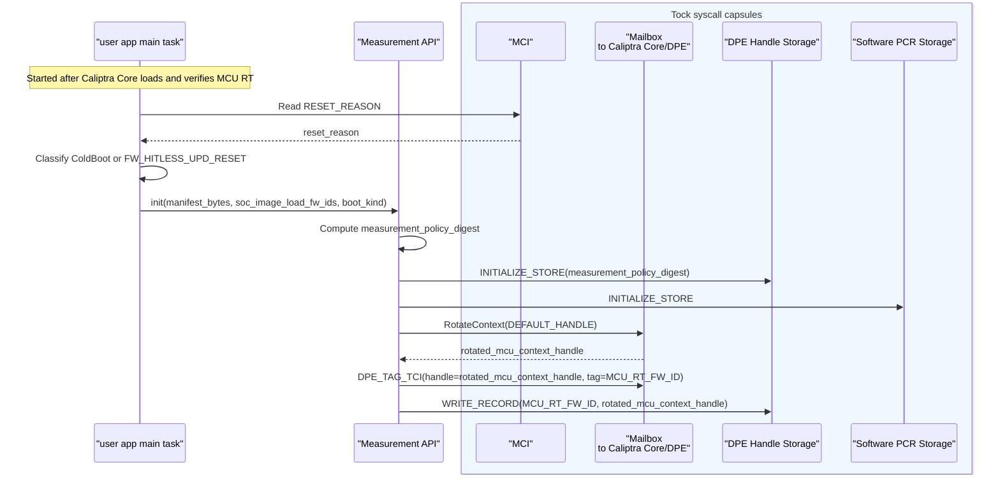
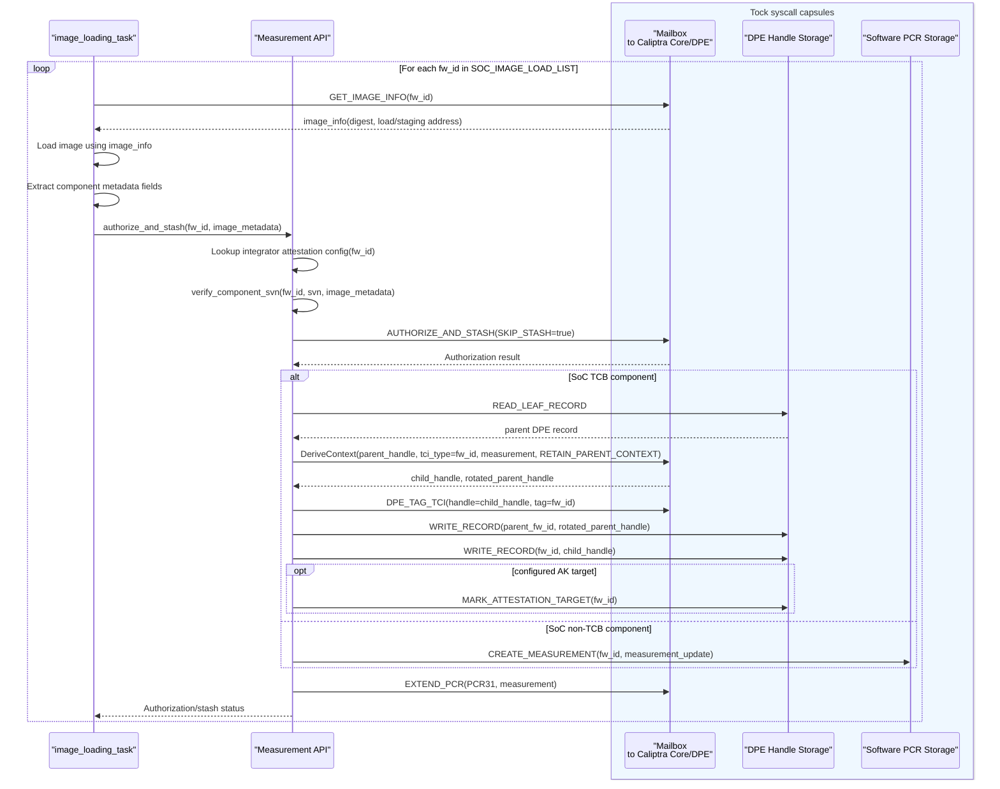
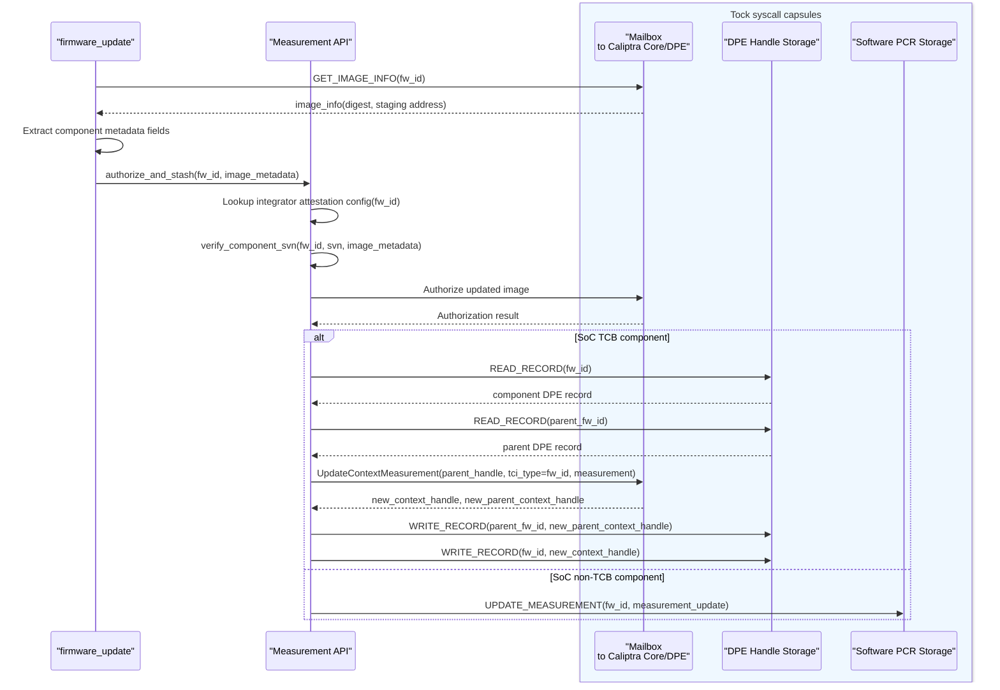
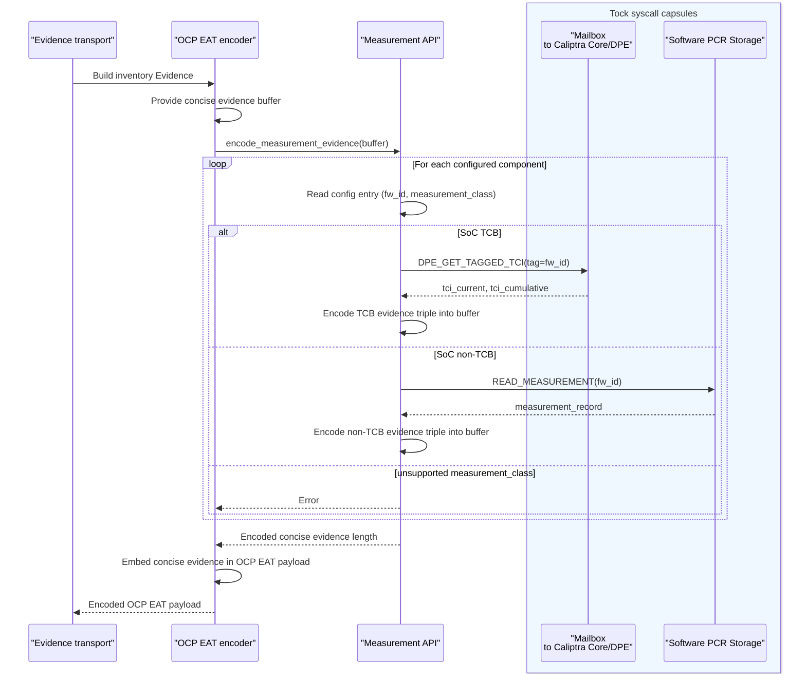

# Measurement API

This document describes the MCU Runtime measurement API used to collect, store, and report attestation measurement state.

The measurement API provides a single userspace interface for image loading, firmware update, and OCP EAT Evidence generation. Callers do not need to know whether a component's claims are represented by Caliptra DPE state or by the Software PCR Storage capsule.

This API is internal to MCU Runtime tasks. Requester-facing signed-Evidence retrieval is provided through transport-specific interfaces. The requester boundary differs by transport:

* BMC/pRoT style requesters use SPDM over MCTP.
* PCIe DOE requesters, such as confidential-compute PCIe devices, use SPDM over DOE.
* SoC-local requesters, such as an AP OS or TEE, can use the MCU mailbox path once defined.

Those requester-facing transport APIs are outside the scope of this document.


## API entry points

| Interface | Caller | Purpose |
| --- | --- | --- |
| `init(manifest_bytes, soc_image_load_fw_ids, boot_kind)` | Main user-app startup | Initializes the library-owned Measurement API instance. Cold boot clears stale state and creates the MCU Runtime root DPE record. MCU hitless update preserves state and validates it against the authenticated attestation policy. |
| `authorize_and_stash(fw_id, image_metadata)` | Image loading and firmware update | Authorizes a component, enforces anti-rollback policy, and stores its measurement through either the DPE Handle Storage capsule or the Software PCR Storage capsule. `image_metadata` includes the component metadata fields derived from `GET_IMAGE_INFO(fw_id)` and the current load/update operation. |
| `encode_measurement_evidence(buffer)` | OCP EAT encoder | Iterates the configured component list and writes the CBOR-encoded concise evidence triple array into a caller-provided buffer. Returns the encoded length or a required-size error. The caller owns the outer OCP EAT and COSE structures. |
| `leaf_cert_size(key_label)` | SPDM cert store | Returns the DPE leaf certificate size for the configured attestation target and updates the rotated DPE handle. |
| `leaf_cert_slice(key_label, cert_offset, buffer)` | SPDM cert store | Returns one DPE leaf certificate slice for the configured attestation target and updates the rotated DPE handle. |
| `leaf_kid(key_label, kid)` | OCP EAT provider | Computes the COSE `kid` for the configured attestation target and updates the rotated DPE handle. |
| `sign(key_label, digest, signature)` | SPDM cert store / OCP EAT provider | Signs a digest with the configured attestation target and updates the rotated DPE handle. |

Only the measurement API layer owns mutation of DPE Handle Storage capsule and Software PCR Storage capsule state. Image loading, firmware update, OCP EAT generation, and SPDM responders must not write those stores directly.

The Measurement API library owns the single MCU Runtime measurement state instance. User app startup initializes it with the authenticated Attestation Manifest and reset classification; SPDM, OCP EAT, image loading, and firmware update use the Measurement API library surface after initialization instead of passing DPE handles or store records between tasks.

The Tock capsule syscall drivers and reserved SRAM layout used by these APIs are described in [Tock Capsules](./attestation-tock-capsules.md).

## Data interfaces

The Measurement API uses three inputs: integrator configuration for component classification and target selection, SoC component image metadata for authorization/loading, and caller-provided image metadata for initial image load or component update.

### Firmware id source

`GET_IMAGE_INFO(fw_id)` looks up the SoC Manifest Image Metadata Entry for the firmware id of the image. It does not enumerate which images should be loaded.

The caller gets `fw_id` from the flow it owns:

| Caller | `fw_id` source |
| --- | --- |
| Image loader | Integrator/platform image load list for boot-time SoC images. The image loader uses this `fw_id` to call `GET_IMAGE_INFO(fw_id)` before loading the image. |
| Firmware update | Update package metadata or update flow state for the component being updated. The update flow uses this `fw_id` to call `GET_IMAGE_INFO(fw_id)` before authorizing the update. |
| OCP EAT encoder | Does not need to know the `fw_id` list. It asks the Measurement API to encode configured measurement claims into the EAT payload buffer. SPDM is one transport path that can carry the resulting Evidence. |

The `fw_id` values used by these flows must match the integrator static attestation configuration and the SoC component image metadata returned by `GET_IMAGE_INFO(fw_id)`. A configured component is a component whose `fw_id` is explicitly listed in the integrator static attestation configuration. The Measurement API must fail unknown or unsupported `fw_id` values explicitly.

In this document, `fw_id` represents the `fw_id` field in the SoC Manifest image metadata.

### Integrator static attestation configuration

The integrator static attestation configuration is represented by generated configuration artifacts embedded in the MCU Runtime user app image, including the authenticated Attestation Manifest and SoC image load list. Their format and validation rules are defined in [Static Integrator Configuration](./static_integrator_configuration.md).

The Measurement API uses this manifest to decide whether each listed `fw_id` is recorded through the DPE Handle Storage capsule or the Software PCR Storage capsule, whether the component is reported as OCP EAT inventory evidence, and which DPE-backed component is the attestation target.

| Field | Description |
| --- | --- |
| `fw_id` | Component firmware identifier used as the lookup key. |
| `measurement_class` | Routes the component as `SoC TCB` or `SoC non-TCB`. |
| `attestation_target` | Marks the SoC TCB component whose DPE record becomes the attestation target. |
| `inventory_evidence` | Marks whether the component is emitted as OCP EAT inventory evidence. |

The `measurement_class`, `attestation_target`, and `inventory_evidence` decisions come from this configuration. They are not supplied by callers and are not derived from `GET_IMAGE_INFO(fw_id)`.

The SoC Manifest image metadata, Attestation Manifest, and SoC image load list must use unique `fw_id` values. For MCU-managed SoC firmware images, each `SOC_IMAGE_LOAD_LIST` entry must have corresponding SoC/Auth Manifest image metadata and an Attestation Manifest entry. MCU Runtime must fail attestation policy validation if duplicate, unknown, missing, or inconsistent `fw_id` values are present.

`measurement_boot_init()` computes `measurement_policy_digest` over the canonical Attestation Manifest and ordered SoC image load list:

```text
measurement_policy_digest = SHA384(
    canonical_attestation_manifest_bytes ||
    canonical_ordered_soc_image_load_list_bytes
)
```

Cold boot stores the digest in preserved measurement metadata. On hitless update, the Measurement API recomputes the digest from the authenticated MCU Runtime image and compares it with the stored value before using preserved DPE/PCR state. A mismatch puts MCU Runtime in an attestation error state: normal attestation Evidence and component measurement-state updates are disabled until cold boot reinitializes measurement state.

### SoC component image metadata

`GET_IMAGE_INFO(fw_id)` remains the source for SoC component image metadata used by authorization and loading. Existing fields such as component ID, digest, load address, staging address, and related authorization metadata are used by the image loading and authorization paths.

`GET_IMAGE_INFO(fw_id)` is not used to classify components or select the attestation target.

The Measurement API does not need to issue `GET_IMAGE_INFO(fw_id)` again in the normal authorize/stash path. The image loader or firmware update flow already needs that response to locate and load the image, so it passes the required component metadata fields into `authorize_and_stash()`.

### Caller-provided operation metadata

`authorize_and_stash()` receives image metadata from image loading for `InitialLoad` or from firmware update for `ComponentUpdate`:

| Field | Description |
| --- | --- |
| `operation` | `InitialLoad` for boot-time image loading or `ComponentUpdate` for firmware update. |
| `image_info` | Component metadata fields derived from the `GET_IMAGE_INFO(fw_id)` response fetched by image loading or firmware update. |
| `source` | Image source, such as load address, staging address, or digest-in-request. |
| `image_size` | Image size when the source is an address. |
| `measurement` | Component measurement digest. |
| `journey_digest` | Journey or integrity-register digest. |
| `svn` | Component SVN used for rollback checks and claims. |
| `version` | Component version used for claims, encoded as `u32`. |
| `flags` | Caller flags, such as skip-stash behavior. |

### DPE tagging

For SoC TCB components, DPE `tci_type` is the component `fw_id`. The Measurement API also tags each newly created SoC TCB DPE context with `DPE_TAG_TCI(handle=<context_handle>, tag=fw_id)`.

The tag gives the read path a stable way to retrieve TCI values for that component later. DPE context handles can rotate after derive/update operations, but the tag remains associated with the DPE context. When inventory Evidence is generated, the Measurement API can call `DPE_GET_TAGGED_TCI(tag=fw_id)` to read the tagged context's current and cumulative TCI values without requiring the caller to know the current DPE handle.

## Boot initialization

On cold boot, persistent DPE/PCR state is treated as stale. `init(manifest_bytes, soc_image_load_fw_ids, boot_kind)` constructs the library-owned Measurement API instance and runs boot initialization. Boot initialization validates the SoC image load list against the Attestation Manifest, computes `measurement_policy_digest`, initializes DPE Handle Storage with that digest, initializes Software PCR Storage, rotates the default DPE handle, tags the MCU Runtime context, and writes the MCU Runtime root DPE record.



The MCU Runtime root DPE record contains:

| Field | Value |
| --- | --- |
| `fw_id` | `MCU_RT_FW_ID` |
| `parent_fw_id` | `None` |
| `context_handle` | Rotated MCU Runtime DPE context handle |
| `tci_tag` | `MCU_RT_FW_ID` |
| `attestation_target` | `true` by default |

On `FW_HITLESS_UPD_RESET`, the reserved SRAM backing the stores must not be reset or reinitialized. Boot initialization recomputes `measurement_policy_digest`, calls DPE Handle Storage `VALIDATE_STORE(measurement_policy_digest)`, and calls Software PCR Storage `VALIDATE_STORE` before using preserved state. It then validates preserved records against the static attestation policy/topology instead of clearing them. If the policy/topology digest mismatches, the MCU Runtime DPE record is missing, the active DPE leaf is missing, or Software PCR Storage validation fails, the flow must enter the attestation error state rather than silently creating a new lineage.

## Attestation key operations

The Measurement API owns DPE handle lifecycle for attestation-key operations. Callers that need the configured attestation key do not invoke DPE `CertifyKeyChunks`, `CertifyKey`, or `Sign` directly when those commands operate on Measurement API-managed contexts. Instead, they call Measurement API operations that read the current attestation target record, issue one DPE command, persist the returned handle, and then return the command result.

The Measurement API exposes these operations through its library-owned measurement state instance. This keeps SPDM certificate assembly, SPDM signing, OCP EAT `kid` generation, and OCP EAT signing on the same handle-tracking path.

Each operation is a one-shot DPE handle operation:

```text
read current attestation target record
issue exactly one DPE command using record.context_handle
write returned context_handle back to DPE Handle Storage
return command result
```

If the DPE command succeeds but the handle-store update fails, Measurement API enters the attestation error state. This prevents later operations from reusing a stale DPE handle.

`CertifyKeyChunks` is stateless with respect to certificate offsets: every request supplies `offset` and `max_size`. It is not stateless with respect to DPE context handles; each invocation can rotate the input handle. Therefore every `leaf_cert_size()` and `leaf_cert_slice()` call updates DPE Handle Storage before returning.

`GetCertificateChain` is not routed through these operations because it does not take a DPE context handle and does not rotate one.

## Initial image loading

For each `fw_id` in `SOC_IMAGE_LOAD_LIST`, image loading gets the corresponding SoC Manifest image metadata, loads the image, and calls `authorize_and_stash(fw_id, image_metadata)` with `operation=InitialLoad`. The Measurement API owns Caliptra authorization, DPE Handle Storage or Software PCR Storage updates, and the final PCR31 extension for MCU-managed measurements.



For a SoC TCB component, the previous active leaf is used as the parent. The parent record is updated with the rotated parent handle returned by `DeriveContext`, and the child record is appended with the child handle. The active DPE leaf is the last valid DPE record in `SOC_IMAGE_LOAD_LIST` order.

For a SoC non-TCB component, the measurement API creates a Software PCR record and leaves the DPE record log unchanged. If the record already exists during initial load, the API fails rather than overwriting it.

For both paths, PCR31 is extended only after Caliptra authorization succeeds and after the required DPE Handle Storage or Software PCR Storage state has been recorded. If a DPE command or Software PCR creation succeeds but a required store write, target mark, tag, or PCR31 extension fails, the Measurement API enters the attestation error state.

## SoC component update

For component update, firmware update calls `authorize_and_stash(fw_id, image_metadata)` with `operation=ComponentUpdate`.



Component updates do not re-tag DPE contexts. The existing `fw_id` tag remains associated with the DPE context across handle rotations.

## Measurement evidence encoding path

For inventory Evidence generation, the OCP EAT encoder provides a buffer and calls `encode_measurement_evidence(buffer)`. The Measurement API writes the CBOR-encoded concise evidence triple array into that buffer and returns the encoded length.

| Layer | Responsibility |
| --- | --- |
| Measurement API | Encodes the concise evidence triple array for configured SoC measurements. |
| OCP EAT encoder | Embeds the encoded concise evidence into the OCP EAT claims payload and owns EAT-level fields such as nonce, issuer, profile, debug status, and `cti`. |
| COSE signing path | Wraps the OCP EAT payload in `COSE_Sign1` and asks Caliptra Core to sign the corresponding bytes using the configured AK. |

EAT target-environment claims can carry component SVN and version values recorded by the Measurement API. The exact policy for which SVN value is reported, such as current SVN, minimum SVN since cold boot, or fuse-backed minimum SVN, is still to be finalized.

The API must fail cleanly on insufficient buffer space, unknown configuration, or missing measurement state. It must not emit truncated Evidence or silently substitute zero digests.



## SoC component anti-rollback enforcement

SoC component images must be validated for rollback protection before measurements are stored.

During `authorize_and_stash()`, MCU Runtime reads or receives the component's current SVN for `fw_id`, compares it against the fuse-backed or platform-policy minimum SVN, and rejects the component if `current_svn < min_svn`.

The measurement API updates the DPE Handle Storage capsule or Software PCR Storage capsule only after anti-rollback validation succeeds.
