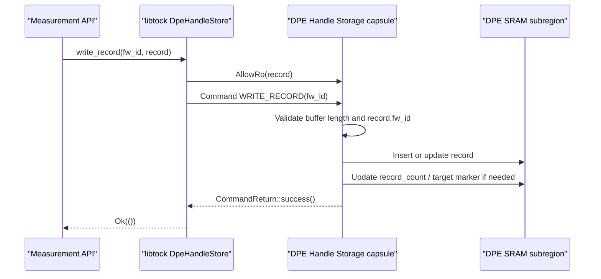
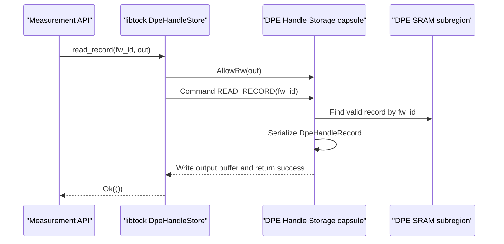
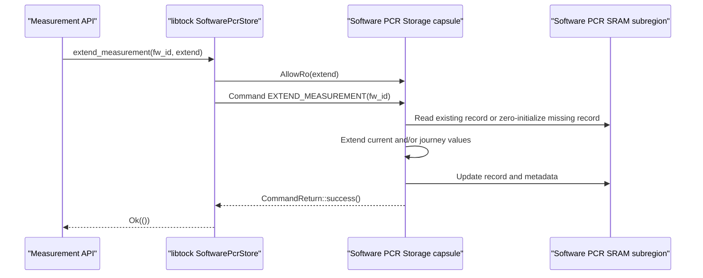
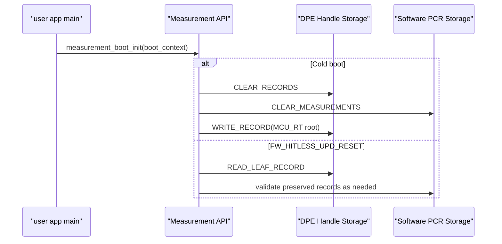

# Attestation Tock Capsules

Caliptra Subsystem attestation uses two Tock capsules to isolate and persist measurement records for MCU Runtime and downstream SoC components.

The capsules are kernel-side `SyscallDriver` implementations backed by a reserved SRAM region. This storage is used during normal image loading, component update, and Evidence generation, and it must survive MCU hitless update. MCU Runtime userspace code accesses the capsules through libtock syscall APIs. Image loading, firmware update, and Evidence generation code must go through the [Measurement API](./attestation-measurement-api.md); only the Measurement API mutates attestation storage.

The two capsules are:

| Capsule | Purpose |
| --- | --- |
| DPE Handle Storage | Stores current DPE context handles for MCU Runtime and SoC TCB components. |
| Software PCR Storage | Stores current and journey PCR-style measurement records for SoC non-TCB components. |

## Capsule stack


## Reserved SRAM layout

The platform provides one reserved SRAM region for measurement storage. That reservation is partitioned into two non-overlapping subregions:

```text
measurement_store_start
 |
 | DPE Handle Storage subregion
 |   - DPE store header
 |   - DPE handle records[capacity]
 |
 | Software PCR Storage subregion
 |   - PCR store header
 |   - measurement records[capacity]
 |
measurement_store_end
```

Board initialization passes only the corresponding subregion to each capsule. The capsules must not access each other's memory.

The full reservation must be outside kernel/app RAM and startup zeroing. The platform must provide each capsule only its assigned subregion. Cold boot clearing is performed explicitly by `measurement_boot_init()` through capsule syscalls. MCU hitless update preserves the full reservation.

## Board initialization

During board initialization, the platform constructs each capsule with its assigned SRAM subregion and registers each capsule as a `SyscallDriver`.

Board initialization must ensure:

1. The DPE Handle Storage capsule receives only the DPE Handle Storage subregion.
2. The Software PCR Storage capsule receives only the Software PCR Storage subregion.
3. Each capsule has a unique driver number. Proposed driver numbers:
   * DPE Handle Storage: `0x8000_0020`
   * Software PCR Storage: `0x8000_0021`
4. Both capsules are available through the platform syscall driver lookup.

## DPE Handle Storage capsule

The DPE Handle Storage capsule stores `fw_id`-keyed DPE context handle records for MCU Runtime and SoC TCB components.

### Record format

```Rust
pub const DPE_HANDLE_STORE_MAGIC: u32 = 0x4450_4553; // "DPES"
pub const DPE_HANDLE_STORE_VERSION: u16 = 1;

pub struct DpeHandleStoreHeader {
    magic: u32,
    version: u16,
    header_size: u16,
    record_size: u16,
    record_capacity: u16,
    record_count: u16,
    attestation_target_fw_id: u32,
}

pub struct DpeHandleRecord {
    fw_id: u32,
    parent_fw_id: Option<u32>,
    context_handle: [u8; 16],
    tci_tag: u32,
    flags: DpeHandleRecordFlags,
}

pub struct DpeHandleRecordFlags {
    valid: bool,
    attestation_target: bool,
}
```

The capsule maintains an ordered record log. The last valid record is the active DPE leaf. The active leaf is derived from storage and is not stored as a separate field.

`parent_fw_id` is stored instead of duplicating the parent context handle. DPE commands can rotate parent handles, so the current parent handle must be read from the parent record when needed.

### Userspace syscall API

```Rust
pub struct DpeHandleStore<S: Syscalls> {
    syscall: core::marker::PhantomData<S>,
    driver_num: u32,
}

impl<S: Syscalls> DpeHandleStore<S> {
    pub fn new(driver_num: u32) -> Self;
    pub fn exists(&self) -> Result<(), ErrorCode>;
    pub fn read_record(&self, fw_id: u32, out: &mut DpeHandleRecord) -> Result<(), ErrorCode>;
    pub fn write_record(&self, fw_id: u32, record: &DpeHandleRecord) -> Result<(), ErrorCode>;
    pub fn clear_records(&self) -> Result<(), ErrorCode>;
    pub fn read_leaf_record(&self, out: &mut DpeHandleRecord) -> Result<(), ErrorCode>;
    pub fn mark_attestation_target(&self, fw_id: u32) -> Result<(), ErrorCode>;
    pub fn read_attestation_target(&self, out: &mut DpeHandleRecord) -> Result<(), ErrorCode>;
}
```

### Syscalls provided

The DPE Handle Storage capsule implements the `SyscallDriver` trait.

1. Read-Write Allow
    - Allow number: 0
        - Description: Output buffer used by `READ_RECORD`, `READ_LEAF_RECORD`, and `READ_ATTESTATION_TARGET`.
        - Argument: Mutable userspace buffer large enough to hold one serialized `DpeHandleRecord`.

2. Read-Only Allow
    - Allow number: 0
        - Description: Input buffer used by `WRITE_RECORD`.
        - Argument: Serialized `DpeHandleRecord`.

3. Subscribe
    - Not used. DPE Handle Storage operations are synchronous.

4. Command
    - Command number 0:
        - Description: Existence check.
    - Command number 1:
        - Description: `READ_RECORD`
        - Argument 1: `fw_id`
        - Argument 2: Reserved, must be zero.
        - Output: Writes one serialized `DpeHandleRecord` into the Read-Write Allow buffer.
    - Command number 2:
        - Description: `WRITE_RECORD`
        - Argument 1: `fw_id`
        - Argument 2: Reserved, must be zero.
        - Input: Reads one serialized `DpeHandleRecord` from the Read-Only Allow buffer.
    - Command number 3:
        - Description: `CLEAR_RECORDS`
        - Argument 1: Reserved, must be zero.
        - Argument 2: Reserved, must be zero.
    - Command number 4:
        - Description: `READ_LEAF_RECORD`
        - Argument 1: Reserved, must be zero.
        - Argument 2: Reserved, must be zero.
        - Output: Writes the last valid DPE record into the Read-Write Allow buffer.
    - Command number 5:
        - Description: `MARK_ATTESTATION_TARGET`
        - Argument 1: `fw_id`
        - Argument 2: Reserved, must be zero.
    - Command number 6:
        - Description: `READ_ATTESTATION_TARGET`
        - Argument 1: Reserved, must be zero.
        - Argument 2: Reserved, must be zero.
        - Output: Writes the attestation target DPE record into the Read-Write Allow buffer.

### DPE record write sequence



### DPE record read sequence



### Error behavior

The capsule should return:

| Condition | Error |
| --- | --- |
| Unsupported command or allow number | `NOSUPPORT` |
| Missing required allow buffer | `INVAL` |
| Buffer smaller than serialized record | `SIZE` |
| `fw_id` not found | `FAIL` or a more specific not-found mapping if available |
| Record capacity exhausted | `NOMEM` |
| Header magic/version mismatch on validation | `FAIL` |
| Attempt to mark a non-existent record as attestation target | `FAIL` |

## Software PCR Storage capsule

The Software PCR Storage capsule stores current and journey PCR-style measurement records for SoC non-TCB components. This mirrors the Caliptra PCR model where a current PCR represents the current accepted measurement and a journey PCR accumulates the measurement history.

### Record format

```Rust
pub const SOFTWARE_PCR_STORE_MAGIC: u32 = 0x5350_4352; // "SPCR"
pub const SOFTWARE_PCR_STORE_VERSION: u16 = 1;

pub struct SoftwarePcrStoreHeader {
    magic: u32,
    version: u16,
    header_size: u16,
    record_size: u16,
    record_capacity: u16,
    record_count: u16,
}

pub struct MeasurementRecord {
    fw_id: u32,
    current_digest: [u8; 48],
    journey_digest: [u8; 48],
    svn: u32,
    version: ComponentVersion,
    flags: MeasurementRecordFlags,
}

pub struct MeasurementRecordFlags {
    valid: bool,
}

pub struct MeasurementExtend {
    fw_id: u32,
    extend_digest: [u8; 48],
    svn: u32,
    version: ComponentVersion,
}
```

The Software PCR Storage capsule exposes PCR-style operations:

| Operation | Use |
| --- | --- |
| `EXTEND_MEASUREMENT` | Updates the current value and extends the journey value for `fw_id`, following the Caliptra current/journey PCR model. The first extend for a missing record starts from the zero digest. |
| `READ_MEASUREMENT` | Reads the current and journey PCR-style values for `fw_id`. |
| `CLEAR_MEASUREMENTS` | Clears all Software PCR records on cold boot. |

`EXTEND_MEASUREMENT` follows the Caliptra PCR pattern:

```text
current_digest = SHA384(zero_digest || extend_digest)
journey_digest = SHA384(old_journey_digest || extend_digest)
```

When a component image is accepted, the current value represents the accepted component measurement and the journey value accumulates the component's measurement history. The capsule updates `svn` and `version` from the `MeasurementExtend` input associated with the accepted component image.

### Userspace syscall API

```Rust
pub struct SoftwarePcrStore<S: Syscalls> {
    syscall: core::marker::PhantomData<S>,
    driver_num: u32,
}

impl<S: Syscalls> SoftwarePcrStore<S> {
    pub fn new(driver_num: u32) -> Self;
    pub fn exists(&self) -> Result<(), ErrorCode>;
    pub fn read_measurement(&self, fw_id: u32, out: &mut MeasurementRecord) -> Result<(), ErrorCode>;
    pub fn extend_measurement(&self, fw_id: u32, extend: &MeasurementExtend) -> Result<(), ErrorCode>;
    pub fn clear_measurements(&self) -> Result<(), ErrorCode>;
}
```

### Syscalls provided

The Software PCR Storage capsule implements the `SyscallDriver` trait.

1. Read-Write Allow
    - Allow number: 0
        - Description: Output buffer used by `READ_MEASUREMENT`.
        - Argument: Mutable userspace buffer large enough to hold one serialized `MeasurementRecord`.

2. Read-Only Allow
    - Allow number: 0
        - Description: Input buffer used by `EXTEND_MEASUREMENT`.
        - Argument: Serialized `MeasurementExtend`.

3. Subscribe
    - Not used. Software PCR Storage operations are synchronous.

4. Command
    - Command number 0:
        - Description: Existence check.
    - Command number 1:
        - Description: `READ_MEASUREMENT`
        - Argument 1: `fw_id`
        - Argument 2: Reserved, must be zero.
        - Output: Writes one serialized `MeasurementRecord` into the Read-Write Allow buffer.
    - Command number 2:
        - Description: `EXTEND_MEASUREMENT`
        - Argument 1: `fw_id`
        - Argument 2: Reserved, must be zero.
        - Input: Reads one serialized `MeasurementExtend` from the Read-Only Allow buffer.
    - Command number 3:
        - Description: `CLEAR_MEASUREMENTS`
        - Argument 1: Reserved, must be zero.
        - Argument 2: Reserved, must be zero.

### Software PCR extend sequence



### Error behavior

The capsule should return:

| Condition | Error |
| --- | --- |
| Unsupported command or allow number | `NOSUPPORT` |
| Missing required allow buffer | `INVAL` |
| Buffer smaller than serialized record or extend request | `SIZE` |
| `fw_id` not found for read | `FAIL` or a more specific not-found mapping if available |
| Record capacity exhausted | `NOMEM` |
| Header magic/version mismatch on validation | `FAIL` |

## Reset behavior

Reset policy is owned by the Measurement API, not by the capsules.



On cold boot, `measurement_boot_init()` clears both stores through `CLEAR_RECORDS` and `CLEAR_MEASUREMENTS`.

On `FW_HITLESS_UPD_RESET`, startup code must preserve the full measurement SRAM reservation. The capsules validate and expose the preserved records but do not decide whether a reset is cold or hitless.

If preserved state is missing or invalid during hitless update, the Measurement API must fail closed and enter the platform recovery path.
