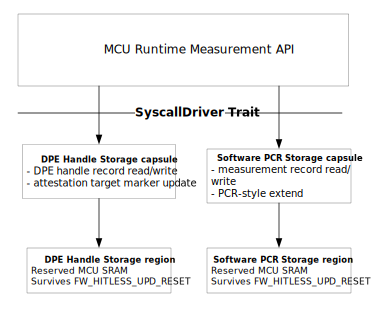
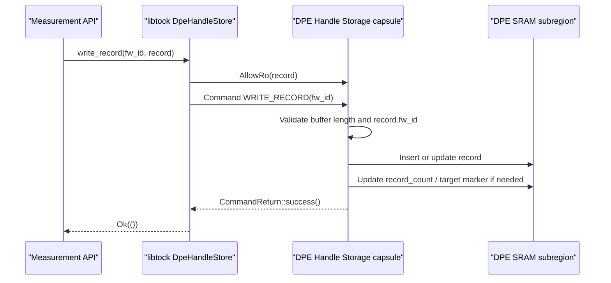
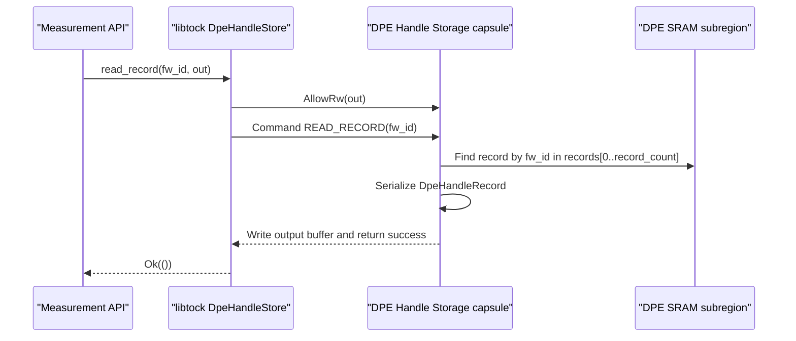
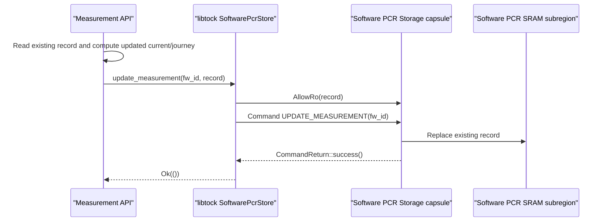
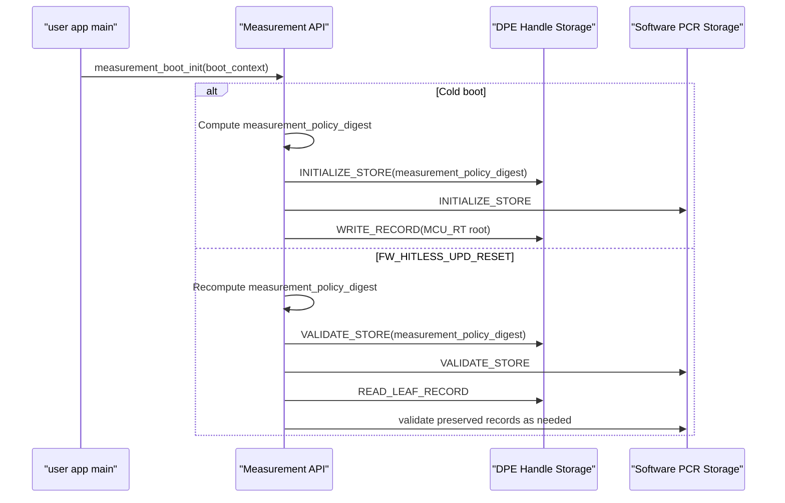

# Attestation Tock Capsules

Caliptra Subsystem attestation uses two Tock capsules to isolate and persist measurement records for MCU Runtime and downstream SoC components.

The capsules are kernel-side `SyscallDriver` implementations backed by a reserved SRAM region. This storage is used during normal image loading, component update, and Evidence generation, and it must survive MCU hitless update. MCU Runtime userspace code accesses the capsules through libtock syscall APIs. Image loading, firmware update, and Evidence generation code must go through the [Measurement API](./attestation-measurement-api.md); only the Measurement API mutates attestation storage.

The two capsules are:

| Capsule | Purpose |
| --- | --- |
| DPE Handle Storage | Stores current DPE context handles for MCU Runtime and SoC TCB components. |
| Software PCR Storage | Stores current and journey PCR-style measurement records for SoC non-TCB components. |

## Capsule stack



## Reserved SRAM layout

The platform provides one reserved SRAM region for measurement storage. That reservation is partitioned into two non-overlapping subregions:

```text
measurement_store_start
 |
 | DPE Handle Storage subregion
 |   - DPE store header
 |   - DPE handle records[capacity]
 |
 | Software PCR Storage subregion
 |   - PCR store header
 |   - measurement records[capacity]
 |
measurement_store_end
```

Board initialization passes only the corresponding subregion to each capsule. The capsules must not access each other's memory. Board initialization does not populate attestation records or policy metadata; those are initialized by `measurement_boot_init()`.

The full reservation must be outside kernel/app RAM and startup zeroing. The platform must provide each capsule only its assigned subregion. Cold boot clearing is performed explicitly by `measurement_boot_init()` through capsule syscalls. MCU hitless update preserves the full reservation.

## Board initialization

During board initialization, the platform constructs each capsule with its assigned SRAM subregion and registers each capsule as a `SyscallDriver`.

Board initialization must ensure:

1. The DPE Handle Storage capsule receives only the DPE Handle Storage subregion.
2. The Software PCR Storage capsule receives only the Software PCR Storage subregion.
3. Each capsule has a unique driver number. Proposed driver numbers:
   * DPE Handle Storage: `0x8000_0020`
   * Software PCR Storage: `0x8000_0021`
4. Both capsules are available through the platform syscall driver lookup.

## DPE Handle Storage capsule

The DPE Handle Storage capsule stores `fw_id`-keyed DPE context handle records for MCU Runtime and SoC TCB components.

### Record format

```Rust
pub const DPE_HANDLE_STORE_MAGIC: u32 = 0x4450_4553; // "DPES"
pub const DPE_HANDLE_STORE_VERSION: u16 = 1;

pub struct DpeHandleStoreHeader {
    magic: u32,
    version: u16,
    header_size: u16,
    record_size: u16,
    record_capacity: u16,
    record_count: u16,
    attestation_target_fw_id: u32,
    measurement_policy_digest: [u8; 48],
}

pub struct DpeHandleRecord {
    fw_id: u32,
    parent_fw_id: Option<u32>,
    context_handle: [u8; 16],
    tci_tag: u32,
    reserved: [u8; 4],
}
```

The capsule maintains an ordered record log. Records in `records[0..record_count]` are valid. The last record in that range is the active DPE leaf. The active leaf is derived from storage and is not stored as a separate field.

The attestation target is tracked by `attestation_target_fw_id` in the store header. DPE handle records do not carry a per-record target flag.

`parent_fw_id` is stored instead of duplicating the parent context handle. DPE commands can rotate parent handles, so the current parent handle must be read from the parent record when needed.

The DPE Handle Storage capsule creates the header when `measurement_boot_init()` calls `INITIALIZE_STORE` on cold boot. The capsule fills the structural fields from its assigned SRAM subregion: `magic`, `version`, `header_size`, `record_size`, `record_capacity`, `record_count = 0`, and an invalid `attestation_target_fw_id`. `measurement_boot_init()` supplies `measurement_policy_digest`, the SHA-384 digest of the canonical Attestation Manifest and ordered SoC image load list embedded in the authenticated MCU Runtime image:

```text
measurement_policy_digest = SHA384(
    canonical_attestation_manifest_bytes ||
    canonical_ordered_soc_image_load_list_bytes
)
```

On hitless update, `measurement_boot_init()` calls `VALIDATE_STORE(measurement_policy_digest)`. The capsule validates the header structural fields, capacity against the assigned SRAM slice, `record_count` bounds, stored digest equality, and the attestation target record if one is set before preserved DPE Handle Storage or Software PCR Storage is used.

### Userspace syscall API

```Rust
pub struct DpeHandleStore<S: Syscalls> {
    syscall: core::marker::PhantomData<S>,
    driver_num: u32,
}

impl<S: Syscalls> DpeHandleStore<S> {
    pub fn new(driver_num: u32) -> Self;
    pub fn exists(&self) -> Result<(), ErrorCode>;
    pub fn initialize(&self, measurement_policy_digest: &[u8; 48]) -> Result<(), ErrorCode>;
    pub fn validate(&self, measurement_policy_digest: &[u8; 48]) -> Result<(), ErrorCode>;
    pub fn read_record(&self, fw_id: u32, out: &mut DpeHandleRecord) -> Result<(), ErrorCode>;
    pub fn write_record(&self, fw_id: u32, record: &DpeHandleRecord) -> Result<(), ErrorCode>;
    pub fn read_leaf_record(&self, out: &mut DpeHandleRecord) -> Result<(), ErrorCode>;
    pub fn mark_attestation_target(&self, fw_id: u32) -> Result<(), ErrorCode>;
    pub fn read_attestation_target(&self, out: &mut DpeHandleRecord) -> Result<(), ErrorCode>;
}
```

### Syscalls provided

The DPE Handle Storage capsule implements the `SyscallDriver` trait.

1. Read-Write Allow
    - Allow number: 0
        - Description: Output buffer used by `READ_RECORD`, `READ_LEAF_RECORD`, and `READ_ATTESTATION_TARGET`.
        - Argument: Mutable userspace buffer large enough to hold one serialized `DpeHandleRecord`.

2. Read-Only Allow
    - Allow number: 0
        - Description: Input buffer used by `INITIALIZE_STORE`, `VALIDATE_STORE`, and `WRITE_RECORD`.
        - Argument: Serialized measurement policy/topology digest for `INITIALIZE_STORE` / `VALIDATE_STORE`, or serialized `DpeHandleRecord` for `WRITE_RECORD`.

3. Subscribe
    - Not used. DPE Handle Storage operations are synchronous.

4. Command
    - Command number 0:
        - Description: Existence check.
    - Command number 1:
        - Description: `READ_RECORD`
        - Argument 1: `fw_id`
        - Argument 2: Reserved, must be zero.
        - Output: Writes one serialized `DpeHandleRecord` into the Read-Write Allow buffer.
    - Command number 2:
        - Description: `WRITE_RECORD`
        - Argument 1: `fw_id`
        - Argument 2: Reserved, must be zero.
        - Input: Reads one serialized `DpeHandleRecord` from the Read-Only Allow buffer.
    - Command number 3:
        - Description: `INITIALIZE_STORE`
        - Argument 1: Reserved, must be zero.
        - Argument 2: Reserved, must be zero.
        - Input: Reads a 48-byte `measurement_policy_digest` from the Read-Only Allow buffer.
        - Behavior: Writes a fresh `DpeHandleStoreHeader`, zeroizes all record slots, resets `record_count`, and clears the attestation target marker.
    - Command number 4:
        - Description: `READ_LEAF_RECORD`
        - Argument 1: Reserved, must be zero.
        - Argument 2: Reserved, must be zero.
        - Output: Writes the last DPE record in `records[0..record_count]` into the Read-Write Allow buffer.
    - Command number 5:
        - Description: `MARK_ATTESTATION_TARGET`
        - Argument 1: `fw_id`
        - Argument 2: Reserved, must be zero.
    - Command number 6:
        - Description: `READ_ATTESTATION_TARGET`
        - Argument 1: Reserved, must be zero.
        - Argument 2: Reserved, must be zero.
        - Output: Writes the attestation target DPE record into the Read-Write Allow buffer.
    - Command number 7:
        - Description: `VALIDATE_STORE`
        - Argument 1: Reserved, must be zero.
        - Argument 2: Reserved, must be zero.
        - Input: Reads a 48-byte expected `measurement_policy_digest` from the Read-Only Allow buffer.
        - Behavior: Validates header magic/version/sizes, capacity against the assigned SRAM slice, `record_count <= record_capacity`, stored digest equality, and that `attestation_target_fw_id` is unset or points to an existing record.

### DPE record write sequence



### DPE record read sequence



### Error behavior

The capsule should return:

| Condition | Error |
| --- | --- |
| Unsupported command or allow number | `NOSUPPORT` |
| Missing required allow buffer | `INVAL` |
| Buffer smaller than serialized record | `SIZE` |
| `fw_id` not found | `FAIL` or a more specific not-found mapping if available |
| Record capacity exhausted | `NOMEM` |
| Header magic/version mismatch on validation | `FAIL` |
| Attempt to mark a non-existent record as attestation target | `FAIL` |

## Software PCR Storage capsule

The Software PCR Storage capsule stores `fw_id`-keyed current and journey PCR-style measurement records for SoC non-TCB components. This mirrors the Caliptra PCR model where a current PCR represents the current accepted measurement and a journey PCR accumulates the measurement history.

### Record format

```Rust
pub const SOFTWARE_PCR_STORE_MAGIC: u32 = 0x5350_4352; // "SPCR"
pub const SOFTWARE_PCR_STORE_VERSION: u16 = 1;

pub struct SoftwarePcrStoreHeader {
    magic: u32,
    version: u16,
    header_size: u16,
    record_size: u16,
    record_capacity: u16,
    record_count: u16,
}

pub struct MeasurementRecord {
    fw_id: u32,
    current_digest: [u8; 48],
    journey_digest: [u8; 48],
    svn: u32,
    version: u32,
    reserved: [u8; 4],
}

```

`record_capacity` is derived from the assigned Software PCR SRAM subregion. It must be large enough for the configured SoC non-TCB component count. Records in `records[0..record_count]` are valid; the Software PCR record does not carry a per-record valid flag.

The Software PCR Storage capsule exposes PCR-style operations:

| Operation | Use |
| --- | --- |
| `INITIALIZE_STORE` | Writes a fresh Software PCR store header, resets `record_count`, and zeroizes all record slots on cold boot. |
| `VALIDATE_STORE` | Validates header magic/version/sizes, capacity against the assigned SRAM slice, and `record_count <= record_capacity` on hitless update. |
| `CREATE_MEASUREMENT` | Stores a new `MeasurementRecord` for `fw_id` during initial load. Fails if the record already exists. |
| `UPDATE_MEASUREMENT` | Stores an updated `MeasurementRecord` for `fw_id`. Fails if the record does not already exist. |
| `READ_MEASUREMENT` | Reads the current and journey PCR-style values for `fw_id`. |

Software PCR updates are explicit create-or-update operations. Initial load uses `CREATE_MEASUREMENT`, which creates the record and fails if the `fw_id` already exists. Component update uses `UPDATE_MEASUREMENT`, which updates the existing record and fails if the `fw_id` is missing. This prevents update and hitless-update flows from silently creating missing preserved state.

The Measurement API computes the `MeasurementRecord` in userspace before calling `CREATE_MEASUREMENT` or `UPDATE_MEASUREMENT`. Userspace reads any existing record, uses Caliptra SHA mailbox APIs to compute current and journey digests, and passes the full updated `MeasurementRecord` to the capsule. The capsule only stores and retrieves records; it does not compute SHA.

The Measurement API uses these digest rules:

```text
current_digest = SHA384(zero_digest || update_digest)
journey_digest = SHA384(old_journey_digest || update_digest)
```

For `CREATE_MEASUREMENT`, `old_journey_digest` is the zero digest. For `UPDATE_MEASUREMENT`, `old_journey_digest` comes from the existing record.

The current value represents the accepted component measurement. The journey value accumulates the component's accepted measurement history.

### Userspace syscall API

```Rust
pub struct SoftwarePcrStore<S: Syscalls> {
    syscall: core::marker::PhantomData<S>,
    driver_num: u32,
}

impl<S: Syscalls> SoftwarePcrStore<S> {
    pub fn new(driver_num: u32) -> Self;
    pub fn exists(&self) -> Result<(), ErrorCode>;
    pub fn initialize(&self) -> Result<(), ErrorCode>;
    pub fn validate(&self) -> Result<(), ErrorCode>;
    pub fn read_measurement(&self, fw_id: u32, out: &mut MeasurementRecord) -> Result<(), ErrorCode>;
    pub fn create_measurement(&self, fw_id: u32, record: &MeasurementRecord) -> Result<(), ErrorCode>;
    pub fn update_measurement(&self, fw_id: u32, record: &MeasurementRecord) -> Result<(), ErrorCode>;
}
```

### Syscalls provided

The Software PCR Storage capsule implements the `SyscallDriver` trait.

1. Read-Write Allow
    - Allow number: 0
        - Description: Output buffer used by `READ_MEASUREMENT`.
        - Argument: Mutable userspace buffer large enough to hold one serialized `MeasurementRecord`.

2. Read-Only Allow
    - Allow number: 0
        - Description: Input buffer used by `CREATE_MEASUREMENT` and `UPDATE_MEASUREMENT`.
        - Argument: Serialized `MeasurementRecord`.

3. Subscribe
    - Not used. Software PCR Storage operations are synchronous.

4. Command
    - Command number 0:
        - Description: Existence check.
    - Command number 1:
        - Description: `READ_MEASUREMENT`
        - Argument 1: `fw_id`
        - Argument 2: Reserved, must be zero.
        - Output: Writes one serialized `MeasurementRecord` into the Read-Write Allow buffer.
    - Command number 2:
        - Description: `CREATE_MEASUREMENT`
        - Argument 1: `fw_id`
        - Argument 2: Reserved, must be zero.
        - Input: Reads one serialized `MeasurementRecord` from the Read-Only Allow buffer.
        - Behavior: Creates a new record and fails if `fw_id` already exists.
    - Command number 3:
        - Description: `UPDATE_MEASUREMENT`
        - Argument 1: `fw_id`
        - Argument 2: Reserved, must be zero.
        - Input: Reads one serialized `MeasurementRecord` from the Read-Only Allow buffer.
        - Behavior: Updates an existing record and fails if `fw_id` does not exist.
    - Command number 4:
        - Description: `INITIALIZE_STORE`
        - Argument 1: Reserved, must be zero.
        - Argument 2: Reserved, must be zero.
        - Behavior: Writes a fresh `SoftwarePcrStoreHeader`, resets `record_count`, and zeroizes all record slots.
    - Command number 5:
        - Description: `VALIDATE_STORE`
        - Argument 1: Reserved, must be zero.
        - Argument 2: Reserved, must be zero.
        - Behavior: Validates header magic/version/sizes, capacity against the assigned SRAM slice, and `record_count <= record_capacity`.

### Software PCR update sequence



### Error behavior

The capsule should return:

| Condition | Error |
| --- | --- |
| Unsupported command or allow number | `NOSUPPORT` |
| Missing required allow buffer | `INVAL` |
| Buffer smaller than serialized record or update request | `SIZE` |
| `fw_id` not found for read | `FAIL` or a more specific not-found mapping if available |
| Record capacity exhausted | `NOMEM` |
| Header magic/version mismatch on validation | `FAIL` |

## Reset behavior

Reset policy is owned by the Measurement API, not by the capsules.



On cold boot, `measurement_boot_init()` initializes DPE Handle Storage through `INITIALIZE_STORE(measurement_policy_digest)` and Software PCR Storage through `INITIALIZE_STORE`.

On `FW_HITLESS_UPD_RESET`, startup code must preserve the full measurement SRAM reservation. The capsules validate and expose the preserved records but do not decide whether a reset is cold or hitless.

If preserved state is missing, invalid, or tied to a different `measurement_policy_digest` during hitless update, the Measurement API enters the attestation error state rather than silently creating a new lineage.
