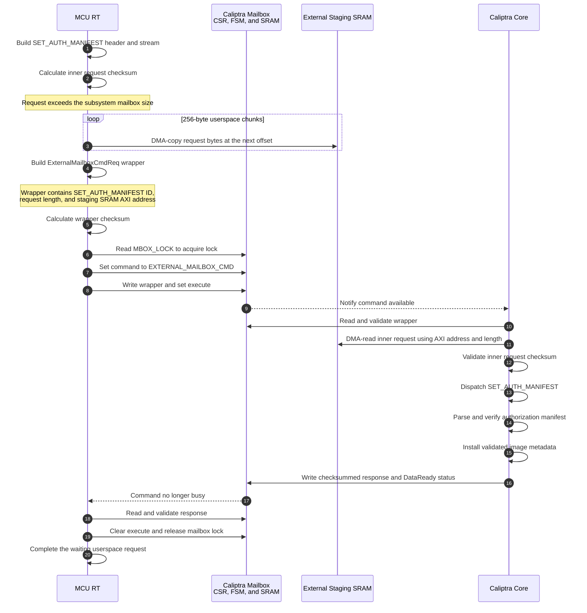

# Caliptra Mailbox Command Processing

MCU runtime communicates with Caliptra Core through the memory-mapped Caliptra
mailbox. On main-2.1, requests larger than the Caliptra subsystem mailbox use
the DMA-accessible external staging SRAM for their payload. The Caliptra mailbox
then carries only an `ExternalMailboxCmdReq` wrapper that identifies the
original command and describes the external payload.

The Caliptra mailbox SRAM shown below is distinct from the MCU mailbox SRAM used
by external SoC agents to send commands to MCU runtime.

## Large Request Example: SET_AUTH_MANIFEST

For requests that fit in the Caliptra subsystem mailbox, MCU runtime skips the
external staging path and writes the original command payload directly to the
Caliptra mailbox SRAM. The response path is the same in both cases.