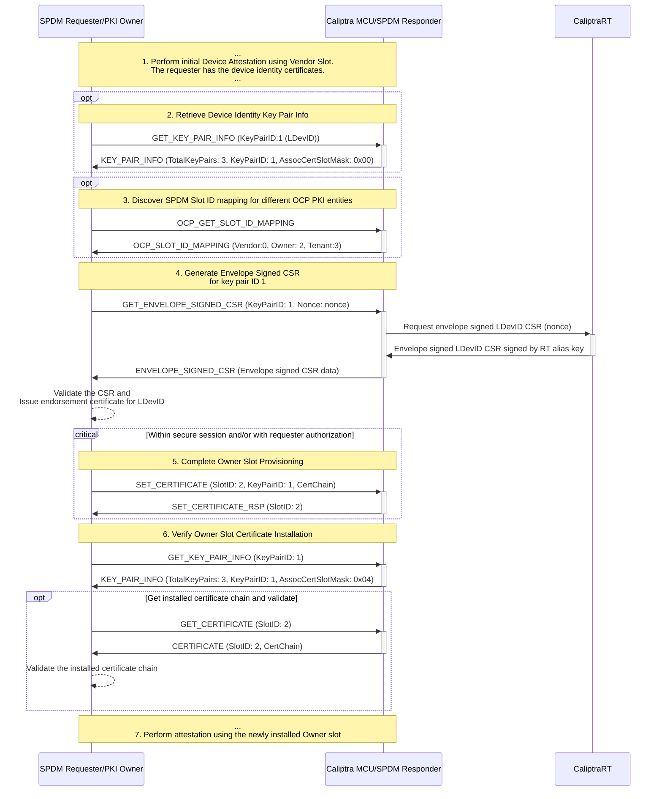

# In-field Provisioning and Management of SPDM Certificate Slots
This document provides guidance for provisioning and managing certificate slots on Caliptra devices via the SPDM protocol, conforming to the [OCP Device Identity Provisioning Specification](https://opencomputeproject.github.io/Security/device-identity-provisioning/HEAD/).

Supporting the multiple PKI ownership model defined by OCP requires SPDM Responder to support multiple asymmetric key pairs in the connection (`MULTI_KEY_CONN_RSP` is true). Consequently, OCP Device Identity Provisioning features requires SPDM version 1.3 or later.

## Caliptra Device Identity Key Pairs Discovery
Caliptra device shall support the following 3 key pairs for certificate slot provisioning and management:
- `LDevID` Key Pair (SPDM  Key pair ID 1)
- `FMC Alias` Key Pair (SPDM Key pair ID 2)
- `RT Alias` Key Pair (SPDM Key pair ID 3)

The `IdevID` key pair is pre‑provisioned by the vendor in SPDM certificate slot 0 and is treated as non‑configurable by the implementation.

The information about these key pairs can be retrieved by issuing the `GET_KEY_PAIR_INFO` request. The SPDM responder sets the `GET_KEY_PAIR_INFO_CAP` capability bit to advertise support for `KEY_PAIR_INFO` response messages. The implementation does not allow the requester to modify any parameters associated with Caliptra key pairs; as a result, the `SET_KEY_PAIR_INFO_CAP` capability bit remains cleared.

## SPDM Certificate Slot mapping to OCP PKI entities
The default SPDM certificate slot mapping to OCP PKI entities is as follows:
- Slot 0: Vendor (pre-provisioned, fixed and read-only)
- Slot 1: Unused (available for future use)
- Slot 2: Owner (provisionable by Owner PKI)
- Slot 3: Tenant (provisionable by Tenant PKI)

But the actual mapping can be discovered by the SPDM Requester using the `OCP_GET_SLOT_ID_MAPPING` request.

## Provisioning workflows using SPDM protocol
It is assumed that the Vendor slot is pre‑provisioned and meets the SPDM requirements for initial device attestation. The Vendor slot may also be used to establish a secure session with the SPDM Requester (Owner/Tenant PKI) for subsequent certificate‑slot provisioning.

The following sequence diagram illustrates the workflow for provisioning Owner certificate slots using the SPDM protocol.

    
## Envelope-signed CSR generation
The MCU's SPDM responder supports retrieval of an envelope‑signed Certificate Signing Request (CSR) for a specified Device Identity Key-pair ID via the OCP vendor‑defined `GET_ENVELOPE_SIGNED_CSR` command. Upon receiving this request, the MCU forwards it to the Caliptra RT firmware, which generates the CSR and returns it encapsulated in an `EAT` (Entity Attestation Token). The `EAT` is signed using the `RT Alias` key pair. The `nonce` provided in the request is forwarded to the RT firmware and included in the EAT to ensure freshness.

## Authorization and Security Considerations
The `SET_CERTIFICATE` command requires proper authorization to prevent security threats. Without authorization controls, attackers could exploit this interface through several attack vectors: flash wear-out attacks by repeatedly writing certificates to exhaust device lifetime; installation of malicious or unauthorized certificates enabling spoofing and elevation of privilege; and certificate slot poisoning to deny service to legitimate PKI owners. Authorization is enforced through the SPDM Authorization specification to validate that certificate installation requests originate from the legitimate PKI owner for the target slot.

For authorization to function properly, this specification assumes that credentials have been provisioned and the `TAKE_OWNERSHIP` command has already been issued in accordance with the SPDM Authorization specification (DSP0289), with the `SetCertPrivilege` bit set in the authorization policy. Caliptra does not implement authorization for `GetCSRprivilege` or `GetKeyPairInfoPrivilege`. Caliptra additionally rate limits certificate operations and maintains audit logs of provisioning activities.

Caliptra uses three credential slots out of the minimum eight required by the SPDM Authorization specification: Credential ID 0 for the Vendor, Credential ID 1 for the Owner, and Credential ID 2 for the Tenant. Each credential slot corresponds to one of the three PKI entities and has an associated authorization policy that controls certificate provisioning privileges for the respective SPDM certificate slots.

To enable debugging and testing of `SET_CERTIFICATE` authorization when Caliptra MCU is not in the Production lifecycle state (such as TestUnlocked, TestLocked, or Manufacturing states), a well-known credential is provisioned in all credential slots (Vendor, Owner, and Tenant) and available for use. This test credential allows developers to verify authorization enforcement without requiring production credential infrastructure. The well-known credential is disabled in Production lifecycle state.

### Rationale for Using SPDM Authorization Specification

This specification leverages the SPDM Authorization specification (DSP0289) rather than implementing alternative authorization mechanisms. An alternative approach would provision certificates in a physically secure or trusted environment and then lock the device to prevent further modifications. However, this approach presents significant challenges for device lifecycle management, particularly for enabling circular economy scenarios where devices must be repurposed or transferred between owners. The locked-device model would require designing custom unlock mechanisms and policies for legitimate device transfers.

The SPDM Authorization specification addresses these challenges through its credential-based authorization framework. The multi-credential architecture naturally supports the three distinct PKI entities in the OCP Device Identity model—Vendor, Owner, and Tenant—each requiring different authorization privileges. Without the Authorization specification, Caliptra would need to design and implement equivalent multi-level privilege systems, authentication mechanisms, and credential management infrastructure from scratch.

Furthermore, Tenant certificate provisioning typically occurs in operational cloud provider production environments rather than controlled factory settings, making trusted-environment-only provisioning approaches impractical. The SPDM Authorization specification enables extensible and secure certificate installation across untrusted networks, supporting real-world deployment scenarios without requiring custom protocol development.