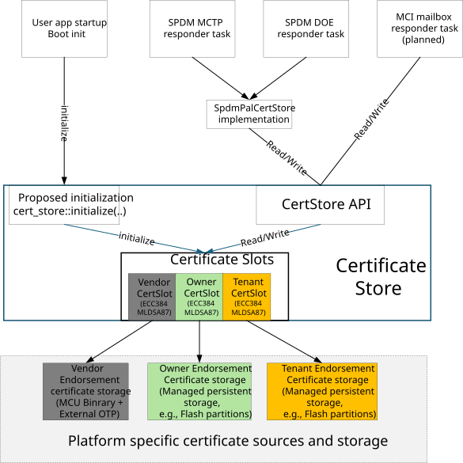

# Caliptra MCU Certificate Store

## Purpose and scope

This document defines the protocol-neutral behavior of the Caliptra MCU
certificate store. It describes the store's runtime contract, certificate
composition, persistence guarantees, and transport boundaries.

The trust model and certificate-chain contents are defined in the [Caliptra
Certificate Model](./certificate_model.md). The in-field provisioning
workflow is defined in [In-field Certificate Provisioning and
Management](./certificate_provisioning.md).

For concrete platform configuration steps, see [Certificate Store
Integration](./certificate-store-integration.md).

## Implementation status

This document defines the target release behavior. The current source
implements ECC P-384 Vendor certificate-chain retrieval through SPDM. Managed
Owner and Tenant slots are test-only. Common certificate-store initialization,
the Vendor IDevID certificate provider, ML-DSA-87 certificate chains, MCI
certificate commands, and configurable Tenant SlotIDs are planned. Production
authorization and managed-backing contracts are deferred.

## Certificate store overview

The target architecture provides one protocol-neutral certificate store
shared by all enabled SPDM and MCI mailbox responder tasks. The store supports
ECC P-384 and planned ML-DSA-87 certificate chains in Vendor, Owner, and
Tenant certificate slots. A static platform profile determines which optional
slots are enabled and whether the store uses the classical-only or
classical-plus-PQC algorithm profile.

Supported certificate algorithms are:

- ECC P-384, which is always enabled.
- ML-DSA-87, which is planned and enabled explicitly by the platform profile.

Supported certificate slots are:

- Vendor.
- Owner.
- Tenant.

When planned ML-DSA-87 support is enabled, every enabled certificate slot is
configured with both an ECC P-384 chain and an independent ML-DSA-87 chain.
For example, Owner ECC P-384 and Owner ML-DSA-87 have separate certificate
data, lifecycle state, and persistent backing.

SPDM SlotIDs and the planned MCI command fields are transport-specific
identifiers. They are mapped to the corresponding certificate chain before
the common store is accessed.

## Runtime architecture



The diagram shows the target release architecture. The current implementation
initializes `SharedCertStore` from the SPDM module. The common initialization,
ML-DSA-87, MCI, and configurable Tenant elements shown in the diagram are
planned.

The proposed initialization module is part of `CertStore` and exposes a
one-time `cert_store::initialize(...)` API. The user application will call
this API from its startup `boot_init()` path. The proposed API:

- Applies the static platform certificate-store profile.
- Obtains the complete IDevID certificate for each provisioned algorithm from
  the proposed platform `VendorIdevidCertificateProvider`.
- Recovers provisioned Owner and Tenant endorsements from their configured
  persistent backing.
- Determines which ECC P-384 and ML-DSA-87 certificate chains are available.
- Makes the store available to the responder tasks.

Initialization SHALL fail unless the Vendor ECC P-384 chain is provisioned
and available. Failure to initialize any other configured
algorithm-and-slot chain leaves only that chain unavailable and does not fail
common initialization.

A managed chain with accessible backing but no committed endorsement is
unprovisioned. A chain that cannot initialize because its anchor point,
certificate or signing capability, endorsement source, or backing is
unavailable is marked unavailable. Both states are excluded from the
provisioned-chain advertisement, and the initialization failure is reported
for platform diagnostics.

The target release starts the SPDM MCTP, SPDM DOE, and planned MCI mailbox
responder tasks only after the proposed initialization API succeeds. The SPDM
responder tasks access the store through the existing `SpdmPalCertStore`
implementation. The planned MCI mailbox command handler calls the common
certificate-store API directly.

The common store represents each logical algorithm-and-certificate-slot
combination as a `CertSlot`. These logical certificate slots are independent
of SPDM SlotIDs.

Each enabled certificate transport accesses the same `CertStore` instance.
An endorsement update through one transport is visible to all other enabled
certificate transports.

## Certificate slot behavior

The certificate store applies these slot semantics after initialization:

| Certificate slot | Certificate-store behavior |
| --- | --- |
| Vendor | Mandatory and read-only. Its PKI anchor point is the manufacturing IDevID, and it is configured to support every algorithm selected by the global profile. Only failure of its ECC P-384 chain is fatal to common initialization. |
| Owner | Optional managed endorsement. It is configured to support every algorithm selected by the global profile, with independent availability, lifecycle, and persistent backing for each algorithm. |
| Tenant | Optional managed endorsement, independent from Vendor and Owner. It is configured to support every algorithm selected by the global profile, with independent availability, lifecycle, and persistent backing for each algorithm. |

The Vendor endorsement certificates are established during manufacturing and
remain read-only for the device lifetime. They cannot be provisioned,
replaced, or removed at runtime. Owner and Tenant provisioning requires
authorization.

## Certificate-chain composition

For each available certificate slot, the store obtains:

- Caliptra device certificates below the configured PKI anchor point.
- The generated DPE leaf certificate.

The common store composes these sources in root-to-leaf order:

```text
complete chain =
    PKI endorsement
    + Caliptra device certificates below the PKI anchor point
    + generated DPE leaf certificate
```

Provisioning changes only the PKI endorsement. The generated Caliptra and DPE
certificates remain owned by the Caliptra certificate services.

Certificate signing remains outside the common store. The certificate and
signing services ensure that the generated leaf certificate and selected
signing key represent the same active identity.

## Managed endorsement backing

Managed Owner and Tenant endorsements use platform-provided persistent
backing. Each enabled algorithm-and-slot endorsement has independent backing.

The configured size is the maximum number of DER bytes accepted for the
provisioned PKI endorsement. It does not include the generated Caliptra and
DPE certificates used to compose the complete chain.

The backing may require additional space for implementation metadata and
atomic updates. ECC P-384 and ML-DSA-87 endorsements SHALL NOT share the same
managed certificate region.

The certificate store provides these externally visible guarantees:

- A replacement endorsement does not become active until it is completely
  received, validated, and committed.
- The previous endorsement remains readable while a replacement is in
  progress.
- Reset or power loss does not expose a partial endorsement.
- Removal is durable.
- Recovery selects a complete committed endorsement or an unprovisioned
  state.

The certificate store does not require a particular flash layout or
persistent record format.

## Shared runtime behavior

All enabled transports observe the same published state for each certificate
chain.

Reads return the complete chain. Provisioning operations accept only the PKI
endorsement. Provisioning cannot modify the configured device key, generated
certificate path, DPE leaf certificate, or private key.

Updates to different certificate keys are independent. An update to an Owner
ECC P-384 endorsement does not block or modify Owner ML-DSA-87, Vendor, or
Tenant state.

Readers receive a consistent certificate chain while an update is in
progress. Publication changes the active endorsement atomically for
subsequent operations.

These consistency guarantees do not require a reader-writer lock or another
particular synchronization primitive. Synchronization is internal to the
common store and is not exposed to the `SpdmPalCertStore` implementation or
the planned MCI mailbox command handler.

## Certificate algorithm requirements

### ECC P-384

The ECC P-384 chain for each enabled endorsement role requires:

- Its PKI endorsement source or managed backing.
- An ECC P-384 generated certificate path.
- An ECC P-384 DPE leaf certificate.
- Access to the corresponding ECC P-384 signing key.

### ML-DSA-87 (planned)

The ML-DSA-87 chain for each enabled endorsement role requires:

- Its own PKI endorsement source or managed backing.
- An ML-DSA-87 generated certificate path.
- An ML-DSA-87 DPE leaf certificate.
- Access to the corresponding ML-DSA-87 signing key.

ML-DSA-87 certificate data and storage are independent from ECC P-384. An
ML-DSA-87 chain remains unavailable until every component required for its
complete chain and signing operation is present.

Enabling ML-DSA-87 is independent of the configured SPDM protocol version.
SPDM 1.4 negotiates either ECC P-384 or ML-DSA-87 for a connection; it does
not use both algorithms together. The certificate store does not define SPDM
post-quantum protocol negotiation or message encoding.

## SPDM integration

The `SpdmPalCertStore` implementation:

- Maps the negotiated certificate algorithm and SPDM SlotID to a certificate
  chain.
- Advertises only certificate chains available through SPDM.
- Obtains complete chains from the common store.
- Sends authorized endorsement updates to the common store.

SPDM SlotID policy is defined in [In-field Certificate Provisioning and
Management](./certificate_provisioning.md). SPDM message formats are defined
by the SPDM specifications.

## MCI integration (planned)

The planned MCI mailbox command handler:

- Validates the requested certificate algorithm and `EndorsementRole`.
- Calls the `CertStore` API for complete-chain reads.
- Calls the common authorization and `CertStore` APIs for endorsement
  updates.
- Exposes only certificate chains available through MCI.

MCI will not use SPDM SlotIDs. The reserved command codes are documented in
[External Mailbox Commands](./external_mailbox_cmds.md); command formats and
handlers remain planned.

## Authorization boundary

Vendor endorsements are never writable. Owner and Tenant updates reach the
certificate store only after the requester and requested operation have been
authorized.

The production authorization credential format, policy, and lifecycle are
deferred and defined separately from the certificate store. The target design
uses the same transport-independent authorization content for SPDM and MCI;
only their outer transport framing differs.
