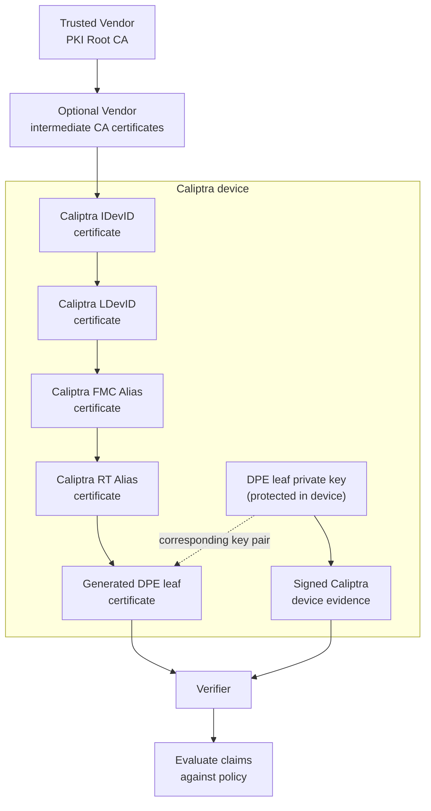
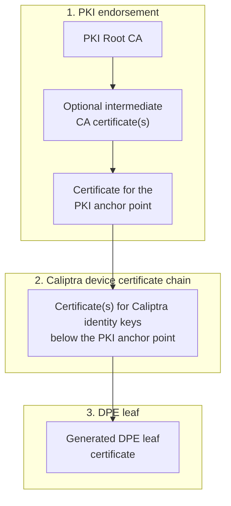

# Caliptra Certificate Model

## Introduction

A Caliptra device uses identity keys protected by Caliptra to sign
attestations about its identity, firmware, configuration, and runtime state.
When a verifier receives that evidence from the device, it must make two
separate decisions:

1. Authenticate the device and the key that signed the evidence.
2. Decide whether the authenticated claims satisfy its security policy.

The Caliptra certificate chain supports the first decision. It connects the
device's protected signing key to a PKI root trusted by the verifier. The
verifier validates that trust path before deciding whether the device's
reported state is acceptable.

Caliptra applies the [OCP Device Identity
Provisioning](https://opencomputeproject.github.io/Security/device-identity-provisioning/HEAD/)
multi-PKI-owner model through three certificate endorsement roles: Vendor,
Owner, and Tenant. The Vendor role represents the initial device identity
established during manufacturing. After deployment, the Owner role allows the
device owner to establish an identity rooted in its own PKI. The optional
Tenant role allows a tenant to establish a separate identity under the
tenant's PKI. The Caliptra MCU certificate store enables the same device to
present each of these trust paths while the corresponding private keys remain
protected inside Caliptra.

This document describes:

- What certificate chains enable.
- How Caliptra supports multiple PKI owners.
- How a complete Caliptra certificate chain is composed.
- What the Vendor, Owner, and Tenant certificate slots contain.

Software integration, initialization, persistence, synchronization, and
transport command handling are defined in the [Caliptra MCU Certificate
Store](./cert_store.md).

## Implementation status

This document defines the target certificate model. The current certificate
store implements ECC P-384 Vendor certificate-chain retrieval through SPDM.
ML-DSA-87 certificate chains are planned. Managed Owner and Tenant
provisioning is test-only until production authorization and backing contracts
are implemented.

## What certificate chains are used for

The Vendor certificate chain provides a concrete Caliptra example. The Vendor
endorses the Caliptra IDevID, and certificates in the Caliptra identity
hierarchy extend that trust path to the generated DPE leaf key used to sign
device evidence.



*Figure 1: A Vendor-endorsed Caliptra certificate chain authenticates the DPE
leaf key that signs device evidence*

Certificate-backed device keys can be used to authenticate:

- Device identity.
- Responses to freshness challenges.
- Firmware and configuration measurements.
- Attestation evidence.
- Secure-session establishment.
- Other signed device-management responses.

Although DMTF DSP0274 uses certificate chains for these purposes, the
trust model is not specific to SPDM. The Caliptra certificate store is
independent of the protocol used to retrieve or provision a chain.

A valid certificate chain authenticates the signing identity. It does not, by
itself, assert that the signed measurements or configuration are acceptable.
That decision remains with the verifier's policy.

The certificate store contains certificates and certificate metadata. Device
private keys remain protected inside Caliptra and are never provisioned
through the certificate store.

## Supporting multiple PKI owners

Caliptra follows the multi-PKI model defined by the [OCP Device Identity
Provisioning
Specification](https://opencomputeproject.github.io/Security/device-identity-provisioning/HEAD/).
That model allows more than one PKI owner to establish a trust path to a key
in the device identity hierarchy.

The following OCP concepts are used by this architecture:

| Concept | Meaning |
| --- | --- |
| PKI owner | The organization that controls the PKI under which a device identity is issued |
| PKI Root CA | The trust anchor distributed to verifiers for that PKI owner |
| PKI anchor point | The device identity key certified by that PKI owner |
| Endorsement | The CA certificates and device certificate that bind the PKI owner's root to the PKI anchor point |

Caliptra defines three values for `EndorsementRole`:

| `EndorsementRole` | Endorsing authority | Lifecycle use |
| --- | --- | --- |
| Vendor | Device manufacturer or silicon/platform vendor | Initial identity provisioned during manufacturing and read-only for the device lifetime |
| Owner | Current platform or cloud owner | In-field operational identity rooted in the Owner's PKI |
| Tenant | Tenant or delegated operator | Optional in-field identity rooted in a separate Tenant PKI |

The endorsement roles represent independent trust domains. An Owner or Tenant
certificate chain does not need to chain through the Vendor PKI. Each PKI
owner distributes its own Root CA as a trust anchor to the verifiers that
should accept that identity.

### Establishing a new PKI endorsement

The Vendor endorsement is provisioned once during manufacturing and remains
read-only for the lifetime of the device.

OCP DIP separates the identity key for which a CSR is requested from the
Attestation Key that authenticates the CSR. The target identity might not have
a provisioned certificate yet, so the device signs the attested CSR with an
Attestation Key associated with an already trusted certificate slot.

A PKI owner establishes its trust path as follows:

1. Authenticate the device by performing an initial attestation with an
   already trusted and provisioned certificate slot, for example, the Vendor
   slot.
2. Select the identity key that will be the PKI anchor point.
3. Obtain a CSR for that identity key, attested by the Attestation Key
   associated with the trusted slot.
4. Validate the trusted slot's certificate chain, the attested CSR signature,
   freshness, device binding, key derivation attributes, requested algorithm,
   and intended endorsement role.
5. Issue a certificate for the device public key under the PKI owner's Root
   CA or an authorized intermediate CA.
6. Provision the resulting endorsement into the matching certificate slot.
7. Read and validate the complete chain assembled by the device.
8. Configure the PKI owner's Root CA in the appropriate attestation
   verifiers.
9. Perform an attestation with the newly provisioned slot to verify the new
   trust path end to end.

Changing the endorsement changes which PKI authenticates the device key. It
does not import, export, or replace the private key held by Caliptra.

For the protocol-level Owner and Tenant workflow, see [In-field Certificate
Provisioning and Management](./certificate_provisioning.md).

## Caliptra certificate-chain composition

A complete Caliptra certificate chain has three logical levels composed in
root-to-leaf order:



*Figure 2: Three-level composition of a complete Caliptra certificate chain*

The PKI owner supplies the endorsement. Caliptra supplies the device
certificates below the endorsed key and the DPE leaf certificate for the
active evidence-signing key.

The certificate store assembles these sources into one complete chain for a
reader. The certificate store SHALL NOT permit provisioning software to
modify or replace the Caliptra device certificate chain or the generated
DPE leaf certificate.

Each complete chain SHALL use one certificate algorithm and form a valid path
from its PKI Root CA to its DPE leaf certificate.

A certificate slot is available to consumers only when the platform can:

- Provide the complete chain.
- Access the corresponding device private key for signing.
- Satisfy the certificate and signature algorithm profile for that slot.

## Certificate slots by endorsement role

The certificate store identifies each logical certificate-chain slot by its
certificate algorithm and endorsement role.

Supported certificate algorithms are:

| Certificate algorithm | Profile |
| --- | --- |
| ECDSA P-384 | Classical device identity and attestation |
| ML-DSA-87 | Planned post-quantum device identity and attestation |

The target design allows the platform to select one global certificate
algorithm profile: ECDSA P-384 only, or ECDSA P-384 plus planned ML-DSA-87.
When ML-DSA-87 is enabled, every enabled endorsement role has both
algorithm-specific chains. SPDM negotiates one of the supported algorithms
for a connection; the two chains are not a hybrid certificate chain.

This produces independent certificate chains such as Owner/ECDSA P-384 and
Owner/ML-DSA-87. Updating one chain does not change any other algorithm or PKI
entity.

`EndorsementRole` identifies whether the chain is endorsed by the Vendor,
Owner, or Tenant PKI.

### Vendor certificate slot

The Vendor slot contains the manufacturer-established identity. Its PKI
anchor point is the Caliptra IDevID.

```text
Vendor Root CA
    -> optional Vendor intermediate CA certificates
    -> Caliptra IDevID
    -> Caliptra LDevID
    -> Caliptra FMC Alias
    -> Caliptra RT Alias
    -> generated DPE leaf certificate
```

The Vendor Root CA and optional intermediate CA certificates are embedded in
the MCU Runtime user application image. The current implementation supplies a
complete signed ECC P-384 IDevID certificate. The target
classical-plus-PQC profile additionally supplies a complete signed ML-DSA-87
IDevID certificate. The platform can assemble those certificates using
certificate data from the MCU Runtime user application image, External OTP,
or both. Certificates below the IDevID are supplied by Caliptra.

The Vendor endorsement certificates are established during manufacturing and
remain read-only for the device lifetime.

### Owner certificate slot

The default Owner PKI anchor point is the Caliptra LDevID. The Owner
provisions an endorsement for the existing LDevID public key:

```text
Owner Root CA
    -> optional Owner intermediate CA certificates
    -> Owner-endorsed Caliptra LDevID
    -> Caliptra FMC Alias
    -> Caliptra RT Alias
    -> generated DPE leaf certificate
```

The Owner Root CA, intermediate certificates, and Owner-endorsed LDevID
certificate form the managed endorsement. Caliptra supplies the remaining
certificates.

An authorized Owner can replace or deactivate this endorsement without
changing the LDevID private key.

### Tenant certificate slot

The Tenant slot follows the Owner model but belongs to a separate PKI owner.
The platform profile selects the Caliptra identity key used as the Tenant PKI
anchor point.

```text
Tenant Root CA
    -> optional Tenant intermediate CA certificates
    -> Tenant-endorsed configured PKI anchor point
    -> Caliptra certificates below that anchor point
    -> generated DPE leaf certificate
```

Tenant support is optional. When enabled, its endorsement and lifecycle are
managed independently from both Vendor and Owner.

### Algorithm-specific slot availability

The chain shape and PKI ownership rules are the same for ECC P-384 and
planned ML-DSA-87, but every algorithm-specific slot requires its own
endorsement, generated certificate path, signing key support, and platform
backing.

When implemented, an ML-DSA-87 slot SHALL remain unavailable until the
platform can provide every component of the corresponding post-quantum chain
and use its leaf key for signing.
