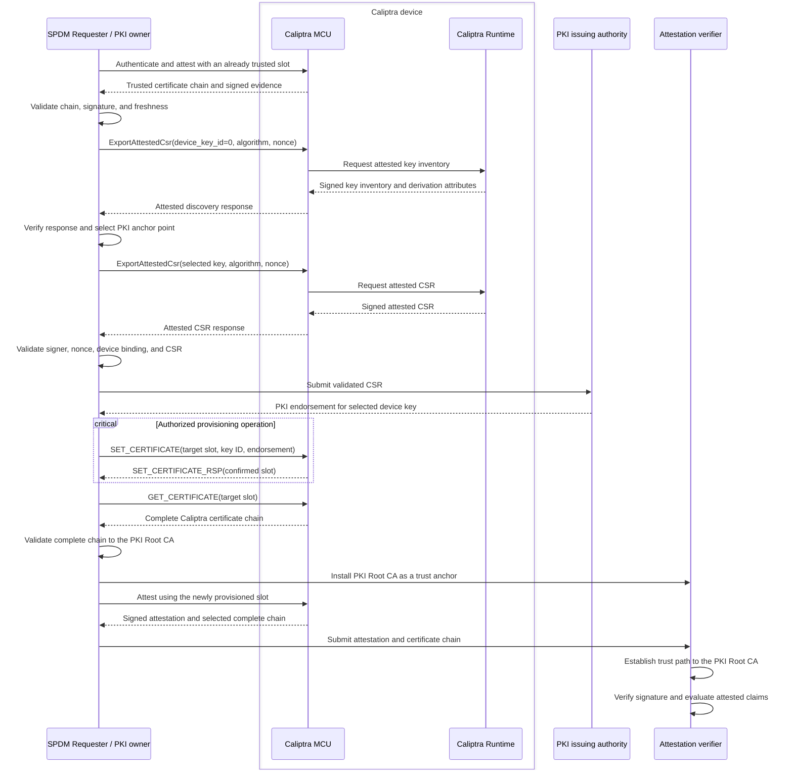

# In-field Certificate Provisioning and Management

## Purpose

This document defines the target in-field workflow for provisioning and
managing Caliptra Owner and Tenant endorsements over SPDM and planned MCI
certificate commands. The workflow is protocol-neutral; SPDM-specific SlotID
allocation and commands are identified where applicable.

The trust model, certificate-chain composition, and endorsement roles are
defined in the [Caliptra Certificate Model](./certificate_model.md). This
workflow follows the [OCP Device Identity Provisioning
Specification](https://opencomputeproject.github.io/Security/device-identity-provisioning/HEAD/).

The Vendor endorsement is provisioned once during manufacturing and remains
read-only for the lifetime of the device. In-field provisioning applies only
to managed Owner and Tenant slots.

## Implementation status

The current source implements Vendor ECC P-384 certificate retrieval through
SPDM. SPDM managed Owner and Tenant provisioning is test-only and does not
provide production authorization. Production authorization and managed
backing contracts are deferred. ML-DSA-87 certificate chains, MCI certificate
commands, and configurable Tenant SlotIDs are planned.

## Trust bootstrap

Before provisioning a new certificate slot, the requester SHALL authenticate
the Caliptra device using an already trusted and provisioned slot, for example,
the Vendor slot.

The requester:

1. Retrieves and validates the trusted slot's complete certificate chain.
2. Performs an initial device attestation using that slot.
3. Verifies the attestation signature and freshness against the trusted chain.

This establishes the trust used to authenticate subsequent key discovery and
attested CSR responses.

## Caliptra identity-key discovery

Caliptra uses the
[`ExportAttestedCsr`](./caliptra_common_commands.md#export-attested-csr)
command for both identity-key discovery and attested CSR retrieval. The
request contains a device key identifier, certificate algorithm, and
requester nonce.

| `device_key_id` | Mode | Response |
| --- | --- | --- |
| `0` | Discovery | Attested inventory of device key identifiers and their derivation attributes for the requested algorithm |
| Nonzero | CSR | Attested CSR for the selected device key and algorithm |

Using `device_key_id = 0` as the discovery selector follows the OCP DIP
key-pair discovery model. The discovery response SHALL be signed and bound to
the requester nonce so that an unauthenticated party cannot substitute the
key inventory.

The Caliptra profile defines these in-field identity keys:

| `device_key_id` | Caliptra identity key | Typical use |
| --- | --- | --- |
| `1` | LDevID | Default Owner PKI anchor point |
| `2` | FMC Alias | Optional anchor point selected for its derivation attributes |
| `3` | RT Alias | Optional anchor point selected for its derivation attributes |

The discovery response provides the derivation attributes needed by the PKI
owner to select an appropriate PKI anchor point. The Vendor IDevID is not an
in-field provisioning target in this profile.

## SPDM certificate-slot allocation

OCP DIP assigns Vendor to Slot 0 and Owner to Slot 2. The Tenant requester
selects an available SlotID when provisioning its endorsement and uses that
SlotID for subsequent Tenant operations.

| SPDM SlotID | `EndorsementRole` | Allocation |
| --- | --- | --- |
| `0` | Vendor | OCP allocated; provisioned during manufacturing and read-only |
| `1` |  | Reserved |
| `2` | Owner | OCP allocated; provisionable by an authorized Owner |
| `3` | Tenant | Current fixed Tenant slot; configurable Tenant SlotIDs are planned |

This SlotID allocation applies only to SPDM. The planned MCI certificate
commands identify the `EndorsementRole` directly and do not use SPDM SlotIDs.

The current implementation fixes Tenant to Slot 3. The target design adds
compile-time platform configuration for other eligible, otherwise unallocated
Tenant SlotIDs. The requester-selected assignment remains in effect until the
Tenant endorsement is removed.

The `device_key_id` identifies the Caliptra identity key that the PKI owner
certifies. The platform integrator defines the allowed device key, certificate
algorithm, and certificate model for each endorsement role through
compile-time platform configuration. A certificate provisioning command
cannot change those properties.

## Owner and Tenant provisioning workflow

The same workflow applies to Owner and Tenant. The selected slot and PKI
anchor point differ.

The target workflow supports certificate management over SPDM and MCI mailbox
transports. The sequence below shows the SPDM commands. SPDM managed updates
are currently test-only, and MCI certificate commands are planned. Once both
transports are implemented, they use the same certificate-store state. MCI
command codes are reserved in [External Mailbox
Commands](./external_mailbox_cmds.md).



## Validating discovery and attested CSR responses

The requester SHALL validate:

- The certificate chain for the Caliptra Attestation Key that signed the
  response.
- The signature over the attested response.
- The requester nonce and response freshness.
- The identity of the target Caliptra device.
- The selected `device_key_id` and certificate algorithm.
- The key derivation attributes returned for the selected identity key.
- The CSR public key and requested certificate profile.

The requester verifies the attested CSR using the trust already established
through a provisioned certificate slot.

The PKI owner SHALL NOT issue an endorsement if any validation fails.

## Provisioning the endorsement certificate chain

The SPDM `SET_CERTIFICATE` command currently supports test-only managed
provisioning. The planned MCI `MC_SET_CERT_CHAIN` command follows the same
target rule: provisioning accepts only the PKI endorsement.

```text
PKI Root CA
    -> optional intermediate CA certificates
    -> certificate for the selected Caliptra PKI anchor point
```

The Caliptra device certificates below the PKI anchor point and the DPE leaf
certificate are generated by Caliptra. They SHALL NOT be included as writable
content in the provisioning operation.

The certificate provisioning path validates that:

- The target endorsement role is writable.
- The requester is authorized for that endorsement role.
- The selected device key, certificate algorithm, and certificate model are
  permitted for that endorsement role.
- The endorsement is a well-formed DER certificate sequence.
- The final endorsement certificate contains the public key of the selected
  Caliptra device key.
- The endorsement does not exceed the configured maximum stored endorsement
  size.

The platform profile uses the SPDM AliasCert certificate model for managed
Owner and Tenant endorsements.

After provisioning, the operator should validate the complete chain against
the expected PKI Root CA and perform an attestation with the provisioned
identity to confirm the trust path.

## Authorization model

Production certificate provisioning requires an authenticated requester and
an authorization policy that binds the requester, endorsement role, selected
device key, and requested operation. This production contract is deferred.
The target design uses the same authorization messages and signed content for
SPDM and MCI. Only the outer transport framing differs.

The SPDM authorization profile is deferred. DSP0289, the SPDM Authorization
Specification, is one option under consideration. Its suitability depends on
using the same authorization messages and signed content over both SPDM and
MCI.

### Rationale for Using SPDM Authorization Specification

An alternative approach would provision certificates in a physically secure
or trusted environment and then lock the device to prevent further
modifications. However, this approach presents significant challenges for
device lifecycle management, particularly for enabling circular economy
scenarios where devices must be repurposed or transferred between owners. The
locked-device model would require custom unlock mechanisms and policies for
legitimate device transfers.

The SPDM Authorization Specification addresses these challenges through its
credential-based authorization framework. The multi-credential architecture
supports the Vendor, Owner, and Tenant endorsement roles, each with different
authorization privileges. Using DSP0289 would apply this existing SPDM
credential and policy framework to certificate provisioning.

Furthermore, Tenant certificate provisioning typically occurs in operational
cloud provider production environments rather than controlled factory
settings, making trusted-environment-only provisioning approaches
impractical. DSP0289 enables extensible and secure certificate installation
across untrusted networks while using the existing Caliptra certificate
provisioning operations.

The production authorization profile and credential lifecycle are deferred.
The selected profile must preserve the common authorization messages across
SPDM and MCI.
