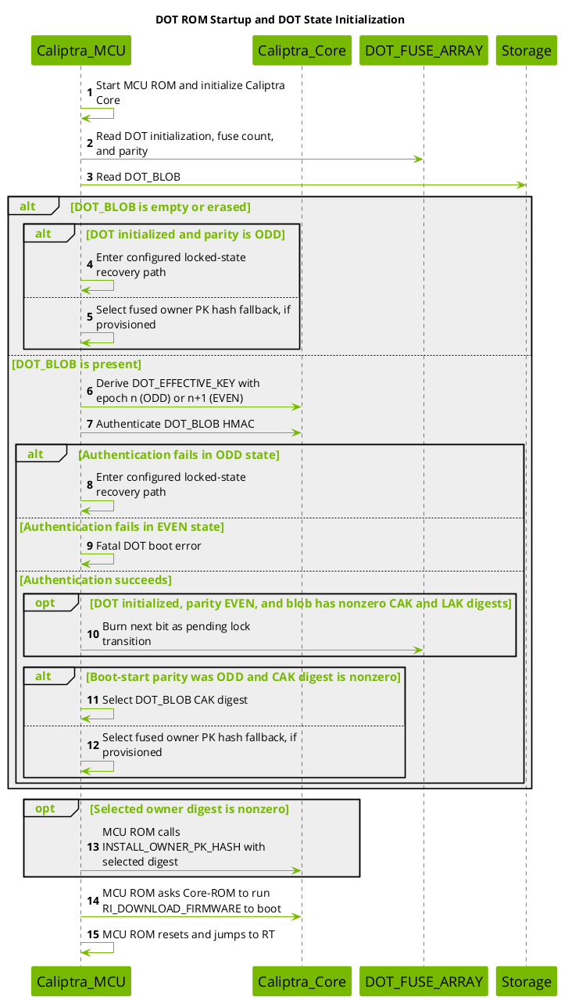
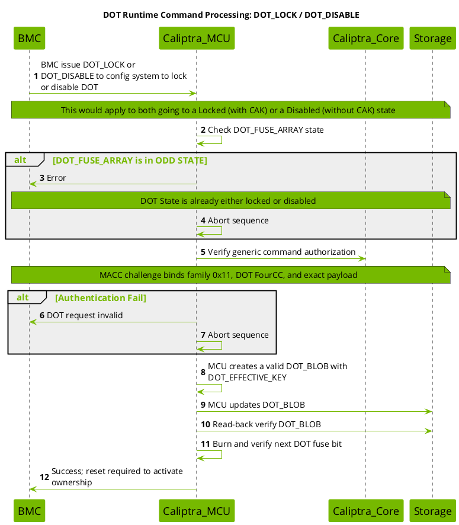
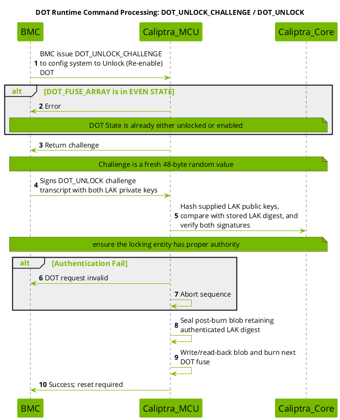
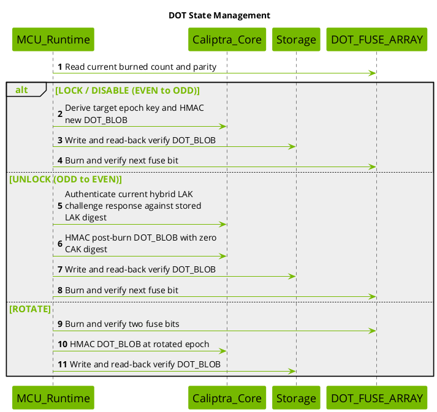
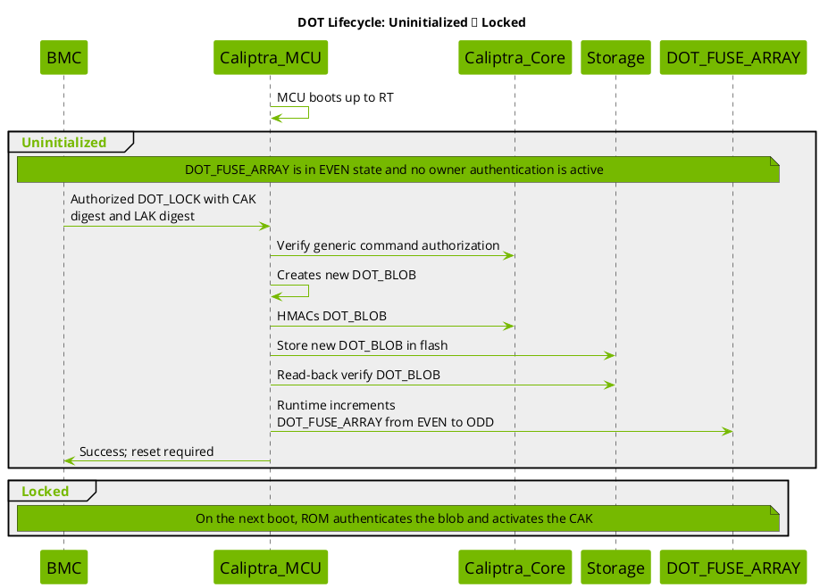
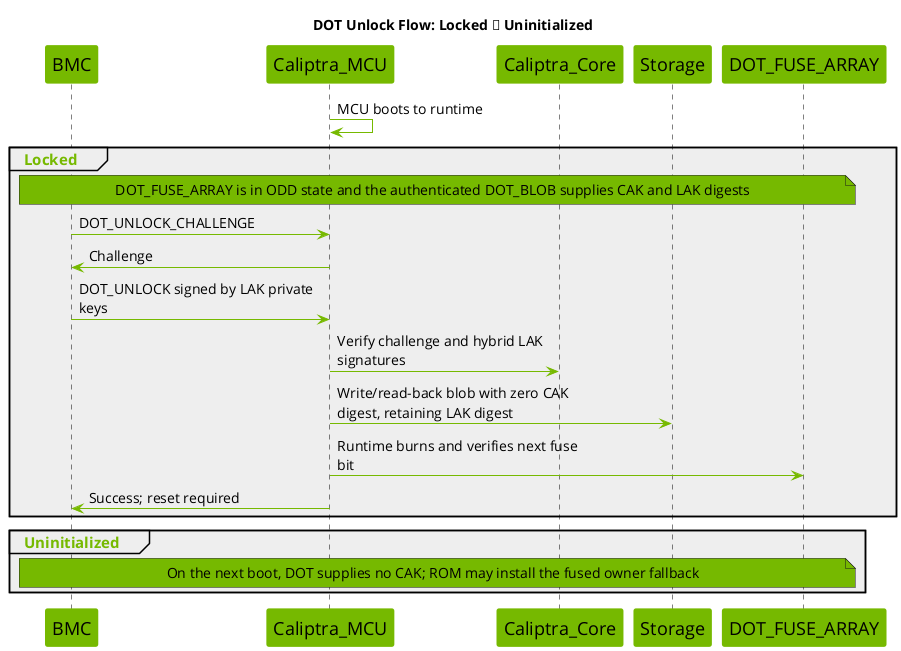
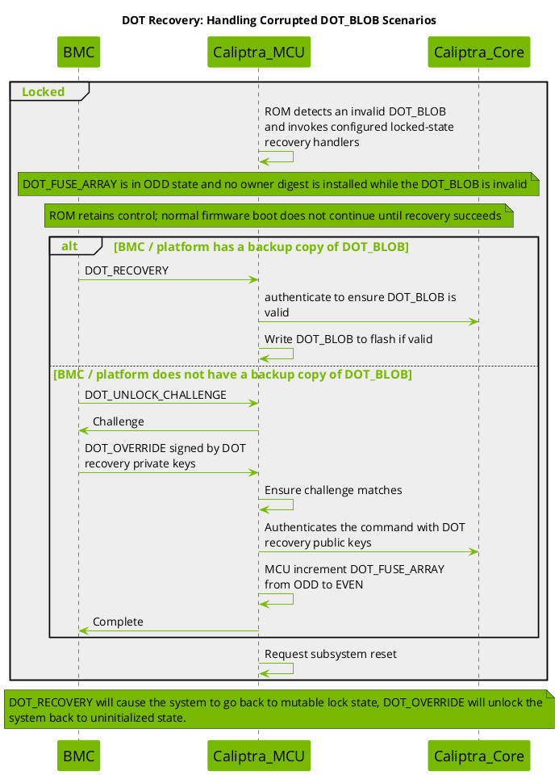

# Device Ownership Transfer

This contains details about the Caliptra implementation of Device Ownership Transfer (DOT) with MCU to assist.

Device Ownership Transfer (DOT) is a security mechanism implemented in Caliptra that enables device owners to establish code signing capabilities rooted in the hardware root of trust without permanently burning the Code Authentication Key (CAK) digest into fuses. This provides flexibility in ownership management while maintaining strong security guarantees.

Reference: [OCP Device Ownership Transfer specification](https://opencomputeproject.github.io/Security/device-ownership-transfer/HEAD/).

## Table of Contents
1. [Diagrams](#diagrams)
1. [Glossary](#glossary)
1. [Implemented DOT Model](#implemented-dot-model)
1. [Cryptographic Binding Mechanism](#cryptographic-binding-mechanism)
1. [System Components](#system-components)
1. [State Machine](#state-machine)
1. [Initialization Flow](#initialization-flow)
1. [Runtime Commands](#runtime-commands)
1. [Lifecycle Transitions](#lifecycle-transitions)
1. [Recovery Mechanisms](#recovery-mechanisms)
1. [Security Considerations](#security-considerations)
1. [Appendix: Command Reference](#appendix-command-reference)


## Diagrams

* [ROM Startup and DOT State Initialization](#dot-1-init)
* [Locked-State Recovery](#dot-2-recovery)
* [State Management](#dot-3-state)
* [Runtime Commands: DOT_LOCK / DOT_DISABLE](#dot-5-command-lock)
* [Runtime Commands: DOT_UNLOCK_CHALLENGE / DOT_UNLOCK](#dot-6-command-unlock)
* [Lifecycle: Uninitialized → Locked](#dot-7-install-lock)
* [Unlock Flow: Locked → Uninitialized](#dot-8-unlock-flow)
* [Recovery: Handling Corrupted DOT_BLOB](#dot-9-recovery-corrupted-blob)

---

## Glossary

**BMC (Baseboard Management Controller)**: System management controller that interfaces with Caliptra to issue DOT commands and manage recovery procedures.

**CAK (Code Authentication Key)**: The owner's public code-signing key set used
to authenticate owner-signed firmware before execution.

**CAK digest**: The SHA-384 digest of the CAK. DOT carries this 48-byte digest
and installs it into Caliptra as the owner public-key hash, thereby rooting the
CAK in Caliptra.

**Caliptra**: Hardware root of trust providing secure boot and cryptographic services.

**Caliptra_Core**: Component within Caliptra that performs cryptographic operations offload (key derivation, HMAC, signature verification), derives DOT_EFFECTIVE_KEY, authenticates DOT_BLOBs and commands, and manages owner public key hash.

**Caliptra_MCU**: Microcontroller component that manages the DOT state machine, handles runtime commands, controls fuse burning operations, coordinates with Caliptra_Core, and reads and writes the DOT_BLOB.

**DOT (Device Ownership Transfer)**: Security mechanism for flexible ownership management that enables device owners to establish code signing capabilities rooted in hardware without permanently burning keys into fuses.

**DOT_BLOB**: A cryptographically authenticated data structure containing the
CAK digest and LAK digest, sealed with the DOT_EFFECTIVE_KEY via HMAC.
Stored in external flash storage.

**DOT_EFFECTIVE_KEY**: An HMAC key derived inside Caliptra from a selected stable
identity root, the DOT domain-separation label, and the DOT fuse epoch. The
reference ROM and Runtime use the stable IDevID root. The key is returned to MCU only as an
opaque encrypted CMK and is used to authenticate DOT_BLOBs via HMAC.

**DOT_FUSE_ARRAY**: A minimal fuse array using 1 bit per state change to track DOT state transitions. The fuse value acts as a counter that increments with each state change (one-time programmable). Must reside in a non-ECC protected fuse partition (e.g., `VENDOR_TEST_PARTITION` in the reference map) so that individual bits can be burned sequentially over time without invalidating partition ECC protections.

**EVEN STATE**: Uninitialized state (fuse value % 2 == 0) where DOT does not provide an active owner.

**HMAC (Hash-based Message Authentication Code)**: Cryptographic authentication method used to seal and verify DOT_BLOBs.

**LAK (Lock Authentication Key)**: The owner's hybrid authorization key set,
comprising an ECDSA P-384 key pair and an ML-DSA-87 key pair. To authorize
`DOT_UNLOCK`, the owner signs the one-time challenge transcript with both LAK
private keys, and the device verifies both signatures with the corresponding
LAK public keys. The private keys remain with the owner.

**LAK digest**: The SHA-384 digest of the LAK public-key set. DOT carries this
48-byte digest in lock, disable, and rotate requests and stores it in the
authenticated DOT_BLOB. During `DOT_UNLOCK`, the device hashes the supplied LAK
public keys and compares the result with the stored LAK digest before verifying
both signatures. Current Rust APIs use the legacy field name `lak_hash` for
this value.

**ODD STATE**: Locked/Disabled state (fuse value % 2 == 1) where ownership is cryptographically bound to the silicon via DOT_BLOB.

**ROM (Read-Only Memory)**: Immutable boot code that executes first on device startup.

**RT (Runtime)**: Main operating firmware that executes after ROM.

**DOT recovery key**: Hybrid ECC and ML-DSA key used to authorize DOT_OVERRIDE in catastrophic recovery scenarios. Its public-key hash is provisioned in OTP.

**Mutable Locking DOT**: The implemented ownership model, where ownership is locked and bound to silicon via cryptographic binding using DOT_FUSE_ARRAY. It persists across power cycles.

### Goals
- Enable owner-specific code signing rooted in Caliptra (the root of trust)
- Avoid permanent fuse programming for ownership keys
- Support persistent mutable-locking ownership
- Provide secure ownership transfer mechanisms
- Enable recovery from corrupted states

---

## Implemented DOT Model

### Mutable Locking DOT

**Characteristics:**
- CAK is locked and bound to silicon via cryptographic binding
- Uses DOT_FUSE_ARRAY to create cryptographic binding (1 bit per state change)
- Ownership persists across power cycles
- Uses generic command authorization for lock, disable, and rotate; unlock uses LAK authentication
- DOT_BLOB stored in external storage (flash)
- State transitions require fuse burning
- Supports both Locked (with CAK) and Disabled (without CAK) states

**Use Cases:**
- Long-term ownership binding

**Flow:**
```
Uninitialized (EVEN) → [DOT_LOCK] → Locked (ODD) → [DOT_UNLOCK] → Uninitialized (EVEN)
                     ↘ [DOT_DISABLE] → Disabled (ODD) → [DOT_UNLOCK] ↗
```

---

## Cryptographic Binding Mechanism

The mutable locking DOT mechanism achieves secure binding without secure storage through a clever cryptographic construction:

### Key Derivation

Caliptra ROM derives and write-locks stable IDevID and LDevID roots in its key
vault. The IDevID root is ultimately derived from the device UDS; the LDevID
root additionally incorporates Field Entropy. The reference DOT ROM and Runtime
paths both use the stable IDevID root.

`RomParameters::dot_stable_key_type` can change the root used by ROM-only DOT
paths, but the reference Runtime always requests IDevID. A platform that changes
the ROM setting must make the corresponding Runtime change and migrate or
recover any existing blob; the reference implementation does neither.

MCU requests the effective key with `CM_DERIVE_STABLE_KEY` using this 32-byte
context:

```text
info = "Caliptra DOT stable key" || epoch_u16_le || zero_padding
DOT_EFFECTIVE_KEY = CM_DERIVE_STABLE_KEY(selected_stable_identity_root, info)
```

The selected stable identity root and plaintext effective key remain inside
Caliptra. MCU receives an opaque encrypted CMK that it can pass to Caliptra's
HMAC service.

### State-Dependent Derivation

**In EVEN STATE (n):**
- DOT_EFFECTIVE_KEY is derived using DOT_FUSE_ARRAY value (n+1)
- This represents the key that will seal the NEXT DOT_BLOB
- Allows pre-computation before fuse burning

**In ODD STATE (n):**
- DOT_EFFECTIVE_KEY is derived using DOT_FUSE_ARRAY value (n)
- This represents the key that authenticates the CURRENT DOT_BLOB
- Used to verify the stored DOT_BLOB on boot

### DOT_BLOB Authentication

```
DOT_BLOB = {CAK_DIGEST, LAK_DIGEST, metadata}
HMAC_TAG = HMAC-SHA-512(DOT_EFFECTIVE_KEY, DOT_BLOB)
```

The DOT_BLOB is authenticated on every boot in ODD state to ensure the CAK and
LAK digests are authentic.

### Security Properties

1. **Binding to Silicon**: The selected stable identity root is device-derived, preventing DOT_BLOB portability
2. **Binding to State**: Fuse value is incorporated into key derivation, preventing rollback attacks
3. **Forward Security**: Unlocking increments fuses, invalidating old DOT_BLOBs
4. **No Secure Storage Required**: Cryptographic binding replaces need for secure non-volatile storage

---

## System Components

### Caliptra_MCU
- Manages DOT state machine
- Handles runtime commands
- Controls fuse burning operations
- Coordinates with Caliptra_Core for cryptographic operations
- Reads, authenticates, and updates the DOT_BLOB

### Caliptra_Core
- Performs cryptographic operations offload(key derivation, HMAC, signature verification)
- Derives DOT_EFFECTIVE_KEY
- Authenticates DOT_BLOBs and commands
- Installs the selected owner public key hash (`INSTALL_OWNER_PK_HASH`)

### DOT_FUSE_ARRAY
- Hardware fuse array
- Stores state counter (increments from 0 to maximum)
- Must be located in a non-ECC protected partition (e.g., `VENDOR_TEST_PARTITION`) to allow multiple sequential 1-bit writes
- Read during initialization
- Written during state transitions
- One-time programmable (OTP) per bit

### Storage (Flash)
- Non-volatile external storage
- Stores the active DOT_BLOB
- Not assumed to be secure

### BMC (Baseboard Management Controller)
- Issues DOT commands
- Manages recovery procedures
- Handles reset coordination
- May maintain backup DOT_BLOBs

---

## State Machine

### States

#### 1. Uninitialized (EVEN State)
- DOT_FUSE_ARRAY is in EVEN state
- DOT does not provide an active owner
- ROM installs the fused owner PK hash when it is provisioned
- An empty DOT_BLOB is permitted; a nonempty blob must authenticate with the next-epoch key

#### 2. Locked (ODD State)
- DOT_FUSE_ARRAY is in ODD state
- Authenticated DOT_BLOB contains a nonzero CAK digest
- DOT_BLOB authenticated
- Device boots with owner authentication
- Ownership persists across power cycles
- DOT_BLOB present in storage

#### 3. Disabled (ODD State)
- DOT_FUSE_ARRAY is in ODD state
- LAK digest present in DOT_BLOB, but no CAK digest
- ROM authenticates the DOT_BLOB and installs the fused owner PK hash when it is provisioned
- Ownership is locked to silicon (via LAK) preventing unauthorized takeover

#### 4. Corrupted (ODD State)
- DOT_FUSE_ARRAY is in ODD state
- DOT_BLOB is corrupted or missing
- Normal firmware boot stops while ROM invokes the platform's configured locked-state recovery policy
- No CAK available
- Configured ROM recovery handlers may restore a backup blob or perform a recovery-key override

### State Transitions

```text
Uninitialized (EVEN, n)
    ├─ DOT_LOCK    → Locked  (ODD, n+1)
    └─ DOT_DISABLE → Disabled (ODD, n+1)

Locked / Disabled (ODD, n)
    └─ DOT_UNLOCK  → Uninitialized (EVEN, n+1)

Locked (ODD, n)
    └─ DOT_ROTATE  → Locked (ODD, n+2)

Disabled (ODD, n)
    └─ DOT_ROTATE  → Locked (ODD, n+2)

Uninitialized (EVEN, n)
    └─ DOT_ROTATE  → EVEN at command completion; stages a boot-time lock
```

---

## Initialization Flow

### Boot Sequence (DOT ROM Startup)

<a id="dot-1-init"></a>




This diagram shows the production-lifecycle path when DOT flash is configured
and the normal `DotThenFuse` owner policy is selected. Non-production lifecycle
states and the `ForceFuse` policy bypass the DOT blob and use the fused owner.

1. ROM reads the DOT fuses and active blob.
2. An empty blob falls back to the fused owner unless DOT is initialized in ODD
    state, where it invokes the configured locked-state recovery policy.
3. A nonempty blob is authenticated with epoch `n` in ODD state or `n+1` in
    EVEN state. Authentication failure invokes recovery only in ODD state; it is
    fatal in EVEN state.
4. For an authenticated EVEN-state blob containing nonzero CAK and LAK digests,
    ROM burns the next fuse as its implemented pending-lock transition. Owner
    selection for that boot still uses the state read before the burn, so the
    fused owner remains the fallback until the next boot.
5. For an authenticated ODD-state blob, ROM selects its nonzero CAK digest;
    otherwise it selects the fused owner PK hash.
6. ROM sends a nonzero selected digest through `INSTALL_OWNER_PK_HASH`, then
    continues the normal firmware-load flow.

### State Determination Logic

```
DOT_BLOB = Read_Storage()
if (DOT_BLOB is empty) {
    if (DOT_INITIALIZED && n is ODD) Recover_Locked_DOT()
    OWNER_DIGEST = Read_Fused_Owner_Pk_Hash()
} else {
    epoch = (n is EVEN) ? n + 1 : n
    DOT_EFFECTIVE_KEY = DeriveStableKey(IDevID, epoch)
    if (!Authenticate(DOT_BLOB, DOT_EFFECTIVE_KEY)) {
        if (n is ODD) Recover_Locked_DOT()
        else Fatal_DOT_Error()
    }
    if (DOT_INITIALIZED && n is EVEN && CAK != 0 && LAK != 0) {
        Burn_Next_DOT_Fuse()
    }
    OWNER_DIGEST = (DOT_INITIALIZED && n is ODD && CAK != 0)
        ? DOT_BLOB.CAK_DIGEST
        : Read_Fused_Owner_Pk_Hash()
}
if (OWNER_DIGEST != 0) {
    Install_Owner_Pk_Hash(OWNER_DIGEST)
}
```

---

## Runtime Commands

MCU Runtime exposes one transport-neutral DOT family. MCI uses command register
`0x00000011` and carries the DOT FourCC in mailbox SRAM. SPDM uses top-level
`DeviceOwnershipTransfer` (`0x11`) for native commands and wraps protected
commands as `AuthorizedCommand (0x12) -> family 0x11 -> DOT FourCC`.

| Command | FourCC | Classification | Core validation |
| ------- | ------ | -------------- | --------------- |
| `DOT_LOCK` | `MDLK` | Generic-authorized | Nonzero CAK digest and LAK digest, EVEN state |
| `DOT_DISABLE` | `MDDS` | Generic-authorized | Nonzero LAK digest, EVEN state |
| `DOT_ROTATE` | `MDRT` | Generic-authorized | Current burned count below requested minimum |
| `GET_DOT_BACKUP_BLOB` | `MDBB` | Generic-authorized | ODD state and valid blob HMAC |
| `DOT_UNLOCK_CHALLENGE` | `MDUC` | Native | ODD state and valid current blob |
| `DOT_UNLOCK` | `MDUL` | Native LAK signatures | Stored LAK digest, challenge, and fuse epoch |
| `DOT_STATUS` | `MDST` | Native/read-only | OTP state read |
| `DOT_RECOVERY` | `MDRC` | Native blob authentication | ODD state and current-epoch blob HMAC |
| `DOT_OVERRIDE_CHALLENGE` | `DOTW` | Native recovery authority | Keys match fused recovery-key hash |
| `DOT_OVERRIDE` | `DOTX` | Native recovery authority | Recovery-key hash and hybrid challenge signatures |

Generic authorization uses the shared `MACC` challenge and signs
`0x00000011(BE) || DOT_FourCC(LE) || DOT_payload || nonce`. Direct `0x11`
requests for `MDLK`, `MDDS`, `MDRT`, or `MDBB` are rejected. Runtime commits
blob and fuse changes directly and read-back verifies them before returning.
The response's `reset_required` field tells the caller that the new ownership
state becomes active on a subsequent reset.

### Host Utility Support

The `caliptra-util-host` Rust API exposes all ten commands in the table above
through the same transport-neutral command functions. Both its MCU mailbox and
SPDM VDM transports implement every command. The mailbox transport emits the
outer family command `0x00000011`, little-endian DOT FourCC, payload, and, for
generic-authorized commands, the authorization trailer. The SPDM VDM transport
selects the native `0x11` envelope or the protected `0x12 -> 0x11` envelope.

The mailbox integration validator connects the Rust host API through a UDP
bridge to a DOT-enabled emulator Runtime. It exercises `DOT_STATUS`, lock,
backup, rotate, unlock challenge, unlock, and disable as one end-to-end
sequence. Recovery and override require separately provisioned recovery states
and remain covered by their focused transport and device tests. The sample UDP
mock server does not emulate DOT. These DOT APIs are currently Rust-only and are
not exported through the host library's C bindings.

### Runtime Platform Support

Runtime DOT commands are enabled and tested on the reference emulator. The
emulator registers reset-retained storage shared by ROM and Runtime as a
userspace flash partition with driver number `DOT_BLOB_STORE_DRIVER_NUM`.

| Platform | Runtime DOT support | DOT blob backend |
| -------- | ------------------- | ---------------- |
| Emulator | Enabled for MCI and SPDM VDM | Reset-retained storage shared with ROM |
| FPGA | Not currently enabled | ROM uses physical secondary flash, but Runtime currently exposes only mailbox-backed imaginary flash |
| Other platforms | Opt-in | Platform must provide persistent storage visible to both ROM and Runtime |

The FPGA limitation is a software integration gap, not a hardware restriction.
FPGA ROM accesses the physical secondary flash controller directly, but FPGA
Runtime does not yet provide a Tock-compatible asynchronous driver for that
controller. Enabling Runtime DOT on FPGA requires adding that driver and
registering a bounded DOT blob partition over the same physical storage used by
ROM. Until then, FPGA production and `all-features` builds intentionally exclude
the Runtime DOT features; emulator builds enable them explicitly.

To enable Runtime DOT on another platform:

1. Provide persistent storage visible to both ROM and Runtime using the same
    offset and layout.
2. Register a userspace `FlashPartition` with driver number
    `DOT_BLOB_STORE_DRIVER_NUM` and at least `DOT_BLOB_STORE_SIZE` bytes.
3. Ensure blob reads, writes, and erases use the platform's asynchronous flash
    HIL and complete through its normal callback path.
4. Enable `dot-mci-mailbox` for MCI commands and `dot-spdm-vdm` for SPDM VDM
    commands.
5. Provision `dot_initialized`, the non-ECC `dot_fuse_array`, the generic
    command-authorization key hash, and, when override is required,
    `vendor_recovery_pk_hash`.
6. Use Caliptra firmware that supports stable-key derivation, HMAC-SHA-512,
    SHA-384/SHA-512, ECDSA P-384 verification, and ML-DSA-87 verification.

For example:

```shell
cargo xtask runtime-build \
  --platform <platform> \
  --features dot-mci-mailbox \
  --features dot-spdm-vdm
```

A platform must not enable these features until its Runtime storage backend
refers to the same persistent DOT blob storage consumed by ROM.

Runtime `MDRC`, `DOTW`, and `DOTX` are not gated by a ROM recovery-mode signal.
Their native blob-HMAC, recovery-key, challenge, and fuse-state checks are
always enforced.

### 1. DOT_LOCK

<a id="dot-5-command-lock"></a>



**Purpose:** Install a CAK digest and LAK digest in a DOT_BLOB and lock ownership to silicon.

**Preconditions:**
- DOT_FUSE_ARRAY in EVEN state
- Nonzero CAK digest and LAK digest provided in the command

**Flow:**
1. BMC obtains `MACC` and issues an authorized `MDLK` request containing a CAK digest and LAK digest.
2. MCU RT verifies generic command authorization and checks DOT_FUSE_ARRAY state.
   - If ODD state: Return error (already locked)
3. MCU RT creates and HMAC-seals the ODD-state DOT_BLOB using epoch `(n+1)`.
4. MCU RT writes and read-back verifies the DOT_BLOB.
5. MCU RT burns and verifies the next DOT_FUSE_ARRAY bit.
6. MCU RT returns success with `reset_required = 1`.
7. **On the subsequent boot**:
    - Device boots in ODD state (n+1)
    - DOT_BLOB is authenticated and its CAK and LAK digests are retrieved
    - Device is now in Locked state

**Result:** Device enters Locked state with ownership persisting across power cycles.

### 2. DOT_DISABLE

Diagram is [above](#dot-5-command-lock).

**Purpose:** Enter ODD state with a nonzero LAK digest but no DOT-supplied CAK.

**Use Case:** Park DOT ownership behind the LAK-authenticated unlock flow without
installing a CAK from the DOT_BLOB. On boot, ROM uses the fused owner PK hash as
the owner fallback when that fuse is provisioned; if it is zero, no owner hash
is installed.

**Preconditions:**
- DOT_FUSE_ARRAY in EVEN state
- Nonzero LAK digest provided in command

**Flow:**
1. BMC obtains `MACC` and issues an authorized `MDDS` request containing the LAK digest.
2. MCU RT verifies generic command authorization and checks DOT_FUSE_ARRAY state.
   - If ODD state: Return error (already locked or disabled)
3. MCU RT creates and HMAC-seals an ODD-state DOT_BLOB containing the LAK digest but a zero CAK digest.
4. MCU RT writes and read-back verifies the DOT_BLOB.
5. MCU RT burns and verifies the next DOT_FUSE_ARRAY bit.
6. MCU RT returns success with `reset_required = 1`.
7. **On the subsequent boot**:
    - Device boots in ODD state (n+1)
    - DOT_BLOB is authenticated and its LAK digest is recovered, but no CAK digest is active
    - ROM installs the fused owner PK hash when it is provisioned
    - Device is now in Disabled state

**Result:** Device enters Disabled state. DOT supplies no CAK, and the LAK
holder can return the device to Uninitialized state by completing the hybrid
unlock challenge.

### 3. DOT_UNLOCK_CHALLENGE / DOT_UNLOCK

<a id="dot-6-command-unlock"></a>



**Purpose:** Remove the DOT-supplied CAK and return DOT to the Uninitialized state.

**Preconditions:**
- DOT_FUSE_ARRAY in ODD state (Locked or Disabled)
- Valid DOT_BLOB in storage containing a nonzero LAK digest

**Flow:**
1. BMC issues DOT_UNLOCK_CHALLENGE
2. MCU RT checks DOT_FUSE_ARRAY state
   - If EVEN state: Return error (already unlocked)
3. MCU RT generates and returns challenge
    - The challenge is a fresh 48-byte random value
4. BMC signs `MDUL(BE) || challenge` with both LAK private keys.
5. BMC issues `DOT_UNLOCK` with the LAK public keys and both signatures.
6. MCU RT verifies challenge matches
7. MCU RT hashes the supplied LAK public keys, compares the result with the LAK digest in the DOT_BLOB, and verifies both signatures.
   - If authentication fails: Return error
8. MCU RT seals a post-burn blob with a zero CAK digest while retaining the authenticated LAK digest.
9. MCU RT writes/read-back verifies the blob, burns one fuse bit, and verifies the new count.
10. MCU RT consumes the challenge and returns success with `reset_required = 1`.
11. On the subsequent boot, the device is in EVEN state `(n+1)`. DOT supplies no owner, and ROM installs the fused owner PK hash when it is provisioned.

**Result:**
- Device enters the unlocked/uninitialized EVEN state.
- Runtime retains the HMAC-authenticated LAK digest from the current blob in the post-burn blob.

Firmware-manifest UNLOCK is a separate ROM path authorized by the authenticated
MCU image. It stores the manifest section's LAK digest and does not perform the
Runtime LAK challenge flow.

### 4. DOT_ROTATE

**Purpose:** Replace the CAK and LAK digests while advancing the fuse count by
two and preserving parity when the command completes.

**Use Case:** From Locked state, rotate the active CAK and LAK digests without
an unlock-relock cycle. Because the command always requires a nonzero CAK, a
rotation from Disabled state produces Locked state. The implementation also
accepts rotation in EVEN state; the resulting CAK-bearing blob is treated by
ROM as a pending lock on the next boot.

**Preconditions:**
- DOT_FUSE_ARRAY in either EVEN or ODD state
- `min_fuse_count` value provided in command
- Current burned count is below `min_fuse_count`
- Nonzero CAK digest and LAK digest provided
- Sufficient remaining fuse bits to complete the rotation

**Flow:**
1. BMC obtains `MACC` and issues an authorized `MDRT` request containing `min_fuse_count`, a new CAK digest, and a new LAK digest.
2. MCU RT verifies generic command authorization.
3. MCU RT checks if current burned count is below `min_fuse_count`:
   - If already met: Return success without burning (no-op on threshold)
   - If below threshold: Continue to rotation
4. MCU RT burns exactly two fuse bits (advancing by 2), preserving parity:
   - If current state is EVEN (n): Result is EVEN (n+2)
   - If current state is ODD (n): Result is ODD (n+2)
5. MCU RT derives DOT_EFFECTIVE_KEY for the new epoch.
6. MCU RT creates and HMAC-seals a new DOT_BLOB with the new CAK and LAK digests.
7. MCU RT writes and read-back verifies the DOT_BLOB.
8. MCU RT returns success with `reset_required = 1`.
9. **On the subsequent boot**:
    - From ODD state, the device remains ODD and becomes Locked with the new CAK and LAK digests.
    - From EVEN state, ROM authenticates the CAK-bearing blob and burns the next fuse as its implemented boot-time lock transition. The new CAK becomes active on the following boot.

**Result:** The command advances the epoch by two. ODD-state rotation preserves
parity and installs a Locked-state blob; EVEN-state rotation stages a subsequent
lock.

### 5. GET_DOT_BACKUP_BLOB

**Purpose:** Retrieve a backup copy of the current DOT_BLOB for external storage or recovery preparation.

**Use Case:** Enables backup and recovery workflows where the owner maintains an off-device copy of the DOT_BLOB to ensure it can be recovered if the on-device storage becomes corrupted. The returned blob can be restored using DOT_RECOVERY command.

**Preconditions:**
- DOT_FUSE_ARRAY in ODD state (device must be in Locked or Disabled state)
- Valid DOT_BLOB present in storage with correct HMAC
- Current epoch blob version must be valid

**Validation:**
- Command is generic-authorized (requires `MACC` challenge)
- Blob must be in ODD-state format with valid HMAC
- Blob cannot be in EVEN state (pre-burn blob)
- Blob cannot be corrupt or have mismatched HMAC

**Flow:**
1. BMC obtains `MACC` and issues an authorized `MDBB` request (empty payload).
2. MCU RT verifies generic command authorization.
3. MCU RT checks DOT_FUSE_ARRAY state:
   - If EVEN state: Return error (backup not available in uninitialized state)
4. MCU RT derives the current DOT_EFFECTIVE_KEY using current fuse count.
5. MCU RT reads DOT_BLOB from storage.
6. MCU RT validates blob version and HMAC with current epoch key:
   - If validation fails: Return error (blob is corrupted or stale)
7. MCU RT returns the exact 168-byte DOT_BLOB to BMC.

**Response:**
```
status || DOT_BLOB[168]
```

**Security Properties:**
- Only available in ODD state (ownership is locked)
- Returns only authenticated blobs (HMAC verified)
- Does not return pre-burn (EVEN-epoch) blobs
- Does not modify device state
- No fuse bits are burned

### 6. DOT_STATUS

**Purpose:** Query the current DOT state without modifying device ownership or performing any mutations.

**Use Case:** Enables BMC and system integrators to query device DOT status at any time to determine current ownership configuration and fuse burn progress without side effects.

**Preconditions:**
- None (no state-specific requirements)
- No authorization required (read-only command)

**Flow:**
1. BMC issues a native (non-authorized) `MDST` request (empty payload).
2. MCU RT reads DOT_FUSE_ARRAY current burned count.
3. MCU RT determines state parity:
   - `locked = burned_count % 2` (0 = EVEN/Uninitialized, 1 = ODD/Locked or Disabled)
4. MCU RT determines enabled status:
    - `enabled = 1` when the `dot_initialized` fuse is set
    - `enabled = 0` when DOT has not been initialized for the device
5. MCU RT returns status fields to BMC.

**Response Payload:**
```
enabled:u8 || locked:u8 || burned:u16_le
```

Where:
- `enabled`: logical value of the `dot_initialized` fuse
- `locked`: 1 if DOT_FUSE_ARRAY is in ODD state, 0 if in EVEN state
- `burned`: Current burned fuse count (little-endian u16)

**State Mapping:**
| enabled | locked | State |
|---------|--------|-------|
| 0 | 0 | DOT not initialized |
| 1 | 0 | Uninitialized (EVEN) |
| 1 | 1 | ODD state (Locked or Disabled) |

`DOT_STATUS` does not distinguish Locked from Disabled; that distinction
depends on whether the authenticated DOT_BLOB contains a nonzero CAK digest.

**Security Properties:**
- Read-only operation
- No state mutations
- No authorization check required
- Always returns current state from fuse array

### 7. DOT_RECOVERY

**Purpose:** Restore a previously backed-up DOT_BLOB to storage when the on-device copy has been corrupted or lost.

**Use Case:** While Runtime is executing, replace a damaged or stale active
DOT_BLOB with a previously exported blob before the next boot. An ODD-state
boot that already cannot authenticate its active blob is handled separately by
the configured ROM locked-state recovery policy.

**Preconditions:**
- DOT_FUSE_ARRAY in ODD state (Locked or Disabled)
- Backup DOT_BLOB must have been obtained via GET_DOT_BACKUP_BLOB from the same epoch
- Backup BLOB must be exactly 168 bytes

**Validation:**
- Command uses native authentication (HMAC-based proof in the blob itself)
- No generic authorization required
- Blob HMAC must be valid with the current device-derived DOT_EFFECTIVE_KEY
- Invalid backup BLOB cannot modify flash (HMAC validates before write)

**Flow:**
1. BMC issues a native `MDRC` request containing a 168-byte backup DOT_BLOB.
2. MCU RT checks DOT_FUSE_ARRAY state:
   - If EVEN state: Return error (recovery only valid in ODD state)
3. MCU RT derives the current DOT_EFFECTIVE_KEY using current fuse count.
4. MCU RT verifies the backup BLOB's HMAC with current epoch key:
   - If HMAC validation fails: Return error (blob is invalid, no writes occur)
5. If HMAC is valid, MCU RT writes the backup BLOB to storage.
6. MCU RT performs read-back verification to ensure write succeeded.
7. MCU RT returns success with `reset_required = 1`.
8. **On the subsequent boot**:
   - Device boots in ODD state
   - Restored DOT_BLOB is authenticated
    - The CAK and LAK digests are recovered from the restored blob
   - Device resumes normal operation in Locked or Disabled state

**Request Payload:**
```
DOT_BLOB[168]
```

**Security Properties:**
- Native HMAC-based authentication (no external signatures required)
- Invalid BLOB cannot corrupt flash (HMAC check precedes writes)
- No privilege escalation possible (HMAC is cryptographic proof)
- Read-back verify ensures durability
- HMAC prevents injection of arbitrary data

### 8. DOT_OVERRIDE_CHALLENGE / DOT_OVERRIDE

**Purpose:** Authorize catastrophic recovery and device reset via DOT recovery keys (ECC P-384 and ML-DSA-87) when normal ownership mechanisms are unavailable or compromised.

**Use Case:** Provides a secure mechanism for device recovery when:
- Normal DOT unlock flow is unavailable
- Device is in corrupted state beyond normal recovery
- Emergency device recovery is required by authorized recovery administrators
- Ownership state needs to be forcibly reset to Uninitialized state

**Security Model:**
- Recovery authorization requires both ECC P-384 and ML-DSA-87 signatures (hybrid cryptography)
- Recovery keys are provisioned in OTP as a public-key hash during manufacturing
- The recovery fuse burn is irreversible and transitions the device to EVEN state
- Recovery clears the DOT CAK and LAK while retaining the monotonic fuse history

**DOT_OVERRIDE_CHALLENGE (DOTW) Flow:**

**Preconditions:**
- DOT_FUSE_ARRAY is in ODD state
- DOT recovery key hash must be provisioned in OTP
- No authorization trailer required

**Flow:**
1. BMC issues a native `DOTW` request containing:
   - Recovery ECC P-384 public key
   - Recovery ML-DSA-87 public key
2. MCU RT hashes both keys using Caliptra's recovery-key hash convention.
3. MCU RT compares the combined hash with the fused recovery-key hash in OTP:
   - If hash does not match: Return error (invalid recovery keys)
4. MCU RT generates a fresh random challenge.
5. MCU RT returns the challenge to BMC.

**Response:**
```
challenge[48]
```

**DOT_OVERRIDE (DOTX) Flow:**

**Preconditions:**
- Must have previously issued DOTW and received valid challenge
- DOT recovery key hash must match OTP
- DOT_FUSE_ARRAY remains in the same ODD state used to issue the challenge

**Flow:**
1. BMC issues a native `DOTX` request containing:
   - DOT recovery ECC P-384 public key (same as in DOTW)
   - DOT recovery ML-DSA-87 public key (same as in DOTW)
   - ECC P-384 signature over challenge
   - ML-DSA-87 signature over challenge
2. MCU RT verifies DOT recovery-key hash matches OTP (same as DOTW):
   - If hash does not match: Return error
3. MCU RT verifies ECC P-384 signature:
   - If signature invalid: Return error
4. MCU RT verifies ML-DSA-87 signature:
   - If signature invalid: Return error
5. MCU RT burns one fuse bit, advancing state by 1:
    - Current state is ODD (n); result is EVEN (n+1)
6. MCU RT creates and HMAC-seals a blob with zero CAK and LAK digests for the new epoch.
7. MCU RT writes and read-back verifies the blob.
8. MCU RT consumes the challenge after the transition commits.
9. MCU RT returns success with `reset_required = 1`.
10. **On the subsequent boot**:
    - Device boots in EVEN state (uninitialized)
    - DOT supplies no owner; ROM installs the fused owner PK hash when it is provisioned
    - Recovery operation is complete

**Request Payload (DOTX):**
```
recovery_ecc_x[48] || recovery_ecc_y[48] || recovery_mldsa_key[2592] || ecc_sig_r[48] || ecc_sig_s[48] || mldsa_sig[4628]
```

**Security Properties:**
- Requires hybrid cryptography (both ECC and ML-DSA valid signatures)
- Recovery-key hash provisioned in OTP prevents key substitution
- Challenge prevents replay attacks
- Single-use challenge prevents bypass via replay
- Fuse burn is irreversible
- The one-time random challenge ensures freshness
- No generic authorization used (native recovery-key authentication only)

**Runtime scope:** `MDRC`, `DOTW`, and `DOTX` are available whenever the DOT
Runtime command service is running. They are not gated by a ROM recovery-mode
signal; their command-specific cryptographic and fuse-state checks provide the
authorization boundary.

---

## State Management

<a id="dot-3-state"></a>



Interactive Runtime commands perform blob and fuse transitions directly. The
firmware-manifest path remains separate and is processed by ROM while the
containing MCU Runtime image supplies authorization.

### State Transition Protocol

1. Serialize transitions so only one DOT mutation can run at a time.
2. Validate command authorization and the current fuse state.
3. Derive the target epoch key and create the required DOT_BLOB.
4. Apply command-specific power-fail ordering.
5. Read back storage and OTP state after each write.
6. Return success with reset required only after the transition is committed.

### Transition Ownership

The reference implementation deliberately splits transition ownership by entry
point:

- MCU Runtime directly commits interactive MCI and SPDM commands, including
    blob storage and OTP read-back verification.
- MCU ROM retains firmware-manifest DOT processing.
- MCU ROM retains its I3C recovery and override path.

Runtime recovery and override commands use the same direct-commit backend as
the other Runtime commands. They are not gated by a ROM recovery-mode signal;
their cryptographic and state checks remain mandatory.

---

## Lifecycle Transitions

### Full Lifecycle: Uninitialized → Locked

<a id="dot-7-install-lock"></a>



1. Device boots with DOT_FUSE_ARRAY in EVEN state and no owner authentication active.
2. BMC obtains `MACC` and issues an authorized `DOT_LOCK` with a CAK digest and LAK digest.
3. Runtime verifies generic command authorization and creates the DOT_BLOB.
4. Runtime seals the blob with the `(n+1)` DOT effective key.
5. Runtime writes and read-back verifies the blob.
6. Runtime burns and verifies DOT_FUSE_ARRAY from EVEN `(n)` to ODD `(n+1)`.
7. Runtime returns success with reset required.
8. On the subsequent boot, ROM authenticates the blob and activates its CAK.
9. **Result:** Locked ownership persists across power cycles.

### Full Lifecycle: Locked → Uninitialized

<a id="dot-8-unlock-flow"></a>



1. Device is in Locked or Disabled state with an ODD fuse count.
2. BMC issues DOT_UNLOCK_CHALLENGE
3. MCU RT returns challenge
4. BMC signs the challenge transcript with both LAK private keys.
5. BMC issues `DOT_UNLOCK` with the LAK public keys and both signatures.
6. MCU RT compares the supplied public-key digest with the stored LAK digest and verifies both signatures.
7. Runtime seals and read-back verifies a blob with a zero CAK digest for the post-burn epoch while retaining the authenticated LAK digest.
8. Runtime burns and verifies DOT_FUSE_ARRAY from ODD `(n)` to EVEN `(n+1)`.
9. Runtime consumes the challenge and returns success with reset required.
10. On the subsequent boot, DOT supplies no CAK; ROM installs the fused owner PK hash when it is provisioned.
11. **Result:** The device is Uninitialized in the EVEN state.

---

## Recovery Mechanisms

<a id="dot-2-recovery"></a>

When ROM cannot authenticate the DOT_BLOB in ODD state, it does not continue
the normal firmware boot. It invokes the locked-state recovery policy configured
by the platform.

| Implemented path | Entry point | Result |
|---|---|---|
| Reset-flow backup | `dot_recovery_reset_flow`, `DotRecoveryPolicy::BackupBlob`, and `dot_recovery_handler` | Restores and re-verifies the active blob, then continues the same cold boot. |
| Ordered ROM handler chain | `dot_locked_recovery_handlers` when reset coordination is disabled | Tries each configured handler according to its retry policy; the first success triggers a warm reset. |
| ROM I3C recovery service | `I3cDotLockedRecoveryHandler` with `I3cServicesModes::DOT_RECOVERY` in the ordered chain | Accepts status, blob recovery, and recovery-authority override operations while ROM owns the recovery flow. |
| ROM MCI mailbox override | `OverrideChallengeRecoveryHandler` with `Mbox0RecoveryTransport` in the ordered chain | Performs the recovery-authority challenge and override flow. The reference emulator wires this path under its `test-dot-recovery` feature. |
| Reset coordination | `dot_recovery_reset_flow` when local backup recovery does not succeed | Publishes the DOT failure status and halts so the BMC can select fused-owner recovery or regular DOT verification on the next cold boot. |
| Runtime native commands | `MDRC`, `DOTW`, and `DOTX` | Available when Runtime is already executing; these commands enforce blob HMAC or recovery-key authentication but are not gated by a ROM recovery-mode signal. |

The sections below describe the command-level recovery and override protocols.

### DOT_RECOVERY Command

<a id="dot-9-recovery-corrupted-blob"></a>



The restore operation is implemented by Runtime `MDRC`, the ROM I3C recovery
service, and ROM backup-blob handlers. Each path invokes the same current-epoch
HMAC validation before replacing the active blob.

**When:** A current-epoch backup copy of the DOT_BLOB is available.

**Flow:**
1. The recovery caller or configured handler supplies the backup DOT_BLOB.
2. MCU authenticates DOT_BLOB with DOT_EFFECTIVE_KEY
   - If authentication fails: Return error and abort
3. MCU writes authenticated DOT_BLOB to flash
4. Request subsystem reset
5. On next boot, DOT_BLOB will be valid
6. **Result:** Device returns to Locked state with recovered ownership

**Requirements:**
- A backup DOT_BLOB must be available
- DOT_BLOB must match current DOT_FUSE_ARRAY state
- Cannot recover if backup is also corrupted

### DOT_OVERRIDE Command

**When:** BMC does not have backup DOT_BLOB (catastrophic recovery, RMA to vendor)

**Flow:**
1. BMC issues DOT_UNLOCK_CHALLENGE
2. MCU returns challenge
3. BMC signs challenge with the DOT recovery private keys
4. BMC issues DOT_OVERRIDE command with signed challenge
5. MCU verifies challenge matches
6. MCU authenticates command with the DOT recovery public keys
   - If authentication fails: Return error and abort
7. MCU burns DOT_FUSE_ARRAY from ODD(n) to EVEN(n+1)
   - This is an ODD to EVEN transition only
8. Request subsystem reset
9. On next boot, device is in EVEN state (Uninitialized)
10. **Result:** DOT is Uninitialized with no DOT-supplied owner; the fused owner fallback is unchanged.


### DOT Recovery PK Hash Format

The DOT recovery public-key hash is stored in the
`vendor_recovery_pk_hash` OTP fuse and matched by MCU ROM before any
`DOT_OVERRIDE` flow proceeds. **The format is identical to Caliptra's
[Owner PK hash](https://github.com/chipsalliance/caliptra-sw/blob/main/rom/dev/README.md#owner-pk-hash)
(`CPTRA_OWNER_PK_HASH`) and the
[Production debug unlock PK hashes](https://github.com/chipsalliance/caliptra-sw/blob/main/rom/dev/README.md#production-debug-unlock-public-key-hashes-byte-ordering)
(`MCI_PROD_DEBUG_UNLOCK_PK_HASH_REG_*`).** All three are computed the same
way and stored in the same byte order, so an integrator can — if they
choose — provision the same `(ECC P-384, MLDSA-87)` key pair as owner key,
debug unlock key, and DOT recovery key and reuse one hashing pipeline
to compute all three fuse values.

#### Hash construction

```text
vendor_recovery_pk_hash = SHA-384(
    ecc_pub_key.x  ||  // 48 bytes, dword-reversed from SEC1 big-endian
    ecc_pub_key.y  ||  // 48 bytes, dword-reversed from SEC1 big-endian
    pqc_pub_key        // 2592 bytes, raw FIPS 204 MLDSA-87 bytes (no transform)
)
```

Total input: **2688 bytes** (96 B ECC + 2592 B MLDSA). Output: **48 bytes**
(384 bits).

#### Byte-order conventions

Byte order matches Caliptra's [Public key hash byte ordering](https://github.com/chipsalliance/caliptra-sw/blob/main/rom/dev/README.md#public-key-hash-byte-ordering-dword-reversal)
exactly:

- **ECC P-384 X/Y coordinates** travel over the MCI and I3C recovery
    protocols in standard SEC1 big-endian byte order. Before hashing, MCU ROM
    groups each coordinate into 12 four-byte dwords and reverses the bytes
    within each dword to match Caliptra's image public-key representation.
- **MLDSA-87 public key** bytes are passed through as raw FIPS 204 bytes,
  with no dword reversal.
- **SHA-384 output** in OTP is also **dword-reversed**: the 48-byte
  standard SHA-384 digest is grouped into 12 dwords and each dword's bytes
  are reversed before being written to OTP. The result is a `[u32; 12]`
  whose big-endian interpretation equals the standard digest. (Same OTP
  layout as `CPTRA_OWNER_PK_HASH` and `MCI_PROD_DEBUG_UNLOCK_PK_HASH_REG`.)

#### Reusing the same key across owner / debug unlock / DOT recovery

Because all three hashes use the same construction and the same OTP layout,
the bytes burned into `CPTRA_SS_OWNER_PK_HASH`, into any
`MCI_PROD_DEBUG_UNLOCK_PK_HASH_REG[i]` slot, and into
`vendor_recovery_pk_hash` for a given `(ECC, MLDSA)` key pair are
**bit-identical**. An integrator who wants the same key to serve multiple
roles can compute the hash once and burn the same 48 bytes into each slot.

This is not a security recommendation — in most threat models the vendor
recovery key, owner key, and debug unlock key are held by different
parties — but the format is intentionally aligned so the option exists and
the tooling is uniform.

### Worked Example

This example follows the same step-by-step style as
[Caliptra-sw's computing-public-key-hashes example](https://github.com/chipsalliance/caliptra-sw/blob/main/rom/dev/README.md#computing-public-key-hashes-step-by-step-example).
The keys here are contrived (simple patterns chosen so an integrator can
reproduce the hash with `python3` and `hashlib`).

#### Step 1: ECC P-384 public key (standard SEC1 byte order)

The integrator typically starts with standard SEC1 / FIPS 186 big-endian
coordinates, as produced by `openssl ec -pubin -in key.pem -outform DER`
followed by extracting the trailing 96 bytes:

```text
X (SEC1 / openssl output, 48 bytes):
  c69fe67f 97ea3e42 21a7a603 6c2e070d 1657327b c3f1e7c1
  8dccb9e4 ffda5c3f 4db0a1c0 567e0973 17bf4484 39696a07
Y (SEC1 / openssl output, 48 bytes):
  c126b913 5fc82572 8f1cd403 19109430 994fe3e8 74a8b026
  be14794d 27789964 7735fde8 328afd84 cd4d4aa8 72d40b42
```

#### Step 2: Build the ECC hash input

MCU ROM groups each 48-byte coordinate into 12 four-byte dwords and reverses
the bytes within each dword before hashing. The BMC sends the Step 1 natural
SEC1 bytes on the recovery protocol; these are the transformed bytes that ROM
passes to SHA-384:

```text
X (dword-reversed, hashed bytes), first 16 bytes:
  7f e6 9f c6  42 3e ea 97  03 a6 a7 21  0d 07 2e 6c
  ...
Y (dword-reversed, hashed bytes), first 16 bytes:
  13 b9 26 c1  72 25 c8 5f  03 d4 1c 8f  30 94 10 19
  ...
```

#### Step 3: MLDSA-87 public key

For this example, byte `i = ((i * 17 + 3) & 0xff)`. MLDSA keys are
**not** transformed:

```text
Size: 2592 bytes (raw FIPS 204 bytes / `[u32; 648]` as_bytes()).
First 16 bytes: 03 14 25 36 47 58 69 7a 8b 9c ad be cf e0 f1 02
```

#### Step 4: Compute SHA-384

```text
Input = X_dword_reversed || Y_dword_reversed || MLDSA_raw  (2688 bytes)

SHA-384 (standard, 48 bytes):
  2da3927b 2515cd22 cc823fdf e4e6b5e0 3fab1f81 68141140
  163eddea cbc0ba4e bcba2bd2 ec93da05 3e8b8d08 0c01adbf
```

#### Step 5: Bytes burned into `vendor_recovery_pk_hash` OTP

The 48-byte SHA-384 output is stored in **dword-reversed format**,
identical to how `CPTRA_OWNER_PK_HASH` and
`MCI_PROD_DEBUG_UNLOCK_PK_HASH_REG[i]` are stored:

```text
OTP bytes at vendor_recovery_pk_hash offset:
  7b 92 a3 2d  22 cd 15 25  df 3f 82 cc  e0 b5 e6 e4
  81 1f ab 3f  40 11 14 68  ea dd 3e 16  4e ba c0 cb
  d2 2b ba bc  05 da 93 ec  08 8d 8b 3e  bf ad 01 0c
```

As a `[u32; 12]` (big-endian interpretation of each dword in the standard
SHA-384 output — same convention as Caliptra's owner PK hash register):

```text
[0x2da3927b, 0x2515cd22, 0xcc823fdf, 0xe4e6b5e0,
 0x3fab1f81, 0x68141140, 0x163eddea, 0xcbc0ba4e,
 0xbcba2bd2, 0xec93da05, 0x3e8b8d08, 0x0c01adbf]
```

#### Verifying offline with `openssl` / Python

```python
import hashlib

ecc_x_sec1 = bytes.fromhex("c69fe67f...39696a07")  # 48 bytes, openssl output
ecc_y_sec1 = bytes.fromhex("c126b913...72d40b42")  # 48 bytes, openssl output
mldsa = open("mldsa_pubkey.bin", "rb").read()      # 2592 bytes, FIPS 204 raw

def dword_reverse(b):
    return b"".join(b[i:i+4][::-1] for i in range(0, len(b), 4))

hash_input = dword_reverse(ecc_x_sec1) + dword_reverse(ecc_y_sec1) + mldsa
digest = hashlib.sha384(hash_input).digest()      # 48-byte standard digest
otp_bytes = dword_reverse(digest)                  # 48 bytes to write to OTP
```

**Notes for integrators:**

- The same `(ECC P-384, MLDSA-87)` pubkey pair must be used to generate the
  hash that is burned at manufacture and to sign the `DOT_OVERRIDE`
  challenge response at recovery time. There is no separate "key index"
  field — the hash binds both keys together.
- The reference fuse map and MCU ROM support one recovery PK hash.
- A fuse value of all-zero bytes is treated as "not provisioned" by MCU ROM;
  in that case `DOT_OVERRIDE` is permanently disabled for the part.

### Recovery State Machine

```
Locked (ODD, n) + Corrupted BLOB
    ↓
ROM locked-state recovery
    ├─→ [DOT_RECOVERY with valid backup] → Locked (ODD, n) [restored]
    └─→ [DOT_OVERRIDE with DOT recovery key] → Uninitialized (EVEN, n+1) [DOT CAK/LAK cleared]
```


### DOT_OVERRIDE via MCI Mailbox (Emulator Test Integration)

The emulator ROM wires `Mbox0RecoveryTransport` into its locked-state handler
chain when built with `test-dot-recovery`. This path exercises DOT_OVERRIDE over
MCI mailbox 0 when no backup blob is available.

**When:** Device is in Locked (ODD) state with a corrupted or missing DOT_BLOB. The BMC
holds the DOT recovery private keys corresponding to the recovery key hash stored
in OTP fuses.

This integration uses MCI mailbox 0 (`mcu_mbox0`) to perform a
two-transaction challenge/response protocol with the BMC.
The BMC provides the DOT recovery public keys (ECC P-384 + MLDSA-87) and signs
the challenge with both corresponding private keys; ROM verifies the signatures using
Caliptra's `CM_ECDSA384_VERIFY` and `CM_MLDSA87_VERIFY` commands.

**Protocol:**

#### Transaction 1: DOT_UNLOCK_CHALLENGE

Command Code: `0x444F_5457` ("DOTW")

The MCI recovery transport uses `DOT_UNLOCK_CHALLENGE` to begin vendor
override. Its `challenge_type` field must request override.

*Table: `DOT_UNLOCK_CHALLENGE` input arguments*

| **Name**        | **Type**     | **Description**                              |
| --------------- | ------------ | -------------------------------------------- |
| chksum          | u32          | Checksum (Caliptra standard formula)         |
| challenge_type  | u32          | `0x02` = OVERRIDE; other values are rejected |
| ecc_pub_key_x   | u8[48]       | Public key ECDSA P-384 X coordinate          |
| ecc_pub_key_y   | u8[48]       | Public key ECDSA P-384 Y coordinate          |
| mldsa_pub_key   | u8[2592]     | MLDSA-87 public key                          |

The public keys are the DOT recovery keys and are verified against the recovery
key hash in OTP fuses.

*Table: `DOT_UNLOCK_CHALLENGE` output arguments*

| **Name**        | **Type**     | **Description**                      |
| --------------- | ------------ | ------------------------------------ |
| challenge       | u8[48]       | Random 48-byte challenge for signing |

The ROM computes the Caliptra-format SHA-384 digest of the provided public keys
and verifies it against the recovery PK hash in OTP fuses.
If the hash matches, the ROM generates a random 48-byte challenge and
returns it via `DataReady` status.

#### Transaction 2: DOT_OVERRIDE

Command Code: `0x444F_5458` ("DOTX")

*Table: `DOT_OVERRIDE` input arguments*

| **Name**        | **Type**     | **Description**                     |
| --------------- | ------------ | ----------------------------------- |
| chksum          | u32          | Checksum (Caliptra standard formula)|
| ecc_pub_key_x   | u8[48]       | ECDSA P-384 public key X coordinate |
| ecc_pub_key_y   | u8[48]       | ECDSA P-384 public key Y coordinate |
| ecc_sig_r       | u8[48]       | ECDSA P-384 signature R component   |
| ecc_sig_s       | u8[48]       | ECDSA P-384 signature S component   |
| mldsa_pub_key   | u8[2592]     | MLDSA-87 public key                 |
| mldsa_signature | u8[4628]     | Padded MLDSA-87 signature           |

The ROM re-verifies the DOT recovery public-key hash (ECC + MLDSA) against the
OTP fuses before verifying signatures. The ECDSA signature is over
`SHA-384(challenge)`. The MLDSA signature is over the raw challenge bytes.

**Flow:**
1. ROM boots, detects DOT_BLOB is corrupted/missing in Locked (ODD) state
2. ROM polls MCI mbox0 for `DOT_UNLOCK_CHALLENGE` command
3. BMC writes `challenge_type = OVERRIDE` + DOT recovery public keys (ECC + MLDSA) → mbox0 SRAM
4. ROM checks `challenge_type` and verifies the key hash against `vendor_recovery_pk_hash` in OTP fuses
5. ROM generates random 48-byte challenge → responds via mbox0 `DataReady`
6. BMC signs challenge with the DOT recovery private keys (ECDSA P-384 + MLDSA-87)
7. BMC writes public keys + signatures → mbox0 as `DOT_OVERRIDE` command
8. ROM re-verifies the DOT recovery key hash against OTP fuses
9. ROM verifies ECDSA signature via `CM_ECDSA384_VERIFY`
10. ROM verifies MLDSA signature via `CM_MLDSA87_VERIFY`
11. If both pass: ROM burns DOT fuse (n→n+1) and writes a new DOT_BLOB with zero CAK and LAK digests, HMAC'd with the EVEN-state key
12. ROM triggers warm reset
13. **Result:** Device transitions to EVEN (Uninitialized) state with a valid DOT_BLOB

**Requirements:**
- Device must be in Locked (ODD) state (blob may be corrupted or missing)
- BMC must hold the DOT recovery private keys (ECC + MLDSA)
- DOT recovery public-key hash must match `vendor_recovery_pk_hash` in OTP fuses
- MCI mbox0 must be accessible to the BMC
- Override failure is non-fatal: boot continues with recovery attempts

---

## Security Considerations

### Security Properties

1. **Silicon Binding**
   - The selected Caliptra stable identity root is device-derived. The reference
    implementation uses the UDS-derived stable IDevID root by default.
   - DOT_BLOBs cannot be authenticated / used between devices of the same model
   - Each device requires its own unique DOT_BLOB

2. **State Binding**
   - DOT_EFFECTIVE_KEY incorporates fuse state
   - Old DOT_BLOBs become invalid after unlock
   - Prevents rollback to previous ownership states

3. **Forward Security**
   - Unlocking increments fuses
   - Previous DOT_BLOBs cannot be replayed
   - Each lock operation requires new DOT_BLOB

4. **Authenticity**
    - DOT_LOCK, DOT_DISABLE, DOT_ROTATE, and GET_DOT_BACKUP_BLOB require generic command authorization
    - DOT_UNLOCK requires both LAK signatures and public keys matching the stored LAK digest
    - DOT_RECOVERY requires a current-epoch DOT_BLOB HMAC
    - DOT_OVERRIDE requires recovery-key signatures anchored in fused PK hash
    - All commands that touch fuse state are cryptographically authenticated

5. **Ownership Protection**
    - Generic authorization protects lock, disable, and rotate operations
    - In Disabled state, the LAK holder can authorize unlock while DOT supplies no CAK
    - In Uninitialized state, DOT supplies no owner; a lock or disable still requires generic authorization

6. **Minimal Fuse Usage**
    - One bit per parity-changing transition; two bits per rotation
    - The 256-bit reference counter supports at most 256 one-bit transitions

### Threat Model

**Protected Against:**
- Unauthorized ownership changes (generic command authority, current LAK, or fused recovery authority)
- DOT_BLOB tampering (HMAC-authenticated)
- DOT_BLOB replay from different device (silicon binding)
- DOT_BLOB replay from previous state (state binding)
- Rollback attacks (fuse increment prevents rollback)
- Storage attacks (cryptographic binding, no trust in storage)

**Not Protected Against:**
- Physical attacks on fuses (assumed secure)
- Compromise of the selected Caliptra stable identity root (silicon security boundary)
- Compromise of both LAK private keys (ownership credentials)
- Compromise of the DOT recovery private keys
- Side-channel attacks on cryptographic operations

### Fuse Budget Planning

LOCK, DISABLE, UNLOCK, and OVERRIDE consume one fuse bit. ROTATE consumes two:
```
Uninitialized(0) → Locked(1) → Uninitialized(2) → Locked(3) → ...
```

The 256-bit reference fuse array permits at most 256 one-bit transitions, or
128 complete lock/unlock cycles when no bits are consumed by rotations or
overrides. Each rotation consumes the same fuse budget as one complete
lock/unlock cycle.

---

## Appendix: Command Reference

### Command Summary Table

| Command | State Requirement | Authentication | Fuse Impact | Purpose |
|---------|------------------|----------------|-------------|---------|
| DOT_LOCK | EVEN | Generic authorization | Yes (n→n+1) | Lock ownership to silicon |
| DOT_DISABLE | EVEN | Generic authorization | Yes (n→n+1) | Disable DOT in locked state |
| DOT_ROTATE | DOT enabled; below threshold | Generic authorization | Yes (n→n+2) | Replace CAK/LAK digests while preserving parity |
| GET_DOT_BACKUP_BLOB | ODD | Generic authorization + blob HMAC | No | Export authenticated backup |
| DOT_UNLOCK_CHALLENGE | ODD | None | No | Request unlock challenge |
| DOT_UNLOCK | ODD | Both LAK private-key signatures | Yes (n→n+1) | Unlock ownership from silicon |
| DOT_STATUS | Any | None (read-only) | No | Query initialization, parity, and fuse count |
| DOT_RECOVERY | ODD | DOT_BLOB HMAC | No | Restore corrupted DOT_BLOB |
| DOT_OVERRIDE_CHALLENGE | ODD | Fused recovery-key hash | No | Start destructive override |
| DOT_OVERRIDE | ODD | Fused recovery-key hybrid signatures | Yes (n→n+1) | Clear DOT CAK/LAK and enter EVEN state |

### State Transition Table

| From State | Command | To State | Fuse Change | Storage Change |
|------------|---------|----------|-------------|----------------|
| Unlocked (EVEN) | DOT_LOCK | Locked (ODD) | EVEN→ODD | Create DOT_BLOB |
| Unlocked (EVEN) | DOT_DISABLE | Disabled (ODD) | EVEN→ODD | Create DOT_BLOB (no CAK) |
| Locked (ODD) | DOT_UNLOCK | Uninitialized (EVEN) | ODD→EVEN | Seal blob with zero CAK digest, retaining LAK digest |
| Locked (ODD) | DOT_ROTATE | Locked (ODD) | n→n+2 | Replace DOT_BLOB with new CAK and LAK digests |
| Disabled (ODD) | DOT_ROTATE | Locked (ODD) | n→n+2 | Replace DOT_BLOB with nonzero CAK and LAK digests |
| Uninitialized (EVEN) | DOT_ROTATE | Pending lock | n→n+2, then n→n+3 on boot | Write CAK-bearing blob; ROM performs its blob-driven lock transition |
| Locked (ODD) | Corrupted BLOB | Recovery (ODD) | No | None |
| Recovery (ODD) | DOT_RECOVERY | Locked (ODD) | No | Restore DOT_BLOB |
| Recovery (ODD) | DOT_OVERRIDE | Uninitialized (EVEN) | ODD→EVEN | Seal empty DOT_BLOB |
