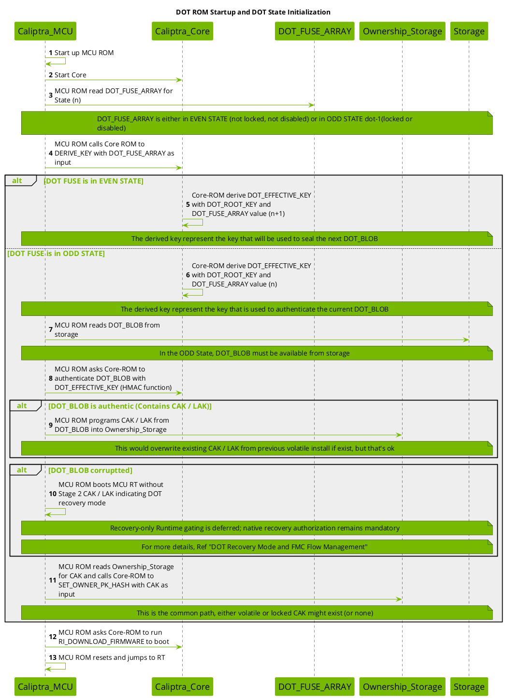
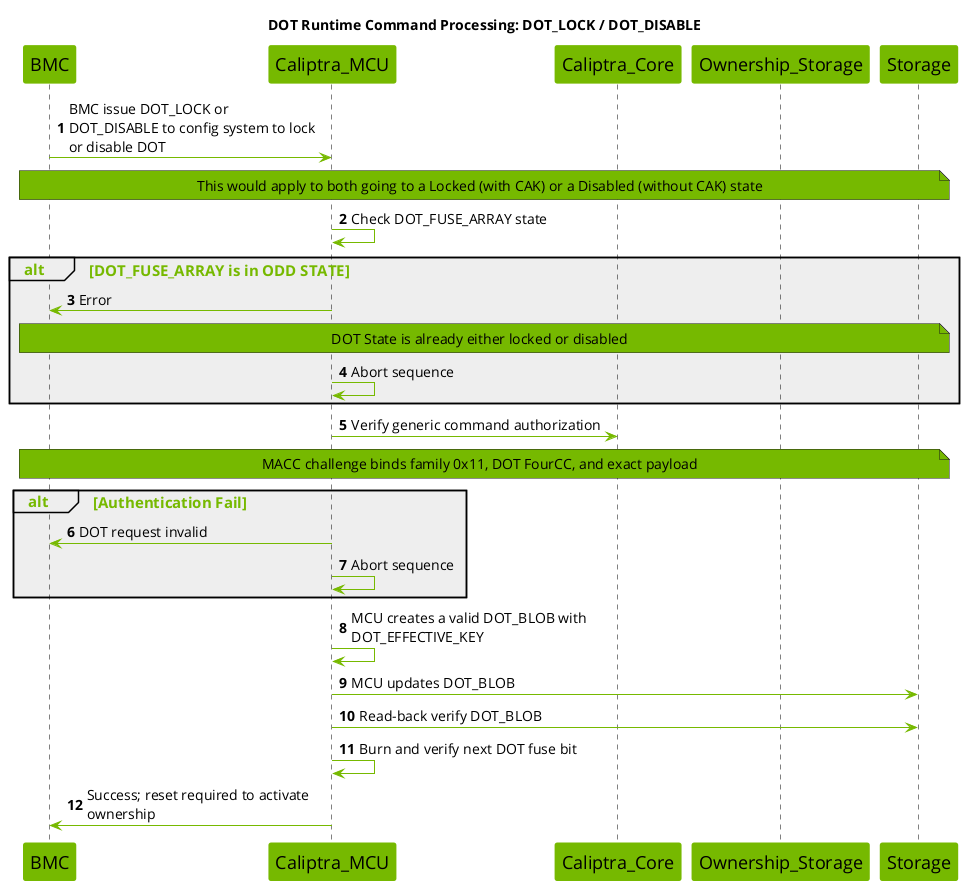
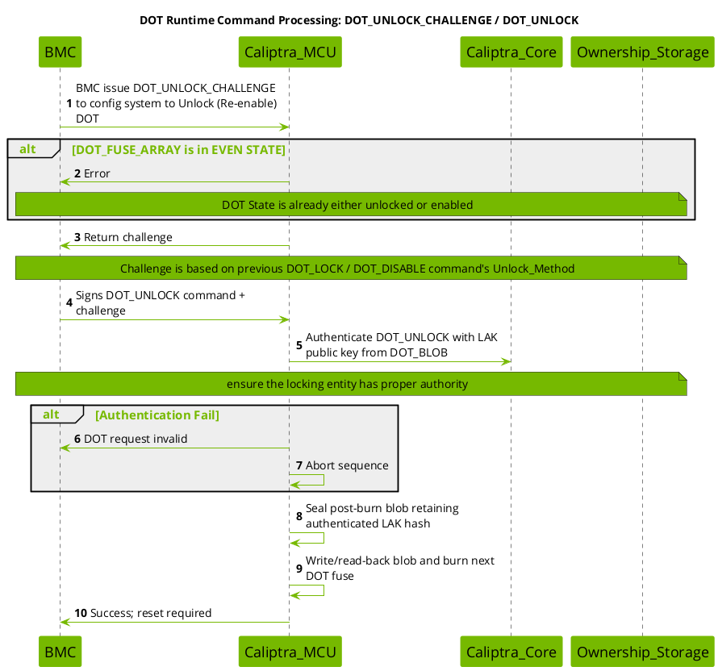
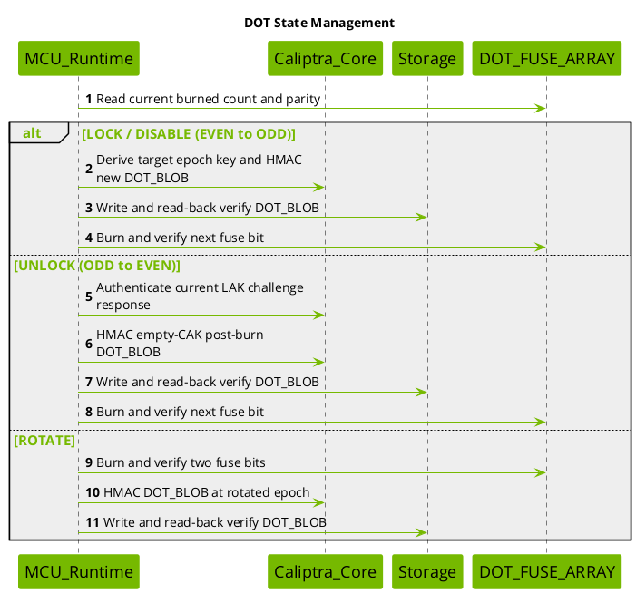
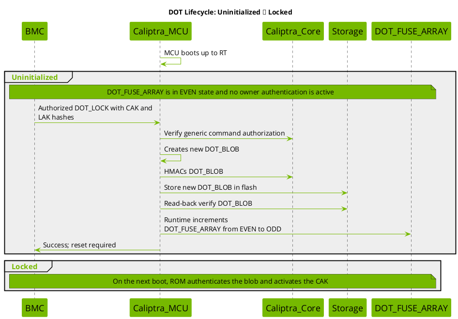
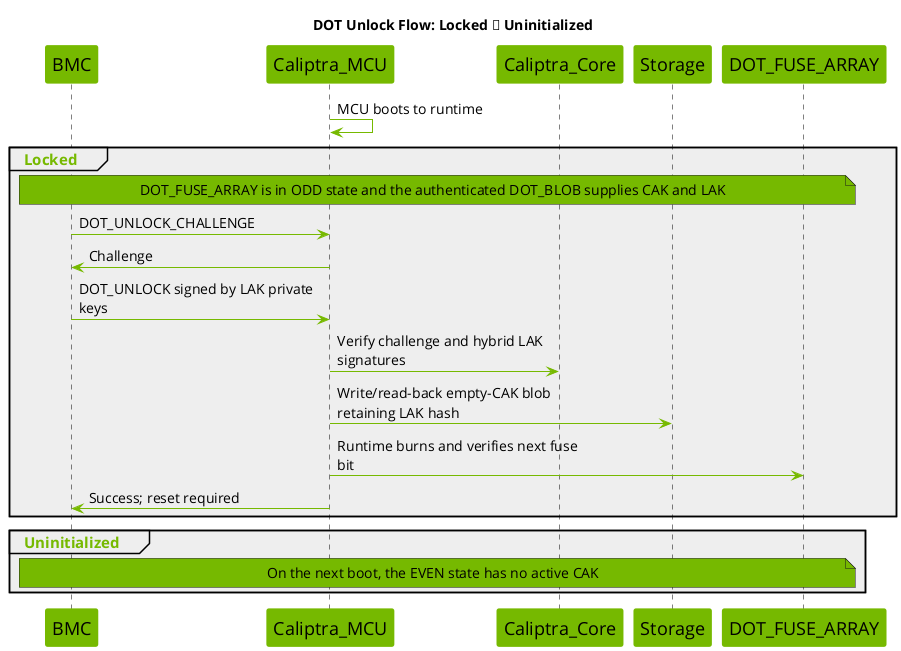
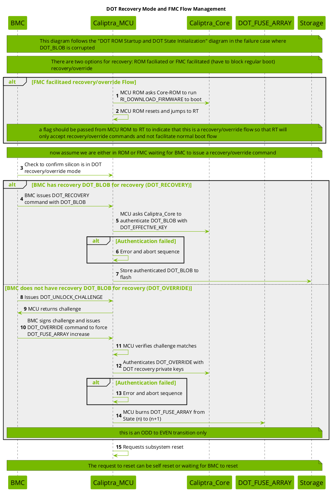
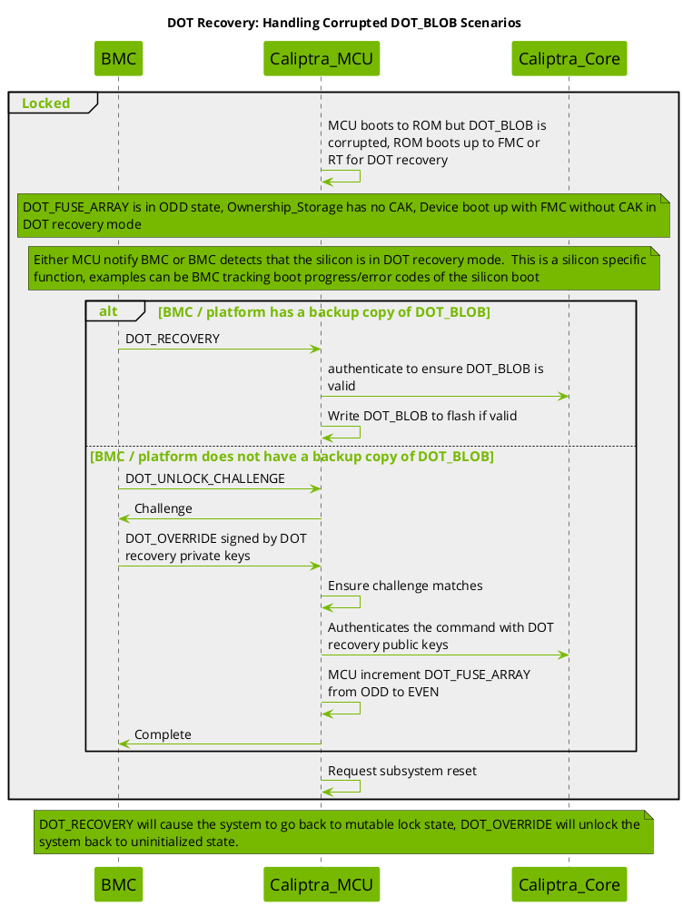

# Device Ownership Transfer

This contains details about the Caliptra implementation of Device Ownership Transfer (DOT) with MCU to assist.

Device Ownership Transfer (DOT) is a security mechanism implemented in Caliptra that enables device owners to establish code signing capabilities rooted in the hardware root of trust without permanently burning the Code Authentication Key (CAK) into fuses. This provides flexibility in ownership management while maintaining strong security guarantees.

Reference: [OCP Device Ownership Transfer specification](https://opencomputeproject.github.io/Security/device-ownership-transfer/HEAD/).

## Table of Contents
1. [Diagrams](#diagrams)
1. [Glossary](#glossary)
1. [DOT Modes](#dot-modes)
1. [Cryptographic Binding Mechanism](#cryptographic-binding-mechanism)
1. [System Components](#system-components)
1. [State Machine](#state-machine)
1. [Initialization Flow](#initialization-flow)
1. [Runtime Commands](#runtime-commands)
1. [Lifecycle Transitions](#lifecycle-transitions)
1. [Recovery Mechanisms](#recovery-mechanisms)
1. [Ownership RAM Recommendations](#ownership-ram-recommendations)
1. [Security Considerations](#security-considerations)


## Diagrams

* [ROM Startup and DOT State Initialization](#dot-1-init)
* [Recovery Mode and FMC Flow Management](#dot-2-recovery)
* [State Management](#dot-3-state)
* [Runtime Commands: DOT_LOCK / DOT_DISABLE](#dot-5-command-lock)
* [Runtime Commands: DOT_UNLOCK_CHALLENGE / DOT_UNLOCK](#dot-6-command-unlock)
* [Lifecycle: Uninitialized → Locked](#dot-7-install-lock)
* [Unlock Flow: Locked → Uninitialized](#dot-8-unlock-flow)
* [Recovery: Handling Corrupted DOT_BLOB](#dot-9-recovery-corrupted-blob)

---

## Glossary

**BMC (Baseboard Management Controller)**: System management controller that interfaces with Caliptra to issue DOT commands and manage recovery procedures.

**CAK (Code Authentication Key)**: The public key used to authenticate firmware and code running on the device. This is the owner's code signing key rooted in Caliptra.

**Caliptra**: Hardware root of trust providing secure boot and cryptographic services.

**Caliptra_Core**: Component within Caliptra that performs cryptographic operations offload (key derivation, HMAC, signature verification), derives DOT_EFFECTIVE_KEY, authenticates DOT_BLOBs and commands, and manages owner public key hash.

**Caliptra_MCU**: Microcontroller component that manages DOT state machine, handles runtime commands, controls fuse burning operations, coordinates with Caliptra_Core, and manages Ownership_Storage.

**DOT (Device Ownership Transfer)**: Security mechanism for flexible ownership management that enables device owners to establish code signing capabilities rooted in hardware without permanently burning keys into fuses.

**DOT_BLOB**: A cryptographically authenticated data structure containing the CAK and LAK, sealed with the DOT_EFFECTIVE_KEY via HMAC. Stored in external flash storage.

**DOT_EFFECTIVE_KEY**: A key derived from DOT_ROOT_KEY and the DOT_FUSE_ARRAY value, used to authenticate DOT_BLOBs via HMAC. The derivation varies based on EVEN/ODD state.

**DOT_FUSE_ARRAY**: A minimal fuse array using 1 bit per state change to track DOT state transitions. The fuse value acts as a counter that increments with each state change (one-time programmable). Must reside in a non-ECC protected fuse partition (e.g., `VENDOR_TEST_PARTITION` in the reference map) so that individual bits can be burned sequentially over time without invalidating partition ECC protections.

**DOT_ROOT_KEY**: A hardware-derived secret key unique to the silicon, used as the basis for deriving DOT_EFFECTIVE_KEY. Provides silicon binding.

**EVEN STATE**: Uninitialized/Volatile state (fuse value % 2 == 0) where no persistent ownership is bound to the silicon.

**FMC (First Mutable Code)**: First stage of mutable firmware. In Caliptra MCU architecture, FMC and RT are not differentiated as separate binaries (FMC is RT).

**HMAC (Hash-based Message Authentication Code)**: Cryptographic authentication method used to seal and verify DOT_BLOBs.

**LAK (Lock Authentication Key)**: The private key used to lock/unlock the DOT state and control the Disabled state. The entity possessing LAK.priv has the authority to:
- Lock ownership to the device (DOT_LOCK)
- Disable DOT while maintaining ownership (DOT_DISABLE)
- Unlock and release ownership (DOT_UNLOCK)

**ODD STATE**: Locked/Disabled state (fuse value % 2 == 1) where ownership is cryptographically bound to the silicon via DOT_BLOB.

**Ownership_Storage**: Volatile memory (e.g., FLOP-based register) that stores the current CAK and LAK during runtime. Must be retained across at least one MCU reset level and invalidated on power cycle. Contents are not updatable once marked valid by a non-Caliptra entity.

**ROM (Read-Only Memory)**: Immutable boot code that executes first on device startup.

**RT (Runtime)**: Main operating firmware that executes after ROM and FMC initialization.

**DOT recovery key**: Hybrid ECC and ML-DSA key used to authorize DOT_OVERRIDE in catastrophic recovery scenarios. Its public-key hash is provisioned in OTP.

**Volatile DOT**: Operating mode where CAK is installed per boot cycle and ownership is lost on power cycle. No fuse burning required.

**Mutable Locking DOT**: Operating mode where ownership is locked and bound to silicon via cryptographic binding using DOT_FUSE_ARRAY. Persists across power cycles.

### Goals
- Enable owner-specific code signing rooted in Caliptra (the root of trust)
- Avoid permanent fuse programming for ownership keys
- Support both temporary (volatile) and persistent (mutable locking) ownership models
- Provide secure ownership transfer mechanisms
- Enable recovery from corrupted states

---

## DOT Modes

### 1. Volatile DOT

**Characteristics:**
- CAK is installed per boot cycle
- Ownership information is stored only in Ownership_Storage
- Power cycle clears ownership
- No fuse burning required
- DOT_FUSE_ARRAY remains in EVEN state

**Use Cases:**
- Temporary ownership scenarios

The current Runtime DOT command family does not expose a volatile-install
operation.

**Flow:**
```
Volatile (EVEN) → [Power Cycle] → Uninitialized (EVEN)
```

### 2. Mutable Locking DOT

**Characteristics:**
- CAK is locked and bound to silicon via cryptographic binding
- Uses DOT_FUSE_ARRAY to create cryptographic binding (1 bit per state change)
- Ownership persists across power cycles
- Uses generic command authorization for lock, disable, and rotate; unlock uses LAK authentication
- DOT_BLOB stored in external storage (flash)
- State transitions require fuse burning
- Supports both Locked (with CAK) and Disabled (without CAK) states

**Use Cases:**
- Long-term ownership binding

**Flow:**
```
Uninitialized (EVEN) → [DOT_LOCK] → Locked (ODD) → [DOT_UNLOCK] → Uninitialized (EVEN)
                     ↘ [DOT_DISABLE] → Disabled (ODD) → [DOT_UNLOCK] ↗
```

---

## Cryptographic Binding Mechanism

The mutable locking DOT mechanism achieves secure binding without secure storage through a clever cryptographic construction:

### Key Derivation

The DOT_EFFECTIVE_KEY is derived as follows:

```
DOT_EFFECTIVE_KEY = KDF(DOT_ROOT_KEY, DOT_FUSE_ARRAY_VALUE)
```

### State-Dependent Derivation

**In EVEN STATE (n):**
- DOT_EFFECTIVE_KEY is derived using DOT_FUSE_ARRAY value (n+1)
- This represents the key that will seal the NEXT DOT_BLOB
- Allows pre-computation before fuse burning

**In ODD STATE (n):**
- DOT_EFFECTIVE_KEY is derived using DOT_FUSE_ARRAY value (n)
- This represents the key that authenticates the CURRENT DOT_BLOB
- Used to verify the stored DOT_BLOB on boot

### DOT_BLOB Authentication

```
DOT_BLOB = {CAK, LAK, metadata}
HMAC_TAG = HMAC-SHA-512(DOT_EFFECTIVE_KEY, DOT_BLOB)
```

The DOT_BLOB is authenticated on every boot in ODD state to ensure the CAK and LAK is authentic.

### Security Properties

1. **Binding to Silicon**: DOT_ROOT_KEY is unique per device, preventing DOT_BLOB portability
2. **Binding to State**: Fuse value is incorporated into key derivation, preventing rollback attacks
3. **Forward Security**: Unlocking increments fuses, invalidating old DOT_BLOBs
4. **No Secure Storage Required**: Cryptographic binding replaces need for secure non-volatile storage

---

## System Components

### Caliptra_MCU
- Manages DOT state machine
- Handles runtime commands
- Controls fuse burning operations
- Coordinates with Caliptra_Core for cryptographic operations
- Manages Ownership_Storage

### Caliptra_Core
- Performs cryptographic operations offload(key derivation, HMAC, signature verification)
- Derives DOT_EFFECTIVE_KEY
- Authenticates DOT_BLOBs and commands
- Manages owner public key hash (SET_OWNER_PK_HASH)

### DOT_FUSE_ARRAY
- Hardware fuse array
- Stores state counter (increments from 0 to maximum)
- Must be located in a non-ECC protected partition (e.g., `VENDOR_TEST_PARTITION`) to allow multiple sequential 1-bit writes
- Read during initialization
- Written during state transitions
- One-time programmable (OTP) per bit

### Ownership_Storage
- Volatile storage for current CAK and LAK (ex, FLOP based register)
- Content must be retained across at least one MCU reset level; should be retained across as many MCU reset levels as possible
- Ownership data must be invalidated and/or scrubbed on power cycle
- Ownership data must not be updatable once marked as valid by a non-Caliptra entity

See [Ownership RAM Recommendations](#ownership-ram-recommendations) for detailed guidance on how this storage should be sized, laid out, and retained across resets.

### Storage (Flash)
- Non-volatile external storage
- Stores DOT_BLOB (with redundancy)
- Not assumed to be secure

### BMC (Baseboard Management Controller)
- Issues DOT commands
- Manages recovery procedures
- Handles reset coordination
- May maintain backup DOT_BLOBs

---

## State Machine

### States

#### 1. Uninitialized (EVEN State)
- DOT_FUSE_ARRAY is in EVEN state
- No CAK in Ownership_Storage
- Device boots without owner authentication
- DOT_BLOB is not authoritative for boot and may contain post-transition data

#### 2. Volatile (EVEN State)
- DOT_FUSE_ARRAY is in EVEN state
- CAK present in Ownership_Storage
- Device boots with owner authentication
- Ownership lost on power cycle
- DOT_BLOB is not authoritative for boot

#### 3. Locked (ODD State)
- DOT_FUSE_ARRAY is in ODD state
- CAK present in Ownership_Storage (retrieved from DOT_BLOB)
- DOT_BLOB authenticated
- Device boots with owner authentication
- Ownership persists across power cycles
- DOT_BLOB present in storage

#### 4. Disabled (ODD State)
- DOT_FUSE_ARRAY is in ODD state
- LAK present in DOT_BLOB, but no CAK
- Device boots without code authentication enforcement
- Ownership is locked to silicon (via LAK) preventing unauthorized takeover
- Useful when owner doesn't want code signing but wants to prevent others from claiming ownership

#### 5. Corrupted (ODD State)
- DOT_FUSE_ARRAY is in ODD state
- DOT_BLOB is corrupted or missing
- Device boots into recovery mode (ROM or FMC)
- No CAK available
- Special recovery or override commands accepted

### State Transitions

```text
Uninitialized (EVEN, n)
    ├─ DOT_LOCK    → Locked  (ODD, n+1)
    └─ DOT_DISABLE → Disabled (ODD, n+1)

Locked / Disabled (ODD, n)
    └─ DOT_UNLOCK  → Uninitialized (EVEN, n+1)

Locked / Disabled (n)
    └─ DOT_ROTATE  → same parity (n+2)
```

---

## Initialization Flow

### Boot Sequence (DOT ROM Startup)

<a id="dot-1-init"></a>




1. **MCU ROM Startup**
   - Caliptra_MCU boots and starts MCU ROM
   - MCU ROM initializes Caliptra_Core

2. **Read DOT_FUSE_ARRAY State**
   - MCU ROM reads current DOT_FUSE_ARRAY value (n)
   - Determines if state is EVEN or ODD

3. **Derive DOT_EFFECTIVE_KEY**
   - MCU ROM calls Caliptra_Core ROM to derive key
   - **If EVEN state**: Derive with (n+1) for next DOT_BLOB sealing
   - **If ODD state**: Derive with (n) for current DOT_BLOB authentication

4. **ODD State Processing**
   - Read DOT_BLOB from storage
   - Authenticate DOT_BLOB using HMAC with DOT_EFFECTIVE_KEY
   - **If authentic**: Extract CAK/LAK and program into Ownership_Storage
   - **If corrupted**: Boot into DOT recovery mode (recovery flow documented in [later diagram](#dot-2-recovery))

5. **Set Owner Public Key**
   - Read CAK from Ownership_Storage (if present)
   - Call Caliptra_Core ROM SET_OWNER_PK_HASH with CAK

6. **Boot Firmware**
   - Call Caliptra_Core ROM RI_DOWNLOAD_FIRMWARE
   - MCU ROM resets and jumps to RT (Runtime)

### State Determination Logic

```
if (DOT_FUSE_ARRAY % 2 == 0) {
    // EVEN STATE - Unlocked/Uninitialized
    DOT_EFFECTIVE_KEY = Derive(DOT_ROOT_KEY, n+1)
    // Ready to seal new DOT_BLOB
} else {
    // ODD STATE - Locked/Enabled
    DOT_EFFECTIVE_KEY = Derive(DOT_ROOT_KEY, n)
    DOT_BLOB = Read_Storage()
    if (Authenticate(DOT_BLOB, DOT_EFFECTIVE_KEY)) {
        CAK, LAK = Extract(DOT_BLOB)
        Write_Ownership_Storage(CAK, LAK)
    } else {
        Boot_Recovery_Mode()
    }
}
```

---

## Runtime Commands

MCU Runtime exposes one transport-neutral DOT family. MCI uses command register
`0x00000011` and carries the DOT FourCC in mailbox SRAM. SPDM uses top-level
`DeviceOwnershipTransfer` (`0x11`) for native commands and wraps protected
commands as `AuthorizedCommand (0x12) -> family 0x11 -> DOT FourCC`.

| Command | FourCC | Classification | Core validation |
| ------- | ------ | -------------- | --------------- |
| `DOT_LOCK` | `MDLK` | Generic-authorized | Nonzero CAK/LAK hash, EVEN state |
| `DOT_DISABLE` | `MDDS` | Generic-authorized | Nonzero LAK hash, EVEN state |
| `DOT_ROTATE` | `MDRT` | Generic-authorized | Current burned count below requested minimum |
| `GET_DOT_BACKUP_BLOB` | `MDBB` | Generic-authorized | ODD state and valid blob HMAC |
| `DOT_UNLOCK_CHALLENGE` | `MDUC` | Native | ODD state and valid current blob |
| `DOT_UNLOCK` | `MDUL` | Native LAK signatures | Stored LAK hash, challenge, and fuse epoch |
| `DOT_STATUS` | `MDST` | Native/read-only | OTP state read |
| `DOT_RECOVERY` | `MDRC` | Native blob authentication | ODD state and current-epoch blob HMAC |
| `DOT_OVERRIDE_CHALLENGE` | `DOTW` | Native recovery authority | Keys match fused recovery-key hash |
| `DOT_OVERRIDE` | `DOTX` | Native recovery authority | Recovery-key hash and hybrid challenge signatures |

Generic authorization uses the shared `MACC` challenge and signs
`0x00000011(BE) || DOT_FourCC(LE) || DOT_payload || nonce`. Direct `0x11`
requests for `MDLK`, `MDDS`, `MDRT`, or `MDBB` are rejected. Runtime commits
blob and fuse changes directly and read-back verifies them before returning.
The response's `reset_required` field tells the caller that the new ownership
state becomes active on a subsequent reset.

### Host Utility Support

The `caliptra-util-host` Rust API exposes all ten commands in the table above
through the same transport-neutral command functions. Both its MCU mailbox and
SPDM VDM transports implement every command. The mailbox transport emits the
outer family command `0x00000011`, little-endian DOT FourCC, payload, and, for
generic-authorized commands, the authorization trailer. The SPDM VDM transport
selects the native `0x11` envelope or the protected `0x12 -> 0x11` envelope.

The mailbox integration validator connects the Rust host API through a UDP
bridge to a DOT-enabled emulator Runtime. It exercises `DOT_STATUS`, lock,
backup, rotate, unlock challenge, unlock, and disable as one end-to-end
sequence. Recovery and override require separately provisioned recovery states
and remain covered by their focused transport and device tests. The sample UDP
mock server does not emulate DOT. These DOT APIs are currently Rust-only and are
not exported through the host library's C bindings.

### Runtime Platform Support

Runtime DOT commands are enabled and tested on the reference emulator. The
emulator registers reset-retained storage shared by ROM and Runtime as a
userspace flash partition with driver number `DOT_BLOB_STORE_DRIVER_NUM`.

| Platform | Runtime DOT support | DOT blob backend |
| -------- | ------------------- | ---------------- |
| Emulator | Enabled for MCI and SPDM VDM | Reset-retained storage shared with ROM |
| FPGA | Not currently enabled | ROM uses physical secondary flash, but Runtime currently exposes only mailbox-backed imaginary flash |
| Other platforms | Opt-in | Platform must provide persistent storage visible to both ROM and Runtime |

The FPGA limitation is a software integration gap, not a hardware restriction.
FPGA ROM accesses the physical secondary flash controller directly, but FPGA
Runtime does not yet provide a Tock-compatible asynchronous driver for that
controller. Enabling Runtime DOT on FPGA requires adding that driver and
registering a bounded DOT blob partition over the same physical storage used by
ROM. Until then, FPGA production and `all-features` builds intentionally exclude
the Runtime DOT features; emulator builds enable them explicitly.

To enable Runtime DOT on another platform:

1. Provide persistent storage visible to both ROM and Runtime using the same
    offset and layout.
2. Register a userspace `FlashPartition` with driver number
    `DOT_BLOB_STORE_DRIVER_NUM` and at least `DOT_BLOB_STORE_SIZE` bytes.
3. Ensure blob reads, writes, and erases use the platform's asynchronous flash
    HIL and complete through its normal callback path.
4. Enable `dot-mci-mailbox` for MCI commands and `dot-spdm-vdm` for SPDM VDM
    commands.
5. Provision `dot_initialized`, the non-ECC `dot_fuse_array`, the generic
    command-authorization key hash, and, when override is required,
    `vendor_recovery_pk_hash`.
6. Use Caliptra firmware that supports stable-key derivation, HMAC-SHA-512,
    SHA-384/SHA-512, ECDSA P-384 verification, and ML-DSA-87 verification.

For example:

```shell
cargo xtask runtime-build \
  --platform <platform> \
  --features dot-mci-mailbox \
  --features dot-spdm-vdm
```

A platform must not enable these features until its Runtime storage backend
refers to the same persistent DOT blob storage consumed by ROM.

Recovery-mode gating for Runtime `MDRC`, `DOTW`, and `DOTX` is deferred. Their
native cryptographic and state checks remain mandatory. Firmware-manifest DOT
directives and ROM recovery protocols are unchanged.

### 1. DOT_LOCK

<a id="dot-5-command-lock"></a>



**Purpose:** Install CAK and LAK hashes in a DOT_BLOB and lock ownership to silicon.

**Preconditions:**
- DOT_FUSE_ARRAY in EVEN state
- Nonzero CAK and LAK hashes provided in the command

**Flow:**
1. BMC obtains `MACC` and issues an authorized `MDLK` request containing CAK and LAK hashes.
2. MCU RT verifies generic command authorization and checks DOT_FUSE_ARRAY state.
   - If ODD state: Return error (already locked)
3. MCU RT creates and HMAC-seals the ODD-state DOT_BLOB using epoch `(n+1)`.
4. MCU RT writes and read-back verifies the DOT_BLOB.
5. MCU RT burns and verifies the next DOT_FUSE_ARRAY bit.
6. MCU RT returns success with `reset_required = 1`.
7. **On the subsequent boot**:
    - Device boots in ODD state (n+1)
    - DOT_BLOB is authenticated and CAK/LAK retrieved
    - Device is now in Locked state

**Result:** Device enters Locked state with ownership persisting across power cycles.

### 2. DOT_DISABLE

Diagram is [above](#dot-5-command-lock).

**Purpose:** Lock DOT mechanism in disabled state directly from uninitialized state, maintaining ownership control without code authentication requirements.

**Use Case:** When the owner does not want to sign code with CAK but also does not want to leave the system in an uninitialized state where others could take over ownership. This provides a secure "parked" state where:
- The device remains under the owner's control (via LAK)
- No code authentication is enforced (no CAK)
- Unauthorized parties cannot install their own CAK or disable the device
- The owner can later unlock to return to uninitialized state

**Preconditions:**
- DOT_FUSE_ARRAY in EVEN state
- Nonzero LAK hash provided in command

**Flow:**
1. BMC obtains `MACC` and issues an authorized `MDDS` request containing the LAK hash.
2. MCU RT verifies generic command authorization and checks DOT_FUSE_ARRAY state.
   - If ODD state: Return error (already locked or disabled)
3. MCU RT creates and HMAC-seals an ODD-state DOT_BLOB containing LAK but no CAK.
4. MCU RT writes and read-back verifies the DOT_BLOB.
5. MCU RT burns and verifies the next DOT_FUSE_ARRAY bit.
6. MCU RT returns success with `reset_required = 1`.
7. **On the subsequent boot**:
    - Device boots in ODD state (n+1)
    - DOT_BLOB is authenticated and LAK recovered (but no CAK)
    - Device is now in Disabled state

**Result:** Device enters Disabled state - ownership is locked to the silicon (preventing takeover) but no code authentication is active. The owner retains authority to unlock via LAK.priv, which will return the device to Uninitialized state.

### 3. DOT_UNLOCK_CHALLENGE / DOT_UNLOCK

<a id="dot-6-command-unlock"></a>



**Purpose:** Unlock and unbind ownership from silicon, returning to volatile or uninitialized state.

**Preconditions:**
- DOT_FUSE_ARRAY in ODD state (Locked or Disabled)
- Valid DOT_BLOB in storage (for LAK.pub)

**Flow:**
1. BMC issues DOT_UNLOCK_CHALLENGE
2. MCU RT checks DOT_FUSE_ARRAY state
   - If EVEN state: Return error (already unlocked)
3. MCU RT generates and returns challenge
   - Challenge based on Unlock_Method from previous LOCK/DISABLE
4. BMC provides signed challenge with LAK.priv
5. BMC issues DOT_UNLOCK command with signed challenge
6. MCU RT verifies challenge matches
7. MCU RT authenticates command using LAK.pub from DOT_BLOB
   - If authentication fails: Return error
8. MCU RT seals an empty-CAK post-burn blob while retaining the authenticated LAK hash.
9. MCU RT writes/read-back verifies the blob, burns one fuse bit, and verifies the new count.
10. MCU RT consumes the challenge and returns success with `reset_required = 1`.
11. On the subsequent boot, the device is in EVEN state `(n+1)` with no active CAK.

**Result:**
- Device enters the unlocked/uninitialized EVEN state.
- The retained LAK hash keeps the post-burn blob well formed and matches firmware-manifest unlock semantics.

### 4. DOT_ROTATE

`MDRT` is generic-authorized and carries `min_fuse_count`, CAK, and LAK hashes.
When the current burned count is below `min_fuse_count`, Runtime burns two fuse
bits, preserving parity, and reseals the DOT_BLOB with the effective key for the
resulting state. An ODD result uses the new burned count; an EVEN result uses the
new burned count plus one. When the threshold is already met, the command
succeeds without another burn. Runtime requires enough remaining fuse bits to
complete both burns.

### 5. GET_DOT_BACKUP_BLOB

`MDBB` is generic-authorized. It is available only in ODD state. Runtime derives
the current DOT effective key, validates the active blob version and HMAC, and
returns the exact 168-byte blob. Corrupt, stale, or EVEN-state blobs are not
returned.

### 6. DOT_STATUS

`MDST` is read-only and does not use generic authorization. It returns:

```text
enabled:u8 || locked:u8 || burned:u16_le
```

`locked` is the parity of the burned fuse count.

### 7. DOT_RECOVERY

`MDRC` accepts a 168-byte backup blob without a generic authorization trailer.
Runtime requires ODD state and verifies the supplied blob with the current
device-derived DOT key before writing and read-back verifying it. The HMAC is
the command's native proof; an invalid backup cannot modify flash.

### 8. DOT_OVERRIDE_CHALLENGE / DOT_OVERRIDE

`DOTW` carries recovery ECC and ML-DSA public keys. Runtime hashes those keys
using the Caliptra recovery-key convention and compares the result with the
fused recovery-key hash before returning a fresh challenge.

`DOTX` carries the same keys and hybrid signatures over that challenge. Runtime
rechecks the fused key hash, verifies ECDSA P-384 and ML-DSA-87, burns one fuse
bit, and writes an empty blob sealed for the new EVEN epoch. These commands do
not use generic authorization. Restricting them to a ROM-signaled recovery
Runtime is deferred to a future hardening change.

---

## State Management

<a id="dot-3-state"></a>



Interactive Runtime commands perform blob and fuse transitions directly. The
firmware-manifest path remains separate and is processed by ROM while the
containing MCU Runtime image supplies authorization.

### State Transition Protocol

1. Serialize transitions so only one DOT mutation can run at a time.
2. Validate command authorization and the current fuse state.
3. Derive the target epoch key and create the required DOT_BLOB.
4. Apply command-specific power-fail ordering.
5. Read back storage and OTP state after each write.
6. Return success with reset required only after the transition is committed.

### Transition Ownership

The reference implementation deliberately splits transition ownership by entry
point:

- MCU Runtime directly commits interactive MCI and SPDM commands, including
    blob storage and OTP read-back verification.
- MCU ROM retains firmware-manifest DOT processing.
- MCU ROM retains its I3C recovery and override path.

Runtime recovery and override commands use the same direct-commit backend as
the other Runtime commands. Restricting those commands to a ROM-signaled
recovery Runtime is deferred; their cryptographic and state checks remain
mandatory.

---

## Lifecycle Transitions

### Full Lifecycle: Uninitialized → Locked

<a id="dot-7-install-lock"></a>



1. Device boots with DOT_FUSE_ARRAY in EVEN state and no owner authentication active.
2. BMC obtains `MACC` and issues an authorized `DOT_LOCK` with CAK and LAK hashes.
3. Runtime verifies generic command authorization and creates the DOT_BLOB.
4. Runtime seals the blob with the `(n+1)` DOT effective key.
5. Runtime writes and read-back verifies the blob.
6. Runtime burns and verifies DOT_FUSE_ARRAY from EVEN `(n)` to ODD `(n+1)`.
7. Runtime returns success with reset required.
8. On the subsequent boot, ROM authenticates the blob and activates its CAK.
9. **Result:** Locked ownership persists across power cycles.

### Full Lifecycle: Locked → Uninitialized

<a id="dot-8-unlock-flow"></a>



1. Device is in Locked or Disabled state with an ODD fuse count.
2. BMC issues DOT_UNLOCK_CHALLENGE
3. MCU RT returns challenge
4. BMC signs challenge with LAK.priv
5. BMC issues DOT_UNLOCK command with signed challenge
6. MCU RT verifies challenge and authenticates with LAK.pub
7. Runtime seals and read-back verifies an empty-CAK blob for the post-burn epoch while retaining the authenticated LAK hash.
8. Runtime burns and verifies DOT_FUSE_ARRAY from ODD `(n)` to EVEN `(n+1)`.
9. Runtime consumes the challenge and returns success with reset required.
10. On the subsequent boot, no CAK is active.
11. **Result:** The device is Uninitialized in the EVEN state.

---

## Recovery Mechanisms

Failure scenario in
[dot-1-init](#dot-1-init)

<a id="dot-2-recovery"></a>



**Detection:**
- Device in ODD state (should have valid DOT_BLOB)
- DOT_BLOB read from storage
- HMAC authentication fails

**Recovery Flow:**
1. MCU ROM detects corrupted DOT_BLOB during initialization
2. MCU ROM boots MCU RT without CAK/LAK
3. ROM may indicate DOT recovery mode to Runtime
4. Recovery-only Runtime gating is deferred; current recovery commands enforce their native cryptographic and state checks
5. BMC detects silicon in DOT recovery mode
   - Via boot progress tracking
   - Via error codes
   - Via explicit notification
6. MCU ROM/FMC conduct DOT recovery flow
   - Option 1: Recovery (BMC or EC has backup DOT_BLOB)
    - Option 2: Override (DOT recovery authority only)

**Alternative: ROM I3C Recovery**

Instead of booting to RT, the ROM can handle recovery directly over I3C using the [DOT I3C Recovery Protocol](dot_i3c.md). In this mode the ROM polls for a backup DOT blob from the BMC before proceeding with boot. The BMC can detect recovery mode via MCI flow checkpoint `DeviceOwnershipI3cRecoveryStarted`, I3C IBI with DOT MDB (0x1F), or DOT_STATUS query over I3C.

### Option 1: DOT_RECOVERY Command

<a id="dot-9-recovery-corrupted-blob"></a>



**When:** BMC has a backup copy of the DOT_BLOB

**Flow:**
1. BMC issues DOT_RECOVERY command with backup DOT_BLOB
2. MCU authenticates DOT_BLOB with DOT_EFFECTIVE_KEY
   - If authentication fails: Return error and abort
3. MCU writes authenticated DOT_BLOB to flash
4. Request subsystem reset
5. On next boot, DOT_BLOB will be valid
6. **Result:** Device returns to Locked state with recovered ownership

**Requirements:**
- BMC must maintain backup DOT_BLOB
- DOT_BLOB must match current DOT_FUSE_ARRAY state
- Cannot recover if backup is also corrupted

### Option 2: DOT_OVERRIDE Command

**When:** BMC does not have backup DOT_BLOB (catastrophic recovery, RMA to vendor)

**Flow:**
1. BMC issues DOT_UNLOCK_CHALLENGE
2. MCU returns challenge
3. BMC signs challenge with the DOT recovery private keys
4. BMC issues DOT_OVERRIDE command with signed challenge
5. MCU verifies challenge matches
6. MCU authenticates command with the DOT recovery public keys
   - If authentication fails: Return error and abort
7. MCU burns DOT_FUSE_ARRAY from ODD(n) to EVEN(n+1)
   - This is an ODD to EVEN transition only
8. Request subsystem reset
9. On next boot, device is in EVEN state (Uninitialized)
10. **Result:** Device unlocked, but ownership lost (factory reset equivalent)


### DOT Recovery PK Hash Format

The DOT recovery public-key hash is stored in the
`vendor_recovery_pk_hash` OTP fuse and matched by MCU ROM before any
`DOT_OVERRIDE` flow proceeds. **The format is identical to Caliptra's
[Owner PK hash](https://github.com/chipsalliance/caliptra-sw/blob/main/rom/dev/README.md#owner-pk-hash)
(`CPTRA_OWNER_PK_HASH`) and the
[Production debug unlock PK hashes](https://github.com/chipsalliance/caliptra-sw/blob/main/rom/dev/README.md#production-debug-unlock-public-key-hashes-byte-ordering)
(`MCI_PROD_DEBUG_UNLOCK_PK_HASH_REG_*`).** All three are computed the same
way and stored in the same byte order, so an integrator can — if they
choose — provision the same `(ECC P-384, MLDSA-87)` key pair as owner key,
debug unlock key, and DOT recovery key and reuse one hashing pipeline
to compute all three fuse values.

> **Implementation status:** the reference MCU ROM currently hashes ECC
> coordinates in standard SEC1 big-endian byte order and stores the
> SHA-384 output byte-for-byte in OTP, which differs from the Caliptra
> convention described below. The format documented here is the
> **target/aligned** format; aligning the DOT code and integration test
> with this format is tracked in a separate PR.

#### Hash construction

```text
vendor_recovery_pk_hash = SHA-384(
    ecc_pub_key.x  ||  // 48 bytes, dword-reversed from SEC1 big-endian
    ecc_pub_key.y  ||  // 48 bytes, dword-reversed from SEC1 big-endian
    pqc_pub_key        // 2592 bytes, raw FIPS 204 MLDSA-87 bytes (no transform)
)
```

Total input: **2688 bytes** (96 B ECC + 2592 B MLDSA). Output: **48 bytes**
(384 bits).

#### Byte-order conventions

Byte order matches Caliptra's [Public key hash byte ordering](https://github.com/chipsalliance/caliptra-sw/blob/main/rom/dev/README.md#public-key-hash-byte-ordering-dword-reversal)
exactly:

- **ECC P-384 X/Y coordinates** are in **dword-reversed format**. Take the
  48-byte standard SEC1 (big-endian) coordinate, group it into 12 four-byte
  dwords, and reverse the bytes within each dword. Equivalently, this is
  the in-memory layout of `[u32; 12]` where each `u32` is the standard
  big-endian dword interpreted as a native (little-endian) `u32` word.
  These dword-reversed bytes are what travels on the Caliptra mailbox wire
  (and what `CM_SHA` / `CM_ECDSA384_VERIFY` consume).
- **MLDSA-87 public key** bytes are passed through as raw FIPS 204 bytes,
  with no dword reversal.
- **SHA-384 output** in OTP is also **dword-reversed**: the 48-byte
  standard SHA-384 digest is grouped into 12 dwords and each dword's bytes
  are reversed before being written to OTP. The result is a `[u32; 12]`
  whose big-endian interpretation equals the standard digest. (Same OTP
  layout as `CPTRA_OWNER_PK_HASH` and `MCI_PROD_DEBUG_UNLOCK_PK_HASH_REG`.)

#### Reusing the same key across owner / debug unlock / DOT recovery

Because all three hashes use the same construction and the same OTP layout,
the bytes burned into `CPTRA_SS_OWNER_PK_HASH`, into any
`MCI_PROD_DEBUG_UNLOCK_PK_HASH_REG[i]` slot, and into
`vendor_recovery_pk_hash` for a given `(ECC, MLDSA)` key pair are
**bit-identical**. An integrator who wants the same key to serve multiple
roles can compute the hash once and burn the same 48 bytes into each slot.

This is not a security recommendation — in most threat models the vendor
recovery key, owner key, and debug unlock key are held by different
parties — but the format is intentionally aligned so the option exists and
the tooling is uniform.

### Worked Example

This example follows the same step-by-step style as
[Caliptra-sw's computing-public-key-hashes example](https://github.com/chipsalliance/caliptra-sw/blob/main/rom/dev/README.md#computing-public-key-hashes-step-by-step-example).
The keys here are contrived (simple patterns chosen so an integrator can
reproduce the hash with `python3` and `hashlib`).

#### Step 1: ECC P-384 public key (standard SEC1 byte order)

The integrator typically starts with standard SEC1 / FIPS 186 big-endian
coordinates, as produced by `openssl ec -pubin -in key.pem -outform DER`
followed by extracting the trailing 96 bytes:

```text
X (SEC1 / openssl output, 48 bytes):
  c69fe67f 97ea3e42 21a7a603 6c2e070d 1657327b c3f1e7c1
  8dccb9e4 ffda5c3f 4db0a1c0 567e0973 17bf4484 39696a07
Y (SEC1 / openssl output, 48 bytes):
  c126b913 5fc82572 8f1cd403 19109430 994fe3e8 74a8b026
  be14794d 27789964 7735fde8 328afd84 cd4d4aa8 72d40b42
```

#### Step 2: Dword-reverse the ECC coordinates

Group each 48-byte coordinate into 12 four-byte dwords and reverse the
bytes within each dword. These are the bytes that get hashed (and the
bytes the BMC sends on the mailbox wire for `DOT_OVERRIDE`):

```text
X (dword-reversed, hashed bytes), first 16 bytes:
  7f e6 9f c6  42 3e ea 97  03 a6 a7 21  0d 07 2e 6c
  ...
Y (dword-reversed, hashed bytes), first 16 bytes:
  13 b9 26 c1  72 25 c8 5f  03 d4 1c 8f  30 94 10 19
  ...
```

#### Step 3: MLDSA-87 public key

For this example, byte `i = ((i * 17 + 3) & 0xff)`. MLDSA keys are
**not** transformed:

```text
Size: 2592 bytes (raw FIPS 204 bytes / `[u32; 648]` as_bytes()).
First 16 bytes: 03 14 25 36 47 58 69 7a 8b 9c ad be cf e0 f1 02
```

#### Step 4: Compute SHA-384

```text
Input = X_dword_reversed || Y_dword_reversed || MLDSA_raw  (2688 bytes)

SHA-384 (standard, 48 bytes):
  2da3927b 2515cd22 cc823fdf e4e6b5e0 3fab1f81 68141140
  163eddea cbc0ba4e bcba2bd2 ec93da05 3e8b8d08 0c01adbf
```

#### Step 5: Bytes burned into `vendor_recovery_pk_hash` OTP

The 48-byte SHA-384 output is stored in **dword-reversed format**,
identical to how `CPTRA_OWNER_PK_HASH` and
`MCI_PROD_DEBUG_UNLOCK_PK_HASH_REG[i]` are stored:

```text
OTP bytes at vendor_recovery_pk_hash offset:
  7b 92 a3 2d  22 cd 15 25  df 3f 82 cc  e0 b5 e6 e4
  81 1f ab 3f  40 11 14 68  ea dd 3e 16  4e ba c0 cb
  d2 2b ba bc  05 da 93 ec  08 8d 8b 3e  bf ad 01 0c
```

As a `[u32; 12]` (big-endian interpretation of each dword in the standard
SHA-384 output — same convention as Caliptra's owner PK hash register):

```text
[0x2da3927b, 0x2515cd22, 0xcc823fdf, 0xe4e6b5e0,
 0x3fab1f81, 0x68141140, 0x163eddea, 0xcbc0ba4e,
 0xbcba2bd2, 0xec93da05, 0x3e8b8d08, 0x0c01adbf]
```

#### Verifying offline with `openssl` / Python

```python
import hashlib

ecc_x_sec1 = bytes.fromhex("c69fe67f...39696a07")  # 48 bytes, openssl output
ecc_y_sec1 = bytes.fromhex("c126b913...72d40b42")  # 48 bytes, openssl output
mldsa = open("mldsa_pubkey.bin", "rb").read()      # 2592 bytes, FIPS 204 raw

def dword_reverse(b):
    return b"".join(b[i:i+4][::-1] for i in range(0, len(b), 4))

hash_input = dword_reverse(ecc_x_sec1) + dword_reverse(ecc_y_sec1) + mldsa
digest = hashlib.sha384(hash_input).digest()      # 48-byte standard digest
otp_bytes = dword_reverse(digest)                  # 48 bytes to write to OTP
```

**Notes for integrators:**

- The same `(ECC P-384, MLDSA-87)` pubkey pair must be used to generate the
  hash that is burned at manufacture and to sign the `DOT_OVERRIDE`
  challenge response at recovery time. There is no separate "key index"
  field — the hash binds both keys together.
- The reference fuse map allocates exactly one recovery PK hash. If
    rotation of the DOT recovery key is required in the field, integrators
  should add multiple `vendor_recovery_pk_hash_{0..N}` slots in a vendor
  secret partition, plus a `vendor_recovery_pk_hash_valid` revocation
  bitmask analogous to `CPTRA_CORE_VENDOR_PK_HASH_VALID`. ROM would then
  pick the first valid slot using the same selection policy as the regular
  vendor PK hash.
- A fuse value of all-zero bytes is treated as "not provisioned" by MCU ROM;
  in that case `DOT_OVERRIDE` is permanently disabled for the part.

### Recovery State Machine

```
Locked (ODD, n) + Corrupted BLOB
    ↓
Recovery Mode
    ├─→ [DOT_RECOVERY with valid backup] → Locked (ODD, n) [restored]
    └─→ [DOT_OVERRIDE with DOT recovery key] → Uninitialized (EVEN, n+1) [ownership lost]
```


### DOT_OVERRIDE via MCI Mailbox (Reference Implementation)

An example implementation of DOT_OVERRIDE using the MCI mailbox is provided below.
This is for disaster recovery when no backup blob is available.

**When:** Device is in Locked (ODD) state with a corrupted or missing DOT_BLOB. The BMC
holds the DOT recovery private keys corresponding to the recovery key hash stored
in OTP fuses.

The reference MCU ROM uses MCI mailbox 0 (`mcu_mbox0`) to perform a
two-transaction challenge/response protocol with the BMC.
The BMC provides the DOT recovery public keys (ECC P-384 + MLDSA-87) and signs
the challenge with both corresponding private keys; ROM verifies the signatures using
Caliptra's `CM_ECDSA384_VERIFY` and `CM_MLDSA87_VERIFY` commands.

**Protocol:**

#### Transaction 1: DOT_UNLOCK_CHALLENGE

Command Code: `0x444F_5457` ("DOTW")

The `DOT_UNLOCK_CHALLENGE` command is a unified challenge request used for both
owner unlock and vendor override. The `challenge_type` field indicates
which operation is requested.

*Table: `DOT_UNLOCK_CHALLENGE` input arguments*

| **Name**        | **Type**     | **Description**                              |
| --------------- | ------------ | -------------------------------------------- |
| chksum          | u32          | Checksum (Caliptra standard formula)         |
| challenge_type  | u32          | `0x01` = UNLOCK (owner), `0x02` = OVERRIDE (vendor) |
| ecc_pub_key_x   | u8[48]       | Public key ECDSA P-384 X coordinate          |
| ecc_pub_key_y   | u8[48]       | Public key ECDSA P-384 Y coordinate          |
| mldsa_pub_key   | u8[2592]     | MLDSA-87 public key                          |

For `challenge_type = OVERRIDE`, the public keys are the DOT recovery keys and
are verified against the recovery key hash in OTP fuses.
For `challenge_type = UNLOCK`, the public keys are the LAK and are
verified against the LAK hash in the DOT_BLOB.

*Table: `DOT_UNLOCK_CHALLENGE` output arguments*

| **Name**        | **Type**     | **Description**                      |
| --------------- | ------------ | ------------------------------------ |
| challenge       | u8[48]       | Random 48-byte challenge for signing |

The ROM computes SHA-384 of the provided public keys (ECC X ‖ ECC Y ‖ MLDSA)
and verifies the hash against the appropriate PK hash (OTP fuses for OVERRIDE,
DOT_BLOB for UNLOCK).
If the hash matches, the ROM generates a random 48-byte challenge and
returns it via `DataReady` status.

#### Transaction 2: DOT_OVERRIDE

Command Code: `0x444F_5458` ("DOTX")

*Table: `DOT_OVERRIDE` input arguments*

| **Name**        | **Type**     | **Description**                     |
| --------------- | ------------ | ----------------------------------- |
| chksum          | u32          | Checksum (Caliptra standard formula)|
| ecc_pub_key_x   | u8[48]       | ECDSA P-384 public key X coordinate |
| ecc_pub_key_y   | u8[48]       | ECDSA P-384 public key Y coordinate |
| ecc_sig_r       | u8[48]       | ECDSA P-384 signature R component   |
| ecc_sig_s       | u8[48]       | ECDSA P-384 signature S component   |
| mldsa_pub_key   | u8[2592]     | MLDSA-87 public key                 |
| mldsa_signature | u8[4627]     | MLDSA-87 signature                  |
| padding         | u8           | Padding for MLDSA signature         |

The ROM re-verifies the DOT recovery public-key hash (ECC + MLDSA) against the
OTP fuses before verifying signatures. The ECDSA signature is over
`SHA-384(challenge)`. The MLDSA signature is over the raw challenge bytes.

**Flow:**
1. ROM boots, detects DOT_BLOB is corrupted/missing in Locked (ODD) state
2. ROM polls MCI mbox0 for `DOT_UNLOCK_CHALLENGE` command
3. BMC writes `challenge_type = OVERRIDE` + DOT recovery public keys (ECC + MLDSA) → mbox0 SRAM
4. ROM checks `challenge_type` and verifies the key hash against `vendor_recovery_pk_hash` in OTP fuses
5. ROM generates random 48-byte challenge → responds via mbox0 `DataReady`
6. BMC signs challenge with the DOT recovery private keys (ECDSA P-384 + MLDSA-87)
7. BMC writes public keys + signatures → mbox0 as `DOT_OVERRIDE` command
8. ROM re-verifies the DOT recovery key hash against OTP fuses
9. ROM verifies ECDSA signature via `CM_ECDSA384_VERIFY`
10. ROM verifies MLDSA signature via `CM_MLDSA87_VERIFY`
11. If both pass: ROM burns DOT fuse (n→n+1) and writes a new empty DOT_BLOB (no CAK/LAK) HMAC'd with the EVEN-state key
12. ROM triggers warm reset
13. **Result:** Device transitions to EVEN (Uninitialized) state with a valid DOT_BLOB

**Requirements:**
- Device must be in Locked (ODD) state (blob may be corrupted or missing)
- BMC must hold the DOT recovery private keys (ECC + MLDSA)
- DOT recovery public-key hash must match `vendor_recovery_pk_hash` in OTP fuses
- MCI mbox0 must be accessible to the BMC
- Override failure is non-fatal: boot continues with recovery attempts

---

## Ownership RAM Recommendations

`Ownership_Storage` (also referred to as *ownership RAM*) is an optional
platform mechanism for retaining active CAK/LAK material across selected reset
levels. It is not a transition journal in the reference implementation:
interactive Runtime commands commit DOT_BLOB and OTP changes directly and do
not post a desired fuse state for ROM or FMC.

An integrator may also reserve boot-intent fields for a future ROM-signaled DOT
recovery Runtime. Enforcement of that recovery-only mode is deferred in the
reference Runtime.

### Retention and Reset Domain

When implemented, ownership RAM should sit in a reset domain that is **retained
across selected MCU/subsystem resets but cleared when `powergood` drops (power
cycle)**. Mapping this onto the MCU reset flows (selected by the MCI
`RESET_REASON` register, see the [Reference ROM Specification](rom.md)):

| Reset / event | `RESET_REASON` | Ownership RAM |
|---|---|---|
| Cold boot (first boot after power-good asserted / MCI reset) | none set | **Cleared / invalid** (must be re-derived from DOT_BLOB) |
| Firmware Boot Reset | `FwBootUpdReset` | **Retained** |
| Firmware Hitless Update | `FwHitlessUpdReset` | **Retained** |
| Warm Reset (subsystem reset with `powergood` held) | `WarmReset` | **Retained** |
| Power cycle / `powergood` de-assert | (next boot is cold) | **Cleared / scrubbed** |

Recommendations:

- Place ownership RAM in MCI sticky/FLOP storage (or equivalent SoC sticky
  registers) that shares the retention domain of other reset-surviving MCI
  state, so that warm and firmware resets preserve it while a power-good drop
  clears it.
- Retaining it across firmware and warm resets lets an integrator preserve
    active ownership context without treating it as non-volatile state.
- On any boot where the hardware cannot guarantee retention (e.g. a cold boot),
  the contents must be treated as invalid and re-derived from the DOT_BLOB.

### Sizing and Layout

Size the region to hold the largest CAK/LAK material plus control and integrity
fields. A recommended logical layout:

| Field | Purpose | Writer |
|---|---|---|
| `magic` / `version` | Identifies a valid, correctly-versioned ownership RAM block | ROM |
| `valid` flag | Set once ROM has populated the block this power cycle | ROM |
| `locked` flag | Set once the block is sealed; further non-Caliptra writes are rejected | ROM |
| `dot_boot_mode` | Optional normal vs. DOT recovery boot intent | ROM |
| `CAK` | Current code authentication key in Locked state | ROM (from blob) |
| `LAK` | Current lock authentication key | ROM (from blob) |
| `integrity` (CRC/checksum) | Detects corruption of the block | last writer |

Keep the layout fixed and versioned so that ROM and RT agree on the contents
across firmware updates. Reserve space for future fields.

### Access Control and Locking

- **Ownership data must not be updatable once marked valid by a non-Caliptra
    entity.** Once ROM seals the block, set the
  `locked` flag and have the hardware/firmware reject further writes from
  untrusted AXI users until the next power cycle. This prevents another agent
  from substituting CAK/LAK after they have been committed.
- Lock ownership RAM before handing control to less-trusted code or exposing
  mailbox/interfaces to external entities (mirror the MCI configuration locking
  performed around `SS_CONFIG_DONE_STICKY` / `SS_CONFIG_DONE` in the ROM).
- Runtime DOT transitions must not depend on mutating ownership RAM; their
    authoritative state is the read-back-verified DOT_BLOB and DOT_FUSE_ARRAY.

### Integrity and Scrubbing

- Protect the block with a `magic`/`version` and a CRC/checksum so consumers can
  distinguish a validly retained block from uninitialized or corrupted RAM. If
  the integrity check fails, treat the block as invalid and fall back to the
  DOT_BLOB / fuse state on flash and OTP.
- **Scrub secrets on power cycle and on transition completion.** CAK/LAK must be
  zeroized when ownership is lost (power cycle, or `DOT_UNLOCK`/`DOT_OVERRIDE`
  that drops to Uninitialized). Do not rely solely on the retention domain
  clearing — explicitly invalidate the `valid` flag and zero secret fields when
  a flow completes so stale keys are never re-used.

### Using Ownership RAM Across Boot Stages

The intended producer/consumer relationship is narrow:

1. **ROM (boot):** In ODD state, authenticate the DOT_BLOB and optionally
   publish its CAK/LAK as read-only active ownership context.
2. **Runtime:** Consume active ownership context if the platform exposes it;
   Runtime command transitions still validate and commit against flash and OTP.
3. **ROM → Runtime recovery intent:** A future implementation may publish a
   recovery-only boot mode. Until that gating is implemented, Runtime recovery
   commands rely on their native cryptographic and state checks.

On a cold boot or failed integrity check, discard ownership RAM and reconstruct
authoritative ownership from `DOT_FUSE_ARRAY` and the authenticated DOT_BLOB.

---

## Security Considerations

### Security Properties

1. **Silicon Binding**
   - DOT_ROOT_KEY is unique per device, for Caliptra 2.0/2.1, it is up to the integrator to decide how to form this per-device unique key.
   - DOT_BLOBs cannot be authenticated / used between devices of the same model
   - Each device requires its own unique DOT_BLOB

2. **State Binding**
   - DOT_EFFECTIVE_KEY incorporates fuse state
   - Old DOT_BLOBs become invalid after unlock
   - Prevents rollback to previous ownership states

3. **Forward Security**
   - Unlocking increments fuses
   - Previous DOT_BLOBs cannot be replayed
   - Each lock operation requires new DOT_BLOB

4. **Authenticity**
    - DOT_LOCK, DOT_DISABLE, DOT_ROTATE, and GET_DOT_BACKUP_BLOB require generic command authorization
   - DOT_UNLOCK requires LAK.priv signature
    - DOT_RECOVERY requires a current-epoch DOT_BLOB HMAC
    - DOT_OVERRIDE requires recovery-key signatures anchored in fused PK hash
    - All commands that touch fuse state are cryptographically authenticated

5. **Ownership Protection**
   - Disabled state prevents unauthorized ownership takeover
   - Owner maintains control via LAK even without CAK enforcement
   - Uninitialized devices can be claimed by any party, Disabled devices cannot

6. **Minimal Fuse Usage**
    - One bit per parity-changing transition; two bits per rotation
   - Efficient use of limited fuse resources
   - Supports many lock/unlock cycles

### Threat Model

**Protected Against:**
- Unauthorized ownership changes (generic command authority, current LAK, or fused recovery authority)
- DOT_BLOB tampering (HMAC-authenticated)
- DOT_BLOB replay from different device (silicon binding)
- DOT_BLOB replay from previous state (state binding)
- Rollback attacks (fuse increment prevents rollback)
- Storage attacks (cryptographic binding, no trust in storage)

**Not Protected Against:**
- Physical attacks on fuses (assumed secure)
- Compromise of DOT_ROOT_KEY (silicon security boundary)
- Compromise of LAK.priv (ownership credential)
- Compromise of the DOT recovery private keys
- Side-channel attacks on cryptographic operations

### Best Practices

1. **LAK Management**
   - Store LAK.priv securely (HSM, secure enclave)
   - Control LAK.priv access carefully
   - Consider key escrow for recovery scenarios
   - Implement proper key rotation when re-locking

2. **DOT_BLOB Backup**
   - Maintain redundant backups of DOT_BLOB
   - Store in multiple locations
   - Verify backups periodically
   - Secure backup storage (integrity and availability)

3. **State Transition Management**
   - Verify DOT_BLOB integrity before DOT_LOCK fuse burn
   - Ensure storage is reliable
   - Handle reset failures gracefully
   - Monitor fuse budget (total available transitions)

4. **Recovery Planning**
   - Define recovery procedures between device and BMC or EC
   - Test recovery scenarios
    - Maintain secure access to the DOT recovery private keys
   - Document override procedures

5. **Operational Security**
   - Audit DOT command invocations
   - Monitor DOT state changes
   - Alert on recovery mode entries
   - Track fuse usage over time

### Fuse Budget Planning

LOCK, DISABLE, UNLOCK, and OVERRIDE consume one fuse bit. ROTATE consumes two:
```
Uninitialized(0) → Locked(1) → Uninitialized(2) → Locked(3) → ...
```

With N fuse bits:
- Maximum N state transitions
- Approximately N/2 lock/unlock cycles
- Plan for expected device lifetime
- Reserve bits for recovery scenarios

Example with 128-bit fuse array:
- 128 one-bit state transitions
- ~64 lock/unlock cycles
- More than sufficient for most use cases

---

## Appendix: Command Reference

### Command Summary Table

| Command | State Requirement | Authentication | Fuse Impact | Purpose |
|---------|------------------|----------------|-------------|---------|
| DOT_LOCK | EVEN | Generic authorization | Yes (n→n+1) | Lock ownership to silicon |
| DOT_DISABLE | EVEN | Generic authorization | Yes (n→n+1) | Disable DOT in locked state |
| DOT_ROTATE | Threshold | Generic authorization | Yes (n→n+2) | Rotate key epoch while preserving parity |
| GET_DOT_BACKUP_BLOB | ODD | Generic authorization + blob HMAC | No | Export authenticated backup |
| DOT_UNLOCK_CHALLENGE | ODD | None | No | Request unlock challenge |
| DOT_UNLOCK | ODD | LAK.priv | Yes (n→n+1) | Unlock ownership from silicon |
| DOT_STATUS | Any | None (read-only) | No | Query initialization, parity, and fuse count |
| DOT_RECOVERY | ODD | DOT_BLOB HMAC | No | Restore corrupted DOT_BLOB |
| DOT_OVERRIDE_CHALLENGE | ODD | Fused recovery-key hash | No | Start destructive override |
| DOT_OVERRIDE | ODD | Fused recovery-key hybrid signatures | Yes (n→n+1) | Force unlock (destructive) |

### State Transition Table

| From State | Command | To State | Fuse Change | Storage Change |
|------------|---------|----------|-------------|----------------|
| Volatile (EVEN) | Power Cycle | Uninitialized (EVEN) | No | None |
| Unlocked (EVEN) | DOT_LOCK | Locked (ODD) | EVEN→ODD | Create DOT_BLOB |
| Unlocked (EVEN) | DOT_DISABLE | Disabled (ODD) | EVEN→ODD | Create DOT_BLOB (no CAK) |
| Locked (ODD) | DOT_UNLOCK | Uninitialized (EVEN) | ODD→EVEN | Seal empty-CAK blob retaining LAK hash |
| Locked (ODD) | Corrupted BLOB | Recovery (ODD) | No | None |
| Recovery (ODD) | DOT_RECOVERY | Locked (ODD) | No | Restore DOT_BLOB |
| Recovery (ODD) | DOT_OVERRIDE | Uninitialized (EVEN) | ODD→EVEN | Seal empty DOT_BLOB |
