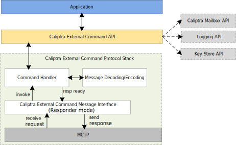

# Caliptra Subsystem External Command Spec

## Overview
This document specifies the external command protocol used by the Baseboard Management Controller (BMC) to communicate with the device integrating the Caliptra RoT subsystem for querying device-specific information, retrieving debug logs and attestation logs, and managing certificates etc. The protocol is based on the MCTP (Management Component Transport Protocol) over the I3C interface and uses a vendor-defined message type (`0x7E`). The command format is inspired by the Cerberus Protocol[^1].

#### Use Cases of External Commands

The external commands defined in this protocol enable various critical functionalities, including but not limited to:

**Device Identification and Capabilities**:
- Retrieve unique device identifiers, firmware versions, and device capabilities to ensure compatibility and proper configuration.
- Query device-specific information such as chip identifiers or subsystem details.

**Debugging and Diagnostics**:
- Retrieve debug logs to analyze device behavior, diagnose issues, and monitor runtime states.
- Clear logs to reset diagnostic data and maintain storage efficiency.

**Certificate Management**:
- Export Certificate Signing Requests (CSRs) for device keys to facilitate secure provisioning.
- Import signed certificates to establish a trusted certificate chain for device authentication.
- Verify the state of the certificate chain to ensure the integrity and validity of the provisioning process.

**Attestation and Security**:
- Retrieve attestation logs to verify the integrity of the device and its software stack.

#### Protocol Overview

- **Transport Layer**: MCTP
- **Message Type**: The message type is `0x7E` as per the MCTP Base Specification. This message type supports Vendor Defined Messages, where the vendor is identified by the PCI-based Vendor ID. The initial message header is specified in the MCTP Base Specification and detailed below for completeness:

| Field Name                  | Byte(s) | Description                                                             |
|-----------------------------|---------|-------------------------------------------------------------------------|
| **Request Data**            |         |                                                                         |
| PCI/PCIe Vendor ID          | 1:2     | The MCTP Vendor ID formatted per `00h` Vendor ID format offset.         |
| Vendor-Defined Message Body | 3:N     | Vendor-defined message body, 0 to N bytes.                              |
| **Response Data**           |         |                                                                         |
| PCI/PCIe Vendor ID          | 1:2     | The value is formatted per `00h` Vendor ID offset.                      |
| Vendor-Defined Message Body | 3:M     | Vendor-defined message body, 0 to M bytes.                              |

The Vendor ID is a 16-bit unsigned integer, described in the PCI 2.3 specification. The value identifies the device manufacturer. The message body and content are described in the sections below.

## Command Format

This section describes the MCTP message format used to support Caliptra subsystem external command protocol. The request/response message body encapsulates the Vendor Defined MCTP message within the MCTP transport. Details of MCTP message encapsulation can be found in the MCTP Base Specification. The MCTP Get Vendor Defined Message Support command allows discovery of the vendor-defined messages supported by an endpoint. This discovery process identifies the vendor organization and the supported message types. The format of this request is specified in the MCTP Base Specification.

For the Caliptra external command protocol, the following information is returned in response to the MCTP Get Vendor Defined Message Support request:
- **Vendor ID Format**: `0`
- **PCI Vendor ID**: `0x1414`
- **Command Set Version**: `4`

The following table provides detailed descriptions of the fields used in the Caliptra external command protocol:

| Field Name           | Description                                                                                                   |
|----------------------|---------------------------------------------------------------------------------------------------------------|
| **IC**               | (MCTP Integrity Check bit) Indicates whether the MCTP message is covered by an overall MCTP message payload integrity check. |
| **Message Type**     | Indicates an MCTP Vendor Defined Message.                                                                     |
| **MCTP PCI Vendor**  | ID for PCI Vendor. Caliptra messages use the Microsoft PCI ID of `0x1414`.                                    |
| **Request Type**     | Indicates the type of request contained in the message. Messages defined in this specification shall have this bit set to `0`. Setting this bit to `1` provides a mechanism to support a device-specific command set. Devices without additional command support will return an error if this bit is `1`. |
| **Crypt**            | Indicates whether the Message Payload and Command are encrypted.                                              |
| **Command**          | The command ID for the operation to execute.                                                                  |
| **Msg Integrity Check** | Represents the optional presence of a message type-specific integrity check over the contents of the message body. If present (indicated by the IC bit), the Message Integrity Check field is carried in the last bytes of the message body. |

The following table describes the MCTP message format used in the Caliptra external command protocol:

| Byte Offset +0                | Byte Offset +1                | Byte Offset +2                | Byte Offset +3                |
|-------------------------------|-------------------------------|-------------------------------|-------------------------------|
| 7 | 6 | 5 | 4 | 3 | 2 | 1 | 0 | 7 | 6 | 5 | 4 | 3 | 2 | 1 | 0 | 7 | 6 | 5 | 4 | 3 | 2 | 1 | 0 | 7 | 6 | 5 | 4 | 3 | 2 | 1 | 0 |
| MCTP Rsvd     | Header Ver    | Destination Endpoint ID       | Source Endpoint ID            | SOM | EOM | PktSeq | TO | Msg Tag |
| IC | Msg Type = 7E            | MCTP PCI Vendor ID = 0x1414                                   | Rq | Rsvd | Crypt | Reserved  |
|    Command                    |                                   Message Payload                                             |

The protocol header fields are to be included only in the first packet of a multiple-packet MCTP message. After reconstruction of the message body, the protocol header will be used to interpret the message contents. Reserved fields must be set to `0`.

### AC-RoT Commands List

The following table describes the commands defined under this specification. There are two categories: (1) Required commands (R) that are mandatory for all implementations, (2) Optional commands (O) that may be utilized if the specific implementation requires it.

| Message Name             | Command | R/O   | Description                                     |
|--------------------------|---------|-------|-------------------------------------------------|
| ERROR                    | 7Fh     | R     | Status response message.                        |
| Firmware Version         | 01h     | R     | Retrieve firmware version information.          |
| Device Capabilities      | 02h     | R     | Retrieve device capabilities.                   |
| Device ID                | 03h     | R     | Retrieve device ID.                             |
| Device Information       | 04h     | R     | Retrieve device information.                    |
| Export CSR               | 20h     | R     | Export CSR for device keys.                     |
| Import Certificate       | 21h     | R     | Import CA-signed certificate.                   |
| Get Certificate State    | 22h     | R     | Check the state of the signed certificate chain.|
| Get Log                  | 50h     | O     | Retrieve debug log or TCG log.                  |
| Clear Log                | 51h     | O     | Clear log information.                          |

### Message Payload Structure

#### Error Message

The error command is returned for command responses when the command was not completed as proposed. It also acts as a generic status for commands without a response, whereby a "No Error" code would indicate success. The Msg Tag, Seq, and Command match the response to the corresponding request. The Message Body is returned as follows:

| Payload Offset | Description   |
|----------------|---------------|
| 1              | Error Code    |
| 2:5            | Error Data    |

The following table describes the error codes and their associated data:

| Error Code           | Value | Description                          | Data                     |
|----------------------|-------|--------------------------------------|--------------------------|
| No Error             | 0h    | Success                              | Reserved (00h)           |
| Invalid Request      | 01h   | Invalid data in the request          | Reserved (00h)           |
| Busy                 | 03h   | Device is busy processing other commands | Reserved (00h)           |
| Unspecified          | 04h   | Unspecified error occurred           | Vendor defined           |
| Reserved             | 05h-EFh | Reserved                           | Reserved                 |
| Invalid Checksum     | F0h   | Invalid checksum                     | Checksum                 |
| Out of Order Message | F1h   | EOM before SOM                       | Reserved (00h)           |
| Out of Sequence Window | F3h | Message received out of sequence window | Reserved (00h)         |
| Invalid Packet Length | F4h | Packet received with unexpected size | Packet Length           |
| Message Overflow     | F5h   | Message exceeded maximum length      | Message Length           |

#### Firmware Version

The firmware version command retrieves the version of the target firmware. The request and response payload structures are described below:

**Request Payload**:

| Byte Offset | Description                                                                 |
|-------------|-----------------------------------------------------------------------------|
| 1           | Area Index:                                                                |
|             | - `00h` = Caliptra core firmware                                           |
|             | - `01h` = MCU runtime firmware                                             |
|             | - `02h` = SoC firmware                                                     |
|             | Additional indexes are firmware-specific                                   |

**Response Payload**:

| Byte Offset | Description                                                                 |
|-------------|-----------------------------------------------------------------------------|
| 1:32        | Firmware Version Number in ASCII format                                    |

#### Device Capabilities

**Request Payload**:

| Byte Offset | Description                          |
|-------------|--------------------------------------|
| 1:2         | Maximum Message Payload Size         |
| 3:4         | Maximum Packet Payload Size          |
| 5           | Mode:                                |
|             | - [7:6]                              |
|             |   - `00` = AC-RoT                   |
|             |   - `01` = PA-RoT                   |
|             |   - `10` = External                 |
|             |   - `11` = Reserved                 |
|             | - [5:4] Master/Slave                |
|             |   - `00` = Unknown                  |
|             |   - `01` = Master                   |
|             |   - `10` = Slave                    |
|             |   - `11` = Both master and slave    |
|             | - [3] Reserved                      |
|             | - [2:0] Security                    |
|             |   - `000` = None                    |
|             |   - `001` = Hash/KDF                |
|             |   - `010` = Authentication (Certificate Auth) |
|             |   - `100` = Confidentiality (AES)   |
| 6           | - [7] Reserved                      |
|             | - [6] Reserved                      |
|             | - [5] Firmware Protection           |
|             | - [4:0] Reserved                    |
| 7           | Public Key Strength                 |
| 8           | Encryption Key Strength             |

**Response Payload**:

| Byte Offset | Description                          |
|-------------|--------------------------------------|
| 1:2         | Maximum Message Payload Size         |
| 3:4         | Maximum Packet Payload Size          |
| 5           | Mode:                                |
|             | - [7:6]                              |
|             |   - `00` = AC-RoT                   |
|             |   - `01` = PA-RoT                   |
|             |   - `10` = External                 |
|             |   - `11` = Reserved                 |
|             | - [5:4] Master/Slave                |
|             |   - `00` = Unknown                  |
|             |   - `01` = Master                   |
|             |   - `10` = Slave                    |
|             |   - `11` = Both master and slave    |
|             | - [3] Reserved                      |
|             | - [2:0] Security                    |
|             |   - `000` = None                    |
|             |   - `001` = Hash/KDF                |
|             |   - `010` = Authentication (Certificate Auth) |
|             |   - `100` = Confidentiality (AES)   |
| 6           | - [7] Reserved                      |
|             | - [6] Reserved                      |
|             | - [5] Firmware Protection           |
|             | - [4:0] Reserved                    |
| 7           | Public Key Strength                 |
| 8           | Encryption Key Strength             |
| 9           | Maximum Message Timeout: multiple of 10ms |

#### Device ID

This command retrieves the device ID. The request for this command contains no additional payload.

**Request Payload**: Empty

| Byte Offset | Description                          |
|-------------|--------------------------------------|

**Response Payload**:

| Byte Offset | Description                          |
|-------------|--------------------------------------|
| 1:2         | Vendor ID; LSB                      |
| 3:4         | Device ID; LSB                      |
| 5:6         | Subsystem Vendor ID; LSB            |
| 7:8         | Subsystem ID; LSB                   |

#### Device Information

This command retrieves information about the target device.

**Request Payload**:

| Byte Offset | Description                          |
|-------------|--------------------------------------|
| 1           | Information Index:                  |
|             | - `00h` = Unique Chip Identifier    |
|             | Additional indexes are firmware-specific |

**Response Payload**:

| Byte Offset | Description                            |
|-------------|----------------------------------------|
| 1:N         | Requested information in binary format |

### Export CSR

Exports the IDEVID Self-Signed Certificate Signing Request.

**Request Payload**:

| Byte Offset | Description                          |
|-------------|--------------------------------------|
| 1           | Index: Default = `0`                |

**Response Payload**:

| Byte Offset | Description                          |
|-------------|--------------------------------------|
| 1:N         | Certificate in DER format           |

### Import Certificate

The Import Certificate command allows the device to receive and store a signed Device Identification certificate chain. Each command sends a single certificate in the chain to the device. The order of certificate imports is not enforced, meaning certificates can be sent in any sequence.

Once the device verifies that the complete certificate chain has been received and is valid, the device is sealed. After sealing, no further certificate imports are allowed unless the firmware is updated.

A response message is returned immediately after the device processes the new certificate. This response only indicates whether the certificate was accepted by the device; it does not confirm the validity of the entire certificate chain. The full state of the certificate provisioning process can be queried using the Get Certificate State command.

**Request Payload**:

| Byte Offset | Description                          |
|-------------|--------------------------------------|
| 1           | Index:                              |
|             | - `0` = Device Identification Certificate |
|             | - `1` = Root CA Certificate         |
|             | - `2` = Intermediate CA Certificate |
|             | Additional indices are implementation-specific |
| 2:3         | Certificate Length                  |
| 4:N         | Certificate in DER format           |

#### Get Certificate State

Determines the state of the certificate chain for signed certificates that have been sent to the device. The request for this command contains no additional payload.

**Request Payload**: Empty

| Byte Offset | Description                          |
|-------------|--------------------------------------|

**Response Payload**:

| Byte Offset | Description                          |
|-------------|--------------------------------------|
| 1           | State:                              |
|             | - `0` = A valid chain has been provisioned. |
|             | - `1` = A valid chain has not been provisioned. |
|             | - `2` = The stored chain is being validated. |
| 2:4         | Error details if chain validation has failed. |

#### Get Log

Retrieves the internal log for the RoT. There are three types of logs available: the Debug Log, which contains RoT application information and machine state, and the Attestation Measurement Log, which is similar to the TCG log.

**Log Types**:

| Log Type | Description          |
|----------|----------------------|
| 1        | Debug Log            |
| 2        | Attestation Log      |

**Request Payload**:

| Byte Offset | Description          |
|-------------|----------------------|
| 1           | Log Type             |
| 2:5         | Offset               |

**Response Payload**:

| Byte Offset | Description          |
|-------------|----------------------|
| 1:N         | The contents of the log |

The length is determined by the end of the log or the packet size based on device capabilities. If the response spans multiple MCTP messages, the end of the response will be determined by an MCTP message with a payload smaller than the maximum payload supported by both devices. To guarantee a response will never fall exactly on the max payload boundary, the responder must send back an extra packet with zero payload.

**Debug Log Format**:

The debug log reported by the device has no specified format, as this can vary between different devices and is not necessary for attestation. It is expected that diagnostic utilities for the device will be able to understand the exposed log information. A recommended entry format is provided here:

| Offset     | Description                              |
|------------|------------------------------------------|
| 1:7        | Log Entry Header                        |
| 8:9        | Format of the entry (e.g., `1` for current format) |
| 10         | Severity of the entry                   |
| 11         | Identifier for the component that generated the message |
| 12         | Identifier for the entry message        |
| 13:16      | Message-specific argument               |
| 17:20      | Message-specific argument               |

#### Clear Log

Clears the log in the RoT subsystem.

**Request Payload**:

| Byte Offset | Description          |
|-------------|----------------------|
| 1           | Log Type:            |
|             | - `01h` = Debug Log  |
|             | - `02h` = Attestation Log |


## External Command Protocol Stack and API

The following diagram illustrates the architecture of the external command protocol stack and API in MCU FW.
    <div align="center">
    
    </div>

- **External Command Protocol Stack**

    - It is designed as a reusable library in MCU FW to handle vendor-defined messages over the MCTP (Management Component Transport Protocol).It is modular and device-agnostic, isolating device-specific operations from the protocol handling logic.
    - It provides a clean service interface for initializing, starting (e.g., begin processing incoming MCTP messages), and stopping the service (e.g., clean up resources and stop processing messages).
    - It does not directly interact with device-specific operations. Instead, it defines a trait (`Caliptra ExternalCommandHandler`) and delegates command handling to a user-implemented external command handler.

- **External Command API**

    - The API implements the trait (`Caliptra ExternalCommandHandler`) that specifies the set of commands supported by the protocol. Device-specific operations might be handled by interacting with Caliptra mailbox API, logging API and keystore API etc.
    - The API is registered as a callback in the protocol stack, allowing the library to invoke the appropriate handler for each command.


## Interface
- External command API interface
```Rust
#[async_trait]
pub trait CaliptraExternalCommandHandler {
    /// Handles the "Firmware Version" command.
    async fn get_firmware_version(&self, area_index: u8, version: &mut [u8]) -> Result<usize, CommandError>;

    /// Handles the "Device Capabilities" command.
    async fn get_device_capabilities(&self) -> Result<DeviceCapabilities, CommandError>;

    /// Handles the "Device ID" command.
    async fn get_device_id(&self) -> Result<DeviceId, CommandError>;

    /// Handles the "Device Information" command.
    async fn get_device_information(
        &self,
        info_index: u8,
        info: &mut [u8],
    ) -> Result<usize, CommandError>;

    /// Handles the "Export CSR" command.
    async fn export_csr(&self, index: u8, csr: &mut [u8]) -> Result<usize, CommandError>;

    /// Handles the "Import Certificate" command.
    async fn import_certificate(
        &self,
        index: u8,
        certificate: &[u8],
    ) -> Result<(), CommandError>;

    /// Handles the "Get Certificate State" command.
    async fn get_certificate_state(&self) -> Result<CertificateState, CommandError>;

    /// Handles the "Get Log" command.
    async fn get_log(
        &self,
        log_type: LogType,
        offset: u32,
        log: &mut [u8],
    ) -> Result<usize, CommandError>;

    /// Handles the "Clear Log" command.
    async fn clear_log(&self, log_type: LogType) -> Result<(), CommandError>;
}
```

- External command protocol library interface
```Rust
#[async_trait]
pub trait ExternalCommandService {
    /// Initializes the external command service.
    ///
    /// This method sets up the service, including any necessary internal components
    /// such as the transport layer and command responder.
    async fn init(&mut self) -> Result<(), ServiceError>;

    /// Starts the external command service.
    ///
    /// This method begins processing incoming MCTP messages and handling commands.
    async fn start(&self) -> Result<(), ServiceError>;

    /// Stops the external command service.
    ///
    /// This method stops processing commands and cleans up resources.
    async fn stop(&self) -> Result<(), ServiceError>;
}


/// Represents a service-level error.
#[derive(Debug)]
pub enum ServiceError {
    InitializationFailed,
    StartFailed,
    StopFailed,
    Other(&'static str),
}
```

References
[^1]:Project Cerberus Protocol: https://github.com/opencomputeproject/Project_Olympus/blob/master/Project_Cerberus/Project%20Cerberus%20Challenge%20Protocol.pdf