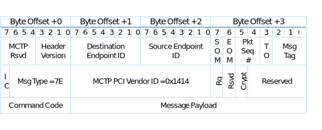
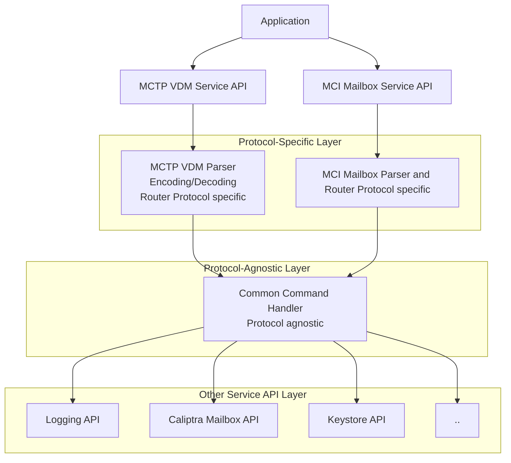

# External MCTP VDM Commands Spec

## Overview

This document specifies the external command protocol used by the Baseboard Management Controller (BMC) to communicate with the device integrating the Caliptra RoT subsystem for querying device-specific information, retrieving debug logs and attestation logs, managing certificates and secure debug unlock etc. The protocol is based on the MCTP (Management Component Transport Protocol) over the I3C interface and uses a vendor-defined message type (`0x7E`).

- **Device Identification and Capabilities**
    - Retrieve firmware versions, unique device identifiers, and device capabilities to ensure compatibility and proper configuration.
    - Query device-specific information such as chip identifiers or subsystem details.

- **Debugging and Diagnostics**
    - Retrieve debug logs to analyze device behavior, diagnose issues, and monitor runtime states.
    - Clear logs to reset diagnostic data and maintain storage efficiency.

- **Certificate Management**
    - Export Certificate Signing Requests (CSRs) for device keys to facilitate secure provisioning.
    - Import signed certificates to establish a trusted certificate chain for device authentication.

- **Debug Unlock Mechanisms**
    - Facilitate secure debugging in production environments
    - Ensure controlled access to debugging features

### Protocol

- **Transport Layer**: MCTP
- **Message Type**: The message type is `0x7E` as per the MCTP Base Specification. This message type supports Vendor Defined Messages, where the vendor is identified by the PCI-based Vendor ID. The initial message header is specified in the MCTP Base Specification and detailed below for completeness:

| Field Name                  | Byte(s) | Description                                                             |
|-----------------------------|---------|-------------------------------------------------------------------------|
| **Request Data**            |         |                                                                         |
| PCI/PCIe Vendor ID          | 1:2     | The MCTP Vendor ID formatted per `00h` Vendor ID format offset.         |
| Vendor-Defined Message Body | 3:N     | Vendor-defined message body, 0 to N bytes.                              |
| **Response Data**           |         |                                                                         |
| PCI/PCIe Vendor ID          | 1:2     | The value is formatted per `00h` Vendor ID offset.                      |
| Vendor-Defined Message Body | 3:M     | Vendor-defined message body, 0 to M bytes.                              |

The Vendor ID is a 16-bit unsigned integer, described in the PCI 2.3 specification. The value identifies the device manufacturer. The message body and content are described in the sections below.

### Message Format

This section describes the MCTP message format used to support Caliptra subsystem external command protocol. The request/response message body encapsulates the Vendor Defined MCTP message within the MCTP transport. Details of MCTP message encapsulation can be found in the MCTP Base Specification. The MCTP Get Vendor Defined Message Support command allows discovery of the vendor-defined messages supported by an endpoint. This discovery process identifies the vendor organization and the supported message types. The format of this request is specified in the MCTP Base Specification.

For the Caliptra external command protocol, the following information is returned in response to the MCTP Get Vendor Defined Message Support request:
- **Vendor ID Format**: `0`
- **PCI Vendor ID**: `0x1414`
- **Command Set Version**: `4`

The following table provides detailed descriptions of the fields used in the Caliptra external command protocol:

| Field Name           | Description                                                                                                   |
|----------------------|---------------------------------------------------------------------------------------------------------------|
| **IC**               | (MCTP Integrity Check bit) Indicates whether the MCTP message is covered by an overall MCTP message payload integrity check. |
| **Message Type**     | Indicates an MCTP Vendor Defined Message.                                                                     |
| **MCTP PCI Vendor**  | ID for PCI Vendor. Caliptra messages use the Microsoft PCI ID of `0x1414`.                                    |
| **Request Type**     | Distinguishes between request and response messages: set to `1` for requests, and `0` for responses. |
| **Crypt**            | Indicates whether the Message Payload and Command are encrypted.                                              |
| **Command Code**     | The command ID for the operation to execute.                                                                  |
| **Msg Integrity Check** | Represents the optional presence of a message type-specific integrity check over the contents of the message body. If present (indicated by the IC bit), the Message Integrity Check field is carried in the last bytes of the message body. |

The following table describes the MCTP message format used in the Caliptra external command protocol:

*Table: MCTP Vendor Defined Message Format*


The protocol header fields are to be included only in the first packet of a multiple-packet MCTP message. After reconstruction of the message body, the protocol header will be used to interpret the message contents. Reserved fields must be set to `0`.

## Command List

The following table describes the commands defined under this specification. There are two categories: (1) Required commands (R) that are mandatory for all implementations, (2) Optional commands (O) that may be utilized if the specific implementation requires it.

| Message Name                  | Command | R/O | Description                                         |
|-------------------------------|---------|-----|-----------------------------------------------------|
| Firmware Version              | 01h     | R   | Retrieve firmware version information.              |
| Device Capabilities           | 02h     | R   | Retrieve device capabilities.                       |
| Device ID                     | 03h     | R   | Retrieve device ID.                                 |
| Device Information            | 04h     | R   | Retrieve device information.                        |
| Export CSR                    | 05h     | R   | Export CSR for device keys.                         |
| Import Certificate            | 06h     | R   | Import CA-signed certificate.                       |
| Get Certificate State         | 07h     | R   | Check the state of the signed certificate chain.    |
| Get Log                       | 08h     | R   | Retrieve debug log or attestation log.              |
| Clear Log                     | 09h     | R   | Clear log information.                              |
| Request Debug Unlock          | 0Ah     | O   | Request debug unlock in production environment.     |
| Authorize Debug Unlock Token  | 0Bh     | O   | Send debug unlock token to device for authorization. |

### Command Format

This section defines the structure of the `Message Payload` field, as referenced in the "MCTP Vendor Defined Message Format" table for each command's request and response messages.

#### Firmware Version

Retrieves the version of the target firmware.

**Request Payload**:

| Byte(s) | Name        | Type | Description                                                                 |
|---------|-------------|------|-----------------------------------------------------------------------------|
| 0:3     | area_index  | u32  | Area Index: <br>- `00h` = Caliptra core firmware <br>- `01h` = MCU runtime firmware <br>- `02h` = SoC firmware <br>Additional indexes are firmware-specific |

**Response Payload**:

| Byte(s) | Name            | Type    | Description                                   |
|---------|-----------------|---------|-----------------------------------------------|
| 0:3     | completion_code | u32     | Command completion status                     |
| 4:35    | version         | u8[32]  | Firmware Version Number in ASCII format       |

#### Device Capabilities

**Request Payload**: Empty

**Response Payload**:

| Byte(s) | Name            | Type    | Description                                   |
|---------|-----------------|---------|-----------------------------------------------|
| 0:3     | completion_code | u32     | Command completion status                     |
| 4:35    | caps            | u8[32]  | Device Capabilities: <br>- Bytes [0:7]: Reserved for Caliptra RT <br>- Bytes [8:11]: Reserved for Caliptra FMC <br>- Bytes [12:15]: Reserved for Caliptra ROM <br>- Bytes [16:23]: Reserved for MCU RT <br>- Bytes [24:27]: Reserved for MCU ROM <br>- Bytes [28:31]: Reserved |

#### Device ID

This command retrieves the device ID. The request for this command contains no additional payload.

**Request Payload**: Empty

**Response Payload**:

| Byte(s) | Name                | Type | Description                |
|---------|---------------------|------|----------------------------|
| 0:3     | completion_code     | u32  | Command completion status  |
| 4:5     | vendor_id           | u16  | Vendor ID; LSB             |
| 6:7     | device_id           | u16  | Device ID; LSB             |
| 8:9     | subsystem_vendor_id | u16  | Subsystem Vendor ID; LSB   |
| 10:11   | subsystem_id        | u16  | Subsystem ID; LSB          |

#### Device Information

This command retrieves information about the target device.

**Request Payload**:

| Byte(s) | Name       | Type | Description |
|---------|------------|------|-------------|
| 0:3     | info_index | u32  | Information Index: <br>- `00h` = Unique Chip Identifier <br>Additional indexes are firmware-specific |

**Response Payload**:

| Byte(s) | Name            | Type         | Description                                   |
|---------|-----------------|--------------|-----------------------------------------------|
| 0:3     | completion_code | u32          | Command completion status                     |
| 4:7     | data_size       | u32          | Size of the requested data in bytes           |
| 8:N     | data            | u8[data_size]| Requested information in binary format        |

#### Export CSR

Exports the IDEVID Self-Signed Certificate Signing Request.

**Request Payload**:

| Byte(s) | Name  | Type | Description |
|---------|-------|------|-------------|
| 0:3     | index | u32  | Index: Default = `0` <br>- `00h` = IDEVID ECC CSR <br>- `01h` = IDEVID MLDSA CSR |

**Response Payload**:

| Byte(s) | Name            | Type         | Description                                   |
|---------|-----------------|--------------|-----------------------------------------------|
| 0:3     | completion_code | u32          | Command completion status                     |
| 4:7     | data_size       | u32          | Length in bytes of the valid data in the data field |
| 8:N     | data            | u8[data_size]| DER-encoded IDevID certificate signing request|

#### Import Certificate

Allows SoC to import DER-encoded IDevId certificate on every boot. The IDevId certificate is added to the start of the certificate chain.

**Request Payload**:

| Byte(s) | Name         | Type        | Description                                 |
|---------|--------------|-------------|---------------------------------------------|
| 0:3     | cert_size    | u32         | Size of the DER-encoded IDevID certificate. |
| 4:N     | cert         | u8[cert_size]| DER-encoded certificate                    |

**Response Payload**:

| Byte(s) | Name            | Type | Description                |
|---------|-----------------|------|----------------------------|
| 0:3     | completion_code | u32  | Command completion status  |

#### Get Certificate State

Determines the state of the certificate chain for signed certificates that have been sent to the device. The request for this command contains no additional payload.

**Request Payload**: Empty

**Response Payload**:

| Byte(s) | Name            | Type | Description                |
|---------|-----------------|------|----------------------------|
| 0:3     | completion_code | u32  | Command completion status  |
| 4:7     | state           | u32  | State: <br>- `0` = A valid chain has been provisioned. <br>- `1` = A valid chain has not been provisioned. <br>- `2` = The stored chain is being validated. |
| 8:11    | error_details   | u32  | Error details if chain validation has failed. |

#### Get Log

Retrieves the internal log for the RoT. There are two types of logs available: the Debug Log, which contains RoT application information and machine state and the Attestation Measurement Log, which is similar to the TCG log.

*Table: log types*

| Log Type | Description          |
|----------|----------------------|
| 0        | Debug Log            |
| 1        | Attestation Log      |

**Request Payload**:

| Byte(s) | Name     | Type | Description |
|---------|----------|------|-------------|
| 0:3     | log_type | u32  | Type of log to retrieve <br>- `0` = Debug Log <br>- `1` = Attestation Log |

**Response Payload**:

| Byte(s) | Name            | Type         | Description                                   |
|---------|-----------------|--------------|-----------------------------------------------|
| 0:3     | completion_code | u32          | Command completion status                     |
| 4:7     | data_size       | u32          | Size of the log data in bytes                 |
| 8:N     | data            | u8[data_size]| Log contents                                  |

The length is determined by the end of the log or the packet size based on device capabilities. If the response spans multiple MCTP messages, the end of the response will be determined by an MCTP message with a payload smaller than the maximum payload supported by both devices. To guarantee a response will never fall exactly on the max payload boundary, the responder must send back an extra packet with zero payload.

**Debug Log Format**:

The debug log reported by the device has no specified format, as this can vary between different devices and is not necessary for attestation. It is expected that diagnostic utilities for the device will be able to understand the exposed log information. A recommended entry format is provided here:

| Offset     | Description                              |
|------------|------------------------------------------|
| 1:7        | Log Entry Header                        |
| 8:9        | Format of the entry (e.g., `1` for current format) |
| 10         | Severity of the entry                   |
| 11         | Identifier for the component that generated the message |
| 12         | Identifier for the entry message        |
| 13:16      | Message-specific argument               |
| 17:20      | Message-specific argument               |

#### Clear Log

Clears the log in the RoT subsystem.

**Request Payload**:

| Byte(s) | Name     | Type | Description |
|---------|----------|------|-------------|
| 0:3     | log_type | u32  | Log Type: <br>- `0` = Debug Log <br>- `1` = Attestation Log |

**Response Payload**:

| Byte(s) | Name            | Type | Description                |
|---------|-----------------|------|----------------------------|
| 0:3     | completion_code | u32  | Command completion status  |


#### Request Debug Unlock

Requests debug unlock in production environment.

**Request Payload**:

| Byte(s) | Name         | Type    | Description                                 |
|---------|--------------|---------|---------------------------------------------|
| 0:3     | length       | u32     | Length of the message in DWORDs             |
| 4       | unlock_level | u8      | Debug unlock level (1-8)                    |
| 5:7     | reserved     | u8[3]   | Reserved field                              |

**Response Payload**:

| Byte(s) | Name                    | Type      | Description                                         |
|---------|-------------------------|-----------|-----------------------------------------------------|
| 0:3     | completion_code         | u32       | Command completion status                           |
| 4:7     | length                  | u32       | Length of the message in DWORDs                     |
| 8:39    | unique_device_identifier| u8[32]    | Device identifier of the Caliptra device            |
| 40:87   | challenge               | u8[48]    | Random number challenge                             |

#### Authorize Debug Unlock Token

Authorizes the debug unlock token.

**Request Payload**:

| Byte(s)   | Name                     | Type         | Description                                                                 |
|-----------|--------------------------|--------------|-----------------------------------------------------------------------------|
| 0:3       | length                   | u32          | Length of the message in DWORDs                                             |
| 4:35      | unique_device_identifier | u8[32]       | Device identifier of the Caliptra device                                    |
| 36        | unlock_level             | u8           | Debug unlock level (1-8)                                                    |
| 37:39     | reserved                 | u8[3]        | Reserved field                                                              |
| 40:87     | challenge                | u8[48]       | Random number challenge                                                     |
| 88:183    | ecc_public_key           | u32[24]      | ECC public key in hardware format (little endian)                           |
| 184:2635  | mldsa_public_key         | u32[648]     | MLDSA public key in hardware format (little endian)                         |
| 2636:2731 | ecc_signature            | u32[24]      | ECC P-384 signature of the message hashed using SHA2-384 (R and S coordinates) |
| 2732:6195 | mldsa_signature          | u32[1157]    | MLDSA signature of the message hashed using SHA2-512 (4627 bytes + 1 reserved byte) |

**Response Payload**:

| Byte(s) | Name            | Type | Description                |
|---------|-----------------|------|----------------------------|
| 0:3     | completion_code | u32  | Command completion status  |

## Unified Handling of Overlapping MCTP VDM External Commands and MCI Mailbox Commands
The Caliptra MCU firmware supports two command interfaces - MCTP VDM external commands and MCI Mailbox commands - which provide overlapping functionality but are accessed via different transport protocols.

*Table: Overlapping Commands Between MCTP VDM External Commands and MCI Mailbox Commands*
| **MCTP VDM Command Name**         | **MCI Mailbox Command Name**           | **Description**                                         |
|-----------------------------------|----------------------------------------|---------------------------------------------------------|
| Firmware Version                  | MC_FIRMWARE_VERSION                    | Retrieves the version of the firmware.                  |
| Device Capabilities               | MC_DEVICE_CAPABILITIES                 | Retrieves device capabilities.                          |
| Device ID                         | MC_DEVICE_ID                           | Retrieves the device ID.                                |
| Device Information                | MC_DEVICE_INFO                         | Retrieves device information.                           |
| Export CSR                        | MC_EXPORT_IDEV_CSR                     | Exports the IDEVID CSR.                                 |
| Import Certificate                | MC_IMPORT_IDEV_CERT                    | Imports the IDevID certificate.                         |
| Get Log                           | MC_GET_LOG                             | Retrieves the internal log.                             |
| Clear Log                         | MC_CLEAR_LOG                           | Clears the log in the RoT subsystem.                    |
| Request Debug Unlock              | MC_PRODUCTION_DEBUG_UNLOCK_REQ         | Requests debug unlock in a production environment.       |
| Authorize Debug Unlock Token      | MC_PRODUCTION_DEBUG_UNLOCK_TOKEN       | Sends the debug unlock token.                           |

To ensure consistent command behavior and maximize code reuse, we define a protocol-agnostic command handler trait with unified command IDs and input/output types. Both MCTP VDM and MCI mailbox frontends parse their protocol, map to the unified command and call the same backend handler, ensuring code reuse and consistent behavior.



```Rust
/// A trait for handling protocol-agnostic commands asynchronously.
///
/// Implementors of this trait can process commands identified by [`UnifiedCommandId`],
/// using the provided input and output buffers, and return a [`Result`] indicating
/// success or a [`CommandError`].
#[async_trait]
pub trait UnifiedCommandHandler {
    /// Handles a unified command asynchronously.
    ///
    /// # Arguments
    ///
    /// * `command` - The identifier of the command to handle.
    /// * `input` - The input data and protocol information for the command.
    /// * `output` - The output buffer and protocol information for the command response.
    ///
    /// # Returns
    ///
    /// * `Ok(())` if the command was handled successfully.
    /// * `Err(CommandError)` if an error occurred during command handling.
    async fn handle_command<'a>(
        &self,
        command: UnifiedCommandId,
        input: CommandInput<'a>,
        output: CommandOutput<'a>,
    ) -> Result<(), CommandError>;
}

/// Adapter for handling MCTP VDM protocol commands using a UnifiedCommandHandler.
///
/// This struct parses MCTP VDM messages, maps them to unified commands, and delegates
/// handling to the provided UnifiedCommandHandler implementation. The same buffer is
/// used for both request and response payloads.
pub struct MctpVdmAdapter<H: UnifiedCommandHandler + Send + Sync> {
    handler: H,
}

impl<H: UnifiedCommandHandler + Send + Sync> MctpVdmAdapter<H> {
    /// Creates a new MctpVdmAdapter with the given unified command handler.
    pub fn new(handler: H) -> Self {
        Self { handler }
    }

    /// Handles an incoming MCTP VDM message asynchronously.
    ///
    /// Parses the message, maps it to a UnifiedCommandId, and invokes the handler.
    /// The same buffer is used for both request and response.
    /// Returns the response length or an error.
    pub async fn handle_vdm_message<'a>(
        &self,
        buf: &'a mut [u8],
        req_len: usize,
    ) -> Result<usize, CommandError> {
    }
}

/// Identifiers for all supported unified commands.
///
/// Each variant represents a distinct command that can be handled by a [`UnifiedCommandHandler`].
#[derive(Debug, Clone, Copy, PartialEq, Eq, Hash)]
pub enum UnifiedCommandId {
    /// Query the firmware version.
    FirmwareVersion,
    /// Query the device capabilities.
    DeviceCapabilities,
    /// Query the device ID.
    DeviceId,
    /// Query device information.
    DeviceInformation,
    /// Export a Certificate Signing Request (CSR).
    ExportCsr,
    /// Import a certificate.
    ImportCertificate,
    /// Query the state of a certificate.
    GetCertificateState,
    /// Retrieve device logs.
    GetLog,
    /// Clear device logs.
    ClearLog,
    // ... add more as needed
}

/// Input data and protocol information for a unified command.
///
/// The input buffer is provided as a byte slice, along with the protocol used.
pub struct CommandInput<'a> {
    /// Input data buffer.
    pub data: &'a [u8],
    /// Protocol used for the command.
    pub protocol: CommandProtocol,
}

/// Output data and protocol information for a unified command.
///
/// The output buffer is provided as a mutable byte slice, along with the protocol used
/// and the length of the valid output data.
pub struct CommandOutput<'a> {
    /// Output data buffer.
    pub data: &'a mut [u8],
    /// Protocol used for the command.
    pub protocol: CommandProtocol,
    /// Length of valid data written to the output buffer.
    pub len: usize,
}

/// Supported protocols for unified commands.
///
/// Indicates the protocol over which the command is received or sent.
#[derive(Debug, Clone, Copy)]
pub enum CommandProtocol {
    /// Management Component Transport Protocol (MCTP).
    Mctp,
    /// Management Controller Interface Mailbox (MCI MBX).
    MciMbx,
}

/// Errors that can occur during unified command handling.
///
/// Used as the error type in [`UnifiedCommandHandler::handle_command`].
#[derive(Debug)]
pub enum CommandError {
    /// The command is not recognized or supported.
    InvalidCommand,
    /// The input data is invalid or malformed.
    InvalidInput,
    /// An internal error occurred during command handling.
    InternalError,
    /// The command is not supported in the current context.
    NotSupported,
    /// The handler is busy and cannot process the command at this time.
    Busy,
    // Protocol-specific errors can be added here
}
```