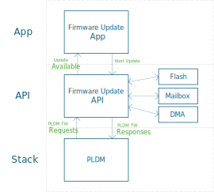
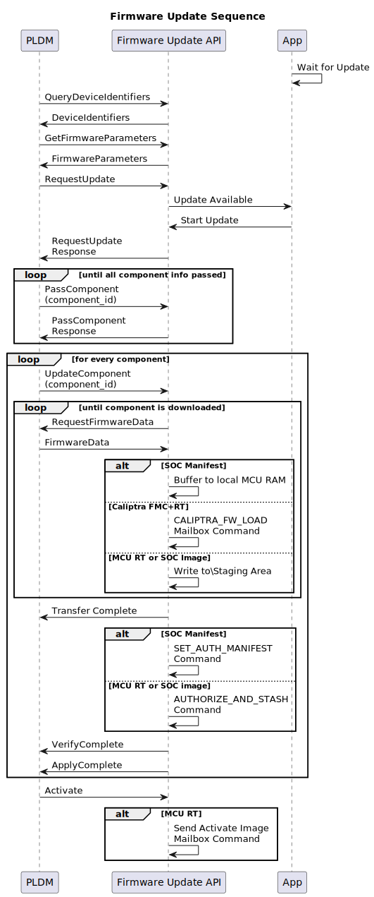

# Firmware Update

## Overview

The MCU SDK provides an API that allows for updating the firmware of Caliptra FMC & RT, MCU RT and other SOC Images through PLDM.

## Architecture

The PLDM stack forwards all Firmware Update Messages (PLDM T5) to the Firmware Update API. The API handles these messages and generates responses back to the PLDM stack.

The API will notify the application if a firmware update is available. The application will indicate to the API when to start the firmware update.

The Firmware Update API works with other APIs to complete the firmware update.

    

## PLDM Firmware Download Sequence

<!--
https://www.plantuml.com/plantuml/svg/VL5TRzem57tthxZgqwQfVu27gbw0DH8fMHA6D255jyaDikGudktGzT_F7c4OHlj0G3ddtFF1etLetDXBveIJ14jX-bSq11lTeYCewTT8gY76jEU9HcXK3kxorJox0xGGVbn2rnTudWPc-BuaSgsFWDQCCV-yV_2F6MnHEEW6CnrWmS93UJg3xoEPjpaTH4DfIyg9Jf2np6Ft3u4sW__1MF-Dt2bUZWPxSbVo6sYiBy8QrXs31TqK-LJrW4BYYwJGPfAKOT-943jTdDgfWgmUb2N6v31e67ry2IWbD4Fl0L8EXEe6q6WjjN6ctBz9JgIT-lHFK8lsS-HuIOmSIRKGJ2Vhi3mT_CvdwyXkQlA-OPm_ocwX7LwL7B2bziOCfztdw31sktYFqa6vJY139Jel2dSctjUnwyY06toJ1YLaoGOAdZ6IbY11ARGp2Cii-L9KaIpXgpIl2bulj_LgpUSxbQ6GByDly0LxLEtnmDzh5VXXWdtQuvwY8riZ77dhdIeTxeNQ0pU4BEmQRHjrhWmg6-A65IKvOXzLAnTLpJVLKvtnvtIvAAkT-Y2Sk0eNbEiY_Rce-VEyBYjUFftr8LuSx0SPqRsTKqKGrrgUaNEjwB_YZHC7T1JAJAdY6a5peXmtlB6s_ppwnzZBFm00
-->

## Steps

Note: Actions below are performed by MCU RT Firmware.

1. PLDM initiates firmware update through a RequestUpdate Message. The firmware update API ("API") notifies the app that an update is available
2. App indicates to the API that it is ready for firmware update and PLDM sends a RequestUpdate response.
3. PLDM and API discovers the firmware components to be exchanged through a series of PassComponent messages.
4. PLDM indicates which component to update using UpdateComponent message.
5. API will download the component by issuing RequestFirmwareData.
6. PLDM responds with the firmware chunk through the RequestFirmwareData response.
7. API stores the chunk
   1. If the Image is SOC Manifest, it is buffered into a local MCU RAM
   2. If the image is Caliptra MCU RT, it is sent directly to Caliptra Mailbox using the CALIPTRA_FW_UPLOAD command
   3. If the image is a MCU RT or SOC Image, it is written to a flash staging area. The staging area should be defined in the SOC Manifest
8. Once the firmware is downloaded, the MCU RT verifies the image
   1. If the image is a SOC Manifest, it is authorized using the SET_AUTH_MANIFEST Command
   2. If the image is MCU RT or SOC Image, the AUTHORIZE_AND_STASH command is used to authorize the image.
9. Steps 4-8 are repeated until all components are donwloaded
10. PLDM sends activate command and MCU will forward this to Caliptra through a mailbox command

(Open Questions):

1. How is the image transfered to the load address from the staging area
