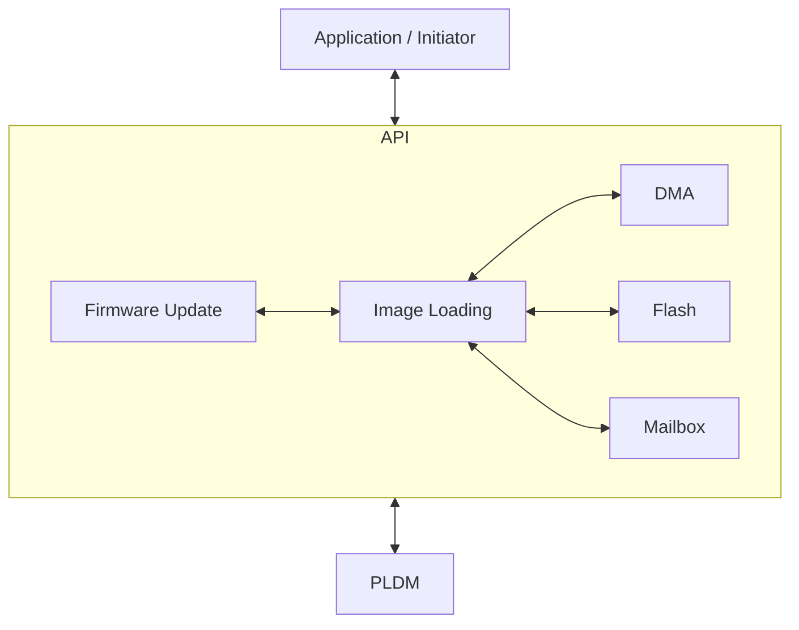
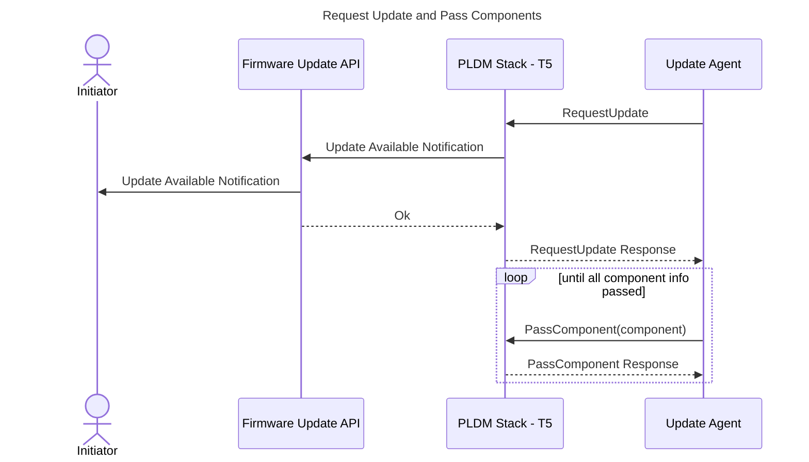
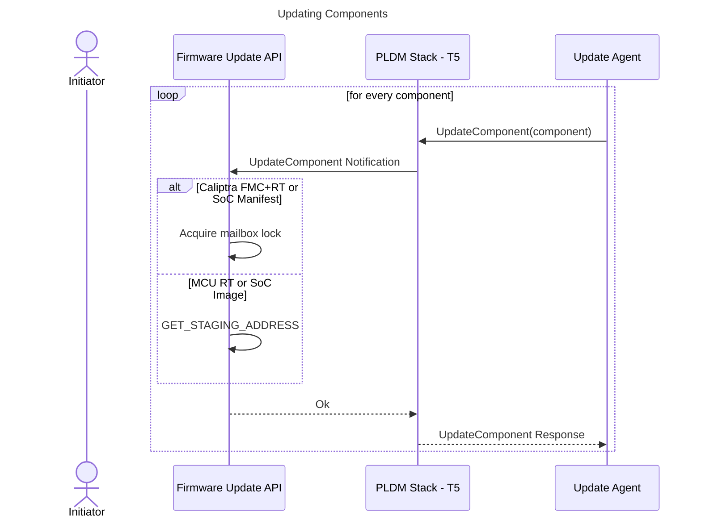
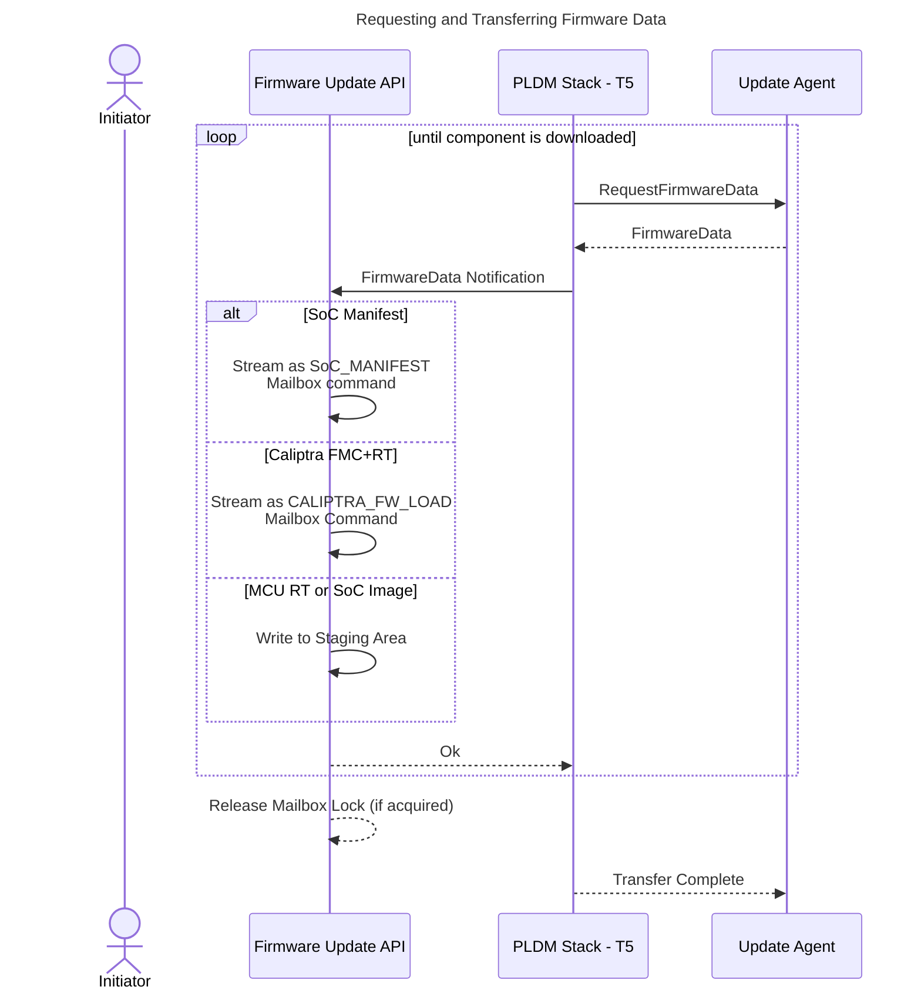
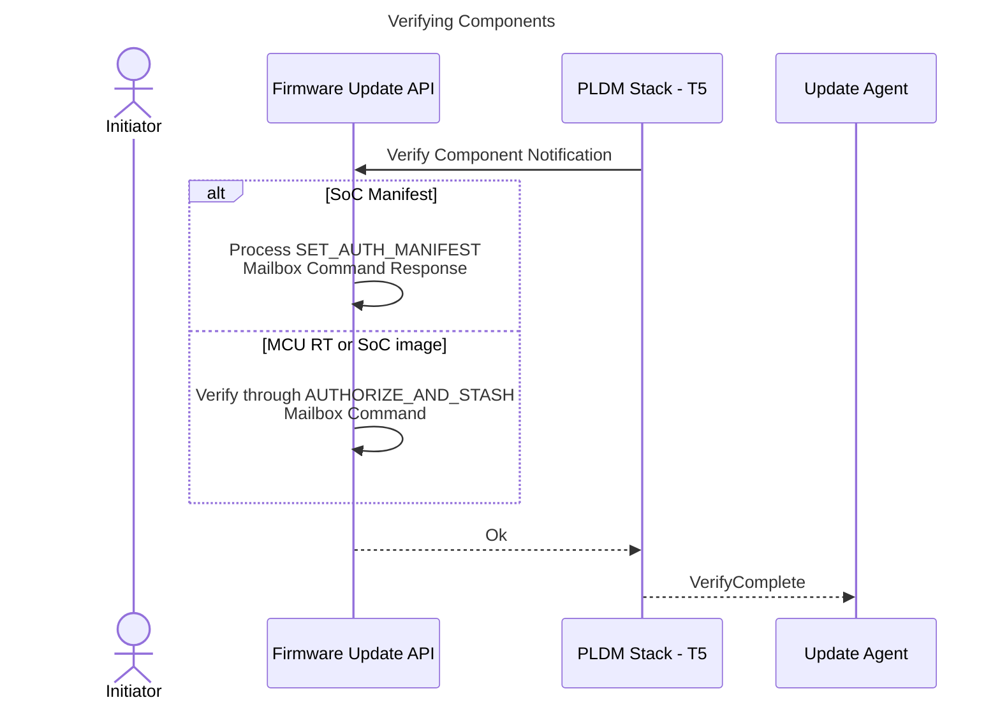
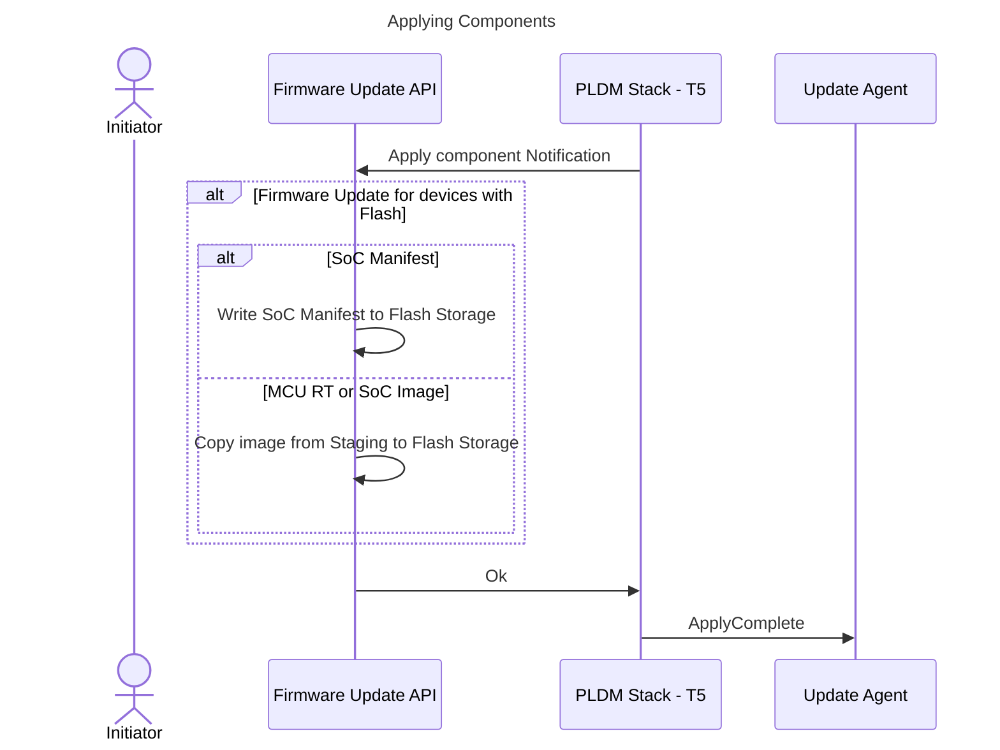
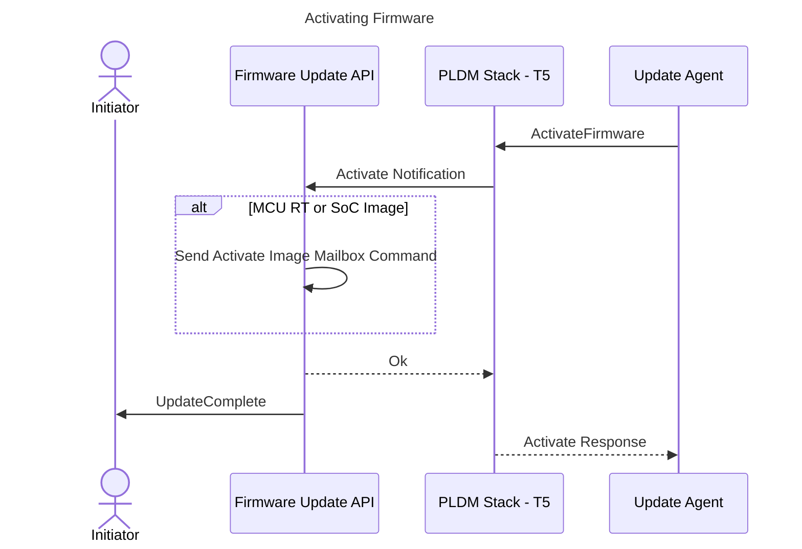

# Firmware Update

## Overview

The MCU SDK offers a comprehensive API designed to facilitate firmware updates for Caliptra FMC & RT, MCU RT, and other SoC images. These updates are performed using the PLDM - T5 protocol and are supported for both streaming boot systems and flash boot systems.

## Architecture

The MCU PLDM stack handles PLDM firmware messages from an external Firmware Update Agent. The stack generates upstream notifications to the Firmware Update API to handle application-specific actions such as writing firmware chunks to a staging or SPI Flash storage location, verifying components, etc through the Image Loading API. The API notifies the application of the start and completion of the firmware update process.



## PLDM Firmware Download Sequence

The diagram below shows the steps and interactions between different software layers during the firmware update process.


### **Query Device Information**


### **Request Update and Pass Components**



### **Updating Components**



### **Requesting and Transferring Firmware Data**



### **Verifying Components**



### **Applying Components**



### **Activating Firmware**



## Firmware Update Flow

### Full image update for flash boot system

**Option 1: Updating the full flash image as a single PLDM firmware component**

PLDM update packages natively support selecting applicable components using the `ApplicableComponents` bitfield in the package header. For the case of `Component N + 1`, it is treated as a single component by the PLDM Update Agent. Actually, this component encapsulates multiple embedded images, each with its corresponding image information entry, checksum and flash header. The structure and layout of `Component N + 1` align with the flash layout definition in [flash_layout.md](https://github.com/chipsalliance/caliptra-mcu-sw/blob/main/docs/src/flash_layout.md).


| PLDM FW Update Package                                |
| ----------------------------------------------------- |
| Package Header Information                            |
| Firmware Dev ID Descriptors                           |
| Downstream Dev ID Descriptors                         |
| Component Image Information                           |
| Package Header Checksum                               |
| Package Payload Checksum                              |
| Component 1 (Caliptra FMC + RT)                       |
| Component 2 (SoC Manifest)                            |
| Component 3 (MCU RT)                                  |
| Component 4 (SoC Image 1)                             |
| ...                                                   |
| Component N (SoC Image N-3)                           |
| **Component N + 1 (Full image for flash-boot system)**|


| Component N + 1 structure      |
| ------------------------------ |
| Flash header
| Checksum
| Image Info (Caliptra FMC + RT) |
| Image Info (SoC Manifest)      |
| Image Info (MCU RT)            |
| Image Info (SoC Image 1)       |
| ...                            |
| Image Info (SoC Image N - 3)   |
| Caliptra FMC + RT              |
| SoC Manifest                   |
| MCU RT                         |
| SoC Image 1                    |
| ...                            |
| SoC Image N - 3                |

To support full image update, a SoC-defined staging memory should be provided to store the incoming payload. For enhanced security, it is recommended to include this staging memory configuration as part of the authenticated SoC manifest.

Ideally, the staging memory should be accessible by the Caliptra DMA engine to read and hash the image directly. If the staging memory (e.g., a staging partition on flash) does not meet this requirement, the MCU would need to perform the cryptographic operations to calculate the hash and then send a mailbox command for authorization. However, this approach is not recommended due to potential security and performance concerns.

**Detailed steps**:
*Note: Actions below are performed by MCU RT Firmware*

1. An initiator, such as a custom user application, starts the firmware update service through the Firmware Update API. This action initializes the responder loop in the PLDM stack, enabling it to listen for incoming PLDM messages from the PLDM agent. The API queries firmware component metadata from the Caliptra core (e.g., component version numbers, classifications, etc.) using a mailbox command. This metadata is used to construct the Device Identifiers and Firmware Parameters, as specified in the DMTF DSP0267 1.3.0 standard. *(**TBD**: Confirm if the mailbox command can provide metadata for the full image.)*
2. The PLDM stack notifies the API when a firmware image becomes available for update.
3. The PLDM stack notifies the API which component is being downloaded using the UpdateComponent notification. The staging memory address is retrieved from the SoC Manifest stored in the Caliptra core using a mailbox command.
4. The PLDM stack sends a FirmwareData notification to the API for each received firmware chunk, including the data, size, and chunk offset. The API's download handler writes the received firmware data to the staging memory.
5. Once all firmware chunks are downloaded, the PLDM stack notifies the API to verify the component. The API parses the component to identify individual embedded images, referred to as subcomponents:
    - For the Caliptra FMC + RT subcomponent, the MCU sends it to the Caliptra core using the `CALIPTRA_FW_UPLOAD` mailbox command.
    - For the SoC Manifest subcomponent, the MCU sends it to the Caliptra core using the `SET_AUTH_MANIFEST` mailbox command. The mailbox response confirms the authenticity and correctness of the manifest.
    - For MCU RT or SoC Image subcomponents, the MCU sends the `AUTHORIZE_AND_STASH` mailbox command, indicating that the image to be verified resides in the staging area.
6. After verification, the PLDM stack notifies the API to apply the image. The MCU writes the images from the temporary staging area to the active flash partition.
7. When the Update Agent issues the `ActivateFirmware` command, the API may provide a handler to initiate a soft reset, enabling the new image to execute from flash.

**Option 2: Updating the full flash image as multiple PLDM firmware components**

In this approach, the full flash image is divided into 1 to N distinct firmware components. The `ApplicableComponents` bitfield in the PLDM package header identifies the selected components, while the component image information provides metadata for each component, including the total number of components. The PLDM Update Agent requests update on each component sequentially, adhering to the order specified in the component image information. Each component is verified and applied by the device. PLDM Update Agent issues `ActivateFirmware` command to inform the device to prepare all successfully applied components to become active at the next activation.

| PLDM FW Update Package                                |
| ----------------------------------------------------- |
| Package Header Information                            |
| Firmware Dev ID Descriptors                           |
| Downstream Dev ID Descriptors                         |
| Component Image Information                           |
| Package Header Checksum                               |
| Package Payload Checksum                              |
| **Component 1 (Caliptra FMC + RT)**                   |
| **Component 2 (SoC Manifest)**                        |
| **Component 3 (MCU RT)**                              |
| **Component 4 (SoC Image 1)**                         |
| ...                                                   |
| **Component N (SoC Image N-3)**                       |
| Component N + 1 (Full image for flash-boot system)    |

**Detailed steps:**

*Note: Actions below are performed by MCU RT Firmware*

1. An initiator, such as a custom user application, starts the firmware update service through the Firmware Update API. This action initializes the responder loop in the PLDM stack, enabling it to listen for incoming PLDM messages from the PLDM agent. The API queries firmware component metadata from the Caliptra core (e.g., component version numbers, classifications, etc.) using a mailbox command. This metadata is used to construct the Device Identifiers and Firmware Parameters, as specified in the DMTF DSP0267 1.3.0 standard. (**TBD**: Confirm if the mailbox command can provide metadata for the full image.)
2. The PLDM stack notifies the API when a firmware image becomes available for update.
3. The PLDM stack notifies the API which component is being downloaded using the UpdateComponent notification. The staging memory address is retrieved from the SoC Manifest stored in the Caliptra core using a mailbox command.
    The 1st firmware component received to update should be Caliptra FMC + RT.
4. The PLDM stack sends a FirmwareData notification to the API for each received firmware chunk, including the data, size, and chunk offset. The API's download handler writes the received firmware data to the staging memory.
5. Once all firmware chunks are downloaded, the PLDM stack notifies the API to verify the component.
    - If the component is Caliptra FMC+RT, MCU sends it to Caliptra core using the CALIPTRA_FW_UPLOAD mailbox command.
    - If the component is a SoC Manifest,  the mailbox via the SET_AUTH_MANIFEST mailbox command.
    - If the component is an MCU RT or SoC Image, it is written to a staging area determined in step 3.
6. After verification, the PLDM stack notifies the API to apply the image. The MCU writes the images from the temporary staging area to the active flash partition.
7. Repeat step 3-6 for Component 2, 3, 4 .. N
8. After all firmware components have been transferred and applied, Update Agent issues `ActivateFirmware` command to inform the device to prepare all successfully applied components to become active at the next activation. The API may provide a handler to initiate a soft reset, enabling the new image to execute from flash.

### Partial firmware update

Below are the supported scenarios:
1. **Caliptra Core Firmware Update**
    - Updates the Caliptra FMC + Caliptra RT component. (Component 1 in PLDM package)

2. **MCU Runtime Firmware Update**
    - Updates the SoC Manifest and MCU RT firmware together.(Component 2 and Component 3 in PLDM package)
    - The updated SoC Manifest includes the hash entry for the new MCU RT firmware.

3. **SoC Firmware Update**
    - Updates the SoC Manifest along with associated SoC images. (Component 2, Component 4.. N in PLDM package)
    - The updated SoC Manifest contains hash entries for the new SoC firmware components.

These scenarios are designed to maintain system integrity and ensure seamless updates for both streaming boot system and flash boot system.

**Detailed steps:**

**Note:** Actions below are performed by MCU RT Firmware.

1. An initiator (such as a custom user application) starts the firmware service through the Firmware Update API. This will start the responder loop in the PLDM stack that will listen for PLDM messages coming from the PLDM agent. The API queries firmware component metadata from the Caliptra core (e.g., component version numbers, classification, etc.) using a mailbox command to construct the Device Identifiers and Firmware Parameters, as defined by the DMTF DSP0267 1.3.0 specification, needed by the PLDM stack.
2. The PLDM stack notifies the API if a firmware image is available for update.
3. The PLDM stack notifies the API which component is being downloaded using the UpdateComponent notification. If the image is an MCU RT or SoC Image, the staging address is retrieved from the SoC Manifest stored in the Caliptra Core using a mailbox command.
    For Caliptra FMC+RT and the SoC Manifest, if it is flash boot system, staging address should be provided. Otherwise,the mailbox lock is acquired since these images are streamed directly through the mailbox interface. The lock is released after all chunks of the image have been transferred.
4. The PLDM stack sends a FirmwareData notification to the API for each received firmware chunk, including the data, size, and chunk offset.
   1. If the component is a SoC Manifest, it is streamed to the mailbox via the SET_AUTH_MANIFEST mailbox command.If it is flash boot system, it is also written to staging area.
   2. If the component is Caliptra FMC+RT,it is streamed to the Caliptra core using the CALIPTRA_FW_UPLOAD mailbox command. If it is flash boto system, it is also written to staging area.
   3. If the component is an MCU RT or SoC Image, it is written to a staging area determined in step 3.
5. Once all firmware chunks are downloaded, the PLDM stack notifies the API to verify the component.
   1. If the component is a SoC Manifest, the MCU waits for the SET_AUTH_MANIFEST mailbox command response, which indicates the authenticity and correctness of the manifest.
   2. If the component is an MCU RT or SoC Image, the MCU sends the AUTHORIZE_AND_STASH command, indicating that the image to be verified is in the staging area.
   **Note:** The AUTHORIZE_AND_STASH command computes the SHA of the image via the SHA-Acc by streaming the image from the staging area to the SHA-Acc through DMA. The computed SHA is compared against the SHA in the SoC Manifest for the specific image.
6. After verification, the PLDM stack notifies the API to apply the image. The MCU writes the images to SPI Flash storage from the temporary staging area (if flash is available on the device).
7. When the Update Agent sends the `ActivateFirmware` command, the API sends an `ActivateImage` mailbox command to the Caliptra core. The Caliptra core processes the activation according to the [Caliptra specification](https://github.com/chipsalliance/Caliptra/blob/main/doc/Caliptra.md#subsystem-support-for-hitless-updates).

## Interfaces

```rust
pub trait FirmwareUpdateApi {

    /// Start the firmware update service.
    ///
    /// # Returns
    /// Returns a future that will remain unset until the service is stopped.
    /// Ok(()) - The service has been terminated successfully.
    /// Err(FirmwareUpdateError) - The service has been terminated with an error.
    async fn start_service(&self) -> Result<(), FirmwareUpdateError>;

    /// Stop the firmware update service.
    ///
    /// # Returns
    /// Ok() - The service has been terminated successfully.
    /// Err(ErrorCode) - The service can not be stopped.
    fn stop_service(&self) -> Result<(), ErrorCode>;

    /// Register a callback to be called when a firmware update event occurs.
    ///
    /// # Arguments
    /// callback - The callback to be called when a firmware update event occurs.
    fn register_callback(&self, callback: FirmwareUpdateCallback);


}

/// Define the callback function signature for firmware update events.
/// Returns Ok(()) if the notification is handled successfully, otherwise an error code.
pub type FirmwareUpdateCallback = fn(FirmwareUpdateNotification) -> Result<(),ErrorCode>;

pub enum FirmwareUpdateNotification<'a>{
    // Firmware Update is available and ready for download.
    UpdateAvailable,

    // Firmware Update is complete.
    UpdateComplete,

    // Firmware Update is canceled.
    UpdateCanceled,

}
```