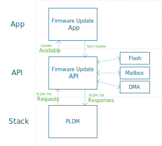
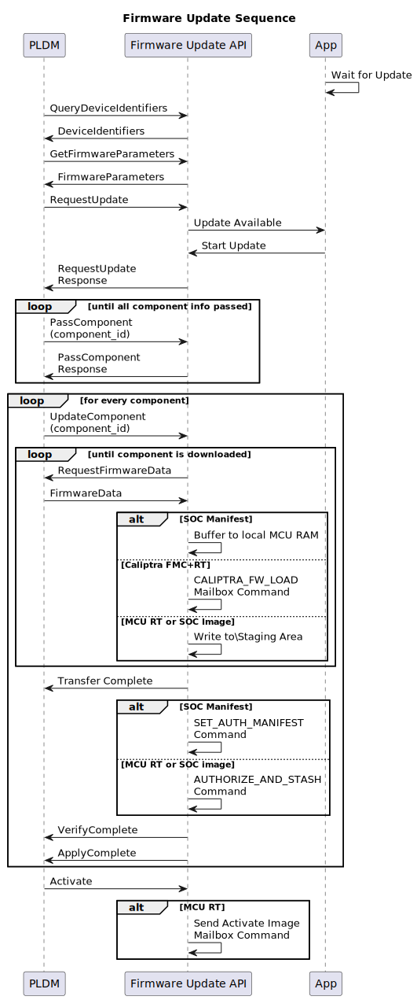

# Firmware Update

## Overview

The MCU SDK provides an API that allows for updating the firmware of Caliptra FMC & RT, MCU RT and other SOC Images through PLDM - T5.

## Architecture

The MCU PLDM stack handles the PLDM firmware messages from an external Firmware Update Agent. The stack will generate upstream notifications to the Firmware Update API to handle application specific actions such as writing firmware chunks to a staging or permanent storage location, verifying components, etc. The API notifies the application of the start and completion of the firmware update process.



## PLDM Firmware Download Sequence

<!---
https://www.plantuml.com/plantuml/svg/ZLLFJ_iu4BtdKumuxMfLSTeB1qH8_n2fVxfDMAHLf6fe9iN2iREEMvPlltRJkC7vXO9Ke9xnctdlpIGFjKQb3oKFDDESOCfK-O6AuBdAKHFSGg8LOSd47Xwbr93GlmSIEmg2obnaErQXq71pJW_t9FGDO0th-NZnDSMU63JSlSC8qZzjbYltDTDl8bp7jvc8IzmJp2NcjXbpPX7ito30dPOARcB1D4FpRnEfgY08pE_HlKcwiwMLTXKpSGPFI1sPuMDoHlTjz6gsgSYEzi0n22o_Bi9V1rAVOxBfSKv2iuAHgeCsONHlBzn1BwEFD2FTVbcZmfBqhu3wANsaZNMlrWqPXz08vDG-8kFuoWtffRGzxL0pAHg1Z9nN4pqbL-zUgruRcTXGNKbH6msvb1KSZ18SaFDCx6Hf8YHq9fWe95HOrvJtQAtDSNH9_SrT-zqlxQUwqYHoiDNFFHHI0HsDWU2mlAgj35VhMctzN4ynyuDS-yjtEbj4po0L9Ai8JWjmji5YpYRfDad3MRoSRSFnU3D9aamiZ2UlyZ_RTeaY3yX-U4tU7bliGT3vAXnVGJIVwpxtML-SxbhTTRc6N7u8BZ6dV6XkskCnQkovqWtwBdHZu3amu84JQe625QPuHwl7Gr6G0Ys1ontoarURSD7e7I5dbLO8qqNqnoRjN8l2URnED-5s-dAI-Y9nr4fi01gqTCZy5yKqcTAPI3JkhQsX8coCkUvt7-VqO8KmpnNLTOCWzHkf6eJKTXdb1pdl-zPVzgTdMgfGr5OdEmUSZAQ-BN-JOiKdk3dnhFd6WSHCQ_YSFcqNuJAUJf8q4zzeo3pkzkPg4_ypsORBiLsbvEbo_wSptZG_o2siAkuU8XwrWQNtsFfUTOFMk2d7-itOBPLXzvFHYMJrsMW1XP8bj0FKnnhUT7FI2c0PNlYxEUWjPdX-PROddb8ktfFe2ft4b7INcwYtKOD3wx_I70lFv0RUUrSz6Cn3oVy7
--->

The diagram below shows the steps and interaction between the different software layers as the firmware update process is performed. Since firmware update has lots of common steps with streaming boot, the actions taken for streaming boot are also included.

The corresponding API will be used depending on the initiator's purpose (i.e. for firmware updates, use the FirmwareUpdate API and for streaming boot use ImageLoading API).

Note: For streaming boot, only SOC images are allowed to be downloaded.



## Firmware Update Steps

Note: Actions below are performed by MCU RT Firmware.

1. An Initiator (such as custom user application) starts the firmware service througn the Firmware Update API ("API"). The initiator should provide the appropriate DeviceIdentifies and FirmwareParameters as defined by DMTF DSP0267 1.3.0 specification.
2. API will be notified by PLDM stack if firmware image is available for update.
3. API will be notified by PLDM stack which component is being downloaded using the UpdateComponent Notification. If the image is MCU RT or SOC Image, then the staging address will be retrieved from the SOC Manifest stored in the Caliptra Core using a mailbox command.
4. FirmwareData notification will be notified by the PLDM stack to the API for every chunk of firmware received. This includes the data, size and the chunk offset.
   1. If the component is a SOC Manifest, it is stored temporarily in a local buffer
   2. If the component is Caliptra FMC+RT, it is uploaded to Caliptra core using CALIPTRA_FW_UPLOAD command
   3. If the component is MCU RT or SOC Image, it is written to a staging area determined in step 3
5. Once all firmware chunks are downloaded, the PLDM stack will notify the API to verify the component
   1. If the component is a SOC Manifest, the MCU will send a SET_AUTH_MANIFEST mailbox command that contains the downloaded manifest to the Caliptra Core. The mailbox command response will indicate the authenticity and correctness of the manifest
   2. If the component is a MCU RT or SOC Image, the MCU will send the AUTHORIZE_AND_STASH command with an indication that the image to be verified is in the staging area.
6. After verification, PLDM Stack will notify API to apply the image. MCU will write the images to permanent storage from the temporary or staging area.
7. When Update Agent sends the 'ActivateFirmware' command, the API will get a notification and prompts it to send an 'ActivateImage' mailbox command to the Caliptra core. Actions taken by the Caliptra core are described in [the main Caliptra specification.](https://github.com/chipsalliance/Caliptra/blob/main/doc/Caliptra.md#subsystem-support-for-hitless-updates)

## Interfaces

```
pub trait FirmwareUpdateApi {

    /// Start the firmware update service.
    /// 
    /// # Arguments
    /// device_identifier - The PLDM device identifier to be used.
    /// parameters - The PLDM firmware update parameters to be used.
    /// 
    /// # Returns
    /// Returns a future that will remain unset until the service is stopped.
    /// Ok(()) - The service has been terminated successfully.
    /// Err(FirmwareUpdateError) - The service has been terminated with an error.
    async fn start_service(&self, device_identifier: DeviceIdentifiers, parameters: FirmwareParameters) -> Result<(), FirmwareUpdateError>;

    /// Stop the firmware update service.
    /// 
    /// # Returns
    /// Ok() - The service has been terminated successfully.
    /// Err(ErrorCode) - The service can not be stopped.
    fn stop_service(&self) -> Result<(), ErrorCode>;

    /// Register a callback to be called when a firmware update event occurs.
    /// 
    /// # Arguments
    /// callback - The callback to be called when a firmware update event occurs.
    fn register_callback(&self, callback: FirmwareUpdateCallback);


}

/// Define the callback function signature for firmware update events.
/// Returns Ok(()) if the notification is handled successfully, otherwise an error code.
pub type FirmwareUpdateCallback = fn(FirmwareUpdateNotification) -> Result<(),ErrorCode>;

pub enum FirmwareUpdateNotification<'a>{
    // Firmware Update is available and ready for download.
    UpdateAvailable,

    // Firmware Update is complete.
    UpdateComplete,

    // Firmware Update is cancelled.
    UpdateCancelled,

}
```

# Streaming Boot

The purpose of the streaming boot service is to stream and load firmware images from the PLDM update agent (e.g. BMC) to the custom SOC components. This process should be started after the recovery flow for the MCU RT firmware.

Streaming Boot uses the [Image Loading API](./image_loading.md).

## Streaming Boot Steps

Refer to the sequence diagram in the PLDM Firmware Download Sequence section above.

Note that these steps are performed by MCU RT.

1. After MCU RT boots up and while the SOC Components are held on reset, the main process responsible for the recovery flow starts the firmware service througn the Image Loading API ("API"). It should provide the appropriate DeviceIdentifies and FirmwareParameters as defined by DMTF DSP0267 1.3.0 specification. For Streaming Boot, the FirmwareParameters should only contain the components for the SOC Images. Streaming Boot API will ignore non-SOC Image components.
2. API will be notified by PLDM stack if firmware image is available for update (i.e. streaming boot).
3. API will be notified by PLDM stack which component is being downloaded using the UpdateComponent Notification. If the image is not a SOC Image, an error code should be returned to the Stack. If the component is a SOC Image, then the load address will be retrieved from the SOC Manifest stored in the Caliptra Core using a mailbox command.
4. FirmwareData notification will be notified by the PLDM stack to the API for every chunk of firmware received. This includies the data,size and the chunk offset. The chunk will be written to the load address determined from step 3.
5. Once all firmware chunks are downloaded, the PLDM stack will notify the API to verify the component the MCU will send the AUTHORIZE_AND_STASH command with an indication that the image to be verified is in the load area.
6. After verification, PLDM Stack will notify API to apply the image. Since there is no need to copy the image to another location, there are no actions for the MCU, and should return OK to the stack.
7. When Update Agent sends the 'ActivateFirmware' command, the API will relinquish control back to the initiator. SOC specific logic will be applied to handle the download image.
