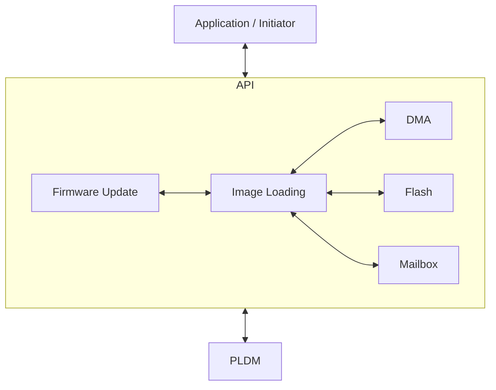
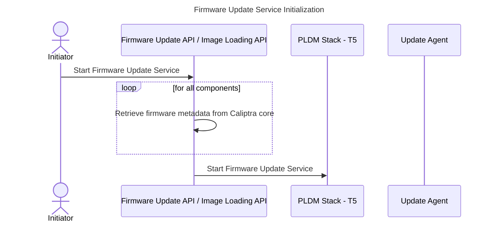
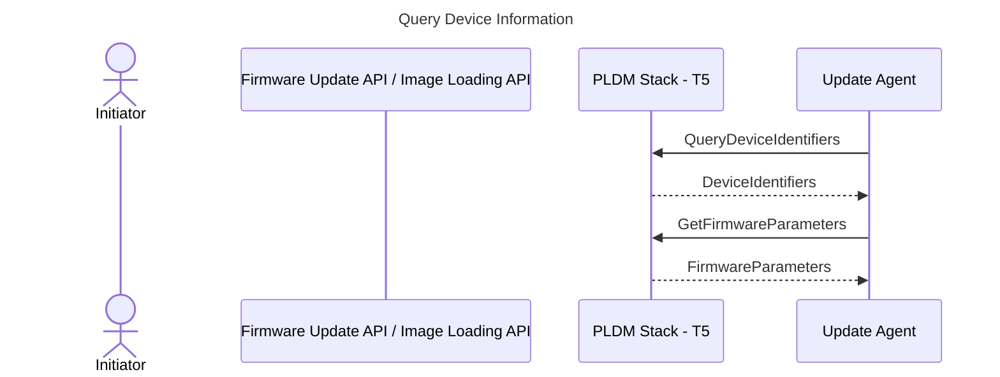
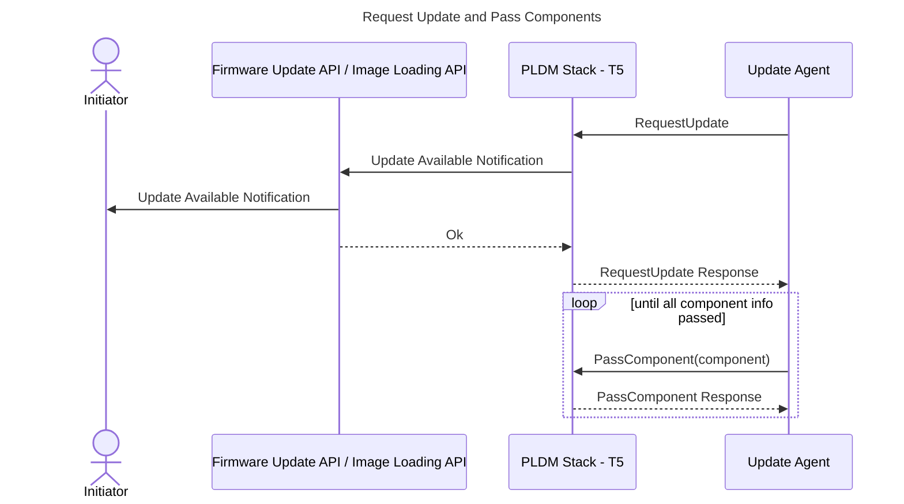
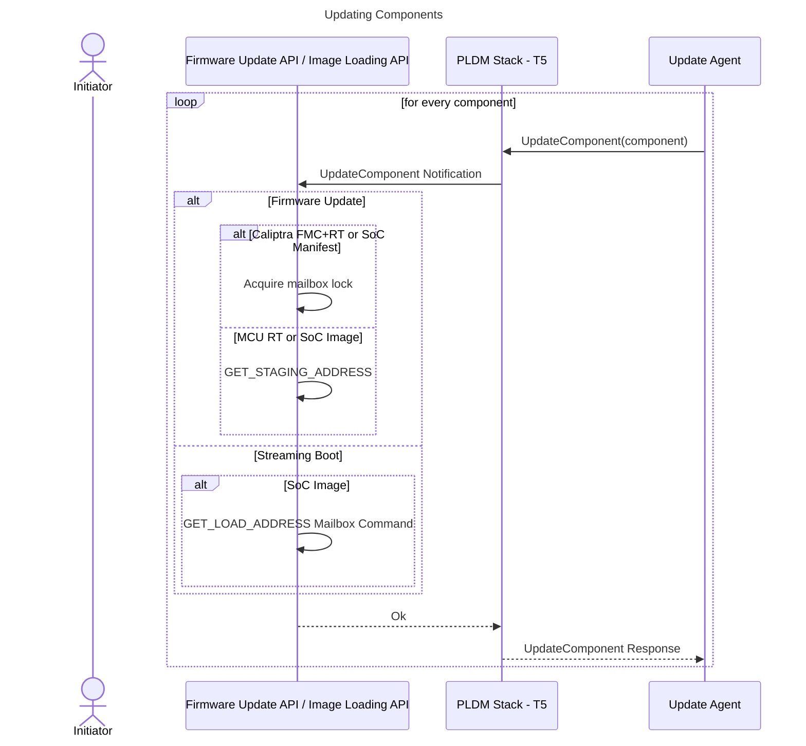
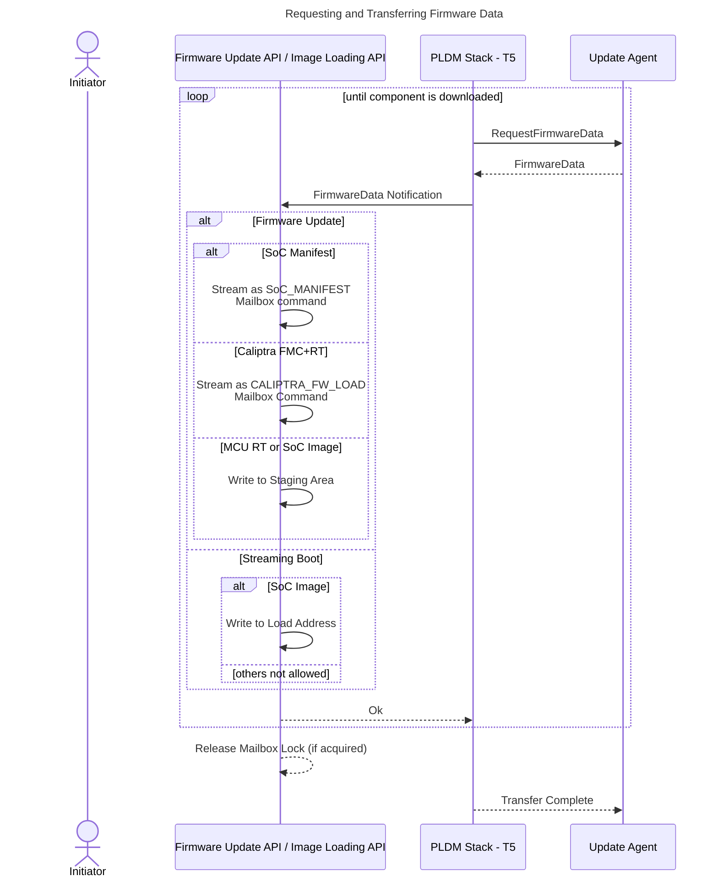
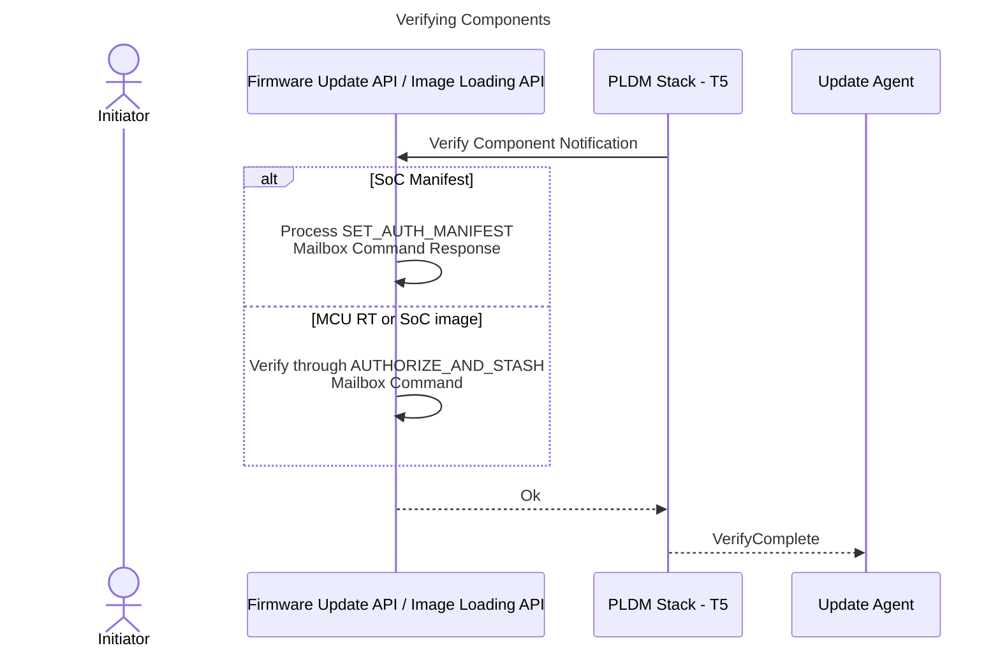
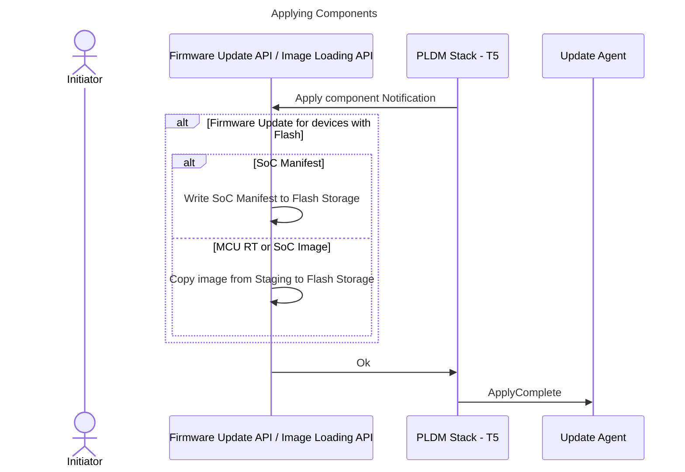
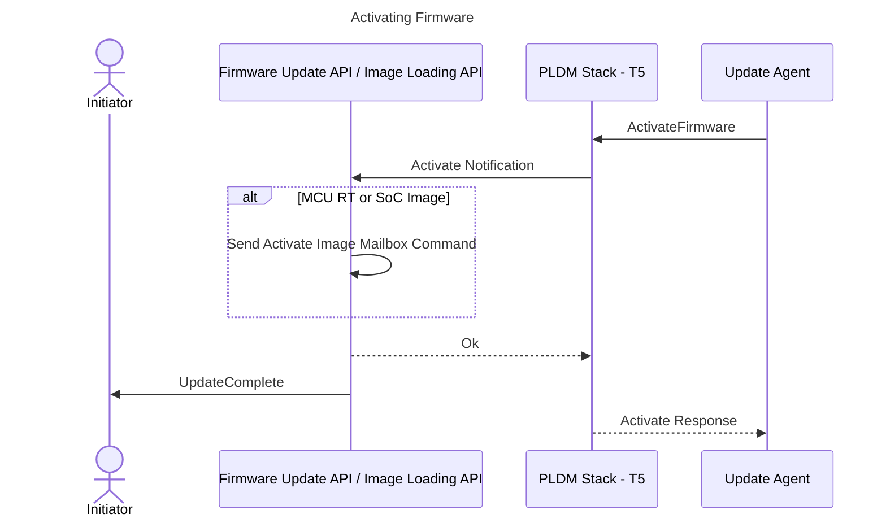

# Firmware Update

## Overview

The MCU SDK provides an API that allows for updating the firmware of Caliptra FMC & RT, MCU RT, and other SoC images through PLDM - T5.

## Architecture

The MCU PLDM stack handles PLDM firmware messages from an external Firmware Update Agent. The stack generates upstream notifications to the Firmware Update API to handle application-specific actions such as writing firmware chunks to a staging or SPI Flash storage location, verifying components, etc. The API notifies the application of the start and completion of the firmware update process.



## PLDM Firmware Download Sequence

The diagram below shows the steps and interactions between different software layers during the firmware update process. Since firmware updates share many steps with streaming boot, the actions taken for streaming boot are also included.

The corresponding API will be used depending on the initiator's purpose (i.e., for firmware updates, use the Firmware Update API, and for streaming boot, use the Image Loading API).

**Note:** For streaming boot, only SoC images are allowed to be downloaded.



### **Query Device Information**



### **Request Update and Pass Components**



### **Updating Components**



### **Requesting and Transferring Firmware Data**



### **Verifying Components**



### **Applying Components**



### **Activating Firmware**



## Firmware Update Steps

**Note:** Actions below are performed by MCU RT Firmware.

1. An initiator (such as a custom user application) starts the firmware service through the Firmware Update API. The API queries firmware component metadata from the Caliptra core (e.g., component version numbers, classification, etc.) using a mailbox command to construct the Device Identifiers and Firmware Parameters, as defined by the DMTF DSP0267 1.3.0 specification, needed by the PLDM stack.
2. The PLDM stack notifies the API if a firmware image is available for update.
3. The PLDM stack notifies the API which component is being downloaded using the UpdateComponent notification. If the image is an MCU RT or SoC Image, the staging address is retrieved from the SoC Manifest stored in the Caliptra Core using a mailbox command. For Caliptra FMC+RT and the SoC Manifest, the mailbox lock is acquired since these images are streamed directly through the mailbox interface. The lock is released after all chunks of the image have been transferred.
4. The PLDM stack sends a FirmwareData notification to the API for each received firmware chunk, including the data, size, and chunk offset.
   1. If the component is a SoC Manifest, it is streamed to the mailbox via the SET_AUTH_MANIFEST mailbox command.
   2. If the component is Caliptra FMC+RT, it is streamed to the Caliptra core using the CALIPTRA_FW_UPLOAD mailbox command.
   3. If the component is an MCU RT or SoC Image, it is written to a staging area determined in step 3.
5. Once all firmware chunks are downloaded, the PLDM stack notifies the API to verify the component.
   1. If the component is a SoC Manifest, the MCU waits for the SET_AUTH_MANIFEST mailbox command response, which indicates the authenticity and correctness of the manifest.
   2. If the component is an MCU RT or SoC Image, the MCU sends the AUTHORIZE_AND_STASH command, indicating that the image to be verified is in the staging area.
   **Note:** The AUTHORIZE_AND_STASH command computes the SHA of the image via the SHA-Acc by streaming the image from the staging area to the SHA-Acc through DMA. The computed SHA is compared against the SHA in the SoC Manifest for the specific image.
6. After verification, the PLDM stack notifies the API to apply the image. The MCU writes the images to SPI Flash storage from the temporary staging area (if flash is available on the device).
7. When the Update Agent sends the `ActivateFirmware` command, the API sends an `ActivateImage` mailbox command to the Caliptra core. The Caliptra core processes the activation according to the [Caliptra specification](https://github.com/chipsalliance/Caliptra/blob/main/doc/Caliptra.md#subsystem-support-for-hitless-updates).

## Interfaces

```rust
pub trait FirmwareUpdateApi {

    /// Start the firmware update service.
    /// 
    /// # Returns
    /// Returns a future that will remain unset until the service is stopped.
    /// Ok(()) - The service has been terminated successfully.
    /// Err(FirmwareUpdateError) - The service has been terminated with an error.
    async fn start_service(&self) -> Result<(), FirmwareUpdateError>;

    /// Stop the firmware update service.
    /// 
    /// # Returns
    /// Ok() - The service has been terminated successfully.
    /// Err(ErrorCode) - The service can not be stopped.
    fn stop_service(&self) -> Result<(), ErrorCode>;

    /// Register a callback to be called when a firmware update event occurs.
    /// 
    /// # Arguments
    /// callback - The callback to be called when a firmware update event occurs.
    fn register_callback(&self, callback: FirmwareUpdateCallback);


}

/// Define the callback function signature for firmware update events.
/// Returns Ok(()) if the notification is handled successfully, otherwise an error code.
pub type FirmwareUpdateCallback = fn(FirmwareUpdateNotification) -> Result<(),ErrorCode>;

pub enum FirmwareUpdateNotification<'a>{
    // Firmware Update is available and ready for download.
    UpdateAvailable,

    // Firmware Update is complete.
    UpdateComplete,

    // Firmware Update is canceled.
    UpdateCanceled,

}
```

# Streaming Boot

The purpose of the streaming boot service is to stream and load firmware images from the PLDM update agent (e.g. BMC) to the custom SoC components. This process should be started after the recovery flow for the MCU RT firmware.

Streaming Boot uses the [Image Loading API](./image_loading.md).

## Streaming Boot Steps

Refer to the sequence diagram in the PLDM Firmware Download Sequence section above.

Note that these steps are performed by MCU RT.

1. After MCU RT boots up and while the SoC Components are held on reset, the main process responsible for the recovery flow starts the firmware service througn the Image Loading API ("API"). MCU RT should query the information from Caliptra core needed to construct the DeviceIdentifies and FirmwareParameters messages as defined by DMTF DSP0267 1.3.0 specification. For Streaming Boot, the FirmwareParameters should only contain the components for the SoC Images. Streaming Boot API will ignore non-SoC Image components.
2. API will be notified by PLDM stack if firmware image is available for update (i.e. streaming boot).
3. API will be notified by PLDM stack which component is being downloaded using the UpdateComponent Notification. If the image is not a SoC Image, an error code should be returned to the Stack. If the component is a SoC Image, then the load address will be retrieved from the SoC Manifest stored in the Caliptra Core using a mailbox command.
4. FirmwareData notification will be notified by the PLDM stack to the API for every chunk of firmware received. This includies the data,size and the chunk offset. The chunk will be written to the load address determined from step 3.
5. Once all firmware chunks are downloaded, the PLDM stack will notify the API to verify the component the MCU will send the AUTHORIZE_AND_STASH command with an indication that the image to be verified is in the load area.
Note: The AUTHORIZE_AND_STASH command should compute the SHA of the image through the SHA-Acc by streaming the image from the load address to the SHA Acc through DMA. The computed SHA will then be compared against the SHA in the SoC Manifest for the particular image.
6. After verification, PLDM Stack will notify API to apply the image. Since there is no need to copy the image to another location, there are no actions for the MCU, and should return OK to the stack.
7. When Update Agent sends the 'ActivateFirmware' command, the API will relinquish control back to the initiator. SoC specific logic will be applied to handle the download image.
