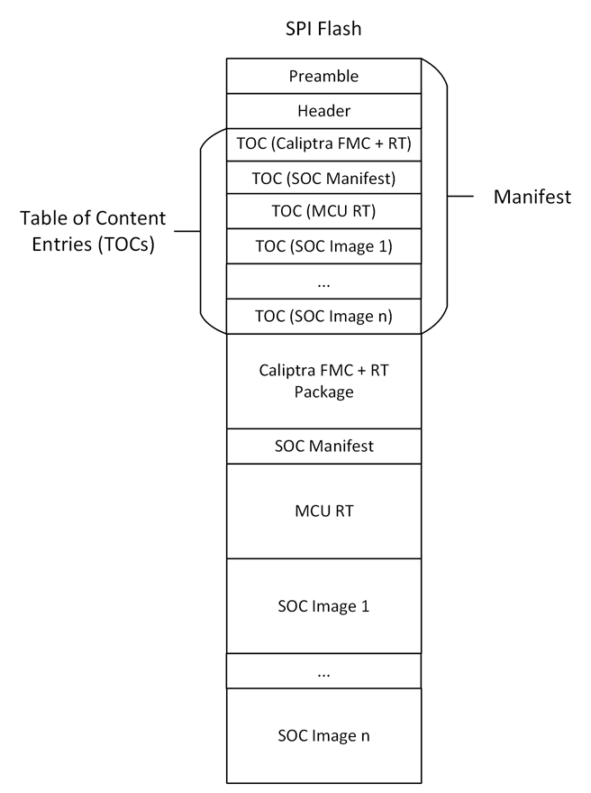

## SPI Flash Layout

The following figure describes the structure of the SPI Flash, with specific regions allocated for different firmware packages and manifest files.

### Preamble

The Preamble section (offset 0x0000_0000) contains the authorization manifest ECC and LMS public keys of the vendor and the owner. These public keys correspond to the private keys that sign the Header section of the Manifest

 *Note: All fields are little endian unless specified*

| Field                                    | Size (bytes) | Description                                                                                                                                                                                                                                                                                                                                                                                                                                                                                                                                                                                       |
| ---------------------------------------- | ------------ | ------------------------------------------------------------------------------------------------------------------------------------------------------------------------------------------------------------------------------------------------------------------------------------------------------------------------------------------------------------------------------------------------------------------------------------------------------------------------------------------------------------------------------------------------------------------------------------------------- |
| Manifest Marker                          | 4            | Magic Number marking the start of the package manifest. The value must be 0x464C5348 ('FLSH' in ASCII)                                                                                                                                                                                                                                                                                                                                                                                                                                                                                            |
| Flash Manifest Size                      | 4            | Size of the full manifest structure                                                                                                                                                                                                                                                                                                                                                                                                                                                                                                                                                               |
| Flash Manifest Type                      | 4            | **Byte0:** - Type 0x1 – ECC & LMS Keys 0x2 – ECC & MLDSA Keys **Byte1-Byte3:** Reserved                                                                                                                                                                                                                                                                                                                                                                                                                                                                              |
| Manufacturer ECC Key Descriptor          | 196          | Public Key Descriptor for ECC keys                                                                                                                                                                                                                                                                                                                                                                                                                                                                                                                                                                |
| Manufacturer LMS or MLDSA Key Descriptor | 1540         | Public Key Descriptor for LMS (1540 bytes) or MLDSA (196 bytes + 1344 unused bytes) keys                                                                                                                                                                                                                                                                                                                                                                                                                                                                                                          |
| Active ECC Key Index                     | 4            | Public Key Hash Index for the active ECC key                                                                                                                                                                                                                                                                                                                                                                                                                                                                                                                                                      |
| Active ECC Key                           | 96           | ECC P-384 public key used to verify the Flash Manifest Header Signature  **X-Coordinate:** Public Key X-Coordinate (48 bytes, big endian)   **Y-Coordinate:** Public Key Y-Coordinate (48 bytes, big endian)                                                                                                                                                                                                                                                                                                                                                                |
| Active LMS or MLDSA Key Index            | 4            | Public Key Hash Index for the active LMS or MLDSA key                                                                                                                                                                                                                                                                                                                                                                                                                                                                                                                                             |
| Active LMS or MLDSA Key                  | 2592         | LMS public key (48 bytes + 2544 unused bytes) used to verify the Flash Manifest Header Signature.  **tree_type:** LMS Algorithm Type (4 bytes, big endian) Must equal 12.   **otstype:** LM-OTS Algorithm Type (4 bytes, big endian) Must equal 7.   **id:**  (16 bytes)   **digest:**  (24 bytes)   **OR**   MLDSA-87 public key used to verify the Flash Manifest Header Signature.   (2592 bytes)                                                                                                                   |
| Manufacturer ECC Signature               | 96           | Manufacturer ECC P-384 signature of the Flash Manifest header hashed using SHA2-384.  **R-Coordinate:** Random Point (48 bytes)   **S-Coordinate:** Proof (48 bytes)                                                                                                                                                                                                                                                                                                                                                                                                        |
| Manufacturer LMS or MLDSA Signature      | 4628         | Manufacturer LMS signature (1620 bytes + 3008 unused bytes) of the Flash Manifest header hashed using SHA2-384.  **q:** Leaf of the Merkle tree where the OTS public key appears (4 bytes)   **ots:** Lmots Signature (1252 bytes)   **tree_type:** Lms Algorithm Type (4 bytes)   **tree_path:** Path through the tree from the leaf associated with the LM-OTS signature to the root. (360 bytes)   **OR**    Vendor MLDSA-87 signature of the Flash Manifest header hashed using SHA2-512 (4627 bytes + 1 Reserved byte) |
| Owner ECC Key Descriptor                 | 52           | Public Key Descriptor for ECC key                                                                                                                                                                                                                                                                                                                                                                                                                                                                                                                                                                 |
| Owner LMS or MLDSA Key Descriptor        | 52           | Public Key Descriptor for LMS or MLDSA key                                                                                                                                                                                                                                                                                                                                                                                                                                                                                                                                                        |
| Owner ECC Public Key                     | 96           | ECC P-384 public key used to verify the Flash Manifest Header Signature.  **X-Coordinate:** Public Key X-Coordinate (48 bytes)   **Y-Coordinate:** Public Key Y-Coordinate (48 bytes)                                                                                                                                                                                                                                                                                                                                                                                       |
| Owner LMS or MLDSA Public Key            | 2592         | LMS public key (48 bytes + 2544 unused bytes) used to verify the Flash Manifest Header Signature.  **tree_type:** LMS Algorithm Type (4 bytes)   **otstype:** LMS Ots Algorithm Type (4 bytes)   **id:**  (16 bytes)   **digest:**  (24 bytes)   **OR**   MLDSA-87 public key used to verify the Flash Manifest Header Signature.   (2592 bytes)                                                                                                                                                                       |
| Owner ECC Signature                      | 96           | Manufacturer ECC P-384 signature of the Flash Manifest header hashed using SHA2-384.  **R-Coordinate:** Random Point (48 bytes)   **S-Coordinate:** Proof (48 bytes)                                                                                                                                                                                                                                                                                                                                                                                                        |
| Owner LMS or MLDSA Signature             | 4628         | Owner LMS signature (1620 bytes + 3008 unused bytes) of the Flash Manifest header hashed using SHA2-384.  **q:** Leaf of the Merkle tree where the OTS public key appears (4 bytes)   **ots:** Lmots Signature (1252 bytes)   **tree_type:** Lms Algorithm Type (4 bytes)   **tree_path:** Path through the tree from the leaf associated with the LM-OTS signature to the root. (360 bytes)   **OR**    Owner MLDSA-87 signature of the Flash Manifest header hashed using SHA2-512 (4627 bytes + 1 Reserved byte)         |
| Reserved                                 | 8            | Reserved 8 bytes                                                                                                                                                                                                                                                                                                                                                                                                                                                                                                                                                                                  |

#### Public Key Descriptor

| Field                  | Size (bytes) | Description                                                                                            |
| ---------------------- | ------------ | ------------------------------------------------------------------------------------------------------ |
| Key Descriptor Version | 1            | Version of the Key Descriptor. The value must be 0x1 for Caliptra 2.x                                  |
| Intent                 | 1            | Type of the descriptor  0x1 - Vendor    0x2 - Owner                                          |
| Key Type               | 1            | Type of the key in the descriptor  0x1 - ECC    0x2 - LMS   0x3 - MLDSA                 |
| Key Hash Count         | 1            | Number of valid public key hashes                                                                      |
| Public Key Hash(es)    | 48 * n       | List of valid and invalid (if any) SHA2-384 public key hashes. ECDSA: n = 4, LMS: n = 32, MLDSA: n = 4 |

### Header

The header contains the security version and SHA2-384 hash of the table of contents. Header is the only signed component in the image. Signing the header is enough as the table of contents contains the hashes of the individual firmware images. This technique reduces the number of signature verifications.

| Field                                     | Size (bytes) | Description                                                                                                                                                                                                                                                                                                                   |
| ----------------------------------------- | ------------ | ----------------------------------------------------------------------------------------------------------------------------------------------------------------------------------------------------------------------------------------------------------------------------------------------------------------------------- |
| Revision                                  | 8            | 8-byte version of the Flash image header (Current version is 0x01)                                                                                                                                                                                                                                                            |
| Vendor ECC public key hash index          | 4            | The hint to ROM to indicate which ECC public key hash it should use to validate the active ECC public key.                                                                                                                                                                                                                    |
| Vendor LMS or MLDSA public key hash index | 4            | The hint to ROM to indicate which LMS or MLDSA public key hash it should use to validate the active public key.                                                                                                                                                                                                               |
| Flags                                     | 4            | Feature flags. **Bit0:** - Interpret the pl0_pauser field. If not set, all PAUSERs are PL1 **Bit1-Bit31:** Reserved                                                                                                                                                                                     |
| TOC Entry Count                           | 4            | Number of entries in TOC.                                                                                                                                                                                                                                                                                                     |
| PL0 PAUSER                                | 4            | The PAUSER with PL0 privileges.                                                                                                                                                                                                                                                                                               |
| TOC Digest                                | 48           | SHA2-384 Digest of table of contents.                                                                                                                                                                                                                                                                                         |
| Vendor Data                               | 40           | Vendor Data. **Not Before:** Vendor Start Date [ASN1 Time Format] For LDEV-Id certificate (15 bytes)  **Not After:** Vendor End Date [ASN1 Time Format] For LDEV-Id certificate (15 bytes) ` ` **Reserved:** (10 bytes)                                                                      |
| Owner Data                                | 40           | Owner Data. **Not Before:** Owner Start Date [ASN1 Time Format] For LDEV-Id certificate. Takes preference over vendor start date (15 bytes)   **Not After:** Owner End Date [ASN1 Time Format] For LDEV-Id certificate. Takes preference over vendor end date (15 bytes) **Reserved:** (10 bytes) |

### Table of contents (TOC)

TOC contains the image information and SHA-384 hash of the individual images.

There is one TOC entry for the following images:

1. Caliptra FMC and RT
2. SOC Manifest
3. MCU RT
4. Other SOC images (if any)

| Field              | Size (bytes) | Description                                                                                                                                                                                                        |
| ------------------ | ------------ | ------------------------------------------------------------------------------------------------------------------------------------------------------------------------------------------------------------------ |
| TOC Entry Id       | 4            | TOC Entry Id. **0x0000_0001:** Caliptra FMC and RT **0x0000_0002:** SOC Manifest **0x0000_0003:** MCU RT **0xf000_0000-0xffff_ffff:** Reserved for vendor SOC Images |
| Image Type         | 4            | Image Type that defines format of the image section **0x0000_0001:** Executable **0x0000_0002:** Non-Executable (e.g. manifest)                                                             |
| Image Revision     | 20           | Git Commit hash of the build                                                                                                                                                                                       |
| Image Version      | 4            | Firmware release number                                                                                                                                                                                            |
| Image SVN          | 4            | Security Version Number for the Image. This is used for anti-rollback support.                                                                                                                                     |
| Reserved           | 4            | Reserved field                                                                                                                                                                                                     |
| Image Load Address | 4            | Load address. Valid for executable images only.                                                                                                                                                                    |
| Image Entry Point  | 4            | Entry point to start the execution from. Valid for executable images only.                                                                                                                                        |
| Image Offset       | 4            | Offset from beginning of the image. Valid for executable images only.                                                                                                                                             |
| Image Size         | 4            | Image Size (bytes)                                                                                                                                                                                                 |
| Opaque Data        | 32           | An optional field that can be used for any additional information to be associated with the image. If no data is provided, then this should be set to all zeroes.                                             |
| Image Hash         | 48           | SHA2-384 hash of image                                                                                                                                                                                             |

### Image

The images (raw binary data) are appended after the TOCs, and should be in the same order to their corresponding TOCs.

| Field | Size (bytes) | Description   |
| ----- | ------------ | ------------- |
| Data  | N            | Image content |

The following are the valid images:

* Caliptra FMC and RT (refer to the [Caliptra Firmware Image Bundle Format](https://github.com/chipsalliance/caliptra-sw/blob/main-2.x/rom/dev/README.md#firmware-image-bundle))
* SOC Manifest (refer to the description of the [SOC Manifest](https://github.com/chipsalliance/caliptra-sw/blob/main-2.x/auth-manifest/README.md))
* MCU RT (raw binary image of the realtime MCU firmware)
* Other SOC images (if any)
