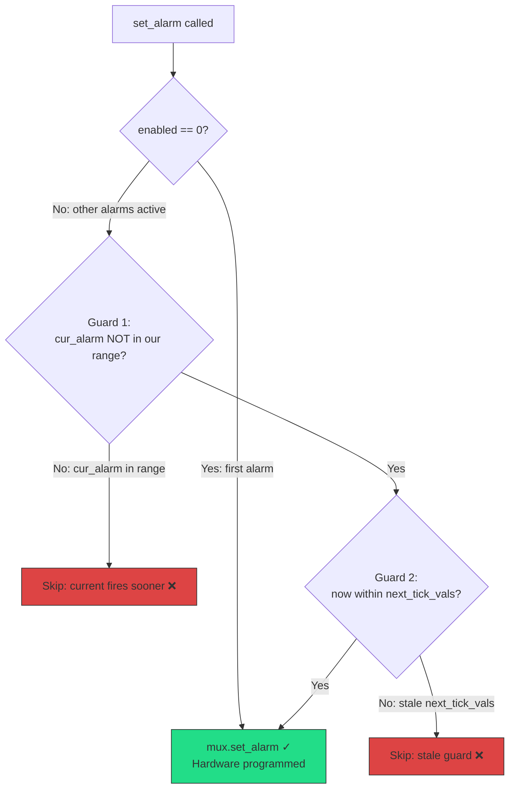

# VirtualMuxAlarm Timer Reprogramming Bug on VeeR EL2 FPGA

## Summary

The Tock OS `VirtualMuxAlarm` virtualizer has an optimization in `set_alarm()` that skips reprogramming the hardware timer when it believes an existing alarm will fire sooner. On VeeR EL2 FPGA, this optimization fails because:

1. **Stale timer state**: After a timer fires and is disabled/re-enabled, `get_alarm()` and `next_tick_vals` return stale values that incorrectly satisfy the guard conditions.
2. **`wfi` stalls the core clock**: VeeR's `wfi` instruction halts the core clock, which also stops the internal timer counter (`mitcnt0`), preventing timer expiry during kernel idle.

The combination causes mailbox polling alarms to never fire, hanging the firmware update flow.

## Affected Code

**File**: `capsules/core/src/virtualizers/virtual_alarm.rs` (Tock OS)

```rust
fn set_alarm(&self, reference: Self::Ticks, dt: Self::Ticks) {
    // ...
    if enabled == 0 {
        // First alarm → always programs hardware ✓
        self.mux.set_alarm(reference, dt);
    } else if !self.mux.firing.get() {
        let cur_alarm = self.mux.alarm.get_alarm();
        let now = self.mux.alarm.now();
        let expiration = reference.wrapping_add(dt);

        // GUARD 1: Is current hardware alarm NOT in our window?
        if !cur_alarm.within_range(reference, expiration) {
            let next = self.mux.next_tick_vals.get();

            // GUARD 2: Is now within the next_tick_vals window?
            if next.is_none_or(|(next_ref, next_dt)| {
                now.within_range(next_ref, next_ref.wrapping_add(next_dt))
            }) {
                self.mux.set_alarm(reference, dt);  // ← Only reached if BOTH guards pass
            }
        }
    }
}
```

Both guards must pass for the hardware timer to be reprogrammed. When either fails due to stale state, the timer is never programmed for the new alarm.

## How the Bug Materializes

### Scenario: Two sequential mailbox operations


### What triggers the bug

The bug requires **all three conditions** to be present simultaneously:

| Condition | Description |
|-----------|-------------|
| **Other alarms armed** | `enabled > 0` when our `set_alarm()` is called, so the "first alarm" fast path is skipped |
| **Stale `next_tick_vals`** | A previously-set alarm has expired; its `(reference, dt)` stored in `next_tick_vals` represents a past time window that `now` is no longer within |
| **Stale `get_alarm()`** | The hardware timer was disabled after the previous alarm fired (`service_interrupts()` calls `disable_timers()`); `get_alarm()` reads stale CSR values |

### Guard failure example (concrete values)

```
Timeline (20 MHz clock, ticks):

T=662,000,000: MCU_MBOX sets alarm → mitcnt0=0, mitb0=7538, enabled
               next_tick_vals = Some((662M, 7538))
               MuxAlarm programs hardware ✓

T=662,007,538: Timer fires → ISR saves interrupt
               service_interrupts() → disable_timers() → mitctl0.enable=0
               MuxAlarm::alarm() → fires MCU_MBOX callback
               MCU_MBOX re-arms → set_alarm() reprograms hardware
               next_tick_vals = Some((662M+7538, new_dt))

  ... MCU_MBOX alarm fires/re-arms several more times ...

T=680,000,000: MCU_MBOX's last alarm fires, callback doesn't re-arm
               MuxAlarm::alarm() → no remaining alarms → disarm()
               BUT: next_tick_vals may still hold the LAST set values
               Hardware timer: disabled (mitctl0.enable=0)

  ... 390 million ticks pass (user app doing PLDM transfer) ...

T=1,070,000,000: Mailbox execute() → schedule_alarm()
                 → VirtualMuxAlarm::set_alarm(now=1070M, dt=10000)
```

At T=1,070,000,000, the guard checks evaluate:

```
Guard 1: cur_alarm = get_alarm()
         Hardware is disabled, CSRs are stale:
           mitb0 = last_bound (e.g., 7538)
           mitcnt0 = some large stale value
         get_alarm() = now - stale_cnt + stale_bound = arbitrary value
         within_range(1070M, 1070M+10000)? → MAYBE passes, MAYBE fails
         If it passes → "current alarm fires earlier, keep it" → SKIP ❌

Guard 2: next_tick_vals = Some((old_ref, old_dt)) from T≈680M
         now=1070M, window=[680M, 680M+old_dt]
         1070M within [680M, 680M+old_dt]? → NO (far past the window)
         → Guard 2 FAILS → mux.set_alarm() NOT called ❌
```

**Result**: Hardware timer is never programmed. The kernel enters `wfi`, which stalls VeeR's core clock and timer counter. The alarm never fires.

## Why the first command works but the second doesn't



- **First command**: No other alarms armed → `enabled == 0` → takes the "first alarm" path → hardware always programmed ✓
- **Second command**: MCU_MBOX alarm is armed → `enabled > 0` → enters guard checks → stale state causes guards to fail → hardware NOT programmed ❌

## VeeR `wfi` amplifies the problem

Even if the hardware timer happened to be programmed for another alarm (e.g., MCU_MBOX), VeeR's `wfi` instruction stalls the core clock:

```
Normal CPU (ARM, x86):
  wfi → CPU sleeps, timer peripheral keeps counting
  Timer fires → wakes CPU → ISR runs → alarm processed ✓

VeeR EL2 FPGA:
  wfi → core clock STOPS → mitcnt0 STOPS counting
  Timer NEVER fires → wfi NEVER returns → HUNG ❌
```

This means the kernel cannot rely on `wfi` to wait for timer expiry. A spin-loop with hardware polling is required.

## Fix Applied

### 1. VirtualMuxAlarm (Tock modification — upstream bug)

Remove the `within_range` + `next_tick_vals` guards; always reprogram when `!firing`:

```rust
} else if !self.mux.firing.get() {
    // Always reprogram. The within_range optimization fails when
    // get_alarm() or next_tick_vals are stale after timer disable/re-enable.
    self.mux.set_alarm(reference, dt);
}
```

**Impact**: Other alarms that were supposed to fire "sooner" may be slightly delayed (by at most `dt` ticks). They are still caught in `MuxAlarm::alarm()`'s expired-alarm scan. For typical polling intervals (500µs), this is negligible.

### 2. Hardware timer polling (chip.rs)

Poll `has_timer0_expired()` in the kernel loop to detect timer expiry even when the ISR can't run (MIE=0):

```rust
fn service_pending_interrupts(&self) {
    loop {
        if self.timers.has_timer0_expired()
            && self.timers.get_saved_interrupts() == TimerInterrupts::None
        {
            CSR.mie.modify(mie::BIT29::CLEAR);
            self.timers.save_interrupt(0);
        }
        // ... process saved interrupts ...
    }
}

fn has_pending_interrupts(&self) -> bool {
    self.pic.get_saved_interrupts().is_some()
        || self.timers.get_saved_interrupts() != TimerInterrupts::None
        || self.timers.has_timer0_expired()
}
```

### 3. Conditional `wfi` bypass (chip.rs)

Skip `wfi` when a timer is armed to keep the counter advancing:

```rust
fn sleep(&self) {
    if self.timers.is_timer0_enabled() {
        // Spin: VeeR wfi stalls core clock and timer counter.
        // Briefly enable MIE for pending PIC interrupts.
        CSR.mstatus.read_and_set_bits(1 << 3);
        core::arch::asm!("nop");
        CSR.mstatus.read_and_clear_bits(1 << 3);
    } else {
        // No timer armed, safe to wfi for PIC interrupts.
        CSR.mstatus.read_and_set_bits(1 << 3);
        rv32i::support::wfi();
        CSR.mstatus.read_and_clear_bits(1 << 3);
    }
}
```

### 4. Supporting timer methods (timers.rs)

```rust
// get_alarm(): wrapping arithmetic so expired timers return past time
fn get_alarm(&self) -> Self::Ticks {
    let bound = self.mitb0.read(mitb0::bound) as u64;
    let counter = self.mitcnt0.get() as u64;
    let now = self.now().into_u64();
    now.wrapping_sub(counter).wrapping_add(bound).into()
}

// now(): race-free 64-bit read
fn now(&self) -> Ticks64 {
    loop {
        let hi = self.mcycleh.get() as u64;
        let lo = self.mcycle.get() as u64;
        if hi == self.mcycleh.get() as u64 { return ((hi << 32) | lo).into(); }
    }
}

// Hardware polling helpers
pub fn has_timer0_expired(&self) -> bool {
    self.mitctl0.read(mitctl0::enable) == 1
        && { let c = self.mitcnt0.get(); let b = self.mitb0.read(mitb0::bound); b > 0 && c >= b }
}
pub fn is_timer0_enabled(&self) -> bool {
    self.mitctl0.read(mitctl0::enable) == 1
}
```
