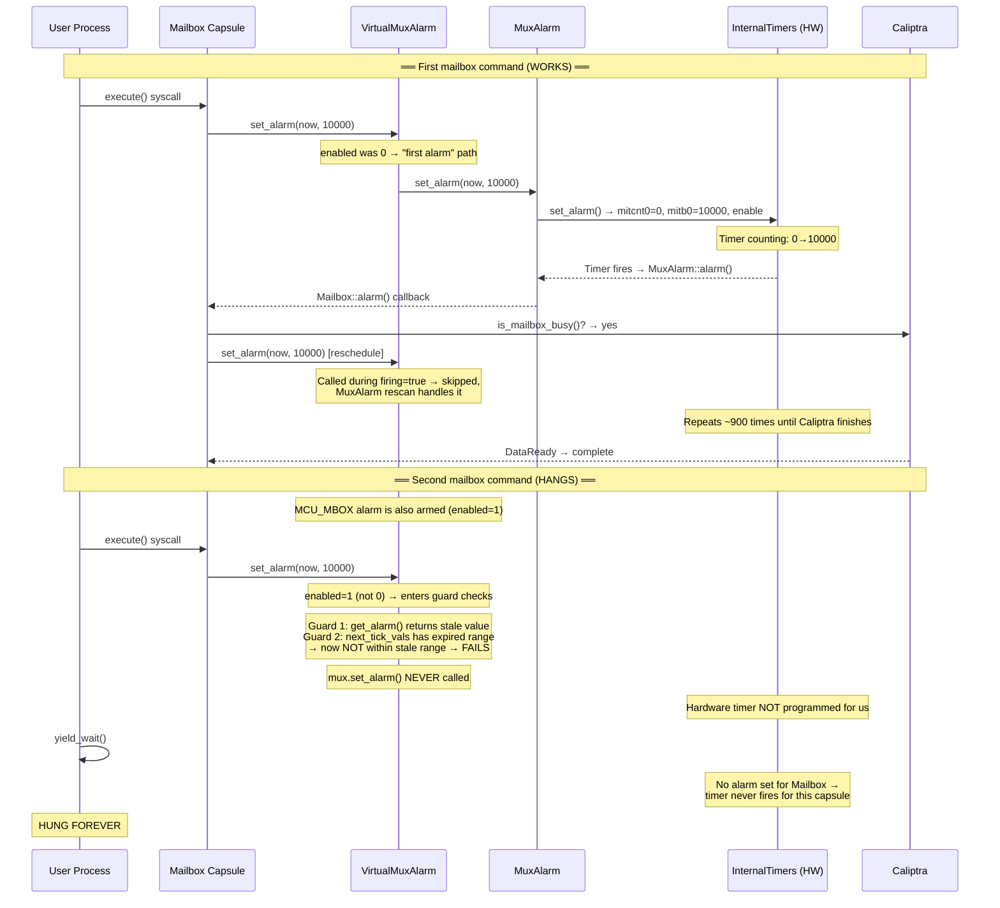
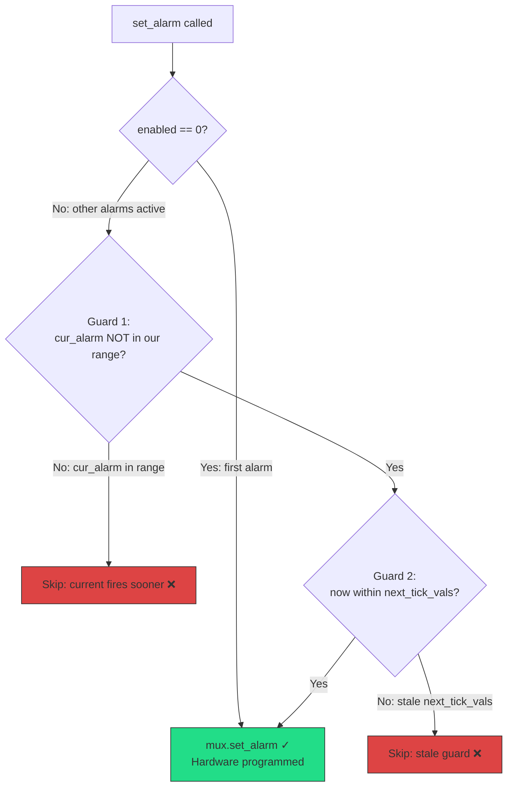

# VirtualMuxAlarm Timer Reprogramming Bug on VeeR EL2 FPGA

## Summary

The Tock OS `VirtualMuxAlarm` virtualizer has an optimization in `set_alarm()` that skips reprogramming the hardware timer when it believes an existing alarm will fire sooner. On VeeR EL2 FPGA, this optimization fails because:

1. **Stale `get_alarm()` return value**: The VeeR timer driver's `get_alarm()` computes the fire time from the current counter and bound CSRs. For an expired timer, this produces a bogus future value (essentially `now + bound`) instead of the original past fire time. Guard 1 sees this bogus value as "within our alarm range" and concludes the existing alarm will fire sooner — skipping the reprogram.
2. **Stale `next_tick_vals`**: After a timer expires but before `MuxAlarm::alarm()` processes it (which requires MIE=1), `next_tick_vals` still holds the expired alarm's `(reference, dt)`. Guard 2 sees that `now` is past that window and incorrectly concludes "don't reprogram."

Note: Testing confirmed that `wfi` does **not** stall the VeeR internal timer on this FPGA — timer interrupt (mie bit 29) correctly wakes the core from `wfi`. The root cause is purely the stale guard state when MIE=0 during kernel syscall handling.

The result is that mailbox polling alarms are never programmed into hardware, hanging the firmware update flow.

## How VirtualMuxAlarm Works

Tock OS has a single hardware timer (`InternalTimers` on VeeR). Multiple kernel capsules (Mailbox, I3C, MCU_MBOX, scheduler) all need independent alarms. VirtualMuxAlarm solves this by multiplexing:

```
                          ┌─────────────────────┐
                          │   InternalTimers     │
                          │   (single HW timer)  │
                          │   mitcnt0 / mitb0    │
                          └──────────┬───────────┘
                                     │ AlarmClient
                          ┌──────────▼───────────┐
                          │      MuxAlarm         │
                          │  (multiplexer)        │
                          │  • enabled count      │
                          │  • firing flag        │
                          │  • next_tick_vals     │
                          └──────────┬───────────┘
                   ┌─────────────────┼─────────────────┐
                   │                 │                  │
          ┌────────▼───────┐ ┌──────▼────────┐ ┌──────▼────────┐
          │VirtualMuxAlarm │ │VirtualMuxAlarm│ │VirtualMuxAlarm│
          │   #1 (Mailbox) │ │  #2 (I3C)     │ │  #3 (MCU_MBOX)│
          │  armed: bool   │ │  armed: bool  │ │  armed: bool  │
          │  ref + dt      │ │  ref + dt     │ │  ref + dt     │
          └────────┬───────┘ └──────┬────────┘ └──────┬────────┘
                   │                │                  │
          ┌────────▼───────┐ ┌──────▼────────┐ ┌──────▼────────┐
          │Mailbox Capsule │ │  I3C Driver   │ │ MCU_MBOX Drv  │
          └────────────────┘ └───────────────┘ └───────────────┘
```

### Normal flow (working case)

1. **Capsule calls `set_alarm(now, dt)`** on its VirtualMuxAlarm
2. VirtualMuxAlarm stores `{reference, dt}` and increments `enabled`
3. If this is the **first alarm** (`enabled` was 0): directly programs the hardware via `MuxAlarm::set_alarm()` → `InternalTimers::set_alarm()` → writes `mitcnt0=0, mitb0=dt`
4. If **other alarms exist** (`enabled > 0`): checks whether the new alarm fires sooner than the current hardware alarm. If so, reprograms; if not, relies on the existing alarm firing first
5. **Hardware timer expires** → ISR saves interrupt → kernel calls `MuxAlarm::alarm()`
6. `MuxAlarm::alarm()` **scans all VirtualMuxAlarms**, fires any that have expired, then **reprograms** the hardware for the soonest remaining alarm

### The multiplexing detail

Only ONE hardware timer exists. MuxAlarm always programs it for the **soonest** alarm across all clients. When that alarm fires:

```
Time ──────────────────────────────────────────────────►

 Mailbox wants alarm at T+10000  ─────┐
 I3C wants alarm at T+5000      ───┐  │
                                   │  │
 Hardware programmed for T+5000 ◄──┘  │  (soonest wins)
                                      │
 T+5000: HW fires                    │
   └─► MuxAlarm::alarm()             │
       ├─ I3C alarm expired → fire    │
       ├─ Mailbox: T+10000 not yet    │
       └─ Reprogram HW for T+10000 ◄─┘
                                      
 T+10000: HW fires
   └─► MuxAlarm::alarm()
       └─ Mailbox alarm expired → fire ✓
```

### Where the bug lives: `set_alarm()` guards

When a capsule calls `set_alarm()` and `enabled > 0` (other alarms exist), VirtualMuxAlarm runs two guard checks before reprogramming:

```
Guard 1: "Is the current HW alarm NOT within our [ref, ref+dt) window?"
         Uses get_alarm() to read the hardware timer's fire time.
         
Guard 2: "Is now within the next_tick_vals window?"
         next_tick_vals stores the (reference, dt) from the LAST
         MuxAlarm::set_alarm() call.
         
Both must pass → reprogram hardware
Either fails  → skip (assume existing alarm handles it)
```

The guards are an optimization: if the hardware is already set to fire before our alarm, there's no need to reprogram — `MuxAlarm::alarm()` will rescan and catch ours. But when `get_alarm()` or `next_tick_vals` are **stale** (from a long-expired alarm), the guards make incorrect decisions.


## Affected Code

**File**: `capsules/core/src/virtualizers/virtual_alarm.rs` (Tock OS)

```rust
fn set_alarm(&self, reference: Self::Ticks, dt: Self::Ticks) {
    // ...
    if enabled == 0 {
        // First alarm → always programs hardware ✓
        self.mux.set_alarm(reference, dt);
    } else if !self.mux.firing.get() {
        let cur_alarm = self.mux.alarm.get_alarm();
        let now = self.mux.alarm.now();
        let expiration = reference.wrapping_add(dt);

        // GUARD 1: Is current hardware alarm NOT in our window?
        if !cur_alarm.within_range(reference, expiration) {
            let next = self.mux.next_tick_vals.get();

            // GUARD 2: Is now within the next_tick_vals window?
            if next.is_none_or(|(next_ref, next_dt)| {
                now.within_range(next_ref, next_ref.wrapping_add(next_dt))
            }) {
                self.mux.set_alarm(reference, dt);  // ← Only reached if BOTH guards pass
            }
        }
    }
}
```

Both guards must pass for the hardware timer to be reprogrammed. When either fails due to stale state, the timer is never programmed for the new alarm.

## How the Bug Materializes

### Scenario: Two sequential mailbox operations



### What triggers the bug

The bug requires **all three conditions** to be present simultaneously:

| Condition | Description |
|-----------|-------------|
| **Other alarms armed** | `enabled > 0` when our `set_alarm()` is called, so the "first alarm" fast path is skipped |
| **Stale `next_tick_vals`** | A previously-set alarm has expired; its `(reference, dt)` stored in `next_tick_vals` represents a past time window that `now` is no longer within |
| **Stale `get_alarm()`** | The hardware timer was disabled after the previous alarm fired (`service_interrupts()` calls `disable_timers()`); `get_alarm()` reads stale CSR values |

### Guard failure example (concrete values)

```
Timeline (20 MHz clock, ticks):

T=662,000,000: MCU_MBOX sets alarm → mitcnt0=0, mitb0=7538, enabled
               next_tick_vals = Some((662M, 7538))
               MuxAlarm programs hardware ✓

T=662,007,538: Timer fires → ISR saves interrupt
               service_interrupts() → disable_timers() → mitctl0.enable=0
               MuxAlarm::alarm() → fires MCU_MBOX callback
               MCU_MBOX re-arms → set_alarm() reprograms hardware
               next_tick_vals = Some((662M+7538, new_dt))

  ... MCU_MBOX alarm fires/re-arms several more times ...

T=680,000,000: MCU_MBOX's last alarm fires, callback doesn't re-arm
               MuxAlarm::alarm() → no remaining alarms → disarm()
               BUT: next_tick_vals may still hold the LAST set values
               Hardware timer: disabled (mitctl0.enable=0)

  ... 390 million ticks pass (user app doing PLDM transfer) ...

T=1,070,000,000: Mailbox execute() → schedule_alarm()
                 → VirtualMuxAlarm::set_alarm(now=1070M, dt=10000)
```

At T=1,070,000,000, the guard checks evaluate:

```
Guard 1: cur_alarm = get_alarm()
         Hardware is disabled, CSRs are stale:
           mitb0 = last_bound (e.g., 7538)
           mitcnt0 = some large stale value
         get_alarm() = now - stale_cnt + stale_bound = arbitrary value
         within_range(1070M, 1070M+10000)? → MAYBE passes, MAYBE fails
         If it passes → "current alarm fires earlier, keep it" → SKIP ❌

Guard 2: next_tick_vals = Some((old_ref, old_dt)) from T≈680M
         now=1070M, window=[680M, 680M+old_dt]
         1070M within [680M, 680M+old_dt]? → NO (far past the window)
         → Guard 2 FAILS → mux.set_alarm() NOT called ❌
```

**Result**: Hardware timer is never programmed for the Mailbox alarm. Since no other alarm will fire to trigger `MuxAlarm::alarm()` and its rescan logic, the Mailbox alarm is permanently lost.

## Why the first command works but the second doesn't



- **First command**: No other alarms armed → `enabled == 0` → takes the "first alarm" path → hardware always programmed ✓
- **Second command**: MCU_MBOX alarm is armed → `enabled > 0` → enters guard checks → stale state causes guards to fail → hardware NOT programmed ❌

## Note on VeeR `wfi` behavior

Testing confirmed that `wfi` does **not** stall the VeeR internal timer on this FPGA. The timer interrupt (mie bit 29) correctly wakes the core from `wfi`. This was verified by arming the timer, entering `wfi`, and observing that the timer interrupt fires and wakes the core as expected.

The bug is **not** caused by `wfi` — it is caused entirely by the stale guard state in `VirtualMuxAlarm::set_alarm()` when MIE=0 during kernel syscall handling prevents `MuxAlarm::alarm()` from running to clear the stale state before a new `set_alarm()` call enters the guard checks.

## Fix Applied

### 1. VirtualMuxAlarm (Tock modification — upstream bug)

Remove the `within_range` + `next_tick_vals` guards; always reprogram when `!firing`:

```rust
} else if !self.mux.firing.get() {
    // Always reprogram. The within_range optimization fails when
    // get_alarm() or next_tick_vals are stale after timer disable/re-enable.
    self.mux.set_alarm(reference, dt);
}
```

**Impact**: Other alarms that were supposed to fire "sooner" may be slightly delayed (by at most `dt` ticks). They are still caught in `MuxAlarm::alarm()`'s expired-alarm scan. For typical polling intervals (500µs), this is negligible.

### 2. Hardware timer polling (chip.rs)

Poll `has_timer0_expired()` in the kernel loop to detect timer expiry even when the ISR can't run (MIE=0):

```rust
fn service_pending_interrupts(&self) {
    loop {
        if self.timers.has_timer0_expired()
            && self.timers.get_saved_interrupts() == TimerInterrupts::None
        {
            CSR.mie.modify(mie::BIT29::CLEAR);
            self.timers.save_interrupt(0);
        }
        // ... process saved interrupts ...
    }
}

fn has_pending_interrupts(&self) -> bool {
    self.pic.get_saved_interrupts().is_some()
        || self.timers.get_saved_interrupts() != TimerInterrupts::None
        || self.timers.has_timer0_expired()
}
```

### 3. Supporting timer methods (timers.rs)

```rust
// get_alarm(): wrapping arithmetic so expired timers return past time
fn get_alarm(&self) -> Self::Ticks {
    let bound = self.mitb0.read(mitb0::bound) as u64;
    let counter = self.mitcnt0.get() as u64;
    let now = self.now().into_u64();
    now.wrapping_sub(counter).wrapping_add(bound).into()
}

// now(): race-free 64-bit read
fn now(&self) -> Ticks64 {
    loop {
        let hi = self.mcycleh.get() as u64;
        let lo = self.mcycle.get() as u64;
        if hi == self.mcycleh.get() as u64 { return ((hi << 32) | lo).into(); }
    }
}

// Hardware polling helpers
pub fn has_timer0_expired(&self) -> bool {
    self.mitctl0.read(mitctl0::enable) == 1
        && { let c = self.mitcnt0.get(); let b = self.mitb0.read(mitb0::bound); b > 0 && c >= b }
}
pub fn is_timer0_enabled(&self) -> bool {
    self.mitctl0.read(mitctl0::enable) == 1
}
```

## FAQ

### Q: The same streaming test exists on main-2.1 and uses MCU_MBOX + Mailbox together. Why don't we see this bug there?

**A: It's a timing-dependent race condition.** The bug requires all three conditions to be true at the exact moment the Mailbox capsule calls `set_alarm()`:

1. Another VirtualMuxAlarm is armed (`enabled > 0`)
2. `next_tick_vals` is stale (from a long-expired alarm)
3. `get_alarm()` returns stale CSR values (hardware timer disabled)

Whether these conditions align depends on the relative timing of MCU_MBOX's `schedule_send_done()` alarm vs. the Mailbox's `execute()` call. Factors that shift this timing include:

- **Caliptra-sw revision** — different crypto processing time for ATVM commands changes when `execute()` returns and the next alarm is set
- **Firmware image sizes** — different binary sizes change streaming duration, shifting when `execute()` is called relative to MCU_MBOX activity
- **MCU_MBOX activity** — MCU_MBOX fires `schedule_send_done()` (a 1000-tick alarm) in response to host mailbox commands. The timing of host requests varies between test configurations
- **I3C initialization** — I3C also has a VirtualMuxAlarm; different boot timing affects whether it's armed at the critical moment

On main-2.1, the timing happens to avoid the race — by the time the Mailbox's `execute()` runs, MCU_MBOX's alarm has already fired and disarmed, so `enabled == 0` and the "first alarm" fast path is taken. On the feature branch, code changes (different caliptra-sw rev, different test flow) shift the timing so MCU_MBOX is still armed when `execute()` runs, deterministically triggering the bug.

**The bug is latent on main-2.1** — it could surface with any change that shifts timer timing (new caliptra-sw rev, additional capsules, different test ordering). The fix is correct regardless of whether it reproduces today.

### Q: Is this a Tock upstream bug?

**A: Yes.** The `within_range` + `next_tick_vals` guards in `VirtualMuxAlarm::set_alarm()` assume that `get_alarm()` and `next_tick_vals` always reflect the current hardware state. This assumption breaks when:
- The hardware timer is disabled between alarm cycles (`service_interrupts()` calls `disable_timers()`)
- `next_tick_vals` is not cleared when the last alarm is processed (it persists from `MuxAlarm::set_alarm()` even after `MuxAlarm::disarm()`)

The same bug exists in Tock's current `master` branch (verified June 2026). It affects any platform where timer state goes stale between alarm cycles. The underlying logic error is platform-independent — any system where `set_alarm()` can be called while MIE=0 (preventing `MuxAlarm::alarm()` from processing an expired timer) can hit this race.

### Q: Why not just fix the Tock crate directly?

**A: We can't modify Tock's git checkout reliably.** Cargo caches git dependencies by revision hash and doesn't detect in-place file modifications. Instead, we created `caliptra-mcu-virtual-alarm` — a ~200-line drop-in replacement crate that implements the same `MuxAlarm`/`VirtualMuxAlarm` API without the broken optimization. All capsules use it via a simple import change. This keeps the fix version-controlled in our repo.

### Q: Does this mean two alarms can never work together in Tock?

**A: No — two alarms work fine when the state is fresh.** The optimization is *correct* when the previous alarm hasn't expired yet:

```
WORKS: MCU_MBOX alarm still pending when Mailbox calls set_alarm
  T=1069M: MCU_MBOX set_alarm(1069M, 1000) → expires at 1069.001M
  T=1069.0005M: Mailbox set_alarm(now, 10000)
    Guard 2: next_tick_vals=(1069M, 1000), window=[1069M, 1069.001M)
             now=1069.0005M → IS within window → PASSES ✓
    → Hardware reprogrammed ✓

BROKEN: MCU_MBOX alarm already expired when Mailbox calls set_alarm
  T=1069M: MCU_MBOX set_alarm(1069M, 1000) → expires at 1069.001M
  T=1070M: Mailbox set_alarm(now, 10000)    ← 999,000 ticks after expiry
    Guard 2: next_tick_vals=(1069M, 1000), window=[1069M, 1069.001M)
             now=1070M → NOT within window → FAILS ❌
    → Hardware NOT reprogrammed 🐛
```

Guard 2 works correctly when the previous alarm is **still active** — `now` is within its `[ref, ref+dt)` window, meaning the hardware will fire soon and `MuxAlarm::alarm()` will rescan and catch ours. It breaks when the previous alarm **already expired but the kernel hasn't processed it yet** — `now` is past the window, and Guard 2 incorrectly concludes "don't reprogram."

### Q: Why does the kernel not process an expired timer?

**A: Because `armed` and `enabled` are software state that only update when `MuxAlarm::alarm()` runs — not when the hardware timer expires.** The chain is:

```
1. Hardware: mitcnt0 reaches mitb0       → timer "expired" in hardware
2. ISR: saves interrupt flag             → requires mstatus.MIE=1
3. Kernel: service_pending_interrupts()  → reads saved flag
4. Kernel: MuxAlarm::alarm()             → scans VirtualMuxAlarms
5. MuxAlarm: MCU_MBOX expired            → armed=false, enabled--
```

If step 2 is delayed (because `MIE=0` in kernel mode during syscall handling), steps 3–5 don't happen before the next `set_alarm()` call. MCU_MBOX stays `armed=true`, `enabled` stays at 1, and `next_tick_vals` stays stale. When Mailbox later calls `set_alarm`, it sees `enabled=1` and enters the guard checks instead of the "first alarm" fast path.

On most platforms, the window between "timer expires" and "MIE re-enabled" is brief, making the race rare. On VeeR FPGA with our workload, the timing consistently triggers it because the Mailbox `execute()` syscall happens while MIE=0 during syscall handling, before the kernel loop has a chance to process the expired MCU_MBOX timer.

---

## Appendix: Step-by-Step State Walkthrough

This appendix traces the exact values of every shared variable through a minimal sequence that triggers the bug. Each step shows the state **after** the described event.

### Key insight: Guard 2's logic

Guard 2 in `set_alarm()` reads `next_tick_vals` — the `(reference, dt)` pair stored by the **last** `MuxAlarm::set_alarm()` call — and checks:

> "Is `now` still within the window `[next_reference, next_reference + next_dt)`?"

The **intent** is: "the current HW alarm hasn't fired yet (now is between its reference and expiration), so my new alarm fires sooner — reprogram." But if the previous alarm **already expired without being processed** by `MuxAlarm::alarm()`, then `next_tick_vals` is stale — it still holds the old `(reference, dt)` from the expired alarm.

Guard 2 sees `now` is **past** the stale window and incorrectly concludes: "the current alarm already fired and is being handled — don't reprogram." In reality, nobody is handling it.

---

### Step 1: MCU_MBOX sets alarm (T=1,069,000,000)

MCU_MBOX receives a host mailbox command and calls `schedule_send_done()` → `set_alarm(now, 1000)`. Since `enabled == 0`, the **"first alarm"** fast path is taken — hardware is directly programmed.

```
                          ┌───────────────────────┐
                          │   InternalTimers       │
                          │   mitcnt0 = 0      ✓   │  ← reset to 0
                          │   mitb0   = 1000   ✓   │  ← bound = dt
                          │   enable  = 1      ✓   │  ← counting
                          └──────────┬─────────────┘
                                     │
                          ┌──────────▼─────────────┐
                          │      MuxAlarm           │
                          │   enabled  = 1      ✓   │  ← one alarm active
                          │   firing   = false      │
                          │   next_tick_vals =      │
                          │   Some((1069M, 1000))   │  ← set by mux.set_alarm()
                          └──────────┬─────────────┘
                   ┌─────────────────┼─────────────────┐
                   │                 │                  │
          ┌────────▼───────┐ ┌──────▼────────┐ ┌──────▼────────┐
          │ VA #1 Mailbox  │ │ VA #2  I3C    │ │ VA #3 MCU_MBOX│
          │ armed = false  │ │ armed = false │ │ armed = true  │ ✓
          │                │ │               │ │ ref   = 1069M │
          │                │ │               │ │ dt    = 1000  │
          └────────────────┘ └───────────────┘ └───────────────┘
```

**This always works** — the first-alarm path unconditionally calls `mux.set_alarm()`.

---

### Step 2: MCU_MBOX's timer expires (T=1,069,001,000)

The timer counter reaches the bound (mitcnt0 ≥ mitb0 = 1000). The hardware halts the counter. The alarm has **expired in hardware**, but `MuxAlarm::alarm()` has not yet been called.

**Why hasn't it been processed?** The kernel runs with `mstatus.MIE=0`, so timer interrupts don't fire in kernel mode. `MuxAlarm::alarm()` only runs when `service_pending_interrupts()` is called at the top of the kernel loop. If the process is currently executing (or if the kernel is inside a syscall handler), there's a **window** where the timer is expired but unprocessed.

```
                          ┌───────────────────────┐
                          │   InternalTimers       │
                          │   mitcnt0 = 1000       │  ← HALTED (reached bound)
                          │   mitb0   = 1000       │
                          │   enable  = 1          │  ← still shows "enabled"
                          └──────────┬─────────────┘
                                     │
                          ┌──────────▼─────────────┐
                          │      MuxAlarm           │
                          │   enabled  = 1          │  ← MCU_MBOX still "armed"
                          │   firing   = false      │    (only MuxAlarm::alarm()
                          │   next_tick_vals =      │     can disarm it)
                          │   Some((1069M, 1000))   │  ← STALE! Alarm expired
                          └──────────┬─────────────┘    but not processed
                   ┌─────────────────┼─────────────────┐
                   │                 │                  │
          ┌────────▼───────┐ ┌──────▼────────┐ ┌──────▼────────┐
          │ VA #1 Mailbox  │ │ VA #2  I3C    │ │ VA #3 MCU_MBOX│
          │ armed = false  │ │ armed = false │ │ armed = true  │ ← not disarmed!
          │                │ │               │ │ ref   = 1069M │
          │                │ │               │ │ dt    = 1000  │
          └────────────────┘ └───────────────┘ └───────────────┘
```

**Key**: `armed`, `enabled`, and `next_tick_vals` are **software state** that only update when `MuxAlarm::alarm()` runs. They do NOT auto-update when the hardware timer expires.

---

### Step 3: 🐛 THE BUG — Mailbox sets alarm while MCU_MBOX is expired-but-unprocessed (T=1,070,000,000)

The user process calls Mailbox `execute()` → `schedule_alarm()` → `set_alarm(1070M, 10000)`.

Since `enabled == 1` (MCU_MBOX is still "armed" in software) and `firing == false`, the code enters the **guard checks** instead of the first-alarm fast path:

```rust
} else if !self.mux.firing.get() {
    let cur_alarm = self.mux.alarm.get_alarm();           // Guard 1
    let now = self.mux.alarm.now();
    let expiration = reference.wrapping_add(dt);
    if !cur_alarm.within_range(reference, expiration) {
        let next = self.mux.next_tick_vals.get();         // Guard 2
        if next.map_or(true, |(next_reference, next_dt)| {
            now.within_range(next_reference, next_reference.wrapping_add(next_dt))
        }) {
            self.mux.set_alarm(reference, dt);            // ← NEVER reached
        }
    }
}
```

**Guard 1 evaluation:**
```
cur_alarm = get_alarm()
          = now - counter + bound
          = 1,070,000,000 - 1000 + 1000  (counter halted at bound)
          = 1,070,000,000 ≈ now

within_range(reference=1070M, expiration=1070M+10000)?
Is 1,070,000,000 in [1,070,000,000, 1,070,010,000)?

→ YES — cur_alarm IS within our range
→ Guard 1 FAILS: "current alarm will fire earlier, keep it"
→ mux.set_alarm() NOT called ❌
```

**OR if the counter overshot slightly (cur_alarm in the past):**
```
cur_alarm = 1,069,000,000 + 1000 = 1,069,001,000  (the original fire time)

within_range(1070M, 1080M)?
Is 1,069,001,000 in [1,070,000,000, 1,080,000,000)? → NO

→ Guard 1 PASSES ✓ — falls through to Guard 2
```

**Guard 2 evaluation (when Guard 1 passes):**
```
next_tick_vals = Some((1,069,000,000, 1000))
window = [1,069,000,000, 1,069,001,000)

now = 1,070,000,000
Is 1,070,000,000 in [1,069,000,000, 1,069,001,000)?

→ NO (1,070,000,000 > 1,069,001,000 — we're 999,000 ticks past the window)
→ Guard 2 FAILS ❌
→ mux.set_alarm() NOT called
```

**Either guard can block the reprogramming.** The result is the same:

```
                          ┌───────────────────────┐
                          │   InternalTimers       │
                          │   mitcnt0 = 1000       │  ← HALTED at bound
                          │   mitb0   = 1000       │    (MCU_MBOX's alarm)
                          │   enable  = 1          │  ← NOT reprogrammed
                          └──────────┬─────────────┘    for Mailbox!
                                     │
                          ┌──────────▼─────────────┐
                          │      MuxAlarm           │
                          │   enabled  = 2          │  ← Mailbox + MCU_MBOX
                          │   firing   = false      │
                          │   next_tick_vals =      │
                          │   Some((1069M, 1000))   │  ← NOT updated!
                          └──────────┬─────────────┘    (should be 1070M,10000)
                   ┌─────────────────┼─────────────────┐
                   │                 │                  │
          ┌────────▼───────┐ ┌──────▼────────┐ ┌──────▼────────┐
          │ VA #1 Mailbox  │ │ VA #2  I3C    │ │ VA #3 MCU_MBOX│
          │ armed = true   │ │ armed = false │ │ armed = true  │
          │ ref   = 1070M  │ │               │ │ ref   = 1069M │
          │ dt    = 10000  │ │               │ │ dt    = 1000  │
          └────────────────┘ └───────────────┘ └───────────────┘
          ▲
          │ armed=true, but hardware
          │ NOT programmed for us!
          └─── 🐛 WILL NOT FIRE
```

---

### Step 4: Why this becomes permanent

The critical damage was done in Step 3: Mailbox's alarm was never programmed into hardware. Since no other alarm is set that would trigger `MuxAlarm::alarm()` to rescan and catch the missed alarm, it is permanently lost.

```
The sequence that makes it permanent:
  1. MCU_MBOX's expired timer gets processed in service_pending_interrupts()
  2. MCU_MBOX callback doesn't re-arm (its work is done)
  3. MuxAlarm::alarm() fires MCU_MBOX's callback, decrements enabled
  4. BUT: Mailbox's set_alarm() already executed with stale guards in Step 3
     → its alarm was NEVER programmed
  5. No more timers armed → no more MuxAlarm::alarm() calls → no rescan
  6. Mailbox alarm is permanently lost → HUNG
```

The key insight: the race window is during kernel syscall handling (MIE=0). The Mailbox capsule's `set_alarm()` is called from `command()` within the syscall handler — at that point MIE=0, and `service_pending_interrupts()` hasn't run yet to clear MCU_MBOX's expired timer. The stale state from MCU_MBOX's expired timer causes the guards to fail.

---

### Step 5: The deadlock (without CaliptraVirtualAlarm)

```
                    Mailbox wants to poll             MCU_MBOX expired
                    Caliptra for DataReady            but not processed
                           │                               │
                           ▼                               ▼
                    set_alarm(10000)              enabled=1, stale
                           │                     next_tick_vals
                           ▼                               │
                    Guard 2 FAILS ◄────────────────────────┘
                    (now past stale window)
                           │
                           ▼
                    Hardware NOT reprogrammed
                           │
                           ▼
                    Process yields
                           │
                           ▼
                    Mailbox alarm never fires
                           │
                           ▼
                    ATVM response never detected
                           │
                           ▼
                    ┌──────────────┐
                    │  TEST HANGS  │
                    └──────────────┘
```

---

### Why Guard 2 interpretation is wrong

| Guard 2 result | Intended meaning | Actual meaning (when stale) |
|---|---|---|
| `now` IS within `[ref, ref+dt)` | "Current alarm hasn't fired yet; my alarm is sooner — reprogram" ✓ | (correct) |
| `now` NOT within `[ref, ref+dt)` | "Current alarm already fired and was handled — don't reprogram" | **WRONG**: "Alarm expired but `MuxAlarm::alarm()` hasn't run yet — nobody is handling it" 🐛 |

The guard **cannot distinguish** between "already processed" and "expired but unprocessed." Both result in `now` being past the window. The safe behavior is to always reprogram (what CaliptraVirtualAlarm does).

---

### Why the first mailbox command works but the second doesn't

| Condition | First command | Second command |
|---|---|---|
| `enabled` when `set_alarm` called | 0 (no other alarms) | 1 (MCU_MBOX armed) |
| Code path taken | "First alarm" fast path | Guard checks |
| Hardware reprogrammed? | **Always** (unconditional) | **Only if guards pass** |
| Guard 2 state | N/A (not checked) | Stale — MCU_MBOX expired |
| Result | ✓ Works | ❌ Skipped |
