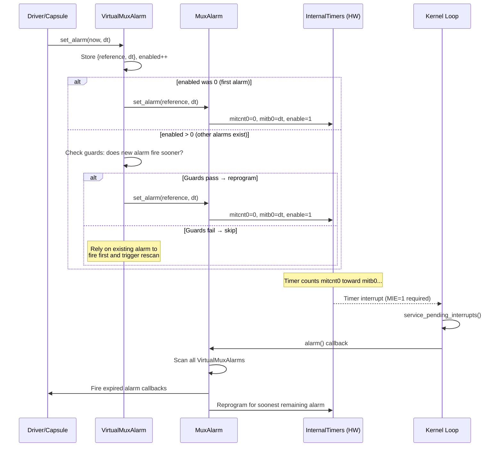
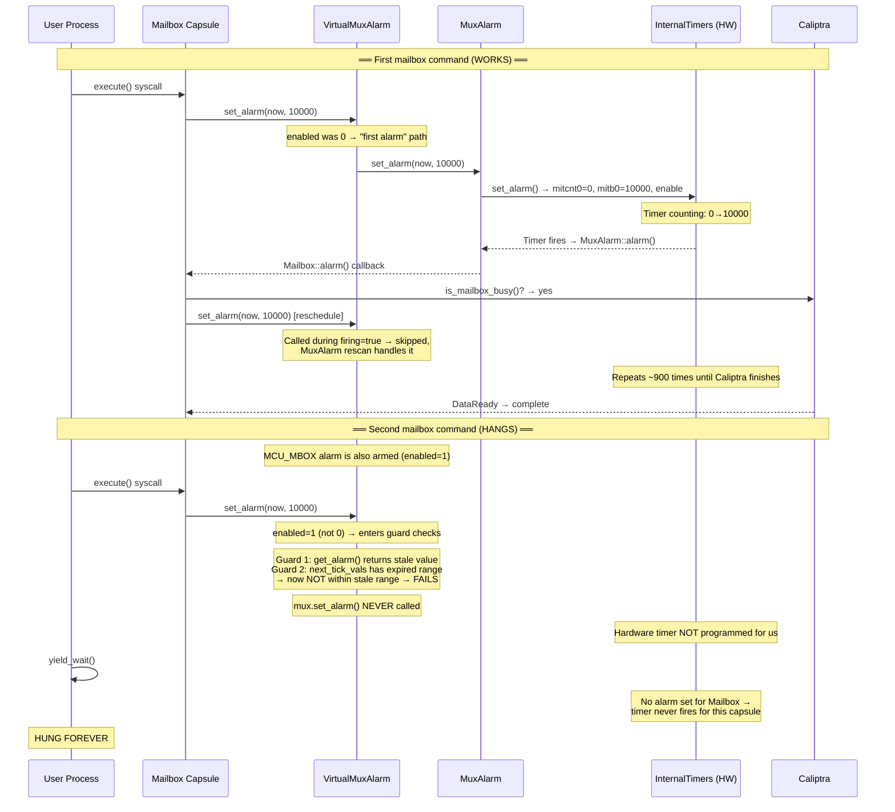
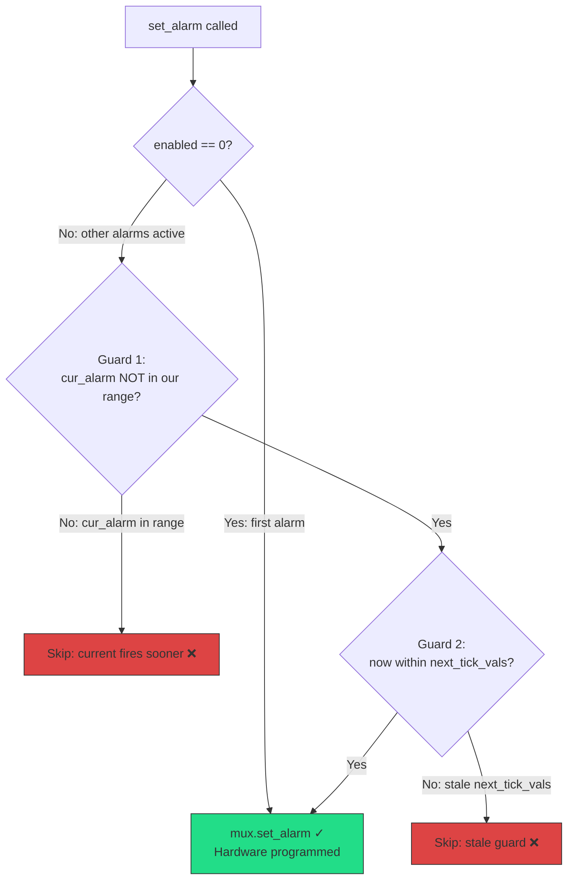

# VirtualMuxAlarm Timer Reprogramming Bug on VeeR EL2 FPGA

## Summary

The Tock OS `VirtualMuxAlarm` virtualizer has an optimization in `set_alarm()` that skips reprogramming the hardware timer when it believes an existing alarm will fire sooner. On VeeR EL2 FPGA, this optimization fails because:

The result is that mailbox polling alarms are never programmed into hardware, hanging the firmware update flow.

## How VirtualMuxAlarm Works

Tock OS has a single hardware timer (`InternalTimers` on VeeR). Multiple kernel capsules (Mailbox, I3C, MCU_MBOX, scheduler) all need independent alarms. VirtualMuxAlarm solves this by multiplexing:

```
                          ┌─────────────────────┐
                          │   InternalTimers     │
                          │   (single HW timer)  │
                          │   mitcnt0 / mitb0    │
                          └──────────┬───────────┘
                                     │ AlarmClient
                          ┌──────────▼───────────┐
                          │      MuxAlarm         │
                          │  (multiplexer)        │
                          │  • enabled count      │
                          │  • firing flag        │
                          │  • next_tick_vals     │
                          └──────────┬───────────┘
                   ┌─────────────────┼─────────────────┐
                   │                 │                  │
          ┌────────▼───────┐ ┌──────▼────────┐ ┌──────▼────────┐
          │VirtualMuxAlarm │ │VirtualMuxAlarm│ │VirtualMuxAlarm│
          │   #1 (Mailbox) │ │  #2 (I3C)     │ │  #3 (MCU_MBOX)│
          │  armed: bool   │ │  armed: bool  │ │  armed: bool  │
          │  ref + dt      │ │  ref + dt     │ │  ref + dt     │
          └────────┬───────┘ └──────┬────────┘ └──────┬────────┘
                   │                │                  │
          ┌────────▼───────┐ ┌──────▼────────┐ ┌──────▼────────┐
          │Mailbox Capsule │ │  I3C Driver   │ │ MCU_MBOX Drv  │
          └────────────────┘ └───────────────┘ └───────────────┘
```

### Normal flow (working case)



### The multiplexing detail

Only ONE hardware timer exists. MuxAlarm always programs it for the **soonest** alarm across all clients. When that alarm fires:

```
Time ──────────────────────────────────────────────────►

 Mailbox wants alarm at T+10000  ─────┐
 I3C wants alarm at T+5000      ───┐  │
                                   │  │
 Hardware programmed for T+5000 ◄──┘  │  (soonest wins)
                                      │
 T+5000: HW fires                    │
   └─► MuxAlarm::alarm()             │
       ├─ I3C alarm expired → fire    │
       ├─ Mailbox: T+10000 not yet    │
       └─ Reprogram HW for T+10000 ◄─┘
                  
 T+10000: HW fires
   └─► MuxAlarm::alarm()
       └─ Mailbox alarm expired → fire ✓
```

### Where the bug lives: `set_alarm()` guards

When a capsule calls `set_alarm()` and `enabled > 0` (other alarms exist), VirtualMuxAlarm runs two guard checks before reprogramming.

#### Case 1: Normal operation — alarms set, fired, disarmed (enabled=0 fast path)

```
Legend:  O = current alarm ref    X = current alarm expiration
         ^ = now (new alarm ref)   v = new alarm expiration

MCU_MBOX sets alarm(ref=500, dt=200). enabled=0 → first alarm → HW programmed.

0                500       700                                              3000
|─────────────────O═════════X───────────────────────────────────────────────|

Timer fires at T=700. MuxAlarm::alarm() processes it. MCU_MBOX disarmed. enabled=0.

0                                                                           3000
|───────────────────────────────────────────────────────────────────────────|

Later, another alarm: set_alarm(ref=800, dt=100). enabled=0 → first alarm → HW programmed.

0                           800  900                                        3000
|────────────────────────────O════X─────────────────────────────────────────|

Timer fires at T=900. Processed. Disarmed. enabled=0.
```

This is the normal case. Each alarm is the only one active (`enabled=0`), so `set_alarm()` always takes the "first alarm" fast path and directly programs the hardware. No guard checks needed.

#### Case 2: cur_alarm IS within the new alarm's range → skip reprogram (correct)

```
Setup: MCU_MBOX sets alarm(ref=500, dt=200). enabled=0 → first alarm → HW programmed.
       next_tick_vals = (500, 200). HW fires at T=700.

0                500       700                                              3000
|─────────────────O═════════X───────────────────────────────────────────────|

At T=600, Mailbox calls set_alarm(600, 1500). enabled=1 → guard checks.

0                500 600 700                                 2100            3000
|─────────────────O═══^═══X──────────────────────────────────v──────────────|
                      |   |                                  |
                      now  cur_alarm=700                     new alarm expires
                      new alarm range: [600, 2100)

Guard 1: Is cur_alarm=700 within [600, 2100)?  → YES
         → "existing alarm fires sooner, skip reprogram" ✓ CORRECT

         MCU_MBOX fires at 700 → MuxAlarm::alarm() rescan
         → finds Mailbox expires at 2100, not yet
         → reprograms HW for 2100 → Mailbox fires ✓
```

**Result**: Both alarms fire correctly. Guard 1 correctly detected that the pending alarm (at 700) will fire before Mailbox's (at 2100), so there's no need to reprogram — the rescan catches it.

#### Case 3: Both guards pass → reprogram (correct)

```
Setup: MCU_MBOX sets alarm(ref=500, dt=200). enabled=0 → first alarm → HW programmed.
       next_tick_vals = (500, 200). HW fires at T=700.

0                500       700                                              3000
|─────────────────O═════════X───────────────────────────────────────────────|


Case 3: cur_alarm NOT in new alarm's range, now IS within next_tick_vals
        → Both guards pass → reprogram (correct)

        At T=600, Mailbox calls set_alarm(600, 50). enabled=1 → guard checks.
        (Mailbox wants a SHORT alarm: expires at 650, BEFORE MCU_MBOX's 700)

Timeline at T=600:
0                500 600 650 700                                            3000
|─────────────────O═══^═══v══X──────────────────────────────────────────────|
                      |   |   |
                      now |   cur_alarm=700
                          new alarm expires at 650
                      new alarm range: [600, 650)

Guard 1: Is cur_alarm=700 within [600, 650)?  → NO (700 ≥ 650)
         → Guard 1 PASSES ✓  (existing alarm fires AFTER ours)

Guard 2: next_tick_vals = (500, 200), window = [500, 700)
         Is now=600 within [500, 700)?  → YES ✓
         → Guard 2 PASSES ✓

         → mux.set_alarm() called! Hardware reprogrammed for Mailbox! ✓
```

**Result**: Mailbox's shorter alarm (650) fires before MCU_MBOX's (700). Guard 1 correctly detected that the existing alarm fires *after* ours, and Guard 2 confirmed the timer state is fresh (`now` is still within the `next_tick_vals` window). Both guards pass → reprogram.

#### Case 4: Guard 1 passes, Guard 2 correctly rejects (normal)

```
Setup: MCU_MBOX sets alarm(ref=500, dt=200). Fires at T=700. MuxAlarm::alarm() processes it.
       MCU_MBOX re-arms immediately: set_alarm(ref=700, dt=200). HW programmed, fires at 900.
       next_tick_vals = (700, 200)  ← updated by the re-arm

0                500       700       900                                    3000
|─────────────────O═════════O═════════X─────────────────────────────────────|
                  (1st,done) (2nd)    fires at 900

Case 4: Guard 1 passes, Guard 2 correctly identifies "alarm being handled"
        → skip reprogram (correct — MuxAlarm::alarm() rescan will catch it)

        During MuxAlarm::alarm() firing=true processing at T=750, another capsule
        calls set_alarm(750, 50). But firing=true so it's skipped entirely.
  
        Alternative: At T=950 (after 2nd alarm fired, during MuxAlarm::alarm()),
        MCU_MBOX callback re-arms AGAIN: set_alarm(950, 200). fires at 1150.
        next_tick_vals = (950, 200). Then at T=1200 (PAST the window),
        Mailbox calls set_alarm(1200, 50). enabled=1 → guard checks.

0                              950    1150  1200 1250                       3000
|───────────────────────────────O══════X─────^════v─────────────────────────|
                                |      |     now  new alarm expires
                                next_tick_vals    [1200, 1250)
                                window [950, 1150)

Guard 1: Is cur_alarm within [1200, 1250)?
         cur_alarm = get_alarm(). Timer expired (counter > bound) → bogus value.
         Let's say it returns something outside [1200, 1250).
         → Guard 1 PASSES ✓

Guard 2: next_tick_vals = (950, 200), window = [950, 1150)
         Is now=1200 within [950, 1150)?  → NO (1200 > 1150)
         → Guard 2 FAILS — "timer already fired and was handled, don't reprogram"

         In the INTENDED case, MuxAlarm::alarm() already ran at T=1150,
         processed the expired timer, and if Mailbox was armed, it would
         have been caught in the rescan. Guard 2 prevents redundant reprogram.
```

**Result**: Guard 2's **intended** function is to detect that the previous alarm already fired and was processed — meaning `MuxAlarm::alarm()` already ran its rescan. If Mailbox was armed before, it would have been caught. This prevents a redundant `set_alarm()` from thrashing the hardware timer.

**The problem**: Guard 2 cannot distinguish "alarm fired AND was processed" from "alarm fired but NOT yet processed" (the bug case). Both look the same: `now` is past the `next_tick_vals` window.

#### Case 5: Guards failing with stale state (BUG)

```
Setup: MCU_MBOX set alarm(ref=500, dt=200). Fired at T=700. Disarmed.
       next_tick_vals = (500, 200)  ← NEVER CLEARED

0                500       700                                              3000
|─────────────────O═════════X───────────────────────────────────────────────|
                             FIRED ✓ and disarmed


Case 5: cur_alarm NOT in range, but next_tick_vals is stale → Guard 2 fails (BUG)
        MCU_MBOX re-arms at T=2400. Then at T=2500,
        Mailbox calls set_alarm(2500, 400). enabled=1 → guard checks.

Timeline at T=2500:
0                500  700                          2400 2500             2900 3000
|─────────────────O════X────────────────────────────O════^═══════════════v───|
                  |    |                            |    now              |
                  stale next_tick_vals              MCU_MBOX             new alarm
                  window [500, 700)                 (re-armed)           expires

Guard 1: cur_alarm = get_alarm()
         MCU_MBOX timer expired (counter >> bound) → bogus value
         Let's say Guard 1 passes ✓

Guard 2: next_tick_vals = (500, 200), window = [500, 700)
         Is now=2500 within [500, 700)?  → NO (2500 >> 700)
         → Guard 2 FAILS ❌

         mux.set_alarm() NEVER called!
         Hardware NOT reprogrammed for Mailbox!
```

**Result**: Mailbox's alarm is permanently lost. The stale `next_tick_vals` from a long-expired alarm causes Guard 2 to incorrectly skip the reprogram.

---

```
Guard 1: "Is the current HW alarm NOT within our [ref, ref+dt) window?"
         Uses get_alarm() to read the hardware timer's fire time.
   
Guard 2: "Is now within the next_tick_vals window?"
         next_tick_vals stores the (reference, dt) from the LAST
         MuxAlarm::set_alarm() call.
   
Both must pass → reprogram hardware
Either fails  → skip (assume existing alarm handles it)
```

The guards are an optimization: if the hardware is already set to fire before our alarm, there's no need to reprogram — `MuxAlarm::alarm()` will rescan and catch ours. But when `get_alarm()` or `next_tick_vals` are **stale** (from a long-expired alarm), the guards make incorrect decisions.

## Affected Code

**File**: `capsules/core/src/virtualizers/virtual_alarm.rs` (Tock OS)

```rust
fn set_alarm(&self, reference: Self::Ticks, dt: Self::Ticks) {
    // ...
    if enabled == 0 {
        // First alarm → always programs hardware ✓
        self.mux.set_alarm(reference, dt);
    } else if !self.mux.firing.get() {
        let cur_alarm = self.mux.alarm.get_alarm();
        let now = self.mux.alarm.now();
        let expiration = reference.wrapping_add(dt);

        // GUARD 1: Is current hardware alarm NOT in our window?
        if !cur_alarm.within_range(reference, expiration) {
            let next = self.mux.next_tick_vals.get();

            // GUARD 2: Is now within the next_tick_vals window?
            if next.is_none_or(|(next_ref, next_dt)| {
                now.within_range(next_ref, next_ref.wrapping_add(next_dt))
            }) {
                self.mux.set_alarm(reference, dt);  // ← Only reached if BOTH guards pass
            }
        }
    }
}
```

Both guards must pass for the hardware timer to be reprogrammed. When either fails due to stale state, the timer is never programmed for the new alarm.

## How the Bug Materializes

### Scenario: Two sequential mailbox operations



### What triggers the bug

The bug requires **all three conditions** to be present simultaneously:

| Condition                          | Description                                                                                                                                                  |
| ---------------------------------- | ------------------------------------------------------------------------------------------------------------------------------------------------------------ |
| **Other alarms armed**       | `enabled > 0` when our `set_alarm()` is called, so the "first alarm" fast path is skipped                                                                |
| **Stale `next_tick_vals`** | A previously-set alarm has expired; its`(reference, dt)` stored in `next_tick_vals` represents a past time window that `now` is no longer within       |
| **Stale `get_alarm()`**    | The hardware timer was disabled after the previous alarm fired (`service_interrupts()` calls `disable_timers()`); `get_alarm()` reads stale CSR values |

### Guard failure example (concrete values)

```
Timeline (20 MHz clock, ticks):

T=662,000,000: MCU_MBOX sets alarm → mitcnt0=0, mitb0=7538, enabled
               next_tick_vals = Some((662M, 7538))
               MuxAlarm programs hardware ✓

T=662,007,538: Timer fires → ISR saves interrupt
               service_interrupts() → disable_timers() → mitctl0.enable=0
               MuxAlarm::alarm() → fires MCU_MBOX callback
               MCU_MBOX re-arms → set_alarm() reprograms hardware
               next_tick_vals = Some((662M+7538, new_dt))

  ... MCU_MBOX alarm fires/re-arms several more times ...

T=680,000,000: MCU_MBOX's last alarm fires, callback doesn't re-arm
               MuxAlarm::alarm() → no remaining alarms → disarm()
               BUT: next_tick_vals may still hold the LAST set values
               Hardware timer: disabled (mitctl0.enable=0)

  ... 390 million ticks pass (user app doing PLDM transfer) ...

T=1,070,000,000: Mailbox execute() → schedule_alarm()
                 → VirtualMuxAlarm::set_alarm(now=1070M, dt=10000)
```

At T=1,070,000,000, the guard checks evaluate:

```
Guard 1: cur_alarm = get_alarm()
         Hardware is disabled, CSRs are stale:
           mitb0 = last_bound (e.g., 7538)
           mitcnt0 = some large stale value
         get_alarm() = now - stale_cnt + stale_bound = arbitrary value
         within_range(1070M, 1070M+10000)? → MAYBE passes, MAYBE fails
         If it passes → "current alarm fires earlier, keep it" → SKIP ❌

Guard 2: next_tick_vals = Some((old_ref, old_dt)) from T≈680M
         now=1070M, window=[680M, 680M+old_dt]
         1070M within [680M, 680M+old_dt]? → NO (far past the window)
         → Guard 2 FAILS → mux.set_alarm() NOT called ❌
```

**Result**: Hardware timer is never programmed for the Mailbox alarm. Since no other alarm will fire to trigger `MuxAlarm::alarm()` and its rescan logic, the Mailbox alarm is permanently lost.

## Why the first command works but the second doesn't



- **First command**: No other alarms armed → `enabled == 0` → takes the "first alarm" path → hardware always programmed ✓
- **Second command**: MCU_MBOX alarm is armed → `enabled > 0` → enters guard checks → stale state causes guards to fail → hardware NOT programmed ❌

## Note on VeeR `wfi` behavior

Testing confirmed that `wfi` does **not** stall the VeeR internal timer on this FPGA. The timer interrupt (mie bit 29) correctly wakes the core from `wfi`. This was verified by arming the timer, entering `wfi`, and observing that the timer interrupt fires and wakes the core as expected.

The bug is **not** caused by `wfi` — it is caused entirely by the stale guard state in `VirtualMuxAlarm::set_alarm()` when MIE=0 during kernel syscall handling prevents `MuxAlarm::alarm()` from running to clear the stale state before a new `set_alarm()` call enters the guard checks.

## Fix Applied

### 1. VirtualMuxAlarm (Tock modification — upstream bug)

Remove the `within_range` + `next_tick_vals` guards; always reprogram when `!firing`:

```rust
} else if !self.mux.firing.get() {
    // Always reprogram. The within_range optimization fails when
    // get_alarm() or next_tick_vals are stale after timer disable/re-enable.
    self.mux.set_alarm(reference, dt);
}
```

**Impact**: Other alarms that were supposed to fire "sooner" may be slightly delayed (by at most `dt` ticks). They are still caught in `MuxAlarm::alarm()`'s expired-alarm scan. For typical polling intervals (500µs), this is negligible.

### 2. Hardware timer polling (chip.rs)

Poll `has_timer0_expired()` in the kernel loop to detect timer expiry even when the ISR can't run (MIE=0):

```rust
fn service_pending_interrupts(&self) {
    loop {
        if self.timers.has_timer0_expired()
            && self.timers.get_saved_interrupts() == TimerInterrupts::None
        {
            CSR.mie.modify(mie::BIT29::CLEAR);
            self.timers.save_interrupt(0);
        }
        // ... process saved interrupts ...
    }
}

fn has_pending_interrupts(&self) -> bool {
    self.pic.get_saved_interrupts().is_some()
        || self.timers.get_saved_interrupts() != TimerInterrupts::None
        || self.timers.has_timer0_expired()
}
```

### 3. Supporting timer methods (timers.rs)

```rust
// get_alarm(): wrapping arithmetic so expired timers return past time
fn get_alarm(&self) -> Self::Ticks {
    let bound = self.mitb0.read(mitb0::bound) as u64;
    let counter = self.mitcnt0.get() as u64;
    let now = self.now().into_u64();
    now.wrapping_sub(counter).wrapping_add(bound).into()
}

// now(): race-free 64-bit read
fn now(&self) -> Ticks64 {
    loop {
        let hi = self.mcycleh.get() as u64;
        let lo = self.mcycle.get() as u64;
        if hi == self.mcycleh.get() as u64 { return ((hi << 32) | lo).into(); }
    }
}

// Hardware polling helpers
pub fn has_timer0_expired(&self) -> bool {
    self.mitctl0.read(mitctl0::enable) == 1
        && { let c = self.mitcnt0.get(); let b = self.mitb0.read(mitb0::bound); b > 0 && c >= b }
}
pub fn is_timer0_enabled(&self) -> bool {
    self.mitctl0.read(mitctl0::enable) == 1
}
```

## FAQ

### Q: The same streaming test exists on main-2.1 and uses MCU_MBOX + Mailbox together. Why don't we see this bug there?

**A: It's a timing-dependent race condition.** The bug requires all three conditions to be true at the exact moment the Mailbox capsule calls `set_alarm()`:

1. Another VirtualMuxAlarm is armed (`enabled > 0`)
2. `next_tick_vals` is stale (from a long-expired alarm)
3. `get_alarm()` returns stale CSR values (hardware timer disabled)

Whether these conditions align depends on the relative timing of MCU_MBOX's `schedule_send_done()` alarm vs. the Mailbox's `execute()` call. Factors that shift this timing include:

- **Caliptra-sw revision** — different crypto processing time for ATVM commands changes when `execute()` returns and the next alarm is set
- **Firmware image sizes** — different binary sizes change streaming duration, shifting when `execute()` is called relative to MCU_MBOX activity
- **MCU_MBOX activity** — MCU_MBOX fires `schedule_send_done()` (a 1000-tick alarm) in response to host mailbox commands. The timing of host requests varies between test configurations
- **I3C initialization** — I3C also has a VirtualMuxAlarm; different boot timing affects whether it's armed at the critical moment

On main-2.1, the timing happens to avoid the race — by the time the Mailbox's `execute()` runs, MCU_MBOX's alarm has already fired and disarmed, so `enabled == 0` and the "first alarm" fast path is taken. On the feature branch, code changes (different caliptra-sw rev, different test flow) shift the timing so MCU_MBOX is still armed when `execute()` runs, deterministically triggering the bug.

**The bug is latent on main-2.1** — it could surface with any change that shifts timer timing (new caliptra-sw rev, additional capsules, different test ordering). The fix is correct regardless of whether it reproduces today.

### Q: Is this a Tock upstream bug?

**A: Yes.** The `within_range` + `next_tick_vals` guards in `VirtualMuxAlarm::set_alarm()` assume that `get_alarm()` and `next_tick_vals` always reflect the current hardware state. This assumption breaks when:

- The hardware timer is disabled between alarm cycles (`service_interrupts()` calls `disable_timers()`)
- `next_tick_vals` is not cleared when the last alarm is processed (it persists from `MuxAlarm::set_alarm()` even after `MuxAlarm::disarm()`)

The same bug exists in Tock's current `master` branch (verified June 2026). It affects any platform where timer state goes stale between alarm cycles. The underlying logic error is platform-independent — any system where `set_alarm()` can be called while MIE=0 (preventing `MuxAlarm::alarm()` from processing an expired timer) can hit this race.

### Q: Why not just fix the Tock crate directly?

**A: We can't modify Tock's git checkout reliably.** Cargo caches git dependencies by revision hash and doesn't detect in-place file modifications. Instead, we created `caliptra-mcu-virtual-alarm` — a ~200-line drop-in replacement crate that implements the same `MuxAlarm`/`VirtualMuxAlarm` API without the broken optimization. All capsules use it via a simple import change. This keeps the fix version-controlled in our repo.

### Q: Does this mean two alarms can never work together in Tock?

**A: No — two alarms work fine when the state is fresh.** The optimization is *correct* when the previous alarm hasn't expired yet:

```
WORKS: MCU_MBOX alarm still pending when Mailbox calls set_alarm
  T=1069M: MCU_MBOX set_alarm(1069M, 1000) → expires at 1069.001M
  T=1069.0005M: Mailbox set_alarm(now, 10000)
    Guard 2: next_tick_vals=(1069M, 1000), window=[1069M, 1069.001M)
             now=1069.0005M → IS within window → PASSES ✓
    → Hardware reprogrammed ✓

BROKEN: MCU_MBOX alarm already expired when Mailbox calls set_alarm
  T=1069M: MCU_MBOX set_alarm(1069M, 1000) → expires at 1069.001M
  T=1070M: Mailbox set_alarm(now, 10000)    ← 999,000 ticks after expiry
    Guard 2: next_tick_vals=(1069M, 1000), window=[1069M, 1069.001M)
             now=1070M → NOT within window → FAILS ❌
    → Hardware NOT reprogrammed 🐛
```

Guard 2 works correctly when the previous alarm is **still active** — `now` is within its `[ref, ref+dt)` window, meaning the hardware will fire soon and `MuxAlarm::alarm()` will rescan and catch ours. It breaks when the previous alarm **already expired but the kernel hasn't processed it yet** — `now` is past the window, and Guard 2 incorrectly concludes "don't reprogram."

### Q: Why does the kernel not process an expired timer?

**A: Because `armed` and `enabled` are software state that only update when `MuxAlarm::alarm()` runs — not when the hardware timer expires.** The chain is:

```
1. Hardware: mitcnt0 reaches mitb0       → timer "expired" in hardware
2. ISR: saves interrupt flag             → requires mstatus.MIE=1
3. Kernel: service_pending_interrupts()  → reads saved flag
4. Kernel: MuxAlarm::alarm()             → scans VirtualMuxAlarms
5. MuxAlarm: MCU_MBOX expired            → armed=false, enabled--
```

If step 2 is delayed (because `MIE=0` in kernel mode during syscall handling), steps 3–5 don't happen before the next `set_alarm()` call. MCU_MBOX stays `armed=true`, `enabled` stays at 1, and `next_tick_vals` stays stale. When Mailbox later calls `set_alarm`, it sees `enabled=1` and enters the guard checks instead of the "first alarm" fast path.

On most platforms, the window between "timer expires" and "MIE re-enabled" is brief, making the race rare. On VeeR FPGA with our workload, the timing consistently triggers it because the Mailbox `execute()` syscall happens while MIE=0 during kernel syscall handling, before the kernel loop has a chance to process the expired MCU_MBOX timer.

---

## Appendix: Step-by-Step State Walkthrough

This appendix traces the exact values of every shared variable through a sequence that triggers the bug. Each diagram shows the state **after** the described event.

### Step 1: System idle after boot (T=0)

No alarms are armed. Hardware timer is disabled.

```
                          ┌─────────────────────┐
                          │   InternalTimers     │
                          │   mitcnt0 = 0        │
                          │   mitb0   = 0        │
                          │   enable  = 0        │
                          └──────────┬───────────┘
                                     │
                          ┌──────────▼───────────┐
                          │      MuxAlarm         │
                          │   enabled  = 0        │
                          │   firing   = false    │
                          │   next_tick_vals=None  │
                          └──────────┬───────────┘
                   ┌─────────────────┼─────────────────┐
                   │                 │                  │
          ┌────────▼───────┐ ┌──────▼────────┐ ┌──────▼────────┐
          │ VA #1 Mailbox  │ │ VA #2  I3C    │ │ VA #3 MCU_MBOX│
          │ armed = false  │ │ armed = false │ │ armed = false │
          │ ref   = —      │ │ ref   = —     │ │ ref   = —     │
          │ dt    = —      │ │ dt    = —     │ │ dt    = —     │
          └────────────────┘ └───────────────┘ └───────────────┘
```

### Step 2: MCU_MBOX sets alarm (T=662,000,000)

MCU_MBOX receives a host mailbox command and calls `schedule_send_done()` → `set_alarm(now, 1000)`. Since `enabled == 0`, the **"first alarm"** path is taken — hardware is directly programmed.

```
                          ┌──────────────────────┐
                          │   InternalTimers      │
                          │   mitcnt0 = 0     ✓   │
                          │   mitb0   = 1000  ✓   │
                          │   enable  = 1     ✓   │
                          └──────────┬────────────┘
                                     │
                          ┌──────────▼────────────┐
                          │      MuxAlarm          │
                          │   enabled  = 1     ✓   │
                          │   firing   = false     │
                          │   next_tick_vals =     │
                          │     Some((662M, 1000)) │ ← set by mux.set_alarm()
                          └──────────┬────────────┘
                   ┌─────────────────┼─────────────────┐
                   │                 │                  │
          ┌────────▼───────┐ ┌──────▼────────┐ ┌──────▼────────┐
          │ VA #1 Mailbox  │ │ VA #2  I3C    │ │ VA #3 MCU_MBOX│
          │ armed = false  │ │ armed = false │ │ armed = true  │ ✓
          │ ref   = —      │ │ ref   = —     │ │ ref   = 662M  │
          │ dt    = —      │ │ dt    = —     │ │ dt    = 1000  │
          └────────────────┘ └───────────────┘ └───────────────┘
```

### Step 3: MCU_MBOX alarm fires (T=662,001,000)

Timer reaches bound. ISR saves interrupt. `service_interrupts()` disables timer. `MuxAlarm::alarm()` fires MCU_MBOX's callback. MCU_MBOX doesn't re-arm. No remaining alarms → `MuxAlarm::disarm()`.

**Key detail**: `MuxAlarm::disarm()` disables the hardware but `next_tick_vals` **was already updated by the last `mux.set_alarm()` call** — it retains the value `Some((662M, 1000))`.

```
                          ┌──────────────────────┐
                          │   InternalTimers      │
                          │   mitcnt0 = 1000      │ ← stale (timer disabled)
                          │   mitb0   = 1000      │ ← stale
                          │   enable  = 0     ✓   │ ← disabled by disarm
                          └──────────┬────────────┘
                                     │
                          ┌──────────▼────────────┐
                          │      MuxAlarm          │
                          │   enabled  = 0     ✓   │
                          │   firing   = false     │
                          │   next_tick_vals =     │
                          │     Some((662M, 1000)) │ ← STALE! not cleared
                          └──────────┬────────────┘
                   ┌─────────────────┼─────────────────┐
                   │                 │                  │
          ┌────────▼───────┐ ┌──────▼────────┐ ┌──────▼────────┐
          │ VA #1 Mailbox  │ │ VA #2  I3C    │ │ VA #3 MCU_MBOX│
          │ armed = false  │ │ armed = false │ │ armed = false │ ✓ disarmed
          │ ref   = —      │ │ ref   = —     │ │ ref   = 662M  │
          │ dt    = —      │ │ dt    = —     │ │ dt    = 1000  │
          └────────────────┘ └───────────────┘ └───────────────┘
```

### Step 4: I3C sets alarm (T=700,000,000)

I3C driver needs a timeout. Calls `set_alarm(now, 50000)`. Since `enabled == 0`, "first alarm" path → hardware programmed directly.

```
                          ┌──────────────────────┐
                          │   InternalTimers      │
                          │   mitcnt0 = 0     ✓   │
                          │   mitb0   = 50000 ✓   │
                          │   enable  = 1     ✓   │
                          └──────────┬────────────┘
                                     │
                          ┌──────────▼────────────┐
                          │      MuxAlarm          │
                          │   enabled  = 1     ✓   │
                          │   firing   = false     │
                          │   next_tick_vals =     │
                          │    Some((700M, 50000)) │ ← updated by mux.set_alarm
                          └──────────┬────────────┘
                   ┌─────────────────┼─────────────────┐
                   │                 │                  │
          ┌────────▼───────┐ ┌──────▼────────┐ ┌──────▼────────┐
          │ VA #1 Mailbox  │ │ VA #2  I3C    │ │ VA #3 MCU_MBOX│
          │ armed = false  │ │ armed = true  │ │ armed = false │
          │ ref   = —      │ │ ref   = 700M  │ │ ref   = 662M  │
          │ dt    = —      │ │ dt    = 50000 │ │ dt    = 1000  │
          └────────────────┘ └───────────────┘ └───────────────┘
```

### Step 5: I3C alarm fires, I3C doesn't re-arm (T=700,050,000)

Same pattern as Step 3. Timer fires, `MuxAlarm::alarm()` fires I3C callback, no remaining alarms, `MuxAlarm::disarm()`.

```
                          ┌──────────────────────┐
                          │   InternalTimers      │
                          │   mitcnt0 = 50000     │ ← stale
                          │   mitb0   = 50000     │ ← stale
                          │   enable  = 0         │ ← disabled
                          └──────────┬────────────┘
                                     │
                          ┌──────────▼────────────┐
                          │      MuxAlarm          │
                          │   enabled  = 0         │
                          │   firing   = false     │
                          │   next_tick_vals =     │
                          │    Some((700M, 50000)) │ ← STALE!
                          └──────────┬────────────┘
                   ┌─────────────────┼─────────────────┐
                   │                 │                  │
          ┌────────▼───────┐ ┌──────▼────────┐ ┌──────▼────────┐
          │ VA #1 Mailbox  │ │ VA #2  I3C    │ │ VA #3 MCU_MBOX│
          │ armed = false  │ │ armed = false │ │ armed = false │
          │ ref   = —      │ │ ref   = 700M  │ │ ref   = 662M  │
          │ dt    = —      │ │ dt    = 50000 │ │ dt    = 1000  │
          └────────────────┘ └───────────────┘ └───────────────┘
```

### Step 6: MCU_MBOX sets alarm again (T=1,000,000,000)

Another host mailbox command arrives. MCU_MBOX calls `schedule_send_done()` → `set_alarm(now, 1000)`. `enabled == 0` → "first alarm" path → hardware programmed.

```
                          ┌──────────────────────┐
                          │   InternalTimers      │
                          │   mitcnt0 = 0     ✓   │
                          │   mitb0   = 1000  ✓   │
                          │   enable  = 1     ✓   │
                          └──────────┬────────────┘
                                     │
                          ┌──────────▼────────────┐
                          │      MuxAlarm          │
                          │   enabled  = 1     ✓   │
                          │   firing   = false     │
                          │   next_tick_vals =     │
                          │   Some((1000M, 1000))  │ ← updated
                          └──────────┬────────────┘
                   ┌─────────────────┼─────────────────┐
                   │                 │                  │
          ┌────────▼───────┐ ┌──────▼────────┐ ┌──────▼────────┐
          │ VA #1 Mailbox  │ │ VA #2  I3C    │ │ VA #3 MCU_MBOX│
          │ armed = false  │ │ armed = false │ │ armed = true  │ ✓
          │ ref   = —      │ │ ref   = 700M  │ │ ref   = 1000M │
          │ dt    = —      │ │ dt    = 50000 │ │ dt    = 1000  │
          └────────────────┘ └───────────────┘ └───────────────┘
```

### Step 7: MCU_MBOX alarm fires (T=1,000,001,000)

Timer fires, MCU_MBOX callback runs, doesn't re-arm. But `enabled` goes to 0, `disarm()` called. **`next_tick_vals` retains `Some((1000M, 1000))`.**

```
                          ┌──────────────────────┐
                          │   InternalTimers      │
                          │   mitcnt0 = 1000      │ ← stale
                          │   mitb0   = 1000      │ ← stale
                          │   enable  = 0         │ ← disabled
                          └──────────┬────────────┘
                                     │
                          ┌──────────▼────────────┐
                          │      MuxAlarm          │
                          │   enabled  = 0         │
                          │   firing   = false     │
                          │   next_tick_vals =     │
                          │   Some((1000M, 1000))  │ ← STALE!
                          └──────────┬────────────┘
                   ┌─────────────────┼─────────────────┐
                   │                 │                  │
          ┌────────▼───────┐ ┌──────▼────────┐ ┌──────▼────────┐
          │ VA #1 Mailbox  │ │ VA #2  I3C    │ │ VA #3 MCU_MBOX│
          │ armed = false  │ │ armed = false │ │ armed = false │
          └────────────────┘ └───────────────┘ └───────────────┘
```

### Step 8: I3C sets alarm again (T=1,050,000,000) — enabled > 0 seed

I3C needs another timeout. `enabled == 0` → "first alarm" → hardware programmed. **Now `enabled = 1` and `next_tick_vals` is fresh.**

```
                          ┌───────────────────────┐
                          │   InternalTimers       │
                          │   mitcnt0 = 0      ✓   │
                          │   mitb0   = 50000  ✓   │
                          │   enable  = 1      ✓   │
                          └──────────┬─────────────┘
                                     │
                          ┌──────────▼─────────────┐
                          │      MuxAlarm           │
                          │   enabled  = 1      ✓   │
                          │   firing   = false      │
                          │   next_tick_vals =      │
                          │   Some((1050M, 50000))  │ ← fresh
                          └──────────┬─────────────┘
                   ┌─────────────────┼─────────────────┐
                   │                 │                  │
          ┌────────▼───────┐ ┌──────▼────────┐ ┌──────▼────────┐
          │ VA #1 Mailbox  │ │ VA #2  I3C    │ │ VA #3 MCU_MBOX│
          │ armed = false  │ │ armed = true  │ │ armed = false │
          │ ref   = —      │ │ ref   = 1050M │ │               │
          │ dt    = —      │ │ dt    = 50000 │ │               │
          └────────────────┘ └───────────────┘ └───────────────┘
```

### Step 9: I3C alarm fires (T=1,050,050,000) — stale next_tick_vals left behind

I3C fires, doesn't re-arm. `enabled → 0`, `disarm()`. Hardware disabled. **`next_tick_vals` retains `Some((1050M, 50000))`.**

```
                          ┌───────────────────────┐
                          │   InternalTimers       │
                          │   mitcnt0 = 50000      │ ← STALE
                          │   mitb0   = 50000      │ ← STALE
                          │   enable  = 0          │ ← disabled
                          └──────────┬─────────────┘
                                     │
                          ┌──────────▼─────────────┐
                          │      MuxAlarm           │
                          │   enabled  = 0          │
                          │   firing   = false      │
                          │   next_tick_vals =      │
                          │   Some((1050M, 50000))  │ ← STALE!
                          └──────────┬─────────────┘
                   ┌─────────────────┼─────────────────┐
                   │                 │                  │
          ┌────────▼───────┐ ┌──────▼────────┐ ┌──────▼────────┐
          │ VA #1 Mailbox  │ │ VA #2  I3C    │ │ VA #3 MCU_MBOX│
          │ armed = false  │ │ armed = false │ │ armed = false │
          └────────────────┘ └───────────────┘ └───────────────┘
```

### Step 10: MCU_MBOX sets alarm (T=1,060,000,000) — now enabled > 0

Another host command. MCU_MBOX calls `set_alarm(1060M, 1000)`. `enabled == 0` → "first alarm" → hardware programmed. **Now `enabled = 1`.**

```
                          ┌───────────────────────┐
                          │   InternalTimers       │
                          │   mitcnt0 = 0      ✓   │
                          │   mitb0   = 1000   ✓   │
                          │   enable  = 1      ✓   │
                          └──────────┬─────────────┘
                                     │
                          ┌──────────▼─────────────┐
                          │      MuxAlarm           │
                          │   enabled  = 1      ✓   │
                          │   firing   = false      │
                          │   next_tick_vals =      │
                          │   Some((1060M, 1000))   │ ← updated
                          └──────────┬─────────────┘
                   ┌─────────────────┼─────────────────┐
                   │                 │                  │
          ┌────────▼───────┐ ┌──────▼────────┐ ┌──────▼────────┐
          │ VA #1 Mailbox  │ │ VA #2  I3C    │ │ VA #3 MCU_MBOX│
          │ armed = false  │ │ armed = false │ │ armed = true  │ ✓
          │ ref   = —      │ │               │ │ ref   = 1060M │
          │ dt    = —      │ │               │ │ dt    = 1000  │
          └────────────────┘ └───────────────┘ └───────────────┘
```

### Step 11: MCU_MBOX fires but DOESN'T disarm yet (T=1,060,001,000)

Timer fires. During `MuxAlarm::alarm()`, MCU_MBOX callback runs but this time the response isn't done — it **doesn't re-arm but `enabled` decrements to 0 and `MuxAlarm::disarm()` runs**. Or alternatively, MCU_MBOX callback completes and disarms, but between disarm and step 12, MCU_MBOX gets another command and re-arms. **The key is: `enabled > 0` when Mailbox calls `set_alarm` in step 12.**

For this example, let's say MCU_MBOX gets ANOTHER host command at T=1,069M and re-arms:

```
                          ┌───────────────────────┐
                          │   InternalTimers       │
                          │   mitcnt0 = 0      ✓   │
                          │   mitb0   = 1000   ✓   │
                          │   enable  = 1      ✓   │
                          └──────────┬─────────────┘
                                     │
                          ┌──────────▼─────────────┐
                          │      MuxAlarm           │
                          │   enabled  = 1      ✓   │
                          │   firing   = false      │
                          │   next_tick_vals =      │
                          │   Some((1069M, 1000))   │
                          └──────────┬─────────────┘
                   ┌─────────────────┼─────────────────┐
                   │                 │                  │
          ┌────────▼───────┐ ┌──────▼────────┐ ┌──────▼────────┐
          │ VA #1 Mailbox  │ │ VA #2  I3C    │ │ VA #3 MCU_MBOX│
          │ armed = false  │ │ armed = false │ │ armed = true  │
          │ ref   = —      │ │               │ │ ref   = 1069M │
          │ dt    = —      │ │               │ │ dt    = 1000  │
          └────────────────┘ └───────────────┘ └───────────────┘
```

### Step 12: 🐛 THE BUG — Mailbox sets alarm while MCU_MBOX is armed (T=1,070,000,000)

Mailbox capsule's `execute()` calls `schedule_alarm()` → `set_alarm(1070M, 10000)`.

**`enabled = 1` (MCU_MBOX is armed) → NOT "first alarm" → enters guard checks.**

```
Guard 1: cur_alarm = get_alarm()
         HW state: mitcnt0 has been counting since MCU_MBOX's set_alarm
         at T=1069M. Counter ≈ 1,000,000 (1M ticks elapsed).
         mitb0 = 1000.
         get_alarm() = now - counter + bound
                     = 1070M - 1M + 1000 ≈ 1069M
         within_range(1070M, 1070M+10000)?
         Is 1069M in [1070M, 1070M+10000)? → NO (1069M < 1070M)
         → Guard 1 PASSES ✓  (cur_alarm not in our range)

Guard 2: next_tick_vals = Some((1069M, 1000))
         window = [1069M, 1069M+1000) = [1069M, 1069.001M)
         now = 1070M
         Is 1070M in [1069M, 1069.001M)? → NO (1070M > 1069.001M)
         → Guard 2 FAILS ❌  (now is past the stale window)
```

**Result: `mux.set_alarm()` is NEVER called. Hardware is NOT reprogrammed for Mailbox.**

```
                          ┌───────────────────────┐
                          │   InternalTimers       │
                          │   mitcnt0 ≈ 1M        │ ← still counting from
                          │   mitb0   = 1000      │    MCU_MBOX's alarm
                          │   enable  = 1         │ ← MCU_MBOX's timer!
                          │                       │    NOT our 10000!
                          └──────────┬─────────────┘
                                     │
                          ┌──────────▼─────────────┐
                          │      MuxAlarm           │
                          │   enabled  = 2          │ ← Mailbox + MCU_MBOX
                          │   firing   = false      │
                          │   next_tick_vals =      │
                          │   Some((1069M, 1000))   │ ← NOT UPDATED!
                          └──────────┬─────────────┘    (should be 1070M,10000)
                   ┌─────────────────┼─────────────────┐
                   │                 │                  │
          ┌────────▼───────┐ ┌──────▼────────┐ ┌──────▼────────┐
          │ VA #1 Mailbox  │ │ VA #2  I3C    │ │ VA #3 MCU_MBOX│
          │ armed = true   │ │ armed = false │ │ armed = true  │
          │ ref   = 1070M  │ │               │ │ ref   = 1069M │
          │ dt    = 10000  │ │               │ │ dt    = 1000  │
          └────────────────┘ └───────────────┘ └───────────────┘
          ▲                
          │ Armed but hardware NOT  
          │ programmed for us!  
          │ HW is still set to  
          │ MCU_MBOX's expired alarm.   
          │                 
          └─── 🐛 ALARM WILL NEVER FIRE
```

**What happens next**: MCU_MBOX's timer already expired (mitcnt0=1M >> mitb0=1000). When `MuxAlarm::alarm()` eventually processes it, MCU_MBOX's callback runs and disarms — but the damage is already done: Mailbox's `set_alarm()` was skipped back in the guard check. `MuxAlarm::alarm()` only rescans alarms that were armed **at the time it runs**. Since Mailbox's alarm was never programmed into hardware, `MuxAlarm` doesn't know to reprogram for it. The Mailbox alarm is permanently lost.
