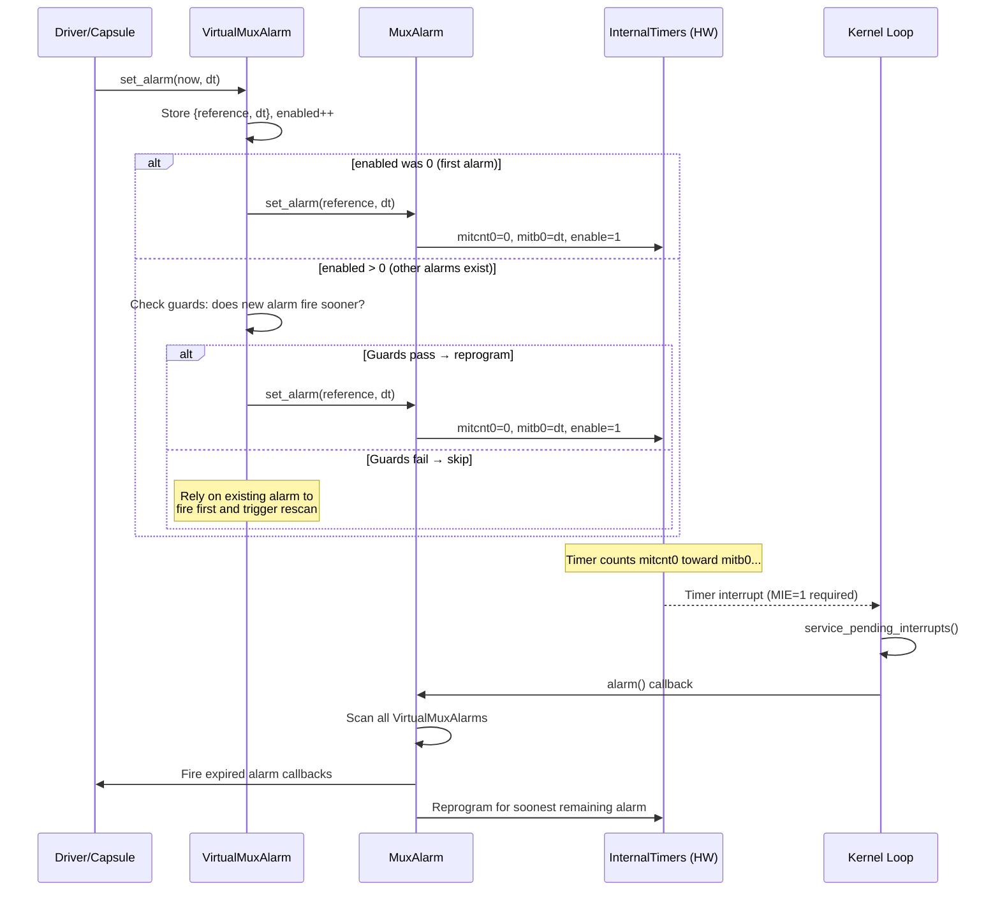

I saw

# VirtualMuxAlarm Timer Reprogramming Bug on VeeR EL2 FPGA

## Summary

The Tock OS `VirtualMuxAlarm` virtualizer has an optimization in `set_alarm()` (Guard 1) that skips reprogramming the hardware timer when it believes an existing alarm will fire sooner. On VeeR EL2 FPGA, this optimization fails because VeeR's `get_alarm()` implementation returns a **bogus value** for expired timers:

- When the internal timer expires, `mitcnt0` halts at `mitb0` (counter == bound).
- The original `get_alarm()` computes the fire time as `now + bound`. For any timer (expired or not), this returns a value **slightly in the future** (`now + bound`). For an expired timer with a small bound (e.g., 1000 ticks), this is `now + 1000` — which always falls within the new alarm's `[reference, expiration)` range.
- Guard 1 interprets this as "the existing alarm fires sooner than ours" and **skips reprogramming**.

The fix stores the absolute fire time (`reference + dt`) in a `fire_at` field when `set_alarm()` is called. `get_alarm()` returns this stored value, which correctly represents a **past** time for expired timers. Guard 1 then sees it's not within the new alarm's range and allows the reprogram.

## How VirtualMuxAlarm Works

Tock OS has a single hardware timer (`InternalTimers` on VeeR). Multiple kernel capsules (Mailbox, I3C, MCU_MBOX, scheduler) all need independent alarms. VirtualMuxAlarm solves this by multiplexing:

```
                          ┌─────────────────────┐
                          │   InternalTimers     │
                          │   (single HW timer)  │
                          │   mitcnt0 / mitb0    │
                          └──────────┬───────────┘
                                     │ AlarmClient
                          ┌──────────▼───────────┐
                          │      MuxAlarm         │
                          │  (multiplexer)        │
                          │  • enabled count      │
                          │  • firing flag        │
                          │  • next_tick_vals     │
                          └──────────┬───────────┘
                   ┌─────────────────┼─────────────────┐
                   │                 │                  │
          ┌────────▼───────┐ ┌──────▼────────┐ ┌──────▼────────┐
          │VirtualMuxAlarm │ │VirtualMuxAlarm│ │VirtualMuxAlarm│
          │   #1 (Mailbox) │ │  #2 (I3C)     │ │  #3 (MCU_MBOX)│
          │  armed: bool   │ │  armed: bool  │ │  armed: bool  │
          │  ref + dt      │ │  ref + dt     │ │  ref + dt     │
          └────────┬───────┘ └──────┬────────┘ └──────┬────────┘
                   │                │                  │
          ┌────────▼───────┐ ┌──────▼────────┐ ┌──────▼────────┐
          │Mailbox Capsule │ │  I3C Driver   │ │ MCU_MBOX Drv  │
          └────────────────┘ └───────────────┘ └───────────────┘
```

### Normal flow (working case)



### Affected Code

**File**: `capsules/core/src/virtualizers/virtual_alarm.rs` (Tock OS)

```rust
fn set_alarm(&self, reference: Self::Ticks, dt: Self::Ticks) {
    // ...
    if enabled == 0 {
        // First alarm → always programs hardware ✓
        self.mux.set_alarm(reference, dt);
    } else if !self.mux.firing.get() {
        let cur_alarm = self.mux.alarm.get_alarm();  // ← THE BUG IS HERE
        let now = self.mux.alarm.now();
        let expiration = reference.wrapping_add(dt);

        // GUARD 1: Is current hardware alarm within our [ref, expiration) window?
        if !cur_alarm.within_range(reference, expiration) {
            let next = self.mux.next_tick_vals.get();

            // GUARD 2: Is now within the next_tick_vals window?
            if next.is_none_or(|(next_ref, next_dt)| {
                now.within_range(next_ref, next_ref.wrapping_add(next_dt))
            }) {
                self.mux.set_alarm(reference, dt);  // ← Only reached if BOTH guards pass
            }
        }
    }
}
```

**File**: `runtime/kernel/veer/src/timers.rs` (VeeR timer driver — **the buggy `get_alarm()`**)

```rust
// BEFORE (buggy): always returns now + bound, regardless of timer state
fn get_alarm(&self) -> Self::Ticks {
    let bound = self.mitb0.read(mitb0::bound) as u64;
    let now = self.now().into_u64();
    (now + bound).into()
}

// AFTER (fixed): returns the stored absolute fire time
fn get_alarm(&self) -> Self::Ticks {
    self.fire_at.get().into()
}
```

Guard 1 calls `get_alarm()` to determine if the currently-programmed hardware alarm fires within the new alarm's range. With the buggy implementation, `get_alarm()` returns `now + bound` — always slightly in the future — which Guard 1 interprets as "existing alarm fires sooner, skip reprogram."

### Ideal working case: `set_alarm()` guards with correct `get_alarm()`

When a capsule calls `set_alarm()` and `enabled > 0` (other alarms exist), VirtualMuxAlarm runs two guard checks before reprogramming.

#### Case 1: Normal operation — alarms set, fired, disarmed (enabled=0 fast path)

```
Legend:  O = current alarm ref    X = current alarm expiration
         ^ = now (new alarm ref)   v = new alarm expiration

MCU_MBOX sets alarm(ref=500, dt=200). enabled=0 → first alarm → HW programmed.
  mitcnt0=0, mitb0=200, enable=1

0                500       700                                              3000
|─────────────────O═════════X───────────────────────────────────────────────|

Timer fires at T=700 (mitcnt0 reaches mitb0=200, halts).
MuxAlarm::alarm() processes it. MCU_MBOX disarmed. enabled=0.
  mitcnt0=200, mitb0=200, enable=0

0                                                                           3000
|───────────────────────────────────────────────────────────────────────────|

Later, another alarm: set_alarm(ref=800, dt=100). enabled=0 → first alarm → HW programmed.
  mitcnt0=0, mitb0=100, enable=1

0                           800  900                                        3000
|────────────────────────────O════X─────────────────────────────────────────|

Timer fires at T=900 (mitcnt0 reaches mitb0=100). Processed. Disarmed. enabled=0.
  mitcnt0=100, mitb0=100, enable=0
```

This is the normal case. Each alarm is the only one active (`enabled=0`), so `set_alarm()` always takes the "first alarm" fast path and directly programs the hardware. No guard checks needed.

#### Case 2: cur_alarm IS within the new alarm's range → skip reprogram (correct)

```
Setup: MCU_MBOX sets alarm(ref=500, dt=200). enabled=0 → first alarm → HW programmed.
       mitcnt0=0, mitb0=200, enable=1
       next_tick_vals = (500, 200). HW fires at T=700.

0                500       700                                              3000
|─────────────────O═════════X───────────────────────────────────────────────|

At T=600, Mailbox calls set_alarm(600, 1500). enabled=1 → guard checks.
  HW state: mitcnt0=100 (still counting), mitb0=200, enable=1
  get_alarm() = fire_at = 700  (the true fire time)

0                500 600 700                                 2100            3000
|─────────────────O═══^═══X──────────────────────────────────v──────────────|
                      |   |                                  |
                      now cur_alarm=700                      new alarm expires
                      new alarm range: [600, 2100)

Guard 1: Is cur_alarm=700 within [600, 2100)?  → YES
         → "existing alarm fires sooner, skip reprogram" ✓ CORRECT

         MCU_MBOX fires at 700 → MuxAlarm::alarm() rescan
         → finds Mailbox expires at 2100, not yet
         → reprograms HW for 2100 → Mailbox fires ✓
```

**Result**: Both alarms fire correctly. Guard 1 correctly detected that the pending alarm (at 700) will fire before Mailbox's (at 2100), so there's no need to reprogram — the rescan catches it.

#### Case 3: cur_alarm NOT in range → reprogram (new alarm fires sooner, correct)

```
Setup: MCU_MBOX sets alarm(ref=500, dt=200). enabled=0 → first alarm → HW programmed.
       mitcnt0=0, mitb0=200, enable=1
       next_tick_vals = (500, 200). fire_at = 700.

0                500       700                                              3000
|─────────────────O═════════X───────────────────────────────────────────────|

At T=600, Mailbox calls set_alarm(600, 50). enabled=1 → guard checks.
  HW state: mitcnt0=100 (still counting), mitb0=200, enable=1
  get_alarm() = fire_at = 700  (the true fire time)

0                500 600 650 700                                            3000
|─────────────────O═══^═══v══X──────────────────────────────────────────────|
                      |   |   |
                      now |   cur_alarm=700
                          new alarm expires at 650
                      new alarm range: [600, 650)

Guard 1: Is cur_alarm=700 within [600, 650)?  → NO (700 ≥ 650)
         → Guard 1 PASSES ✓ (existing alarm fires AFTER ours — we need to reprogram)

Guard 2: next_tick_vals = (500, 200), window = [500, 700)
         Is now=600 within [500, 700)?  → YES ✓
         → Guard 2 PASSES ✓

         → mux.set_alarm() called! Hardware reprogrammed for Mailbox! ✓
         → mitcnt0=0, mitb0=50, enable=1
```

**Result**: Mailbox's alarm (650) fires before MCU_MBOX's (700). Guard 1 correctly detected that the existing alarm fires *after* ours, and both guards pass → reprogram. Mailbox fires at 650, then MuxAlarm::alarm() rescans and reprograms for MCU_MBOX at 700.

### Buggy case: `get_alarm()` returns `now + bound` (incorrect)

The original VeeR `get_alarm()` implementation returns `now + bound` instead of the true fire time. This produces incorrect Guard 1 decisions in two ways:

#### Case 1: Guard 1 incorrectly allows reprogram (timer still pending)

```
Setup: MCU_MBOX sets alarm(ref=100, dt=500). enabled=0 → first alarm → HW programmed.
       mitcnt0=0, mitb0=500, enable=1. True fire time = 600. fire_at = 600.

0       100                  600                                            3000
|────────O════════════════════X─────────────────────────────────────────────|

At T=550, Mailbox calls set_alarm(550, 150). enabled=1 → guard checks.
  HW state: mitcnt0=450 (still counting), mitb0=500, enable=1
  get_alarm() = now + bound = 550 + 500 = 1050  ← BOGUS (true fire time is 600!)

0       100       550  600  700                  1050                       3000
|────────O═════════^════X════v════════════════════·─────────────────────────|
                   |    |   |                    |
                   now  |   new alarm expires    get_alarm() = 1050 (bogus!)
                        true fire time = 600   

  With fix:    get_alarm() = fire_at = 600. Is 600 in [550, 700)? → YES → skip ✓ (correct!)
  Without fix: get_alarm() = 1050.           Is 1050 in [550, 700)? → NO → PASS → reprogram!

  Guard 1 INCORRECTLY passes → reprograms hardware for Mailbox (dt=150, fires at 700).
  MCU_MBOX's alarm (should fire at 600) gets OVERWRITTEN by Mailbox's (fires at 700).
  MCU_MBOX is delayed — only caught when MuxAlarm::alarm() rescans at T=700.
```

**Result**: MCU_MBOX's alarm is delayed from T=600 to T=700 (100 ticks late). Not a hang, but incorrect behavior — the timer that should fire sooner gets overwritten by a later one.

#### Case 2: Guard 1 incorrectly blocks reprogram (timer already expired)

```
Setup: MCU_MBOX sets alarm(ref=500, dt=100). enabled=0 → first alarm → HW programmed.
       mitcnt0=0, mitb0=100, enable=1. True fire time = 600. fire_at = 600.
       Timer expires at T=600. mitcnt0 halts at mitb0=100.

0                500  600                                                   3000
|─────────────────O════X────────────────────────────────────────────────────|
                       EXPIRED (mitcnt0=100, halted)

At T=800, Mailbox calls set_alarm(800, 200). enabled=1 → guard checks.
  HW state: mitcnt0=100 (halted at bound), mitb0=100, enable=1
  get_alarm() = now + bound = 800 + 100 = 900  ← BOGUS (true fire time is 600!)

0                500  600              800  900  1000                       3000
|─────────────────O════X────────────────^═══·════v──────────────────────────|
                       |                |   |    |
                       expired          now |    new alarm expires
                       (in the past!)       get_alarm()=900 (bogus!)

  With fix:    get_alarm() = fire_at = 600. Is 600 in [800, 1000)? → NO → PASS ✓ → reprogram!
  Without fix: get_alarm() = 900.           Is 900 in [800, 1000)? → YES → SKIP ❌

  Guard 1 INCORRECTLY blocks → "existing alarm fires sooner" ← WRONG, it already expired!
  Hardware NOT reprogrammed for Mailbox. Mailbox alarm lost until MuxAlarm::alarm() rescan.
```

**Result**: This is **THE BUG** that causes the FPGA hang. Guard 1 sees the bogus `get_alarm()=900` as within the new alarm's range [800, 1000) and skips the reprogram. The expired timer will never fire again (it already halted), so without `MuxAlarm::alarm()` running, Mailbox is stuck.

---

### What triggers the bug

The bug requires **two conditions** to be present simultaneously:

| Condition                       | Description                                                                                                                                                                                                             |
| ------------------------------- | ----------------------------------------------------------------------------------------------------------------------------------------------------------------------------------------------------------------------- |
| **Other alarms armed**    | `enabled > 0` when our `set_alarm()` is called, so the "first alarm" fast path is skipped and Guard 1 is evaluated                                                                                                  |
| **Expired timer on VeeR** | The other alarm's timer has expired (`mitcnt0` halted at `mitb0`), causing `get_alarm()` to return `now` instead of the true past fire time. Guard 1 sees `now` as "within our range" and skips the reprogram |

## Fix Applied

### `fire_at` field in InternalTimers (timers.rs)

The fix adds a `fire_at: Cell<u64>` field to `InternalTimers`. When `set_alarm(reference, dt)` is called, it stores the absolute fire time:

```rust
fn set_alarm(&self, reference: Self::Ticks, dt: Self::Ticks) {
    let expire = reference.wrapping_add(dt);
    self.fire_at.set(expire.into_u64());
    // ... program hardware (mitcnt0, mitb0, enable) ...
}
```

`get_alarm()` returns this stored value instead of computing from CSRs:

```rust
fn get_alarm(&self) -> Self::Ticks {
    self.fire_at.get().into()
}
```

**Why this works**: For an expired timer, `fire_at` holds the original fire time (in the past). Guard 1 sees this past time is NOT within the new alarm's `[reference, expiration)` range, so it correctly passes and allows reprogramming.

**Why the old code was wrong**: The original `get_alarm()` computed `now + bound`. For an expired timer with a small bound (e.g., 1000 ticks), this returns `now + 1000` — always slightly in the future and within any new alarm's range, tricking Guard 1 into skipping the reprogram.

### Same examples with `fire_at` fix applied

#### Case 1 fixed: Guard 1 correctly skips (timer still pending)

```
Setup: MCU_MBOX sets alarm(ref=100, dt=500). enabled=0 → first alarm → HW programmed.
       mitcnt0=0, mitb0=500, enable=1. fire_at = 600.

At T=550, Mailbox calls set_alarm(550, 150). enabled=1 → guard checks.
  HW state: mitcnt0=450 (still counting), mitb0=500, enable=1
  get_alarm() = fire_at = 600  ← correct fire time

0       100       550  600  700                                             3000
|────────O═════════^════X════v──────────────────────────────────────────────|
                   |    |   |
                   now  |   new alarm expires at 700
                        get_alarm() = fire_at = 600

Guard 1: Is 600 within [550, 700)?  → YES → skip ✓ CORRECT
         MCU_MBOX's alarm at 600 fires sooner → rescan catches Mailbox at 700 ✓
```

**Result**: Guard 1 correctly detects that MCU_MBOX's alarm (600) fires before Mailbox's (700). Hardware stays programmed for MCU_MBOX. Both fire on time.

#### Case 2 fixed: Guard 1 correctly passes (timer already expired)

```
Setup: MCU_MBOX sets alarm(ref=500, dt=100). enabled=0 → first alarm → HW programmed.
       mitcnt0=0, mitb0=100, enable=1. fire_at = 600.
       Timer expires at T=600. mitcnt0 halts at mitb0=100.

At T=800, Mailbox calls set_alarm(800, 200). enabled=1 → guard checks.
  HW state: mitcnt0=100 (halted at bound), mitb0=100, enable=1
  get_alarm() = fire_at = 600  ← correct past fire time

0                500  600              800       1000                       3000
|─────────────────O════X────────────────^════════v──────────────────────────|
                       |                |        |
                       get_alarm()=600  now      new alarm expires at 1000
                       (in the past!)

Guard 1: Is 600 within [800, 1000)?  → NO → PASS ✓ → reprogram!
         fire_at=600 is in the past, clearly not within [800, 1000) ✓

  → mux.set_alarm() called → mitcnt0=0, mitb0=200, enable=1
  → Hardware reprogrammed for Mailbox ✓
```

**Result**: Guard 1 correctly sees the expired alarm's fire time (600) is in the past, not within the new alarm's range. Hardware is reprogrammed. Mailbox fires at T=1000. Bug fixed.

### Additional fix: Race-free 64-bit cycle counter (timers.rs)

`now()` uses a retry loop reading `mcycleh` twice to detect rollover between the high and low 32-bit reads:

```rust
fn now(&self) -> Ticks64 {
    loop {
        let hi = self.mcycleh.get() as u64;
        let lo = self.mcycle.get() as u64;
        if hi == self.mcycleh.get() as u64 {
            return ((hi << 32) | lo).into();
        }
    }
}
```

Without this, `now()` could return a value off by up to 2^32 ticks (~215 seconds at 20MHz).
