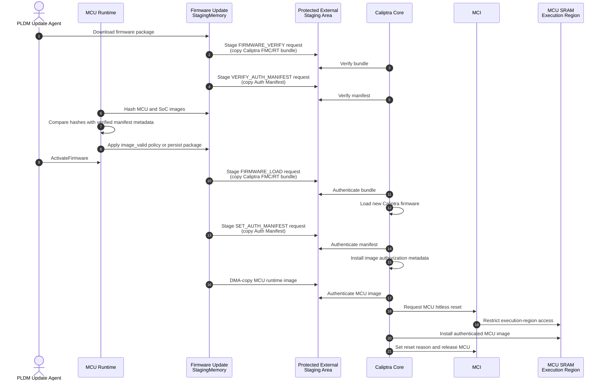
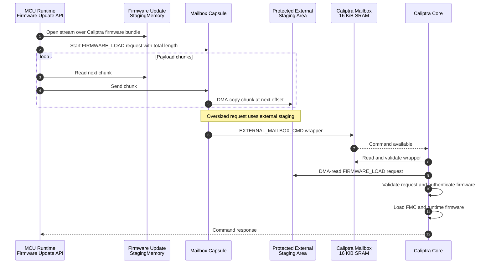
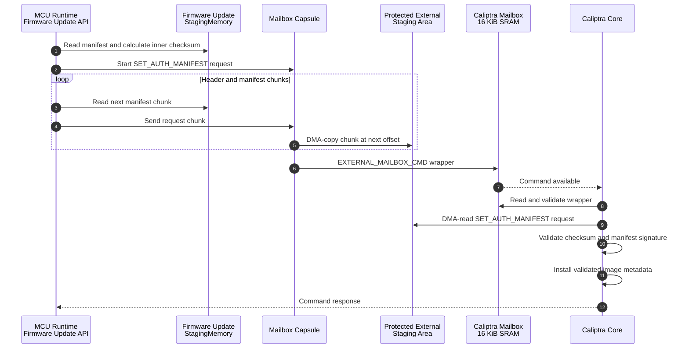
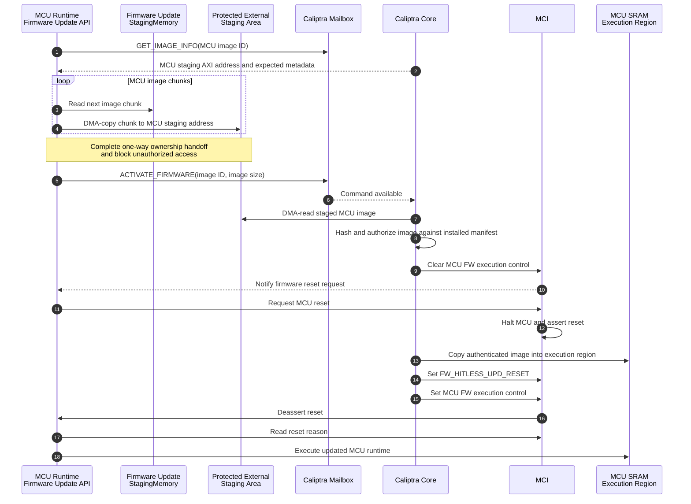

# Hitless Update Memory Flow

This document describes how the firmware update `StagingMemory`, the Caliptra
External Staging Area, and the Caliptra mailbox participate in a hitless update.
It focuses on the `FIRMWARE_LOAD`, `SET_AUTH_MANIFEST`, and
`ACTIVATE_FIRMWARE` commands.

## Memory Roles

| Memory | Purpose | Access requirements |
| --- | --- | --- |
| Firmware update `StagingMemory` | Platform-defined storage that receives the complete PLDM package. It may be RAM, flash, or another storage device. | MCU runtime must be able to read and write it. It does not have to be directly accessible to Caliptra DMA. |
| External Staging Area | DMA-accessible memory used for oversized Caliptra mailbox requests and for images that Caliptra processes through DMA. | MCU and Caliptra must be able to address it. The integrator must prevent other agents from reading or modifying data while Caliptra is processing it. |
| Caliptra mailbox SRAM | Carries commands, small request payloads, responses, and the wrapper for oversized requests. | Access is controlled by the Caliptra mailbox protocol. The subsystem mailbox size is 16 KiB. |
| MCU SRAM execution region | Holds the authenticated MCU runtime image after Caliptra installs it. | MCI and Caliptra control write access and MCU reset during the hitless update. |

`StagingMemory` and the External Staging Area are different logical roles. They
may use the same physical memory only when that memory is DMA-accessible and the
integration enforces the External Staging Area access-control requirements.

## Hitless Update Overview

The verification commands shown before activation are the PLDM verification
phase. Activation must still authenticate the bytes consumed by each command;
the earlier checks alone do not remove a time-of-check/time-of-use risk.

## FIRMWARE_LOAD

The firmware update API creates a payload stream over the Caliptra firmware
bundle in `StagingMemory`. For a request larger than 16 KiB, the mailbox capsule
copies the complete inner request to the External Staging Area and sends an
`EXTERNAL_MAILBOX_CMD` wrapper through the Caliptra mailbox. The wrapper contains
the `FIRMWARE_LOAD` command ID, request size, and external AXI address.

If the complete request fits in the 16 KiB Caliptra mailbox, the capsule writes
the original `FIRMWARE_LOAD` request directly to mailbox SRAM and does not use
the External Staging Area for that request.

## SET_AUTH_MANIFEST

`SET_AUTH_MANIFEST` uses the same streamed mailbox path. Caliptra authenticates
the manifest read from the External Staging Area before installing its image
authorization metadata.

As with `FIRMWARE_LOAD`, a request that fits in the Caliptra mailbox bypasses
the External Staging Area.

## ACTIVATE_FIRMWARE

For an MCU runtime update, the firmware update API first obtains the MCU image
staging address from Caliptra. It then copies the MCU image from `StagingMemory`
to that DMA-accessible address. The `ACTIVATE_FIRMWARE` request is small and is
sent directly through the Caliptra mailbox; the MCU image itself remains in the
External Staging Area for Caliptra to authenticate and install.

## Security Requirements

The External Staging Area is part of the Caliptra cryptographic boundary while
Caliptra processes its contents. The SoC integrator must implement mailbox-like
access restrictions that prevent unauthorized agents from reading or modifying
the staged request or image. For a one-way ownership handoff, the integrator
must lock the completed staging contents for exclusive Caliptra access and must
not release that lock until Caliptra completes the operation.

Copying data from `StagingMemory` to the External Staging Area is not, by itself,
a security check. Caliptra must authenticate the bytes it consumes after the
copy, and the destination must remain protected from authentication through
use. Modification of an untrusted `StagingMemory` may cause an update to fail,
but it must not result in unauthenticated firmware execution.

See also:

- [Firmware Update](./firmware_update.md)
- [Caliptra Mailbox Command Processing](./caliptra_mailbox_processing.md)
- [Caliptra External Staging Area](https://github.com/chipsalliance/caliptra-rtl/blob/patch_v2.1/docs/CaliptraIntegrationSpecification.md#external-staging-area)
- [MCU Hitless Firmware Update](https://github.com/chipsalliance/caliptra-ss/blob/main/docs/CaliptraSSIntegrationSpecification.md#mcu-hitless-fw-update)
