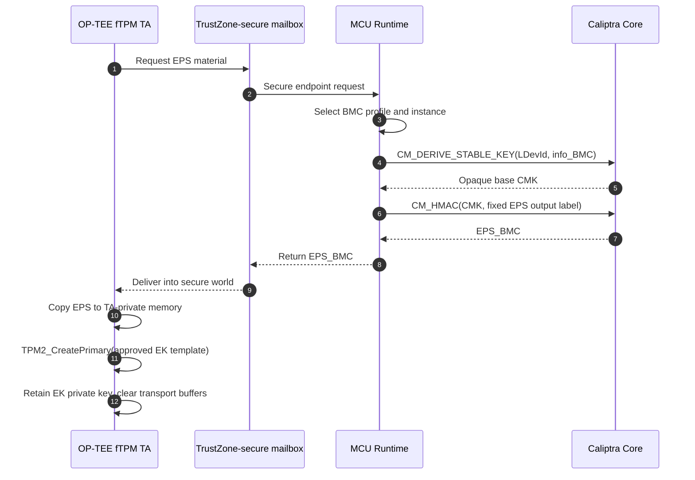
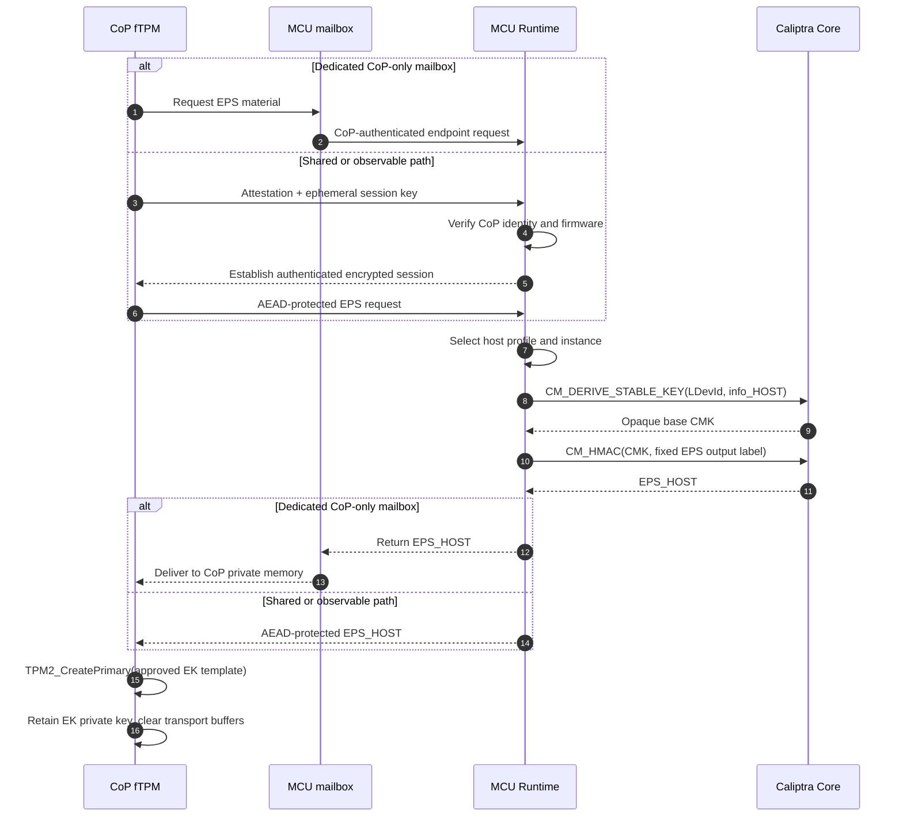

# Hydra V2 fTPM EK Derivation Proposal

**Status:** Discussion draft for Microsoft and Nuvoton
**Scope:** BMC TrustZone fTPM and host CoP fTPM endorsement-key derivation and trust establishment. EK certificate provisioning and persistent NV storage are deferred to Part 2.

## Objective

Hydra V2 replaces the Hydra V1 TIP back-end RoT with Caliptra Core and trusted MCU Runtime. The proposal preserves the Hydra V1 pull model:

- The fTPM requests stable, instance-specific Endorsement Primary Seed (EPS) material from the RoT.
- The RoT does not export its identity root or an EK private key.
- The fTPM runs the TPM-defined primary-key derivation locally and keeps the EK private key within its protected execution environment.

Hydra V2 supports two independent fTPMs:

1. BMC fTPM running as an OP-TEE trusted application in TrustZone.
2. Host fTPM running in a dedicated CoP security boundary.

## Proposed Key Hierarchy

Stable LDevID is the proposed root because it represents the owner/platform identity and chains to Caliptra IDevID. Normal firmware measurements remain outside EPS derivation so routine firmware updates do not change a certified EK.

```text
Caliptra Stable LDevID
    |
    +-- BMC_TRUSTZONE_FTPM, instance 0 --> EPS_BMC
    |
    +-- HOST_COP_FTPM, instance 0      --> EPS_HOST
```

MCU constructs the derivation context; the requester cannot select the root, profile, instance, label, or output size.

```text
info = SHA-256(
    "HydraV2/fTPM/EPS/v1" ||
    profile_id ||
    instance_id
)

base_cmk = CM_DERIVE_STABLE_KEY(LDevId, info)

EPS = Truncate_N(
    CM_HMAC(base_cmk, "HydraV2/fTPM/EPS-output/v1")
)
```

`N` is fixed by the Microsoft fTPM profile. Hydra V1 implementation evidence indicates a 32-byte EPS request.

The Stable LDevID root and the interior key represented by `base_cmk` remain inside Caliptra Core. Only the domain-separated EPS material crosses to the requesting fTPM. `EPS_BMC` and `EPS_HOST` are cryptographically independent.

## EK Generation

The fTPM uses the returned EPS with the approved TCG EK template:

```text
TPM2_CreatePrimary(
    primaryHandle    = TPM_RH_ENDORSEMENT,
    inPublic         = approved EK template,
    inSensitive.data = empty
)
```

The same EPS and exact template reproduce the same EK after reset. Therefore:

- The EK private key need not be stored in external persistent storage.
- The EK private key remains in OP-TEE secure memory or CoP private memory.
- Only the EK public key is exposed outside the fTPM.
- EPS and temporary mailbox copies are cleared when no longer needed. EPS remains available in protected fTPM memory if the implementation permits later creation of endorsement primary objects.

## BMC TrustZone fTPM Flow

1. Caliptra boots authenticated firmware and MCU Runtime enters the trusted boundary.
2. OP-TEE authenticates and authorizes the signed fTPM trusted application.
3. The fTPM requests EPS material through the TrustZone-secure mailbox.
4. MCU maps the hardware endpoint to `BMC_TRUSTZONE_FTPM`, derives `EPS_BMC`, and returns it.
5. The fTPM copies EPS into TA-private memory, clears the mailbox buffer, and recreates its EK.



Message-level encryption is not required if hardware provides all channel properties:

- mailbox memory is Secure and inaccessible to normal-world CPUs and DMA;
- only MCU and the secure-world endpoint can access it;
- AXI requester identities and access-control registers are locked before normal-world boot;
- normal world cannot spoof the secure requester identity; and
- mailbox and temporary buffers are cleared after use and on reset.

In this case hardware isolation provides confidentiality, integrity, and endpoint authentication. OP-TEE provides the second authorization boundary between secure-world applications.

## Host CoP fTPM Flow

The CoP replaces TrustZone as the fTPM security boundary. It must provide:

- immutable boot ROM and authenticated firmware boot;
- firmware anti-rollback and production debug lock;
- private SRAM inaccessible to host, BMC normal world, and non-CoP DMA;
- trusted entropy and reset-time memory clearing; and
- a hardware identity or endpoint that MCU can authenticate.

The preferred transport is a dedicated MCU mailbox with a CoP-exclusive AXI identity configured, locked, and verified by ROM:

1. The CoP fTPM requests EPS material.
2. MCU maps the endpoint to `HOST_COP_FTPM`, derives `EPS_HOST`, and returns it.
3. The CoP copies EPS into private memory, clears transport buffers, and recreates its EK.

If the mailbox or shared memory is observable by host software, or if requesters share an AXI identity, MCU and CoP must first establish an authenticated encrypted session. CoP attestation must bind its verified firmware, hardware identity, MCU challenge, and an ephemeral session key. The EPS response is then encrypted to that session.



## Trust Establishment

The trust chain for seed release is:

```text
Caliptra ROM and identity root
    -> authenticated Caliptra firmware
    -> authenticated MCU Runtime
    -> hardware-authenticated TrustZone or CoP endpoint
    -> authorized fTPM implementation
```

The fTPM EK is stable across normal reset and firmware update. A BMC/Caliptra replacement changes the root and therefore changes both fTPM identities. Ownership-transfer behavior must be defined because LDevID depends on owner-programmed Field Entropy.

External endorsement of the EK public key, EK certificate handling, and remote-attestation enrollment are Part 2 work items.

## Nuvoton Discussion Items

1. Can TrustZone and CoP use separate mailbox/shared-memory regions with exclusive AXI identities locked before normal-world boot?
2. What mechanisms prevent normal-world CPUs and DMA masters from accessing the TrustZone mailbox and OP-TEE private memory?
3. What verified-boot, anti-rollback, private-memory, debug-lock, and reset-clearing guarantees does the CoP provide?
4. If the CoP path is shared or observable, what authenticated encrypted-session mechanism can the platform support?
5. How will OP-TEE authorize only the fTPM TA to request the BMC profile's EPS material?
6. What reset and error behavior guarantees that mailbox, MCU temporary buffers, and CoP/TrustZone transport buffers are cleared?

## Deferred to Part 2

- EK public-key endorsement and certificate provisioning
- RoT-backed fTPM NV storage and encryption
- rollback protection and atomic state updates
- `TPM2_Clear`, `TPM2_ChangeEPS`, ownership transfer, recovery, and migration