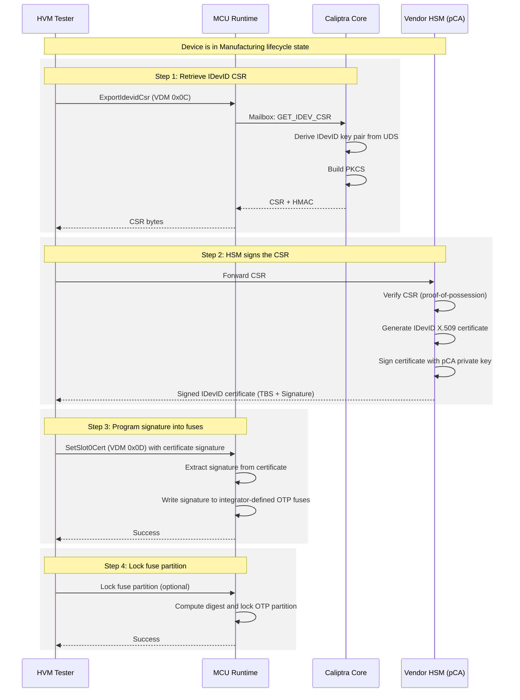
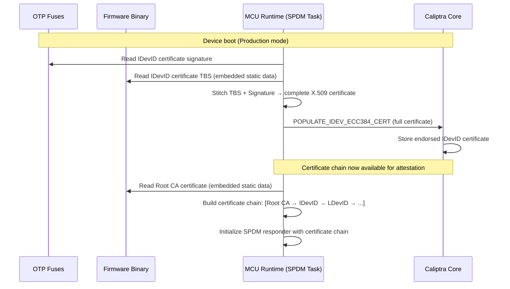
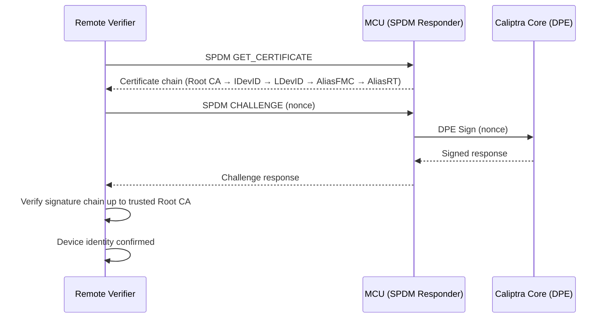

# IDevID Certificate Signature Fuse Provisioning in MCU

## Overview

Each Caliptra-based chip requires a unique cryptographic identity called **IDevID** (Initial Device Identity, per IEEE 802.1AR). This identity is provisioned during manufacturing and persists for the lifetime of the device.

Caliptra Core generates the IDevID key pair and CSR internally, but **does not allocate fuses for the IDevID certificate signature**. It is the SoC integrator's (MCU's) responsibility to store and manage the endorsed IDevID certificate.

This document describes the provisioning flow, the data model, and the MCU implementation.

---

## Background Concepts

### X.509 Certificate Structure

An X.509 certificate consists of three parts:

```
┌─────────────────────────────┐
│  TBS (To-Be-Signed)         │  ← Subject, public key, extensions, validity, etc.
├─────────────────────────────┤
│  Signature Algorithm ID     │  ← e.g., ecdsa-with-SHA384
├─────────────────────────────┤
│  Signature Value            │  ← Cryptographic signature over the TBS
└─────────────────────────────┘
```

- **TBS**: Contains all certificate data (subject name, public key, validity period, extensions). For template-based certificates, the TBS structure is mostly fixed per product line — only device-specific fields (public key, serial number, Subject Key Identifier) vary.
- **Signature**: The HSM's cryptographic endorsement of the TBS. Unique per device.

### Key Terms

| Term | Definition |
|------|-----------|
| **IDevID** | Initial Device Identity — a permanent, non-renewable cryptographic identity |
| **CSR** | Certificate Signing Request — a PKCS#10 message containing the device's public key, sent to a CA for endorsement |
| **HSM** | Hardware Security Module — a tamper-resistant device that holds the vendor's CA private key and performs signing |
| **pCA** | Provisioning Certificate Authority — the vendor's CA that signs IDevID certificates |
| **TBS** | To-Be-Signed — the data portion of a certificate (everything except the signature) |
| **UDS** | Unique Device Secret — per-device entropy used to derive the IDevID key pair |
| **OTP** | One-Time Programmable fuses |

---

## Certificate Storage Model

### ECC (ECDSA P384)

- Signature size: **96 bytes** (two 48-byte coordinates: R and S)
- Total certificate: ~547 bytes
- **Option A**: Entire certificate stored in fuses (feasible due to small size)
- **Option B**: Signature in fuses, TBS in firmware code

### MLDSA-87 (Post-Quantum)

- Signature size: **4627 bytes**
- Total certificate: significantly larger
- **Only Option**: Signature in fuses, TBS in firmware code (too large for fuses otherwise)

### Default Implementation

The default implementation splits the certificate:

| Data | Storage | Rationale |
|------|---------|-----------|
| Root CA certificate (pCA) | Embedded in firmware binary | Public, same for all devices of a product line |
| IDevID certificate TBS | Embedded in firmware binary | Mostly templated; device-specific fields patched at runtime via Caliptra APIs |
| IDevID certificate signature | **OTP fuses** (integrator-defined) | Unique per device, must survive firmware updates and be non-erasable |

Integrators may customize this via a trait that controls where each piece is stored.

---

## Manufacturing Provisioning Flow

### Prerequisites

- Device lifecycle is in **Manufacturing mode** (IDevID CSR generation only works in this state)
- UDS and IDevID certificate attribute fuses have been programmed
- Caliptra firmware is loaded and running

### Sequence Diagram



---

## Boot-Time Certificate Reconstruction

On every subsequent boot, the MCU reconstructs the full IDevID certificate from its components and provides it to Caliptra.



---

## Attestation Flow (Post-Provisioning)

Once the certificate chain is established, the device can respond to attestation challenges.



---

## VDM Commands

### ExportIdevidCsr (0x0C)

Retrieves the IDevID Certificate Signing Request from Caliptra.

- **Precondition**: Device must be in **Manufacturing** lifecycle state
- **Response**: PKCS#10 CSR bytes
- **Status**: ECC version implemented by Parvathi; MLDSA may need a separate command

### SetSlot0Cert (0x0D)

Programs the IDevID certificate signature into fuses.

- **Input**: Certificate signature bytes (96 bytes for ECC, 4627 bytes for MLDSA)
- **Action**: Writes signature to integrator-defined OTP fuses via MCU
- **Status**: Command defined but **not yet implemented** (returns `InvalidCommand`)
- **Note**: Focus on fuse programming; the TBS portion is handled separately

### GetSlot0State (0x0E)

Queries the provisioning state of slot 0.

- **Response**: Whether the IDevID certificate has been provisioned
- **Status**: Command defined but **not yet implemented**

---

## Code Architecture

### Current State (Temporary)

The entire signed IDevID certificate is hardcoded as a static byte array:

```
platforms/emulator/runtime/userspace/apps/user/src/spdm/
├── endorsement_certs/
│   ├── mod.rs              ← populate_idev_cert() reads static cert & sends to Caliptra
│   └── slot0.rs            ← SLOT0_ECC_DEVID_CERT_DER (full cert, hardcoded)
├── cert_store/             ← Certificate store trait implementations
├── device_cert_store.rs    ← Global cert store with static storage
└── mod.rs                  ← SPDM task entry point
```

### Target State (After Implementation)

```
platforms/emulator/runtime/userspace/apps/user/src/spdm/
├── endorsement_certs/
│   ├── mod.rs              ← populate_idev_cert() reads fuses + TBS, stitches, sends to Caliptra
│   └── slot0.rs            ← Root CA cert (static) + IDevID TBS template (static)
├── cert_store/             ← Certificate store trait implementations
└── ...

common/mctp-vdm/src/protocol/
└── commands.rs             ← SetSlot0Cert command handling

runtime/userspace/api/spdm-lib/src/vdm_handler/
└── caliptra_vdm/mod.rs     ← SetSlot0Cert VDM handler (fuse write logic)
```

### Key Interfaces

```
┌──────────────────────────────────────────────────────────┐
│                    Integrator Trait                        │
│                                                          │
│  fn store_idevid_signature(sig: &[u8]) → Result<()>      │  ← Write sig to fuses
│  fn read_idevid_signature() → Result<Vec<u8>>            │  ← Read sig from fuses
│  fn read_idevid_tbs() → &[u8]                           │  ← Get TBS (from code or NV)
│  fn reconstruct_idevid_cert() → Result<Vec<u8>>          │  ← Stitch TBS + sig
│                                                          │
│  Default impl: sig → OTP fuses, TBS → embedded in code   │
│  Integrator can override for custom storage               │
└──────────────────────────────────────────────────────────┘
```

---

## Fuse Layout

The IDevID certificate signature fuses are **integrator-defined** — Caliptra does not prescribe their location. Per the spec:

> "Caliptra does not allocate fuses in its fuse map for the IDevID certificate signature."

For the default/emulator implementation:

| Field | Size (ECC) | Size (MLDSA) | Partition |
|-------|-----------|-------------|-----------|
| IDevID cert signature | 96 bytes | 4627 bytes | Integrator-defined |

These fuses are:
- **Read/written by MCU only** (not by Caliptra Core)
- Programmed during manufacturing after HSM endorsement
- Locked (partition digest) before transitioning to Production lifecycle

---

## Open Items

1. **Certificate splitting logic** — How exactly to parse a DER-encoded X.509 certificate into TBS and signature components. Vishal to provide details.
2. **MLDSA support** — Whether `ExportIdevidCsr` needs a separate command for MLDSA CSRs, or if the existing command supports both.
3. **Fuse partition assignment** — Which OTP partition the signature fuses belong to for the default implementation.
4. **Error handling** — Behavior when fuses are already programmed (re-provisioning attempt).

---

## References

- [Caliptra 2.0 Specification — Provisioning IDevID During Manufacturing](https://chipsalliance.github.io/Caliptra/2.0/specification/HEAD/#sec:idev-during-manufacturing)
- [Caliptra 2.0 Specification — IDevID Certificate Format](https://chipsalliance.github.io/Caliptra/2.0/specification/HEAD/#idevid-certificate)
- [Caliptra 2.0 Specification — Fuse Map](https://chipsalliance.github.io/Caliptra/2.0/specification/HEAD/#fuse-map)
- [IEEE 802.1AR — Secure Device Identity](https://1.ieee802.org/security/802-1ar/)
- [PKCS#10 — Certificate Signing Request](https://datatracker.ietf.org/doc/html/rfc2986)
