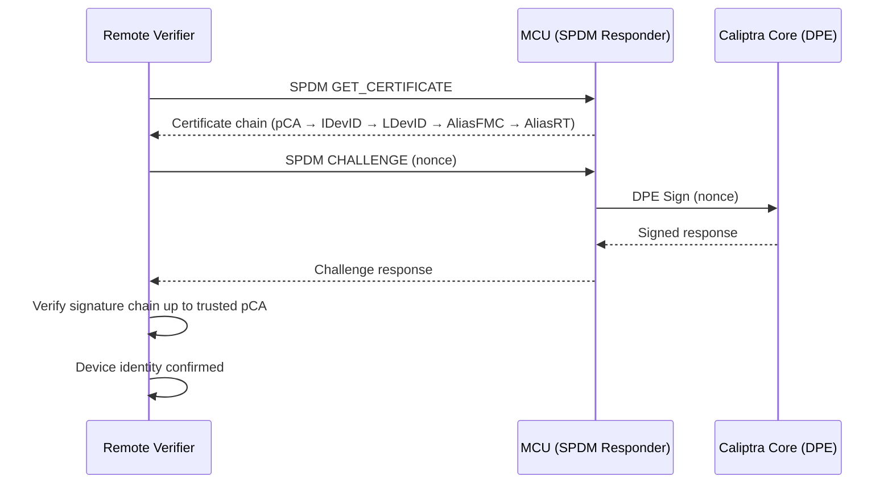
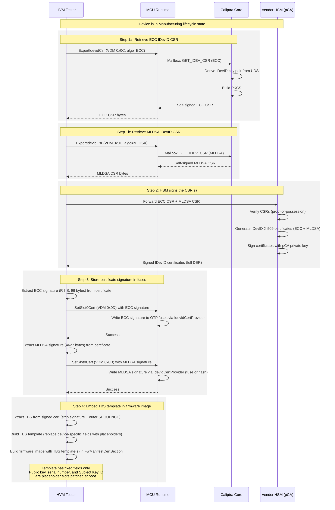

# IDevID Certificate Signature Fuse Provisioning in MCU

## Overview

The IDevID certificate is essential for Remote Attestation. When MCU Runtime boots, it must be able to reconstruct the certificate chain that includes the IDevID certificate.




---

### Key Terms

| Term | Definition |
|------|-----------|
| **IDevID** | Initial Device Identity — a permanent, non-renewable cryptographic identity |
| **CSR** | Certificate Signing Request — a PKCS#10 message containing the device's public key, sent to a CA for endorsement |
| **HSM** | Hardware Security Module — a tamper-resistant device that holds the vendor's CA private key and performs signing |
| **HVM** | High Volume Manufacturing — the production environment where devices are provisioned |
| **pCA** | Provisioning Certificate Authority — the vendor's CA that signs IDevID certificates |
| **TBS** | To-Be-Signed — the data portion of a certificate (everything except the signature) |
| **UDS** | Unique Device Secret — per-device entropy used to derive the IDevID key pair |
| **OTP** | One-Time Programmable fuses |

---

## Certificate Storage Model

### Fuse Storage Options


The IDevID certificate is reconstructed at boot using a **template-based approach**, as recommended by the [Caliptra 2.0 specification](https://chipsalliance.github.io/Caliptra/2.0/specification/HEAD/#idevid-certificate):

> *"It is recommended that the vendor define an IDevID certificate template such that the SoC at runtime can reconstruct the same certificate that the pCA endorsed. The SoC is recommended to store the IDevID certificate signature in fuses and the IDevID certificate template in the firmware image."*

The certificate **signature** must reside in immutable storage (OTP fuses) to prevent a compromised firmware update from substituting a forged certificate. The **TBS template** is stored in the firmware binary image, and **device-specific fields** (public key, serial number, Subject Key Identifier) are derived at boot from the IDevID public key retrieved via Caliptra mailbox commands.

| Algorithm | Fuse Storage | Binary Image | Caliptra Command (boot) |
|-----------|-------------|-------------|------------------------|
| **ECC P384** | Signature (R ‖ S) = **96 bytes** | TBS template | `GET_IDEV_ECC384_INFO` → public key |
| **MLDSA-87** | Signature = **4,627 bytes** (see note) | TBS template | `GET_IDEV_MLDSA87_INFO` → public key |

> **Note**: It is the **integrator's responsibility** to allocate sufficient fuse space to store the signature — whether by expanding the OTP controller partitions, provisioning external SoC fuses, or using another immutable storage mechanism appropriate for their platform (e.g. EPROM).

### Reconstruction Approach


| Certificate Field | Value | Source | When Available |
|---|---|---|---|
| Version | v3 (2) | Static | Template |
| Serial Number (20B) | SHA256(DER(pubkey)) last 20B, masked | Derived from public key | Boot (computed) |
| Issuer Name | pCA's Subject Name | Static per vendor | Template |
| Validity notBefore | Vendor-defined | Static per vendor | Template |
| Validity notAfter | 99991231235959Z | Static | Template |
| Subject Name CN | "Caliptra 1.0 IDevID" | Static | Template |
| Subject Name serialNumber | Hex(SHA256(DER(pubkey))) | Derived from public key | Boot (computed) |
| SubjectPublicKeyInfo Algorithm | ecdsa-with-SHA384 | Static | Template |
| SubjectPublicKeyInfo Public Key | idev\_pub\_x + idev\_pub\_y | `GET_IDEV_ECC384_INFO` | Boot (Caliptra cmd) |
| Signature Algorithm | ecdsa-with-SHA384 | Static | Template |
| **Signature Value** | R (48B) + S (48B) = **96 bytes** | **OTP Fuses** | **Provisioning** |
| KeyUsage | keyCertSign | Static | Template |
| Basic Constraints | CA=TRUE, pathLen=5 | Static | Template |
| Subject Key Identifier (20B) | Derived per fuse Flags\[1:0\] | Derived from pubkey + fuse flag | Boot (computed) |
| tcg-dice-Ueid | UEID type + serial | IDevID attribute fuses | Boot (fuse read) |
| *Vendor extensions* | e.g., AIA | Static per vendor | Template |

---

## Manufacturing Provisioning Flow

### Prerequisites

- Device lifecycle is in **Manufacturing mode** (IDevID CSR generation only works in this state)
- UDS and IDevID certificate attribute fuses have been programmed
- Caliptra firmware is loaded and running

### Sequence Diagram





## VDM Commands

### ExportIdevidCsr (0x0C)

Retrieves the IDevID Certificate Signing Request from Caliptra for a specified algorithm.

- **Input**: Algorithm parameter — ECC or MLDSA
- **Precondition**: Device must be in **Manufacturing** lifecycle state
- **Response**: Self-signed PKCS#10 CSR bytes for the requested algorithm
- **Note**: Called once per algorithm (ECC and MLDSA separately). The Caliptra runtime returns individual self-signed CSRs (not the ROM-phase HMAC envelope). The standard PKI flow applies — the pCA verifies the CSR and signs it.
- **Status**: ECC version implemented by Parvathi; MLDSA retrieval TBD (may use a separate mailbox command)

### SetSlot0Cert (0x0D)

Stores the IDevID certificate **signature** via the `IdevidCertProvider`.

- **Input**: Algorithm (ECC=0x01, MLDSA=0x02) + signature data (ECC: 96 bytes R‖S; MLDSA: 4,627 bytes)
- **Action**: Delegates to the `IdevidCertProvider::store_idevid_signature()` trait method. The default implementation writes the signature to OTP fuses (ECC) or flash (MLDSA, if fuse expansion is not available).
- **Status**: Command handler implemented; default provider returns `Ok(())`
- **Note**: Called twice during provisioning — once for ECC, once for MLDSA

### GetSlot0State (0x0E)

Queries the provisioning state of slot 0.

- **Response**: Whether the IDevID certificate has been provisioned
- **Status**: Command defined but **not yet implemented**

---


### Key Interfaces

```rust
/// Trait for integrators to customize IDevID certificate storage and reconstruction.
///
/// Default impl: ECC signature in OTP fuses (96 bytes), TBS template in firmware image,
/// public key retrieved from Caliptra at boot via GET_IDEV_INFO commands.
pub trait IdevidCertProvider {
    /// Store the IDevID certificate signature for the given algorithm.
    /// Called during manufacturing provisioning (SetSlot0Cert).
    /// ECC: 96 bytes (R ‖ S). MLDSA: 4,627 bytes.
    fn store_idevid_signature(
        &self,
        algo: IdevidAlgo,
        signature: &[u8],
    ) -> Result<(), IdevidCertError>;

    /// Read the stored IDevID certificate signature for the given algorithm.
    /// Returns the number of bytes written to `buf`.
    fn read_idevid_signature(
        &self,
        algo: IdevidAlgo,
        buf: &mut [u8],
    ) -> Result<usize, IdevidCertError>;

    /// Return the TBS template for the given algorithm.
    /// The template contains fixed DER structure with placeholder slots
    /// for public key, serial number, Subject serialNumber, and Subject Key ID.
    fn tbs_template(&self, algo: IdevidAlgo) -> Result<&[u8], IdevidCertError>;


    /// Read the IDevID attribute fuse flags (byte 0, bits [1:0]).
    /// Used to select the Subject Key Identifier derivation algorithm.
    fn idevid_attr_flags(&self) -> Result<u8, IdevidCertError>;
}
```

