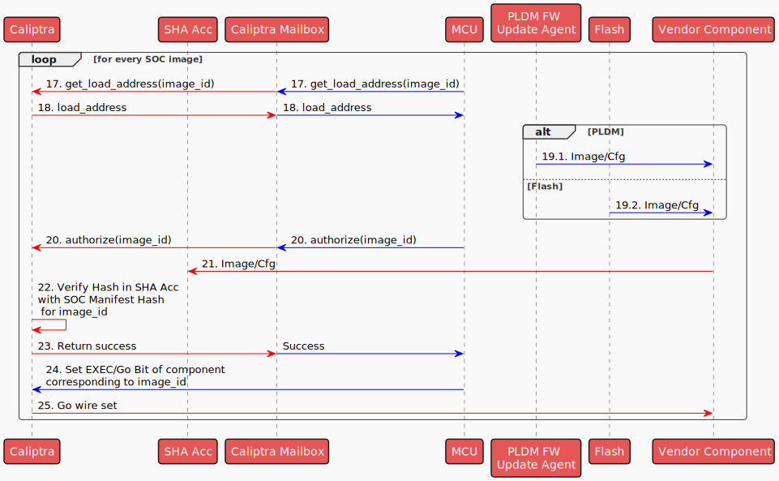

# Image Loading

## Overview

The Image Loading module is a component of the MCU Runtime SDK designed for managing SOC images. This module provides APIs for:

- Loading SOC images to target components. The SOC images could come from a [flash storage](./flash_layout.md) or from another platform capable of streaming images through PLDM T5 (e.g., a BMC Recovery Agent).
- Verifying and authenticating the SOC Images through the Caliptra Core. Images that are loaded to the target SOC components will be authenticated using a mailbox command to the Caliptra core and are verified against the measurements in the SOC Manifest.

The diagram below provides an **example** of how the Caliptra subsystem, integrated with custom SOC elements (highlighted in green), facilitates the loading of SOC images to vendor components.

Custom SOC elements:

* **External Flash** : A flash storage containing SOC manifest and the SOC images.
* **Vendor CPU**: A custom CPU that executes code from a coupled Vendor RAM
* **Vendor RAM**: RAM exclusively used by the Vendor CPU and is programmable via AXI bus.
* **Vendor Cfg Storage**: A volatile memory storage used to contain vendor specific configurations.
* **SOC Images** SOC Image 1 is a firmware for Vendor CPU and loaded to Vendor RAM. SOC Image 2 is a configuration binary to be loaded to Vendor Cfg Storage.
* **SOC Config** : A register accessible by the MCU ROM to select appropriate source (flash or PLDM) for loading the SOC images.
* **Caliptra 'Go' Wire** : A signal controlled by the Caliptra core routed to the reset line of the Vendor CPU.

<p align="center">
    
</p>

## Image Loading Steps

The sequence diagram below shows the high level steps of loading MCU RT image and SOC images.

* *Red Arrows indicates actions taken by Caliptra RT*
* *Purple Arrows indicates actions taken by MCU ROM*
* *Blue Arrows indicates actions taken by MCU RT*
* *Black Arrows indicates actions taken by the PLDM FW Update Agent*

<p align="center">
    <!--- https://www.plantuml.com/plantuml/uml/ZPDHRzem4CVV_IbktSichM5qQxVoK9NHqbPgn0HKcxHMaqaEiEGuaNDXwpxzBWO33epr9R5plxlS_-p_PKdIKfLfyOhcc25aqfQYu6ygKOKq14SzgLL1LXw1BC5lGcHqsuLkaZY2r_lp8PPAJ_BVDUNN8Hdt7boGtpi160sxiO_-h3SXCiGaNw1zXhjMts7-GuXzlR-AeVyD7ir3aKf2wCxGa4keGo7SrxASkvXR2M5opgYhhkVGWM5bZ3ApzHSO3cBHWWtA_MuetZX0yEBun-kYieN6fml7j2Euo-GCOPHNDk4NQapeqRnnVs_L_RtTqy8x5-x0IGJTYkQvLNyGf4dXFfVfLbjZrhrNmOUeASBJmk-vLOlfquKVQWS-SXBAz1cckONHe0UnD6gA9GcfQJdB-d6ybN8QjQCGHLtYQhRkkPb8a7RIJ3Ef41xmhQrkL0VEGdfNn4Rvf-N8q91A966GTqZyvstnxaZ7owFxj_Zpg1sGBzD-pjeRQIRTaUuTmLVeVGCNFkPPjYTZV12t_4_mnZemepPtqCipDaOu7xQGAx4eOML_L_9G9Rve8oIu_dxTQzqCu8kY1ksDm9Vh9eTVoYAKI4slUEGA2HF259QrG9M7QFwpcudt5IZ33PjqC9q2oOb6qR1i-pGARJlshfteQbtvZ24agt21_oalBj6aLQR_0W00 -->
    
</p>

The following steps are done for every SOC image:

<p align="center">
    <!--- https://www.plantuml.com/plantuml/uml/ZLBHRXCn47ptLqoBXE21AmqWe0zLmz5I928GKGeIgIBtRdEnvBDFzXwb_NeSSqvgAG7oa5jxPzQpitlcMJhkMoqEU4KjePNEYoxSgKfrqZ0EIwbLnquUGdgaGmwPNeunhgg82F5kFYPIwHlxAwA6E4TEobbCXgyGUUhBf_SJN7p3tCowMZ9Xt93XY5wdSl25bduLSp7AarTaQkjGshQp9jMeqac4dxQsmp9Ww2UvEqm_br2jR4W4NSz-FBhHFLsV3WsSuFXrWOPueQsi5xAk7Nd_9E8Ngdug7gTM0zDHVNsQx3Z1lwWYGHDr--QR0Wz9sIk3ldAs0oSr__7he7EoQIMOx3tOzIJMrnlsnezGusrnNE3ZMjLHkMo48ErfC3R-xo6D7fA2vxlT6pql87jUMQVkwNzisq_PF9yeOHC3EXEVgkoe6lHUaLFBEro6fg0CXgt6tDmgNiKzc4YZbkGvOkOcRabIiCFJlGCSlIZmbRXt1hwlgh-CS3gaj-vbgbyMc1BZ_FjvUVJ1ufrYsELsdUUciiwH3wTQcGPijt9pSTduHgyAX6gtoX4yyNfyqDPsuYn4VQj_0m00 -->
    
</p>  
The following outlines the steps carried out by the MCU RT during the SOC boot process:

1. MCU ROM reads a SOC Configuration register (implementation specific) to determine the source of the images to load (Flash/PLDM).
2. Caliptra RT authorizes and loads Caliptra RT (refer to [Caliptra Subsystem boot flow](https://github.com/chipsalliance/Caliptra/blob/main/doc/Caliptra.md#subsystem-boot-flow) for the detailed steps).
3. Caliptra switches to Caliptra RT FW.
4. Caliptra RT indicates to Recovery I/F that it is ready for the SOC manifest image (refer to [Caliptra Subsystem Recovery Sequence](https://github.com/chipsalliance/Caliptra/blob/main/doc/Caliptra.md#caliptra-subsystem-recovery-sequence) for the detailed steps).
5. Retrieve SOC Manifest

   1. If image is coming from PLDM, PLDM FW Update Agent transfers SOC manifest to Recovery I/F
   2. If Image is coming from Flash, MCU ROM transfers SOC manifest from flash to Recovery I/F
6. Caliptra RT transfers SOC Manifest to Caliptra Mailbox (MB) SRAM
7. Caliptra RT will authenticate its image sitting in Caliptra MB SRAM
8. Caliptra RT indicates to Recovery I/F that it is ready for the next image that should be the MCU RT Image (refer to [Caliptra Subsystem Recovery Sequence](https://github.com/chipsalliance/Caliptra/blob/main/doc/Caliptra.md#caliptra-subsystem-recovery-sequence) for the detailed steps)..
9. Retrieve MCU RT Image

   1. If Image is coming from PLDM, PLDM FW Update Agent sends MCU RT Image to Recovery I/F (refer to [Caliptra Subsystem boot flow](https://github.com/chipsalliance/Caliptra/blob/main/doc/Caliptra.md#subsystem-boot-flow)).
   2. If Image is coming from Flash, MCU ROM transfers MCU RT Image to Recovery I/F
10. Caliptra RT FW will read the recovery interface registers over AXI manager interface and write the image to MCU SRAM aperture
11. Caliptra RT FW will instruct its SHA accelerator to hash the MCU RT Image in the MCU SRAM.
12. Caliptra RT FW will use this hash and verify it against the hash in the SOC manifest.
13. Once the digest is verified, Caliptra RT FW sets the [EXEC/GO bit](https://chipsalliance.github.io/caliptra-rtl/main/external-regs/?p=caliptra_top_reg.generic_and_fuse_reg.SS_GENERIC_FW_EXEC_CTRL%5B0%5D).
14. The EXEC/GO bit sets a Caliptra wire to MCU (as a consequence of setting the EXEC/GO bit in the previous step). When MCU detects this event, it sets a parameter using the FW HandOff table to indicate the image source (i.e. the image source where it booted from).
15. MCU switches to MCU RT
16. MCU RT retrieves the image source from HandOff table

For every image that needs to be loaded, user initiates a call to load an image identified by an image_id:

17. MCU RT issues a mailbox command to get the load address of the image with the given image_id
18. Caliptra RT responds with the load address if it exists
19. MCU RT writes directly the image to the target load address. (In the example custom SOC design, this will be the Vendor RAM or Vendor Cfg Storage)
20. MCU RT sends a Caliptra mailbox command to authorize the image in the SHA Acc identified by the image_id in the image metadata.
21. Caliptra RT sends the image to the SHA Acc.
22. Caliptra RT verifies the computed hash in SHA acc versus the one in the SOC manifest corresponding to the image_id given.
23. Once verified, Caliptra RT returns Success response to MCU via the mailbox.

Steps 24-25, are SOC design-specific options One option is to use the Caliptra 'Go' register to set the corresponding 'Go' wire to allow the target component to process the loaded image.
24. MCU RT sets the corresponding Go bit in Caliptra register corresponding to the image component.
25. The Go bit sets the corresponding wire that indicates the component can process the loaded image.

## Architecture

The following diagram presents the software stack architecture where the Image Loading module resides.

<p align="left">
    
</p>

At the top of the stack, the user application interacts with the Image Loading module through high-level APIs. The user application is responsible for initiating the image loading and verification.

The Image Loading module provides the interface to retrieve and parse the manifest from the flash storage, and transfer SOC images from the storage to the target destination.

### Application Interfaces

The APIs are presented as methods of the ImageLoader trait.

```rust


/// Trait defining the Image Loading module
pub trait ImageLoader {
    /// Loads the specified image to a storage mapped to the AXI bus memory map.
    ///
    /// # Parameters
    /// image_id: The unsigned integer identifier of the image.
    ///
    /// # Returns
    /// - `Ok()`: Image has been loaded and authorized succesfully.
    /// - `Err(DynError)`: Indication of the failure to load or authorize the image.
    async fn load_and_authorize(&self, image_id: u32) -> Result<(), DynError>;
}
```
