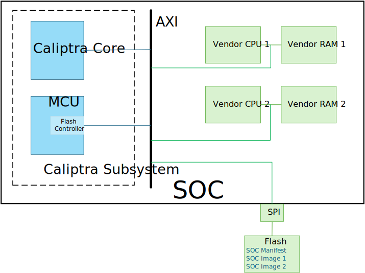
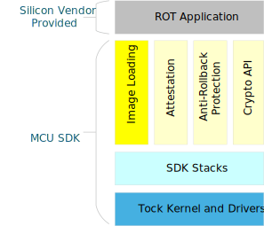

# Image Loading

## Overview

The Image Loading module is a component of the MCU Runtime SDK designed for managing SOC images stored in flash memory. This module provides APIs for:

- Detecting SOC images availability in the [flash storage](./flash_layout.md).
- Parsing the [SOC manifest](https://github.com/chipsalliance/caliptra-sw/blob/main/auth-manifest/README.md).
- Loading SOC images to a target component.

The diagram below illustrates an **example** how the Caliptra subsystem, integrated within the SOC, is used to load SOC images to vendor components. In this example, these are the 2 Vendor CPUs and their corresponding RAMs.

<p align="center">
    
</p>

Pre-image loading state:

* Caliptra MCU Runtime Firmware (MCU RT) is running in the MCU.
* The SOC target components (Vendor CPU 1 and 2) are held in reset.

Image Loading Steps:

The following outlines the steps carried out by the MCU RT during the SOC boot process:

1. The MCU reads the flash partition containing the [SOC Manifest](https://github.com/chipsalliance/caliptra-sw/blob/main-2.x/auth-manifest/README.md), as specified in the [flash storage layout](./flash_layout.md).
2. If the SOC manifest is valid, the MCU RT application copies it to the Caliptra core for authorization using the `SET_AUTH_MANIFEST` mailbox command.
3. For every SOC image defined in the manifest:
   - The Image Loading module determines the flash memory location of the image and passes its contents to a hashing function to retrieve the digest. The Caliptra SHA accelerator can be used for this purpose.
   - The application sends the computed digest and the firmware ID to the Caliptra core for authorization via the `AUTHORIZE_AND_STASH` mailbox command.
4. Once all images are authorized, the MCU RT transfers them to their respective memory locations as specified in the image metadata. This can be accomplished using DMA.
5. The MCU RT application releases the reset of the target components, enabling them to execute the SOC images.

## Architecture

The following diagram presents the software stack architecture where the Image Loading module resides.

<p align="left">
    
</p>

At the top of the stack, the user application interacts with the Image Loading module through high-level APIs. The user application is responsible for initiating the image loading and verification.

The Image Loading module provides the interface to retrieve and parse the manifest from the flash storage, and transfer SOC images from the storage to the target destination.

The MCU SDK exposes APIs to authorize the manifest and verify images through the "Attestation", "Anti-Rollback Protection" and "Crypto" modules.

### Application Interfaces

The APIs are presented as methods of the ImageLoader trait.

```rust

/// Trait defining the Image Loading module
pub trait ImageLoader {
    /// Retrieves the SOC manifest from flash memory asynchronously.
    ///
    /// # Returns
    /// - `Ok(SocManifest)`: The SOC manifest if successfully retrieved.
    /// - `Err(DynError)`: An error if retrieval fails.
    async fn get_soc_manifest(&self) -> Result<SocManifest, DynError>;

    /// Reads a chunk of an image from flash identified by the firmware_id.
    ///
    /// # Arguments
    /// - `firmware_id`: The identifier of the SOC image. This is found in the SOC Manifest.
    /// - `offset`: offset in bytes from the start of the SOC image to read from.
    /// - `buffer`: A mutable buffer to fill with the read data.
    /// - `size_to_read`: The number of bytes to read into the buffer.
    ///
    /// # Returns
    /// - `Ok(usize)`: The actual number of bytes read into the buffer.
    /// - `Err(DynError)`: An error if the read operation fails.
    async fn read_image_chunk(
        &self,
        firmware_id: id,
        buffer: &mut [u8],
        size_to_read: usize,
    ) -> Result<usize, DynError>;

    /// Loads an image from a source address to a destination address using DMA.
    ///
    /// # Arguments
    /// - `firmware_id`: The identifier of the SOC image.
    /// - `destination_address`: The AXI Bus address where the image will be loaded.
    ///
    /// # Returns
    /// - `DMAStatus`: Indicates the success or failure of the operation.
    async fn load_image_with_dma(
        &self,
        firmware_id: u64,
        destination_address: u64
    ) -> DMAStatus;
}
```

## Using ImageLoader in the Application

This section describes how to use ImageLoader to load an image from flash into its designated destination memory. The application interacts with the ImageLoader and the security modules to verify and authorize the image before loading it.

1. Retrieve the SOC manifest from flash using ImageLoader.

```rust
loader.get_soc_manifest().await?
```

2. Pass the manifest to the security module by calling its `set_manifest` API. Refer to the Attestation module documentation for more information how to set the manifest.
3. Compute the digest of the image. Read the image in chunks and send it to the SHA accelerator

```rust
while bytes_remaining > 0 {
    let bytes_read = loader
        .read_image_chunk(firmware_id, &mut buffer, read_size)
        .await?;
    // Pass the chunk to the SHA accelerator
    // e.g. sha_accelerator.update(&buffer[..bytes_read]);
}

// After all the chunks are transfered, get the computed hash
// e.g. let digest = sha_accelerator.finalize()?;
```

3. Authorize the image by calling the `authorize_and_stash` API providing the digest of the image. Refer to the Attestation module documentation for further information.
4. If authorization succeeds, load the image to its designated memory address.

```rust
loader.load_image_with_dma(firmware_id, ime.load_address).await?
```
