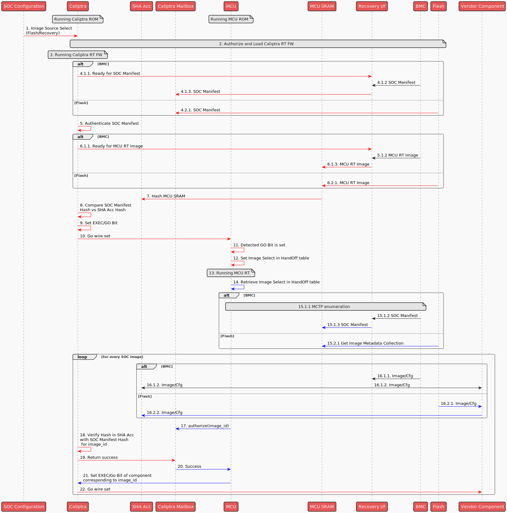

# Image Loading

## Overview

The Image Loading module is a component of the MCU Runtime SDK designed for managing SOC images stored in flash memory. This module provides APIs for:

- Loading SOC images from the [flash storage](./flash_layout.md) or Recovery I/F to target components.
- Retrieving the SOC Image Metadata.
- Verifying and authenticating the SOC Images.
- Indicating control

The diagram below provides an **example** of how the Caliptra subsystem, integrated with custom SOC elements (highlighted in green), facilitates the loading of SOC images to vendor components, such as the Vendor RAM and Vendor Configuration Storage.

Custom SOC elements:

* **External Flash** : Stores SOC images and their associated manifest.
* **SOC Images** SOC Image 1 is a firmware for Vendor CPU and loaded to Vendor RAM. SOC Image 2 is a configuration binary to be loaded to Vendor Configuration Storage.
* **Recovery Interface** : Alternative mechanism for sourcing SOC images and manifest directly from the BMC.
* **SOC Config** : A register accessible by the Caliptra ROM to select appropriate source (flash or BMC) for loading the SOC images.
* **Caliptra Core Go' Wire** : A signal controlled by the Caliptra core, which is routed to the reset line of the Vendor CPU.

<p align="center">
    
</p>

## Image Loading Steps

* *Red Arrows indicates actions taken by Caliptra RT*
* *Blue Arrows indicates actions taken by MCU RT*

<p align="center">
    <!--- https://www.plantuml.com/plantuml/uml/bLLlR_es47xlJt6_JffQgONrJpU95rDfrZ-LXfY0TPF6L9da0fQ2ZPnBM_hfvnmuYHlA-BsAxNly-EwvnyvDJj9IiSp4DrhW4Y5JymNDhLoBbGkeMAsa9ZWQ3oE8Z4xLlB2IbD578FFjIeYCPAPMP2K3_EGJsMCV-d7C23VUlHy6KcKpyrwY_3X43g8_EUY-hG2CH_s1ZxwKan0omjYyebt3K_UUONuXXDqE8ewwRnYupsI-u12Fmk0pwiHOfyvoPJHgObpiPq9eGmZbQPK-FHWLMYizhrPWD1o8BjHGLqUDSfCMe3gW1tVl61TbbzoYHN1VYpcIa0KPNIndQCMcTMV__60n-VVNEe-dfPmZZ4rXO_V136EQwcCkikirEX6xQZXbK0_w1IsCLHy8KYVmkv59ewW9tFzrOFqC5GA4QEGDEPcLMyY8Uz88N7JEE-V2R_U5-PJT0IYJDQJ6GkdbWTGgnPo4OpchKM7CBtkohGj3L2ivp7BSk29CpoKeUFaxwNGI270fMaNw-KPxrAHYIHZG7gRXrS4QiW4d6xTyqZ28jJJqrp647IZYLI3YuNnj5Q-5y3izatk9Ul3egC6_7sAFr7oxfGrLXgbcWjSSjcyS4-vX6IF1tTztKVTX2BUAMaY-zGy6tfH5o97Ah8FORqWO4oQm8G2Lxu3nEQoClzEWj4jD9yCq1PAp3CM-bsOYMeGZ9Alm5V-7jRPPm7_gLigEJVu0T1t1pJ-bsNNVv5bMOBFB3rKX0oIPI98GcSmTpWJSPY4oOrPiKoojnorIR0kVpBULbVEb14Bp0MIBbeVvY6wKpci3iq4QWH-X3jLlRmFmPJbDkBtiDBPKWGhAXrxyr0HnbKuHZwaV4dlL0UcVtsCk-KKb9tlyPwyxy8nMfUkDzPMkd3lLRueMWRyPCzKihMVVH_vpnvkxwKqFs97_BvtIM8NLa1TnZ7akjh7Gp3vMQx3pIXa-rQHGoJhLiR4MSpTBIdUJ-RgEQbDu0L4dKFfBtBXHiSp-0m00 -->
    
</p>

The following outlines the steps carried out by the MCU RT during the SOC boot process:

1. Caliptra ROM reads SOC Configuration to determine if it needs to retrieve Image from Flash or Recovery I/F.
2. Caliptra ROM authorizes and loads Caliptra RT image from the selected source.
3. Caliptra switches to Caliptra RT FW.
4. Retrieve SOC Manifest

   1. If image is coming from Recovery I/F
      1. Caliptra indicates to Recovery I/F that it is ready for the SOC manifest image
      2. BMC transfers manifest to Recovery I/F
      3. Manifest is transfered from Recovery I/F to Caliptra Mailbox for authorization
   2. If Image is coming from Flash
      1. Manifest is transfered from flash to Caliptra Mailbox for authorization
5. SOC Manifest is authenticated
6. Retrieve MCU RT Image

   1. If Image is coming from Recovery I/F
      1. Caliptra indicates to Recovery I/F that it is ready for the MCU RT Image
      2. BMC transfers MCU RT Image to Recovery I/F
      3. MCU RT is transfered to MCU SRAM
   2. If Image is coming from Flash
      1. Flash is transfered from Flash to MCU SRAM
7. Caliptra RT instructs SHA Acc to compute digest of MCU SRAM
8. Caliptra RT verifies computed SHA digest with the SHA digest in SOC Manifest
9. Once digest is verified, the EXEC/GO bit is set
10. The EXEC/GO bit sets a Caliptra wire to MCU
11. MCU ROM detects Caliptra wire got set
12. MCU ROM passes a parameter using the FW HandOff table to indicate the image source
13. MCU switches to MCU RT
14. MCU RT retrieves the image source from HandOff table
15. Retrieve SOC Images Metadata

    1. If Image is coming from Recovery I/F
       1. Do MCTP Enumeration
       2. Retrieve SOC Manifest through PLDM T5 flow
    2. If Image is coming from flash
       1. Read Flash Image Metadata Collection section of Manifest

For every image listed in the Metadata collection:

16. Retrieve the Image (could be Firmware or Configuration payload)

    1. If Image is from Recovery I/F
       1. BMC transfers Image to Recovery I/F
       2. MCU RT streams Image to SHA Accelerator and to target component (identified in the load address in the image metadata)
    2. If Image is from Flash
       1. Image is loaded to the target component (identified in the load address in the image metadata)
       2. MCU RT configures DMA to stream image from component to SHA acc
17. MCU RT sends a Caliptra mailbox command to authorize the image in the SHA Acc identified by the image_id in the image metadata.
18. Caliptra RT verifies the computed hash in SHA acc versus the one in the SOC manifest corresponding to the image_id given.
19. Once verified, Caliptra RT returns Success response in Mailbox.
20. MCU RT receives Success response.

Steps 21-22, are SOC design-specific options and can be changed depending on the use case. One option is to use the Caliptra 'Go' register to set the corresponding 'Go' wire to allow the target component to process the loaded image.
21. MCU RT sets the corresponding Go bit in Caliptra register corresponding to the image component.
22. The Go bit sets the corresponding wire that indicates the component can process the loaded image.

## Architecture

The following diagram presents the software stack architecture where the Image Loading module resides.

<p align="left">
    
</p>

At the top of the stack, the user application interacts with the Image Loading module through high-level APIs. The user application is responsible for initiating the image loading and verification.

The Image Loading module provides the interface to retrieve and parse the manifest from the flash storage, and transfer SOC images from the storage to the target destination.

### Application Interfaces

The APIs are presented as methods of the ImageLoader trait.

```rust


/// Trait defining the Image Loading module
pub trait ImageLoader {
    /// Retrieves the Image Metadata collection. This can come from the Flash storage or the Recovery I/F.
    /// The ImageLoader module automatically selects the appropriate source based on the parameter passed by MCU ROM in the HandOff FW table.
    ///
    /// # Returns
    /// - `Ok(ImageMetadataCollection)`: The ImageMetadataCollection if successfully retrieved.
    /// - `Err(DynError)`: An error if retrieval fails.
    async fn get_imc(&self) -> Result<ImageMetadataCollection, DynError>;

    /// Loads the specified image to a storage mapped to the AXI bus memory map.
    /// If the image will be loaded directly to the target component, the AXI mapped load address in the image metadata can be used.
    ///
    /// # Returns
    /// - `Ok()`: Image has been loaded and authorized succesfully.
    /// - `Err(DynError)`: Indication of the failure to load or authorize the image.
    async fn load_and_authorize(&self, image_id: u32, address: u64) -> Result<(), DynError>;
}
```

## Using ImageLoader in the Application

This section describes how to use ImageLoader to load an image.

1. Retrieve the SOC manifest from flash using ImageLoader.

```rust
loader.get_imc().await?
```

3. Load and authorize the image

```rust
    for entry in &imc.image_metadata_entries {
        loader.load_and_authorize(entry.image_identifier, entry.load_address).await?;
        // Call API to indicate to target component that image is ready.
 
    }
```
