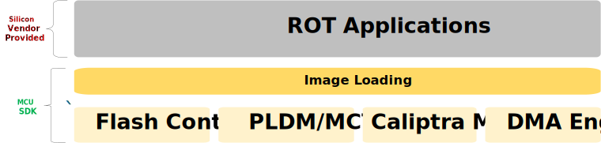

# Image Loading

## Overview

The Image Loading module is a component of the MCU Runtime SDK designed for managing SOC images stored in flash memory. This module provides APIs for:

- Detecting SOC images availability in the [flash storage](./image_loading.md).
- Parsing the [SOC manifest](https://github.com/chipsalliance/caliptra-sw/blob/main/auth-manifest/README.md).
- Loading SOC images to a target component.

The diagram below illustrates an **example** how the Caliptra subsystem, integrated within the SOC, is used to load SOC images to vendor components. In this example, these are the 2 Vendor CPUs and their corresponding RAMs.

<p align="center">
    
</p>

Pre-image loading state:

* Caliptra MCU Runtime Firmware (MCU RT) is running in the MCU.
* The SOC target components (Vendor CPU 1 and 2) are held in reset.

Image Loading Steps:

1. MCU RT checks for available SOC images in the [flash storage](./image_loading.md).
2. MCU RT authorizes the [SOC manifest](https://github.com/chipsalliance/caliptra-sw/blob/main/auth-manifest/README.md) and the SOC images by following steps described in [Manifest-Based Authorization](https://github.com/chipsalliance/caliptra-sw/blob/main-2.x/runtime/README.md#manifest-based-image-authorization-new-in-12) section of the Caliptra Runtime Specification.
3. If the SOC images are authorized and verified, MCU RT releases the reset of the target components.

## Architecture

The following diagram presents the software stack architecture where the Image Loading module resides.

<p align="left">
    
</p>

At the top of the stack, the user application interacts with the Image Loading module through high-level APIs. The user application is responsible for initiating the image loading and verification.

The Image Loading module provides the interface to retrieve and parse the manifest from the flash storage, and transfer SOC images from the storage to the target destination.

The MCU SDK exposes APIs to authorize the manifest and verify images through the "Attestation", "Anti-Rollback Protection" and "Crypto" modules.

### Application Interfaces

The APIs are presented as methods of the ImageLoader struct.

```
/// Image loader module
pub struct ImageLoader;

impl ImageLoader {
    /// APIs
}
```

#### Get SOC Manifest

```rust
/// Retrieves the SOC manifest from flash memory.
///
/// # Returns
/// The SOC manifest if it is successfully read from flash.
pub fn get_soc_manifest(&self) -> Result<SocManifest, DynError>;
```

#### Get Image Metadata Entry

```rust
/// Retrieves an Image Metadata Entry by `firmware_id`.
///
/// # Arguments
/// - `firmware_id`: The unique identifier for the image.
///
/// # Returns
/// The Image Metadata Entry if it exists, or an error if it is not found.
pub fn get_image_metadata(firmware_id: u32) -> Result<ImageMetadataEntry,DynError>;
```

#### Get Image Digest

```rust
    /// Retrieves the digest of an image by `firmware_id`.
    ///
    /// # Arguments
    /// - `firmware_id`: The unique identifier for the image.
    ///
    /// # Returns
    /// The digest (`[u8; 48]`) of the image if it exists, or an error if it is not found.
    pub fn get_image_digest(image_identifier: u16) -> Result<[u8; 48], DynError>;
```

#### Load Image with DMA

```rust
    /// Loads an image from a source address to a destination address using DMA
    /// This is a non-blocking operation, and the completion of the transfer is notified via a callback function.
    ///
    /// # Arguments
    /// - `source_address`: The starting address of the image in flash memory.
    /// - `destination_address`: The memory address where the image will be loaded.
    /// - `size`: The size of the image to transfer in bytes.
    /// - `callback`: A function to handle the status of the transfer.
    ///
    /// # Callback
    /// The callback is a function pointer or closure of type:
    /// ```rust
    /// fn(status: DmaStatus);
    /// ```
    /// Where `DmaStatus` indicates the completion or failure status of the DMA transfer.
    pub fn load_image_with_dma(
        &self,
        source_address: usize,
        destination_address: usize,
        size: usize,
        callback: fn(status: DmaStatus),
    );
```

## Using Image Loading in the Application

This section describes how to use the image_loader module to load an image from flash into its designated destination memory. The application interacts with the image_loader and the security modules to verify and authorize the image before loading it.

### Workflow

1. Retrieve the SOC manifest from flash using the image_loader module.
2. Pass the manifest to the security module by calling its set_manifest API.
3. Authorize the image by calling the authorize_and_stash API of the security module, providing the digest of the image.
4. If authorization succeeds, load the image to its designated memory address.

```rust
    // Initialize the ImageLoader
    let loader = ImageLoader::new(flash, manifest_address);

    // Step 1: Get the SOC Manifest from flash
    let manifest = match loader.get_soc_manifest() {
        Ok(manifest) => manifest,
        Err(e) => {
            // Handle error (e.g., log or halt the system)
            panic!("Failed to retrieve manifest: {}", e);
        }
    };

    // Step 2: Set the manifest in the security module
    // Note refer to the Attestation module for the actual API
    if let Err(e) = security_module.set_manifest(&manifest) {
        // Handle error (e.g., log or halt the system)
        panic!("Failed to set manifest in security module: {}", e);
    }

    // Step 3: Loop over each ImageMetadataEntry in the manifest
    for ime in manifest.image_metadata_collection.image_metadata_entries.iter() {
        let image_identifier = ime.image_identifier; // aka Firwware ID

        // Get the digest of the current image
        let digest = match loader.get_image_digest(image_identifier) {
            Ok(digest) => digest,
            Err(e) => {
                // Handle error for this specific image
                println!(
                    "Skipping image with identifier {} due to digest retrieval error: {}",
                    image_identifier, e
                );
                continue;
            }
        };

        // Authorize and stash the image using the security module
        if let Err(e) = security_module.authorize_and_stash(image_identifier, &digest) {
            // Handle authorization failure for this specific image
            println!(
                "Authorization failed for image with identifier {}: {}",
                image_identifier, e
            );
            continue;
        }

        // Determine the destination address from the image metadata
        let destination_address = ((ime.image_load_address_high as u64) << 32)
            | ime.image_load_address_low as u64;

        // Step 4: Load the image to its designated destination
        loader.load_image_with_dma(
            ime.image_hash.as_ptr() as usize, // Source address (assuming image is stored at hash)
            destination_address as usize,    // Destination address
            ime.image_size as usize,         // Size of the image
            |status| match status {
                DmaStatus::Success => {
                    println!(
                        "Image with identifier {} successfully loaded to 0x{:X}",
                        image_identifier, destination_address
                    );
                }
                DmaStatus::Failure(e) => {
                    println!(
                        "DMA transfer failed for image with identifier {}: {}",
                        image_identifier, e
                    );
                }
            },
        );

        // Step 5: Start the SOC image execution, e.g. releasing SOC CPU reset
    }
```
