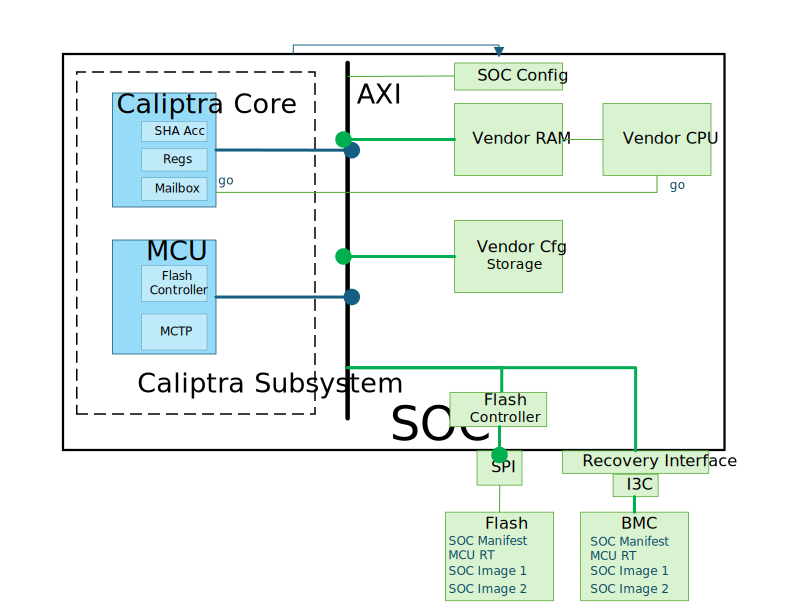
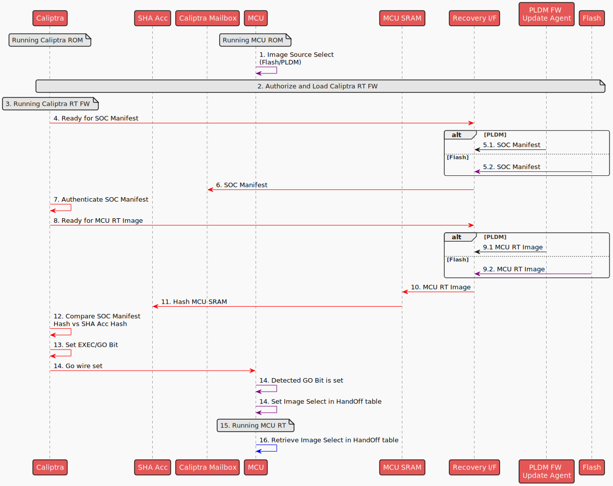

# Image Loading

## Overview

The Image Loading module is a component of the MCU Runtime SDK designed for managing SOC images. This module provides APIs for:

- Loading SOC images to target components. The SOC images could come from a [Flash Storage](./flash_layout.md) or from another platform (e.g. BMC).
- Retrieving the SOC Image Metadata (as defined in the [SOC Manifest](https://github.com/chipsalliance/caliptra-sw/blob/main-2.x/auth-manifest/README.md) documentation)
- Verifying and authenticating the SOC Images.

The diagram below provides an **example** of how the Caliptra subsystem, integrated with custom SOC elements (highlighted in green), facilitates the loading of SOC images to vendor components.

Custom SOC elements:

* **External Flash** : A flash storage containing SOC manifest and the SOC images.
* **BMC** : An external Board Mangement Controller that provides a service to source the SOC images and manifest.
* **Vendor CPU**: A custom CPU which executes code from a coupled Vendor RAM
* **Vendor RAM**: RAM exclusively used by the Vendor CPU and is programmable via AXI bus.
* **Vendor Cfg Storage**: A volatile memory storage used to contain vendor specific configurations.
* **SOC Images** SOC Image 1 is a firmware for Vendor CPU and loaded to Vendor RAM. SOC Image 2 is a configuration binary to be loaded to Vendor Cfg Storage.
* **SOC Config** : A register accessible by the MCU ROM to select appropriate source (flash or BMC) for loading the SOC images.
* **Caliptra 'Go' Wire** : A signal controlled by the Caliptra core routed to the reset line of the Vendor CPU.

<p align="center">
    
</p>

## Image Loading Steps

The sequence diagram below shows the high level steps of loading MCU RT image and SOC images.

* *Red Arrows indicates actions taken by Caliptra RT*
* *Purple Arrows indicates actions taken by MCU ROM*
* *Blue Arrows indicates actions taken by MCU RT*
* *Black Arrows indicates actions taken by BMC FW*

<p align="center">
    <!--- https://www.plantuml.com/plantuml/uml/bLLlR_es47xlJt6_JffQgONrJpU95rDfrZ-LXfY0TPF6L9da0fQ2ZPnBM_hfvnmuYHlA-BsAxNly-EwvnyvDJj9IiSp4DrhW4Y5JymNDhLoBbGkeMAsa9ZWQ3oE8Z4xLlB2IbD578FFjIeYCPAPMP2K3_EGJsMCV-d7C23VUlHy6KcKpyrwY_3X43g8_EUY-hG2CH_s1ZxwKan0omjYyebt3K_UUONuXXDqE8ewwRnYupsI-u12Fmk0pwiHOfyvoPJHgObpiPq9eGmZbQPK-FHWLMYizhrPWD1o8BjHGLqUDSfCMe3gW1tVl61TbbzoYHN1VYpcIa0KPNIndQCMcTMV__60n-VVNEe-dfPmZZ4rXO_V136EQwcCkikirEX6xQZXbK0_w1IsCLHy8KYVmkv59ewW9tFzrOFqC5GA4QEGDEPcLMyY8Uz88N7JEE-V2R_U5-PJT0IYJDQJ6GkdbWTGgnPo4OpchKM7CBtkohGj3L2ivp7BSk29CpoKeUFaxwNGI270fMaNw-KPxrAHYIHZG7gRXrS4QiW4d6xTyqZ28jJJqrp647IZYLI3YuNnj5Q-5y3izatk9Ul3egC6_7sAFr7oxfGrLXgbcWjSSjcyS4-vX6IF1tTztKVTX2BUAMaY-zGy6tfH5o97Ah8FORqWO4oQm8G2Lxu3nEQoClzEWj4jD9yCq1PAp3CM-bsOYMeGZ9Alm5V-7jRPPm7_gLigEJVu0T1t1pJ-bsNNVv5bMOBFB3rKX0oIPI98GcSmTpWJSPY4oOrPiKoojnorIR0kVpBULbVEb14Bp0MIBbeVvY6wKpci3iq4QWH-X3jLlRmFmPJbDkBtiDBPKWGhAXrxyr0HnbKuHZwaV4dlL0UcVtsCk-KKb9tlyPwyxy8nMfUkDzPMkd3lLRueMWRyPCzKihMVVH_vpnvkxwKqFs97_BvtIM8NLa1TnZ7akjh7Gp3vMQx3pIXa-rQHGoJhLiR4MSpTBIdUJ-RgEQbDu0L4dKFfBtBXHiSp-0m00 -->
    
</p>

The following outlines the steps carried out by the MCU RT during the SOC boot process:

1. MCU ROM reads a SOC Configuration register (implementation specific) to determine the source of the images to load (Flash/BMC).
2. Caliptra RT authorizes and loads Caliptra RT (refer to [Caliptra Subsystem boot flow](https://github.com/chipsalliance/Caliptra/blob/main/doc/Caliptra.md#subsystem-boot-flow) for the detailed steps).
3. Caliptra switches to Caliptra RT FW.
4. Caliptra RT indicates to Recovery I/F that it is ready for the SOC manifest image (refer to [Caliptra Subsystem Recovery Sequence](https://github.com/chipsalliance/Caliptra/blob/main/doc/Caliptra.md#caliptra-subsystem-recovery-sequence) for the detailed steps).
5. Retrieve SOC Manifest

   1. If image is coming from BMC, BMC FW transfers manifest to Recovery I/F
   2. If Image is coming from Flash, MCU ROM transfers manifest from flash to Recovery I/F
6. Caliptra RT transfers image to Caliptra Mailbox (MB) SRAM
7. Caliptra RT will authenticate its image sitting in Caliptra MB SRAM
8. Caliptra RT indicates to Recovery I/F that it is ready for the next image which should be the MCU RT Image (refer to [Caliptra Subsystem Recovery Sequence](https://github.com/chipsalliance/Caliptra/blob/main/doc/Caliptra.md#caliptra-subsystem-recovery-sequence) for the detailed steps)..
9. Retrieve MCU RT Image

   1. If Image is coming from BMC, BMC FW transfers MCU RT Image to Recovery I/F
   2. If Image is coming from Flash, MCU ROM transfers MCU RT Image to Recovery I/F
10. Caliptra RT FW will read the recovery interface registers over AXI manager interface and write the image to MCU SRAM aperture
11. Caliptra RT FW will instruct Caliptra HW to read MCU SRAM and generate the hash (Caliptra HW will use the SHA accelerator)
12. Caliptra RT FW will use this hash and verify it against the hash in the SOC manifest.
13. Once digest is verified, the EXEC/GO bit is set
14. The EXEC/GO bit sets a Caliptra wire to MCU (as a consequence of setting the EXEC/GO bit in the previous step)
15. MCU ROM detects Caliptra'go' wire to the MCU got set.
16. MCU ROM passes a parameter using the FW HandOff table to indicate the image source (i.e. the image source where it booted from)
17. MCU switches to MCU RT
18. MCU RT retrieves the image source from HandOff table
19. BMC or a similar platform component will now do MCTP enumeration flow to MCU over I3C.
20. Retrieve SOC Images Metadata

    1. If Image is coming from BMC, retrieve SOC Manifest and Image Metadata Collection through PLDM T5 flow
    2. If Image is coming from flash, read Flash Image Metadata Collection section of Manifest

For every image listed in the Metadata collection:

21. Retrieve the SOC Image (could be Firmware or Configuration payload). MCU RT writes directly the image to the target load address as specified in the image metadata. (In the example custom SOC design, this will be the Vendor RAM or Vendor Cfg Storage)
22. MCU RT sends a Caliptra mailbox command to authorize the image in the SHA Acc identified by the image_id in the image metadata.
23. Caliptra RT verifies the computed hash in SHA acc versus the one in the SOC manifest corresponding to the image_id given.
24. Once verified, Caliptra RT returns Success response in Mailbox.
25. MCU RT receives Success response.

Steps 21-22, are SOC design-specific options One option is to use the Caliptra 'Go' register to set the corresponding 'Go' wire to allow the target component to process the loaded image.
21. MCU RT sets the corresponding Go bit in Caliptra register corresponding to the image component.
22. The Go bit sets the corresponding wire that indicates the component can process the loaded image.

## Architecture

The following diagram presents the software stack architecture where the Image Loading module resides.

<p align="left">
    
</p>

At the top of the stack, the user application interacts with the Image Loading module through high-level APIs. The user application is responsible for initiating the image loading and verification.

The Image Loading module provides the interface to retrieve and parse the manifest from the flash storage, and transfer SOC images from the storage to the target destination.

### Application Interfaces

The APIs are presented as methods of the ImageLoader trait.

```rust


/// Trait defining the Image Loading module
pub trait ImageLoader {
    /// Retrieves the Image Metadata collection from the image source.
    /// The ImageLoader module automatically selects the appropriate image source based on the parameter passed by MCU ROM in the HandOff FW table.
    ///
    /// # Returns
    /// - `Ok(ImageMetadataCollection)`: The ImageMetadataCollection if successfully retrieved.
    /// - `Err(DynError)`: An error if retrieval fails.
    async fn get_imc(&self) -> Result<ImageMetadataCollection, DynError>;

    /// Loads the specified image to a storage mapped to the AXI bus memory map.
    /// If the image will be loaded directly to the target component, the AXI mapped load address in the image metadata can be used.
    ///
    /// # Returns
    /// - `Ok()`: Image has been loaded and authorized succesfully.
    /// - `Err(DynError)`: Indication of the failure to load or authorize the image.
    async fn load_and_authorize(&self, image_id: u32, address: u64) -> Result<(), DynError>;
}
```

## Using ImageLoader in the Application

This section describes how to use ImageLoader to load an image.

1. Retrieve the SOC manifest from flash using ImageLoader.

```rust
loader.get_imc().await?
```

3. Load and authorize the image

```rust
    for entry in &imc.image_metadata_entries {
        loader.load_and_authorize(entry.image_identifier, entry.load_address).await?;
        // Call API to indicate to target component that image has been authenticated and is ready to be executed / processed.
 
    }
```
