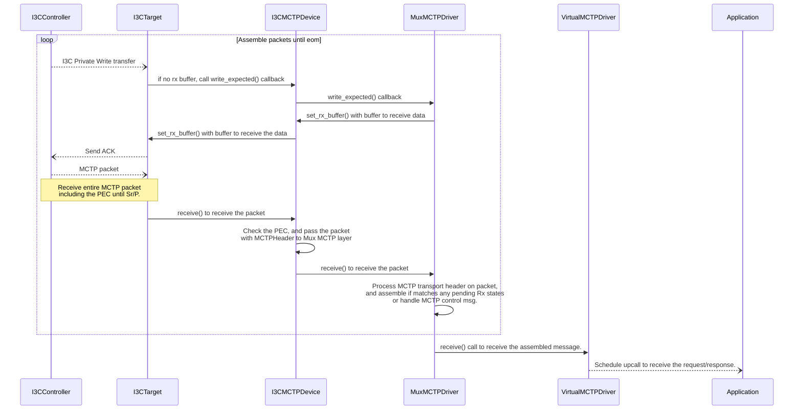
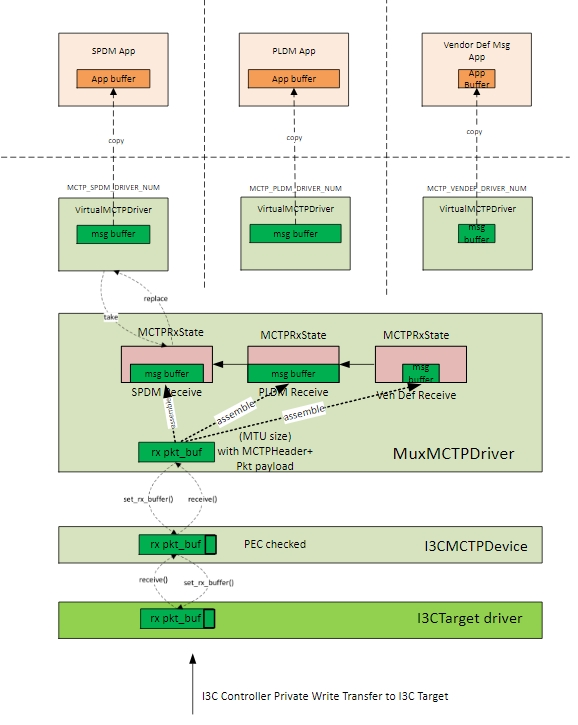
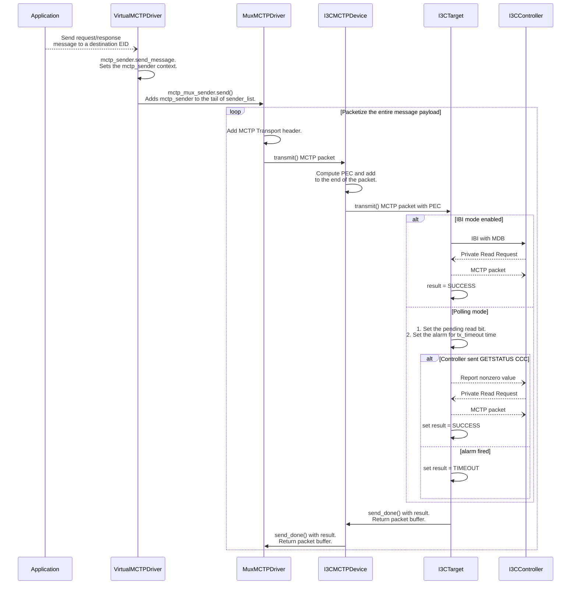
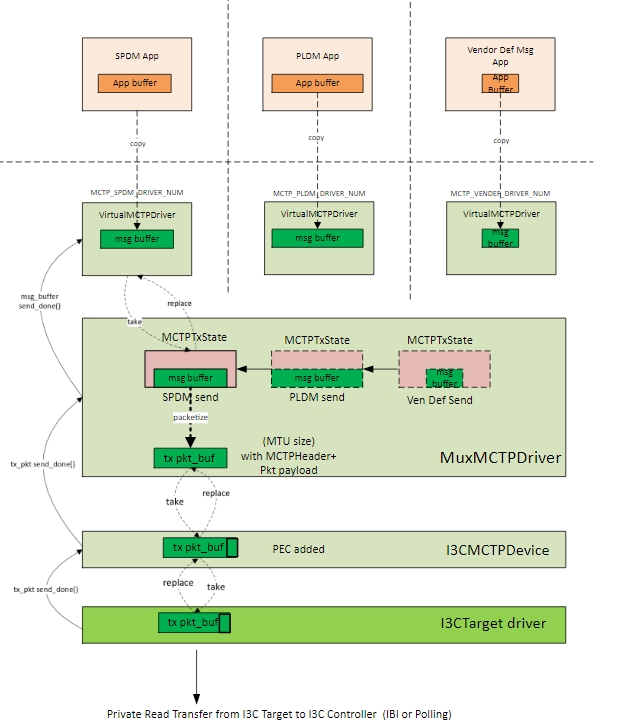

# MCTP Stack
The Caliptra subsystem supports SPDM, PLDM, and Caliptra Vendor-defined message protocols over MCTP.

The MCTP base protocol is implemented as a Tock Capsule driver, which also handles the essential MCTP Control messages. 
Additionally, it offers a syscall interface to userspace, enabling the sending and receiving of MCTP messages for other supported protocols.
Caliptra MCTP endpoint has only one EID and supports dynamic assignment by the MCTP bus owner.

MCTP Packets are delivered over physical I3C medium using I3C transfers. Caliptra MCTP endpoint always plays the role of I3C Target and is
managed by an external I3C controller. Minimum transmission size is based on the MCTP baseline MTU (for I3C it is 69 bytes : 64 bytes MCTP payload + 4 bytes MCTP header + 1 byte PEC). Larger than the baseline transfer may be possible after discovery and negotiation with the I3C controller. The negotiated MTU size will be queried from the I3C Target peripheral driver by MCTP capsule. 


## MCTP Receive sequence



The Receive stack is as shown in the picture below:



## MCTP Send Sequence




The send stack is as shown in the picture below:




## Syscall Library in userspace
Userspace applications can use syscall library in to send and receive MCTP messages. The following APIs are provided by the MCTP syscall library.
Each user space application will instantiate the `AsyncMctp` module with appropriate driver number. The `AsyncMctp` module provides the following APIs to send and receive MCTP messages.

```Rust
//! The MCTP library provides the interface to send and receive MCTP messages.
//! The MCTP library is implemented as an async library to allow the userspace application to send and receive MCTP messages asynchronously.
//! 
//! Usage
//! -----
//!```Rust
//! use mctp::AsyncMctp;
//!
//! const SPDM_MESSAGE_TYPE: u8 = 0x5;
//! const SECURE_SPDM_MESSAGE_TYPE: u8 = 0x6;
//! 
//! #[embassy_executor::task]
//! async fn async_main() {
//!     /// Initialize the MCTP driver with the driver number
//!     let mctp = AsyncMctp::<TockSyscalls>::new(MCTP_SPDM_DRIVER_NUM);
//!
//!     /// Receive the MCTP request
//!     let mut rx_buf = [0; 1024];
//!     let res = mctp.receive_request(0x0, SPDM_MESSAGE_TYPE, &mut rx_buf).await;
//!     match res {
//!         Ok(msg_info) => {
//!             /// Process the received message
//!             /// ........
//!             /// Send the response message
//!             let mut tx_buf = [0; 1024];
//!             let result = mctp.send_response(msg_info.eid, msg_info.msg_tag, &tx_buf).await;
//!             match result {
//!                 Ok(_) => {
//!                     /// Handle the send response success
//!                 }
//!                 Err(e) => {
//!                     /// Handle the send response error
//!                 }
//!             }
//!         }
//!         Err(e) => {
//!             /// Handle the receive request error
//!         }
//!     }
//! }
//!```

/// mctp/src/lib.rs
pub struct AsyncMctp<S:Syscalls, C:Config = DefaultConfig > {
    syscall: PhantomData<S>,
    config: PhantomData<C>,
    driver_num: u32,
}

pub struct MessageInfo {
    pub eid: u8,
    pub msg_tag: u8,
    pub msg_type: u8, /// Needed for SPDM to differentiate between SPDM(0x5) and secured SPDM(0x6) messages
    pub payload_len: usize,
}

impl<S:Syscalls, C:Config> Mctp<S,C> {
    pub fn new(drv_num: u32) -> Self;
    pub fn exists() -> Result<(), ErrorCode>;
    /// Receive the MCTP request from the source EID
    /// 
    /// # Arguments
    /// * `source_eid` - The source EID from which the request is to be received. 
    /// * `message_type` - The message type to receive. This is needed for SPDM to differentiate between SPDM(0x5) and secured SPDM(0x6) messages
    /// * `msg_payload` - The buffer to store the received message payload
    /// 
    /// # Returns
    /// * `MessageInfo` - The message information containing the EID, message tag, message type, and payload length on success
    /// * `ErrorCode` - The error code on failure
    pub async fn receive_request(&self, source_eid: u8, message_type: u8,  msg_payload: &mut [u8]) -> Result<MessageInfo, ErrorCode>;
    /// Send the MCTP response to the destination EID
    ///
    /// # Arguments
    /// * `dest_eid` - The destination EID to which the response is to be sent
    /// * `msg_tag` - The message tag assigned to the request
    /// * `msg_payload` - The payload to be sent in the response
    ///
    /// # Returns
    /// * `()` - On success
    /// * `ErrorCode` - The error code on failure
    pub async fn send_response(&self, dest_eid: u8, msg_tag: u8, msg_payload: &[u8]) -> Result<(), ErrorCode>;
    /// Send the MCTP request to the destination EID

    /// The function returns the message tag assigned to the request.
    ///
    /// # Arguments
    /// * `dest_eid` - The destination EID to which the request is to be sent
    /// * `msg_payload` - The payload to be sent in the request
    ///
    /// # Returns
    /// * `u8` - The message tag assigned to the request
    /// * `ErrorCode` - The error code on failure
    pub async fn send_request(&self, dest_eid: u8, msg_payload: &[u8]) -> Result<u8, ErrorCode>;
    
    /// Receive the MCTP response from the source EID
    ///
    /// # Arguments
    /// * `source_eid` - The source EID from which the response is to be received
    /// * `message_type` - The message type to receive. This is needed for SPDM to differentiate between SPDM(0x5) and secured SPDM(0x6) messages
    /// * `msg_payload` - The buffer to store the received response payload
    ///
    /// # Returns
    /// * `()` - On success
    /// * `ErrorCode` - The error code on failure
    pub async fn receive_response(&self, source_eid: u8, message_type: u8, msg_payload: &mut [u8]) -> Result<(), ErrorCode>;
}
```

## Userspace Driver and Virtualizer layer
During the board initialization, three separate instances of the virtual MCTP driver are created, each assigned a unique driver number. These instances correspond to the SPDM, PLDM, and Vendor Defined message types. Each driver instance is designed to communicate directly with its corresponding protocol application.

```Rust
/// define custom driver numbers for Caliptra
pub enum NUM {
    ...
    // Mctp
    MctpSpdm                  = 0xA0000,
    MctpPldm                  = 0xA0001,
    MctpVenDef                = 0xA0002,

    ...
}


/// mctp/driver.rs
pub const MCTP_SPDM_DRIVER_NUM : usize = driver:NUM:MctpSpdm;
pub const MCTP_PLDM_DRIVER_NUM : usize = driver:NUM:MctpPldm;
pub const MCTP_VENDEF_DRIVER_NUM : usize = driver:NUM:MctpVenDef;
```

### Syscalls provided
Virtual MCTP driver provides system calls to interact with the userspace application. This layer implements the SyscallDriver trait.

The following are the list of system calls provided by the MCTP Capsule.

1. Read-Write Allow
    - Allow number: 0
        - Description: Used to set up the Rx buffer for receiving the MCTP Request/Response message payload.
        - Argument: Slice into which the received MCTP Request/Response message should be stored.

2. Read-Only Allow
    - Allow number: 0
        - Description: Used to set up the Tx buffer for sending the MCTP Request/Response message payload.
        - Argument: Slice containing the MCTP message payload to be transmitted.

3. Subsribe
    - Subscribe number 0: 
        - Description: Callback when message is received.
        - Argument 1: The callback
        - Argument 2: App specific data
    - Subscribe number 1:
        - Description: Callback when message is transmitted.
        - Argument 1: The callback
        - Argument 2: App specific data

4. Command
    - Command number 0:
        - Description: Existance check
        - Arguments: 
    - Command number 1:
        - Description: Receive Request
        - Argument1 : Source EID
        - Argument2 : Message Tag
    - Command number 2:
        - Description: Receive Response
        - Argument1 : Source EID
        - Argument2 : Message Tag
    - Command number 3:
        - Description: Send Request
        - Argument1 : Destination EID
        - Argument2 : Message Tag
    - Command number 4: 
        - Description: Send Response
        - Argument1 : Destination EID
        - Argument2 : Message Tag

### Virtualized Layer
MCTP capsule stores the following process context specific information in the Process's grant region.

```Rust
enum OperationType {
    Tx,
    Rx,
    Idle
}
struct OperationCtx {
    msg_tag : u8,
    peer_eid : u8,
    is_busy: bool,
    op_type:OperationType, 
}

#[derive(default)]
pub struct App {
    pending_op_ctx: OperationCtx, 
    bound_msg_type : u8,
}

/// Implements userspace driver for a particular message_type.
pub struct VirtualMCTPDriver<'a, M: MCTPDevice> {
    mctp_sender: &'a dyn MCTPSender<'a>,
    apps : Grant<App, 2 /*upcalls*/, 1 /*allowro*/, 1/*allow_rw*/>,
    app_id: Cell<Option<ProcessID>>,
    msg_type: u8,
    kernel_msg_buffer: MapCell<SubSliceMut<'static, u8>>,
}
```
### MCTP Send state

```Rust
/// The trait that provides an interface to send the MCTP messages to MCTP kernel stack.
pub trait MCTPSender {
    /// Sets the client for the `MCTPSender` instance. 
    /// In this case it is MCTPTxState which is instantiated at the time of 
    fn set_client(&self, client: &'a dyn MCTPSendClient);

    /// 
    fn send_msg(&'a self, dest_eid: u8, msg_tag: u8, msg_payload: SubSliceMut<'static, u8>);
}

/// This is the trait implemented by VirtualMCTPDriver instance to get notified after 
/// message is sent. 
/// The 'send_done' function in this trait is invoked after the MCTPSender
/// has completed sending the requested message.
pub trait MCTPSendClient {
    fn send_done(&self, msg_tag: Option<u8>, result: Result<(), ErrorCode>, msg_payload: SubSliceMut<'static, u8> )
}

pub struct MCTPTxState<'a, M:MCTPDevice> {
    mctp_mux_sender: &'a MuxMCTPDriver<'a, M>,
    /// Destination EID
    dest_eid: Cell<u8>,
    /// Message type
    msg_type: Cell<u8>,
    /// msg_tag for the message being packetized
    msg_tag: Cell<u8>,
    /// Current packet sequence
    pkt_seq: Cell<u8>,
    /// Offset into the message buffer
    offset: Cell<usize>,
    /// Client to invoke when send done. This is set to the corresponding Virtual MCTP driver
    client: OptionalCell<&'a dyn MCTPSendClient>,
    /// next node in the list
    next: ListLink<'a, MCTPTxState<'a, M: MCTPDevice>>,
    /// The message buffer is set by the virtual MCTP driver when it issues the Tx request.
    msg_payload: MapCell<SubSliceMut<'static, u8>>,
    /// Last packet send time
    msg_tx_time: Cell<Ticks>,
}
```

### MCTP Receive state

```Rust
/// This is the trait implemented by VirtualMCTPDriver instance to get notified of 
/// the messages received on corresponding message_type.
pub trait MCTPRxClient {
    fn receive(&self, dst_eid: u8, msg_type: u8, msg_Tag: u8, msg_payload: &[u8]);
}

/// Receive state
pub struct MCTPRxState {
    /// Source EID
    source_eid: Cell<u8>,
    /// message type
    msg_type: Cell<u8>,
    /// msg_tag for the message being assembled
    msg_tag: Cell<u8>,
    /// Current packet sequence
    pkt_seq: Cell<u8>,
    /// Offset into the message buffer
    offset : Cell<usize>,
    /// Start packet len
    start_pkt_len: Cell<usize>,
    /// Client (implements the MCTPRxClient trait)
    client: OptionalCell<&'a dyn MCTPRxClient>,
    /// Message buffer
    msg_payload: MapCell<'static, [u8]>,
    /// Last packet receive time
    msg_rx_time: Cell<Ticks>,
    /// next MCTPRxState node
    next: ListLink<'a, MCTPRxState>,
}

```

## MCTP Mux Layer
The MCTP Mux layer acts as the sole Tx client to the rest of the MCTP stack. The `MuxMCTPDriver` struct contains a list of statically allocated sender structs that implement the `MCTPSender` trait. This struct provides methods to packetize the message of the inflight (popped from head of the list) send request.
The MCTP Mux layer also contains a list of statically allocated receiver structs that implement the `MCTPRxClient` trait. This struct provides methods to assemble the received packets into a complete message.

If the message originates from the device (with `msg_tag` = 0x8), a new msg_tag will be allocated and provided to the client via the `send_done` callback. This `msg_tag` is passed to the application layer which uses it to issue the receive response command.
For response messages, where `msg_tag` values range between 0 and 7, the same value is used to encapsulate the MCTP transport header on each packet.

MCTP Mux layer is the single receive client for the MCTP Device Layer. This layer is instantiated with a single contiguous buffer for Rx packet of size `kernel::hil:i3c::MAX_TRANSMISSION_UNIT`.
The Rx buffer is provided to the I3C targer driver layer to receive the packets when the I3C controller initiates a private write transfer to the I3C Target. 

```Rust
/// The MUX struct manages multiple MCTP driver users (clients).
/// This struct implements the FIFO queue for the
/// transmitted and received request states.
/// The vitualized upper layer ensures that only
/// one message is transmitted per driver instance at a time.
/// Receive is event based. The received packet in the rx buffer is 
/// matched against the pending receive requests by the use
pub struct MuxMCTPDriver<'a, M: MCTPDevide> {
    mctp_device: &'a dyn M,
    next_msg_tag : u8, //global msg tag. increment by 1 for next tag upto 7 and wrap around.
    local_eid: u8,
    mtu: u8,
    // List of outstanding send requests
    sender_list: List<'a, MCTPTxState<'a, M>>,
    receiver_list: List<'a, MCTPRxState>,
    tx_pkt_buffer: MapCell<SubSliceMut<'static, u8>>, // Static buffer for tx packet. (may not be needed)
    rx_pkt_buffer: MapCell<SubSliceMut<'static, u8>>, //Static buffer for rx packet 
}


impl <'a, M: MCTPDevice<'a>> MuxMCTPDriver<'a, M> {
    /// Instantiate MuxMCTPDriver with the MCTPDevice static reference.
    /// Once the MuxMCTPDriver packetizes the message buffer, it will use
    /// MCTPDevice implemetor to transfer the packets to the transport binding layer.
    pub fn new(mctp_device: &'a dyn MCTPDevice<'a>) -> MuxMCTPDriver<'a,T>;
    /// Virtualized MCTP driver sets the configuration in the MCTPTxState and calls 'send` to
    /// the MuxMCTPDriver.
    /// If the `sender_list` is empty, the message is sent immediately.
    /// Otherwise it'll be added to the tail of the queue.
    pub fn send(&self, sender: &'a MCTPTxState<'a, M>);
    /// Virtualized MCTP driver sets the configuration in MCTPRxState and calls 'receive` to
    /// the MuxMCTPDriver.
    pub fn receive(&self, receiver: &'a MCTPRxState);
    /// Adds the MCTPTxState to the tail of the `sender_list`. 
    /// So, sender_list at most has 3 clients in it. (PLDM, SPDM and Vendor def instances of the userspace drivers)
    fn add_sender(&self, sender: &'a MCTPTxState<'a, M>);
    /// Add the MCTPRxState to the tail of the `receiver_list`.
    /// receiver_list has at most 3 clients in it (PLDM, SPDM, and Vendor def message type instances of the userspace drivers)
    fn add_receiver(&self, receiver: &'a MCTPRxState);
}

impl TxClient for  MuxMCTPDriver {}
impl RxClient for  MuxMCTPDriver {}

```

## MCTP Transport binding layer
The following is the generic interface for the MCTP physical transport binding layer.

```Rust
/// This trait contains the interface definition 
/// for sending the MCTP packet through MCTP transport binding layer. 
/// Implementer of this trait will add physical medium specific header/trailer
/// to the MCTP packet.
pub trait MCTPDevice {
    /// Set the client that will be called when the packet is transmitted.
	fn set_tx_client(&self, client: &'a TxClient);

    /// Set the client that will be called when the packet is received.
	fn set_rx_client(&self, client: &'a RxClient);

    /// Set the buffer that will be used for receiving packets.
	fn set_rx_buffer(&self, rx_buf: &'static mut [u8]);

    fn transmit(&self, tx_buffer: &'static mut [u8]);

	/// Enable/Disable the I3C target device
	// fn enable();
	// fn disable();

	/// Get the maximum transmission unit (MTU) size. 
	fn get_mtu_size() -> usize;
}
```
This layer is responsible for checking the PEC for received packets and adding the PEC for transmitted packets.

It is mostly a passthrough for the MCTP Base layer except, it will need the I3C target device address for PEC calculation. 

```Rust
pub struct MCTPI3CDevice {
	mctp_i3c : &'a dyn I3CTarget,
	rx_client: OptionCell<&'a dyn RxClient>,
	tx_client: OptionCell<&'a dyn TxClient>,
	device_address: u8,
}

impl MCTPI3CDevice {
	pub fn new(mctp_i3c: &'a dyn I3CTarget) -> MCTPDevice;
	pub fn set_rx_client(&self, client: &'a dyn RxClient) {
		self.rx_client.set(client);
	}

	pub fn set_rx_buffer(&self, rx_buffer: &'static mut [u8]) {
		self.mctp_i3c.set_rx_buffer(rx_buffer);
	}

	pub fn transmit(&self, tx_buffer: &'static mut [u8], len: usize) -> Result<(), (ErrorCode, &'static mut [u8])> {
		/// Ensure there's enough space for the PEC byte in the buffer or call send_done() early with error
		/// Compute PEC and add it to the packet
		/// let pec = compute_pec(device_addr, tx_buffer, len);
		/// tx_buffer[len] = pec;
		/// len = len + 1; // add the PEC byte.
		self.mctp_i3c.transmit(tx_buffer,len)
	}

	pub fn enable(&self) {
		self.mctp_i3c.enable();
	}

	pub fn disable(&self) {
		self.mctp_i3c.disable();
	}

	pub fn get_mtu_size(&self) -> usize {
		self.mctp_i3c.get_mtu_size()
	}
}


impl RxClient for MCTPI3CDevice {
	fn receive(&self, rx_buffer: &'static mut [u8]) {
		/// TODO: Check PEC and pass the result and pass packet to MCTP Base protocol layer
		/// let len = len - 1; // remove the PEC byte.
		/// let result = check_pec(device_addr, rx_buffer, len);
		self.rx_client->map(|client| client.receive(rx_buffer, len, result));
	}

	fn write_expected(&self) {
		// call read_expected to the RxClient
		self.rx_client->map(|client| client.write_expected());
	}
}

impl TxClient for MCTPI3CDevice {
	fn send_done(&self, tx_buffer: &'static mut [u8], acked: bool, result: Result<(), ErrorCode>) {
		self.tx_client->map(|client| client.send_done(tx_buffer, acked, result));
	}

	fn read_expected(&self) {
		tx_client->map(|client| client.read_expected());
	}
}

```

## HIL for I3C Target Device

Generic interface for I3C Target hardware driver. (a reference to I2C slave exists. Need to see if we can adapt that)

```Rust
/// hil/i3c.rs

pub trait TxClient {
	/// Called when the packet has been transmitted. (Calls this after the ACK is received from Controller)
	fn send_done(&self, 
		  tx_buffer: &'static mut [u8],  
		  acked: bool,
		 result : Result<(), ErrorCode>);

	/// Called only in polling mode when the I3C Controller has requested a private Read by addressing the target
	/// and the driver needs buffer to transmit the data. (not sure if this is needed)
	fn read_expected(&self);
}

pub trait RxClient {
	/// Called when a complete MCTP packet is received and ready to be processed.
	fn receive(&self, rx_buffer: &'static mut [u8], len : usize);

	/// Called when the I3C Controller has requested a private Write by addressing the target
	/// and the driver needs buffer to receive the data.
	/// The client should call set_rx_buffer() to set the buffer.
	fn write_expected(&self);
}


pub trait I3CTarget <'a> {
    /// Set the client that will be called when the packet is transmitted.
	fn set_tx_client(&self, client: &'a TxClient);

    /// Set the client that will be called when the packet is received.
	fn set_rx_client(&self, client: &'a RxClient);

    /// Set the buffer that will be used for receiving packets.
	fn set_rx_buffer(&self, rx_buf: &'static mut [u8]);
I
    /// Transmit a packet.
	fn transmit(&self, tx_buf: &'static mut[u8], len : usize) -> Result<(), (ErrorCode, &'static mut [u8])>;

	/// Enable/disable the I3C target device
	fn enable();
	fn disable();

	/// Get the maximum transmission unit (MTU) size.
	fn get_mtu_size() -> usize;

	/// Get the address of the I3C target device. Needed for PEC calculation.
	fn get_address() -> u8;

	/// (not sure if this is needed)
	/// Get the IBI status of the target device.
	// fn is_ibi_enabled() -> bool;
	// fn set_tx_pending(&self, pending: bool);

}
```

