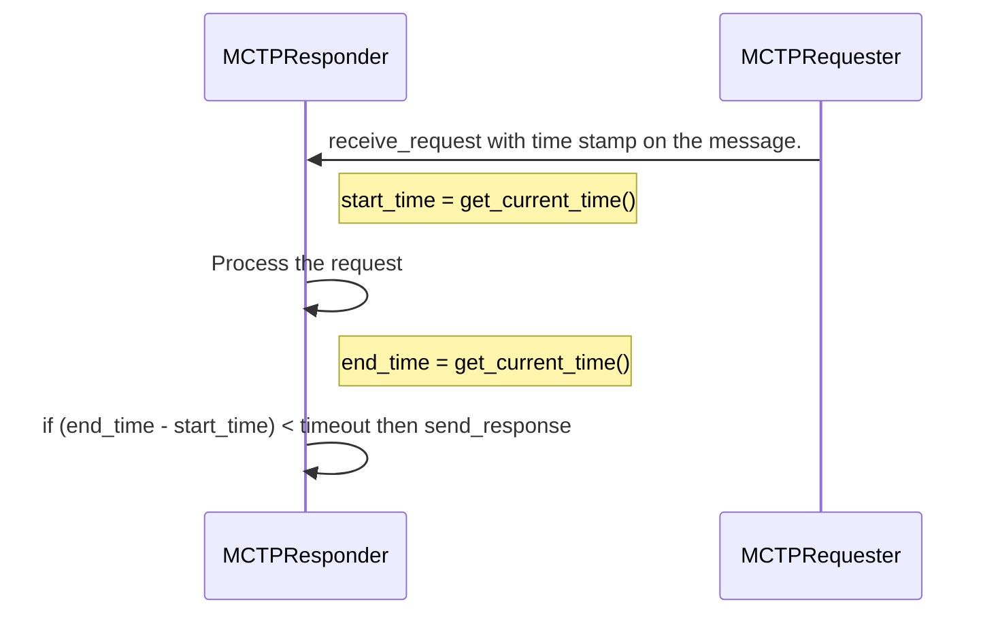

The application decides whether to send a response after a timeout. This timeout value is specific to the protocol. The MCTP kernel stack provides the timestamp of the incoming request message to the application via the `receive_request` syscall. This timestamp corresponds to the last packet of the successfully received and assembled message. The application can use this timestamp to either send a response or discard the request if processing exceeds the expected time. The response can be sent using the `send_response` system call.

