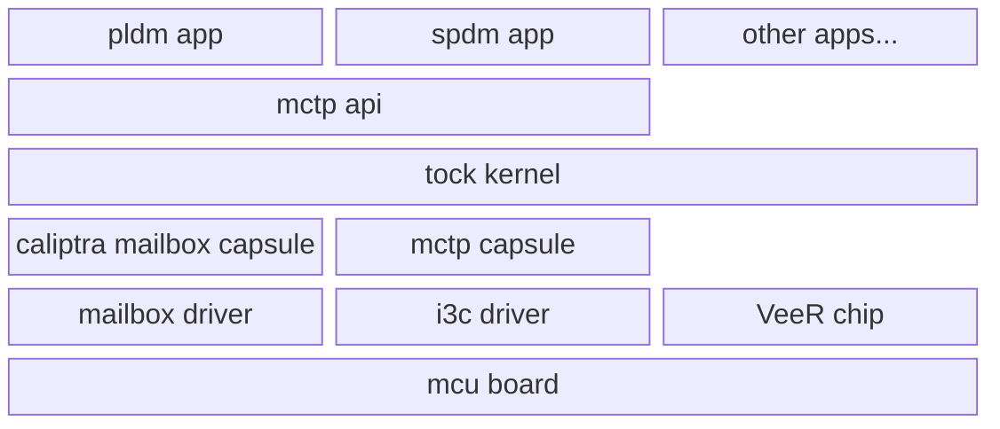

# MCU General Overview

The Caliptra Manufacturer Control Unit (MCU) is the microcontroller and related hardware that work with the Caliptra core to provide the Caliptra Subsystem set of services to the encompassing system.

The main responsibilities of the MCU are:

* Loading firmware that is authenticated by Caliptra
* Providing SPDM attestation services
* Programming and reading of fuses (OTP)
* Enabling Device Ownership Transfer services
* Supporting anti-rollback mechanisms

## ROM

When the MCU first boots, it executes a small, bare metal ROM.
The ROM is responsible for sending non-secret fuses to Caliptra core so that it can complete booting and performing some additional hardware initialization.

For more details, see the [ROM specification](rom.md).

## Runtime Firmware Architecture Overview

The MCU firmware is based on the [Tock](https://tockos.org/) real-time, embedded operation system. Tock provides the ability for us to run multiple high-level applications concurrently and securely.
For more specific information on how Tock internals work, please see the [Tock kernel documentation](https://book.tockos.org/doc/overview).

The overall architecture for the MCU firmware stack is thought of in layers.

* At the highest layer are the user-mode **applications** that run specific flows that are relevant for vendors. These run more complex, dynamic protocols, like PLDM and SPDM.
* These interact with common **user-mode APIs** for protocols like MCTP. These handle the details of converting low-level system calls to the Tock kernel and capsules into synchronous and asynchronous APIs.
  * Neither the applications nor the user-mode APIs have the ability to access hardware directly.
* The Tock **kernel** is responsible for scheduling the applications and routing system calls to the appropriate capsules. Everything at the Tock kernel level and below execute in machine mode with full privileges.
* The **capsules** are Tock kernel modules that implement specific specific workflows and capabilities, like using the MCTP stack or accessing the Caliptra mailbox.
  * Everything at the capsule layer and above should be independent of the hardware specifics. Everything below the capsule layer is specific to the hardware implementations.
* The capsules in turn talk to specific **drivers**. These are generally implementations of specific Rust traits, like Tock HILs, that provide access to hardware.
* Two of the most fundamental pieces of Rust code sit at the bottom: the chip and board files. The **chip file** contains microcontroller-specific code, such as dealing with interrupts, can should be able to be reused on different boards that use the same microcontroller.
* The **board file** is the heart of Tock: it is the `main()` function, and is responsible for creating and initializing all of the hardware drivers, the chip file, creating the Tock kernel, loading and configuring the capsules, and starting the main execution loop.