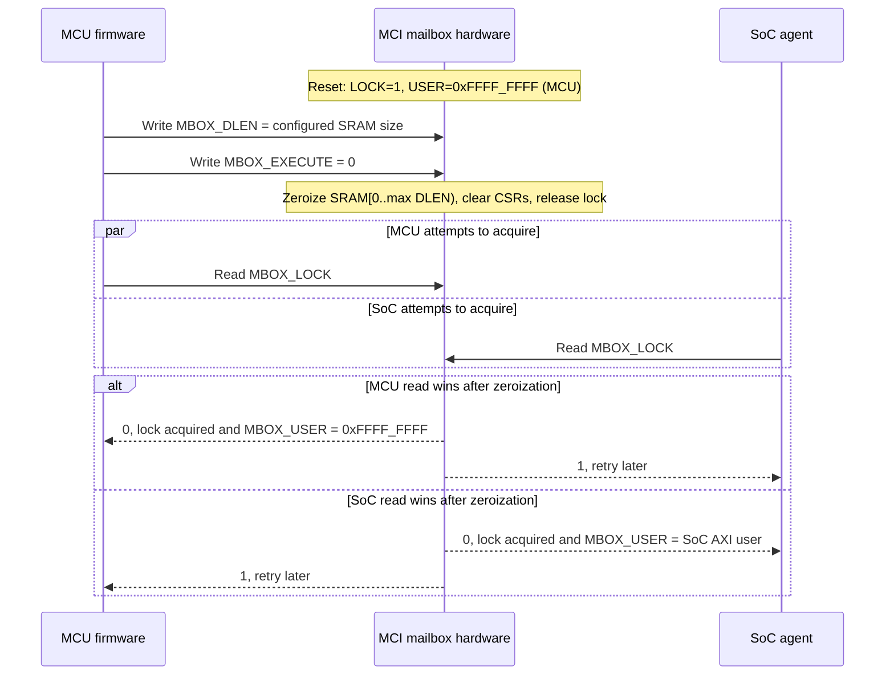
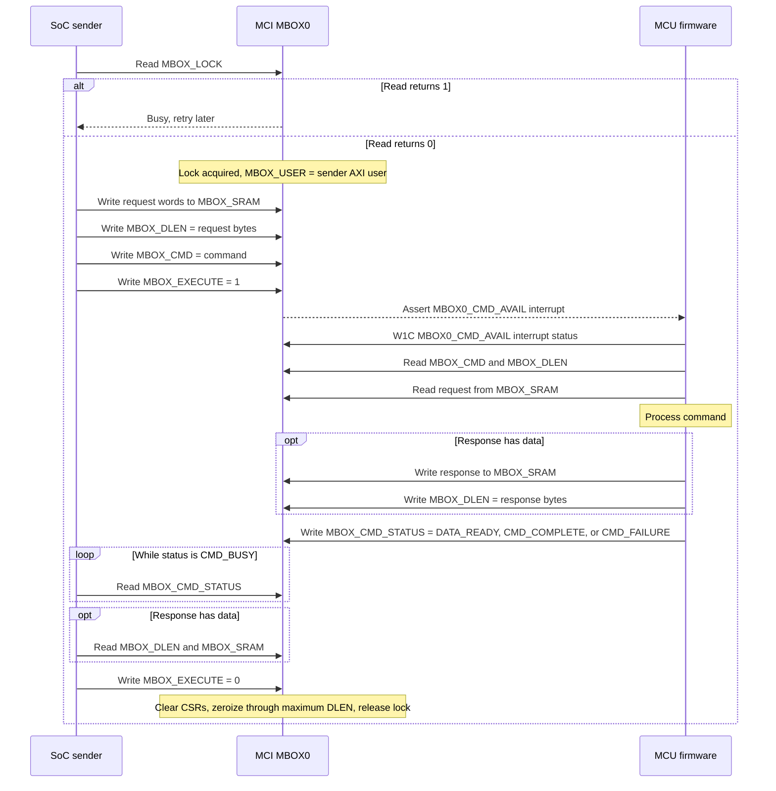
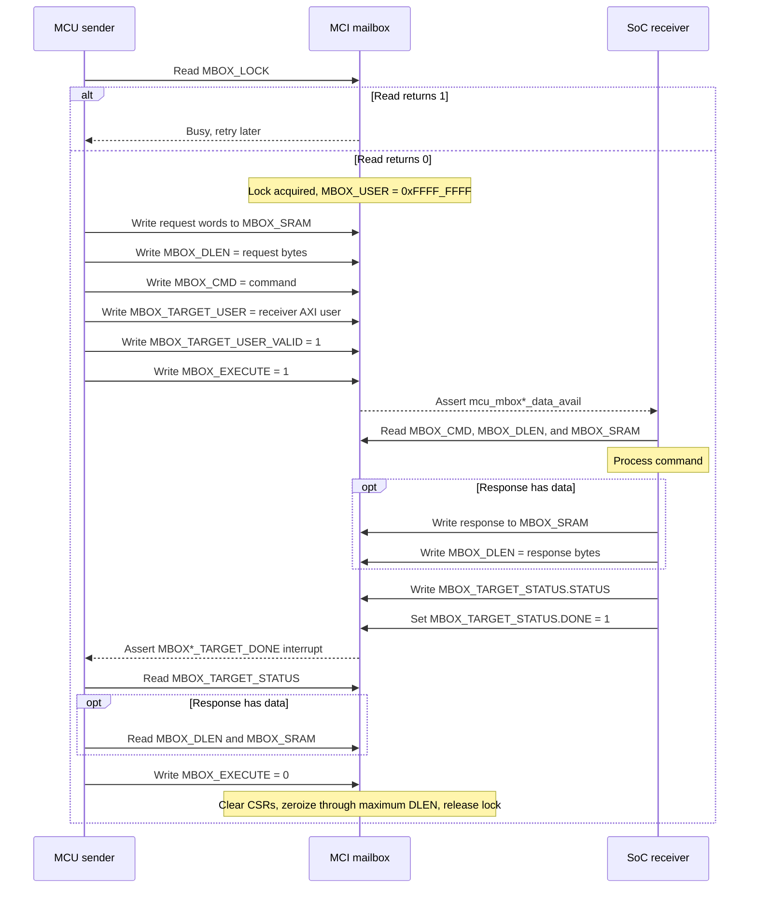
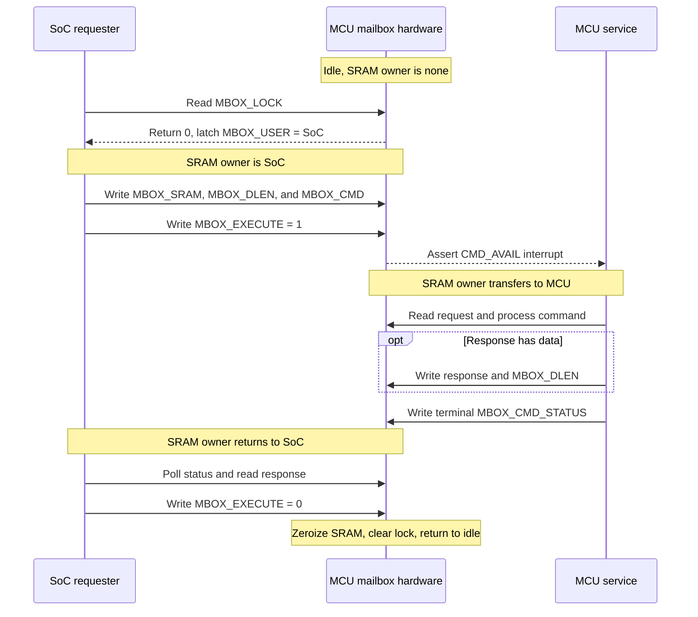
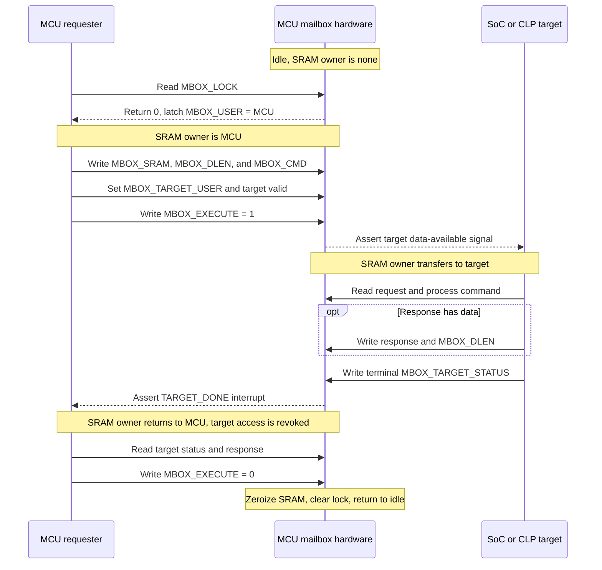
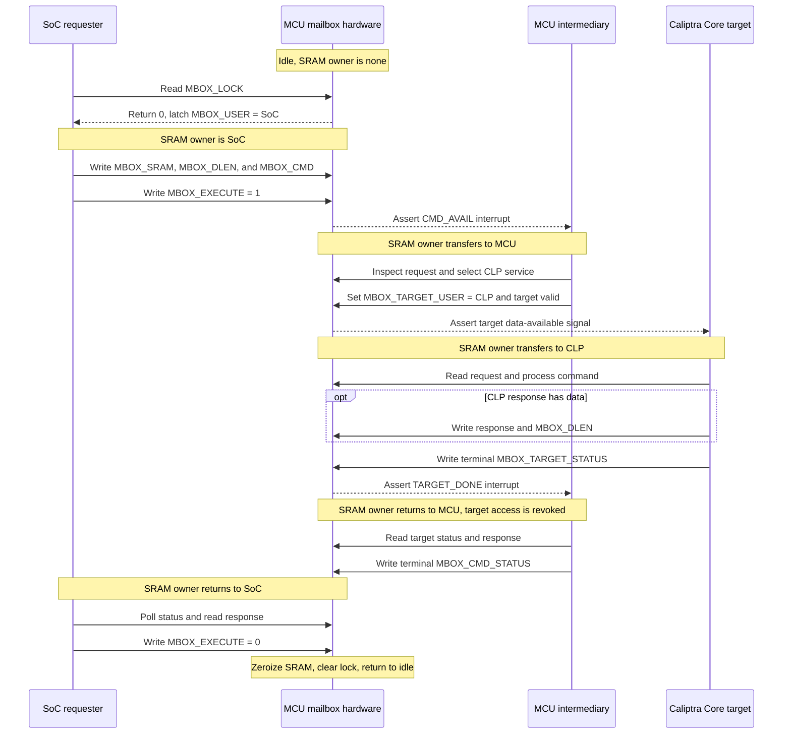

# MCU Mailbox Flow

The Caliptra subsystem provides two equivalent MCU mailboxes, `MBOX0` and
`MBOX1`, for communication between the MCU and SoC AXI agents. Each mailbox
contains shared SRAM, control/status registers, and a hardware lock. This page
describes the register-level protocol; command numbers and payload formats are
defined by the firmware service using the mailbox.

The current MCU runtime uses `MBOX0` as a receiver: a SoC agent sends a command
to the MCU, and the MCU returns a response. The hardware also supports the MCU
initiating a command to a SoC agent.

## Register Map

The offsets below are relative to the MCI register block. `MBOX1` has the same
layout as `MBOX0` with its SRAM and control regions starting at `0x800000` and
`0xA00000`, respectively.

| MBOX0 offset | Register                   | Access and purpose                                                                                                                                                    |
| ------------ | -------------------------- | --------------------------------------------------------------------------------------------------------------------------------------------------------------------- |
| `0x400000` | `MBOX_SRAM`              | Shared request/response data, accessed as 32-bit little-endian words. The generated aperture allows up to 2 MiB; current FPGA and emulator configurations use 16 KiB. |
| `0x600000` | `MBOX_LOCK`              | Read to atomically acquire. A read returning`0` acquired the lock; `1` means another requester holds it.                                                          |
| `0x600004` | `MBOX_USER`              | AXI user ID of the lock owner. The MCU root user is`0xFFFF_FFFF`.                                                                                                   |
| `0x600008` | `MBOX_TARGET_USER`       | SoC receiver AXI user ID, set by the MCU root user.                                                                                                                   |
| `0x60000C` | `MBOX_TARGET_USER_VALID` | Makes`MBOX_TARGET_USER` eligible to access the mailbox.                                                                                                             |
| `0x600010` | `MBOX_CMD`               | 32-bit command selected by the sender.                                                                                                                                |
| `0x600014` | `MBOX_DLEN`              | Number of valid payload bytes in`MBOX_SRAM`.                                                                                                                        |
| `0x600018` | `MBOX_EXECUTE`           | Sender writes`1` after preparing a request. The lock owner writes `0` to finish, zeroize, and release.                                                            |
| `0x60001C` | `MBOX_TARGET_STATUS`     | SoC target writes`STATUS` and raises `DONE` for an MCU-originated request.                                                                                        |
| `0x600020` | `MBOX_CMD_STATUS`        | MCU writes the status for a SoC-originated request.                                                                                                                   |
| `0x600024` | `MBOX_HW_STATUS`         | SRAM ECC single- and double-bit error indications.                                                                                                                    |

`MBOX_CMD_STATUS.STATUS` and `MBOX_TARGET_STATUS.STATUS` use the same values:

| Value | Name             | Meaning                                   |
| ----- | ---------------- | ----------------------------------------- |
| `0` | `CMD_BUSY`     | Receiver is still processing the command. |
| `1` | `DATA_READY`   | Requested data is available in SRAM.      |
| `2` | `CMD_COMPLETE` | Command completed successfully.           |
| `3` | `CMD_FAILURE`  | Command failed.                           |

## Reset and Lock Arbitration

Reading `MBOX_LOCK` is an operation, not a passive status read. When the
mailbox is free, the read both returns `0` and assigns ownership to that
requester's AXI user. All other contenders read `1` until the owner finishes
the transaction.

At reset, hardware assigns the lock to the MCU so stale SRAM contents cannot
leak across a warm reset. MCU firmware must request clearing of the full SRAM
before normal traffic is allowed.

## SoC Request to MCU Response

This is the direction implemented by the current MCU runtime `MBOX0` driver.
Writing `MBOX_EXECUTE=1` by a SoC lock owner raises the
`MBOX0_CMD_AVAIL` interrupt. The MCU reads the request, writes any response
over the same SRAM, and changes `MBOX_CMD_STATUS` from `CMD_BUSY`. The SoC
owner must always finish by clearing `MBOX_EXECUTE`.

The mailbox does not independently signal completion back to the SoC sender;
the sender polls `MBOX_CMD_STATUS` or uses an integration-specific mechanism.
The maximum of every `MBOX_DLEN` value written during the lock session controls
how much SRAM is erased at completion.

## MCU Request to SoC Response

For the reverse direction, the MCU acquires the lock and names the receiving
SoC AXI user. `MBOX_EXECUTE=1` asserts the subsystem
`cptra_ss_soc_mcu_mbox*_data_avail` output. The integrator may connect that
signal to a receiver interrupt or provide another notification mechanism.

The hardware supports this direction, but the current runtime mailbox driver
returns `unimplemented!()` from its sender-mode `send_request` method. A new
runtime sender must also enable and handle `MBOX*_TARGET_DONE` and expose the
target AXI user selection.

## Proposed Exclusive SRAM Ownership

> **Proposal, not current behavior:** This section records a hardware proposal
> under discussion. Current RTL permits the MCU root user, lock owner, and
> selected target to access mailbox SRAM concurrently while the mailbox is
> locked. The proposal instead gives SRAM to one logical owner at a time and
> treats control/status writes as ownership-transfer events.

The proposed ownership state is derived from the mailbox transaction state;
it does not require a new software-visible owner register. The expected
transitions are:

| Trigger | Previous owner | New owner |
| --- | --- | --- |
| Requester reads free `MBOX_LOCK` and receives `0` | None | Requester |
| SoC requester writes `MBOX_EXECUTE=1` | SoC requester | MCU |
| MCU requester writes `MBOX_EXECUTE=1` with a valid target | MCU | Target |
| MCU assigns a target while servicing a SoC request | MCU | Target |
| Target writes a terminal `MBOX_TARGET_STATUS` | Target | MCU |
| MCU writes a terminal `MBOX_CMD_STATUS` | MCU | SoC requester |
| Requester writes `MBOX_EXECUTE=0` | Requester | None while clearing |
| SRAM zeroization completes | None while clearing | None, reusable |

Here, *terminal* means a status other than `CMD_BUSY`. Whether target
completion also requires the existing `MBOX_TARGET_STATUS.DONE` bit is still
to be specified.

### Proposed SoC Request, MCU Service

No external target participates in this flow. `MBOX_TARGET_USER` remains
invalid and `MBOX_TARGET_STATUS` is unused.

### Proposed MCU Request, SoC or CLP Service

The MCU is the original requester and selects an SoC agent or Caliptra Core
(`CLP`) as the target. `MBOX_CMD_STATUS` is not used because there is no
external requester waiting for an MCU completion status.

### Proposed SoC Request, MCU-Mediated CLP Service

This flow composes the previous two. `MBOX_CMD_STATUS` tracks the outer
SoC-to-MCU request, while `MBOX_TARGET_STATUS` tracks the inner MCU-to-CLP
operation.

The proposal requires hardware and firmware to define the following before it
can be treated as an implementation contract:

- Whether only SRAM ownership changes or CSR access is also phase-restricted.
- Whether target completion requires `DONE=1`, a non-busy status, or both.
- Whether `MBOX_TARGET_USER` and its valid bit auto-clear on target completion.
- Whether the MCU root user retains an override for timeout and recovery.
- The AXI response for access by a non-owner and the ordering barrier at each
    ownership transfer.
- Timeout and abort behavior when the MCU or selected target does not return
    ownership.
- Whether `DATA_READY` is terminal and whether repeated target handoffs are
    permitted in one lock session.

## Access Rules and Failure Handling

- The MCU root user can access a locked mailbox and is the only user allowed to
  configure `MBOX_TARGET_USER` and `MBOX_TARGET_USER_VALID`.
- The lock owner and selected target can access SRAM and `MBOX_DLEN`; only the
  lock owner writes `MBOX_CMD` and `MBOX_EXECUTE`.
- Only the MCU root user writes `MBOX_CMD_STATUS`. Only the selected target
  writes `MBOX_TARGET_STATUS`.
- A receiver should reject a `MBOX_DLEN` larger than the configured SRAM and
  return `CMD_FAILURE` where possible.
- On `MBOX_HW_STATUS.ECC_DOUBLE_ERROR`, firmware should report `CMD_FAILURE`.
- The lock cannot be acquired again until completion zeroization has finished.

The same sequences apply to `MBOX1`, using the `MBOX1_CMD_AVAIL` and
`MBOX1_TARGET_DONE` interrupts and the MBOX1 register block.
