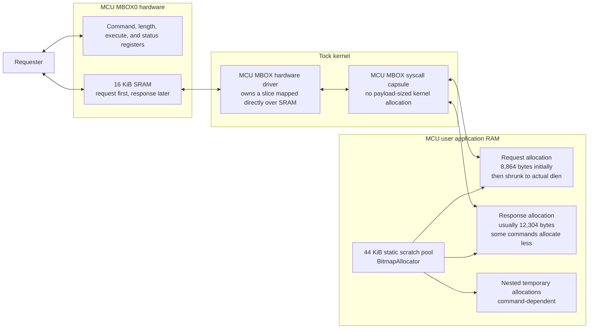
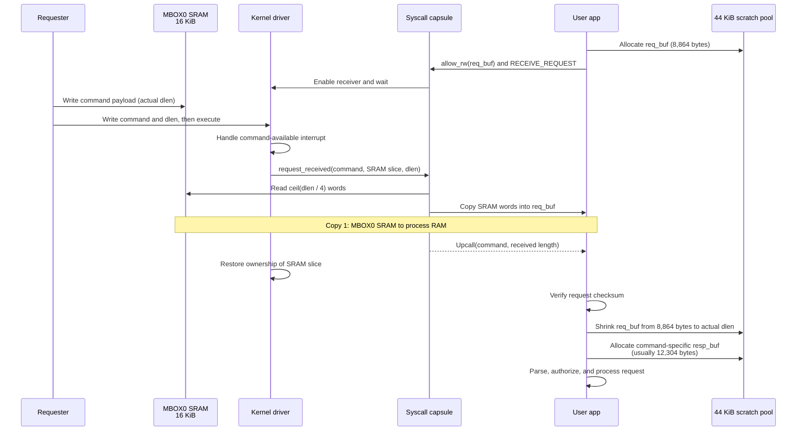
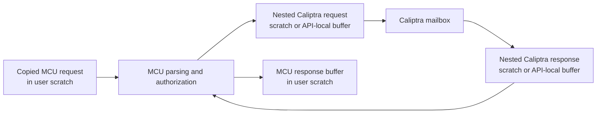
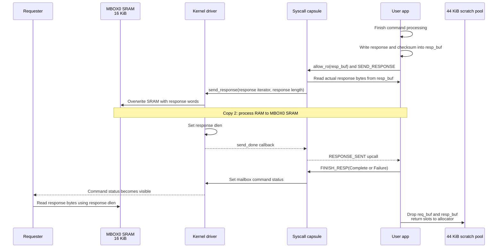
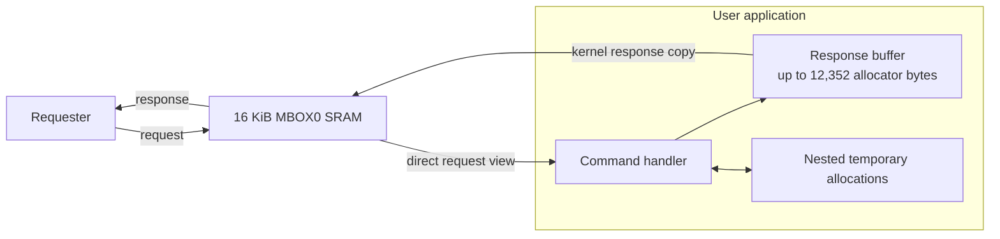
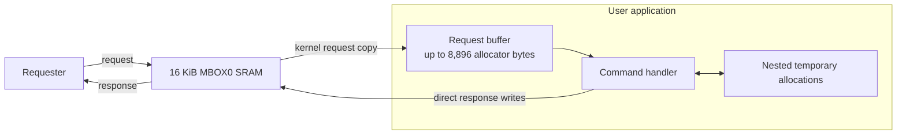
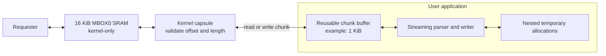
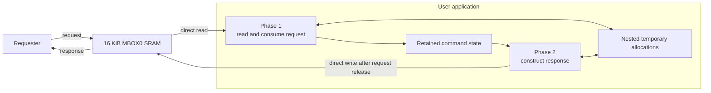

# MCU Mailbox Buffer Usage and Optimization Options

This document describes MCU MBOX0 buffer ownership, allocation, and copies, then evaluates options for reducing application RAM usage. The baseline in this section is the implementation at commit `1a61e2752`, before direct userspace access to mailbox SRAM was introduced.

## Baseline Summary

The FPGA implements one 16 KiB MCU MBOX0 SRAM. The requester and MCU reuse this SRAM as the protocol buffer: the requester writes a request into it, and the MCU later overwrites it with the response.

The MCU mailbox userspace service also reserves a fixed 44 KiB scratch pool in the user application's `.bss`. A `BitmapAllocator` creates command-lifetime buffers from this pool. The kernel does not allocate another payload-sized buffer; it copies between mailbox SRAM and process buffers supplied through Tock `allow` syscalls.

| Storage | Capacity | Allocation | Purpose |
| --- | ---: | --- | --- |
| MCU MBOX0 SRAM | 16 KiB | Hardware SRAM | Shared request/response protocol buffer |
| `MCU_MBOX_SCRATCH` | 44 KiB (45,056 bytes) | Static user-app `.bss` | Pool for request, response, and nested command temporaries |
| Request buffer | 8,864 bytes initially | From `MCU_MBOX_SCRATCH` | Largest `McuMailboxReq`; shrunk to the received `dlen` after the copy |
| Response buffer | Usually 12,304 bytes | From `MCU_MBOX_SCRATCH` | `McuMailboxResp` capacity; selected commands use a smaller command-specific allocation |
| Kernel payload buffer | None | Not applicable | Capsule uses the process allow buffer and the driver's SRAM-backed slice directly |
| Nested Caliptra buffers | Command-dependent | From `MCU_MBOX_SCRATCH` or local API storage | Requests, responses, hash contexts, certificates, and authorization work |

The 8,864-byte and 12,304-byte capacities are compiler-calculated `size_of` values for the baseline message enums. The live wire data is often much smaller. Bitmap allocations are rounded to 64-byte slots and the pool also contains a small occupancy bitmap.

## Maximum Request and Response Allocations

The largest allocator reservation and the largest wire message differ slightly because `McuMailboxReq` and `McuMailboxResp` are Rust enums. Their allocation includes the largest variant plus enum layout overhead and padding.

### Request Maximum

Every command initially reserves `size_of::<McuMailboxReq>()`, regardless of the incoming command. The allocation is shrunk only after the request has been copied from MBOX0 SRAM and its actual `dlen` is known.

| Item | Logical size | Bitmap slots | Driver |
| --- | ---: | ---: | --- |
| Initial request allocation | 8,864 bytes | 8,896 bytes (139 slots) | `size_of::<McuMailboxReq>()` |
| Largest request wire type | 8,860 bytes | 8,896 bytes (139 slots) | `McuMldsaCmkVerifyReq` / `MC_MLDSA_CMK_VERIFY` |
| Production debug-unlock token request | 7,508 bytes | 7,552 bytes (118 slots) | `McuProdDebugUnlockTokenReq` |
| ML-DSA CMK sign request | 4,232 bytes | 4,288 bytes (67 slots) | `McuMldsaCmkSignReq` |

Therefore, the baseline maximum request allocation is **8,864 logical bytes**, consuming **8,896 bytes of 64-byte allocator slots**. ML-DSA CMK Verify is the command that requires this capacity.

### Response Maximum

`response_buffer_size()` selects the response allocation. Its default branch uses `size_of::<McuMailboxResp>()`, while a few commands use a smaller or feature-dependent size.

| Command or branch | Logical allocation | Bitmap slots | Notes |
| --- | ---: | ---: | --- |
| Default `McuMailboxResp` branch | 12,304 bytes | 12,352 bytes (193 slots) | Largest allocator reservation |
| `MC_DPE_SIGNER_CONTEXT_CERT` | 12,300 bytes | 12,352 bytes (193 slots) | Full response type: 12-byte variable header plus 12 KiB certificate storage |
| `MC_GET_ATTESTATION` with ML-DSA PCR quote | 12,304 bytes | 12,352 bytes (193 slots) | The 6,412-byte attestation envelope (`12 + 4 + 6,396`) is below the default enum maximum, so `max(12,304, 6,412)` selects 12,304 |
| `MC_GET_DPE_CERTIFICATE_CHAIN` | 1,036 bytes | 1,088 bytes (17 slots) | 12-byte variable header plus one 1 KiB chunk |
| Header-only commands | 8 bytes | 64 bytes (1 slot) | For example ML-DSA verify and production debug-unlock token responses |

The baseline maximum response allocation is therefore **12,304 logical bytes**, consuming **12,352 bytes of allocator slots**. The enum is this large because `DpeSignerContextCertResp` can carry a full 12 KiB endorsement certificate. The concrete wire response for that command is at most **12,300 bytes**.

`MC_GET_DPE_CERTIFICATE_CHAIN` does not allocate the entire chain. It retrieves the chain in 1 KiB chunks, so its command-specific response allocation is only 1,036 bytes. The similarly named `MC_DPE_SIGNER_CONTEXT_CERT` is the certificate command responsible for the large response capacity.

With the largest request still live, allocating the largest response consumes at least **21,248 bytes of allocator slots** before nested command buffers and allocator metadata:

$$
8{,}896 + 12{,}352 = 21{,}248\text{ bytes}
$$

This is the minimum starting point for reducing the 44 KiB pool safely; authorization and nested Caliptra operations can increase the concurrent peak.

## Baseline Memory Topology

At the busiest point in an ordinary command, the process holds both the request and response allocations. Commands that perform authorization, attestation, or nested Caliptra mailbox operations may hold additional allocations concurrently.

## Baseline Request Sequence

The userspace service allocates its maximum request envelope before waiting for a command. Tock's read-write allow gives the capsule temporary access to that process-owned allocation. When the hardware signals a request, the capsule copies the live request from mailbox SRAM into the allowed buffer.

The requester remains blocked on the mailbox transaction while the MCU processes the copied request. The original bytes remain in MBOX0 SRAM until the response path overwrites them.

### Nested Caliptra Commands

Some MCU mailbox commands are not simple local operations. Authorization, cryptographic pass-through, attestation, and certificate operations can issue one or more commands to the Caliptra subsystem mailbox. In the baseline implementation, those operations use additional process-owned buffers because standard Tock allow syscalls cannot accept MMIO-backed slices.

The exact nested allocation peak depends on the command. It must be added to the simultaneously live request and response allocations when sizing the 44 KiB pool.

## Baseline Response Sequence

The handler writes the response into the process-owned response allocation. The userspace transport exposes that allocation as a read-only allow. The capsule reads it and the hardware driver writes each word into the same MBOX0 SRAM that previously held the request.

Only the actual response length is copied to SRAM. The response allocation capacity can be larger than the response produced by a particular command.

## Historical Buffer Increases

The git history records two explicit increases from the original 12 KiB scratch pool. They occurred on different development lines.

| Commit | Change | Command pressure | Reason recorded in the commit |
| --- | --- | --- | --- |
| `b6cfc2fb1` | Introduced a 12 KiB pool | Scratch-backed MCU mailbox APIs | Initial shared pool for request, response, and nested Caliptra API allocations |
| `71fbdbc15` | 12 KiB to 16 KiB | Eight authorized commands, especially `FE_PROG`, SVN, and revoke operations | Hybrid ECDSA-P384 + ML-DSA-87 authorization made requests about 7.5 KiB; the request and response remained live while SVN/revoke handlers made a nested `FW_INFO` allocation |
| `9ac89230c` | 12 KiB to 44 KiB | ML-DSA-87 DPE signer and OCP LOCK endorsement certificates | Added certificate responses backed by `MAX_ENDORSEMENT_CERT_SIZE` and retained headroom for nested ML-DSA-87 DPE request/response work |

Commit `71fbdbc15` is on `main` and related branches, but is not an ancestor of the branch used for this baseline. Its commit message records that 12 KiB produced `OUT_OF_MEMORY` after authorization. The authorized request carries a 48-byte nonce, 2,688 bytes of ECC and ML-DSA public keys, 4,724 bytes of ECC and ML-DSA signatures, and the command body. The recorded `FE_PROG` authorized request size is 7,464 bytes.

Commit `9ac89230c` is in this branch's ancestry and is the source of the baseline 44 KiB value. Although the user-visible certificate is the obvious large object, the pool had to hold more than that response alone: certificate generation performs nested DPE derive/sign mailbox operations while outer command storage remains live. The final command response capacity is based on a 12 KiB endorsement certificate array, producing a 12,300-byte `DpeSignerContextCertResp` and a 12,304-byte `McuMailboxResp` allocation.

A related memory fix, `d0a8f3949`, did not increase `MCU_MBOX_SCRATCH_SIZE`. It moved an approximately 11 KiB Caliptra `MldsaVerifyReq` out of each async task future into one shared static allocation. The commit reports an 18.2 KiB `.bss` reduction. This confirms that ML-DSA verification is another large concurrent-memory path, but it is distinct from the mailbox scratch-pool increases above.

## Baseline Cost

For every successful request/response transaction, the baseline performs two MCU-side payload copies:

1. MBOX0 SRAM to the process request allocation.
2. The process response allocation back to MBOX0 SRAM.

The fixed application-RAM cost is 44 KiB even when the service is idle. During a command, the pool must support the live request, response, allocator metadata, and any nested temporary buffers. The kernel contributes only small driver/capsule state and Tock grant metadata, not another request- or response-sized payload buffer.

## Optimization Options

The baseline outer request and response consume up to 21,248 bytes of allocator slots concurrently. Every option below retains process scratch for authorization and nested Caliptra operations. The savings shown are maximum removable outer allocations, not guaranteed fixed-pool reductions; the final pool size must cover measured concurrent peaks, allocator metadata, and fragmentation.

### Option 1: Direct Request, Buffered Response

Userspace reads the request directly from MBOX0 SRAM. It builds the response in process scratch, then the kernel copies that response back to SRAM.

**Potential saving:** 8,896 allocator bytes and the request copy. This is the implemented optimization; the measured fixed pool was reduced from 44 KiB to 32 KiB and all 27 validator cases passed.

**Strengths:** Small handler change; best for large-request commands such as `MC_MLDSA_CMK_VERIFY`; response and nested work remain in normal process memory.

**Limitations:** MBOX0 SRAM is mapped into userspace; the response allocation remains; the live request prevents reuse of SRAM for the response.

### Option 2: Buffered Request, Direct Response

The kernel copies the request into process scratch. Userspace then overwrites the old request in MBOX0 SRAM while constructing the response directly.

**Potential saving:** 12,352 allocator bytes and the response copy, which is 3,456 bytes more outer-allocation saving than option 1.

**Strengths:** Best for small-request, large-response commands such as `MC_DPE_SIGNER_CONTEXT_CERT`; the copied request remains stable while SRAM is reused; nested work remains in process memory.

**Limitations:** MBOX0 SRAM is mapped into userspace; the request allocation and copy remain; handlers need an SRAM-backed response slice or writer; response length and status must be published only after construction succeeds.

### Option 3: Kernel-Mediated Chunks

MBOX0 SRAM remains kernel-only. Userspace reuses a small process buffer while new offset-based syscalls copy request and response chunks between that buffer and validated SRAM ranges.

**Potential saving with one 1 KiB chunk:** up to 20,224 allocator bytes when the same chunk replaces both maximum outer buffers:

$$
8{,}896 + 12{,}352 - 1{,}024 = 20{,}224\text{ bytes}
$$

**Strengths:** Does not expose SRAM to userspace; bounds outer staging independently of message size; supports offset and length checks in one kernel boundary.

**Limitations:** Retains both payload copies and adds syscall overhead; requires new capsule, HIL, parser, and writer interfaces. Request processing and response writing are normally sequential because they share SRAM. Authorized requests may still require full buffering because verification covers the complete pre-image.

### Option 4: Direct In-Place Request and Response

Userspace first reads and completely processes the request in MBOX0 SRAM. After all request borrows end, it changes phase and reuses the same SRAM as the response buffer. Request reads and response writes are sequential, never concurrent.

**Potential saving:** all 21,248 bytes of outer request and response allocator slots, plus both payload copies. Only retained command state and nested temporary allocations remain in process scratch.

**Strengths:** Largest outer-buffer and copy reduction; ideal for handlers that can consume the request before producing the response.

**Limitations:** MBOX0 SRAM is mapped into userspace; requires an explicit request-to-response phase transition and handler lifetime redesign. Commands that retain request fields across asynchronous or nested work must copy that state first, and some authorized commands may still need command-specific staging.

### Comparison

| Criterion | Option 1: direct request | Option 2: direct response | Option 3: kernel chunks | Option 4: direct in-place |
| --- | --- | --- | --- | --- |
| Maximum outer-allocation saving | 8,896 bytes | 12,352 bytes | 20,224 bytes with a 1 KiB chunk | 21,248 bytes |
| Outer allocation retained | Response: up to 12,352 bytes | Request: up to 8,896 bytes | Configurable chunk | None; only retained state |
| Payload copies removed | Request copy | Response copy | None | Both |
| App-visible MBOX0 mapping | Yes | Yes | No | Yes |
| Request/response overlap | Response kept separate | Request kept separate | Sequential chunk phases | Sequential direct phases |
| Authorization compatibility | Good; complete request remains in SRAM | Good; complete copied request remains | Often requires full request staging | Requires retained state or selective staging |
| Handler changes | Low | Medium | High | High |
| Kernel changes | Implemented | Direct-send support exists | New offset-based interface | Phase/state enforcement |
| Best fit | Large request, small response | Small request, large response | Strong isolation and streamable commands | Commands with clean consume-then-produce flow |
| Validation status | Implemented; 27/27 passed | Design option | Design option | Design option |

Options can also be selected per command. Large-request commands favor option 1, large-response commands favor option 2, and handlers with a clean consume-then-produce lifetime can use option 4. Option 3 is preferable when preserving the kernel isolation boundary is more important than copy count or implementation complexity.

## Baseline Source Map

The baseline behavior is controlled by these files and symbols at commit `1a61e2752`:

- `platforms/emulator/runtime/userspace/apps/user/src/mcu_mbox/mod.rs`: `MCU_MBOX_SCRATCH_SIZE` and `McuMboxScratchAlloc`.
- `runtime/userspace/api/mcu-mbox-lib/src/cmd_interface.rs`: `handle_responder_msg_from_scratch()` and `response_buffer_size()`.
- `runtime/userspace/api/mcu-mbox-lib/src/transport.rs`: `receive_request()` and `send_response()`.
- `runtime/userspace/syscall/src/mcu_mbox.rs`: Tock allow, command, subscription, and mutex handling.
- `runtime/kernel/capsules/src/mcu_mbox.rs`: copying between process allow buffers and the hardware driver's SRAM slice.
- `platforms/emulator/runtime/kernel/drivers/mcu_mbox/src/lib.rs`: direct ownership of the SRAM-backed slice and response writes.
- `common/mcu-mbox/src/messages.rs`: `McuMailboxReq`, `McuMailboxResp`, and command wire structures.
