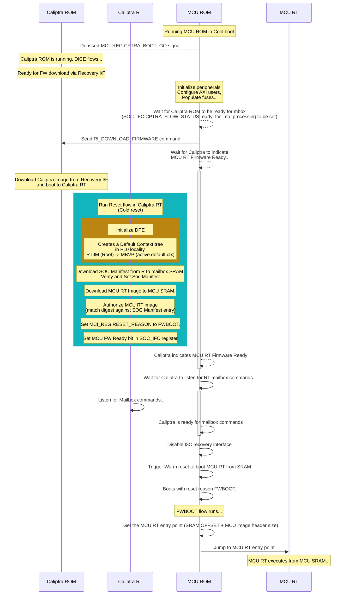
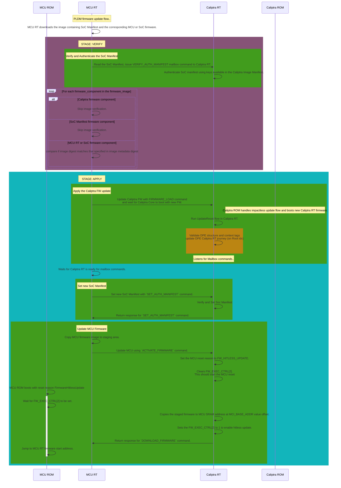

# Device Measurements

## SoC Manifest and MCU RT measurements

### Image Loading Flow

```mermaid
sequenceDiagram
    participant Caliptra ROM
    participant Caliptra RT
    %% participant MCI REG
    %% participant Recovery I/F
    %% participant DPE
    participant MCU ROM
    participant MCU RT
    Note over MCU ROM: Running MCU ROM in Cold boot
    MCU ROM --> Caliptra ROM: Deassert MCI_REG.CPTRA_BOOT_GO signal
    Note over Caliptra ROM: Caliptra ROM is running, DICE flows...
    Note over Caliptra ROM: Ready for FW download via Recovery I/F
    Note over MCU ROM: Initialize peripherals <br/> Configure AXI users, <br/> Populate fuses..
    MCU ROM -->> MCU ROM :Wait for Caliptra ROM to be ready for mbox<br/> (SOC_IFC.CPTRA_FLOW_STATUS.ready_for_mb_processing to be set)
    MCU ROM ->> Caliptra ROM: Send RI_DOWNLOAD_FIRMWARE command
    MCU ROM -->>+ MCU ROM: Wait for Caliptra to indicate <br/> MCU RT Firmware Ready..
    Note over Caliptra ROM: Download Caliptra Image from Recovery I/F <br/>and boot to Caliptra RT
    rect rgba(18, 181, 187, 1)
    Note over Caliptra RT: Run Reset flow in Caliptra RT<br/>(Cold reset)
        rect rgba(187, 133, 18, 1)
        Note over Caliptra RT: Initialize DPE
        Note over Caliptra RT: Creates a Default Context tree <br/> in PL0 locality. <br/> `RTJM (Root) -> MBVP (active default ctx)`
        end
        Note over Caliptra RT: Download SOC Manifest from R to mailbox SRAM.<br/> Verify and Set Soc Manifest
        %% end
        Note over Caliptra RT: Download MCU RT Image to MCU SRAM.
        note over Caliptra RT: Authorize MCU RT image <br/> (match digest against SOC Manifest entry)
    Note over Caliptra RT: Set MCI_REG.RESET_REASON to FWBOOT. 
    Note over Caliptra RT: Set MCU FW Ready bit in SOC_IFC register
    end
    MCU ROM -->>- MCU ROM: Caliptra indicates MCU RT Firmware Ready
    MCU ROM ->>+ MCU ROM: Wait for Caliptra to listen for RT mailbox commands..
    Caliptra RT ->> Caliptra RT: Listen for Mailbox commands..
    MCU ROM ->>- MCU ROM: Caliptra is ready for mailbox commands
    MCU ROM ->> MCU ROM: Disable I3C recovery interface
    MCU ROM ->> MCU ROM: Trigger Warm reset to boot MCU RT from SRAM
    MCU ROM ->>+ MCU ROM: Boots with reset reason FWBOOT.
    note over MCU ROM : FWBOOT flow runs...
    MCU ROM ->> MCU ROM: Get the MCU RT entry point (SRAM OFFSET + MCU image header size)
    MCU ROM ->> MCU RT: Jump to MCU RT entry point
    Note over MCU RT: MCU RT executes from MCU SRAM...
```

### MCU hitless Update Flow

```mermaid
sequenceDiagram
    participant MCU ROM
    participant MCU RT
    participant Caliptra RT
    NOTE over MCU RT: PLDM firmware update flow..
    MCU RT ->> MCU RT: MCU RT downloads the image containing SoC Manifest and the corresponding MCU or SoC firmware.
    rect rgba(134, 83, 119, 1)
        note over MCU RT: STAGE: VERIFY
        rect rgba(65, 156, 29, 1)
            note over MCU RT: Verify and Authenticate the SoC Manifest
            MCU RT ->> Caliptra RT: Read the SoC Manifest, issue VERIFY_AUTH_MANIFEST mailbox command to Caliptra RT.
            Caliptra RT ->> Caliptra RT: Authenticate SoC manifest using keys available in the Caliptra Image Manifest.
        end
        loop For each firmware_component in the firmware_image
            alt Caliptra firmware component
                MCU RT ->> MCU RT: Skip image verification.
            else SoC Manifest firmware component
                MCU RT ->> MCU RT: Skip image verification.
            else MCU RT or SoC firmware component
                MCU RT ->> MCU RT: compare if image digest matches that specified in image metadata digest
            end
        end
    end

    rect rgba(18, 181, 187, 1)
        note over MCU RT: STAGE: APPLY
        rect rgba(65, 156, 29, 1)
            Note over MCU RT: Apply the Caliptra FW update
            MCU RT ->>+ Caliptra RT: Update Caliptra FW with FIRMWARE_LOAD command<br/> and wait for Caliptra Core to boot with new FW.
            note over Caliptra ROM: Caliptra ROM handles impactless update flow and boots new Caliptra RT firmware.
            Caliptra RT ->> Caliptra RT: Run UpdateReset flow in Caliptra RT.
            rect rgba(187, 133, 18, 1)
                Caliptra RT ->> Caliptra RT: Validate DPE structure and context tags <br/> update DPE Caliptra RT journey (on Root idx) 
            end
            note over Caliptra RT: Listens for Mailbox commands..
        end

        MCU RT ->> MCU RT: Waits for Caliptra RT is ready for mailbox commands.

        rect rgba(65, 156, 29, 1)
            note over MCU RT: Set new SoC Manifest
            MCU RT ->> Caliptra RT: Set new SoC Manifest with `SET_AUTH_MANIFEST` command.
            Caliptra RT ->> Caliptra RT: Verify and Set Soc Manifest
            Caliptra RT ->> MCU RT: Return response for `SET_AUTH_MANIFEST` command.
        end

        rect rgba(65, 156, 29, 1)
            note over  MCU RT: Update MCU Firmware
            MCU RT ->> MCU RT: Copy MCU firmware image to staging area.
            MCU RT ->> Caliptra RT: Update MCU using `ACTIVATE_FIRMWARE` command.
            Caliptra RT ->> Caliptra RT: Set the MCU reset reason to FW_HITLESS_UPDATE.
            Caliptra RT ->> Caliptra RT: Clears FW_EXEC_CTRL[2]. <br/> This should start the MCU reset
            MCU ROM ->>+ MCU ROM: MCU ROM boots with reset reason FirmwareHitlessUpdate
            MCU ROM ->> MCU ROM: Wait for FW_EXEC_CTRL[2] to be set.
            Caliptra RT ->> Caliptra RT: Copies the staged firmware to MCU SRAM address at MCI_BASE_ADDR value offset.
            Caliptra RT ->> Caliptra RT: Sets the FW_EXEC_CTRL[2] to 1 to enable hitless update. 
            Caliptra RT ->> MCU RT: Return response for `DOWNLOAD_FIRMWARE` command.
            MCU ROM ->>- MCU ROM: Jump to MCU RT firmware start address.
        end

    end


    
```