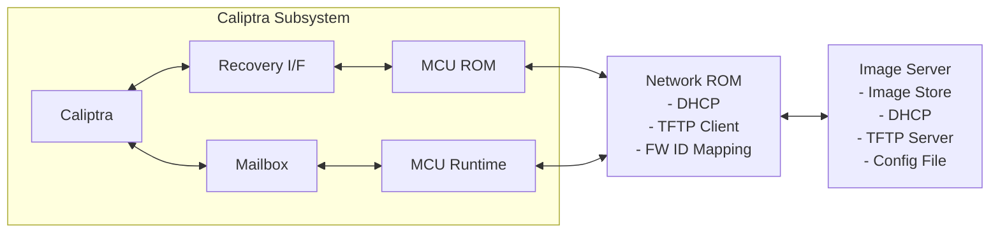
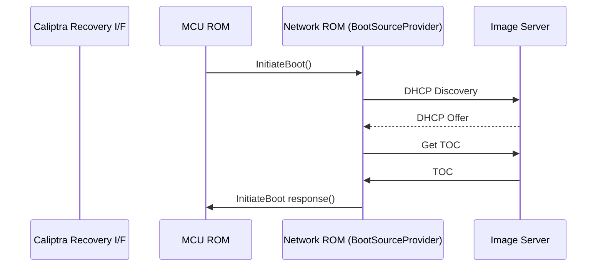
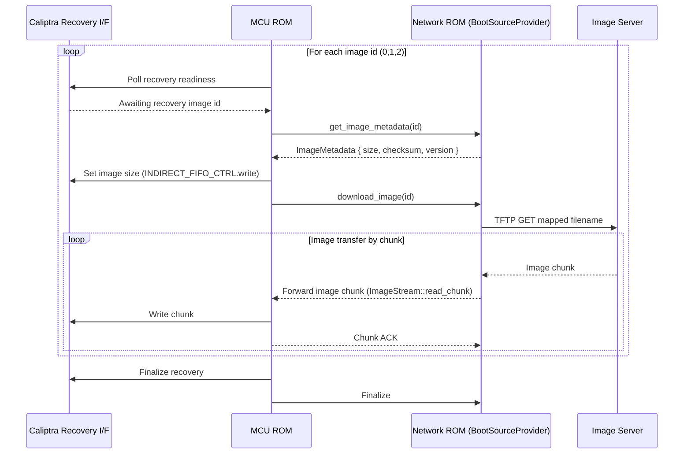
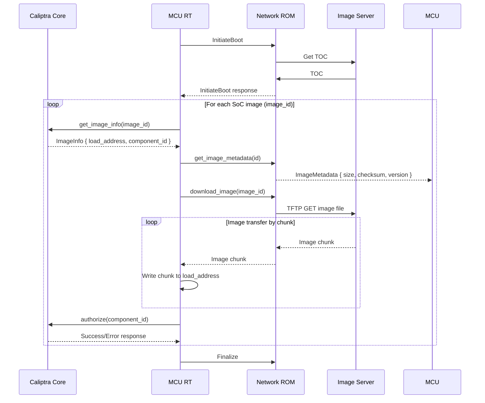

# BMC Network Recovery Boot - Design Document

## Overview

This document outlines the design for a lightweight network recovery boot utility for the Caliptra subsystem. The system enables the Caliptra SS to download firmware images over the network through a dedicated Network Boot Coprocessor within a ROM environment, providing a resilient fallback path when flash memory is corrupted.

The network boot coprocessor acts as an intermediary between remote image servers and the Caliptra SS, handling network communications including DHCP configuration, TFTP server discovery, and firmware image downloads. The system supports downloading multiple firmware components including Caliptra FMC+RT images, SoC manifests, and MCU runtime images through a firmware ID-based mapping system.

## Motivation

### Flash Dependency Risk
- Boot failure if **both flashes are corrupted**

### Recovery Challenge
- Physical intervention is costly in **hyperscale environments**

### Design Goals
- Minimal **MCU ROM** footprint
- Consistent with **OCP streaming boot model** for early firmware (Caliptra FMC + RT, SoC Manifest, MCU RT)
- Secure image retrieval
- Resilient fallback path

### Final Solution
- Use a **dedicated co-processor** with a lightweight network stack
- Automatically configure networking via **DHCP**
- Securely download **Caliptra early firmware images** into the Caliptra subsystem

## System Architecture



## Network Recovery Boot Flow

The following diagram illustrates the high-level flow using the `BootSourceProvider` interface, showing how `discover()` drives DHCP and TOC fetch:



### Image Transfer Sequence

Once the boot source is initialized, the MCU ROM uses the `BootSourceProvider` methods to fetch each firmware component:



## Runtime SoC Image Loading

This section describes the flow for loading and authenticating SoC images at runtime through the MCU Runtime. The MCU Runtime coordinates image authorization with the Caliptra Core, while Network ROM handles downloading image data from the network.



## Messaging Protocol

The boot source provider communication uses a simple request-response messaging protocol. The following section defines the message types, packet formats, and field definitions.

### Message Types and Packet Formats

#### 1. Initiate Boot Request
Initiates the boot source discovery process.

**Request Packet:**
```
Offset  Size  Field              Description
------  ----  -----              -----------
0       1     Message Type       0x01 - InitiateBoot
1       3     Reserved           Must be 0
4       4     Protocol Version   Version of the messaging protocol
8       N     Source Specific    Source-specific initialization parameters
```

**Response Packet:**
```
Offset  Size  Field              Description
------  ----  -----              -----------
0       1     Message Type       0x81 - InitiateBoot Response
1       1     Status             0x00=Started, 0x01=InProgress, non-zero=Error
2       2     Reserved           Must be 0
```

#### 2. Get Image Metadata Request
Queries metadata about a specific firmware image.

**Request Packet:**
```
Offset  Size  Field              Description
------  ----  -----              -----------
0       1     Message Type       0x02 - Image Info Request
1       1     Firmware ID        0=CaliptraFmcRt, 1=SocManifest, 2=McuRt, 3..-SoC
2       2     Reserved           Must be 0
```

**Response Packet:**
```
Offset  Size  Field              Description
------  ----  -----              -----------
0       1     Message Type       0x82 - Image Info Response
1       1     Status             0x00=Success, non-zero=Error
2       2     Reserved           Must be 0
4       4     Image Size         Total size in bytes
8       4     Checksum Type      0=None, 1=SHA256, 2=Other
12      32    Checksum           Checksum/hash of the image
44      4     Version            Image version number
48      4     Flags              Bit 0: Compressed, Bit 1: Signed, etc.
52      4     Reserved           For future use
```

#### 3. Image Download Request
Initiates download of a firmware image.

**Request Packet:**
```
Offset  Size  Field              Description
------  ----  -----              -----------
0       1     Message Type       0x03 - Image Download Request
1       1     Firmware ID        0=CaliptraFmcRt, 1=SocManifest, 2=McuRt
2       2     Reserved           Must be 0
4       4     Reserved           Can be extended to support flash-based boot
8       4     Reserved           Can be extended to support flash-based boot
```

**Response Packet (per chunk):**
```
Offset  Size  Field              Description
------  ----  -----              -----------
0       1     Message Type       0x83 - Image Chunk
1       1     Status             0x00=Success, non-zero=Error
2       2     Sequence Number    For ordered delivery
4       4     Offset             Current byte offset in image (TBD: Check if needed)
8       4     Chunk Size         Size of data in this chunk
12      4     Total Size         Total image size (0 if unknown)
16      N     Image Data         Chunk payload (size = Chunk Size field)
```

#### 4. Chunk Acknowledgment
Acknowledges receipt of an image chunk and provides flow control.

**Request Packet:**
```
Offset  Size  Field              Description
------  ----  -----              -----------
0       1     Message Type       0x04 - Chunk ACK
1       1     Firmware ID        Firmware being transferred
2       2     Sequence Number    Sequence number to be acknowledged
4       4     Reserved           
8       4     Flags              Bit 0: Ready for next, Bit 1: Error detected
```


#### 5. Finalize
Notifies the boot source of recovery completion or error.

**Request Packet:**
```
Offset  Size  Field              Description
------  ----  -----              -----------
0       1     Message Type       0x05 - Finalize
1       1     Status             0x00=Success, non-zero=Error
2       2     Error Code         Specific error code if Status != 0
4       4     Reserved           For future use
```

**Response Packet:**
```
Offset  Size  Field              Description
------  ----  -----              -----------
0       1     Message Type       0x85 - Finalize ACK
1       1     Status             0x00=Acknowledged, non-zero=Error
2       2     Reserved           Must be 0
4       4     Cleanup Flags      Bit 0: Clear TOC, Bit 1: Reset connection
8       4     Reserved           For future use
```

### Message Summary Table

| Message Type | Code | Direction | Purpose |
|-------|------|-----------|---------|
| Initiate Boot Request | 0x01 | MCU → Source | Initiate boot source discovery |
| Initiate Boot Response | 0x81 | Source → MCU | Confirm discovery and image availability |
| Image Metadata Request | 0x02 | MCU → Source | Query image metadata |
| Image Metadata Response | 0x82 | Source → MCU | Return image metadata and checksums |
| Image Download Request | 0x03 | MCU → Source | Start image transfer |
| Image Chunk | 0x83 | Source → MCU | Send image data chunk |
| Chunk ACK | 0x04 | MCU → Source | Acknowledge chunk and flow control |
| Finalize | 0x05 | MCU → Source | Notify recovery completion/error |
| Finalize ACK | 0x85 | Source → MCU | Final acknowledgment |

### Error Codes

```
Error Code  Description
----------  -----------
0x00        Success / No Error
0x01        Invalid Message Type
0x02        Invalid Firmware ID
0x03        Image Not Found / Not Available
0x04        Checksum Mismatch
0x05        Transfer Timeout
0x06        Source Not Ready
0x07        Invalid Parameters
0x08        Corrupted Data
0x09        Insufficient Space
0x0A        Checksum Verification Failed
0xFF        Unknown / Unspecified Error
```

## Protocol Support

The boot source provider supports a minimal set of protocols optimized for the Caliptra ROM environment:

### DHCP (Dynamic Host Configuration Protocol)
- **Purpose**: Automatic network configuration
- **Advantages**: 
  - Standard network configuration protocol
  - Minimal overhead for basic IP assignment
  - Simple UDP-based protocol
- **Implementation**: Client-side DHCP for IP address, gateway, and boot server discovery

### TFTP (Trivial File Transfer Protocol)
- **Purpose**: Lightweight file transfer for firmware images
- **Advantages**: 
  - Extremely lightweight - minimal overhead perfect for ROM environments
  - Simple UDP-based protocol - easy to implement securely
  - Small code footprint (~5-10KB implementation)
  - Standard protocol for network boot scenarios
- **Implementation**: Client-side TFTP for firmware image download

### IPv4 and IPv6 Support
- **Dual-Stack**: Support both IPv4 and IPv6 throughout discovery and transfer
- **UDPv4/UDPv6**: TFTP runs over UDP; ensure lwIP `IPv6` and `UDP` are enabled
- **DHCPv4/DHCPv6**: Acquire network configuration via DHCP for both families
- **Address Selection**: Prefer IPv6 when available; fall back to IPv4
- **TOC URLs**: TOC entries may reference IPv4 or IPv6 hosts; support `tftp://[IPv6]` URLs

### DHCP Options for TFTP
- **DHCPv4 (RFC 2132)**
    - Option 66: TFTP server name (hostname or IP address)
    - Option 67: Bootfile name (path to TOC or image)
    - Optional: Option 43 (Vendor-Specific) for custom parameters
- **DHCPv6 (RFC 5970)**
    - Option 59: Bootfile URL (e.g., `tftp://server/path/to/toc.json`)
    - Option 60: Bootfile Parameters (optional, for additional metadata)
    - Note: DHCPv6 does not define a separate TFTP server option; use Bootfile URL
## Boot Source Provider Interface Design

The Boot Source Provider Interface defines a generic contract for boot image providers, enabling support for multiple boot sources (network boot coprocessor, flash device, or other custom implementations). The MCU ROM communicates with any boot source through this unified interface.

### Core Operations

Boot source providers implement the following core operations:

#### Initialization
- **Source Initialization**: Initialize the boot source and make it ready for image requests
- **Status Discovery**: Determine availability and readiness of the boot source
- **Configuration Discovery**: Discover firmware image metadata and availability

#### Image Provisioning
- **Image Metadata Query**: Query information about available firmware images (size, checksums, etc.)
- **Image Download**: Download firmware images by firmware ID
- **Data Streaming**: Stream image data to the MCU ROM for direct transfer to Caliptra SS

#### Supported Firmware IDs
- **ID 0**: Caliptra FMC+RT image
- **ID 1**: SoC Manifest
- **ID 2**: MCU RT image
- **ID 0x10000000 - 0x1FFFFFFF**: Reserved for SoC Images (range supports up to 268,435,456 distinct SoC image IDs)

### Boot Source Provider Interface

```rust
/// Generic boot source provider interface for the MCU ROM
/// This interface abstracts different boot sources (network, flash, etc.)
pub trait BootSourceProvider {
    type Error;
    
    /// Initialize the boot source
    /// This performs source-specific initialization (e.g., DHCP for network, etc.)
    fn initiate_boot(&mut self) -> Result<BootSourceStatus, Self::Error>;
    
    /// Get information about a firmware image
    fn get_image_metadata(&self, firmware_id: FirmwareId) -> Result<ImageInfo, Self::Error>;
    
    /// Download firmware image by ID
    /// Returns a stream for reading image data in chunks
    fn download_image(&mut self, firmware_id: FirmwareId) -> Result<ImageStream, Self::Error>;
    
    /// Get boot source status and capabilities
    fn get_boot_source_status(&self) -> Result<BootSourceStatus, Self::Error>;

    /// Deinitialize the boot source
    fn finalize(&self) -> Result<BootSourceStatus, Self::Error>;
}

/// Firmware ID enumeration
#[derive(Debug, Clone, Copy)]
pub enum FirmwareId {
    /// Caliptra FMC+RT image
    CaliptraFmcRt = 0,
    /// SoC Manifest
    SocManifest = 1,
    /// MCU RT image
    McuRt = 2,
    /// SoC Image (raw u32 value in range 0x10000000 - 0x1FFFFFFF)
    SocImage(u32),
}

/// Boot source initialization and capability status
#[derive(Debug)]
pub struct BootSourceStatus {
    pub ready: bool,
    pub initialized: bool,
    pub config_available: bool,
    pub available_images: Vec<u32>,
}

/// Metadata for a firmware image
#[derive(Debug, Clone)]
pub struct ImageInfo {
    pub firmware_id: FirmwareId,
    pub size: u64,
    pub checksum: Option<[u8; 32]>,
    pub version: Option<String>,
    pub metadata: Vec<u8>,
}

/// Streaming interface for image data
pub trait ImageStream {
    /// Read next chunk of image data
    fn read_chunk(&mut self, buffer: &mut [u8]) -> Result<usize, Error>;
    
    /// Get total image size if known
    fn total_size(&self) -> Option<u64>;
    
    /// Check if stream is complete
    fn is_complete(&self) -> bool;
}
```

### Implementation Example: Network Boot Coprocessor

For a network boot coprocessor implementation, the boot source provider would:

1. **Initialize**: Perform DHCP discovery, locate TFTP server, download TOC
2. **Get Image Metadata**: Query image metadata from downloaded TOC
3. **Download Image**: Fetch image from TFTP server and stream to MCU ROM

```rust
/// Network-based boot source provider implementation
pub struct NetworkBootSource {
    dhcp_client: DhcpClient,
    tftp_client: TftpClient,
    toc: TableOfContents,
}

impl BootSourceProvider for NetworkBootSource {
    type Error = NetworkBootError;
    
    fn initiate_boot(&mut self) -> Result<BootSourceStatus, Self::Error> {
        // 1. Perform DHCP discovery
        self.dhcp_client.discover()?;
        
        // 2. Download TOC via TFTP
        self.toc = self.tftp_client.download_config()?;
        
        Ok(BootSourceStatus {
            ready: true,
            initialized: true,
            config_available: true,
            available_images: self.toc.firmware_mappings.keys().copied().collect(),
        })
    }
    
    fn get_image_metadata(&self, firmware_id: FirmwareId) -> Result<ImageInfo, Self::Error> {
        let mapping = self.toc.get_mapping(firmware_id)?;
        Ok(ImageInfo {
            firmware_id,
            size: mapping.size,
            checksum: mapping.checksum,
            version: mapping.version.clone(),
        })
    }
    
    fn download_image(&mut self, firmware_id: FirmwareId) -> Result<ImageStream, Self::Error> {
        let mapping = self.toc.get_mapping(firmware_id)?;
        self.tftp_client.get_file(&mapping.filename)
    }
    
    fn get_boot_source_status(&self) -> Result<BootSourceStatus, Self::Error> {
        // Return current network and TFTP status
        Ok(BootSourceStatus {
            ready: self.tftp_client.is_reachable(),
            initialized: true,
            config_available: true,
            available_images: self.toc.firmware_mappings.keys().copied().collect(),
        })
    }

    fn finalize(&self) -> Result<BootSourceStatus, Self::Error> {
        Ok(BootSourceStatus::Success)
    }
}
```

### Usage Example

```rust
// Example: MCU ROM boot process using generic boot source
fn perform_boot_from_source(mut boot_source: &mut dyn BootSourceProvider) -> Result<(), Error> {
    // 1. Initialize boot source
    let status = boot_source.initiate_boot()?;
    
    if !status.ready || !status.initialized {
        return Err(Error::BootSourceNotAvailable);
    }
    
    // 2. Download each firmware image
    for firmware_id in [FirmwareId::CaliptraFmcRt, FirmwareId::SocManifest, FirmwareId::McuRt] {
        // Get image metadata
        let image_info = boot_source.get_image_metadata(firmware_id)?;
        
        // Set up recovery interface with image size
        set_recovery_image_size(image_info.size)?;
        
        // Download image
        let mut stream = boot_source.download_image(firmware_id)?;
        
        // Stream image chunks to recovery interface
        load_image_stream(stream, ImageDestination::Recovery)?;
    }
    
    // 3. Finalize recovery
    boot_source.finalize()?;
    
    Ok(())
}

fn load_image_stream(mut stream: ImageStream, dest: ImageDestination) -> Result<(), Error> {
    let mut buffer = [0u8; 4096];
    while !stream.is_complete() {
        let bytes_read = stream.read_chunk(&mut buffer)?;
        if bytes_read > 0 {
            write_image_chunk(dest, &buffer[..bytes_read])?;
        }
    }
    Ok(())
}
```

### Configuration File Format (TOC - Table of Contents)

The network boot coprocessor downloads a configuration file (TOC) that maps firmware IDs to filenames and metadata:

```json
{
  "firmware_mappings": {
    "0": { "filename": "caliptra-fmc-rt.bin", "size": 1048576 },
    "1": { "filename": "soc-manifest.bin", "size": 65536 },
    "2": { "filename": "mcu-runtime.bin", "size": 262144 },
    "268435456": { "filename": "soc-pci-device.bin", "size": 524288, "component_id": 1 },
    "268435457": { "filename": "soc-nvme-device.bin", "size": 262144, "component_id": 2 },
    "268435458": { "filename": "soc-security-engine.bin", "size": 131072, "component_id": 3 }
  }
}
```

**Notes**:
- Firmware IDs 0-2 are reserved for early boot firmware
- SoC image IDs use the range `0x10000000` (268435456 in decimal) and above
- Each SoC image entry includes an optional `component_id` field used for authorization with Caliptra
- The `filename` field specifies the TFTP path relative to the TFTP server root

## MCU and Network ROM Interface

The interface between the MCU and Network ROM is integrator defined.

For emulation purposes, a sample interprocess communication interface will be provided that uses a **shared external memory** and **memory-mapped registers** for synchronization. This section defines a generic message-passing interface that allows the MCU and Network ROM to exchange arbitrary messages.

### Architecture Overview

The MCU and Network ROM share a contiguous region of external memory organized as follows:

```
┌────────────────────────────────────────────┐
│ Shared External Memory (MCU ↔ Network ROM) │
├────────────────────────────────────────────┤
│ Synchronization Registers (256 bytes)      │ ← Memory-mapped control registers
├────────────────────────────────────────────┤
│ MCU-to-Network ROM Message Buffer (4 KB)   │ ← MCU writes messages here
├────────────────────────────────────────────┤
│ Network ROM-to-MCU Message Buffer (4 KB)   │ ← Network ROM writes messages here
├────────────────────────────────────────────┤
│ Reserved for Future Use                    │
└────────────────────────────────────────────┘
```

### Synchronization Registers

Memory-mapped registers enable notification and handshaking between MCU and Network ROM. Each side monitors specific registers to detect incoming messages.

**Synchronization Register Layout (at base address `SHM_BASE`):**

```
Offset  Size  Name                          Description
------  ----  ----                          -----------
0x00    4     MCU_CTRL                      MCU-to-Network ROM control flags
0x04    4     NET_CTRL                      Network ROM-to-MCU control flags
0x08    4     MCU_MSG_STATUS                MCU message status and sequence counter
0x0C    4     NET_MSG_STATUS                Network ROM message status and sequence counter
0x10    4     MCU_MSG_OFFSET                Offset of MCU message in shared buffer
0x14    4     MCU_MSG_SIZE                  Size of MCU message payload
0x18    4     NET_MSG_OFFSET                Offset of Network ROM message in shared buffer
0x1C    4     NET_MSG_SIZE                  Size of Network ROM message payload
0x20    4     INTERRUPT_ENABLE              Enable bits for each side
0x24    4     INTERRUPT_STATUS              Interrupt/event status bits
0x28    4     ERROR_CODE                    Last error code (if applicable)
0x2C    4     RESERVED                      For future use
0x30    4     RESERVED                      For future use
0x34    4     RESERVED                      For future use
```

**Control Flag Register Fields (MCU_CTRL and NET_CTRL):**

```
Bit     Name                Description
---     ----                -----------
[0]     MSG_READY           Message ready to process (set by sender, cleared by receiver)
[1]     MSG_COMPLETE        Message processing complete (set by receiver)
[2]     ERROR               Error occurred during processing
[3]     BUSY                Receiver busy processing previous message
[4]     ACK_PENDING         Acknowledgment pending from receiver
[5:31]  RESERVED            Reserved for future use
```

### Message Passing Protocol

#### 1. Message Initiation (MCU ↔ Network ROM)

**Sender Side (MCU or Network ROM):**
1. Wait until receiver's `*_CTRL[MSG_COMPLETE]` is set (receiver finished previous message)
2. Write message to sender's message buffer at offset `*_MSG_OFFSET`
3. Update `*_MSG_SIZE` with actual message size
4. Increment sender's sequence counter in `*_MSG_STATUS[31:0]`
5. Set `*_CTRL[MSG_READY]` to 1 (signal message ready)
6. Generate interrupt/notification (implementation-dependent)

**Receiver Side (Network ROM or MCU):**
1. Poll or wait for sender's `*_CTRL[MSG_READY]` to be set
2. Read message size from `*_MSG_SIZE`
3. Read message from sender's buffer at offset `*_MSG_OFFSET`
4. Process message and generate response (if request-response pattern)
5. Set receiver's `*_CTRL[BUSY]` to 0 (clear busy flag)
6. Set receiver's `*_CTRL[MSG_COMPLETE]` to 1 (acknowledge receipt and processing complete)

#### 2. Response Return (Reverse Direction)

For bidirectional communication (request-response pattern):

**Responder Side:**
1. Write response message to responder's message buffer at offset `*_MSG_OFFSET`
2. Update `*_MSG_SIZE` with response message size
3. Increment responder's sequence counter in `*_MSG_STATUS[31:0]`
4. Set responder's `*_CTRL[MSG_READY]` to 1 (signal response ready)
5. Generate interrupt/notification (implementation-dependent)

**Original Requester Side:**
1. Poll or wait for responder's `*_CTRL[MSG_READY]` to be set
2. Read message size from `*_MSG_SIZE`
3. Read response message from responder's buffer at offset `*_MSG_OFFSET`
4. Process response message
5. Set requester's `*_CTRL[MSG_COMPLETE]` to 1 (acknowledge receipt)

### Example: Full MCU Message Handler

```rust
use portable_atomic::{AtomicU32, Ordering};
use heapless::Vec;

const SHM_BASE: usize = 0x50000000;
const REQUEST_BUFFER_OFFSET: usize = 0x100;
const RESPONSE_BUFFER_OFFSET: usize = 0x1100;
const BUFFER_SIZE: usize = 4096;

pub struct NetworkRomInterface {
    base: *const u32,
}

unsafe impl Send for NetworkRomInterface {}
unsafe impl Sync for NetworkRomInterface {}

impl NetworkRomInterface {
    pub fn new(base: usize) -> Self {
        Self {
            base: base as *const u32,
        }
    }
    
    fn read_register(&self, offset: usize) -> u32 {
        unsafe { core::ptr::read_volatile(self.base.add(offset / 4)) }
    }
    
    fn write_register(&self, offset: usize, value: u32) {
        unsafe { core::ptr::write_volatile(self.base.add(offset / 4) as *mut u32, value) }
    }
    
    /// Send a message to the Network ROM
    pub fn send_message(&self, msg: &[u8]) -> Result<(), &'static str> {
        // Wait for Network ROM to complete previous message
        loop {
            let status = self.read_register(0x04); // NET_CTRL
            if status & 0x02 != 0 {  // MSG_COMPLETE bit
                break;
            }
            core::hint::spin_loop();
        }
        
        // Write message to MCU buffer
        let base_ptr = (SHM_BASE + REQUEST_BUFFER_OFFSET) as *mut u8;
        unsafe {
            core::ptr::copy_nonoverlapping(
                msg.as_ptr(),
                base_ptr,
                msg.len().min(BUFFER_SIZE),
            );
        }
        
        // Update message size
        self.write_register(0x14, msg.len() as u32);  // MCU_MSG_SIZE
        
        // Signal message ready
        let ctrl = self.read_register(0x00);  // MCU_CTRL
        self.write_register(0x00, ctrl | 0x01);  // Set MSG_READY
        
        Ok(())
    }
    
    /// Receive a message from the Network ROM
    pub fn receive_message(&self) -> Result<Vec<u8, 4096>, &'static str> {
        // Wait for Network ROM response
        loop {
            let status = self.read_register(0x04);  // NET_CTRL
            if status & 0x01 != 0 {  // MSG_READY bit
                break;
            }
            core::hint::spin_loop();
        }
        
        // Read response size
        let size = self.read_register(0x1C) as usize;  // NET_MSG_SIZE
        
        // Read response message
        let base_ptr = (SHM_BASE + RESPONSE_BUFFER_OFFSET) as *const u8;
        let mut msg = Vec::new();
        unsafe {
            let slice = core::slice::from_raw_parts(base_ptr, size);
            msg.extend_from_slice(slice).map_err(|_| "Buffer overflow")?;
        }
        
        // Clear message ready flag
        let ctrl = self.read_register(0x04);
        self.write_register(0x04, ctrl & !0x01);
        
        Ok(msg)
    }
}
```

### Testing and Validation

For emulator environments, ensure the following:

1. **Concurrent Access**: Test simultaneous MCU and Network ROM memory operations
2. **Race Conditions**: Validate synchronization prevents register race conditions
3. **Message Ordering**: Verify messages are processed in correct order
4. **Timeout Handling**: Implement timeouts to detect deadlocks or communication failures
5. **Memory Isolation**: Ensure shared memory region is properly isolated and protected

## Network Stack Implementation

For the Network Boot Coprocessor implementation, we use **lwIP (Lightweight IP)** with Rust bindings/wrappers to support DHCP and TFTP while meeting ROM environment constraints.

### lwIP (Lightweight IP) with Rust Bindings

**Repository**: https://git.savannah.nongnu.org/cgit/lwip.git (upstream C)  
**Rust Bindings**: https://github.com/embassy-rs/lwip (Embassy lwIP bindings)  

**Description**: Mature, lightweight TCP/IP stack originally written in C with Rust FFI bindings.

**Advantages**:
- ✅ **Built-in DHCP and TFTP Support**: Native support for required protocols
- ✅ **Mature and Battle-Tested**: Currently used by u-boot and other embedded systems
- ✅ **Minimal Configuration**: Can be configured for UDP-only operation
- ✅ **Proven in Production**: Field-tested in hyperscale deployments and firmware boot scenarios

**Required Protocol Support**:
- ✅ DHCP client
- ✅ TFTP client
- ✅ UDP sockets


