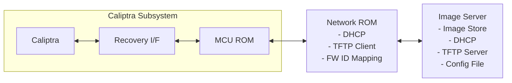
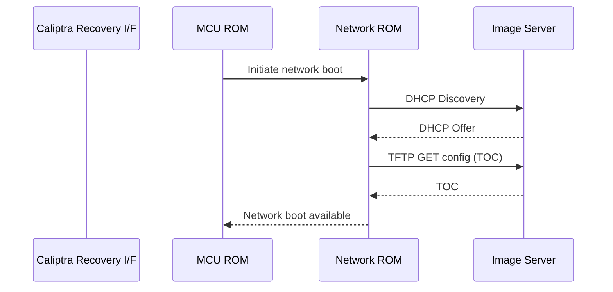
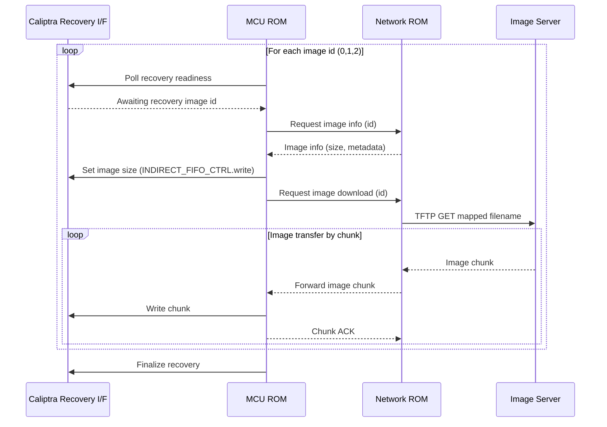

# BMC Network Recovery Boot - Design Document

## Overview

This document outlines the design for a lightweight network recovery boot utility for the Caliptra subsystem. The system enables the Caliptra SS to download firmware images over the network through a dedicated Network Boot Coprocessor within a ROM environment, providing a resilient fallback path when flash memory is corrupted.

The network boot coprocessor acts as an intermediary between remote image servers and the Caliptra SS, handling network communications including DHCP configuration, TFTP server discovery, and firmware image downloads. The system supports downloading multiple firmware components including Caliptra FMC+RT images, SoC manifests, and MCU runtime images through a firmware ID-based mapping system.

## Motivation

### Flash Dependency Risk
- Boot failure if **both flashes are corrupted**

### Recovery Challenge
- Physical intervention is costly in **hyperscale environments**

### Design Goals
- Minimal **MCU ROM** footprint
- Consistent with **OCP streaming boot model** for early firmware (Caliptra FMC + RT, SoC Manifest, MCU RT)
- Secure image retrieval
- Resilient fallback path

### Potential Solution
- Use a **dedicated co-processor** with a lightweight network stack
- Automatically configure networking via **DHCP**
- Securely download **Caliptra early firmware images** into the Caliptra subsystem

## System Architecture



## Network Recovery Boot Flow

The following diagram illustrates the high-level flow of the network recovery boot process from initialization to image availability:



### Image Transfer Sequence

Once the network boot is available, the MCU ROM performs image transfers for each firmware component:



## Messaging Protocol

The network boot system uses a simple messaging protocol between the MCU ROM and Network ROM:

| Message | Direction | Fields | Purpose |
|-------|----------|--------|----------|
| Network Boot Discovery | MCU → Network ROM | — | Start network boot |
| Image Info Request | MCU → Network ROM | firmware_id | Query image metadata |
| Image Download Request | MCU → Network ROM | firmware_id | Start transfer |
| Chunk ACK | MCU → Network ROM | firmware_id, offset | Flow control |
| Boot Complete / Error | MCU → Network ROM | status, error_code | Completion |

## Protocol Support

The network boot coprocessor supports a minimal set of protocols optimized for the Caliptra ROM environment:

### DHCP (Dynamic Host Configuration Protocol)
- **Purpose**: Automatic network configuration
- **Advantages**: 
  - Standard network configuration protocol
  - Minimal overhead for basic IP assignment
  - Simple UDP-based protocol
- **Implementation**: Client-side DHCP for IP address, gateway, and boot server discovery

### TFTP (Trivial File Transfer Protocol)
- **Purpose**: Lightweight file transfer for firmware images
- **Advantages**: 
  - Extremely lightweight - minimal overhead perfect for ROM environments
  - Simple UDP-based protocol - easy to implement securely
  - Small code footprint (~5-10KB implementation)
  - Standard protocol for network boot scenarios
- **Implementation**: Client-side TFTP for firmware image download
## Boot Source Provider Interface Design

The Boot Source Provider Interface defines a generic contract for boot image providers, enabling support for multiple boot sources (network boot coprocessor, flash device, or other custom implementations). The MCU ROM communicates with any boot source through this unified interface.

### Core Operations

Boot source providers implement the following core operations:

#### Initialization
- **Source Initialization**: Initialize the boot source and make it ready for image requests
- **Status Discovery**: Determine availability and readiness of the boot source
- **Configuration Discovery**: Discover firmware image metadata and availability

#### Image Provisioning
- **Image Metadata Query**: Query information about available firmware images (size, checksums, etc.)
- **Image Download**: Download firmware images by firmware ID
- **Data Streaming**: Stream image data to the MCU ROM for direct transfer to Caliptra SS

#### Supported Firmware IDs
- **ID 0**: Caliptra FMC+RT image
- **ID 1**: SoC Manifest
- **ID 2**: MCU RT image

### Boot Source Provider Interface

```rust
/// Generic boot source provider interface for the MCU ROM
/// This interface abstracts different boot sources (network, flash, etc.)
pub trait BootSourceProvider {
    type Error;
    
    /// Initialize the boot source
    /// This performs source-specific initialization (e.g., DHCP for network, etc.)
    fn initialize(&mut self) -> Result<BootSourceStatus, Self::Error>;
    
    /// Get information about a firmware image
    fn get_image_info(&self, firmware_id: FirmwareId) -> Result<ImageInfo, Self::Error>;
    
    /// Download firmware image by ID
    /// Returns a stream for reading image data in chunks
    fn download_image(&mut self, firmware_id: FirmwareId) -> Result<ImageStream, Self::Error>;
    
    /// Get boot source status and capabilities
    fn get_boot_source_status(&self) -> Result<BootSourceStatus, Self::Error>;
}

/// Firmware ID enumeration
#[derive(Debug, Clone, Copy)]
pub enum FirmwareId {
    /// Caliptra FMC+RT image
    CaliptraFmcRt = 0,
    /// SoC Manifest
    SocManifest = 1,
    /// MCU RT image
    McuRt = 2,
}

/// Boot source initialization and capability status
#[derive(Debug)]
pub struct BootSourceStatus {
    pub ready: bool,
    pub initialized: bool,
    pub config_available: bool,
    pub available_images: u32,
}

/// Metadata for a firmware image
#[derive(Debug, Clone)]
pub struct ImageInfo {
    pub firmware_id: FirmwareId,
    pub size: u64,
    pub checksum: Option<[u8; 32]>,
    pub version: Option<String>,
}

/// Streaming interface for image data
pub trait ImageStream {
    /// Read next chunk of image data
    fn read_chunk(&mut self, buffer: &mut [u8]) -> Result<usize, Error>;
    
    /// Get total image size if known
    fn total_size(&self) -> Option<u64>;
    
    /// Check if stream is complete
    fn is_complete(&self) -> bool;
}
```

### Implementation Example: Network Boot Coprocessor

For a network boot coprocessor implementation, the boot source provider would:

1. **Initialize**: Perform DHCP discovery, locate TFTP server, download TOC
2. **Get Image Info**: Query image metadata from downloaded TOC
3. **Download Image**: Fetch image from TFTP server and stream to MCU ROM

```rust
/// Network-based boot source provider implementation
pub struct NetworkBootSource {
    dhcp_client: DhcpClient,
    tftp_client: TftpClient,
    toc: TableOfContents,
}

impl BootSourceProvider for NetworkBootSource {
    type Error = NetworkBootError;
    
    fn initialize(&mut self) -> Result<BootSourceStatus, Self::Error> {
        // 1. Perform DHCP discovery
        self.dhcp_client.discover()?;
        
        // 2. Download TOC via TFTP
        self.toc = self.tftp_client.download_config()?;
        
        Ok(BootSourceStatus {
            ready: true,
            initialized: true,
            config_available: true,
            available_images: self.toc.firmware_mappings.len() as u32,
        })
    }
    
    fn get_image_info(&self, firmware_id: FirmwareId) -> Result<ImageInfo, Self::Error> {
        let mapping = self.toc.get_mapping(firmware_id)?;
        Ok(ImageInfo {
            firmware_id,
            size: mapping.size,
            checksum: mapping.checksum,
            version: mapping.version.clone(),
        })
    }
    
    fn download_image(&mut self, firmware_id: FirmwareId) -> Result<ImageStream, Self::Error> {
        let mapping = self.toc.get_mapping(firmware_id)?;
        self.tftp_client.get_file(&mapping.filename)
    }
    
    fn get_boot_source_status(&self) -> Result<BootSourceStatus, Self::Error> {
        // Return current network and TFTP status
        Ok(BootSourceStatus {
            ready: self.tftp_client.is_reachable(),
            initialized: true,
            config_available: true,
            available_images: self.toc.firmware_mappings.len() as u32,
        })
    }
}
```

### Usage Example

```rust
// Example: MCU ROM boot process using generic boot source
fn perform_boot_from_source(mut boot_source: &mut dyn BootSourceProvider) -> Result<(), Error> {
    // 1. Initialize boot source
    let status = boot_source.initialize()?;
    
    if !status.ready || !status.initialized {
        return Err(Error::BootSourceNotAvailable);
    }
    
    // 2. Download each firmware image
    for firmware_id in [FirmwareId::CaliptraFmcRt, FirmwareId::SocManifest, FirmwareId::McuRt] {
        // Get image metadata
        let image_info = boot_source.get_image_info(firmware_id)?;
        
        // Set up recovery interface with image size
        set_recovery_image_size(image_info.size)?;
        
        // Download image
        let mut stream = boot_source.download_image(firmware_id)?;
        
        // Stream image chunks to recovery interface
        load_image_stream(stream, ImageDestination::Recovery)?;
    }
    
    // 3. Finalize recovery
    finalize_recovery()?;
    
    Ok(())
}

fn load_image_stream(mut stream: ImageStream, dest: ImageDestination) -> Result<(), Error> {
    let mut buffer = [0u8; 4096];
    while !stream.is_complete() {
        let bytes_read = stream.read_chunk(&mut buffer)?;
        if bytes_read > 0 {
            write_image_chunk(dest, &buffer[..bytes_read])?;
        }
    }
    Ok(())
}
```

### Configuration File Format (TOC - Table of Contents)

The network boot coprocessor downloads a configuration file (TOC) that maps firmware IDs to filenames and metadata:

```json
{
  "firmware_mappings": {
    "0": { "filename": "caliptra-fmc-rt.bin", "size": 1048576 },
    "1": { "filename": "soc-manifest.bin", "size": 65536 },
    "2": { "filename": "mcu-runtime.bin", "size": 262144 }
  }
}
```

## Network Stack Implementation

For the Network Boot Coprocessor implementation, we need a minimal network stack that supports DHCP and TFTP while meeting the constraints of a ROM environment.

### Option 1: lwIP (Lightweight IP) with Rust Bindings

**Repository**: https://git.savannah.nongnu.org/cgit/lwip.git (upstream C)  
**Rust Bindings**: https://github.com/embassy-rs/lwip (Embassy lwIP bindings)  

**Description**: Mature, lightweight TCP/IP stack originally written in C with Rust FFI bindings.

**Advantages**:
- ✅ **Built-in DHCP and TFTP Support**: Native support for required protocols
- ✅ **Mature and Battle-Tested**: Currently used by u-boot and other embedded systems
- ✅ **Minimal Configuration**: Can be configured for UDP-only operation

**Disadvantages**:
- ❌ **C Language Security Risks**: Inherits buffer overflow and memory safety vulnerabilities from C
- ❌ **FFI Complexity**: Rust-C interop adds complexity and potential for safety violations

**Required Protocol Support**:
- ✅ DHCP client
- ✅ TFTP client
- ✅ UDP sockets

### Option 2: smoltcp + Custom TFTP

**Core**: https://github.com/smoltcp-rs/smoltcp (0BSD License)  
**TFTP**: Custom implementation on UDP

**Description**: Pure Rust network stack with custom TFTP implementation for minimal footprint.

**Advantages**:
- ✅ **Memory Safety**: Pure Rust eliminates entire classes of security vulnerabilities
- ✅ **ROM Optimized**: Minimal footprint with only required features included
- ✅ **Modular Design**: Include only DHCP and TFTP to minimize code size
- ✅ **No FFI Overhead**: Native Rust performance without C interop costs
- ✅ **Strong Type Safety**: Compile-time prevention of many networking bugs
- ✅ **Excellent Licensing**: 0BSD license is very permissive

**Disadvantages**:
- ❌ **Custom TFTP Implementation**: Must implement TFTP protocol from scratch
- ❌ **Less Battle-Tested**: Newer ecosystem compared to lwIP

**Required Protocol Support**:
- ✅ UDP sockets (smoltcp)
- ✅ DHCP client (smoltcp) 
- ⚠️ TFTP (custom implementation required)

### Recommended Approach

**For Production Caliptra System**: **smoltcp + Custom TFTP**

**Rationale**:
- **Security First**: Memory safety is critical for Root of Trust systems
- **ROM Constraints**: Minimal footprint with only DHCP and TFTP support
- **Simplicity**: Reduced complexity with only essential protocols
- **Control**: Custom TFTP implementation allows Caliptra-specific optimizations

**Implementation Strategy**:
1. **Phase 1**: Implement core UDP networking with smoltcp
2. **Phase 2**: Add DHCP client functionality  
3. **Phase 3**: Implement lightweight TFTP client for firmware downloads

**Protocol Implementation Order**:
1. **UDP Sockets**: Foundation for all network communication
2. **DHCP Client**: Automatic network configuration
3. **TFTP Client**: Firmware image download capability


