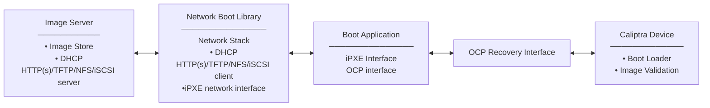
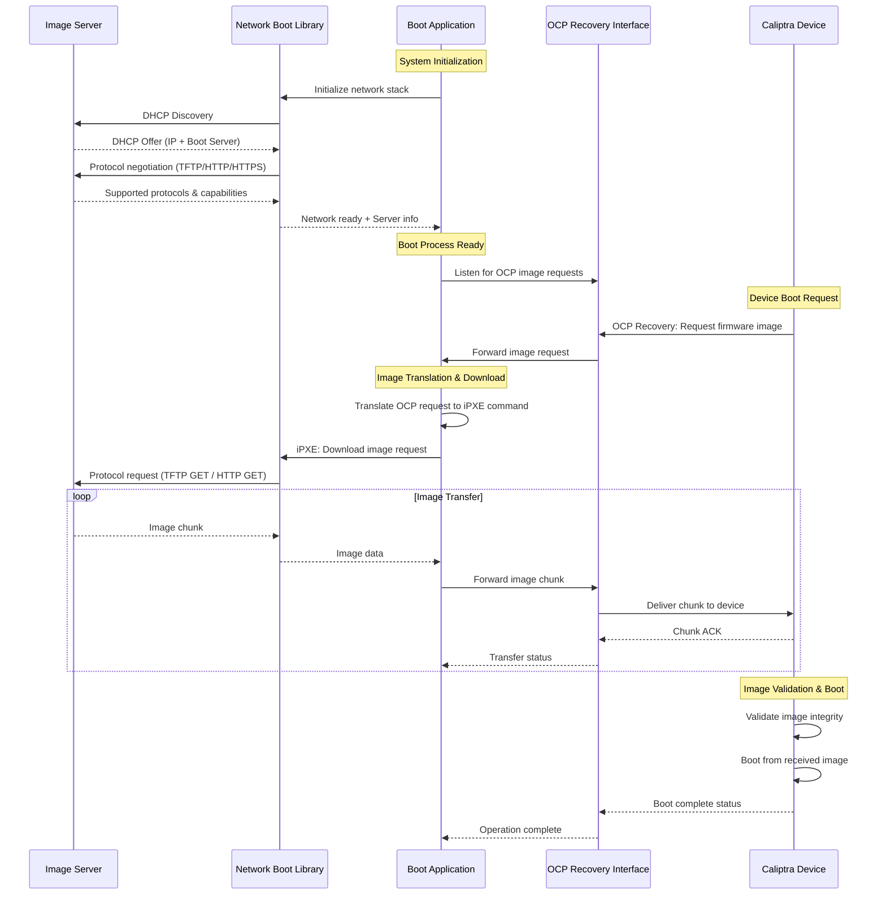

# Caliptra Network Boot Utility - Design Document

## Overview

This document outlines the design for a lightweight network boot utility for the Caliptra subsystem, similar to PXE boot functionality. The system will enable devices to download firmware images over the network and load them into Caliptra client devices via the OCP Recovery Interface within a ROM environment.

The network boot utility acts as an intermediary between remote image servers and Caliptra devices, handling network communications and interfacing with Caliptra through the standardized OCP (Open Compute Project) Recovery Interface protocol.

## System Architecture



## System Boot Process Flow

The following diagram illustrates the high-level flow of the network boot process from initialization to image delivery:



## Protocol Support Design Options

The network boot utility needs to decide which protocols to support for image transfer. Each protocol has different advantages and trade-offs for the Caliptra ROM environment:

### TFTP (Trivial File Transfer Protocol)
**Should we support TFTP?** 
- ✅ **Advantages**: 
  - Basic support in network boot
  - Extremely lightweight - minimal overhead perfect for ROM environments
  - Simple UDP-based protocol - easy to implement securely
    - Small code footprint (~5-10KB implementation)
- ❌ **Disadvantages**:
  - No built-in authentication or encryption
  - Limited error recovery mechanisms
  - No resume capability for interrupted transfers

### HTTP (HyperText Transfer Protocol)
**Should we support HTTP?**
- ✅ **Advantages**:
  - Universal protocol - works with any web server infrastructure
  - Excellent debugging and monitoring tools available
  - Support for range requests (partial downloads/resume)
  - Flexible authentication mechanisms (Basic, Digest, OAuth)
  - Standardized status codes and error handling
- ❌ **Disadvantages**:
  - Larger protocol overhead - more complex than TFTP
  - Requires TCP implementation (more memory usage)
  - Plain HTTP lacks encryption (security concern)
  - More complex parsing required

### HTTPS (HTTP Secure)
**Should we support HTTPS?**
- ✅ **Advantages**:
  - HTTP + Security
- ❌ **Disadvantages**:
  - Significant memory overhead for TLS stack (~50-100KB)
  - CPU overhead for encryption/decryption operations
  - Certificate management complexity in ROM environment
  - Larger code footprint may exceed ROM constraints

### FTP (File Transfer Protocol)
**Should we support FTP?**
- ✅ **Advantages**:
  - Mature protocol with extensive server support
  - Efficient binary file transfer capabilities
  - Built-in authentication mechanisms
  - Directory listing and file management features
- ❌ **Disadvantages**:
  - Complex dual-connection protocol (control + data channels)
  - Large protocol overhead inappropriate for ROM environment
  - Security issues with plaintext authentication
  - Firewall complications due to dynamic port usage

### NFS (Network File System)
**Should we support NFS?**
- ✅ **Advantages**:
  - Transparent file system access - appears as local storage
- ❌ **Disadvantages**:
  - Extremely complex protocol stack (RPC, XDR, Mount protocol)
  - Large memory footprint incompatible with ROM constraints
  - Stateful connections problematic for boot scenarios

### iSCSI (Internet Small Computer Systems Interface)
**Should we support iSCSI?**

The iSCSI protocol is used for connecting storage attached networks. It provides mutual authentication using the CHAP protocol. It typically runs on a TCP transport.

- ✅ **Advantages**:
  - Enterprise storage integration capabilities
  - Supports advanced features like snapshots and cloning
- ❌ **Disadvantages**:
  - Extremely complex protocol requiring SCSI command set knowledge
  - Large memory requirements for connection state management

### Protocol Recommendation Matrix

| Protocol | ROM Suitability | Security | Implementation Complexity | Infrastructure Support | Recommended |
|----------|----------------|----------|--------------------------|----------------------|-------------|
| **TFTP** | ⭐⭐⭐⭐⭐ | ⭐⭐ | ⭐⭐⭐⭐⭐ | ⭐⭐⭐⭐⭐ | ✅ **Primary** |
| **HTTP** | ⭐⭐⭐⭐ | ⭐⭐ | ⭐⭐⭐ | ⭐⭐⭐⭐⭐ | ✅ **Secondary** |
| **HTTPS** | ⭐⭐ | ⭐⭐⭐⭐⭐ | ⭐⭐ | ⭐⭐⭐⭐ | ⚠️ **Optional** |
| **FTP** | ⭐ | ⭐⭐ | ⭐ | ⭐⭐⭐ | ❌ **Not Recommended** |
| **NFS** | ⭐ | ⭐⭐ | ⭐ | ⭐⭐⭐ | ❌ **Not Recommended** |
| **iSCSI** | ⭐ | ⭐⭐⭐ | ⭐ | ⭐⭐ | ❌ **Not Recommended** |

## iPXE Interface Design

### Why iPXE Interface?

The iPXE interface serves as a abstraction layer between the Boot Application and the Network Boot Library. This design choice provides several key advantages:

**Standardization**: iPXE defines a well-established set of network boot commands that are widely understood and documented. By implementing an iPXE-compatible interface, we leverage existing knowledge and tooling from the network boot ecosystem.

**Abstraction**: The iPXE interface abstracts the complexity of different network protocols (TFTP, HTTP, HTTPS) behind a uniform command set. This allows the Boot Application to focus on OCP protocol translation without needing to understand the intricacies of each network protocol.

**Flexibility**: iPXE's command structure supports multiple protocols and boot scenarios, providing flexibility for future enhancements and different deployment environments.

### iPXE Command Set Integration

Based on the [iPXE command reference](https://ipxe.org/cmd), the following core commands will be implemented:

#### Network Configuration Commands
- **`dhcp`**: Automatically configure network interface using DHCP
- **`ifconfig`**: Manual network interface configuration
- **`route`**: Configure network routing tables

#### File Transfer Commands  
- **`imgfetch`**: Download image files from remote servers
- **`imgload`**: Load downloaded images into memory
- **`imgexec`**: Execute loaded images (adapted for Caliptra delivery)

#### Protocol-Specific Commands
- **`chain`**: Load and execute remote boot files via HTTP/HTTPS
- **`sanboot`**: Boot from SAN devices (adapted for network storage)

#### Utility Commands
- **`echo`**: Display messages for debugging
- **`sleep`**: Introduce delays in boot sequences
- **`exit`**: Terminate boot process

### iPXE Interface Implementation

```rust
/// iPXE-compatible interface for network boot operations
pub trait iPxeInterface {
    type Error;
    
    /// Configure network interface via DHCP
    fn dhcp(&mut self, interface: Option<&str>) -> Result<NetworkConfig, Self::Error>;
    
    /// Fetch image from remote server
    fn imgfetch(&mut self, url: &str, name: Option<&str>) -> Result<ImageHandle, Self::Error>;
    
    /// Load fetched image into memory
    fn imgload(&mut self, handle: ImageHandle) -> Result<LoadedImage, Self::Error>;
    
    /// Execute/deliver loaded image (to Caliptra via OCP)
    fn imgexec(&mut self, image: LoadedImage) -> Result<(), Self::Error>;
    
    /// Chain boot from remote location
    fn chain(&mut self, url: &str) -> Result<(), Self::Error>;
    
    /// Configure network interface manually
    fn ifconfig(&mut self, interface: &str, config: &NetworkConfig) -> Result<(), Self::Error>;
    
    /// Display diagnostic information
    fn echo(&self, message: &str);
    
    /// Sleep for specified duration
    fn sleep(&mut self, seconds: u32) -> Result<(), Self::Error>;
}

/// Network configuration structure
#[derive(Debug, Clone)]
pub struct NetworkConfig {
    pub ip_address: IpAddr,
    pub netmask: IpAddr, 
    pub gateway: Option<IpAddr>,
    pub dns_servers: Vec<IpAddr>,
}

/// Handle to a fetched image
#[derive(Debug)]
pub struct ImageHandle {
    pub name: String,
    pub url: String,
    pub size: Option<u64>,
    pub protocol: Protocol,
}

/// Loaded image ready for execution
#[derive(Debug)]
pub struct LoadedImage {
    pub handle: ImageHandle,
    pub data: Vec<u8>,
    pub checksum: Option<[u8; 32]>,
}

/// Supported protocols
#[derive(Debug, Clone)]
pub enum Protocol {
    Tftp,
    Http,
    Https,
    Custom(String),
}
```

### Integration Benefits

**Boot Application Perspective**: The Boot Application can use familiar iPXE commands to request network operations without understanding protocol details:
```rust
// Example: Boot Application handling OCP request
fn handle_ocp_image_request(&mut self, image_id: &str) -> Result<(), Error> {
    // Translate OCP request to iPXE commands
    let url = format!("tftp://192.168.1.100/{}", image_id);
    
    let handle = self.ipxe.imgfetch(&url, Some(image_id))?;
    let image = self.ipxe.imgload(handle)?;
    
    // imgexec will deliver to Caliptra via OCP interface
    self.ipxe.imgexec(image)?;
    
    Ok(())
}
```

**Network Boot Library Perspective**: The library implements iPXE commands by translating them to appropriate network protocol operations, handling all the low-level protocol complexity internally.

**Maintainability**: Changes to network protocols or implementations only require updates to the Network Boot Library, while the Boot Application interface remains stable.

**Testing & Debugging**: iPXE's well-known commands enable easier testing and debugging, as network administrators can understand and trace the boot process using familiar terminology.

## Network Stack Design Options

For the Network Boot Library implementation, we need to choose a network stack that can handle the required protocols while meeting the constraints of a ROM environment. Here are the two primary options:

### Option 1: lwIP (Lightweight IP) with Rust Bindings

**Repository**: https://git.savannah.nongnu.org/cgit/lwip.git (upstream C)  
**Rust Bindings**: https://github.com/embassy-rs/lwip (Embassy lwIP bindings)  
**Alternative Bindings**: https://github.com/datdenkikniet/lwip-rs  

**Description**: Mature, lightweight TCP/IP stack originally written in C with Rust FFI bindings.

**Advantages**:
- ✅ **Comprehensive Protocol Support**: Built-in support for HTTP, HTTPS, TFTP, FTP, and other protocols
- ✅ **Mature and Battle-Tested**: Currently used by u-boot

**Disadvantages**:
- ❌ **C Language Security Risks**: Inherits buffer overflow and memory safety vulnerabilities from C
- ❌ **FFI Complexity**: Rust-C interop adds complexity and potential for safety violations

**Protocol Support**:
- ✅ HTTP/HTTPS client and server
- ✅ TFTP client and server
- ✅ FTP client support
- ✅ DHCP client
- ✅ DNS resolution
- ✅ TCP/UDP sockets
- ✅ iSCSI (via extensions)
- ✅ NFS (via extensions)

### Option 2: smoltcp + Protocol Libraries

**Core**: https://github.com/smoltcp-rs/smoltcp (0BSD License)  
**HTTP Library**: https://github.com/algesten/ureq (MIT/Apache-2.0)  
**TLS Library**: https://github.com/rustls/rustls (Apache-2.0/ISC/MIT)  
**TFTP Library**: Custom implementation on UDP

**Description**: Pure Rust network stack with additional protocol libraries for complete functionality.

**Advantages**:
- ✅ **Memory Safety**: Pure Rust eliminates entire classes of security vulnerabilities
- ✅ **ROM Optimized**: Minimal footprint with only required features included
- ✅ **Modular Design**: Include only needed protocols to minimize code size
- ✅ **No FFI Overhead**: Native Rust performance without C interop costs
- ✅ **Strong Type Safety**: Compile-time prevention of many networking bugs
- ✅ **Excellent Licensing**: 0BSD core with permissive supporting libraries

**Disadvantages**:
- ❌ **Protocol Gap**: Requires additional libraries or custom implementations for some protocols
- ❌ **Integration Complexity**: Need to integrate multiple crates for full functionality
- ❌ **Less Battle-Tested**: Newer ecosystem with less production deployment history
- ❌ **Custom TFTP Implementation**: Must implement TFTP protocol on top of UDP
- ❌ **Limited HTTP Features**: May need custom HTTP implementation for advanced features

**Protocol Support**:
- ✅ TCP/UDP sockets (smoltcp)
- ✅ DHCP client (smoltcp)
- ✅ DNS resolution (smoltcp)
- ✅ HTTP client (ureq + smoltcp)
- ✅ HTTPS client (ureq + rustls + smoltcp)
- ⚠️ TFTP (custom implementation required)
- ❌ FTP (not readily available)
- ❌ iSCSI (not available)
- ❌ NFS (not available)


### Recommended Approach

**For Production Caliptra System**: **smoltcp + Protocol Libraries**

**Rationale**:
- **Security First**: Memory safety is critical for Root of Trust systems
- **ROM Constraints**: Modular design allows precise size control
- **Future-Proof**: Pure Rust ecosystem provides better long-term maintainability
- **Custom Protocol Support**: Easier to implement Caliptra-specific optimizations

**Implementation Strategy**:
1. **Phase 1**: Implement core networking with smoltcp (TCP, UDP, DHCP)
2. **Phase 2**: Add HTTP support using ureq for web-based image servers
3. **Phase 3**: Implement custom TFTP client for PXE compatibility
4. **Phase 4**: Add HTTPS support with rustls for secure image transfer

**Protocol Priority**:
1. **UDP + Custom Protocol**: Primary method for lightweight, fast boot
2. **TFTP**: Secondary for PXE infrastructure compatibility  
3. **HTTP**: Tertiary for web server integration
4. **HTTPS**: Optional for high-security environments


