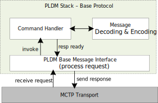
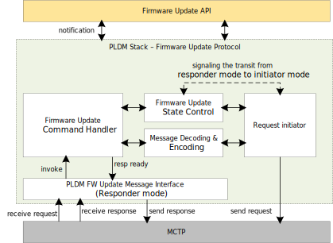
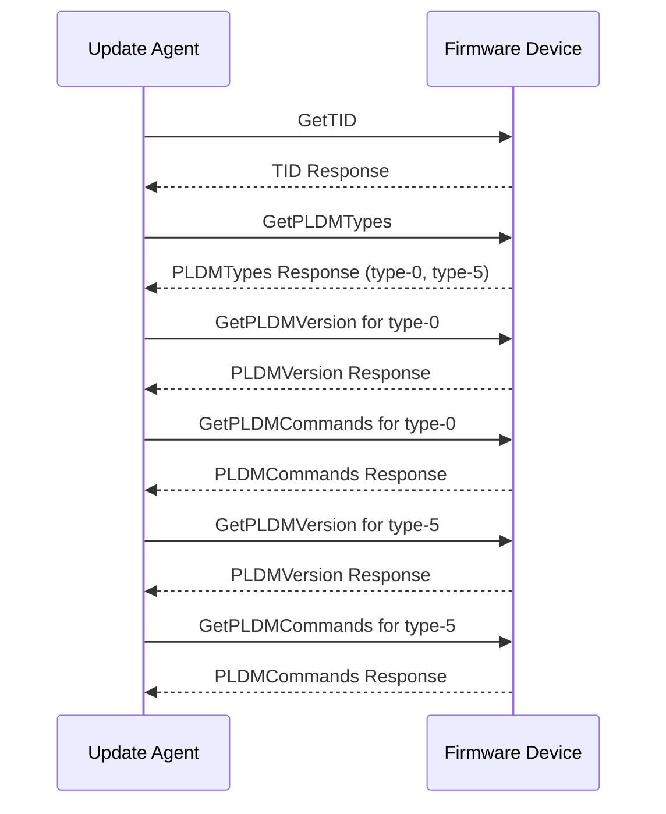
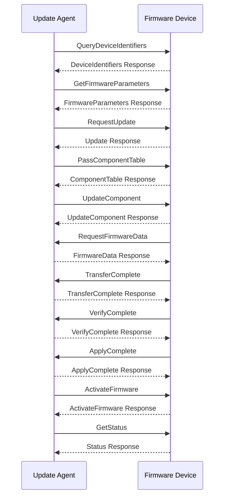

# PLDM stack

## Overview

The Platform Level Data Model (PLDM) is a suite of specifications that define a common data model and message formats for communication between management controllers and managed devices. It is designed to standardize the way devices communicate in a platform management environment, enabling interoperability and simplifying the management of hardware components. In the context of Caliptra MCU, [PLDM Base Protocol](https://www.dmtf.org/sites/default/files/standards/documents/DSP0240_1.1.0.pdf) and [PLDM for Firmware Update Protocol](https://www.dmtf.org/sites/default/files/standards/documents/DSP0267_1.3.0.pdf) are supported by PLDM stack to facilitate the following use cases:

- **PLDM message control and discovery**: This feature enables the device to be discovered by the platform management controller (typically a BMC) following MCTP enumeration. It forms the foundation for running other PLDM protocols.

- **Streaming boot reminder firmware**: PLDM firmware update protocol defines standardized messages and data structures for obtaining firmware code and data. MCU leverages it to stream boot reminder firmware, which is vendor-specific SoC firmware and beyond. There are several customized amendments to PLDM firmware update specification to enable streaming boot and automatic activation. Details are available in OCP whitepaper [Flashless Boot using OCP, PCIe, and DMTF Standards](https://docs.google.com/document/d/1cjdgcKgOzcug5bBoK6k2Mw2mvsQJElp8bs0ec_xLZHc/edit?usp=sharing).

- **Impactless firmware update**: PLDM firmware update over MCTP is a well-established approach for firmware updates, supporting multiple firmware components within a single package. Updates can be applied to a subset of components supported by the Firmware Device (FD), which is a valuable properity to enable impactless updates. Details can be found in [MCU firmware update spec](TODO: link to the document)

## Architecture

PLDM stack in MCU runtime is a modular implementation that supports PLDM base protocol as responder and PLDM firmware update protocol as Firmware Device(FD). It operates in the userspace of MCU runtime, interacts with the MCTP transport layer to handle communication.

### PLDM stack for base protocol

- **PLDM service**
      - Listens for incoming PLDM requests.
      - Extracts the command op code from the request and invokes the corresponding handler to process.
      - Sends the response via MCTP transport layer.
- **Command handler**
      - Interacts with message decoding library to decode the request.
      - Executs the command.
      - Encodes the response by interacting with message encoding library.

## PLDM stack for firmware update protocol

- **PLDM service**
  - Listens for incoming firmware update requests and responses.
  - Extracts the command op code from the request or response and invoke the corresponding handler to process.
  - Sends the response via MCTP transport layer.

- **Firmware update service**
  - Firmware update command handler
    - Decode the request or response.
    - Executes the appropriate actions based on the command and interacts with state machine to trigger the state transition.
    - Encodes responses by interacting with message encoding library.

  - Firmware update state control
    - Maintains the current state of the firmware update process.
    - Provides mechanisms to transition between different states, ensuring the correct sequence of operations.
    - Interacts with the firmware update service to manage state transitions based on the stage of the update process, and signals the request inititor to process outgoing request.

  - Request initiator
    - Listens for the signal from state control to process outgoing request.
    - Interacts with message encoding library to encode the request.

### PLDM base protocol sequence

The table below shows the command codes of base protocol that are supported by PLDM stack as a responder.

| Command Name       | Command Code | Direction | Requirement |
|--------------------|--------------|-----------|-------------|
| `GetTID`           | `0x02`       | UA -> FD  | Mandatory   |
| `GetPLDMVersion`   | `0x03`       | UA -> FD  | Mandatory   |
| `GetPLDMTypes`     | `0x04`       | UA -> FD  | Mandatory   |
| `GetPLDMCommands`  | `0x05`       | UA -> FD  | Mandatory   |
| `SetTID`           | `0x01`       | UA -> FD  | Optional    |

The digram below shows the PLDM message control and discovery sequence.

### PLDM firmware update protocol sequence

The table below shows the inventory commands and firmware update commands are supported by PLDM stack as FD.

| Command Name                   | Command Code | Direction | Requirement |
|--------------------------------|--------------|-----------|-------------|
| `QueryDeviceIdentifiers`       | `0x01`       | UA -> FD  | Mandatory   |
| `GetFirmwareParameters`        | `0x02`       | UA -> FD  | Mandatory   |
| `RequestUpdate`                | `0x10`       | UA -> FD  | Mandatory   |
| `GetPackageData`               | `0x11`       | FD -> UA  | Mandatory   |
| `GetDeviceMetaData`            | `0x12`       | UA -> FD  | Mandatory   |
| `PassComponentTable`           | `0x13`       | UA -> FD  | Mandatory   |
| `UpdateComponent`              | `0x14`       | UA -> FD  | Mandatory   |
| `RequestFirmwareData`          | `0x15`       | FD -> UA  | Mandatory   |
| `TransferComplete`             | `0x16`       | FD -> UA  | Mandatory   |
| `VerifyComplete`               | `0x17`       | FD -> UA  | Mandatory   |
| `ApplyComplete`                | `0x18`       | FD -> UA  | Mandatory   |
| `GetMetaData`                  | `0x19`       | FD -> UA  | Mandatory   |
| `ActivateFirmware`             | `0x1A`       | UA -> FD  | Mandatory   |
| `GetStatus`                    | `0x1B`       | UA -> FD  | Mandatory   |
| `CancelUpdateComponent`        | `0x1C`       | UA -> FD  | Mandatory   |
| `CancelUpdate`                 | `0x1D`       | UA -> FD  | Mandatory   |

The diagram below shows a complete PLDM firmware update sequence:

