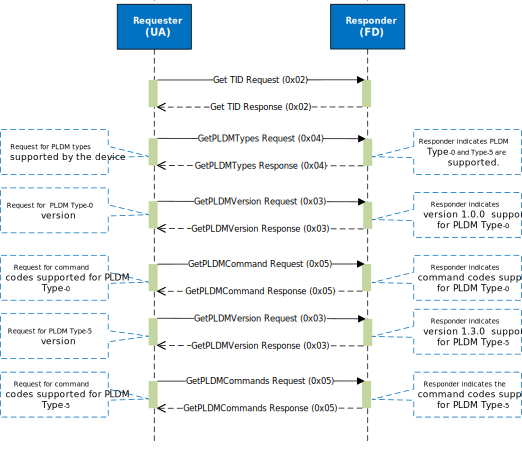

# PLDM stack

## Overview

The Platform Level Data Model (PLDM) is a suite of specifications that define a common data model and message formats for communication between management controllers and managed devices. It is designed to standardize the way devices communicate in a platform management environment, enabling interoperability and simplifying the management of hardware components. In the context of MCU, [PLDM base protocol](https://www.dmtf.org/sites/default/files/standards/documents/DSP0240_1.1.0.pdf) and [PLDM-T5 firmware update protocol](https://www.dmtf.org/sites/default/files/standards/documents/DSP0267_1.1.0.pdf) are supported by PLDM stack to facilitate the following use cases:

- **PLDM discovery**: This allows the MCU to be discovered by platform management controller(usually it's BMC) after MCTP enumeration and communicate with other PLDM-capable devices on the platform, enabling seamless integration and management of hardware components. MCU PLDM stack supports PLDM base protocol as responder mode.

- **Streaming boot reminder firmware**: PLDM-T5 firmware update protocol defines standardized messages and data structures for obtaining firmware code and data. MCU leverages it to stream boot reminder firmware (e.g. vendor-specific SoC firmware). There are several customized amendments to PLDM-T5 specification to enable streaming boot and automatic activation. Details are available in OCP whitepaper [Flashless Boot using OCP, PCIe, and DMTF Standards](https://docs.google.com/document/d/1cjdgcKgOzcug5bBoK6k2Mw2mvsQJElp8bs0ec_xLZHc/edit?usp=sharing). MCU PLDM stack implements Firmware Device (FD) functionality only for now.

- **Impactless firmware update**: PLDM-T5 protocol over MCTP is a well-established approach for firmware updates, supporting multiple firmware components within a single package. Updates can be applied to a subset of components supported by the Firmware Device (FD), which is a valuable properity to enable impactless updates. Details can be found in the [Firmware update specification](//TODO: add the link).

## Architecture

PLDM stack in the MCU runtime is a modular implementation that supports PLDM base protocol in responder mode and PLDM firmware update protocol as Firmware Device(FD). It operates in the userspace of the MCU runtime and interacts with the MCTP transport layer to handle communication.

It consists of several layers, each responsible for different aspects of the protocol:

- **Incoming message handling**: Receives incoming PLDM messages from the MCTP transport layer, passes them to the message decoding layer to extract command codes and data, and then dispatches them to the appropriate command handler for further processing.

- **Outgoing message handling**: Handles the creation of PLDM requests and their transmission over the MCTP transport layer.

- **Message encoding/decoding**: Converts request or response data structures to and from the PLDM message format, ensuring that messages are correctly formatted according to the PLDM specifications.

- **Command processing**: Processes incoming commands and generates appropriate responses, or initiate commands and processes responses based on the PLDM specification. This includes actions such as validating the firmware package and writing firmware data to the appropriate memory location by invoking other APIs.

### PLDM base protocol sequence
The table below shows the command codes of base protocol that are supported by PLDM stack as a responder.
| Command Name       | Command Code | Direction | Requirement |
|--------------------|--------------|-----------|-------------|
| `GetTID`           | `0x02`       | UA -> FD  | Mandatory   |
| `GetPLDMVersion`   | `0x03`       | UA -> FD  | Mandatory   |
| `GetPLDMTypes`     | `0x04`       | UA -> FD  | Mandatory   |
| `GetPLDMCommands`  | `0x05`       | UA -> FD  | Mandatory   |
| `SetTID`           | `0x01`       | UA -> FD  | Optional    |

The digram below shows the PLDM discovery sequence after MCTP enumeartion.
<p align="center">
    
</p>

### PLDM firmware update protocol sequence
The table below shows the inventory commands and firmware update commands are supported by PLDM stack as FD.
| Command Name                   | Command Code | Direction | Requirement |
|--------------------------------|--------------|-----------|-------------|
| `QueryDeviceIdentifiers`       | `0x01`       | UA -> FD  | Mandatory   |
| `GetFirmwareParameters`        | `0x02`       | UA -> FD  | Mandatory   |
| `RequestUpdate`                | `0x10`       | UA -> FD  | Mandatory   |
| `GetPackageData`               | `0x11`       | FD -> UA  | Mandatory   |
| `GetDeviceMetaData`            | `0x12`       | UA -> FD  | Mandatory   |
| `PassComponentTable`           | `0x13`       | UA -> FD  | Mandatory   |
| `UpdateComponent`              | `0x14`       | UA -> FD  | Mandatory   |
| `RequestFirmwareData`          | `0x15`       | FD -> UA  | Mandatory   |
| `TransferComplete`             | `0x16`       | FD -> UA  | Mandatory   |
| `VerifyComplete`               | `0x17`       | FD -> UA  | Mandatory   |
| `ApplyComplete`                | `0x18`       | FD -> UA  | Mandatory   |
| `GetMetaData`                  | `0x19`       | FD -> UA  | Mandatory   |
| `ActivateFirmware`             | `0x1A`       | UA -> FD  | Mandatory   |
| `GetStatus`                    | `0x1B`       | UA -> FD  | Mandatory   |
| `CancelUpdateComponent`        | `0x1C`       | UA -> FD  | Mandatory   |
| `CancelUpdate`                 | `0x1D`       | UA -> FD  | Mandatory   |
| `GetComponentOpaqueData`       | `0x21`       | FD -> UA  | Mandatory   |

The diagram below shows a complete PLDM firmware update sequence:


## Interface design

1. PLDM base command interface

``` Rust
pub struct MessageHandlerError(pub NonZeroU32);

pub trait MessageHandler {
    /// Processes a request and modifies the payload accordingly.
    /// Returns the number of bytes written to the payload or an error if the request processing fails.
    async fn process_request(&self, payload: &mut [u8]) -> Result<usize, MessageHandlerError>;

    /// Processes a response and modifies the payload accordingly.
    /// Returns the number of bytes written to the payload or an error if the response processing fails.
    async fn process_response(&self, payload: &mut [u8]) -> Result<usize, MessageHandlerError>;
}

struct PldmBaseCmdInterface<T: Mctp> {
    transport: T,
    // other context
    ...
}

#[async_trait::async_trait]
impl<T: Mctp> MessageHandler for PldmBaseCmdInterface<T> {
    async fn process_request(&self, payload: &mut [u8]) -> Result<usize, MessageHandlerError> {
        // Implement the request processing logic here
        Ok(0) // Placeholder
    }

    async fn process_response(&self, payload: &mut [u8]) -> Result<usize, MessageHandlerError> {
        // Implement the response processing logic here
        Ok(0) // Placeholder
    }
}
```

2. PLDM firmware update command interface


```Rust

pub struct FirmwareUpdateError(pub NonZeroU32);

pub trait FirmwareUpdateHandler {
    async fn write_to_staging_region();

    async fn verify ();

    async fn activate();
}

pub trait FirmwareUpdateStateControl {
    async fn get_state(&self) -> &FirmwareUpdateState;
    async fn transition_to(&mut self, new_state: FirmwareUpdateState);
}

struct PldmFwUpdateCmdInterface<T: mctp, U: FirmwareUpdateHandler, K: FirmwareUpdateStateControl> {
    transport: T;
    fw_update_handler: U,
    state_control: K,
    ...
}


```

## Streaming Boot reminder-fw with PLDM T-5


- Send notification to UA that device is ready for streaming boot reminder-fw  (When to send this? After recovery flow is done.)
- UA starts to send MCTP enumeration and PLDM discovery commands
- UA starts to send PLDM-T5 commands to stream boot reminder-fw
      First command is `UpdateComponent`