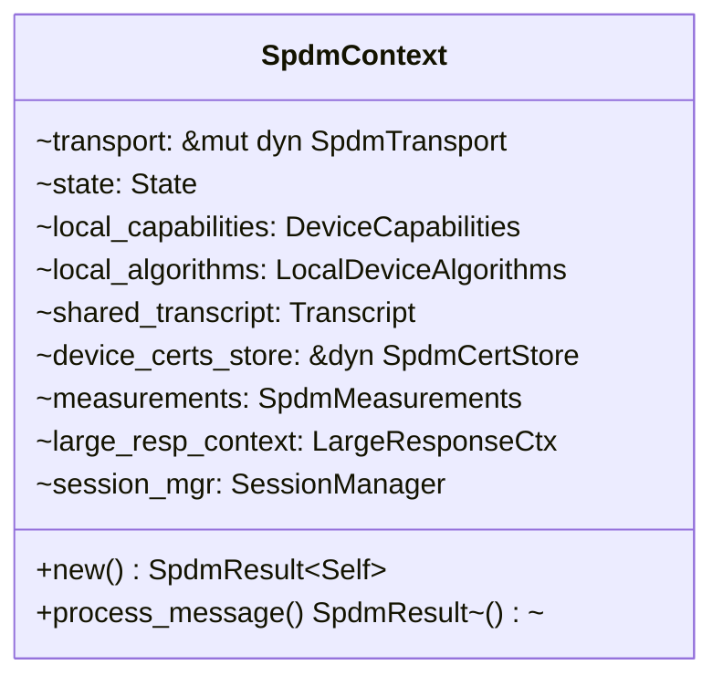
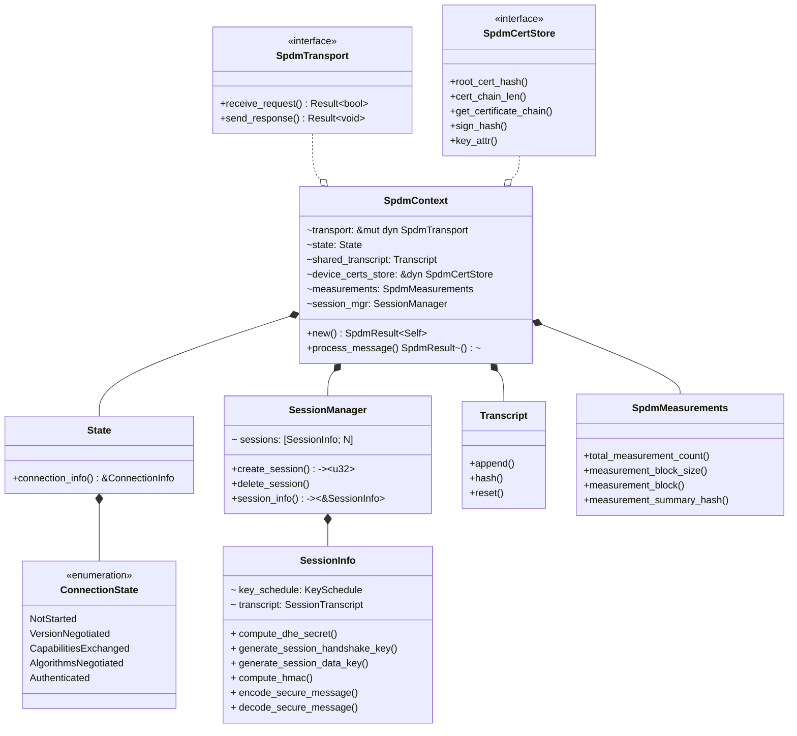

# SPDM Context 

```mermaid
classDiagram
    class SpdmContext {
        ~transport: &mut dyn SpdmTransport
        ~state: State
        ~local_capabilities: DeviceCapabilities
        ~local_algorithms: LocalDeviceAlgorithms
        ~shared_transcript: Transcript
        ~device_certs_store: &dyn SpdmCertStore
        ~measurements: SpdmMeasurements
        ~large_resp_context: LargeResponseCtx
        ~session_mgr: SessionManager

        +new() SpdmResult~Self~
        +process_message() SpdmResult~()~
    }
```

## Related Classes

```mermaid
classDiagram
    class SpdmContext {
        ~transport: &mut dyn SpdmTransport
        ~state: State
        ~shared_transcript: Transcript
        ~device_certs_store: &dyn SpdmCertStore
        ~measurements: SpdmMeasurements
        ~session_mgr: SessionManager

        +new() SpdmResult~Self~
        +process_message() SpdmResult~()~
    }

    class SpdmTransport {
        <<interface>>
        +receive_request() Result~bool~
        +send_response() Result~void~
    }

    class SpdmCertStore {
        <<interface>>
        +root_cert_hash()
        +cert_chain_len()
        +get_certificate_chain()
        +sign_hash()
        +key_attr()
    }

    class State {
        +connection_info() &ConnectionInfo
    }

    class ConnectionState {
        <<enumeration>>
        NotStarted
        VersionNegotiated
        CapabilitiesExchanged
        AlgorithmsNegotiated
        Authenticated
    }

    class SessionManager {
        ~ sessions: [SessionInfo; N]
        +create_session()->~u32~
        +delete_session()
        +session_info() ->~&SessionInfo~
    }

    class Transcript {
        +append()
        +hash()
        +reset()
    }

    class SessionInfo {
        ~ key_schedule: KeySchedule
        ~ transcript: SessionTranscript
        + compute_dhe_secret()
        + generate_session_handshake_key()
        + generate_session_data_key()
        + compute_hmac()
        + encode_secure_message()
        + decode_secure_message()
    }

    class SpdmMeasurements {
        +total_measurement_count()
        +measurement_block_size()
        +measurement_block()
        +measurement_summary_hash()
    }

    %% Core relationships
    %% Aggregation (left side)
    SpdmTransport ..o SpdmContext
    SpdmCertStore ..o SpdmContext
    
    %% Composition (right side)
    SpdmContext *-- State
    SpdmContext *-- Transcript
    SpdmContext *-- SessionManager
    SpdmContext *-- SpdmMeasurements

    State *-- ConnectionState
    SessionManager *-- SessionInfo
```