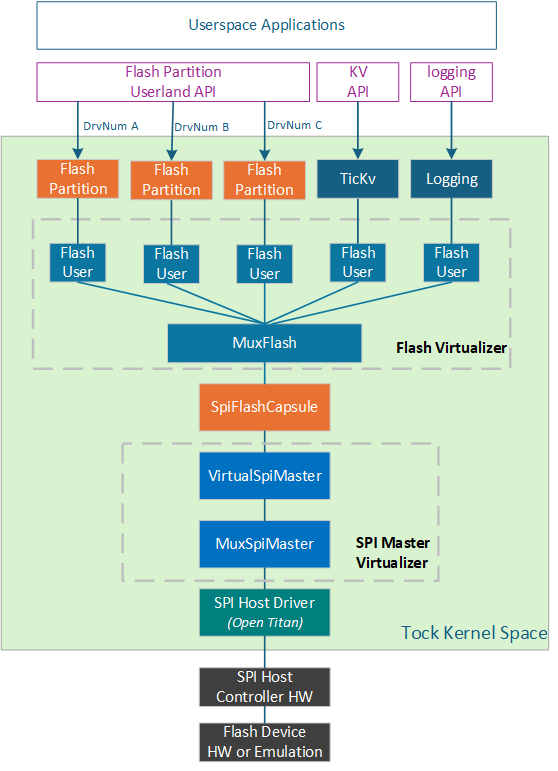
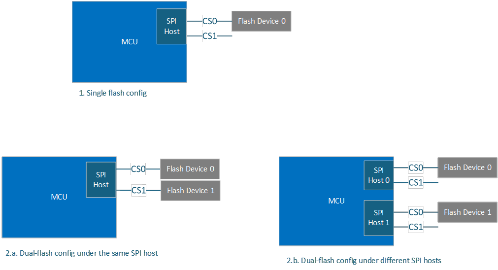

# SPI Support

## SPI Flash Stack

### Overview

The SPI flash stack in the Caliptra MCU is designed to provide efficient and reliable communication with SPI flash memory devices. This document outlines the architecture, components, and data flow within the SPI flash stack.

### Architecture

The SPI flash stack design leverages TockOS's support on SPI controller and flash device in the kernel space.
As illustrated in the diagram, it consists of the following layers.



- Kernel HIL (Hardware Interface Layer) for SPI host and flash device
  - `kernel::hil::spi` module, defines the hardware interface layer (HIL) traits for interacting with SPI (Serial Peripheral Interface) devices. These traits provide a standardized interface for configuring SPI settings, and performing read, write, and transfer operations over the SPI bus.
  - `kernel::hil::flash` module, defines the hardware interface layer (HIL) traits for interacting with flash memory.
   These traits provide a standardized interface for reading, writing, and erasing flash storage pages. By implementing these traits, different flash memory drivers can expose a consistent API to the rest of the kernel.

- SPI Host Driver
  - Provides the functionality needed to control an SPI bus as a master device. It defines the memory-mapped registers for the SPI hardware, provides methods to configure the SPI bus settings, such as clock polarity and phase and to initiate read, write, and transfer operations. It implements the `SpiMaster` trait, providing methods for reading from, writing to, and transferring data over the SPI bus. It handles the completion of SPI operations by invoking client callbacks, allowing higher-level components to be notified when an SPI operation completes.
  - SPI host driver implementation is specific to SPI host controller IP.

- SPI Flash Device Driver (capsule)
  - Provides the functionality required to interact with flash memory hardware.It implements the `kernel::hil::flash::Flash` trait, which defines the standard interface (read, write, erase) page-based operations.
    Additional methods could be provided in the driver:
    - Initialize the SPI flash device and configure settings such as clock speed, mode, and other parameters.
    - Check the status of the flash device, such as whether it is busy or ready for a new operation.
	- Erase larger regions of flash memory, such as sectors or blocks, in addition to individual pages.
    - Read the device ID, manufacturer ID, or other identifying information from the flash device.
    - Retrieve information about the flash memory layout, such as the size of pages, sectors, and blocks from SFDP.
    - Advance read/write operations by performing fast read or write operations using specific commands supported by the flash device.
- Flash Partition Capsule
    - This module defines the flash partition, manage access to each partition, and provide methods for reading, writing, and erasing arbitary length of data within the partitions. Each partition is represented by a FlashUser, which can leverage the exisiting flash virtualizer layer to ensure flash operations are serialized and managed correctly. This module implements the syscall driver trait to expose the flash partitions to userspace applications.

- Userland APIs (TBD)

### Components and Interfaces

- **Flash partition capsule interface**:

```

enum AccessPermission {
    ReadOnly,
    ReadWrite,
}

pub struct FlashPartition<'a, F: Flash + 'a> {
    flash_user: &'a FlashUser<'a, F>,
    start_address: usize,
    size: usize,
    permission: AccessPermission,
    client: OptionalCell<&'a dyn FlashPartitionClient>,
}

/// Client interface for flash partition.
pub trait FlashPartitionClient {
    ///`read_done` is called when the implementor is finished reading in to the
    /// buffer. The callback returns the buffer and the number of bytes that
    /// were actually read.
    fn read_done(&self, buffer: &'static mut [u8], length: usize);

    /// `write_done` is called when the implementor is finished writing from the
    /// buffer. The callback returns the buffer and the number of bytes that
    /// were actually written.
    fn write_done(&self, buffer: &'static mut [u8], length: usize);

    /// `erase_done` is called when the implementor is finished erasing the
    /// specified region. The callback returns the number of bytes
    /// that were actually erased.
    fn erase_done(&self, length: usize);
}

/// Driver for read, write and erase operations on the flash partition
impl<'a, F: Flash + 'a> FlashPartition<'a, F> {
    /// Create a new flash partition.
    pub fn new(flash_user: &'a FlashUser<'a, F>, start_address: usize, size: usize, permission: AccessPermission) -> FlashPartition<'a, F> {
    }

    /// Set the client for flash partition operations.
    pub fn set_client(&self, client: &'a dyn FlashPartitionClient) {
    }

    /// Read `length` bytes starting at address `offset` in to the provided
    /// buffer. The buffer must be at least `length` bytes long. The address
    /// must be in the address space of the physical storage.
    pub fn read(&self, buffer: &'static mut [u8], offset: usize, length: usize) -> Result<(), ErrorCode> {
    }

    /// Write `length` bytes starting at address `offset` from the provided
    /// buffer. The buffer must be at least `length` bytes long.
    fn write(&self, buffer: &'static mut [u8], offset: usize, length: usize) -> Result<(), ErrorCode> {
    }

    /// Erase `length` bytes starting at address `offset.
    pub fn erase(&self, offset: usize, length: usize) -> Result<(), ErrorCode> {
    }
}

/// Client for flash partition operations
impl<'a, F: Flash + 'a> FlashPartitionClient for FlashPartition<'a, F> {
    fn read_done(&self, buffer: &'static mut [u8], length: usize) {
    }

    fn write_done(&self, buffer: &'static mut [u8], length: usize) {
    }

    fn erase_complete(&self, result: Result<(), ErrorCode>) {
    }
}
```
- **Flash Syscall Driver interface**


```

/// Syscall driver number.
use capsules_core::driver;
pub const DRIVER_NUM: usize = driver::NUM::FlashPartition as usize;

pub struct AppFlashPartition<'a, F: Flash + 'a> {
    partitions: [&'a FlashPartition<'a, F>; N],
     // Per-app state.
    apps: Grant<FlashGrant>,
    current_app: OptionalCell<ProcessId>,
    // other fields ...
}

pub struct FlashGrant {
    read_buffer: ReadableProcessBuffer,
    write_buffer: WriteableProcessBuffer,
    callback: OptionalCell<Callback>,
}

impl<'a, F: Flash + 'a> SyscallDriver for AppFlashPartition<'a, F> {
    fn command(&self, command_number: usize, arg1: usize, arg2: usize, process_id: ProcessId) -> CommandReturn {
        match command_number {
            0 => CommandReturn::success(),
            1 => {
                // Read operation

            }
            2 => {
                // Write operation

            }
            3 => {
                // Erase operation
            }
            _ => CommandReturn::failure(ErrorCode::NOSUPPORT.into()),
        }
    }

    fn allow_readwrite(
        &self,
        process_id: ProcessId,
        readwrite_number: usize,
        buffer: Option<WriteableProcessBuffer>,
    ) -> Result<(), ErrorCode> {
    }

    fn allow_readonly(
        &self,
        process_id: ProcessId,
        readonly_number: usize,
        buffer: Option<ReadableProcessBuffer>,
    ) -> Result<(), ErrorCode> {
    }

    fn subscribe(
        &self,
        subscribe_number: usize,
        callback: Option<Callback>,
        process_id: ProcessId,
    ) -> Result<Callback, (Option<Callback>, ErrorCode)> {
    }

}
```

- **SPI Flash Device Driver Interface**

```
// Define the flash command opcode
pub enum FlashCommand {
    NoOp = 0x00,                // No-op
    WriteStatusRegister = 0x01, // Write status register
    PageProgram = 0x02,         // Page program
    Read = 0x03,                // Normal read
    WriteDisable = 0x04,        // Write disable
    ReadStatusRegister = 0x05,  // Read status register
    WriteEnable = 0x06,         // Write enable
    FastRead = 0x0b,            // Fast read
    FourByteFastRead = 0x0c,    // Fast read with 4 byte address
    FourBytePageProgram = 0x12, // Page program with 4 byte address
    FourByteRead = 0x13,        // Normal read with 4 byte address
    SectorErase4K = 0x20,       // Sector erase 4kB
    FourByteSectorErase4K = 0x21, // Sector erase 4kB with 4 byte address
    DualRead = 0x3b,            // Dual output read
    FourByteDualRead = 0x3c,    // Dual output read with 4 byte address
    ReadSFDP = 0x5a,            // Read SFDP registers
    ResetEnable = 0x66,         // Reset enable
    QuadRead = 0x6b,            // Quad output read
    FourByteQuadRead = 0x6c,    // Quad output read with 4 byte address
    ReadFlagStatusRegister = 0x70, // Read flag status register
    Reset = 0x99,               // Reset device
    ReadIdentification = 0x9f,  // Read identification
    Enter4ByteMode = 0xb7,      // Enter 4-byte mode
    DeepPowerDown = 0xb9,       // Deep power down the device
    ChipErase = 0xc7,           // Chip erase
    BlockErase64K = 0xd8,       // Block erase 64kB
    Exit4ByteMode = 0xe9,       // Exit 4-byte mode
    QuadIORead = 0xeb,          // Quad I/O read
    FourByteQuadIORead = 0xec,  // Quad I/O read with 4 byte address
}

pub struct SpiFlash<'a, S: SpiMasterDevice + 'a> {
    spi: &'a S,
    state: SpiFlashState,
    client: OptionalCell<&'a dyn FlashClient<S>>,
    buffer: OptionalCell<&'static mut [u8]>,
    // Other fields
}

pub struct SpiFlashState {
    pub addr_mode: u16,                // The current address mode of the SPI flash device.
    pub device_id: [u8; 3],            // Device identification data.
    pub device_size: u32,              // The total capacity of the flash device.
    pub command: SpiFlashCommands,     // Commands to use with the flash device.
    pub capabilities: u32,             // Capabilities of the flash device.
    pub use_fast_read: bool,           // Flag to use fast read for SPI reads.
    pub use_busy_flag: bool,           // Flag to use the busy status instead of WIP.
    pub switch_4byte: u8,              // Method for switching address mode.
    pub reset_3byte: bool,             // Flag to switch to 3-byte mode on reset.
    pub quad_enable: u8,               // Method to enable QSPI.

   // Other fields ..
}

/// Implement SFDP


impl<'a, S: SpiMasterDevice + 'a> SpiFlashDevice<'a, S> {

    ///	Completely initialize a SPI flash interface and device so it is ready for use. It includes:
    /// - Initializing the SPI flash interface.
    /// - Configuring the interface and device based on discovered properties.
    ///	- Detecting the address mode of the device.
    pub fn initialize_device(&self, fast_read: bool, wake_device: bool, reset_device: u8, drive_strength: bool) -> Result<(), FlashError> {
        // Implement the logic to initialize the SPI flash device
        Ok(())
    }

    pub fn device_properties_discovery(&self) -> Result<(), FlashError> {
        // Implement the logic to discover device properties from SFDP
        Ok(())
    }

    pub fn get_device_id(&self) -> Result<[u8; 3], FlashError> {
        // Implement the logic to get the device ID
        Ok(self.state.device_id)
    }

    pub fn get_device_size(&self) -> Result<u32, FlashError> {
        // Implement the logic to get the device size
        Ok(self.state.device_size)
    }

    pub fn process_cmd(&self, cmd: &[u8], response: &mut [u8]) -> Result<(), FlashError> {
        // Implement the logic to process a command
        Ok(())
    }
    ....

}

impl<'a, F: hil::flash::Flash> hil::flash::Client<F> for SpiFlash<'a, S> {
    fn set_client(&self, client: &'a dyn FlashClient<S>) {
        self.client.set(client);
    }

    fn read_page(&self, address: usize, buffer: &'static mut S::Page) -> Result<(), (ErrorCode, &'static mut S::Page)> {
        // Implement read logic

    }

    fn write_page(&self, address: usize, buffer: &'static mut S::Page) -> Result<(), (ErrorCode, &'static mut S::Page)> {
        // Implement write logic
        Ok(())
    }

    fn erase_page(&self, address: usize) -> Result<(), ErrorCode> {
        // Implement erase logic
        Ok(())
    }
}

```

### SPI flash configuration within kernel space



- **Single-flash configuration**
   - Instantiate SPI host interface
   - Instantiate SPI flash device interface
   - Initialize SPI flash device
   - Initialize MuxFlash
   - Initialize SPI flash partition capsule and register with kernel


- **Dual-flash configuration** (under same SPI controller)

- **Multiple SPI host/flash configuration**


### Flash-based logging
TBD


### Flash-based KV store
TBD
