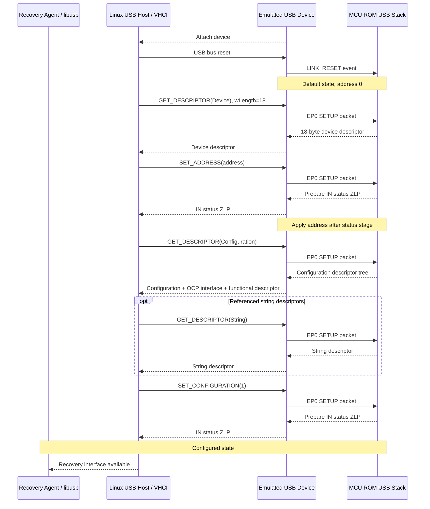
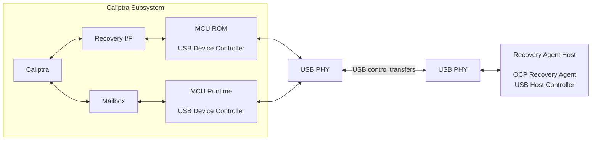
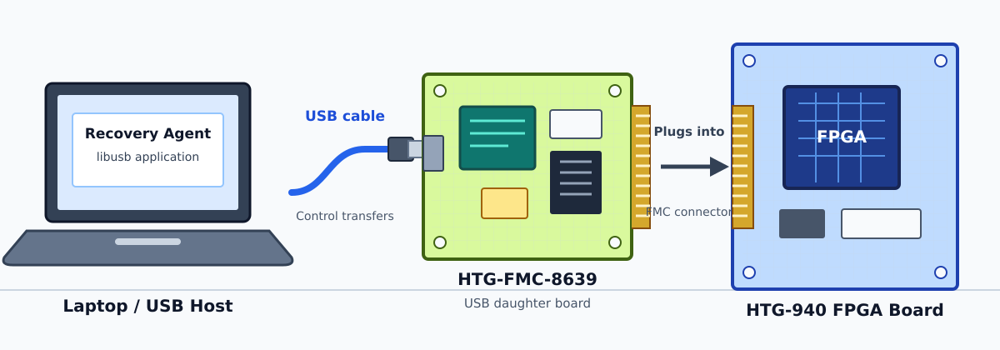
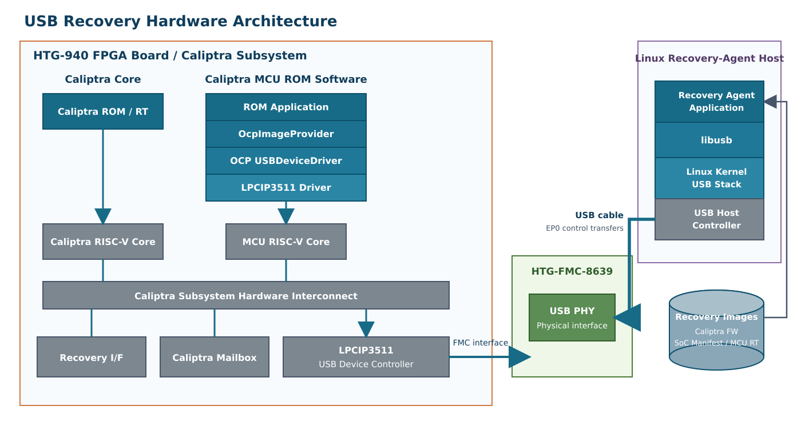
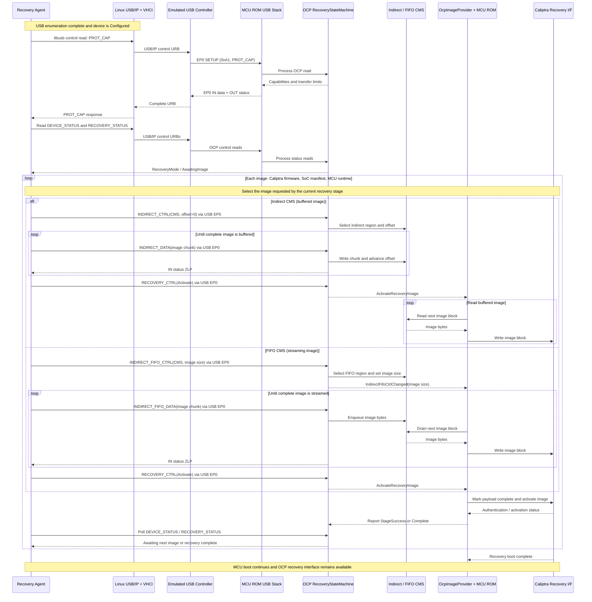
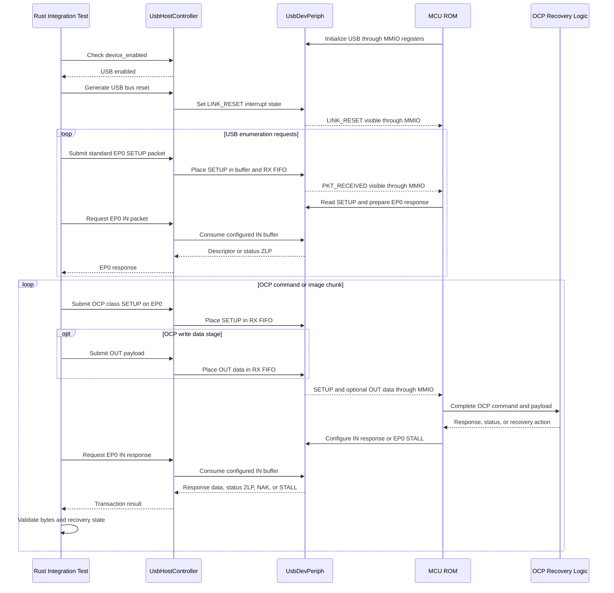
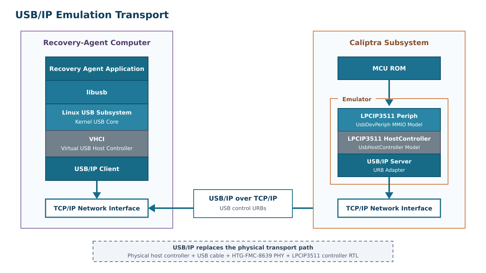

# USB Recovery Emulation Design

## 1. Purpose

This document defines how to develop and validate OCP Secure Firmware Recovery over USB before the VCK190 USB RTL is available. The design provides a software model of the USB device controller used by the RISC-V CPU, a host-side recovery-agent connection, and a migration path that preserves the RISC-V firmware when RTL and a USB PHY become available.

The repository already contains the first, in-process version of this architecture:

- an OpenTitan-derived `usbdev` register map;
- an MMIO peripheral model connected to the RISC-V emulator;
- a reference RISC-V USB device driver;
- OCP USB descriptors, SETUP-packet parsing, and a transport-independent recovery state machine; and
- integration tests that enumerate the device and transfer recovery images.

The remaining design work is primarily to expose the emulated USB host outside the test process, complete USB control-transfer semantics, and establish RTL parity criteria.

## 2. Goals and non-goals

### 2.1 Goals

1. Run the same RISC-V USB driver and OCP Recovery logic against emulated and FPGA USB controllers.
2. Let the production-style recovery-agent application access the emulated device through USB/IP and `libusb`.
3. Validate enumeration, EP0 control transfers, OCP command handling, image streaming, recovery activation, reset, STALL, and timeout behavior.
4. Keep USB transaction handling deterministic while presenting the device through the Linux USB/IP infrastructure.
5. Present the emulated device to Linux through USB/IP so an unmodified `libusb` recovery agent can be tested.
6. Make known differences between transaction-level emulation and physical USB explicit.

### 2.2 Non-goals

The base emulator will not model D+/D- signaling, PHY analog behavior, NRZI encoding, bit stuffing, packet CRC generation, electrical timing, hub behavior, or signal integrity. Those require RTL simulation, FPGA testing, USB protocol analyzers, and USB compliance testing.

Bulk or interrupt endpoints are not required by OCP Recovery v1.1. The initial implementation is EP0-only. Other composite-device interfaces are outside this design except that their absence or STALL behavior must not prevent access to the recovery interface.

## 3. References

- [OCP Secure Firmware Recovery Specification v1.1](../../ocp-recovery-document-1p1-final.md), especially sections 8.5, 8.5.1 through 8.5.6, and section 9.
- [OCP Recovery Integrator Guide](./ocp_recovery_integrator_guide.md).
- [Network Recovery Boot](./network_boot.md), used as the repository pattern for separating an emulated peripheral from a host backend.
- USB 2.0 specification, chapters 5, 8, and 9.
- OpenTitan `usbdev` programming model represented by `hw/usbdev.rdl`.

## 4. Terminology

| Term                | Meaning in this document                                                                                               |
| ------------------- | ---------------------------------------------------------------------------------------------------------------------- |
| Device              | The Caliptra MCU subsystem exposing OCP Recovery over USB. It is always a USB device, not a USB host.                  |
| Recovery Agent (RA) | Host software that discovers the recovery interface and sends OCP Recovery commands and images.                        |
| EP0                 | The mandatory bidirectional USB control endpoint.                                                                      |
| USB controller      | RTL or emulator peripheral that presents the`usbdev` MMIO register contract to RISC-V firmware.                      |
| USB device driver   | RISC-V firmware that owns enumeration, EP0 buffers, and control-transfer state.                                        |
| OCP state machine   | Transport-independent command, status, CMS, and activation logic in`common/ocp`.                                     |
| CMS                 | Component Memory Space exposed by OCP Recovery, using indirect or FIFO access.                                         |
| USB/IP adapter      | Emulator component that exports the emulated controller as a USB/IP device and translates URBs into host transactions. |

## 5. USB protocol overview

### 5.1 Topology and roles

USB is host scheduled. The RA's host controller initiates every transfer; the recovery device never sends a packet without first receiving an IN token. The device advertises its presence, responds to enumeration, and then accepts class-specific OCP requests on EP0.

This differs from network boot. In network boot, firmware is a network client that discovers a server and downloads images. In USB Recovery, MCU firmware is the USB device and OCP responder, while an external RA pushes or reads recovery data.

### 5.2 Enumeration

After attach and bus reset, the device enters the Default state at address zero. A minimum enumeration sequence is:

A robust implementation must also tolerate repeated and short descriptor reads, a new SETUP packet aborting an active control transfer, and a bus reset at any point.

### 5.3 EP0 control transfers

Every control transfer begins with an eight-byte SETUP packet and has one of these forms:

**Control write, host to device**

1. SETUP packet with direction OUT and actual payload length in `wLength`.
2. Zero or more OUT data packets.
3. Device returns an IN zero-length packet (ZLP) as status.

**Control read, device to host**

1. SETUP packet with direction IN and requested maximum length in `wLength`.
2. Device returns zero or more IN data packets.
3. Host sends an OUT ZLP as status.

For the current Full-Speed-style `usbdev` model, EP0 maximum packet size is 64 bytes. A transfer may be larger than one packet. All non-final data packets are 64 bytes. A short packet or required ZLP terminates a device-to-host data stage before `wLength`; receiving exactly `wLength` also terminates it.

A SETUP packet resets EP0 data toggles and clears an endpoint halt for the new control transfer. NAK means the endpoint is temporarily not ready and should be retried. STALL means the request cannot be serviced and requires host recovery.

### 5.4 What the transaction-level emulator validates

The emulator validates software-visible behavior:

- MMIO register programming;
- buffer ownership and FIFO depth;
- endpoint enable, NAK, STALL, and ready state;
- packetization at EP0 maximum packet size;
- interrupt status and clearing behavior;
- enumeration and control-transfer state;
- OCP framing, state transitions, and image flow; and
- reset and software error recovery.

CRC, PID, and bit-stuffing failures are represented by fault-injection events and status bits rather than calculated from a serial bitstream.

## 6. OCP Recovery over USB

### 6.1 High-level boot architecture

Unlike network recovery, USB recovery does not use a separate boot coprocessor.
MCU ROM runs the USB device stack and OCP recovery responder. The host-side
Recovery Agent discovers the device and pushes images from its image store over
EP0 control transfers.

### 6.2 Physical hardware and software stacks

#### Demo Setup

The recovery-agent connects by USB to the HTG-FMC-8639 daughter
board. The daughter board plugs into the HTG-940 FPGA board through its FMC
connector.

    

#### System Architecture

    

HTG-FMC-8639 : Board containing USB Phy NXP lpcip3511
HTG-940: FPGA Board with Caliptra SubsystemIP

### 6.3 Descriptors

The OCP v1.1 recovery function uses a composite-device descriptor at device level and identifies recovery at interface level.

| Descriptor field                   | Required value                                                                   |
| ---------------------------------- | -------------------------------------------------------------------------------- |
| Device class/subclass/protocol     | `0x00/0x00/0x00`                                                               |
| Recovery interface class           | `0xEF` (Miscellaneous)                                                         |
| Recovery interface subclass        | `0x08`                                                                         |
| Recovery interface protocol        | `0x01`                                                                         |
| Recovery interface number          | `0` recommended                                                                |
| Additional endpoints               | None; EP0 is used                                                                |
| Functional descriptor type/subtype | `0x24/0x01`                                                                    |
| Advertised maximum transfer sizes  | `wMaxWrTransferSize` and `wMaxRdTransferSize` must each be at least 64 bytes |

The class-specific functional descriptor advertises `wMaxWrTransferSize`, `wMaxRdTransferSize`, and the OCP Recovery version. The current reference driver advertises 1024-byte read and write transfers while packetizing each transfer into at most 64-byte EP0 packets.

The final VID, PID, strings, maximum transfer sizes, power attributes, and composite-interface layout are platform configuration, not emulator-only constants. The emulator and VCK190 firmware must derive them from one shared configuration or compare them in parity tests.

### 6.4 Command encapsulation

One OCP command maps to exactly one EP0 control transfer. The SETUP packet is:

| Field             | OCP read                                                       | OCP write                                                  |
| ----------------- | -------------------------------------------------------------- | ---------------------------------------------------------- |
| `bmRequestType` | `0xA1`: device-to-host, class, interface                     | `0x21`: host-to-device, class, interface                 |
| `bRequest`      | `0x00`                                                       | `0x00`                                                   |
| `wValue[0]`     | OCP command ID                                                 | OCP command ID                                             |
| `wValue[1]`     | `0x00`                                                       | `0x00`                                                   |
| `wIndex[0]`     | Recovery interface number                                      | Recovery interface number                                  |
| `wIndex[1]`     | `0x00`                                                       | `0x00`                                                   |
| `wLength`       | Exactly advertised`wMaxRdTransferSize` according to OCP v1.1 | Actual data length, not greater than`wMaxWrTransferSize` |

Fields and OCP payloads are little-endian. The USB driver removes USB framing and presents `(RecoveryCommand, RecoveryRequest)` to the OCP state machine.

### 6.5 Layering

The USB layer owns enumeration, packetization, NAK, STALL, and status stages. The OCP layer owns command legality, `PROT_CAP`, device and recovery status, CMS selection, image activation, and protocol error reporting. ROM/platform code owns the policy for consuming an activated image and advancing to the next boot stage.

### 6.6 Image transfer

After enumeration, the RA discovers the device capabilities and transfers each required image using either an indirect (buffered) CMS or a FIFO (streaming) CMS. The enumeration exchange is omitted here because it is shown in Section 5.2.

Every arrow marked "via USB EP0" represents one complete OCP control transfer through `libusb`, USB/IP, the emulated controller, and the MCU ROM USB stack. Reporting `StageSuccess` or `Complete` corresponds to calling `RecoveryStateMachine::complete_activation` after the Caliptra recovery interface returns the image result; the ROM adapter must wire this completion path. OCP transfer size and USB packet size are independent. For example, a 1024-byte `INDIRECT_FIFO_DATA` command is one OCP control transfer containing sixteen 64-byte USB packets.

### 6.7 Error hierarchy

Errors must be handled at the layer where they originate:

| Layer               | Examples                                                              | Expected behavior                                                            |
| ------------------- | --------------------------------------------------------------------- | ---------------------------------------------------------------------------- |
| USB link/controller | CRC, PID, bit stuffing, lost host, FIFO overflow                      | Set controller status/interrupt; discard or retry the packet as appropriate. |
| USB control pipe    | Unsupported standard request, invalid direction/recipient, bad length | STALL EP0 or complete the request according to USB chapter 9.                |
| OCP protocol        | Unsupported command or parameter, invalid CMS, wrong command length   | Record OCP`PROTOCOL_ERROR`; preserve a usable recovery interface.          |
| Image/boot policy   | Authentication failure, bad image order, activation failure           | Report recovery status and follow ROM image-provider policy.                 |

OCP v1.1 defines host escalation after a STALL: first clear endpoint halt, then perform a port or bus reset if recovery does not resume. The device must flush partial EP0 state and remain capable of re-enumeration without depending on mutable flash.

## 7. Existing repository implementation

### 7.1 Register contract

`hw/usbdev.rdl` defines the software-visible contract. Generated firmware and emulator register crates are built from this source. Important resources are:

- `USBCTRL` for enable and device address;
- endpoint IN/OUT and SETUP enable registers;
- available SETUP and OUT buffer FIFOs;
- `RXFIFO` entries containing buffer ID, packet size, SETUP indication, and endpoint;
- `CONFIGIN_0` and `IN_SENT` for IN packet ownership and completion;
- IN/OUT STALL and NAK controls;
- interrupt state, enable, and test registers; and
- packet buffer SRAM.

The peripheral is currently documented and modeled at `0x0900_0000`, with USB interrupt 26 in the MCU root bus. These values must be checked against the final FPGA address map and interrupt assignment rather than copied independently.

### 7.2 Emulator peripheral

`emulator/periph/src/usbdev.rs` implements `UsbDevPeriph` and shares `UsbDevState` with a cloneable `UsbHostController` through `Arc<Mutex<_>>`.

Firmware sees generated MMIO registers. The host side can inject SETUP, OUT, IN, SOF, and bus-reset events. The model currently provides:

- four-entry available SETUP FIFO;
- eight-entry available OUT FIFO;
- eight-entry receive FIFO;
- 64-byte packets backed by 16 32-bit words per buffer;
- endpoint enable, NAK, STALL, ready, and sent semantics;
- level-sensitive packet/FIFO interrupts plus latched event interrupts; and
- W1C handling for interrupt and sent state.

The standalone emulator connects the peripheral to interrupt 26. Some hardware-model construction paths instantiate it without an IRQ, and tests therefore rely on polling. IRQ-driven firmware needs a test configuration that wires the IRQ in all relevant models.

### 7.3 RISC-V driver and OCP stack

`platforms/emulator/rom/usb/src/lib.rs` provides the reference `ExamplarUsbDriver`. It configures EP0, manages four packet buffers, performs minimal enumeration, assembles OUT packets into a 1024-byte transfer buffer, segments IN responses, and implements `UsbDeviceDriver`.

`common/ocp/src/usb` defines descriptors, SETUP parsing, and the driver trait. `RecoveryStateMachine` in `common/ocp/src/interface.rs` is independent of MMIO details. `OcpImageProvider` in `rom/src/recovery/ocp.rs` adapts recovery actions to the ROM image-provider interface.

This separation is the central portability requirement: the VCK190 integration may replace the MMIO driver if the RTL programming model changes, but it must not fork the OCP state machine or host protocol.

### 7.4 Host test controller

`hw/model/src/usb_ctrl.rs` drives control-transfer stages while stepping the CPU model. It includes descriptor enumeration and OCP read/write helpers. Integration tests in `tests/integration/src/test_usb_ocp_recovery.rs` validate capabilities, status, protocol errors, indirect image loading, FIFO image loading, and recovery after malformed commands.

This backend is deterministic and appropriate for CI, but it is an in-process Rust API. It does not currently appear as a USB device to an external application.

### 7.5 Current integration-test sequence

The current tests emulate a USB host at the transaction level. The Rust test
harness owns a `UsbHostController`, while MCU ROM accesses `UsbDevPeriph`
through the OpenTitan-derived `usbdev` MMIO register interface used by RTL.

There are two related test levels:

- `hw/model/src/lib.rs::test_usb_ocp_recovery` loads the dedicated test firmware from `hw/model/test-fw/usb-ocp-recovery`. That firmware uses `ExamplarUsbDriver` and implements a small OCP responder for focused driver and EP0 testing.
- `tests/integration/src/test_usb_ocp_recovery.rs` boots the ROM recovery path and combines `ExamplarUsbDriver`, `RecoveryStateMachine`, `OcpImageProvider`, CMS storage, and the three-stage recovery-image flow.

This setup emulates host transactions, device-controller registers, and the RISC-V CPU, but it does not emulate a standard Linux USB host stack. It does not currently involve `libusb`, VHCI, USB/IP, xHCI/EHCI, or physical USB signaling. The proposed USB/IP server will translate Linux control URBs into the same `UsbHostController` operations, preserving the existing device-peripheral and firmware path.

## 8. Proposed emulator architecture

### 8.1 Architecture

    

Unlike network boot, USB Recovery does not need a third RISC-V coprocessor. The Linux recovery agent is the USB host and pushes images through `libusb`, the Linux virtual host controller, and USB/IP. Inside the emulator, the USB/IP adapter converts URBs into host transactions for the emulated USB device peripheral. MCU firmware sees only the `usbdev` MMIO programming model and therefore follows the same driver path intended for RTL.

The host transaction engine converts each USB/IP control URB into SETUP, packetized data, and status stages. Existing in-process tests may continue using `UsbHostController` as test infrastructure, but they are not a proposed application-facing backend. The supported external architecture is USB/IP.

USB/IP replaces the physical USB transport, not the USB software stacks. The
Recovery Agent still uses `libusb` and the Linux USB subsystem. MCU ROM still
uses its `UsbDeviceDriver` implementation and accesses `UsbDevPeriph` through
the same MMIO contract used by RTL. VHCI and the USB/IP client serialize USB
requests as URBs over TCP/IP. The USB/IP server converts those URBs into
transactions for `UsbHostController`.

The USB/IP adapter should expose these operations to its internal transaction engine:

- attach and detach;
- bus reset;
- complete EP0 control transfer with SETUP fields, optional OUT data, requested IN length, and timeout;
- optional SOF/suspend/resume events;
- query connection/controller state for diagnostics; and
- inject a named controller fault for tests.

The result of a control transfer is success plus IN data, STALL, timeout/disconnect, or a USB/IP error. NAK and temporary lack of a device buffer are internal retry conditions until timeout. USB/IP sequence numbers prevent a timed-out or unlinked request from consuming a later response.

### 8.2 USB/IP implementation

USB/IP is the selected external application-development backend. A Linux USB/IP server presents the emulated device to the kernel's virtual host controller, allowing ordinary discovery and `libusb` control-transfer APIs to be exercised without changing the RA. The same high-level RA and `libusb` transport can therefore target the emulator now and the physical VCK190 later.

The adapter maps one EP0 URB to one host-engine control transfer:

- successful IN transfer returns collected data and actual length;
- successful OUT transfer returns the transmitted length;
- STALL maps to the host's pipe error;
- disconnect maps to no-device;
- NAK remains pending until completion or timeout; and
- unlink cancels the matching sequence number.

USB/IP does not validate PHY-level behavior and requires Linux USB/IP kernel setup to attach the virtual device. It is the application-facing emulation path and validates the real RA, `libusb`, Linux USB stack, enumeration, and recovery control transfers.

### 8.3 Concurrency and determinism

USB/IP server threads must never write firmware MMIO directly. They submit bounded host events to the model and wait for completion. The emulator main loop continues stepping the RISC-V CPU and polling the peripheral. Peripheral state changes remain serialized under the existing state lock or, preferably, through bounded request/response queues.

The USB/IP adapter must not block the emulator while holding the device-state lock. Retries occur after releasing the lock. Transaction processing uses emulator cycle deadlines and a wall-clock watchdog so a stopped emulator cannot retain a USB/IP client forever.

### 8.4 Configuration

Add an emulator option to enable or disable USB/IP export. Associated options select bind address/port, exported USB bus and device ID, VID/PID override for development, attach-on-start, transfer timeout, and fault-injection policy. USB/IP export remains disabled unless explicitly selected.

Defaults must be safe:

- no externally reachable TCP listener;
- loopback-only TCP by default;
- bounded transfer and queue sizes;
- no USB/IP kernel attachment performed automatically; and
- no host image accepted until firmware has enabled the device.

Descriptor values should come from firmware responses, with only the minimum metadata duplicated by a USB/IP export layer. Startup should reject incompatible configured and firmware VID/PID/speed values.

## 9. Firmware architecture

### 9.1 Controller driver

The FPGA driver and emulator driver must implement the same responsibilities:

1. reset and configure controller/PHY state;
2. supply EP0 SETUP and OUT buffers before enabling pull-up;
3. handle bus reset by clearing address, configuration, toggles, stalls, partial transfers, and stale FIFO entries;
4. serve standard requests required for enumeration and recovery;
5. enforce interface number, direction, reserved fields, and transfer-size limits;
6. assemble and segment multi-packet data stages;
7. return buffers to hardware without double ownership;
8. expose only complete OCP requests to the OCP state machine; and
9. map controller faults to driver errors and recovery behavior.

Polling is acceptable for early ROM bring-up. The long-term driver should support interrupts so runtime operation does not spin continuously. The protocol state machine must behave identically in either mode.

### 9.2 Minimum standard request support

Before FPGA parity, support and test at least:

- `GET_DESCRIPTOR` for device, configuration, and referenced strings;
- `SET_ADDRESS` with address applied after status completion;
- `SET_CONFIGURATION`, `GET_CONFIGURATION`;
- `GET_STATUS` for the appropriate recipient;
- `GET_INTERFACE` and `SET_INTERFACE` for alternate setting zero; and
- `CLEAR_FEATURE(ENDPOINT_HALT)` behavior needed by OCP error escalation.

Unsupported or malformed requests must STALL. A new SETUP or bus reset must safely abort any pending data/status stage.

### 9.3 Memory use

The current 1024-byte write buffer is convenient but costly in ROM and caps one OCP command. The platform must deliberately choose one of these designs:

- retain a fixed buffer and advertise that exact maximum;
- stream `INDIRECT_DATA`/`INDIRECT_FIFO_DATA` packets into a CMS while retaining small-command atomicity; or
- use controller DMA into staging SRAM.

The functional descriptor must never advertise more than the driver can receive atomically according to its chosen design. The initial parity target should retain the current 1024-byte limit; optimize only after behavior is stable.

### 9.4 Boot integration

USB OCP Recovery is an `ImageProvider`, not a replacement for ROM boot policy. `ImageProviderManager` determines whether USB is always available, attempted after flash/I3C failure, retried forever, or bounded by policy.

The recovery interface must remain independent of corrupt mutable flash. Static descriptors, the EP0 driver, minimum OCP commands, CMS staging, and reset handling must fit in the trusted boot environment needed to perform recovery.

## 10. Network-emulation comparison

| Network boot pattern                 | USB Recovery equivalent                           |
| ------------------------------------ | ------------------------------------------------- |
| `Ethernet` MMIO model              | `UsbDevPeriph` MMIO model                       |
| Generated Ethernet register contract | Generated`usbdev` register contract             |
| `TapDevice` trait                  | USB/IP adapter/host-transaction boundary          |
| Linux TAP backend                    | USB/IP server and Linux VHCI                      |
| Dummy/injected frame backend         | Existing`UsbHostController` test infrastructure |
| Network CPU runs DHCP/TFTP client    | MCU CPU runs USB device and OCP responder         |
| Remote TFTP server supplies images   | Recovery Agent supplies images                    |
| Frame queue and IRQ                  | USB packet FIFOs and IRQ                          |

The analogy stops at the backend boundary. USB Recovery does not require a separate emulated network CPU, IP stack, filesystem, DHCP, or TFTP. It does require a USB device stack sufficient for chapter-9 enumeration and EP0 transfers.

## 11. Reset and fault model

The emulator needs explicit events for:

- attach/power and detach/disconnect;
- bus reset;
- suspend, resume, SOF, and host-lost timeout;
- RX CRC, PID, and bit-stuff error;
- IN ACK failure/link error;
- OUT drop/link error;
- available-buffer overflow and RX FIFO full; and
- host cancellation or timeout during SETUP, data, or status.

A bus reset must reset USB protocol state while preserving only registers documented as reset-retained. It must not reboot the RISC-V CPU unless the final hardware specification couples those resets. Warm MCU reset, update reset, USB bus reset, and USB detach are separate events and need separate tests.

Fault injection should occur at named transaction boundaries, for example "drop the next OUT packet" or "signal CRC error on the next SETUP". Tests should assert both the controller status bit and eventual recovery-interface availability.

## 12. Validation plan

### 12.1 Peripheral unit tests

- register reset values and read/write/W1C behavior;
- buffer SRAM access and buffer ownership;
- FIFO depth, empty/full, and overflow behavior;
- endpoint enable, NAK, STALL, and SETUP-clears-stall behavior;
- interrupt assertion/deassertion;
- packet size boundaries: 0, 1, 63, 64, and 65 bytes;
- reset during each transaction stage; and
- injected controller error status.

### 12.2 USB device-driver tests

- enumeration from power-on and after repeated bus reset;
- short descriptor probe followed by full descriptor read;
- all minimum standard requests;
- control IN and OUT at 0, 1, 64, 65, 1023, and 1024 bytes;
- ZLP termination when response length is a multiple of 64 but less than `wLength`;
- a new SETUP aborting an active transfer;
- CLEAR_FEATURE after STALL;
- transfer larger than advertised maximum; and
- disconnect/reconnect while firmware is waiting.

### 12.3 OCP tests

Retain existing tests and add:

- verify all descriptor bytes and advertised transfer sizes;
- require RA reads to use advertised `wMaxRdTransferSize`;
- invalid `bmRequestType`, `wIndex`, reserved fields, and direction;
- unsupported command and clear-on-read `PROTOCOL_ERROR`;
- invalid CMS, malformed lengths, and recovery after each error;
- indirect and FIFO images using multi-packet OCP transfers, not only one 64-byte command per transfer;
- reset between image chunks and between three-stage images; and
- image authentication/activation failure reporting.

### 12.4 USB/IP tests

- run the complete production-style RA command suite over USB/IP;
- compare USB/IP USB/OCP traces with existing integration-test golden vectors;
- test fragmented TCP reads, oversized USB/IP requests, disconnect, URB unlink, and stale sequence numbers;
- run `libusb` discovery and recovery flow over USB/IP on an enabled Linux test runner; and
- fuzz SETUP packets and USB/IP framing with bounded memory and time.

### 12.5 FPGA parity tests

Run the same logical suite against the VCK190 using the physical USB transport:

1. compare device, configuration, functional, and string descriptors;
2. compare command responses and OCP status transitions;
3. transfer identical images with identical chunking;
4. exercise STALL clear and USB port reset;
5. measure enumeration and recovery throughput/timeouts;
6. capture hardware traces for packet/toggle/ZLP verification; and
7. add PHY, cable, hub, disconnect, suspend/resume, and repeated-reset tests not represented by the emulator.

A test vector should be transport-neutral above the `libusb` control-transfer operation so the same RA suite can run against USB/IP in emulation and physical USB on VCK190.

## 13. Implementation phases

### Phase 0: preserve and document the current baseline

- Keep the existing MMIO model, reference driver, OCP stack, and integration tests.
- Record descriptor and register behavior as golden vectors.
- Wire USB IRQ in hardware-model paths used for IRQ tests.

### Phase 1: complete USB transaction semantics

- Add one reusable complete-control-transfer engine.
- Implement multi-packet IN collection and OUT segmentation.
- Correct bus-reset, abort, address, configuration, STALL-clear, and standard-request behavior.
- Add deterministic fault injection and the validation cases above.

### Phase 2: USB/IP external RA backend

- Add USB/IP export on Linux.
- Validate unmodified `libusb` discovery and control transfers.
- Run the complete OCP image flow from the real RA in a separate process.
- Add transaction trace logging below the USB/IP adapter.

### Phase 3: hardening and diagnostics

- Harden USB/IP request parsing, bounds checking, disconnect, and URB unlink handling.
- Add USB/OCP transaction capture and replay diagnostics.
- Run existing peripheral unit tests alongside the USB/IP end-to-end suite.

### Phase 4: RTL and VCK190 migration

- Confirm final register, IRQ, clock/reset, PHY, speed, and DMA contracts.
- Run register-conformance tests against RTL simulation.
- Port only the controller-specific driver layer if the MMIO contract differs.
- Execute the same RA vectors used with USB/IP on the board, followed by electrical and compliance tests.

## 14. Current gaps and decisions required

### 14.1 Known gaps

1. The current external emulator application retains the host handle but exposes no socket or OS USB backend.
2. Host helpers generally model individual packets; complete multi-packet control transfers need a shared engine.
3. The reference enumeration implementation is intentionally minimal and lacks some chapter-9/error-recovery requests.
4. Bus reset currently signals an interrupt but does not yet model all controller and USB-state reset effects.
5. Link-level CRC/PID/bit-stuff behavior is not modeled beyond status-bit capability.
6. USB interrupt wiring differs between emulator construction paths.
7. The model uses 64-byte EP0 packets, as used by USB 2.0 Full Speed and High Speed. OCP recommends High Speed or faster. If VCK190 instead uses USB 3.x SuperSpeed, EP0 uses 512-byte packets, requiring corresponding controller buffers, firmware packetization, descriptor handling, and emulator changes. The final VCK190 speed/PHY choice is unresolved.

### 14.2 Platform decisions

Before freezing the FPGA driver, decide:

- whether the final RTL follows this exact OpenTitan-derived `usbdev` register contract;
- the VCK190 PHY and connector path and whether it supports device mode at the chosen speed;
- clock, reset, interrupt, and DMA integration;
- production VID/PID and descriptor ownership;
- static composite descriptors versus a recovery-only configuration;
- ROM versus runtime ownership and handoff of the USB controller;
- advertised maximum transfer sizes and buffer/DMA strategy;
- when USB becomes an active `ImageProvider` relative to flash, I3C, and network recovery; and
- required Linux distributions and USB/IP kernel/tooling setup for RA development and CI.

## 15. Acceptance criteria

The emulation design is ready for application development when:

- the production-style RA can use `libusb` over USB/IP to enumerate the emulated recovery function and transfer all three recovery images;
- the same RISC-V binary used by the emulator is suitable for the VCK190 controller contract, subject only to documented controller-specific driver changes;
- 1024-byte control reads and writes work through 64-byte packetization;
- reset, STALL clear, timeout, and malformed-request tests leave recovery operational;
- descriptors and OCP responses have golden vectors reusable on VCK190; and
- all emulator-only assumptions are listed in the FPGA parity checklist.

The FPGA integration is behaviorally compatible when the same RA suite passes unchanged over USB/IP and physical USB and descriptor/register parity tests show no unexplained difference.
